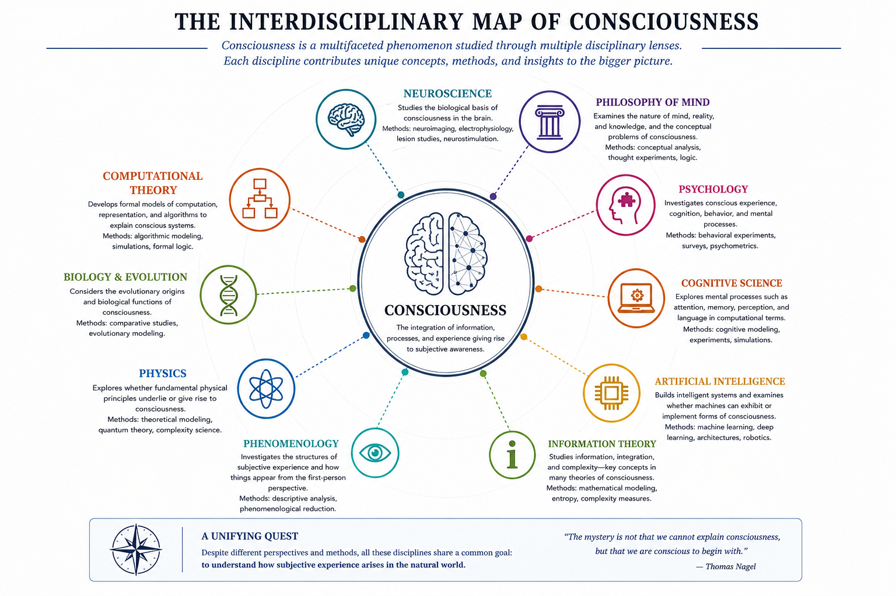
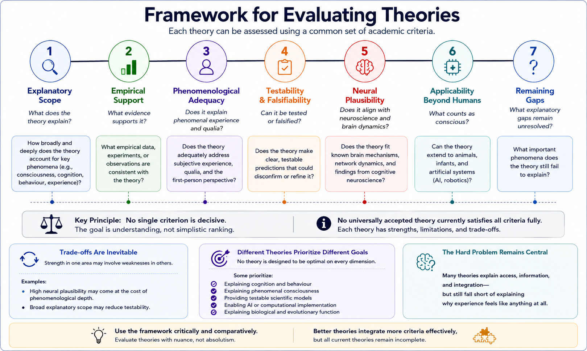
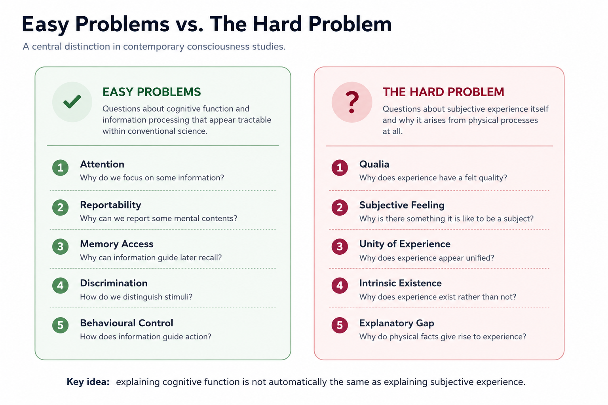
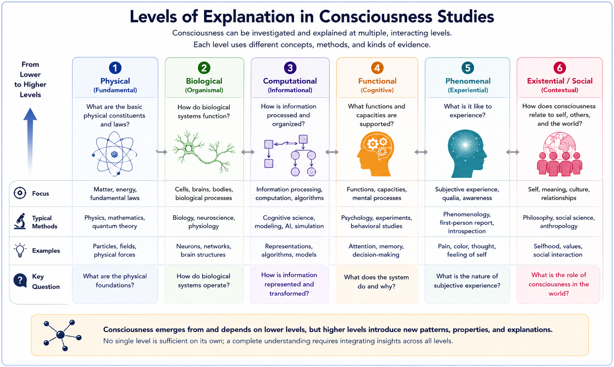
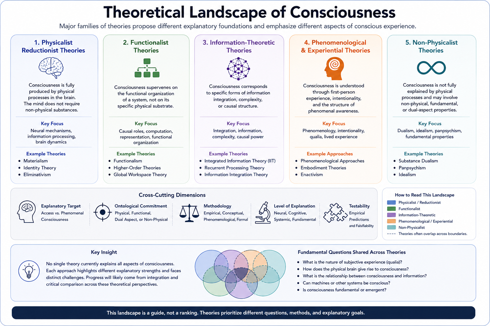

# Introduction to Consciousness Studies {#intro}

## Chapter Overview

Consciousness is both the most familiar and one of the most difficult phenomena to explain. Every perception, memory, emotion, scientific observation, mathematical proof, and philosophical reflection occurs within conscious awareness, yet the nature of consciousness itself remains deeply contested.

Modern science has achieved extraordinary success in explaining:

- physical systems;
- biological evolution;
- neural mechanisms;
- information processing;
- and complex behaviour.

However, explaining subjective experience — the felt quality of awareness itself — continues to present unusual conceptual and scientific challenges.

A person can describe:

- seeing colour;
- hearing music;
- feeling pain;
- imagining the future;
- recalling the past;
- or reflecting on the self.

Yet explaining why and how physical processes in the brain produce these first-person experiences remains controversial.

Questions concerning consciousness have persisted across:

- philosophy;
- psychology;
- neuroscience;
- cognitive science;
- artificial intelligence;
- and phenomenology

for centuries, suggesting that the problem may arise from deep tensions between:

- subjective experience;
and:
- objective scientific explanation itself.

This chapter introduces the conceptual foundations of consciousness studies, explains why consciousness remains theoretically difficult, and presents the interdisciplinary framework used throughout this book.

## Learning Objectives

After reading this chapter, the reader should be able to:

- Explain why consciousness presents unique scientific and philosophical challenges
- Distinguish different meanings of consciousness
- Describe major interdisciplinary approaches to consciousness research
- Explain the distinction between easy and hard problems
- Understand why theories of consciousness differ
- Describe the role of neuroscience, phenomenology, and computation
- Explain how consciousness theories are evaluated
- Understand why consciousness research remains theoretically pluralistic

## Why Consciousness Matters

Consciousness is central not only to philosophy, but also to:

- neuroscience;
- psychiatry;
- medicine;
- psychology;
- ethics;
- artificial intelligence;
- and human identity itself.

Questions concerning consciousness influence debates about:

- free will;
- personal identity;
- suffering;
- moral responsibility;
- animal minds;
- artificial intelligence;
- and the nature of reality.

Consciousness also has urgent practical importance in areas such as:

- anesthesia;
- coma and disorders of consciousness;
- dementia;
- psychiatric illness;
- pain management;
- and end-of-life care.

At the same time, advances in artificial intelligence increasingly raise questions concerning whether sophisticated computational systems might eventually possess some form of conscious awareness.

Understanding consciousness is therefore not merely an abstract philosophical exercise. It has direct implications for science, medicine, ethics, technology, and society.

## Consciousness as an Interdisciplinary Problem

Consciousness research sits at the intersection of multiple disciplines, each emphasizing different explanatory targets and methods.

These include:

- neuroscience;
- psychology;
- philosophy;
- computer science;
- information theory;
- physics;
- biology;
- psychiatry;
- phenomenology;
- and artificial intelligence.

Figure \@ref(fig:fig-interdisciplinary-map-intro) illustrates the interdisciplinary structure of contemporary consciousness research.

```{r fig-interdisciplinary-map-intro, echo=FALSE, fig.cap="An interdisciplinary conceptual map of consciousness research. Contemporary approaches emerge from neuroscience, philosophy, psychology, artificial intelligence, phenomenology, physics, biology, and information theory. Different disciplines emphasize different explanatory targets, methods, and assumptions regarding conscious experience.", out.width="95%", fig.align="center"}

```

As illustrated in Figure \@ref(fig:fig-interdisciplinary-map-intro), consciousness research spans multiple explanatory domains ranging from empirical neuroscience and cognitive science to phenomenology, metaphysics, computation, and physics.

Different disciplines approach consciousness differently.

### Neuroscience

Neuroscience investigates:

- neural correlates of consciousness;
- brain networks;
- wakefulness;
- perception;
- attention;
- and neural dynamics associated with conscious states.

### Philosophy

Philosophy asks:

- how subjective experience fits into a physical world;
- whether consciousness can be reduced to matter;
- and whether phenomenal experience can ever be fully explained scientifically.

### Cognitive Science

Cognitive science studies:

- attention;
- memory;
- perception;
- reasoning;
- information processing;
- and cognitive architecture.

### Artificial Intelligence

AI research raises questions concerning:

- machine consciousness;
- computation;
- self-modeling;
- and whether consciousness could emerge in non-biological systems.

### Phenomenology

Phenomenology investigates:

- lived experience;
- selfhood;
- embodiment;
- intentionality;
- and the structure of awareness itself.

Importantly, these disciplines often emphasize different explanatory goals. Some focus primarily on:

- behaviour;
- cognition;
- neural mechanisms;
- and information processing,

while others focus more directly on:

- subjective experience;
- embodiment;
- selfhood;
- and phenomenological structure.

This diversity helps explain why consciousness studies remain theoretically pluralistic.

## Why Consciousness Is Difficult to Study

Consciousness presents unusual methodological difficulties because it involves both:

- subjective first-person experience;
and:
- objective physical processes.

Science traditionally depends on:

- public observation;
- experimental measurement;
- and third-person description.

Conscious experience, however, is inherently first-personal.

Researchers therefore face the challenge of relating:

- subjective reports;
- neural activity;
- behaviour;
- physiological measures;
- and computational models

without reducing consciousness entirely to any single level of description.

Additional complications arise because consciousness is not a single unified phenomenon.

Different dimensions of consciousness can dissociate under conditions including:

- dreaming;
- anesthesia;
- neurological injury;
- meditation;
- psychedelic states;
- psychiatric disorders;
- and disorders of consciousness.

For example:

- a patient may be awake but minimally aware;
- a dreamer may be conscious without external perception;
- an anesthetized patient may retain residual processing without reportable awareness.

These cases suggest that consciousness involves multiple interacting dimensions rather than a single isolated process.

## Why Consciousness Is Different

Many scientific problems involve explaining:

- structure;
- mechanism;
- behaviour;
- or causal interaction.

Consciousness appears unusual because it also involves:

```text
subjective experience itself.
```

A complete neuroscientific description may explain:

- attention;
- perception;
- memory;
- decision-making;
- and information processing,

while still leaving unresolved why these processes should feel like anything from the inside.

This tension between:

- objective scientific explanation;
and:
- subjective first-person awareness

lies at the center of modern consciousness studies.

## Multiple Levels of Explanation

Consciousness research increasingly operates across multiple explanatory levels simultaneously.

These include:

- neural mechanisms;
- computational processes;
- cognitive architecture;
- embodiment;
- phenomenological structure;
- information integration;
- biological regulation;
- and metaphysical interpretation.

Figure \@ref(fig:fig-levels-intro) illustrates these interacting explanatory levels.

```{r fig-levels-intro, echo=FALSE, fig.cap="Multiple explanatory levels in consciousness research. Contemporary theories often emphasize neural, computational, phenomenological, embodied, informational, biological, or metaphysical dimensions simultaneously.", out.width="88%", fig.align="center"}

```

As illustrated in Figure \@ref(fig:fig-levels-intro), consciousness may not be fully explainable at a single level alone.

Different theories therefore emphasize different explanatory domains including:

- neural activity;
- computation;
- information integration;
- embodiment;
- phenomenology;
- or metaphysical structure.

This helps explain why no single theory currently dominates the field completely.

## Defining Consciousness

There is no universally accepted definition of consciousness.

Common meanings include:

- **Wakefulness:** being awake rather than asleep or comatose
- **Awareness:** access to information about oneself or the environment
- **Subjective experience:** there being something it is like to undergo a mental state
- **Self-consciousness:** awareness of oneself as the subject of experience
- **Reflective consciousness:** awareness of one’s own mental states
- **Phenomenal consciousness:** qualitative feeling such as colour, sound, pain, or emotion
- **Access consciousness:** information availability for reasoning, report, memory, and action [@block1995]

These meanings overlap but should not be treated as identical.

A major source of confusion in consciousness studies occurs when researchers move between these meanings without clarification.

Some theories focus primarily on:

- cognition;
- reportability;
- attention;
- and information access,

while others focus more strongly on:

- phenomenal experience;
- embodiment;
- selfhood;
- or lived phenomenology.

Understanding these distinctions is essential for evaluating competing theories fairly.

## Easy Problems and the Hard Problem

One of the most influential developments in modern consciousness studies was David Chalmers’ distinction between:

- the easy problems;
and:
- the hard problem of consciousness [@chalmers1995; @chalmers1996].

The easy problems concern mechanisms and functions that appear compatible with conventional scientific explanation.

These include explaining:

- attention;
- behavioural reportability;
- memory access;
- perceptual discrimination;
- information integration;
- cognitive control;
- wakefulness;
- and metacognitive monitoring.

The hard problem concerns something deeper:

> Why does subjective experience exist at all?

Why should neural activity or computation feel like anything from the inside?

Why is there:

```text
something it is like
```

to:

- see colour;
- hear music;
- feel pain;
- or possess a sense of self?

Figure \@ref(fig:fig-easy-hard-intro) illustrates this distinction.

```{r fig-easy-hard-intro, echo=FALSE, fig.cap="The distinction between easy and hard problems of consciousness. Easy problems concern cognitive and functional explanation, while the hard problem concerns subjective experience itself.", out.width="90%", fig.align="center"}

```

As shown in Figure \@ref(fig:fig-easy-hard-intro), many theories explain:

- behaviour;
- reportability;
- attention;
- and cognitive access

while remaining divided on whether these explanations account for phenomenal experience itself.

The hard problem is closely related to the **explanatory gap**: the apparent difficulty of deriving subjective experience from objective physical description alone.

## Neural Correlates of Consciousness

One major scientific program investigates the **neural correlates of consciousness (NCC)**: the minimal neural mechanisms associated with specific conscious experiences [@koch2016; @seth2018].

NCC research investigates paradigms including:

- visual masking;
- binocular rivalry;
- inattentional blindness;
- anesthesia;
- sleep and dreaming;
- disorders of consciousness;
- metacognition;
- and altered states.

Advances in:

- neuroimaging;
- electrophysiology;
- computational neuroscience;
- and anesthesiology

have greatly expanded empirical consciousness research over recent decades.

However:

```text
correlation
≠
complete explanation
```

Identifying neural correlates may explain:

- when consciousness occurs;
- how conscious states change;
- and which mechanisms participate,

without fully explaining why subjective experience exists at all.

## Framework for Evaluating Theories

Because theories of consciousness often prioritize different explanatory targets, they should not be evaluated using a single criterion alone.

A theory may be:

- empirically powerful but philosophically incomplete;
- phenomenologically rich but difficult to test;
- computationally precise but biologically uncertain;
- or neurally plausible while leaving subjective experience unresolved.

Figure \@ref(fig:fig-evaluation-framework-intro) summarizes the evaluative framework used throughout this book.

```{r fig-evaluation-framework-intro, echo=FALSE, fig.cap="Framework for evaluating theories of consciousness. Theories can be assessed according to explanatory scope, empirical support, phenomenological adequacy, testability, neural plausibility, applicability beyond humans, and remaining explanatory gaps. No single criterion is decisive.", out.width="95%", fig.align="center"}

```

As illustrated in Figure \@ref(fig:fig-evaluation-framework-intro), theories are evaluated according to questions such as:

- What does the theory explain?
- What evidence supports it?
- Does it address subjective experience?
- Can it be tested experimentally?
- Does it fit known brain mechanisms?
- Can it apply to animals or AI?
- What explanatory gaps remain unresolved?

Importantly:

> the goal is understanding, not simplistic ranking.

No current theory fully satisfies all evaluative criteria simultaneously.

## Why Theories Differ

Theories of consciousness differ partly because they often attempt to explain different aspects of consciousness itself.

Some theories focus primarily on:

- conscious access;
- reportability;
- attention;
- and information availability.

Others focus more directly on:

- subjective experience;
- embodiment;
- selfhood;
- phenomenology;
- or metaphysical foundations.

For example:

- Global Workspace Theory emphasizes cognitive broadcasting and access;
- Integrated Information Theory emphasizes integration and phenomenological structure;
- Higher-Order theories emphasize awareness of mental states;
- Predictive Processing emphasizes inference and generative modeling;
- embodied theories emphasize organism-environment interaction;
- panpsychism addresses the metaphysical origins of experience.

Figure \@ref(fig:fig-theoretical-landscape) provides a simplified conceptual overview of major theoretical families discussed throughout this book.

```{r fig-theoretical-landscape, echo=FALSE, fig.cap="A conceptual landscape of major theoretical approaches to consciousness. Different theories emphasize neural mechanisms, computation, embodiment, information integration, cognition, or metaphysical structure. Many disagreements arise because theories prioritize different explanatory targets.", out.width="95%", fig.align="center"}

```

As illustrated in Figure \@ref(fig:fig-theoretical-landscape), contemporary theories can often be grouped according to dominant explanatory priorities.

Neuroscientific approaches emphasize:

- neural dynamics;
- recurrent processing;
- large-scale integration;
- and cognitive accessibility.

Computational approaches emphasize:

- representation;
- prediction;
- information processing;
- and functional organization.

Embodied and enactive approaches emphasize:

- bodily regulation;
- environmental interaction;
- and lived experience.

Philosophical approaches frequently focus on:

- ontology;
- subjectivity;
- physicalism;
- dualism;
- and the explanatory gap.

This diversity reflects one of the central insights of modern consciousness studies:

> consciousness may involve multiple interacting problems requiring multiple explanatory frameworks.

## Artificial Intelligence and Machine Consciousness

Artificial intelligence increasingly raises important questions concerning consciousness.

A system may display:

- intelligent behaviour;
- language ability;
- reasoning;
- and sophisticated information processing,

while still leaving unresolved whether it possesses subjective experience.

Different theories therefore imply very different criteria for machine consciousness.

Some approaches emphasize:

- computation;
- information integration;
- or self-modeling.

Others argue that:

- biological embodiment;
- affect;
- homeostasis;
- or organism-environment interaction

may be necessary for genuine consciousness.

These debates increasingly connect consciousness studies with broader questions concerning:

- ethics;
- personhood;
- autonomy;
- artificial suffering;
- and moral status.

## Contemporary State of Consciousness Research

Contemporary consciousness research remains theoretically pluralistic.

No single theory currently commands universal agreement.

Competing frameworks differ not only in proposed mechanisms, but also in:

- definitions of consciousness;
- explanatory targets;
- methodological assumptions;
- and philosophical commitments.

At the same time, consciousness research has become increasingly empirical and interdisciplinary.

Questions once treated primarily as philosophical now intersect with:

- neuroscience;
- anesthesiology;
- AI research;
- psychiatry;
- complexity science;
- and computational modeling.

Large-scale collaborations and adversarial theory comparisons are also increasingly common.

Importantly:

> theoretical diversity should not necessarily be viewed as a weakness.

Consciousness may involve multiple interacting dimensions requiring explanation across:

- neural;
- computational;
- phenomenological;
- embodied;
- biological;
- and philosophical levels simultaneously.

## Academic Approach Used in This Book

The evaluative framework introduced in Figure \@ref(fig:fig-evaluation-framework-intro) is used throughout this book to compare theories systematically and consistently.

The purpose of this book is not to identify a single final theory, but rather to clarify:

- what different theories attempt to explain;
- which problems they address successfully;
- which questions remain unresolved;
- and how different explanatory frameworks relate to one another.

## Structure of the Book

The chapters that follow move from foundational conceptual problems to detailed examination of major theoretical frameworks.

Early chapters introduce:

- the hard problem;
- historical development;
- and foundational philosophical debates.

Subsequent chapters examine:

- neuroscientific theories;
- computational approaches;
- informational frameworks;
- embodied theories;
- and metaphysical interpretations.

Later chapters explore:

- anesthesia;
- altered states;
- disorders of consciousness;
- AI and machine consciousness;
- comparative theory analysis;
- unresolved explanatory problems;
- scientific explanation;
- and future directions.

Rather than presenting consciousness as a single isolated scientific puzzle, this book approaches consciousness studies as:

> a multidimensional and evolving interdisciplinary field in which neuroscience, philosophy, phenomenology, computation, embodiment, and artificial intelligence continually interact and reshape one another.

The goal is not merely to determine which theory is correct, but to clarify:

- what different theories attempt to explain;
- why theories differ;
- which problems have been partially solved;
- which questions remain unresolved;
- and why consciousness continues to resist simple reduction to any single explanatory framework.