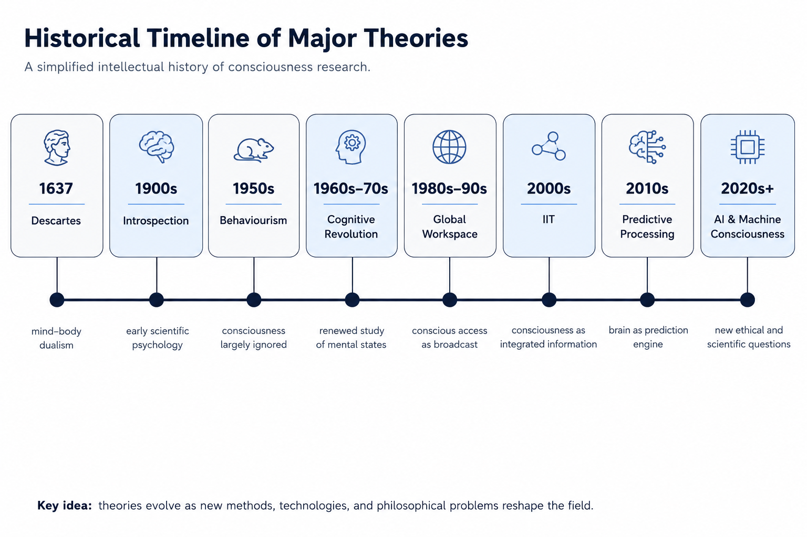
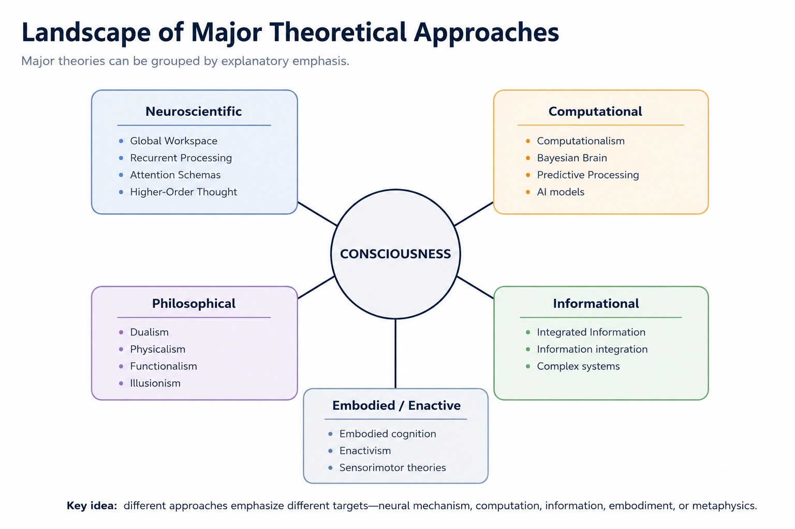

# Historical Development of Consciousness Research {#history}

## Chapter Overview

The historical development of consciousness research reflects changing assumptions about:

- what consciousness is;
- what counts as scientific explanation;
- how subjective experience should be studied;
- and whether consciousness can be reduced to physical mechanisms.

Across different historical periods, consciousness has been treated alternately as:

- a metaphysical problem;
- a psychological phenomenon;
- a behavioural illusion;
- a computational process;
- an informational structure;
- and a biological property of complex neural systems.

Understanding this historical progression is important because contemporary theories inherit many of the conceptual tensions, methodological assumptions, and unresolved debates that emerged during earlier periods.

Modern discussions concerning:

- subjective experience;
- neural mechanisms;
- information processing;
- embodiment;
- artificial intelligence;
- and the hard problem

are deeply connected to this broader intellectual history.

## Learning Objectives

After reading this chapter, the reader should be able to:

- Describe major historical phases in consciousness research
- Explain how explanatory targets changed over time
- Compare philosophical, psychological, and neuroscientific approaches
- Explain why behaviourism marginalized consciousness research
- Describe the impact of the cognitive revolution
- Explain how neuroscience transformed consciousness studies
- Understand why contemporary theories remain diverse and interdisciplinary

## Historical Evolution of Consciousness Research

Figure \@ref(fig:fig-history-timeline) presents a simplified intellectual timeline of major developments in consciousness research.

```{r fig-history-timeline, echo=FALSE, fig.cap="Historical timeline of major developments in consciousness research. Theories evolved across philosophical, psychological, behavioural, computational, neuroscientific, and AI-centered paradigms. Importantly, many earlier ideas continue to influence contemporary debates.", out.width="100%", fig.align="center"}

```

As illustrated in Figure \@ref(fig:fig-history-timeline), the history of consciousness research is not a simple linear replacement of old theories with new ones. Instead, ideas often:

- evolve;
- reappear;
- integrate;
- and influence later frameworks across time.

The field therefore developed through shifting explanatory paradigms rather than straightforward scientific succession.

## Changing Questions Across History

Different historical periods emphasized different explanatory questions concerning consciousness.

Some periods focused primarily on:

- soul and metaphysics;
- the relation between mind and matter;
- or the foundations of knowledge.

Others emphasized:

- behaviour;
- cognition;
- neural mechanisms;
- information processing;
- embodiment;
- or computational modeling.

As shown in Figure \@ref(fig:fig-history-timeline), consciousness research evolved not only because of new discoveries, but also because researchers changed their assumptions concerning what required explanation.

For example:

- classical philosophy emphasized metaphysical questions;
- behaviourism emphasized observable behaviour;
- cognitive science emphasized internal representation;
- neuroscience emphasized neural mechanisms;
- and modern AI research increasingly emphasizes computation, prediction, and self-modeling.

This shifting landscape remains central to contemporary debates.

## Classical Philosophy

Ancient and early modern philosophy approached consciousness through questions concerning:

- soul;
- perception;
- selfhood;
- rationality;
- intentionality;
- and subjective awareness.

As shown in Figure \@ref(fig:fig-history-timeline), early philosophical approaches treated consciousness primarily as a metaphysical and epistemological problem.

Philosophers debated whether the mind could be understood entirely through material processes or whether consciousness reflected something fundamentally distinct from the physical world.

### Descartes and Dualism

René Descartes is especially associated with mind-body dualism, the view that:

```text
mind and matter are fundamentally different kinds of substance.
```

Descartes argued that conscious thought possessed qualities irreducible to physical extension or mechanical processes.

Although contemporary neuroscience rarely accepts Cartesian substance dualism, the broader:

- mind-body problem;
- explanatory gap;
- and problem of subjectivity

remain central to consciousness research.

### Empiricism and Experience

Empiricists such as:

- John Locke;
- George Berkeley;
- and David Hume

emphasized experience and perception as foundations of knowledge.

These traditions helped establish later interest in:

- sensation;
- phenomenology;
- perception;
- and introspection.

### Kant and Cognitive Structure

Immanuel Kant argued that consciousness actively structures experience through:

- categories;
- spatial and temporal organization;
- and cognitive forms.

Many modern theories involving:

- predictive processing;
- cognitive architecture;
- and active perception

echo themes already present in Kantian philosophy.

Thus many contemporary debates concerning:

- subjectivity;
- selfhood;
- perception;
- and phenomenal structure

can be traced back to classical philosophical traditions.

## Empiricism and Introspection

During the nineteenth and early twentieth centuries, early psychology attempted to study consciousness scientifically through introspection.

Figure \@ref(fig:fig-history-timeline) identifies this period as a major shift toward systematic psychological investigation of experience.

Researchers attempted to analyze:

- sensations;
- feelings;
- thoughts;
- images;
- and perceptual experiences

from the first-person perspective.

### Wundt and Experimental Psychology

Wilhelm Wundt helped establish experimental psychology as a scientific discipline.

Researchers attempted to study consciousness under controlled laboratory conditions using structured introspective reports.

### Titchener and Structuralism

Edward Titchener attempted to decompose conscious experience into:

- fundamental sensory elements;
- basic feelings;
- and simple mental structures.

Introspectionist approaches treated consciousness as:

> a legitimate scientific object of investigation.

### Limitations of Introspection

However, introspection faced major criticisms.

Reports often:

- varied substantially between observers;
- lacked standardization;
- and appeared difficult to verify objectively.

Critics argued that subjective reports lacked sufficient:

- reliability;
- precision;
- and experimental rigor.

Despite these limitations, introspection established several enduring themes that remain central to consciousness studies:

- first-person experience;
- phenomenal character;
- subjectivity;
- and introspective awareness.

Importantly, modern phenomenology and neurophenomenology partially revive some introspective traditions in more rigorous forms.

## Behaviourism

In the early twentieth century, behaviourism emerged partly as a reaction against the perceived subjectivity and methodological unreliability of introspectionist psychology.

Figure \@ref(fig:fig-history-timeline) illustrates how behaviourism temporarily displaced consciousness from mainstream scientific psychology.

Thinkers such as:

- John B. Watson;
- Ivan Pavlov;
- Edward Thorndike;
- and B. F. Skinner

argued that psychology should focus exclusively on:

- observable behaviour;
- conditioning;
- learning;
- and stimulus-response relationships.

### Why Consciousness Disappeared

Behaviourism treated internal mental states as scientifically problematic because they could not be:

- directly observed;
- objectively measured;
- or publicly verified.

As a result, consciousness was often excluded from scientific explanation altogether.

Research instead emphasized:

- behavioural prediction;
- conditioning;
- reinforcement;
- and measurable outputs.

### Contributions of Behaviourism

Behaviourism substantially increased:

- experimental rigor;
- operational definition;
- quantitative measurement;
- and methodological discipline.

These contributions profoundly influenced scientific psychology.

### Limitations of Behaviourism

However, critics increasingly argued that behaviourism failed to explain:

- meaning;
- perception;
- language;
- reasoning;
- internal representation;
- and subjective awareness.

The exclusion of consciousness eventually became increasingly difficult to sustain, particularly as researchers confronted complex cognition and language processing.

## Cognitive Revolution

The cognitive revolution of the mid-twentieth century reintroduced internal mental processes into scientific psychology.

As shown in Figure \@ref(fig:fig-history-timeline), this period marked a major shift toward information-processing models of the mind.

### Return of Internal Representation

Researchers increasingly studied:

- attention;
- memory;
- perception;
- reasoning;
- problem-solving;
- and language.

The cognitive revolution reopened the possibility that internal mental states could be studied scientifically without abandoning experimental rigor.

### Information Processing and Computation

Developments in:

- computer science;
- cybernetics;
- linguistics;
- artificial intelligence;
- and information theory

strongly influenced this transition.

Researchers increasingly viewed the brain as:

```text
an information-processing system
```

capable of:

- representation;
- computation;
- prediction;
- memory storage;
- and decision-making.

### Chomsky and Critiques of Behaviourism

Noam Chomsky strongly criticized behaviourism, particularly its inability to explain language acquisition and internal cognitive structure adequately.

These critiques helped accelerate the emergence of cognitive science as an interdisciplinary field integrating:

- psychology;
- neuroscience;
- philosophy;
- linguistics;
- and computation.

Although many early cognitive models still treated consciousness indirectly, the cognitive revolution established the foundations for modern scientific consciousness research.

## Neuroscience and Neural Correlates

Advances in neuroscience transformed consciousness research from a largely philosophical problem into an experimentally tractable scientific domain.

Figure \@ref(fig:fig-history-timeline) shows the emergence of modern neuroscientific approaches during the late twentieth century.

### Technological Transformation

Technologies such as:

- functional magnetic resonance imaging (fMRI);
- electroencephalography (EEG);
- intracranial recording;
- lesion analysis;
- and neural stimulation

enabled researchers to investigate conscious awareness empirically.

### Expanding Experimental Domains

Researchers began studying how consciousness changes across:

- sleep and dreaming;
- anesthesia;
- coma and vegetative states;
- perceptual masking;
- binocular rivalry;
- attention;
- metacognition;
- psychedelic states;
- and meditation.

### Neural Correlates of Consciousness

The search for the **neural correlates of consciousness (NCC)** became a major scientific program [@koch2016; @seth2018].

NCC research attempts to identify:

> the minimal neural mechanisms associated with specific conscious experiences.

### Limits of Correlation

Importantly, however:

```text
neural correlation
≠
complete explanation
```

Neural correlates may explain:

- when consciousness occurs;
- how conscious states change;
- and which mechanisms participate,

without fully explaining:

- why subjective experience exists at all.

This distinction later contributed to increasing interest in the hard problem of consciousness.

## Emergence of the Hard Problem

Late twentieth-century debates increasingly distinguished between:

- explaining cognitive functions;
and:
- explaining subjective experience itself.

David Chalmers later formalized this distinction through the concepts of:

- easy problems;
and:
- the hard problem of consciousness.

As shown in Figure \@ref(fig:fig-history-timeline), this period marked a major conceptual shift in consciousness studies.

The hard problem asks:

> Why should physical or computational processes produce subjective experience at all?

This distinction strongly influenced subsequent theoretical development.

## Contemporary Theories

As experimental methods expanded and interdisciplinary research intensified, consciousness studies diversified into multiple theoretical traditions.

Figure \@ref(fig:fig-theoretical-landscape-history) summarizes several major contemporary theoretical families.

```{r fig-theoretical-landscape-history, echo=FALSE, fig.cap="Major contemporary theoretical approaches in consciousness research. Different theories emphasize neural mechanisms, computation, information structure, embodiment, or metaphysical interpretation.", out.width="94%", fig.align="center"}

```

As illustrated in Figure \@ref(fig:fig-theoretical-landscape-history), contemporary theories differ not only in proposed mechanisms, but also in:

- explanatory targets;
- assumptions;
- and definitions of consciousness itself.

### Major Contemporary Approaches

Contemporary theoretical families include:

- Global Workspace Theory;
- Integrated Information Theory;
- Higher-Order theories;
- Predictive Processing;
- Recurrent Processing Theory;
- Attention Schema Theory;
- computational theories;
- embodied and enactive theories;
- panpsychism;
- illusionism;
- and quantum theories.

### Different Explanatory Targets

Some theories primarily explain:

- conscious access;
- reportability;
- attention;
- or information integration.

Others attempt to explain:

- phenomenal experience;
- subjectivity;
- embodiment;
- or metaphysical foundations directly.

This diversity partly reflects the possibility that consciousness may require explanation across multiple levels simultaneously.

## Artificial Intelligence and Machine Consciousness

Recent developments in artificial intelligence represent the newest phase in the evolving history of consciousness research shown in Figure \@ref(fig:fig-history-timeline).

Large-scale neural networks, generative AI systems, predictive architectures, and increasingly sophisticated computational models have intensified debates concerning:

- machine consciousness;
- artificial self-modeling;
- intelligence;
- agency;
- and subjective awareness.

### Functionalist and Computational Views

Some theories suggest that consciousness may depend primarily on:

- organization;
- information processing;
- and computational structure,

rather than biological substrate.

### Biological and Embodied Objections

Other theories argue that current AI systems merely simulate intelligent behaviour without possessing genuine subjective experience.

Embodied and biological approaches emphasize:

- bodily regulation;
- affect;
- homeostasis;
- and organism-environment interaction.

### Ethical Questions

Machine consciousness debates also raise major ethical and philosophical questions concerning:

- moral status;
- personhood;
- artificial suffering;
- autonomy;
- and anthropomorphism.

These debates increasingly connect consciousness research with broader social and technological issues.

## Contemporary Interdisciplinary Research

Modern consciousness studies are highly interdisciplinary.

Contemporary research integrates:

- neuroscience;
- cognitive science;
- philosophy of mind;
- psychology;
- artificial intelligence;
- information theory;
- phenomenology;
- biology;
- psychiatry;
- and physics.

Figure \@ref(fig:fig-history-timeline) illustrates how the field gradually expanded from relatively isolated philosophical inquiry into a broad interdisciplinary research domain.

This interdisciplinarity reflects the possibility that consciousness may not be fully explainable at a single level of analysis.

Neural mechanisms, computation, embodiment, information structure, phenomenology, and environmental interaction may all contribute important explanatory dimensions.

## Current State of the Field

The contemporary field remains theoretically pluralistic.

There is currently:

- no universally accepted theory of consciousness;
- no agreed definition of consciousness;
- and no consensus concerning the ultimate explanatory framework.

However, this diversity is not necessarily a weakness.

Different theories may explain different aspects of consciousness including:

- wakefulness;
- perceptual awareness;
- selfhood;
- metacognition;
- attention;
- cognitive integration;
- embodiment;
- and phenomenal character.

The contemporary diversity of theories therefore reflects the possibility that consciousness involves:

> multiple interacting explanatory levels rather than a single reducible mechanism.

## Main Historical Conclusion

The historical evolution of consciousness research reveals not a simple linear progression toward a final solution, but an expanding and increasingly interdisciplinary attempt to understand one of the deepest problems in science and philosophy.

As illustrated throughout Figure \@ref(fig:fig-history-timeline), theories evolved alongside:

- new technologies;
- changing philosophical assumptions;
- advances in neuroscience;
- developments in computation;
- and emerging questions concerning AI and embodiment.

The history of consciousness research therefore demonstrates that progress often occurs not through replacement of earlier ideas alone, but through:

- reinterpretation;
- integration;
- conceptual refinement;
- and expansion across explanatory levels.

Modern consciousness science increasingly recognizes that understanding consciousness may require integration across:

- neuroscience;
- phenomenology;
- computation;
- embodiment;
- philosophy;
- and artificial intelligence.

The field therefore remains both scientifically productive and philosophically open-ended.