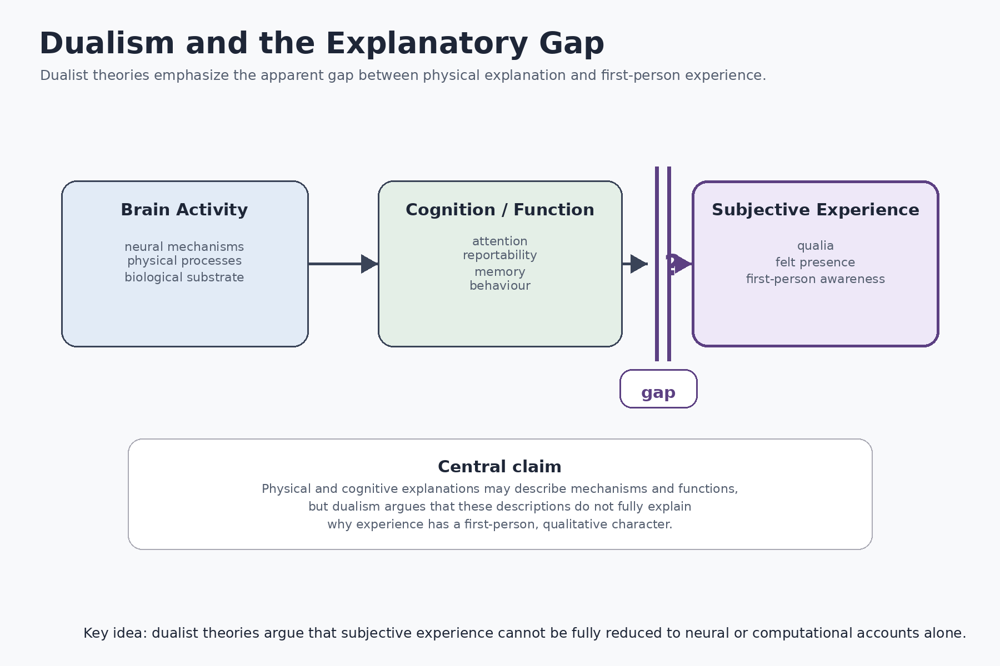
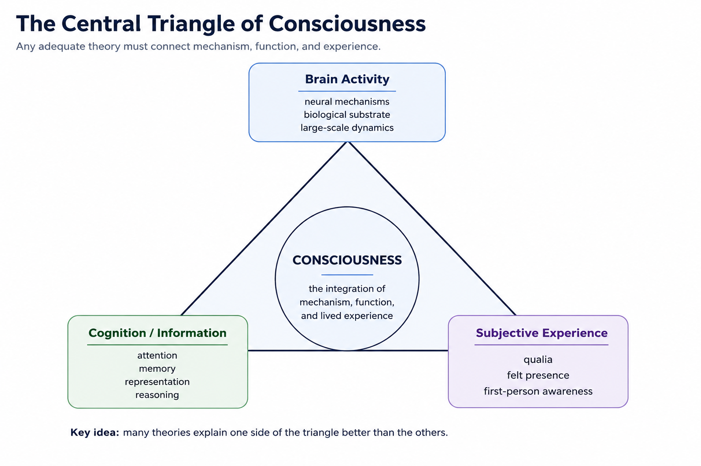

# Dualism {#dualism}

## Chapter Overview

Dualism is one of the oldest and most influential approaches in the philosophy of mind and consciousness studies. Broadly defined, dualism argues that consciousness cannot be fully reduced to physical processes alone. Mental states, subjective experience, and first-person awareness are treated as fundamentally distinct from — or at least not exhaustively explainable by — purely material descriptions of the brain.

Dualist theories arise largely from dissatisfaction with reductionist explanations of consciousness. While neuroscience may successfully explain neural activity, cognition, perception, memory, and behaviour, dualists argue that such explanations appear incomplete because they do not fully explain why conscious experience exists or why experience possesses qualitative character.

This chapter examines dualism as a family of theories rather than a single unified position. The discussion considers historical origins, conceptual assumptions, major forms of dualism, explanatory models, philosophical significance, empirical challenges, strengths, weaknesses, unresolved gaps, and implications for artificial intelligence and altered states of consciousness [@chalmers1996; @searle1992].

## Learning Objectives

After reading this chapter, the reader should be able to:

- Define the major forms of dualism.
- Explain the relationship between dualism and the hard problem of consciousness.
- Distinguish substance dualism from property dualism and related approaches.
- Understand the explanatory gap motivating dualist theories.
- Evaluate the strengths and weaknesses of dualist explanations.
- Analyze how dualism compares with physicalist and functionalist theories.
- Assess implications of dualism for neuroscience, artificial intelligence, and subjective experience.

## Historical Development

Questions concerning the relationship between mind and matter have existed throughout the history of philosophy. Ancient philosophical traditions debated the nature of soul, perception, selfhood, and conscious awareness long before the emergence of modern neuroscience.

Dualism became especially influential in early modern philosophy through the work of René Descartes. Descartes argued that conscious thought and physical matter possess fundamentally different properties. Bodies occupy space and obey physical laws, whereas conscious mind is characterized by thought, awareness, and subjective experience. This became known as **substance dualism**.

Although contemporary neuroscience rarely accepts Cartesian dualism in its original form, many contemporary consciousness debates continue to reflect dualist concerns. In particular, the apparent difficulty of explaining subjective experience entirely through physical processes remains one of the central motivations for dualist theories.

Twentieth-century developments in behaviourism temporarily marginalized discussions of consciousness by emphasizing observable behaviour over subjective experience. However, the cognitive revolution and later developments in neuroscience eventually revived interest in consciousness as a legitimate scientific and philosophical problem.

Contemporary forms of dualism often emerge not from rejection of neuroscience, but from the argument that physical explanations alone remain insufficient to explain phenomenal consciousness fully.

## Core Assumptions

Despite internal differences, most dualist approaches share several broad assumptions:

- Consciousness cannot be fully captured by physical description alone.
- First-person experience differs fundamentally from third-person observation.
- Subjective awareness possesses properties not reducible to neural mechanisms.
- Phenomenal experience may involve fundamental or irreducible features of reality.
- Explaining cognition and behaviour does not necessarily explain conscious feeling itself.

These assumptions shape what dualist theories consider central evidence and what they regard as unresolved within physicalist accounts of consciousness.

## Major Forms of Dualism

Dualism is not a single theory but a family of related positions concerning the relationship between consciousness and physical reality.

### Substance Dualism {#substance-dualism}

Substance dualism, most closely associated with René Descartes, proposes that mind and matter are fundamentally different substances. Physical bodies occupy space and follow physical laws, whereas conscious mind is non-physical and possesses properties irreducible to material processes.

According to this view, conscious awareness cannot be identified directly with brain activity because mental and physical reality belong to fundamentally different ontological categories.

### Property Dualism {#property-dualism}

Property dualism rejects the existence of separate mental substances while arguing that consciousness nevertheless involves non-reducible mental properties. Conscious experience may emerge from physical systems, but subjective awareness cannot be completely explained through physical description alone.

Property dualism is more compatible with contemporary neuroscience than Cartesian substance dualism and remains influential in modern philosophy of consciousness.

### Interactionism {#interactionism}

Interactionist dualism proposes that mental and physical states can causally influence one another. Conscious intentions may therefore affect bodily action, while neural activity may influence conscious experience.

This approach attempts to preserve ordinary intuitions concerning agency, intentionality, and conscious decision-making.

### Epiphenomenalism {#epiphenomenalism}

Epiphenomenalism argues that conscious experience is produced by physical brain processes but does not itself exert causal influence on the physical world. Consciousness is therefore real but causally inert.

According to this view, subjective experience accompanies neural activity without directly influencing behaviour or physical causation.

### Naturalistic Dualism {#naturalistic-dualism}

David Chalmers has defended forms of naturalistic dualism in which consciousness is treated as a fundamental feature of reality governed by psychophysical laws rather than reducible physical mechanisms [@chalmers1996].

Naturalistic dualism attempts to preserve scientific realism while acknowledging that consciousness may require explanatory principles beyond current physical theories.

## Conceptual Framework

Dualism can be understood as a response to several linked philosophical and scientific questions:

1. What makes a mental state conscious rather than unconscious?
2. Why should physical processing generate subjective experience?
3. Is consciousness primarily biological, computational, phenomenological, or metaphysical?
4. Can phenomenal experience be reduced to neural activity?
5. Does explaining cognition explain consciousness itself?
6. Can consciousness exist in artificial systems or non-biological entities?

A useful academic distinction is between **access consciousness** and **phenomenal consciousness** [@block1995]. Access consciousness concerns information available for reasoning, report, memory, and action. Phenomenal consciousness concerns qualitative experience itself: what it is like to see red, feel pain, hear music, or experience oneself as a subject.

Dualist theories are generally motivated primarily by phenomenal consciousness rather than access consciousness alone.

Figure \@ref(fig:fig-dualism-gap) illustrates the explanatory tension that motivates many dualist theories. Dualists argue that neural and cognitive explanations may describe mechanisms and functions successfully while still leaving subjective experience insufficiently explained.

```{r fig-dualism-gap, echo=FALSE, fig.cap="Dualism and the explanatory gap. Dualist theories argue that subjective experience cannot be fully reduced to physical or cognitive explanation alone.", out.width="90%", fig.align="center"}

```

As illustrated in Figure \@ref(fig:fig-dualism-gap), dualist theories emphasize the apparent gap between physical explanation and first-person awareness. Neural activity and cognitive processing may explain behaviour, information access, and functional organization, yet dualists argue that these accounts still appear incomplete with respect to phenomenal experience itself.

Figure \@ref(fig:fig-dualism-triangle) provides a broader conceptual framework for understanding how dualist theories position subjective experience relative to neural activity and cognition.

```{r fig-dualism-triangle, echo=FALSE, fig.cap="The central explanatory domains involved in consciousness research. Dualist approaches emphasize the difficulty of fully reducing subjective experience to neural or computational accounts alone.", out.width="86%", fig.align="center"}

```

As shown in Figure \@ref(fig:fig-dualism-triangle), consciousness research involves at least three interconnected explanatory domains: neural mechanisms, cognitive or informational processing, and subjective experience itself. Dualist theories argue that subjective awareness cannot be fully derived from the first two domains alone.

## Mechanism or Explanatory Model

Dualism does not typically propose a single unified neural mechanism for consciousness. Instead, dualist theories focus primarily on the explanatory relationship between subjective experience and physical systems.

The explanatory model can therefore be analyzed at multiple levels:

- **Phenomenological level:** What kind of experience is being explained?
- **Cognitive level:** What mental operations accompany awareness?
- **Computational level:** Can information processing alone explain experience?
- **Neural level:** Which brain systems correlate with consciousness?
- **Metaphysical level:** What is the ontological relationship between mind and matter?

This multi-level analysis prevents dualism from being evaluated solely through neuroscientific criteria. A theory may possess philosophical explanatory power while remaining empirically difficult to operationalize.

Importantly, dualist theories typically do not deny the importance of neural correlates of consciousness. Rather, they argue that neural correlation alone may not constitute a complete explanation of phenomenal experience.

## The Interaction Problem

One of the most important criticisms of dualism concerns causal interaction. If consciousness is non-physical, how can it causally influence the physical brain without violating physical conservation laws?

Critics argue that dualism often struggles to explain coherently how non-physical mental states could interact with biological neural systems. This challenge has historically been one of the strongest objections to substance dualism.

Epiphenomenalism attempts to avoid this problem by denying that consciousness exerts causal influence on physical processes. However, critics argue that this creates difficulties for explaining agency, intentionality, and conscious decision-making.

## Mental Causation and Agency

Dualism is closely connected to questions concerning free will, agency, and intentional action. Many dualist theories attempt to preserve the intuition that conscious decisions genuinely influence behaviour rather than merely accompanying unconscious neural processes.

This issue becomes especially important in debates concerning voluntary action, moral responsibility, and the causal role of conscious awareness.

Some critics argue that contemporary neuroscience increasingly supports physical explanations of behaviour without requiring non-physical mental causation. Others argue that subjective agency remains difficult to reconcile fully with purely mechanistic accounts.

## Empirical Support and Challenges

Evidence relevant to dualist theories may come from several domains:

- neuroimaging studies;
- electrophysiology;
- split-brain research;
- visual masking and blindsight;
- anesthesia and disorders of consciousness;
- dream states and altered consciousness;
- metacognition and introspective reporting;
- artificial intelligence and computational modeling.

Some dualists argue that phenomena such as qualia, unity of consciousness, subjective awareness, and first-person experience resist purely physical explanation.

However, many critics argue that empirical evidence does not currently require dualist interpretations specifically. Competing physicalist and functionalist theories may often explain the same data without positing non-reducible mental properties.

A central difficulty for dualism is that subjective experience remains difficult to measure independently of behavioural report and neural correlation.

## Strengths

Dualism possesses several important explanatory and philosophical strengths:

- It directly confronts the problem of subjective experience.
- It emphasizes the distinction between objective description and first-person awareness.
- It highlights limitations of purely behavioural or computational explanations.
- It preserves the apparent reality of phenomenal consciousness and qualia.
- It connects consciousness research to broader metaphysical questions concerning mind, reality, and selfhood.
- It provides a powerful critique of overly reductionist theories.

Dualism is especially influential because it forces competing theories to address why subjective experience exists at all rather than merely explaining cognitive function.

## Weaknesses

Dualism also faces substantial criticisms:

- It often lacks clear empirical testability.
- It may not specify measurable neural mechanisms.
- The interaction problem remains unresolved.
- Some versions appear difficult to reconcile with contemporary physics.
- It may rely heavily on intuition and thought experiments.
- It does not always provide operational criteria for identifying consciousness in non-human systems.
- Some critics argue that dualism explains the mystery of consciousness by introducing additional metaphysical mystery.

Critics also argue that dualism risks separating consciousness too sharply from biological and computational mechanisms.

## Explanatory Gaps

Important unresolved questions remain:

- Why should non-physical consciousness interact with physical systems?
- Does dualism genuinely explain consciousness or merely redescribe the problem?
- Can subjective experience be scientifically measured independently?
- How does consciousness relate to attention, memory, and cognition?
- Can dualism explain unconscious perception and blindsight?
- Does consciousness persist during dreamless sleep or anesthesia?
- Can dualism distinguish genuine consciousness from sophisticated behavioural simulation?

These unresolved questions continue to shape debates between dualist, physicalist, and functionalist theories.

## What Dualism Explains Well

Dualism is particularly effective at addressing:

- the apparent irreducibility of subjective experience;
- the explanatory gap between mechanism and phenomenology;
- qualia and phenomenal awareness;
- first-person subjectivity;
- the distinction between access and phenomenal consciousness;
- philosophical limitations of reductionist explanation.

Dualism therefore remains highly influential in philosophical discussions of consciousness despite empirical challenges.

## What Dualism Explains Less Successfully

Dualism is generally less successful at explaining:

- precise neural mechanisms;
- measurable markers of consciousness;
- causal interaction between mind and matter;
- computational implementation of consciousness;
- empirical prediction;
- operational scientific testing;
- how consciousness evolved biologically.

Many neuroscientists therefore regard dualism as philosophically important but scientifically incomplete.

## Implications for Artificial Intelligence

Dualism has major implications for debates concerning machine consciousness and artificial intelligence.

If consciousness depends primarily on functional organization or information processing, then artificial consciousness may be possible in principle. However, if consciousness depends on non-reducible mental properties, biological embodiment, or fundamental phenomenal features absent in current computation, then contemporary AI systems may remain non-conscious regardless of behavioural sophistication.

Dualist theories therefore often challenge assumptions that intelligence, language ability, or behavioural complexity alone are sufficient indicators of genuine consciousness.

These debates become increasingly important as artificial systems display increasingly sophisticated forms of reasoning, language generation, prediction, and adaptive behaviour.

## Summary

Dualism remains one of the most historically influential and philosophically significant approaches to consciousness. Its central contribution lies in emphasizing the apparent difficulty of reducing subjective experience entirely to physical explanation.

Although dualism faces major empirical and conceptual challenges — particularly concerning causal interaction and scientific testability — it continues to shape contemporary debates concerning qualia, phenomenal awareness, selfhood, free will, artificial intelligence, and the hard problem of consciousness.

Whether dualism ultimately represents a correct metaphysical theory or a transitional framework highlighting limitations in current scientific explanation remains deeply contested. Nevertheless, nearly all contemporary theories of consciousness must respond, either directly or indirectly, to the problems dualism raises.