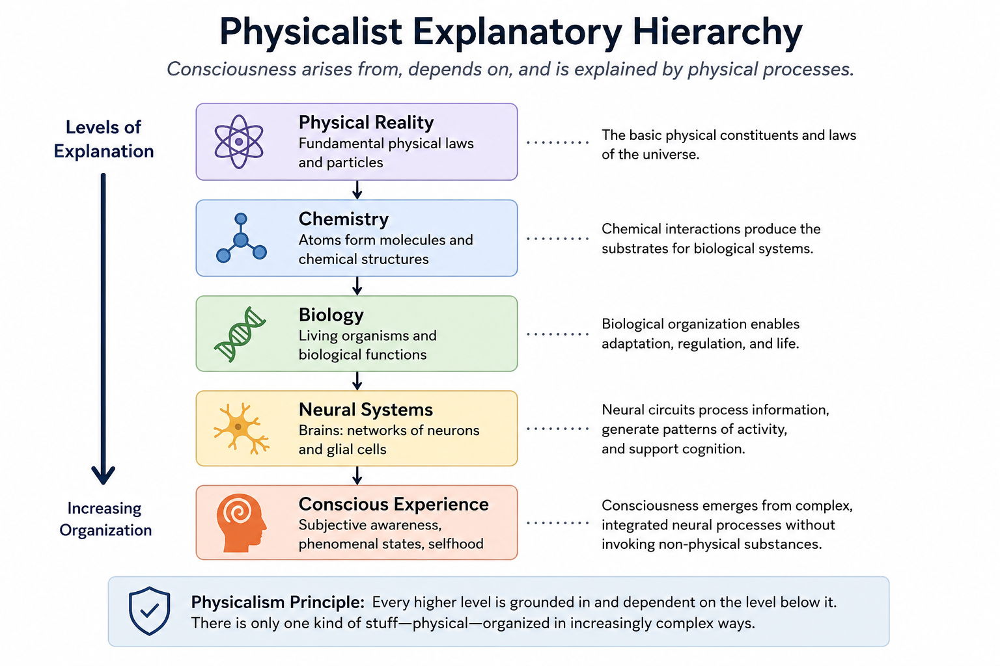

# Physicalism and Materialist Theories of Consciousness {#physicalism}

Physicalism is the view that everything that exists is ultimately physical in nature, including consciousness. According to physicalist approaches, conscious experience does not require non-physical substances, immaterial souls, or fundamentally separate mental realities. Instead, consciousness arises from physical systems such as brains, neural networks, biological organization, or information-processing structures.

Physicalism is the dominant framework within contemporary neuroscience and much of cognitive science because it aligns closely with empirical research methods and the broader scientific worldview. Most modern experimental approaches to consciousness assume that subjective experience depends in some way on physical brain processes [@koch2016; @seth2021].

At the same time, physicalism remains philosophically contested. Critics argue that even complete physical descriptions may fail to explain why subjective experience exists at all or why neural activity should possess a first-person qualitative character.

## Physicalism as a Response to Dualism

Physicalist theories developed partly in response to problems associated with dualist explanations of mind and consciousness. Dualist theories propose that consciousness is ontologically distinct from physical matter, but critics argue that such approaches face difficulties concerning causal interaction, scientific testability, and compatibility with physics.

Physicalism attempts to explain consciousness entirely within a naturalistic framework. Rather than treating consciousness as fundamentally separate from physical reality, physicalist approaches seek to explain subjective experience through neural activity, biological organization, computation, or information processing.

Where dualism emphasizes the apparent explanatory gap between matter and experience, physicalism assumes that consciousness must ultimately be explainable through physical mechanisms, even if the precise explanation remains incomplete.

## Core Assumptions

Most physicalist theories share several foundational assumptions:

- consciousness depends on physical systems;
- changes in brain states alter conscious experience;
- mental states are closely linked to neural organization;
- consciousness can be studied scientifically;
- subjective experience emerges from physical processes rather than existing independently of them.

Physicalism therefore treats consciousness as part of the natural world rather than as something outside physical explanation.

Figure \@ref(fig:fig-physicalism-hierarchy) illustrates a physicalist explanatory hierarchy in which consciousness emerges from increasingly complex levels of physical organization, ranging from fundamental physical processes to neural systems and subjective experience.

```{r fig-physicalism-hierarchy, echo=FALSE, fig.cap="A physicalist explanatory hierarchy in which consciousness emerges from increasingly complex levels of physical organization, ranging from fundamental physical processes to neural systems and subjective experience.", out.width="95%", fig.align="center"}

```

As shown in Figure \@ref(fig:fig-physicalism-hierarchy), physicalist approaches generally interpret consciousness as emerging from progressively organized physical systems rather than from a separate immaterial substance. Different forms of physicalism disagree about whether consciousness can be fully reduced to lower-level physical processes, but they broadly agree that consciousness depends fundamentally on physical organization.

## Major Forms of Physicalism

Physicalism is not a single unified theory but a family of related positions concerning the relationship between consciousness and physical reality.

### Reductive Physicalism

Reductive physicalism argues that conscious states can ultimately be reduced to physical brain states or biological mechanisms. According to this view, advances in neuroscience will eventually explain consciousness entirely through physical processes.

### Identity Theory

Identity theory proposes that mental states are identical to brain states [@smart1959; @place1956]. Conscious experiences are therefore not separate from neural activity but are simply particular physical states described at another explanatory level.

### Non-Reductive Physicalism

Non-reductive physicalism argues that consciousness depends entirely on physical systems while still possessing higher-level properties that cannot be straightforwardly reduced to lower-level neural descriptions.

### Functional Materialism

Functionalist forms of materialism define mental states in terms of functional or computational organization rather than specific biological substances. Consciousness depends primarily on causal structure and information processing.

### Eliminative Materialism

Eliminative materialism argues that ordinary concepts such as beliefs, desires, or qualia may reflect incomplete folk psychology rather than scientifically valid categories [@churchland1981]. Some eliminativists argue that future neuroscience may radically revise common intuitions concerning consciousness.

### Emergent Physicalism

Emergentist approaches argue that consciousness emerges from sufficiently complex physical organization while remaining entirely grounded in physical systems. Consciousness is therefore real but higher-order rather than fundamental.

## Neural Dependence of Consciousness

One of the strongest arguments for physicalism comes from the close relationship between conscious experience and brain activity. Brain injury, anesthesia, psychoactive substances, neurodegeneration, electrical stimulation, sleep, and coma all systematically alter consciousness.

Damage to specific brain regions can affect:

- perception;
- memory;
- language;
- emotional experience;
- self-awareness;
- attentional control;
- conscious reportability.

Similarly, anesthesia can dramatically reduce or eliminate conscious awareness through physical intervention in neural activity. These findings strongly suggest that consciousness depends intimately on physical brain organization.

Neuroscientific research has therefore become central to modern consciousness studies. Brain imaging, lesion studies, electrophysiology, neural decoding, and computational neuroscience all attempt to identify the mechanisms associated with conscious states [@crick1994; @koch2016].

## Physicalism and the Hard Problem

Physicalist theories differ substantially in how they approach the hard problem of consciousness.

Some physicalists argue that the hard problem represents a genuine but ultimately solvable scientific challenge. Others argue that the hard problem results from conceptual confusion or misleading intuitions concerning subjective experience.

Several common physicalist responses include:

- consciousness will eventually be explained through neuroscience;
- phenomenal experience reflects higher-order representation;
- qualia are reducible to functional organization;
- introspection misrepresents the structure of experience;
- the explanatory gap reflects cognitive limitations rather than metaphysical reality.

Critics argue, however, that even complete physical descriptions may fail to explain why physical processes should produce subjective experience at all.

## Strengths of Physicalism

Physicalist theories possess several major strengths:

- compatibility with contemporary science;
- strong integration with neuroscience;
- empirical testability;
- explanatory continuity with biology and physics;
- compatibility with evolutionary theory;
- ability to generate experimentally tractable models.

Physicalism also avoids many difficulties associated with non-physical explanations, including problems of causal interaction between mind and matter.

## Weaknesses and Criticisms

Despite its scientific influence, physicalism faces major philosophical criticisms.

### The Explanatory Gap

Critics argue that physical explanations may describe brain function without explaining subjective experience itself. Explaining neural activity does not necessarily explain why experience feels like anything from the inside.

### The Knowledge Argument

Frank Jackson’s *Mary’s Room* thought experiment argues that complete physical knowledge may still fail to capture subjective experience fully [@jackson1982].

### Multiple Realizability

Some philosophers argue that mental states may be realizable in multiple physical systems, making strict identity between mental states and particular neural states difficult to maintain.

### Qualia Critiques

Critics argue that qualitative experience possesses features that resist reduction to purely structural or functional descriptions.

### Consciousness and Meaning

Some critics argue that physicalist accounts struggle to explain intentionality, meaning, selfhood, or lived experience fully.

## Major Thinkers and Influences

Important contributors to physicalist and materialist theories include:

- J. J. C. Smart;
- U. T. Place;
- Patricia Churchland;
- Paul Churchland;
- Francis Crick;
- Christof Koch;
- Daniel Dennett;
- David Armstrong.

These thinkers differ substantially in their specific interpretations of consciousness, but they broadly share commitment to explaining mind within a physical framework.

## Evaluation

Physicalism remains the dominant framework within contemporary scientific consciousness research because of its strong compatibility with neuroscience, biology, and empirical methodology. It has produced highly productive research programs concerning neural correlates of consciousness, computational modeling, anesthesia, perception, attention, and cognitive integration.

However, physicalism remains philosophically controversial because many critics argue that physical explanations still appear insufficient to explain subjective experience itself. The central challenge is whether consciousness can truly be reduced to physical organization or whether subjective experience reveals explanatory limitations within physicalist models.

The continuing debate between physicalist and non-physicalist theories therefore remains one of the defining tensions in contemporary consciousness studies.