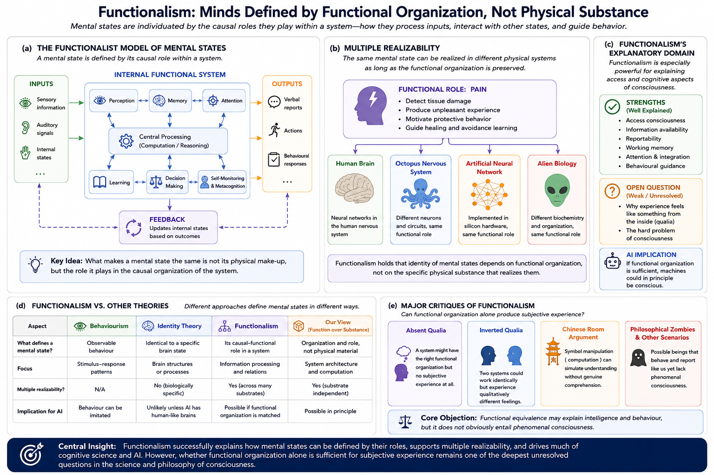

# Functionalism {#functionalism}

## Chapter Overview

Functionalism is one of the most influential approaches in contemporary philosophy of mind, cognitive science, artificial intelligence, and consciousness research. Rather than defining mental states according to what they are physically made of, functionalism defines them according to:

- what they do;
- how they process information;
- how they interact with other mental states;
- and how they contribute to cognition and behaviour.

According to functionalist theories, mental states are individuated by their causal-functional roles within a larger system.

Pain, for example, is not identified with a specific biological substance or neural structure. Instead, it is defined through its characteristic role within cognition and behaviour:

- detecting damage;
- generating unpleasant experience;
- motivating protective action;
- influencing memory and learning;
- and interacting with other mental states.

Functionalism therefore shifted consciousness research away from strict biological reductionism and toward:

- computation;
- information processing;
- causal organization;
- and cognitive architecture.

This shift became foundational for:

- cognitive science;
- artificial intelligence;
- computational neuroscience;
- Global Workspace Theory;
- predictive processing;
- and many contemporary computational models of mind.

At the same time, functionalism remains deeply controversial because critics argue that functional organization alone may explain:

- cognition;
- behaviour;
- reportability;
- and intelligent processing

without fully explaining:

- subjective experience;
- qualia;
- and phenomenal consciousness.

The debate surrounding functionalism therefore lies at the center of modern discussions concerning:

- machine consciousness;
- artificial intelligence;
- cognition;
- and the hard problem of consciousness.

## Learning Objectives

After reading this chapter, the reader should be able to:

- Define the central claims of functionalism
- Explain how functionalism differs from behaviourism and identity theory
- Understand the principle of multiple realizability
- Distinguish major forms of functionalism
- Explain why functionalism became historically influential
- Analyze functionalism’s strengths and limitations
- Explain functionalism’s relationship to AI and computation
- Evaluate criticisms concerning qualia and subjective experience

## Why Functionalism Was Revolutionary

Functionalism transformed philosophy of mind by shifting attention away from:

- physical substance;
and toward:
- causal organization;
- information processing;
- system architecture;
- and computational structure.

Earlier theories often attempted either to:

- reduce mental states directly to brain states;
or:
- eliminate internal mental states entirely in favour of behaviour.

Functionalism proposed a different strategy.

Mental states could instead be understood according to:

- their roles within a larger cognitive system;
- their causal relationships;
- and their informational organization.

This allowed consciousness and cognition to be studied in terms of:

- computation;
- organization;
- representation;
- and dynamic processing

rather than strict biological identity alone.

As a result, functionalism became one of the foundational frameworks underlying:

- cognitive science;
- computational neuroscience;
- artificial intelligence;
- machine consciousness research;
- and modern theories of conscious access.

## Historical Development

Functionalism emerged partly as a reaction against two earlier approaches:

- behaviourism;
- and identity theory.

### Behaviourism

Behaviourism attempted to explain mental states entirely in terms of observable behaviour.

Although behaviourism introduced important methodological rigor into psychology, critics argued that it neglected:

- internal cognition;
- mental organization;
- memory structures;
- subjective awareness;
- and internal causal dynamics.

Unlike behaviourism, functionalism does not define mental states purely through outward behaviour.

Instead, it emphasizes:

- internal causal organization;
- relations among mental states;
- information flow;
- and cognitive processing.

### Identity Theory

Identity theory attempted to identify mental states directly with specific neural states.

According to strict identity theory:

```text
pain = a particular brain state
```

Functionalists argued that this approach was overly restrictive because it implied that only systems with identical biological organization could possess mental states.

Functionalism instead proposed that what matters is not:

- specific material composition,
but:
- functional organization itself.

This distinction became central to later debates concerning:

- artificial intelligence;
- machine consciousness;
- and multiple realizability.

Major contributors to functionalism include:

- Hilary Putnam;
- Jerry Fodor;
- David Lewis;
- David Armstrong;
- Sydney Shoemaker;
- Ned Block.

[@putnam1967; @fodor1968; @lewis1972]

## Core Functionalist Principle

The central claim of functionalism is that mental states are individuated by:

- what they do;
rather than:
- what they are physically made of.

A conscious state is therefore characterized by:

- how it processes sensory input;
- how it interacts with memory;
- how it influences reasoning;
- how it guides behaviour;
- how it participates in cognitive organization;
- and how it contributes to system-wide causal dynamics.

Functionalist theories therefore ask:

> What role does consciousness play within cognition?

rather than:

> What physical material produces it?

This distinction became foundational for computational theories of mind and modern AI research.

## Functional Organization

Functionalism interprets consciousness as emerging from organized causal relationships among:

- sensory inputs;
- internal states;
- memory systems;
- reasoning processes;
- attention;
- self-monitoring;
- and behavioural outputs.

Figure \@ref(fig:fig-functionalist-view) illustrates the general functionalist framework.

```{r fig-functionalist-view, echo=FALSE, fig.cap="Functionalist models define mental states according to causal organization, information flow, internal processing, and behavioural relations rather than specific physical substance. The figure also illustrates multiple realizability and contrasts functionalism with identity theory.", out.width="97%", fig.align="center"}

```

As illustrated in Figure \@ref(fig:fig-functionalist-view), functionalist approaches interpret consciousness as a structured network of dynamic interactions involving:

- perception;
- memory;
- attention;
- reasoning;
- self-monitoring;
- and behavioural coordination.

The figure also illustrates one of the central philosophical commitments of functionalism:

```text
mental identity depends on functional organization,
not specific biological substrate.
```

This principle became one of the most influential ideas in modern cognitive science.

At the same time, Figure \@ref(fig:fig-functionalist-view) also highlights one of the major unresolved debates:

> whether functional organization alone is sufficient for phenomenal consciousness.

## Multiple Realizability

One of the strongest arguments supporting functionalism is the principle of **multiple realizability**.

According to this idea, the same mental state may be realized in very different physical systems provided that the relevant causal-functional organization is preserved.

As shown in Figure \@ref(fig:fig-functionalist-view), the functional role associated with pain could theoretically exist in:

- human brains;
- non-human nervous systems;
- artificial neural networks;
- or hypothetical alien organisms.

What matters is not the material itself but the role the state plays within the larger system.

This principle became one of the strongest objections to strict identity theory.

If mental states can exist across multiple physical substrates, then consciousness cannot simply be identical to one particular biological structure.

Multiple realizability later became central to debates concerning:

- artificial consciousness;
- machine cognition;
- computational systems;
- and AI consciousness.

## Major Forms of Functionalism

Functionalism developed into several distinct forms.

Importantly:

> functionalism is better understood as a broad explanatory framework than as a single unified theory.

Different forms of functionalism emphasize different aspects of cognition, computation, and conscious organization.

### Machine-State Functionalism

Machine-state functionalism compares the mind to a computational system composed of:

- inputs;
- internal states;
- transitions;
- and outputs.

Mental states are interpreted analogously to states within computational systems.

### Psycho-Functionalism

Psycho-functionalism defines mental states according to scientifically informed cognitive psychology rather than ordinary language concepts.

This approach became closely associated with cognitive science and computational modeling.

### Analytic Functionalism

Analytic functionalism attempts to analyze mental concepts according to their causal-functional relationships within ordinary language and folk psychology.

### Computational Functionalism

Computational functionalism interprets mental states as computational processes implemented within physical systems.

This version strongly influenced:

- artificial intelligence;
- symbolic cognition;
- cognitive architectures;
- and computational neuroscience.

### Teleofunctionalism

Some functionalist approaches incorporate evolutionary function and biological adaptation into mental explanation.

These approaches interpret mental states partly according to their adaptive roles within biological systems.

## Functionalism and Consciousness

Functionalism is especially powerful for explaining:

- access consciousness;
- reportability;
- working memory;
- cognitive integration;
- behavioural coordination;
- attention;
- decision-making;
- and information availability.

This strength partly explains why functionalism became highly influential within:

- cognitive neuroscience;
- computational modeling;
- and artificial intelligence.

As shown in Figure \@ref(fig:fig-functionalist-view), functional organization naturally explains how information becomes:

- globally available;
- integrated;
- monitored;
- and behaviourally accessible.

However, critics argue that functional organization alone may not fully explain:

- phenomenal consciousness;
- qualia;
- subjective feeling;
- and first-person experience.

Functionalism therefore appears strongest for explaining:

```text
what consciousness does
```

while remaining more controversial concerning:

```text
why consciousness feels like anything at all.
```

This distinction connects functionalism directly to the hard problem of consciousness discussed earlier in this book.

## Functionalism and Artificial Intelligence

Functionalism became one of the most influential philosophical foundations for artificial intelligence.

If consciousness depends primarily on:

- causal organization;
- computation;
- and information processing,

then sufficiently organized artificial systems might become conscious in principle.

This possibility motivated extensive debate concerning:

- machine awareness;
- artificial general intelligence;
- synthetic consciousness;
- neural networks;
- computational architectures;
- and self-modeling systems.

As illustrated in Figure \@ref(fig:fig-functionalist-view), functionalist theories allow the possibility that consciousness may be:

```text
substrate independent.
```

In other words:

> consciousness may depend more on organization than on biological material itself.

This became one of the defining philosophical assumptions behind modern AI consciousness debates.

At the same time, critics argue that intelligent behaviour alone does not necessarily imply subjective experience.

A central unresolved issue therefore concerns whether sufficiently accurate functional simulation actually instantiates consciousness or merely reproduces intelligent behaviour externally.

## Functionalism and Modern Neuroscience

Functionalist ideas strongly influenced contemporary neuroscience and cognitive science.

Functional organization plays important roles in:

- Global Workspace Theory;
- predictive processing;
- higher-order theories;
- attention schema theory;
- computational neuroscience;
- recurrent processing models;
- and metacognitive theories.

Modern cognitive neuroscience frequently studies:

- information integration;
- attentional access;
- working memory;
- cognitive coordination;
- reportability;
- and self-monitoring

in strongly functionalist terms.

Functionalism therefore helped consciousness research become increasingly:

- computational;
- mechanistic;
- and experimentally tractable.

## Embodiment Challenges

Embodied and enactive theorists criticize purely abstract forms of functionalism.

They argue that cognition and consciousness may depend fundamentally on:

- bodily interaction;
- environmental coupling;
- sensorimotor dynamics;
- affective regulation;
- and lived embodiment.

According to these perspectives:

> cognition cannot always be separated cleanly from bodily and environmental processes.

This criticism became especially important in debates concerning:

- robotics;
- AI consciousness;
- phenomenology;
- and embodied cognition.

## Classic Criticisms of Functionalism

Functionalism has faced several influential philosophical objections.

## Absent Qualia

Critics argue that a system might possess the correct functional organization while lacking subjective experience entirely.

This criticism attempts to show that:

```text
functional equivalence
≠
phenomenal equivalence
```

## Inverted Qualia

Some philosophers argue that two systems could possess identical functional organization while differing phenomenally.

For example:

- two individuals might process colour identically;
while:
- internally experiencing colours differently.

## Chinese Room Argument

John Searle’s Chinese Room argument challenges the idea that symbol manipulation alone is sufficient for genuine understanding or consciousness [@searle1980].

Searle argued that computational processing may simulate understanding without producing actual subjective awareness.

## Block’s China Brain

Ned Block proposed thought experiments suggesting that large-scale functional organization may not necessarily generate consciousness [@block1978].

These arguments challenge the assumption that functional structure alone guarantees subjective experience.

## Qualia and the Hard Problem

Many criticisms of functionalism ultimately focus on the possibility that functional organization may explain:

- cognition;
- behaviour;
- information processing;
- and reportability

without fully explaining:

- phenomenal feeling itself.

This remains one of the major unresolved issues in contemporary consciousness studies.

## Strengths of Functionalism

Functionalism possesses several major strengths.

### Strong Integration with Cognitive Science

Functionalism aligns naturally with:

- computation;
- information processing;
- cognitive architecture;
- and neuroscience.

### Compatibility with Artificial Intelligence

Functionalism provides a coherent philosophical foundation for:

- AI research;
- machine cognition;
- and computational modeling.

### Explanatory Flexibility

Functional organization can potentially apply across multiple physical substrates.

### Scientific Productivity

Functionalist approaches helped consciousness research become more experimentally tractable through study of:

- attention;
- working memory;
- reportability;
- and information integration.

### Explanatory Power for Access Consciousness

Functionalism is especially successful for explaining:

- cognitive access;
- behavioural coordination;
- information availability;
- and metacognitive monitoring.

## Weaknesses and Limitations

Despite its strengths, functionalism faces major criticisms.

### Difficulty Explaining Qualia

Critics argue that functional organization alone may fail to explain subjective feeling itself.

### Confusion Between Intelligence and Consciousness

Sophisticated behaviour may not necessarily imply conscious experience.

### Limited Treatment of First-Person Subjectivity

Functional descriptions may capture:

- causal organization;
without fully explaining:
- lived experience.

### Dependence on Abstract Description

Some critics argue that highly abstract functional descriptions risk overlooking:

- embodiment;
- biology;
- affect;
- and phenomenological structure.

### Simulation vs Instantiation

An unresolved issue remains whether sufficiently accurate functional simulation genuinely instantiates consciousness or merely imitates it behaviourally.

## Comparative Evaluation

Functionalism remains one of the most influential frameworks in contemporary consciousness studies because it connects:

- philosophy of mind;
- cognitive science;
- neuroscience;
- computation;
- and artificial intelligence.

It helped shift consciousness research away from strict biological reductionism and toward:

- information processing;
- causal organization;
- cognitive architecture;
- and computational explanation.

As illustrated in Figure \@ref(fig:fig-functionalist-view), functionalism provides a highly flexible framework for explaining:

- cognitive access;
- behavioural coordination;
- information integration;
- self-monitoring;
- and intelligent processing.

At the same time, whether functional organization alone fully explains:

- phenomenal consciousness;
- qualia;
- and subjective experience

remains deeply contested.

Functionalism therefore remains both:

- scientifically productive;
and:
- philosophically controversial.

Its influence across cognitive science, neuroscience, and artificial intelligence is enormous, yet whether functional organization alone fully explains conscious experience remains one of the defining unresolved questions in consciousness research.