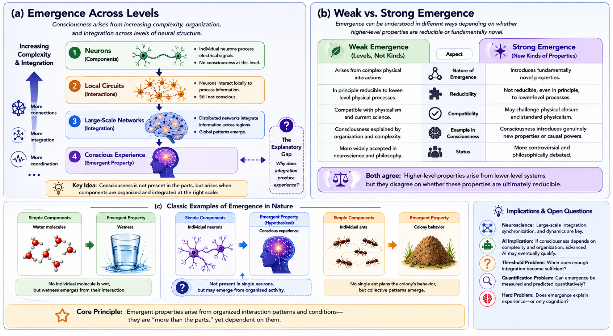

# Emergentism {#emergentism}

## Chapter Overview

Emergentism proposes that consciousness arises from organized complexity. According to emergentist theories, conscious experience is not present within isolated neurons or elementary physical components individually, but emerges from large-scale patterns of:

- interaction;
- integration;
- organization;
- coordination;
- and dynamic system-wide activity.

Emergentist approaches attempt to bridge the gap between:

- strict reductionism;
and:
- substance dualism.

Rather than treating consciousness as either:

- reducible to isolated physical components;
or:
- fundamentally separate from the physical world,

emergentism argues that consciousness is a higher-level property arising from sufficiently organized systems.

This perspective became increasingly influential as neuroscience shifted from studying isolated brain regions toward:

- network dynamics;
- large-scale integration;
- synchronization;
- recurrent processing;
- and complex systems organization.

Emergentism therefore occupies an important middle position within consciousness studies:

- consciousness depends on physical systems;
but:
- higher-order organization may possess genuine explanatory significance beyond isolated components alone.

At the same time, emergentism remains controversial because critics argue that saying consciousness “emerges” may simply redescribe the mystery rather than explain it fully.

The central unresolved question therefore becomes:

> Why should organized complexity produce subjective experience at all?

## Learning Objectives

After reading this chapter, the reader should be able to:

- Define the central claims of emergentism
- Distinguish weak and strong emergence
- Explain how emergentism differs from reductionism and dualism
- Describe the relationship between complexity and consciousness
- Explain why network organization became important in neuroscience
- Analyze emergentist interpretations of AI consciousness
- Evaluate strengths and criticisms of emergentist theories
- Understand the relationship between emergence and the hard problem

## Why Emergence Became Appealing

Many researchers found both strict reductionism and substance dualism unsatisfactory.

Strict reductionism appeared unable to explain:

- unified conscious experience;
- large-scale coordination;
- subjective awareness;
- and integrated cognition

purely in terms of isolated physical components.

Dualism, by contrast, introduced major difficulties concerning:

- mind–body interaction;
- scientific testability;
- causal explanation;
- and integration with neuroscience.

Emergentism became attractive because it offered a middle position:

- consciousness depends on physical systems;
but:
- higher-level organization may possess genuinely important explanatory properties.

This allowed researchers to preserve:

- scientific naturalism;
while:
- recognizing the importance of large-scale organization, integration, and dynamic interaction.

As neuroscience increasingly emphasized:

- distributed processing;
- recurrent connectivity;
- network integration;
- and large-scale synchronization,

emergentist ideas became increasingly influential.

## Historical Development

Emergentist ideas developed partly in response to dissatisfaction with both:

- reductionism;
- and dualism.

Early emergentist thinkers argued that nature contains organizational levels whose properties cannot be fully understood by analyzing isolated components alone.

Important historical contributors include:

- George Henry Lewes;
- Samuel Alexander;
- C. D. Broad;
- Roger Sperry;
- John Searle.

[@broad1925; @alexander1920]

Emergentist thinking later intersected with:

- systems theory;
- complexity science;
- network neuroscience;
- information theory;
- cybernetics;
- dynamical systems theory;
- and artificial intelligence.

Unlike dualism, emergentism usually rejects the existence of a separate immaterial substance.

Unlike strict reductionism, however, it argues that higher-level organizational structure may possess explanatory importance beyond isolated lower-level components.

## Core Idea of Emergence

Emergent properties are properties that arise from organized interactions among simpler components but are not present in the components individually.

Examples of emergence appear throughout nature:

- wetness emerges from water molecules;
- hurricanes emerge from atmospheric dynamics;
- colony behaviour emerges from interacting ants;
- life emerges from biochemical organization;
- flocking patterns emerge from collective bird interactions.

Emergentists argue that consciousness may arise similarly.

Individual neurons are not themselves conscious, but sufficiently integrated neural systems may generate unified subjective experience.

Figure \@ref(fig:fig-emergence-levels) illustrates the central emergentist framework.

```{r fig-emergence-levels, echo=FALSE, fig.cap="Emergentist theories propose that consciousness arises from increasing complexity, interaction, integration, and large-scale neural organization. The figure distinguishes weak and strong emergence and illustrates how emergent properties arise from organized systems rather than isolated components alone. The highlighted transition between large-scale neural integration and conscious experience represents one of the central unresolved explanatory problems in consciousness studies.", out.width="100%", fig.align="center"}

```

As illustrated in Figure \@ref(fig:fig-emergence-levels), emergentist theories emphasize that consciousness is not localized to:

- a single neuron;
- isolated brain region;
- or elementary physical component.

Instead, conscious experience is interpreted as a higher-level phenomenon arising from:

- coordinated interaction;
- distributed processing;
- network integration;
- and large-scale dynamic organization.

Importantly, Figure \@ref(fig:fig-emergence-levels) also highlights one of the major unresolved debates:

```text
complexity
≠
automatic explanation of experience
```

Even if consciousness emerges from organized systems, critics argue that emergentism must still explain:

> why organized complexity should generate subjective experience at all.

## Emergence Across Levels of Organization

Emergentist theories often interpret consciousness as arising progressively across multiple organizational levels.

As shown in Figure \@ref(fig:fig-emergence-levels):

1. Individual neurons process signals but are not conscious individually.
2. Local neural circuits coordinate information processing.
3. Large-scale distributed networks integrate information dynamically.
4. Conscious experience emerges from sufficiently organized global interaction.

This perspective emphasizes that consciousness depends not merely on:

- neural quantity;
but:
- organizational structure;
- coordination;
- integration;
- and dynamic interaction.

Emergentism therefore attempts to explain consciousness not by locating a single:

```text
"consciousness neuron"
```

but by understanding how large-scale systems generate novel organizational properties.

## Weak and Strong Emergence

A major distinction within emergentism concerns the nature of emergence itself.

Figure \@ref(fig:fig-emergence-levels) contrasts weak and strong emergence directly.

## Weak Emergence

Weak emergence proposes that consciousness arises from complex physical interactions while remaining fully grounded in lower-level physical processes.

According to weak emergence:

- higher-level properties depend entirely on lower-level mechanisms;
- consciousness is emergent because it appears only at large scales of organization;
- and conscious states remain theoretically explainable through physical systems.

Weak emergence is generally compatible with:

- physicalism;
- neuroscience;
- computational modeling;
- and contemporary cognitive science.

Most scientifically oriented emergentist theories adopt weak emergence.

## Strong Emergence

Strong emergence argues that consciousness introduces genuinely novel properties that cannot be completely reduced to lower-level physical explanations even in principle.

According to strong emergence:

- consciousness may possess irreducible causal powers;
- subjective experience may represent fundamentally new features of reality;
- and higher-level properties may not be fully derivable from physical descriptions alone.

As illustrated in Figure \@ref(fig:fig-emergence-levels), strong emergence remains significantly more controversial because critics argue that it may conflict with:

- physical closure;
- scientific reduction;
- and standard causal explanation.

## Consciousness and Complex Systems

Emergentist theories frequently emphasize:

- distributed processing;
- synchronization;
- recurrent connectivity;
- global integration;
- dynamic interaction;
- self-organization;
- network complexity;
- and large-scale coordination.

From this perspective, consciousness is not a static object but a dynamic process arising from coordinated activity across interacting systems.

Modern neuroscience increasingly studies consciousness using:

- connectomics;
- network neuroscience;
- dynamical systems theory;
- complexity measures;
- recurrent neural activity;
- and global integration models.

This shift strengthened emergentist approaches substantially.

Rather than searching for a single localized mechanism, emergentists argue that consciousness depends on:

```text
system-wide organization.
```

## Emergence and Neural Integration

Emergentist theories strongly emphasize integration across distributed neural systems.

As shown conceptually in Figure \@ref(fig:fig-emergence-levels), isolated neurons alone may be insufficient for consciousness because consciousness appears to require:

- large-scale coordination;
- integration across regions;
- recurrent interaction;
- and dynamic synchronization.

This aligns naturally with several contemporary theories including:

- Global Workspace Theory;
- Integrated Information Theory;
- recurrent processing models;
- predictive processing;
- and network neuroscience.

Emergentism therefore overlaps substantially with modern integration-based approaches to consciousness.

## Relation to Other Theories

Emergentism overlaps with several major theories discussed elsewhere in this book.

### Relation to Physicalism

Like physicalism, emergentism treats consciousness as dependent on physical systems.

However, emergentism emphasizes that higher-level organization may possess explanatory importance beyond isolated physical components alone.

### Relation to Functionalism

Like functionalism, emergentism emphasizes:

- organization;
- interaction;
- and system dynamics.

However, emergentism often places greater emphasis on:

- biological complexity;
- dynamical interaction;
- and large-scale organization.

### Relation to Information Theories

Emergentism overlaps naturally with theories emphasizing:

- integration;
- complexity;
- information structure;
- and causal organization.

### Relation to Dualism

Unlike dualism, emergentism usually rejects the existence of a separate immaterial mental substance.

Consciousness remains fundamentally dependent on physical systems even if higher-order organization introduces novel explanatory challenges.

## Downward Causation

Some emergentist theories propose that higher-level conscious states may exert causal influence on lower-level neural activity.

This idea is called:

```text
downward causation
```

For example:

- intentions;
- emotional states;
- goals;
- and conscious decisions

may shape lower-level neural processing and behaviour.

Supporters argue that higher-level organizational states can possess genuine explanatory significance even within physical systems.

Critics argue that downward causation risks conflicting with:

- physical closure;
- standard causal explanation;
- and reductionist neuroscience.

This remains one of the major philosophical debates within emergentism.

## Empirical Relevance

Evidence relevant to emergentist theories includes:

- large-scale neural integration;
- recurrent cortical activity;
- synchronization;
- global broadcasting;
- network connectivity;
- complexity measures;
- anesthesia research;
- split-brain studies;
- disorders of consciousness;
- and altered states.

Modern neuroscience increasingly studies consciousness through:

- network-level dynamics;
rather than:
- isolated localization alone.

This shift substantially strengthened interest in emergentist frameworks.

Research involving:

- anesthesia;
- coma;
- minimally conscious states;
- and psychedelic states

also suggests that changes in large-scale integration and organization may strongly influence conscious awareness.

## Emergentism and Artificial Intelligence

Emergentism has major implications for machine consciousness.

If consciousness depends primarily on:

- sufficient complexity;
- integration;
- dynamic organization;
- and coordinated interaction,

then advanced artificial systems may eventually develop forms of consciousness under appropriate conditions.

As illustrated conceptually in Figure \@ref(fig:fig-emergence-levels), emergentist theories often imply that consciousness depends more on:

```text
organizational complexity
```

than on individual components alone.

However, emergentists disagree concerning what kinds of systems might qualify:

- purely computational systems;
- embodied agents;
- biologically inspired neural systems;
- globally integrated architectures;
- or self-modeling networks.

Some emergentists argue that current AI systems remain non-conscious because they lack:

- embodiment;
- unified selfhood;
- biological regulation;
- phenomenological integration;
- or dynamic autonomous organization.

## Strengths of Emergentism

Emergentism possesses several major strengths.

### Connection to Complexity Science

Emergentism aligns naturally with:

- systems theory;
- complexity science;
- neuroscience;
- and network dynamics.

### Middle Position Between Reductionism and Dualism

Emergentism avoids both:

- strict reductionism;
and:
- substance dualism.

### Compatibility with Modern Neuroscience

Large-scale integration and network organization play increasingly important roles in contemporary consciousness research.

### Flexible Applicability

Emergentist principles can potentially apply to:

- biological systems;
- artificial systems;
- distributed cognition;
- and complex adaptive networks.

### Explanatory Intuition

Emergence already appears throughout nature in many domains including:

- biology;
- chemistry;
- meteorology;
- ecology;
- and social systems.

This makes emergentism intuitively attractive to many researchers.

## Weaknesses and Criticisms

Despite its strengths, emergentism faces several major criticisms.

## Explanatory Vagueness

Critics argue that saying consciousness:

```text
"emerges"
```

may simply rename the phenomenon rather than explain it.

The theory must still explain:

- how;
and:
- why

subjective experience arises from complexity.

## The Emergence Gap

As highlighted conceptually in Figure \@ref(fig:fig-emergence-levels), increasing complexity alone may not automatically explain phenomenal experience.

Critics therefore argue that emergentism may relocate the hard problem without solving it.

## Lack of Precise Thresholds

Emergentist theories often struggle to identify exactly when consciousness appears as complexity increases.

Questions remain concerning:

- thresholds;
- measurement;
- quantification;
- and sufficient organizational conditions.

## The Hard Problem

Even if emergence explains:

- integration;
- cognition;
- coordination;
- and behaviour,

critics argue that it may still fail to explain:

- subjective feeling;
- qualia;
- and first-person awareness.

## Strong Emergence and Physical Closure

Strong emergence may conflict with assumptions concerning:

- physical closure;
- reduction;
- and standard scientific explanation.

## The Combination Problem

If consciousness emerges from non-conscious parts, critics ask:

> how does unified subjective experience become possible?

## Open Questions

Important unresolved questions remain for emergentist theories:

- Why should complexity generate experience?
- What exact organizational threshold is sufficient?
- Can emergence be measured quantitatively?
- Does emergence explain phenomenal consciousness or only cognition?
- Could non-biological systems become genuinely conscious?
- Is emergence merely descriptive or genuinely explanatory?

These questions remain central to ongoing consciousness research.

## Comparative Evaluation

Emergentism remains one of the most influential frameworks for connecting consciousness research with:

- neuroscience;
- complexity science;
- systems theory;
- AI;
- and network dynamics.

As illustrated throughout Figure \@ref(fig:fig-emergence-levels), emergentist theories interpret consciousness as arising from:

- increasing organization;
- integration;
- interaction;
- and large-scale coordination.

Emergentism therefore provides a scientifically attractive middle position between:

- reductionism;
and:
- dualism.

It explains why consciousness may depend on:

- distributed organization;
- integration;
- and dynamic interaction

while preserving continuity with physical systems.

At the same time, whether emergence genuinely explains subjective experience or merely redescribes the phenomenon remains one of the central unresolved debates in consciousness studies.

Emergentism therefore remains both:

- scientifically influential;
and:
- philosophically incomplete.

Its importance within modern neuroscience, complexity science, and AI research continues to grow, yet the fundamental explanatory relationship between:

```text
complexity
→
subjective experience
```

remains deeply contested.