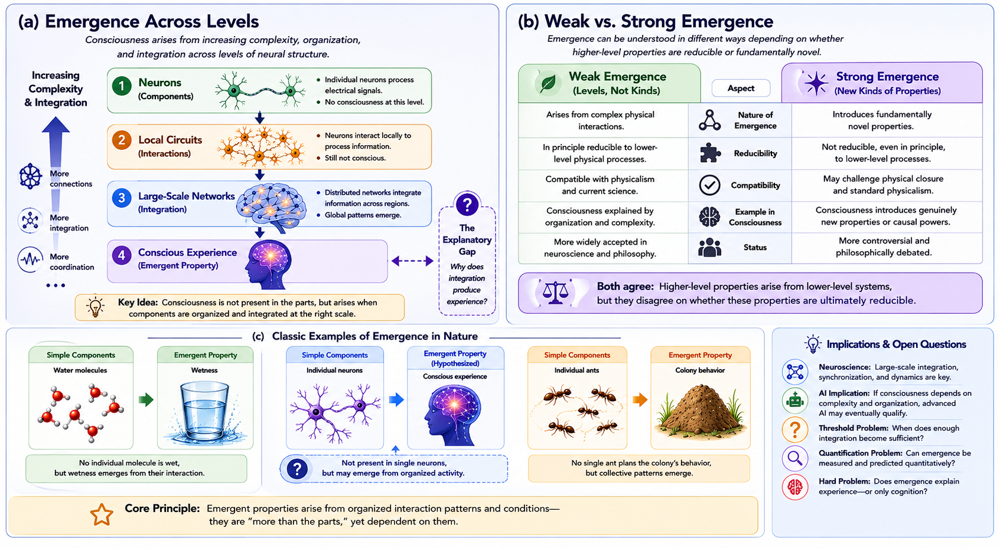

# Emergentism {#emergentism}

## Chapter Overview

Emergentism proposes that consciousness arises from organized complexity. According to emergentist theories, conscious experience is not present in isolated neurons, molecules, or elementary physical components individually. Instead, consciousness emerges from large-scale patterns of interaction, integration, coordination, and dynamic system-wide organization.

Emergentism attempts to occupy a middle position between strict reductionism and substance dualism. Strict reductionism tries to explain consciousness entirely in terms of lower-level physical components. Substance dualism treats consciousness as fundamentally separate from the physical world. Emergentism rejects both extremes. It argues that consciousness depends on physical systems, but that higher-level organization may possess explanatory significance that cannot be understood by examining isolated parts alone.

This perspective became increasingly influential as neuroscience shifted from studying isolated brain regions toward network dynamics, recurrent processing, large-scale integration, synchronization, and complex systems organization. Rather than searching for a single “consciousness location,” emergentist approaches ask how distributed neural systems interact to produce unified conscious experience.

At the same time, emergentism remains controversial. Critics argue that saying consciousness “emerges” may simply rename the mystery rather than explain it. The central unresolved question is therefore not only whether consciousness emerges from complexity, but why organized complexity should generate subjective experience at all [@chalmers1995; @levine1983].

This chapter explains the core idea of emergence, distinguishes weak and strong emergence, examines the relation between emergence and neuroscience, evaluates emergentist approaches to artificial intelligence, and considers whether emergentism can address the hard problem of consciousness.

## Learning Objectives

After reading this chapter, the reader should be able to:

* Define the central claim of emergentism.
* Distinguish weak emergence from strong emergence.
* Explain how emergentism differs from reductionism, dualism, and consciousness-first theories.
* Describe the relationship between complexity, integration, and consciousness.
* Explain why network organization became important in neuroscience.
* Evaluate emergentist interpretations of artificial intelligence and machine consciousness.
* Analyze the strengths and limitations of emergentist theories.
* Understand how emergence relates to the hard problem of consciousness.

## Why Emergence Became Appealing

Emergentism became appealing because many researchers found both strict reductionism and substance dualism unsatisfactory. Strict reductionism seemed too narrow because conscious experience appears to involve large-scale integration, unity, selfhood, and dynamic organization rather than isolated physical components alone. Substance dualism, by contrast, introduced difficulties concerning mind-body interaction, scientific testability, and integration with neuroscience.

Emergentism offered a middle path. It preserved scientific naturalism by treating consciousness as dependent on physical systems, but it also emphasized that higher-level organization matters. A brain is not merely a collection of neurons. It is a dynamically organized system whose parts interact across multiple scales. The emergentist claim is that consciousness may arise from this organization rather than from any isolated component.

This idea fits naturally with modern neuroscience. Consciousness research increasingly studies distributed networks, recurrent processing, global coordination, synchronization, and integration across brain regions. These developments strengthened the appeal of emergentist thinking because they suggest that consciousness may depend on system-wide organization rather than localized activity alone [@koch2016; @seth2021].

## Historical Development

Emergentist ideas developed in response to the limits of purely reductionist explanation. John Stuart Mill argued that some properties of wholes may not be straightforwardly predictable from the properties of their parts [@mill1843]. George Henry Lewes later helped popularize the language of emergence, distinguishing resultant effects from emergent effects [@lewes1875].

In the early twentieth century, philosophers such as Samuel Alexander and C. D. Broad developed more systematic emergentist accounts of nature [@alexander1920; @broad1925]. They argued that reality may contain levels of organization in which new properties appear at higher levels. These higher-level properties depend on lower-level processes but are not always reducible to them in a simple way.

In the twentieth century, emergentist thinking also appeared in neuroscience and systems theory. Roger Sperry argued that mental and conscious processes may have higher-level causal significance within brain organization [@sperry1969; @sperry1980]. John Searle later defended a biological naturalist view in which consciousness is caused by brain processes but exists as a higher-level biological feature [@searle1992].

Emergentism later intersected with systems theory, complexity science, cybernetics, network neuroscience, dynamical systems theory, artificial intelligence, and information theory. These fields all emphasize organized interaction rather than isolated components. This made emergentism increasingly relevant to contemporary consciousness research.

## The Core Idea of Emergence

An emergent property is a property that arises from organized interactions among simpler components but is not present in the components individually. Examples of emergence appear throughout nature. Wetness arises from the collective behaviour of water molecules. A hurricane arises from atmospheric dynamics. An ant colony displays collective behaviour not found in a single ant. Life arises from biochemical organization. Flocking patterns arise from the interaction of individual birds.

Emergentists argue that consciousness may arise in a similar way. Individual neurons are not conscious by themselves. Local circuits may process information without producing full conscious experience. However, sufficiently organized neural systems may generate unified awareness through large-scale coordination and integration.

```{r fig-emergence-levels, echo=FALSE, fig.cap="Emergentist theories propose that consciousness arises from increasing complexity, interaction, integration, and large-scale neural organization. The figure distinguishes weak and strong emergence and illustrates how emergent properties arise from organized systems rather than isolated components alone. The highlighted transition between large-scale neural integration and conscious experience represents one of the central unresolved explanatory problems in consciousness studies.", out.width="100%", fig.align="center"} id="wt55po"

```

Figure @ref(fig:fig-emergence-levels) illustrates the central emergentist framework. Consciousness is not treated as a property of a single neuron or isolated brain region. It is understood as a higher-level phenomenon arising from distributed processing, recurrent interaction, network integration, and large-scale dynamic organization.

The figure also highlights the central challenge. Complexity does not automatically explain experience. Even if consciousness emerges from organized systems, one must still explain why certain forms of organization are accompanied by subjective awareness.

## Emergence Across Levels of Organization

Emergentism interprets consciousness as arising across multiple levels of organization. At the lowest relevant level, individual neurons process signals. At a higher level, local circuits coordinate information. At a still higher level, distributed brain networks integrate perception, memory, attention, emotion, and action. Conscious experience may emerge only when these systems achieve a sufficient level of coordinated organization.

This perspective shifts attention away from locating a single consciousness-producing component. Instead, it asks how many components interact to generate a higher-level property. The relevant question is not “Which neuron is conscious?” but “What kind of organized system can support conscious experience?”

This approach fits naturally with network neuroscience. The brain is not a simple input-output device. It is a dynamic system involving feedback, recurrent loops, oscillations, synchronization, modular specialization, and global integration. Emergentism interprets consciousness as a property of this organized activity rather than a property of isolated parts.

## Weak and Strong Emergence

A major distinction within emergentism is the difference between weak emergence and strong emergence.

### Weak Emergence

Weak emergence occurs when a higher-level property arises from lower-level interactions but remains fully dependent on and explainable by those interactions. The property may be difficult to predict without simulation or system-level analysis, but it does not require new non-physical forces or irreducible causal powers.

Most scientific uses of emergence are forms of weak emergence. A flocking pattern, for example, emerges from the interaction of individual birds following simple rules. The pattern is real and higher-level, but it remains grounded in the behaviour of the birds.

Applied to consciousness, weak emergence suggests that conscious experience arises from complex neural organization. Consciousness appears only at higher levels of organization, but it remains fully dependent on physical systems. This view is generally compatible with physicalism, neuroscience, computational modeling, and cognitive science [@bedau1997; @holland1998].

### Strong Emergence

Strong emergence claims that higher-level properties are not fully reducible to lower-level physical processes, even in principle. On this view, consciousness may introduce genuinely novel features or causal powers that cannot be completely derived from lower-level physical descriptions.

Strong emergence is more controversial. It appears to offer a deeper response to the hard problem because it allows consciousness to be genuinely novel. However, it also raises difficult questions. If conscious states have new causal powers, how do these powers fit with the causal closure of the physical world? If they are not derivable from physical processes, how can they be integrated into science?

For this reason, strong emergence is sometimes seen as close to property dualism. It avoids a separate mental substance, but it may still treat consciousness as irreducible in a way that challenges standard physical explanation [@kim1999; @kim2005].

## Consciousness and Complex Systems

Emergentist theories often interpret consciousness as a dynamic process rather than a static object. Consciousness depends on distributed processing, recurrent connectivity, integration, synchronization, self-organization, and large-scale coordination.

Modern neuroscience increasingly studies consciousness using tools from network science and dynamical systems theory. Researchers investigate connectivity, global integration, complexity measures, recurrent activity, and state transitions across sleep, anesthesia, wakefulness, and altered states [@kelso1995; @koch2016; @seth2021].

This shift supports emergentist thinking because it suggests that consciousness may depend on organized dynamics across the brain. A single region may be important, but conscious experience appears to involve relations among regions, patterns of communication, and system-level organization.

However, the complexity of a system alone is not enough. Many systems are complex without obviously being conscious. Weather systems, economies, and computer networks may display complex dynamics, but it is not clear that they have subjective experience. Emergentism must therefore identify what kind of complexity matters for consciousness.

## Emergence and Neural Integration

Many contemporary theories of consciousness emphasize integration. Conscious experience appears unified: perceptions, bodily feelings, emotions, memories, and thoughts are usually experienced as belonging to a single subject. Emergentism interprets this unity as a higher-level property of integrated neural organization.

This idea overlaps with several major theories. Global Workspace Theory emphasizes global broadcasting of information across cognitive systems [@baars1988; @dehaene2011]. Integrated Information Theory emphasizes the intrinsic causal integration of information [@tononi2004; @oizumi2014]. Recurrent Processing Theory emphasizes recurrent interactions within neural systems [@lamme2006]. Predictive Processing emphasizes hierarchical prediction, error correction, and active inference across multiple levels of the nervous system [@friston2010; @clark2013].

Emergentism is not identical to any of these theories. Rather, it provides a broader framework in which such theories can be understood. They all suggest, in different ways, that consciousness depends on organized interaction rather than isolated physical components.

## Downward Causation

Some emergentist theories propose that higher-level states can influence lower-level processes. This idea is called downward causation. For example, a conscious intention, goal, emotional state, or attentional focus may shape neural activity, bodily movement, and behaviour.

Supporters argue that higher-level states can be causally relevant without violating physicalism. For example, the shape of a wheel explains its rolling even though the wheel is made of lower-level physical parts. Similarly, a high-level brain state may explain behaviour even though it is physically realized by neural activity.

Critics argue that downward causation is difficult to make precise. If every lower-level physical event already has a sufficient physical cause, then it is unclear what additional causal work the higher-level state performs. This concern is closely related to debates about mental causation in philosophy of mind [@kim1999; @kim2005].

The issue remains unresolved. Emergentism needs downward causation to explain why higher-level organization matters, but it must avoid treating higher-level properties as mysterious forces outside physical causation.

## Empirical Relevance

Emergentism is relevant to several areas of empirical consciousness research. Anesthesia research suggests that loss of consciousness may involve disruption of large-scale integration and communication across brain networks. Disorders of consciousness show that wakefulness, responsiveness, and awareness can dissociate depending on neural organization. Split-brain studies suggest that the unity of consciousness depends on patterns of neural connectivity. Psychedelic states show that changes in brain dynamics can produce profound changes in experience.

These cases support the idea that consciousness depends on system-level organization rather than isolated activity. Consciousness is not simply a matter of whether neurons are active. It depends on how neural activity is coordinated, integrated, and made available across systems [@laureys2005; @owen2006; @koch2016; @seth2021].

However, empirical evidence does not automatically prove emergentism. Many physicalist, functionalist, and information-based theories can also interpret these findings. Emergentism functions best as a broad framework for understanding why organization and complexity matter, rather than as a single precise empirical theory.

## Emergentism and Artificial Intelligence

Emergentism has important implications for artificial intelligence and machine consciousness. If consciousness arises from sufficient complexity, integration, and dynamic organization, then artificial systems might become conscious if they instantiate the right kind of organization.

This possibility depends on what kind of emergence one accepts. A weak emergentist may argue that consciousness could arise in any sufficiently organized physical system, whether biological or artificial. A more biologically oriented emergentist may argue that consciousness depends on living systems, embodiment, affect, homeostasis, or organism-environment interaction [@varela1991; @thompson2007; @seth2021].

Current AI systems raise this issue sharply. Large-scale artificial systems may display complex behaviour, language ability, pattern recognition, and adaptive responses. Yet it remains unclear whether they possess unified subjective experience. Complexity alone is not enough. An emergentist theory must specify which forms of organization are relevant to consciousness [@butlin2023].

Emergentism therefore makes artificial consciousness possible in principle, but it does not imply that current AI systems are conscious. The unresolved question is what threshold or organization would be sufficient for experience.

## Relation to Other Theories

Emergentism overlaps with several theories discussed elsewhere in this book, but it should not be confused with them.

### Relation to Physicalism

Emergentism is usually compatible with physicalism. Like physicalism, it treats consciousness as dependent on physical systems. However, emergentism emphasizes that higher-level organization may have explanatory importance beyond isolated lower-level components.

### Relation to Functionalism

Emergentism overlaps with functionalism because both emphasize organization and system-level relations. Functionalism focuses on causal roles and information-processing functions. Emergentism focuses more broadly on how novel higher-level properties arise from organized complexity.

### Relation to Dualism

Emergentism differs from substance dualism because it does not posit a separate immaterial mind. Consciousness remains dependent on physical systems. However, strong emergence can move closer to property dualism if it treats consciousness as irreducible in principle.

### Relation to Consciousness-First Theories

Emergentism differs from consciousness-first theories such as panpsychism, cosmopsychism, idealism, or Taheri’s T-Consciousness. Emergentism usually begins with physical organization and asks how consciousness arises from it. Consciousness-first theories reverse the direction of explanation by treating consciousness as fundamental or prior to material organization. These approaches will be discussed later in the book.

## Strengths of Emergentism

Emergentism has several major strengths. First, it fits naturally with complexity science, systems theory, neuroscience, and network dynamics. It recognizes that many important properties of living systems arise from organization rather than isolated parts.

Second, emergentism provides a middle position between strict reductionism and dualism. It avoids treating consciousness as a separate immaterial substance while also resisting overly simple reductions to individual neurons or physical components.

Third, it aligns with modern neuroscience. Consciousness research increasingly emphasizes large-scale integration, recurrent processing, brain connectivity, and dynamic coordination.

Fourth, emergentism is flexible. It can potentially apply to biological organisms, artificial systems, distributed networks, and complex adaptive systems.

Finally, emergentism captures an important intuition: many real properties in nature appear only at higher levels of organization. Consciousness may be one such property.

## Weaknesses and Criticisms

Emergentism faces several major criticisms. The most important is explanatory vagueness. Saying that consciousness “emerges” does not by itself explain how or why it emerges. Without a detailed mechanism, emergence can become a label rather than an explanation.

A second problem is the emergence gap. Even if complexity explains integration, coordination, and cognition, it may not explain subjective experience. This is the hard problem in emergentist form: why should complex organization feel like anything from the inside? [@chalmers1995; @chalmers1996]

A third problem concerns thresholds. Emergentist theories often struggle to identify when consciousness appears. How much complexity is enough? What kind of integration is required? Can consciousness be measured quantitatively? Does a simple animal have consciousness? Could an artificial system have it?

Strong emergence faces an additional problem. If consciousness has irreducible causal powers, then those powers must be reconciled with physical causation. Critics argue that strong emergence risks becoming a form of disguised dualism [@kim1999].

Finally, emergentism faces the combination problem in a different form. If consciousness emerges from non-conscious parts, how does unified subjective experience arise? What binds distributed processes into one conscious perspective?

## Open Questions

Several questions remain unresolved for emergentist theories. Why should complexity generate experience? What kind of organization is sufficient for consciousness? Is emergence weak, strong, or something between the two? Can emergence be measured scientifically? Does emergentism explain phenomenal consciousness or only cognitive integration? Could artificial systems become conscious through emergent organization? How does emergentism address the unity of consciousness?

These questions show why emergentism remains both attractive and incomplete. It provides a powerful framework for thinking about organization and complexity, but it must still explain why some organized systems are conscious.

## Evaluation

Emergentism is one of the most important frameworks for connecting consciousness research with neuroscience, complexity science, systems theory, artificial intelligence, and network dynamics. It explains why consciousness may depend on large-scale organization rather than isolated components. It also offers a scientifically attractive middle position between reductionism and dualism.

Its greatest strength is its emphasis on organization. The brain is not simply a collection of neurons. It is a living, dynamic, self-organizing system. Consciousness may depend on the coordinated activity of this system as a whole.

Its greatest weakness is that emergence can remain too vague. Unless emergentism explains which forms of organization produce experience and why they do so, it risks redescribing the hard problem rather than solving it.

Emergentism therefore remains scientifically influential and philosophically incomplete. It is likely to remain central to consciousness studies because any adequate theory of consciousness must explain how neural, biological, informational, and dynamic organization contribute to subjective experience.

## Chapter Summary

Emergentism proposes that consciousness arises from organized complexity. It rejects both strict reductionism and substance dualism. Consciousness is physically dependent, but it may require higher-level organization, integration, and dynamic interaction.

Weak emergence treats consciousness as fully grounded in physical processes, even if it appears only at higher levels of complexity. Strong emergence treats consciousness as involving novel or irreducible properties that may not be fully derivable from lower-level physical descriptions.

Emergentism is strongly connected to network neuroscience, complexity science, recurrent processing, global integration, and systems theory. It overlaps with theories such as Global Workspace Theory, Integrated Information Theory, Recurrent Processing Theory, and Predictive Processing.

The major strength of emergentism is that it recognizes the importance of large-scale organization. Its major weakness is that it may not fully explain why organized complexity gives rise to subjective experience.

The central unresolved question is whether emergence genuinely explains consciousness or simply names the point at which physical organization becomes difficult to reduce.
