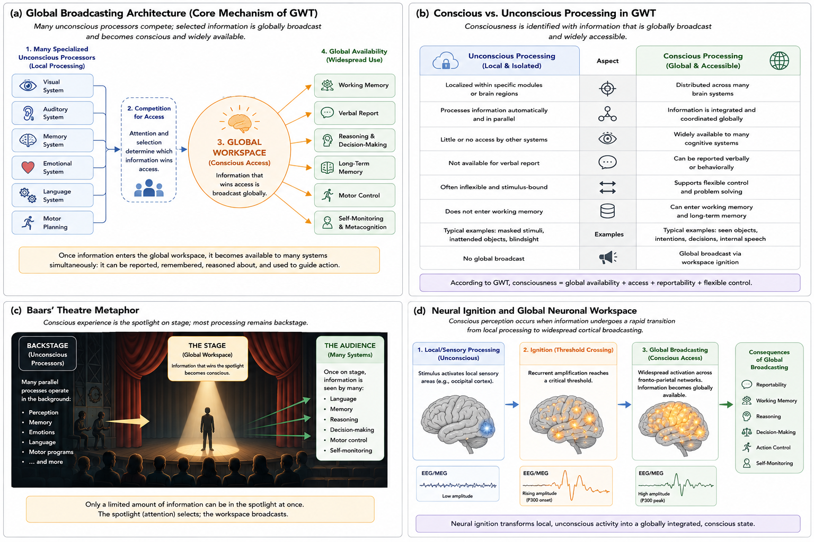

# Global Workspace Theory {#gwt}

## Chapter Overview

Global Workspace Theory (GWT) proposes that consciousness occurs when information becomes globally available to multiple cognitive systems. According to the theory, the brain contains many specialized unconscious processors operating in parallel, while conscious awareness emerges when selected information is broadcast widely across the system [@baars1988; @dehaene2011; @dehaene2014].

Rather than treating consciousness as a mysterious substance or purely subjective entity, GWT interprets consciousness primarily as a functional and informational process associated with global accessibility, reportability, flexible reasoning, memory integration, and behavioural control.

This chapter examines the historical development, conceptual foundations, cognitive architecture, neural interpretation, empirical evidence, strengths, criticisms, unresolved problems, and implications of Global Workspace Theory for neuroscience and artificial intelligence. :contentReference[oaicite:0]{index=0}

## Learning Objectives

After reading this chapter, the reader should be able to:

- Define the central claims of Global Workspace Theory.
- Explain the concept of global broadcasting.
- Distinguish conscious from unconscious processing in GWT.
- Describe the relationship between attention, reportability, and conscious access.
- Explain the Global Neuronal Workspace model and neural ignition.
- Evaluate the strengths and limitations of GWT.
- Analyze how GWT relates to the hard problem of consciousness and artificial intelligence.

## Historical Development

Global Workspace Theory was originally proposed by Bernard Baars as a cognitive architecture for explaining conscious access and coordination among multiple mental systems [@baars1988].

Baars argued that the brain resembles a system containing numerous specialized unconscious processors operating simultaneously and independently. Consciousness arises when selected information enters a global workspace, allowing the information to become broadly accessible to many systems at once.

The theory emerged partly in response to limitations in behaviourism and early computational psychology. Behaviourist approaches largely ignored subjective awareness, while early cognitive science often modeled cognition without adequately explaining why certain information becomes conscious.

Later developments by Stanislas Dehaene and colleagues transformed GWT into a more explicitly neuroscientific framework called the **Global Neuronal Workspace Theory** [@dehaene2011; @dehaene2014].

## Core Idea of Global Broadcasting

The defining idea of GWT is that consciousness depends on **global availability**.

Most processing in the brain remains unconscious and localized. Visual systems, memory systems, emotional systems, language systems, and motor systems can all operate independently without conscious awareness.

However, when certain information gains access to the global workspace, it becomes widely broadcast across many cognitive systems simultaneously. This allows the information to:

- enter working memory;
- guide reasoning and planning;
- support verbal report;
- influence decision-making;
- coordinate action;
- become available for self-monitoring.

Figure \@ref(fig:fig-gwt) illustrates the core architecture of Global Workspace Theory and the distinction between local unconscious processing and globally broadcast conscious processing.

```{r fig-gwt, echo=FALSE, fig.cap="Global Workspace Theory proposes that consciousness occurs when selected information becomes globally broadcast across multiple cognitive systems. The figure illustrates the architecture of global broadcasting, the distinction between conscious and unconscious processing, Baars' theatre metaphor, and the neural ignition process associated with conscious access.", out.width="100%", fig.align="center"}

```

As shown in Figure \@ref(fig:fig-gwt), many unconscious systems compete for access to the workspace. Only a limited amount of information becomes globally available at any given moment, which helps explain the selective and capacity-limited nature of conscious awareness.

## Baars’ Theatre Metaphor

Baars famously described the global workspace using a theatre metaphor.

In this analogy:

- the spotlight of attention illuminates selected information;
- conscious contents appear on the stage;
- the audience represents multiple cognitive systems receiving the information;
- backstage processes represent unconscious processing occurring outside awareness.

Most cognitive processing remains backstage and unconscious. Consciousness represents only a small subset of information temporarily occupying the spotlight.

The metaphor emphasizes several important ideas:

- consciousness is selective;
- conscious contents are globally accessible;
- most mental activity remains unconscious;
- attention influences what becomes conscious.

Although simplified, the theatre metaphor remains one of the most influential pedagogical models in consciousness studies.

## Conscious and Unconscious Processing

A major contribution of GWT is its distinction between conscious and unconscious information processing.

According to the theory:

### Unconscious Processing

Unconscious processes are typically:

- local;
- modular;
- automatic;
- isolated;
- inaccessible to report;
- inflexible.

Examples include:

- subliminal perception;
- automatic motor routines;
- unattended stimuli;
- blindsight-related processing.

### Conscious Processing

Conscious processing involves information that is:

- globally available;
- integrated across systems;
- reportable;
- flexible;
- accessible to working memory;
- usable for reasoning and planning.

Consciousness therefore functions less like a passive observer and more like a coordination system enabling widespread cognitive integration.

## Competition for Access

Global Workspace Theory emphasizes that many unconscious systems compete simultaneously for conscious access.

Sensory signals, memories, emotional states, goals, and attentional processes all compete for limited workspace capacity. Only some information gains sufficient amplification to enter consciousness.

This helps explain why:

- attention is selective;
- consciousness is capacity-limited;
- some stimuli remain unconscious despite sensory processing;
- conscious awareness changes dynamically over time.

According to GWT, consciousness is therefore not a continuous representation of all ongoing brain activity, but rather a selective broadcast of particularly relevant information.

## Global Neuronal Workspace Theory

Stanislas Dehaene and colleagues proposed a neuroscientific extension of GWT known as the **Global Neuronal Workspace Theory** [@dehaene2011; @dehaene2014].

This model proposes that conscious perception occurs when information undergoes large-scale neural amplification and broadcasting across distributed cortical networks, especially involving frontoparietal regions.

This process is often described as **neural ignition**.

Before ignition:

- processing remains local;
- activity is fragmented;
- information may remain unconscious.

After ignition:

- activity becomes widespread;
- cortical systems synchronize;
- information becomes globally accessible;
- conscious report becomes possible.

The theory therefore links consciousness to large-scale integration rather than isolated sensory activity alone.

## Attention and Consciousness

GWT is closely associated with attention, but the two concepts are not identical.

Attention refers to selective prioritization of information processing, whereas consciousness refers to globally available information accessible to multiple systems.

Some attended information may remain unconscious, while some conscious experiences may occur with relatively little deliberate attention.

This distinction remains an active area of research and debate within cognitive neuroscience.

## Experimental Evidence

Global Workspace Theory has been investigated using numerous experimental paradigms, including:

- visual masking;
- attentional blink;
- binocular rivalry;
- inattentional blindness;
- anesthesia;
- sleep and dreaming;
- disorders of consciousness;
- split-brain studies;
- working memory experiments;
- EEG and MEG studies;
- functional neuroimaging.

Several findings are often interpreted as supporting GWT:

- sudden large-scale neural activation associated with conscious perception;
- widespread cortical broadcasting;
- late-stage integration effects;
- neural ignition dynamics;
- correlations between reportability and frontoparietal activation.

However, critics argue that some findings may reflect reporting processes rather than consciousness itself.

## Strengths of Global Workspace Theory

Major strengths include:

- It provides a clear cognitive architecture for consciousness.
- It connects consciousness with experimentally measurable processes.
- It explains conscious access, reportability, and flexible control effectively.
- It aligns naturally with neuroscience and cognitive science.
- It generates testable predictions.
- It explains why most processing remains unconscious.
- It provides a useful framework for studying anesthesia, sleep, and disorders of consciousness.

GWT has also strongly influenced artificial intelligence, cognitive architectures, and computational neuroscience.

## Weaknesses and Criticisms

Despite its influence, GWT faces several important criticisms.

### Access vs. Phenomenology

One of the most common criticisms is that GWT explains **access consciousness** better than **phenomenal consciousness**.

Critics argue that global broadcasting may explain reportability and cognitive availability without explaining why experience feels like anything subjectively.

### The Hard Problem

GWT does not fully resolve the hard problem of consciousness. Even if global broadcasting explains cognitive integration, critics argue that the theory still does not explain why integrated information should generate subjective experience.

### Frontoparietal Debate

Some researchers argue that frontoparietal activation may reflect reporting demands rather than consciousness itself.

This debate remains central within contemporary neuroscience.

### Overflow Criticism

Some philosophers argue that conscious experience may exceed what can be cognitively accessed or verbally reported. According to the overflow argument, individuals may consciously experience more information than the global workspace can broadcast.

This criticism challenges the identification of consciousness with reportability and cognitive access alone.

## Implications for Artificial Intelligence

Global Workspace Theory has important implications for artificial intelligence and machine consciousness.

If consciousness depends primarily on global integration and broadcasting, then artificial systems possessing sufficiently advanced workspace architectures might potentially achieve some form of consciousness.

This possibility has motivated research into:

- cognitive architectures;
- integrated AI systems;
- attention-based models;
- multi-agent coordination systems;
- large-scale information integration.

However, many researchers argue that current AI systems lack essential properties such as:

- genuine phenomenology;
- biological embodiment;
- unified selfhood;
- affective integration;
- autonomous subjective perspective.

Whether global broadcasting alone is sufficient for consciousness remains unresolved.

## Explanatory Scope

Global Workspace Theory attempts to explain:

- conscious access;
- reportability;
- flexible reasoning;
- working memory integration;
- attentional selection;
- cognitive coordination;
- neural broadcasting;
- conscious control of behaviour.

However, important unresolved questions remain:

- Why should broadcasting produce subjective experience?
- Is global availability sufficient for phenomenology?
- Can consciousness exist without reportability?
- Are frontoparietal networks necessary for consciousness?
- Could artificial systems genuinely possess conscious experience?

## Summary

Global Workspace Theory proposes that consciousness occurs when information becomes globally available across multiple cognitive systems. Conscious awareness is interpreted as a form of large-scale informational broadcasting that enables flexible reasoning, memory integration, reportability, and coordinated behaviour.

The theory has become one of the most influential frameworks in modern consciousness science because it connects cognitive architecture, neuroscience, experimental evidence, and computational modeling within a unified explanatory framework.

Nevertheless, major philosophical and scientific questions remain unresolved, especially regarding whether global broadcasting explains phenomenal experience itself or primarily explains conscious access and reportability.