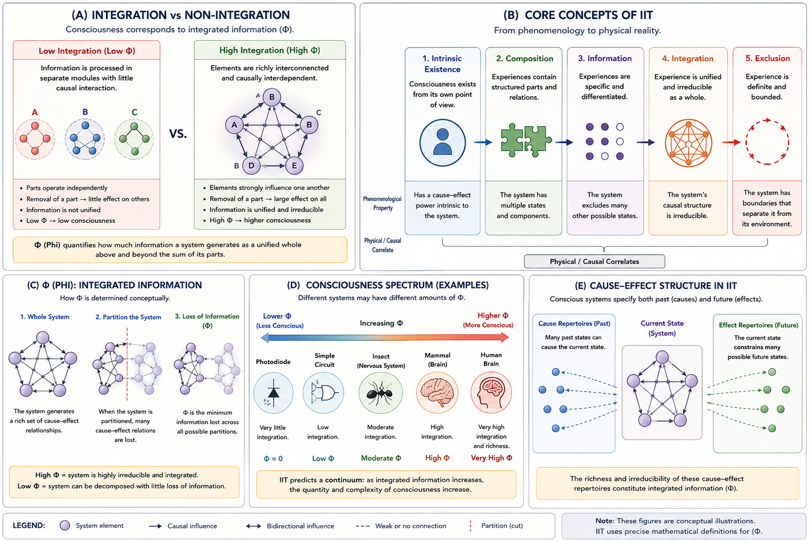

# Integrated Information Theory {#iit}

## Chapter Overview

Integrated Information Theory (IIT) is one of the most ambitious and controversial contemporary theories of consciousness. Developed primarily by Giulio Tononi and collaborators, IIT proposes that consciousness corresponds to integrated causal information generated by a system with intrinsic causal structure [@tononi2004; @oizumi2014].

Unlike theories that begin primarily from:

- cognition;
- reportability;
- attention;
- behavioural control;
- or information access,

IIT begins from the apparent structure of conscious experience itself.

The theory attempts to answer a foundational question:

> What properties must a physical system possess in order to generate subjective experience?

According to IIT, consciousness is not merely:

- computation;
- intelligent behaviour;
- information processing;
- or functional performance.

Instead, consciousness depends fundamentally on the degree to which a system forms an integrated and irreducible causal whole.

IIT therefore places special emphasis on:

- phenomenology;
- system unity;
- intrinsic existence;
- irreducibility;
- causal structure;
- and informational integration.

The theory became especially influential because it attempted something rare within consciousness science:

```text
a mathematically structured theory
of phenomenal consciousness itself.
```

At the same time, IIT remains highly controversial because critics argue that:

- integration alone may not explain subjective feeling;
- Φ (Phi) may be difficult to compute reliably;
- and the theory may attribute consciousness too broadly.

This chapter examines the conceptual foundations, phenomenological axioms, integrated information measure (Φ), neuroscientific implications, strengths, criticisms, philosophical consequences, and unresolved problems associated with Integrated Information Theory.

## Learning Objectives

After reading this chapter, the reader should be able to:

- Define the central claims of Integrated Information Theory
- Explain the meaning of integrated information and Φ (Phi)
- Distinguish IIT from access-based theories such as Global Workspace Theory
- Describe IIT’s phenomenological axioms
- Explain the concept of irreducibility
- Analyze IIT’s neuroscientific implications
- Evaluate the strengths and criticisms of IIT
- Discuss IIT’s implications for AI, animals, and panpsychism
- Understand the relationship between IIT and the hard problem

## Why Integrated Information Theory Became Influential

Integrated Information Theory became influential because it attempted to address a major limitation in many cognitive theories of consciousness.

Many earlier theories focused primarily on:

- reportability;
- attention;
- working memory;
- behavioural access;
- and cognitive coordination.

Tononi argued that such approaches might explain:

- what consciousness does;
without fully explaining:
- what consciousness is like.

IIT therefore shifted focus toward:

```text
the intrinsic structure of experience itself.
```

Rather than beginning from cognition or behaviour, IIT begins from phenomenology and asks:

> What properties does conscious experience appear to possess intrinsically?

The theory then attempts to derive physical requirements capable of supporting those properties.

This reversal of explanatory direction made IIT philosophically distinctive and highly influential.

IIT also became important because it attempted to:

- formalize consciousness mathematically;
- connect phenomenology to causal structure;
- and generate quantitative predictions about conscious systems.

## Historical Development

Integrated Information Theory was originally proposed by Giulio Tononi in the early 2000s [@tononi2004].

The theory developed partly in response to dissatisfaction with approaches emphasizing only:

- behavioural access;
- reportability;
- cognitive function;
- or neural correlates.

Tononi argued that conscious experience appears:

- unified;
- irreducible;
- structured;
- differentiated;
- and intrinsically existent.

The theory therefore attempts to explain why consciousness possesses these apparent features.

Later developments by Tononi, Oizumi, Koch, and others expanded IIT into a mathematically sophisticated framework emphasizing:

- causal structure;
- system integration;
- informational differentiation;
- and intrinsic causal power.

[@oizumi2014]

Unlike many other theories, IIT explicitly attempts to explain:

```text
phenomenal consciousness
```

rather than only cognitive access or reportability.

This made IIT especially significant within philosophical discussions concerning the hard problem.

## Phenomenological Starting Point

A defining feature of IIT is that it begins from phenomenology rather than from behaviour or cognition.

Instead of asking:

> “What cognitive functions accompany consciousness?”

IIT asks:

> “What properties characterize conscious experience itself?”

According to IIT, conscious experience appears to possess several fundamental properties:

- it exists intrinsically;
- it is structured;
- it is unified;
- it is differentiated;
- and it is definite and bounded.

These observations form the basis for IIT’s phenomenological axioms.

Figure \@ref(fig:fig-iit) Panel B summarizes these foundational phenomenological principles.

```{r fig-iit, echo=FALSE, fig.cap="Integrated Information Theory (IIT). Panel A compares low and high integration. Panel B summarizes IIT’s phenomenological axioms. Panel C illustrates the conceptual meaning of Φ (Phi). Panel D presents a simplified consciousness spectrum across systems. Panel E illustrates intrinsic cause-effect structure and irreducible causal organization.", out.width="100%", fig.align="center"}

```

As illustrated in Figure \@ref(fig:fig-iit) Panel B, IIT attempts to derive the physical requirements for consciousness directly from the apparent structure of experience itself.

## Phenomenological Axioms

IIT proposes several phenomenological axioms intended to describe universal properties of conscious experience.

## Intrinsic Existence

Consciousness exists intrinsically from its own perspective.

Experience exists for the subject undergoing it, independent of external observation.

## Composition

Experiences contain internal structure and relations.

Consciousness is not a single undifferentiated state but contains organized distinctions and patterns.

## Information

Every conscious experience is specific and differentiated from alternative possible experiences.

Each experience excludes many other possible states.

## Integration

Conscious experience appears unified and irreducible.

Experiences normally cannot be decomposed into fully independent conscious parts.

## Exclusion

Experiences are definite and bounded.

At any given moment, a conscious experience excludes other possible experiences and exists at a particular scale.

These phenomenological axioms form the conceptual foundation for IIT’s physical postulates.

## Integrated Information and Φ (Phi)

The central quantitative concept in IIT is:

```text
Φ (Phi)
```

which represents integrated information.

According to IIT, consciousness corresponds to the amount of integrated causal information generated by a system as a unified whole.

A system possesses high Φ when:

- its components strongly influence one another;
- causal interactions are highly integrated;
- the system forms an irreducible whole;
- and partitioning the system destroys substantial causal structure.

A system possesses low Φ when:

- components operate relatively independently;
- interactions remain weak or modular;
- and partitioning causes little informational loss.

Figure \@ref(fig:fig-iit) Panel A conceptually compares systems with low and high integration.

As shown in Panel A, highly integrated systems generate unified causal organization, whereas fragmented systems behave more like collections of independent modules.

## Irreducibility and System Unity

A defining claim of IIT is that consciousness depends not merely on:

- complexity;
- intelligence;
- or computation,

but on:

```text
irreducible causal integration.
```

According to IIT:

> the whole must possess causal power beyond the independent contributions of its isolated parts.

Figure \@ref(fig:fig-iit) Panel C conceptually illustrates this idea.

Partitioning a highly integrated system significantly disrupts its causal organization and reduces Φ.

Partitioning a weakly integrated system produces relatively little loss because the components already function largely independently.

According to IIT:

- higher Φ corresponds to richer conscious integration;
- lower Φ corresponds to weaker or absent consciousness.

This emphasis on irreducibility represents one of IIT’s most distinctive philosophical claims.

## Consciousness as a Spectrum

IIT implies that consciousness exists along a continuum rather than as a strictly all-or-nothing phenomenon.

Figure \@ref(fig:fig-iit) Panel D illustrates this conceptual spectrum.

According to IIT:

- simple systems may possess extremely low Φ;
- animals may possess varying degrees of consciousness;
- human brains may generate very high Φ;
- future artificial systems might potentially possess consciousness if they generate sufficient integration.

This aspect of IIT has generated major debate because it suggests consciousness may extend beyond humans and perhaps beyond biological systems entirely.

## Intrinsic Cause-Effect Structure

IIT proposes that conscious systems possess intrinsic cause-effect structure.

A conscious system:

- constrains possible past states;
- constrains possible future states;
- and exerts causal influence internally upon itself.

Figure \@ref(fig:fig-iit) Panel E illustrates this idea schematically.

According to IIT, consciousness corresponds not simply to information processing but to:

```text
intrinsic causal power.
```

This distinction separates IIT from purely functional or computational approaches emphasizing external input-output behaviour.

## IIT and Neuroscience

Integrated Information Theory has important neuroscientific implications.

The theory predicts that consciousness should correlate with:

- large-scale integration;
- recurrent connectivity;
- unified causal interaction;
- and highly integrated neural organization.

IIT also attempts to explain why some highly complex neural systems may contribute relatively little to conscious awareness.

For example:

- the cerebellum contains enormous numbers of neurons,
but:
- its architecture is comparatively modular.

IIT therefore predicts that the cerebellum may contribute less to conscious experience despite its computational sophistication.

Research relevant to IIT includes:

- anesthesia studies;
- perturbational complexity index (PCI) research;
- EEG and MEG integration measures;
- sleep and dreaming studies;
- disorders of consciousness;
- split-brain investigations;
- recurrent connectivity research.

The development of PCI became especially important because it provided a possible empirical measure related to integrated complexity during:

- wakefulness;
- anesthesia;
- sleep;
- coma;
- and minimally conscious states.

## IIT and the Hard Problem

Integrated Information Theory is one of the few major scientific theories that explicitly attempts to address:

```text
phenomenal consciousness
```

rather than only cognitive access.

Unlike Global Workspace Theory, IIT does not define consciousness primarily in terms of:

- reportability;
- broadcasting;
- or cognitive accessibility.

Instead, IIT attempts to explain:

- why experience appears unified;
- why consciousness exists intrinsically;
- and why conscious experience possesses qualitative structure.

This makes IIT especially relevant to discussions concerning the hard problem.

However, critics argue that IIT may still leave the deepest form of the hard problem unresolved:

> Why should integrated information feel like anything at all?

As highlighted conceptually throughout Figure \@ref(fig:fig-iit), even if Φ successfully measures integration, critics question whether integration alone explains:

- subjective feeling;
- phenomenal quality;
- or qualitative character itself.

This remains one of the central debates surrounding IIT.

## Relation to Other Theories

IIT differs significantly from many other major theories discussed in this book.

## Relation to Global Workspace Theory

Global Workspace Theory emphasizes:

- cognitive access;
- reportability;
- and global broadcasting.

IIT instead emphasizes:

- intrinsic causal structure;
- irreducibility;
- and phenomenological unity.

Many researchers therefore interpret GWT primarily as a theory of:

```text
access consciousness
```

whereas IIT attempts to explain:

```text
phenomenal consciousness itself.
```

## Relation to Functionalism

Functionalist theories define mental states according to causal-functional roles.

IIT instead argues that:

```text
not all functional organization is phenomenally equivalent.
```

The internal causal structure of the system matters fundamentally.

## Relation to Emergentism

IIT overlaps with emergentist ideas because consciousness depends on large-scale integrated organization.

However, IIT attempts to formalize emergence mathematically through Φ and causal structure.

## Relation to Panpsychism

Because IIT attributes consciousness to systems possessing integrated information, some philosophers argue that IIT moves toward panpsychism or panpsychist-like implications.

This remains highly controversial.

## Strengths of Integrated Information Theory

IIT possesses several major strengths.

## Direct Engagement with Phenomenology

Unlike many cognitive theories, IIT directly attempts to explain subjective experience itself.

## Mathematical Structure

IIT provides one of the most mathematically explicit frameworks in consciousness research.

## Emphasis on Unity

The theory naturally explains why consciousness appears unified and irreducible.

## Cross-Disciplinary Influence

IIT has strongly influenced:

- neuroscience;
- philosophy;
- information theory;
- complexity science;
- and AI consciousness research.

## Clinical Relevance

Measures related to integration and complexity may assist research involving:

- anesthesia;
- coma;
- disorders of consciousness;
- and altered states.

## Broad Applicability

IIT potentially applies across:

- humans;
- animals;
- artificial systems;
- and non-standard architectures.

## Weaknesses and Criticisms

Despite its influence, IIT faces several important criticisms.

## Computational Difficulty

Calculating Φ precisely for realistic systems may become computationally intractable.

This creates major practical challenges for large-scale systems such as brains.

## Panpsychism Concerns

Critics argue that IIT may attribute consciousness too broadly.

This raises controversial questions concerning:

- simple circuits;
- photodiodes;
- artificial networks;
- collective systems;
- and minimal causal structures.

## Empirical Challenges

Some researchers argue that IIT remains difficult to falsify experimentally.

Critics question whether current measures genuinely capture consciousness rather than merely:

- complexity;
- connectivity;
- or neural integration.

## Mapping Problem

Even if Φ successfully measures integration, critics argue that IIT may still fail to explain:

- why integration generates experience;
- why experiences possess particular qualitative character;
- or why specific phenomenological structures arise.

## Limited Account of Cognition

Compared to theories such as GWT, IIT may explain:

- phenomenological unity;
more effectively than:
- attention;
- reportability;
- flexible reasoning;
- or cognitive control.

## Overextension Problem

Critics argue that IIT risks expanding consciousness attribution beyond scientifically plausible limits.

This remains one of the most controversial aspects of the theory.

## IIT and Artificial Intelligence

Integrated Information Theory has major implications for machine consciousness.

If consciousness depends fundamentally on:

- integrated causal structure;
- irreducibility;
- and intrinsic causal organization,

then sufficiently integrated artificial systems might potentially become conscious.

However, IIT also suggests that:

- ordinary digital architectures may possess low Φ;
- simulation alone may not generate consciousness;
- functional equivalence may not guarantee phenomenology.

This creates important distinctions between:

- intelligence;
- computation;
- functional behaviour;
- and consciousness itself.

As illustrated conceptually in Figure \@ref(fig:fig-iit), IIT therefore contributes significantly to debates concerning:

- AI consciousness;
- machine phenomenology;
- and synthetic minds.

## Open Questions

Several important unresolved questions remain:

- Why should integrated information generate subjective experience?
- Can Φ be measured reliably?
- Is consciousness fundamentally graded?
- Can simple systems possess minimal consciousness?
- Are IIT’s phenomenological axioms universally valid?
- Does IIT overextend consciousness attribution?
- Can digital systems genuinely possess high Φ?
- Does integration alone explain phenomenal quality?

These questions remain central within contemporary consciousness science.

## Comparative Evaluation

Integrated Information Theory remains one of the most ambitious and philosophically distinctive theories in modern consciousness research because it attempts to connect:

- phenomenology;
- causal structure;
- integration;
- and physical systems

within a unified explanatory framework.

As illustrated throughout Figure \@ref(fig:fig-iit), IIT interprets consciousness primarily as:

```text
integrated irreducible causal information.
```

The theory is especially powerful for explaining:

- phenomenological unity;
- irreducibility;
- intrinsic existence;
- and integrated subjective structure.

At the same time, whether integrated information fully explains:

- phenomenal feeling;
- qualitative character;
- and subjective experience itself

remains deeply contested.

Integrated Information Theory therefore remains both:

- conceptually groundbreaking;
and:
- philosophically controversial.

Its influence across neuroscience, philosophy, information theory, and AI consciousness research has been enormous, yet the relationship between:

```text
integrated information
→
subjective experience
```

remains one of the deepest unresolved questions in consciousness studies.