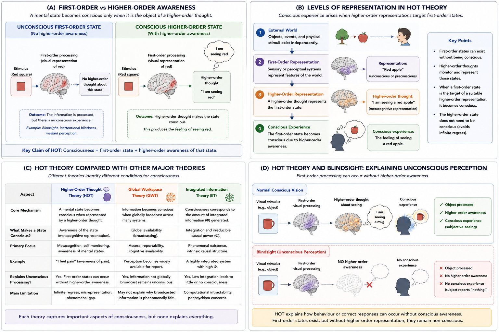

# Higher-Order Thought Theory {#hot}

## Chapter Overview

Higher-Order Thought (HOT) theories propose that a mental state becomes conscious only when it becomes the object of a suitable higher-order representation—an awareness *of* that state [@rosenthal2005; @lau2006].

According to HOT theory:

- first-order perceptual and cognitive processes can occur unconsciously;
- consciousness arises when the system becomes aware of being in those states;
- and conscious experience therefore depends fundamentally on meta-representation and self-monitoring.

HOT theories place:

- metacognition;
- introspection;
- reflective awareness;
- and awareness-of-awareness

at the center of consciousness research.

Unlike theories emphasizing:

- global broadcasting;
- integrated information;
- recurrent processing;
- or predictive inference,

HOT theories argue that consciousness depends primarily on whether a mental state becomes represented by a higher-order monitoring system.

The theory became especially influential because it explains several important phenomena naturally, including:

- unconscious perception;
- blindsight;
- subliminal processing;
- introspection;
- confidence judgments;
- and metacognitive awareness.

At the same time, HOT remains controversial because critics argue that higher-order representation may explain:

- cognitive access;
- reflective awareness;
- and self-monitoring

without fully explaining:

- phenomenal feeling;
- qualia;
- or subjective experience itself.

This chapter examines the conceptual foundations, representational structure, neuroscientific implications, strengths, criticisms, and philosophical consequences of Higher-Order Thought Theory.

## Learning Objectives

After reading this chapter, the reader should be able to:

- Define the central claims of Higher-Order Thought Theory
- Distinguish first-order from higher-order mental states
- Explain how higher-order representation produces conscious awareness
- Understand HOT’s interpretation of unconscious perception
- Analyze HOT explanations of blindsight and metacognition
- Compare HOT with Global Workspace Theory and IIT
- Evaluate strengths and criticisms of HOT theory
- Explain HOT’s implications for AI and machine consciousness

## Why HOT Theory Became Influential

Higher-Order Thought theories became influential because they offered a compelling explanation for one of the most important observations in consciousness research:

```text
not all mental processing is conscious.
```

The brain appears capable of processing large amounts of information unconsciously, including:

- visual perception;
- emotional evaluation;
- language processing;
- motor preparation;
- and decision-related activity.

HOT theory explains this by proposing that:

> mental states become conscious only when the system becomes aware of having those states.

This framework naturally explains why:

- unconscious processing can still influence behaviour;
- some perceptual states remain unconscious;
- introspection varies across situations;
- and metacognitive confidence differs between tasks.

The theory also became important because it connects consciousness directly with:

- self-awareness;
- reflective cognition;
- and metacognitive monitoring.

As a result, HOT strongly influenced both:

- philosophy of mind;
and:
- cognitive neuroscience.

## Historical Development

Although ideas involving self-awareness and reflective consciousness appear throughout the history of philosophy, the modern form of HOT theory was developed most prominently by David Rosenthal [@rosenthal2005].

Rosenthal argued that:

> a mental state becomes conscious when one has a higher-order thought about being in that mental state.

This approach shifted attention away from:

- external behaviour;
- simple sensory processing;
- or information access alone

and toward:

- awareness of mental states themselves.

HOT theories emerged partly in response to limitations in:

- behaviourism;
- early functionalism;
- and purely input-output models of cognition.

Researchers increasingly recognized that sophisticated processing could occur without conscious awareness.

HOT theory attempted to explain this distinction systematically.

Later developments connected HOT to:

- metacognition;
- confidence judgments;
- introspection research;
- self-monitoring;
- and prefrontal cortical function.

## Core Idea of Higher-Order Representation

The defining claim of HOT theory is that consciousness depends on:

```text
awareness of mental states
```

rather than on first-order processing alone.

A first-order mental state may represent:

- a visual object;
- bodily sensation;
- memory;
- sound;
- emotion;
- or thought.

However, according to HOT theory:

> the state becomes conscious only when the system represents itself as being in that state.

Figure \@ref(fig:fig-hot) summarizes the central architecture of HOT theory.

```{r fig-hot, echo=FALSE, fig.cap="Higher-Order Thought Theory (HOT). Panel A contrasts unconscious first-order processing with conscious higher-order awareness. Panel B illustrates layered representational structure. Panel C compares HOT with Global Workspace Theory and Integrated Information Theory. Panel D illustrates HOT interpretations of blindsight and unconscious perception.", out.width="100%", fig.align="center"}

```

As illustrated in Figure \@ref(fig:fig-hot), HOT theory distinguishes sharply between:

- unconscious first-order processing;
and:
- conscious higher-order awareness.

Importantly, the figure also highlights one of HOT’s central claims:

```text
processing alone
≠
conscious awareness
```

Consciousness depends specifically on whether the system becomes aware of being in a particular mental state.

## First-Order Mental States

First-order states directly represent:

- objects;
- sensations;
- events;
- bodily conditions;
- or environmental stimuli.

Examples include:

- seeing red;
- hearing music;
- feeling pain;
- smelling coffee;
- remembering a face.

These states process information about the world or the body.

Importantly, HOT theory argues that first-order states alone may remain unconscious.

Figure \@ref(fig:fig-hot) Panel A illustrates this distinction between:

- first-order processing;
and:
- conscious awareness.

As shown in Panel A, information processing may occur without consciousness if higher-order representation does not occur.

## Higher-Order Thoughts

Higher-order thoughts are mental states directed toward other mental states.

Examples include:

- “I am seeing red”;
- “I am feeling pain”;
- “I am hearing music”;
- “I am thinking about mathematics.”

According to HOT theory:

```text
consciousness arises
when mental states become represented
by higher-order awareness.
```

This creates a layered architecture of representation.

Figure \@ref(fig:fig-hot) Panel B illustrates this hierarchical structure schematically.

The representational sequence can be summarized as:

1. External stimulus
2. First-order representation
3. Higher-order representation
4. Conscious awareness

HOT therefore interprets consciousness fundamentally as:

```text
meta-representation.
```

## Metacognition and Reflective Awareness

HOT theory strongly emphasizes metacognition: the ability to monitor and evaluate one’s own mental states.

Processes associated with metacognition include:

- introspection;
- confidence judgments;
- uncertainty monitoring;
- reflective thought;
- self-evaluation;
- awareness of error;
- self-monitoring.

Because HOT theory connects consciousness with awareness-of-awareness, it naturally overlaps with research involving:

- introspective accuracy;
- confidence ratings;
- prefrontal monitoring systems;
- and reflective cognition.

This metacognitive emphasis distinguishes HOT from theories focusing primarily on:

- integration;
- global access;
- or sensory processing alone.

## Conscious vs Unconscious Processing

One of HOT theory’s greatest strengths is its explanation of unconscious processing.

HOT theory proposes that:

```text
many mental states remain unconscious
because they are not represented
at the higher-order level.
```

This helps explain phenomena such as:

- subliminal perception;
- implicit learning;
- masked perception;
- automatic processing;
- inattentional blindness;
- and unconscious priming.

Importantly, HOT theory therefore separates:

```text
information processing
from
conscious awareness.
```

This distinction became highly influential in both neuroscience and cognitive psychology.

## HOT and Blindsight

Blindsight is often considered one of the strongest empirical cases supporting HOT theory.

Patients with blindsight can sometimes:

- detect visual stimuli;
- localize objects;
- or respond correctly to visual information

despite reporting:

```text
no conscious visual experience.
```

According to HOT theory:

- first-order visual processing remains partially intact;
- higher-order awareness of the visual state is absent;
- therefore conscious visual experience does not occur.

Figure \@ref(fig:fig-hot) Panel D illustrates this interpretation.

As shown in Panel D, behavioural processing may occur without subjective awareness when higher-order representation fails to emerge.

HOT theory therefore explains how:

```text
intelligent behaviour
can occur without consciousness.
```

## HOT Compared with Other Theories

HOT differs significantly from several major theories discussed elsewhere in this book.

Figure \@ref(fig:fig-hot) Panel C compares HOT with Global Workspace Theory and Integrated Information Theory.

## HOT Theory

HOT proposes:

```text
Consciousness = awareness of mental states
```

The theory emphasizes:

- metacognition;
- self-monitoring;
- reflective awareness;
- and higher-order representation.

## Global Workspace Theory

Global Workspace Theory proposes:

```text
Consciousness = globally broadcast information
```

The emphasis is on:

- cognitive access;
- reportability;
- information sharing;
- and large-scale coordination.

## Integrated Information Theory

Integrated Information Theory proposes:

```text
Consciousness = integrated irreducible information
```

The emphasis is on:

- phenomenological unity;
- causal integration;
- and intrinsic structure.

As illustrated in Figure \@ref(fig:fig-hot), different theories identify very different mechanisms as central to consciousness.

## Neural Basis of HOT Theory

Many HOT theorists associate higher-order awareness with prefrontal cortical systems involved in:

- self-monitoring;
- executive control;
- metacognition;
- introspection;
- reflective judgment;
- and confidence evaluation.

Research relevant to HOT includes:

- prefrontal cortex studies;
- metacognitive confidence judgments;
- introspective accuracy experiments;
- conscious report paradigms;
- disorders of self-awareness;
- and higher-order monitoring research.

However, the exact neural basis of higher-order awareness remains controversial.

Critics argue that some conscious experiences may persist even when:

- prefrontal involvement is reduced;
- reflective access is impaired;
- or explicit metacognitive monitoring is absent.

This debate remains central within contemporary consciousness science.

## HOT and the Hard Problem

HOT theory primarily attempts to explain:

- what makes mental states conscious;
- why some states remain unconscious;
- and how reflective awareness occurs.

However, critics argue that HOT may not fully solve the hard problem itself.

Even if higher-order representation explains:

- awareness of mental states;
- introspection;
- and conscious access,

critics still ask:

> Why should higher-order awareness produce subjective feeling at all?

As highlighted conceptually throughout Figure \@ref(fig:fig-hot), HOT may therefore explain:

```text
awareness of experience
```

more successfully than:

```text
why experience feels like anything.
```

This remains one of the central philosophical criticisms of HOT theory.

## Relation to Conscious Access

Many researchers interpret HOT primarily as a theory of:

```text
access consciousness
```

rather than a complete theory of phenomenal consciousness.

The theory is especially powerful for explaining:

- introspection;
- reportability;
- confidence;
- reflective cognition;
- self-awareness;
- and metacognitive access.

However, critics argue that phenomenal consciousness may occur even without explicit higher-order reflection.

This issue remains deeply contested.

## Strengths of HOT Theory

HOT possesses several major strengths.

## Strong Explanation of Unconscious Processing

HOT naturally explains why sophisticated processing may occur unconsciously.

## Strong Account of Metacognition

The theory aligns closely with:

- introspection;
- confidence judgments;
- and self-monitoring research.

## Compatibility with Blindsight

HOT provides a clear interpretation of blindsight and unconscious perception.

## Clear Representational Architecture

The theory offers a conceptually elegant layered representational structure.

## Strong Philosophical Clarity

HOT clearly distinguishes:

- perception;
- cognition;
- awareness;
- and reflective representation.

## Integration with Cognitive Neuroscience

HOT connects naturally with research involving:

- prefrontal cortex;
- executive monitoring;
- and metacognitive processing.

## Weaknesses and Criticisms

Despite its strengths, HOT faces several important criticisms.

## Infinite Regress Problem

Critics ask:

> If consciousness requires awareness of mental states, does awareness itself require further awareness?

This appears to risk infinite regress.

HOT theorists generally respond that higher-order states themselves need not become conscious.

## Misrepresentation Problem

HOT allows the possibility that higher-order awareness could incorrectly represent nonexistent first-order states.

This raises difficult questions concerning:

- hallucination;
- false awareness;
- and representational error.

## Empty HOT Problem

Some philosophers ask whether higher-order awareness could occur without genuine first-order content.

This creates conceptual difficulties concerning what exactly is being represented.

## Phenomenology Problem

Critics argue that HOT may explain:

- awareness *of* mental states

without fully explaining:

- phenomenal feeling itself.

Thus HOT may relocate rather than solve the hard problem.

## Animal and Infant Consciousness

HOT theories may imply that sophisticated higher-order monitoring is necessary for consciousness.

Critics therefore question whether:

- infants;
- non-human animals;
- or simple organisms

possess sufficient metacognitive architecture for conscious awareness.

This remains controversial.

## HOT and Artificial Intelligence

HOT theory has major implications for machine consciousness.

According to HOT approaches, genuine consciousness would likely require:

- self-monitoring;
- meta-representation;
- introspective architecture;
- awareness of internal states;
- reflective cognition.

Intelligent behaviour alone would be insufficient.

This creates an important distinction between:

- intelligence;
- computation;
- and conscious self-awareness.

As illustrated conceptually in Figure \@ref(fig:fig-hot), HOT therefore contributes significantly to debates concerning:

- machine consciousness;
- AI self-modeling;
- reflective architectures;
- and synthetic metacognition.

## Open Questions

Several important unresolved questions remain:

- Is higher-order awareness always necessary for consciousness?
- Can phenomenal consciousness occur without reflection?
- Why should higher-order representation generate subjective feeling?
- Are animals conscious without sophisticated metacognition?
- What neural systems generate higher-order awareness?
- Can artificial systems develop genuine meta-representation?
- Does HOT explain phenomenology or only access?

These questions remain central to ongoing consciousness research.

## Comparative Evaluation

Higher-Order Thought Theory remains one of the most influential metacognitive theories of consciousness because it explains conscious awareness primarily in terms of:

- self-monitoring;
- reflective cognition;
- and awareness of mental states.

As illustrated throughout Figure \@ref(fig:fig-hot), HOT sharply distinguishes between:

- unconscious information processing;
and:
- conscious awareness.

The theory is especially powerful for explaining:

- introspection;
- metacognition;
- confidence judgments;
- blindsight;
- unconscious perception;
- and reflective access.

At the same time, whether higher-order representation fully explains:

- phenomenal consciousness;
- qualia;
- and subjective experience itself

remains deeply contested.

Higher-Order Thought Theory therefore remains both:

- conceptually elegant;
and:
- philosophically controversial.

Its influence across philosophy of mind, cognitive neuroscience, metacognition research, and AI consciousness studies continues to be substantial, yet the relationship between:

```text
higher-order awareness
→
subjective experience
```

remains one of the major unresolved questions in consciousness studies.