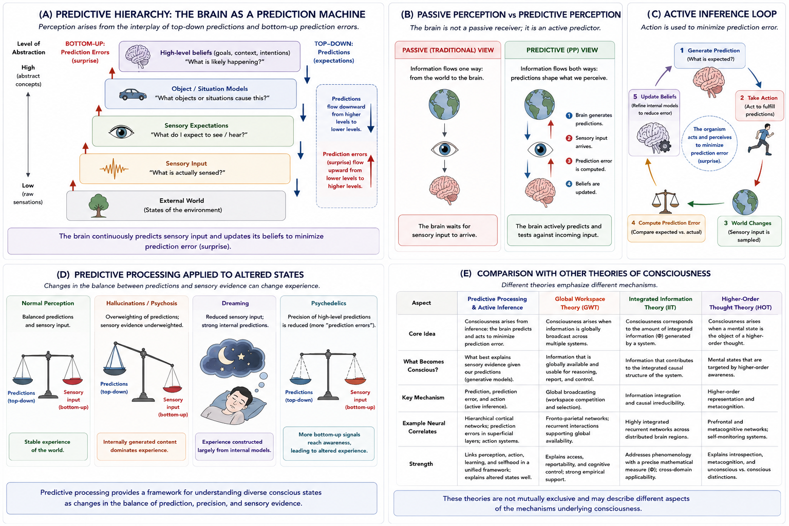

# Predictive Processing and Active Inference {#predictive-processing}

## Chapter Overview

Predictive Processing and Active Inference propose that the brain is fundamentally a prediction-generating system rather than a passive receiver of sensory information [@friston2010; @clark2016].

According to this framework:

- perception;
- action;
- attention;
- learning;
- emotion;
- selfhood;
- and possibly consciousness itself

emerge through continuous attempts to minimize prediction error between:

- internal models;
and:
- incoming sensory signals.

Rather than constructing conscious experience directly from raw sensory input, predictive processing proposes that the brain continuously generates hypotheses about the causes of sensory input and updates those hypotheses when predictions fail.

The framework therefore shifts perception away from:

```text
passive reception
```

toward:

```text
active inference and probabilistic prediction.
```

Predictive Processing became highly influential because it attempts to unify:

- perception;
- action;
- cognition;
- learning;
- embodiment;
- hallucinations;
- and adaptive behaviour

within a single computational framework.

At the same time, major philosophical questions remain concerning whether predictive processing fully explains:

- phenomenal consciousness;
- subjective feeling;
- and first-person awareness,

or whether it primarily explains cognition and adaptive behaviour more generally.

This chapter examines the historical development, conceptual foundations, hierarchical predictive structure, active inference mechanisms, empirical support, philosophical implications, strengths, criticisms, and unresolved questions surrounding Predictive Processing and Active Inference.

## Learning Objectives

After reading this chapter, the reader should be able to:

- Define the central claims of Predictive Processing and Active Inference
- Explain prediction-error minimization
- Describe hierarchical predictive processing
- Distinguish passive perception from predictive perception
- Explain the relationship between perception, action, and active inference
- Understand generative models and precision weighting
- Analyze predictive accounts of hallucinations and altered states
- Compare Predictive Processing with other theories of consciousness
- Evaluate strengths and criticisms of the framework
- Discuss implications for embodiment, selfhood, and AI

## Why Predictive Processing Became Influential

Predictive Processing became highly influential because it offered a unified framework capable of connecting many previously separate domains of cognition and neuroscience.

Rather than treating:

- perception;
- action;
- learning;
- attention;
- and embodiment

as independent systems, predictive approaches interpret them as different aspects of a single inferential process.

The framework became especially attractive because it helps explain:

- perceptual illusions;
- expectation effects;
- sensory uncertainty;
- hallucinations;
- motor control;
- adaptive behaviour;
- interoception;
- and context-sensitive perception.

Predictive Processing also aligns naturally with:

- Bayesian inference;
- machine learning;
- computational neuroscience;
- and probabilistic modeling.

As a result, it became one of the most influential frameworks in contemporary cognitive science and theoretical neuroscience.

## Core Idea in One Picture

Figure \@ref(fig:fig-pp) summarizes the major conceptual structure of Predictive Processing and Active Inference.

```{r fig-pp, echo=FALSE, fig.cap="Predictive Processing and Active Inference. Panel A illustrates hierarchical predictive processing and prediction-error minimization. Panel B contrasts passive perception with predictive perception. Panel C illustrates the active inference loop. Panel D applies predictive processing to hallucinations and altered states. Panel E compares predictive processing with other major theories of consciousness.", out.width="100%", fig.align="center"}

```

As illustrated in Figure \@ref(fig:fig-pp), Predictive Processing proposes that perception emerges through continuous interaction between:

- top-down predictions;
and:
- bottom-up prediction errors.

The figure also illustrates one of the framework’s central philosophical claims:

```text
perception is constructed,
not passively received.
```

Importantly, Figure \@ref(fig:fig-pp) also highlights a major unresolved issue:

```text
prediction and inference
≠
automatic explanation of subjective experience
```

This remains one of the central debates surrounding predictive approaches to consciousness.

## Historical Development

The intellectual roots of Predictive Processing extend across several traditions including:

- Bayesian inference;
- cybernetics;
- Helmholtzian perception;
- computational neuroscience;
- machine learning;
- and philosophy of mind.

Earlier cognitive models often treated perception primarily as a bottom-up process:

```text
world → sensory input → perception
```

Predictive Processing reverses this emphasis.

According to predictive approaches, the brain actively anticipates sensory input before the input fully arrives.

Karl Friston’s Free Energy Principle played a major role in formalizing these ideas mathematically [@friston2010].

Friston proposed that biological systems maintain stability by minimizing surprise or prediction error.

Andy Clark later helped popularize Predictive Processing as a broad explanatory framework for:

- perception;
- cognition;
- action;
- and consciousness [@clark2016].

Today, Predictive Processing has become one of the most influential theoretical frameworks in contemporary cognitive neuroscience.

## The Brain as a Prediction Machine

A central claim of Predictive Processing is:

> The brain is fundamentally a prediction engine.

According to this framework, the brain continuously attempts to predict:

- sensory input;
- bodily states;
- environmental changes;
- actions;
- social interactions;
- and internal physiological conditions.

Incoming sensory information is compared against predictions generated by internal models.

When predictions fail, the mismatch generates:

```text
prediction error.
```

The system then updates its models to reduce future error.

Figure \@ref(fig:fig-pp) Panel A illustrates this hierarchical predictive structure.

As shown in Panel A:

- top-down signals carry predictions;
- bottom-up signals carry prediction errors.

Perception therefore emerges through continuous interaction between:

- expectation;
and:
- sensory correction.

## Generative Models

Predictive Processing proposes that the brain constructs internal:

```text
generative models
```

of the world.

These models attempt to predict:

- likely sensory input;
- environmental causes;
- bodily states;
- and future outcomes.

Perception therefore becomes a process of probabilistic inference rather than passive sensory reception.

According to Predictive Processing:

> We do not simply perceive the world directly.  
> We perceive the brain’s best current prediction of the world.

This is one of the framework’s most philosophically important claims.

Generative models allow the organism to:

- anticipate events;
- reduce uncertainty;
- guide behaviour;
- and maintain adaptive interaction with the environment.

## Prediction Error Minimization

The central computational principle of Predictive Processing is:

```text
prediction-error minimization.
```

The brain continuously compares:

- predicted sensory input;
with:
- actual sensory input.

Differences produce prediction errors.

The system then attempts to reduce these errors through:

- updating beliefs;
- reallocating attention;
- revising expectations;
- changing bodily state;
- or acting on the environment.

Figure \@ref(fig:fig-pp) Panel A visually illustrates this ongoing cycle.

Prediction-error minimization allows organisms to maintain adaptive internal models despite:

- noisy sensory input;
- uncertainty;
- ambiguity;
- and environmental change.

## Passive Perception vs Predictive Perception

Predictive Processing fundamentally changes how perception is understood.

Traditional perceptual models often assume:

```text
world → senses → perception
```

Predictive Processing instead proposes:

```text
brain predictions ↔ sensory input
```

Figure \@ref(fig:fig-pp) Panel B compares these two approaches.

As shown in Panel B:

- traditional models emphasize passive sensory reception;
- predictive models emphasize active interpretation and hypothesis testing.

Under Predictive Processing, perception becomes:

- probabilistic inference;
- predictive modeling;
- and continuous error correction.

This helps explain why perception is strongly influenced by:

- expectation;
- context;
- memory;
- prior belief;
- and attention.

## Hierarchical Predictive Processing

Predictive Processing proposes that the brain is organized hierarchically.

Higher cortical levels generate abstract predictions concerning:

- goals;
- meaning;
- objects;
- situations;
- context;
- and future outcomes.

Lower levels process:

- edges;
- tones;
- motion;
- colour;
- bodily signals;
- and raw sensory features.

Prediction errors move upward through the hierarchy, while predictions move downward.

Figure \@ref(fig:fig-pp) Panel A illustrates this hierarchical exchange.

This structure allows the brain to integrate:

- sensation;
- memory;
- expectation;
- context;
- embodiment;
- and interpretation

within a unified inferential system.

## Precision Weighting

A major concept in Predictive Processing is:

```text
precision weighting.
```

Not all prediction errors are treated equally.

The brain estimates how reliable or important incoming signals are likely to be.

High precision means:

- prediction errors strongly influence updating.

Low precision means:

- prediction errors are partially ignored.

Attention is often interpreted within predictive frameworks as a mechanism for regulating precision weighting.

Abnormal precision weighting may contribute to:

- hallucinations;
- psychosis;
- anxiety;
- and altered states.

This idea became especially influential in predictive theories of psychiatry and perception.

## Active Inference

Active Inference extends Predictive Processing beyond perception alone.

According to Active Inference:

> Organisms act on the world to reduce prediction error.

Instead of merely updating internal beliefs passively, organisms also modify the environment to align sensory input with predictions.

Figure \@ref(fig:fig-pp) Panel C illustrates this active inference loop.

The process involves:

1. generating predictions;
2. acting on the world;
3. sampling sensory consequences;
4. computing prediction error;
5. updating internal models.

This creates a continuous feedback loop linking:

- perception;
- action;
- learning;
- embodiment;
- and environmental interaction.

Active Inference therefore dissolves sharp boundaries between:

- perception;
and:
- behaviour.

## Consciousness and Predictive Processing

A major question is whether Predictive Processing explains consciousness specifically or cognition more generally.

Predictive approaches appear especially powerful for explaining:

- perception;
- expectation;
- uncertainty;
- learning;
- hallucinations;
- sensory integration;
- and adaptive behaviour.

However, debate continues regarding whether these mechanisms fully explain:

- phenomenal consciousness;
- subjective feeling;
- and first-person awareness.

Some predictive theorists propose that consciousness corresponds to:

- globally coherent predictive models;
- integrated hierarchical inference;
- precision-weighted prediction dynamics;
- or stable self-modeling.

Others argue that Predictive Processing mainly explains:

- cognitive access;
- perceptual inference;
- behavioural adaptation;
- and intelligent regulation,

rather than phenomenal experience itself.

As highlighted conceptually in Figure \@ref(fig:fig-pp), prediction and inference alone may not fully solve the hard problem.

## Hallucinations and Altered States

Predictive Processing has become highly influential in explaining:

- hallucinations;
- dreaming;
- psychosis;
- psychedelic states;
- and altered perception.

Figure \@ref(fig:fig-pp) Panel D illustrates several altered-state interpretations.

According to predictive accounts:

- hallucinations may occur when top-down predictions overpower sensory evidence;
- dreaming may occur when internally generated predictions dominate perception;
- psychedelic states may involve weakened high-level priors and altered precision weighting.

As shown in Panel D, altered states may emerge through shifts in the balance between:

- prediction;
- sensory evidence;
- uncertainty;
- and precision weighting.

This remains one of Predictive Processing’s strongest explanatory domains.

## Selfhood and Interoception

Some predictive theorists argue that the self emerges partly through predictive regulation of bodily states.

The brain continuously predicts:

- heartbeat;
- breathing;
- posture;
- hunger;
- pain;
- bodily position;
- and internal physiological signals.

This process is often called:

```text
interoceptive inference.
```

According to these approaches, the sense of embodied selfhood may arise from stable predictive models of the organism’s body and internal condition.

Predictive Processing therefore connects naturally with:

- embodiment;
- emotion;
- affective consciousness;
- bodily awareness;
- and self-modeling.

## Predictive Processing Compared with Other Theories

Predictive Processing differs significantly from several major theories discussed elsewhere in this book.

Figure \@ref(fig:fig-pp) Panel E compares Predictive Processing with:

- Global Workspace Theory;
- Integrated Information Theory;
- and Higher-Order Thought Theory.

Predictive Processing emphasizes:

- probabilistic inference;
- hierarchical modeling;
- prediction-error minimization;
- and adaptive regulation.

In contrast:

- Global Workspace Theory emphasizes broadcasting and access;
- Integrated Information Theory emphasizes irreducible integration;
- Higher-Order theories emphasize metacognitive awareness.

As illustrated in Figure \@ref(fig:fig-pp), these theories may describe partially overlapping but distinct dimensions of consciousness.

## Empirical Support

Research relevant to Predictive Processing includes:

- perceptual illusion studies;
- mismatch negativity experiments;
- Bayesian perception models;
- hallucination research;
- psychedelic neuroscience;
- predictive coding studies;
- active inference experiments;
- motor control research;
- interoceptive prediction studies.

Predictive Processing became highly influential partly because it integrates findings across multiple domains of neuroscience and cognition.

## Strengths of Predictive Processing

Predictive Processing possesses several major strengths.

### Unified Framework

The theory provides a unified explanation for:

- perception;
- action;
- learning;
- embodiment;
- and adaptive behaviour.

### Strong Computational Foundation

The framework aligns naturally with:

- Bayesian inference;
- probabilistic modeling;
- machine learning;
- and computational neuroscience.

### Strong Explanations of Hallucinations and Altered States

Predictive approaches explain why perception can become:

- expectation-driven;
- context-sensitive;
- and vulnerable to altered priors.

### Integration of Body and Environment

The framework naturally connects:

- embodiment;
- action;
- perception;
- and environmental interaction.

### Broad Applicability

Predictive approaches apply across:

- neuroscience;
- psychiatry;
- AI;
- robotics;
- cognitive science;
- and philosophy of mind.

## Weaknesses and Criticisms

Despite its influence, Predictive Processing faces several important criticisms.

## Overgeneralization

Critics argue that Predictive Processing risks explaining almost everything too easily.

Many cognitive processes can potentially be reframed as prediction-error minimization, making the framework difficult to constrain precisely.

## Vagueness

Some critics argue that Predictive Processing sometimes functions more as a broad explanatory framework than a fully precise theory of consciousness itself.

## The Hard Problem

Predictive Processing may explain:

- cognition;
- perception;
- adaptive behaviour;
- and inference

without fully explaining:

- why subjective experience exists at all.

Critics therefore argue that the framework may leave the hard problem unresolved.

## Neural Implementation Questions

Some researchers question whether abstract predictive models correspond directly to actual neural implementation.

This remains an important empirical challenge.

## Empirical Underdetermination

Critics argue that many findings interpreted through Predictive Processing could also be explained by competing theories.

## Artificial Intelligence Implications

Predictive Processing has major implications for artificial intelligence.

If consciousness depends heavily on:

- predictive modeling;
- adaptive inference;
- hierarchical learning;
- and active error minimization,

then sufficiently advanced artificial systems might potentially develop consciousness-like properties.

However, major questions remain:

- Is prediction alone sufficient for consciousness?
- Does embodiment matter?
- Must conscious systems possess biological regulation?
- Can machine prediction generate phenomenal feeling?

These issues remain unresolved.

## Open Questions

Several major unresolved questions remain:

- Why should predictive inference generate subjective experience?
- Does prediction explain consciousness itself or only cognition?
- Is consciousness reducible to probabilistic modeling?
- How should conscious experience be measured?
- Can predictive systems become genuinely conscious?
- Is embodiment necessary?
- How should precision weighting be interpreted phenomenologically?

These questions remain central within contemporary consciousness research.

## Comparative Evaluation

Predictive Processing and Active Inference remain among the most influential frameworks in modern cognitive neuroscience because they attempt to unify:

- perception;
- action;
- learning;
- embodiment;
- hallucinations;
- and adaptive behaviour

within a single inferential architecture.

As illustrated throughout Figure \@ref(fig:fig-pp), the framework interprets cognition primarily as:

```text
hierarchical predictive inference.
```

Predictive approaches are especially powerful for explaining:

- expectation-driven perception;
- sensory uncertainty;
- altered states;
- hallucinations;
- active behaviour;
- and adaptive regulation.

At the same time, whether predictive inference fully explains:

- phenomenal consciousness;
- subjective feeling;
- and first-person awareness

remains deeply contested.

Predictive Processing therefore remains both:

- scientifically influential;
and:
- philosophically incomplete.

Its impact across neuroscience, psychiatry, AI, robotics, cognitive science, and philosophy of mind has been enormous, yet the relationship between:

```text
prediction and inference
→
subjective experience
```

remains one of the central unresolved questions in consciousness studies.