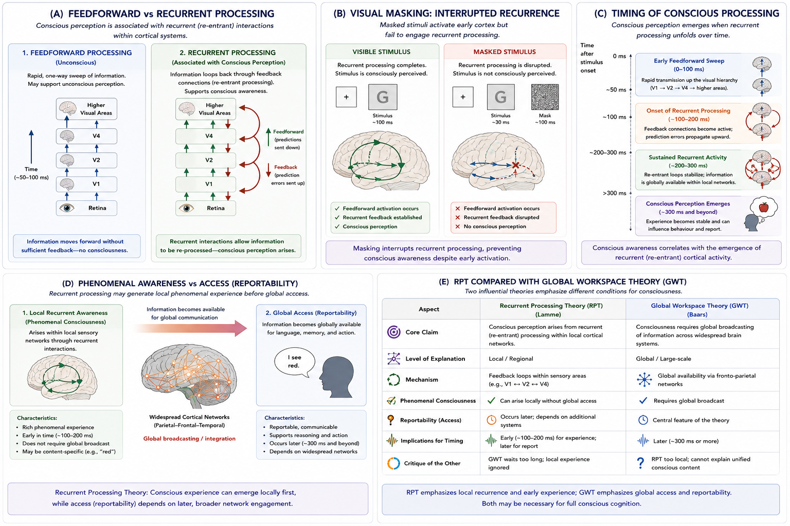

# Recurrent Processing Theory {#rpt}

## Chapter Overview

Recurrent Processing Theory (RPT) proposes that consciousness depends not merely on sensory activation, but on recurrent or re-entrant feedback interactions within cortical systems [@lamme2006]. According to this framework, information may pass rapidly through the brain unconsciously during an initial feedforward sweep, while conscious perception emerges only when neural activity becomes recursively integrated through feedback loops between cortical areas.

RPT became especially influential because it challenged theories identifying consciousness too closely with:

- reportability;
- executive access;
- working memory;
- language;
- or global broadcasting.

Instead, recurrent processing theorists argue that:

```text
phenomenal consciousness
may emerge earlier
than full cognitive access.
```

According to this view:

- conscious experience may begin locally within recurrent sensory loops;
- global reportability may occur later;
- and sophisticated cognition may not be necessary for phenomenal awareness itself.

RPT is therefore highly important both scientifically and philosophically because it attempts to distinguish:

- phenomenal experience;
from:
- cognitive accessibility.

The theory became especially influential within:

- visual neuroscience;
- perceptual awareness research;
- masking experiments;
- temporal dynamics studies;
- and debates concerning phenomenal overflow.

This chapter examines the historical development, conceptual foundations, neural mechanisms, empirical evidence, philosophical implications, strengths, criticisms, and unresolved questions associated with Recurrent Processing Theory.

## Learning Objectives

After reading this chapter, the reader should be able to:

- Define recurrent processing and distinguish it from feedforward processing
- Explain the central claims of Recurrent Processing Theory
- Describe the role of cortical feedback loops in conscious perception
- Analyze visual masking and unconscious perception within the RPT framework
- Distinguish phenomenal consciousness from access consciousness
- Explain the temporal unfolding of conscious processing
- Compare RPT with Global Workspace Theory
- Evaluate strengths and criticisms of recurrent processing theory
- Discuss implications for AI and machine consciousness

## Why Recurrent Processing Theory Became Influential

Recurrent Processing Theory became influential because it offered a biologically grounded explanation for a major puzzle in consciousness research:

```text
Why does some neural processing remain unconscious
while other processing becomes consciously experienced?
```

Earlier theories often emphasized:

- cognitive access;
- reportability;
- executive function;
- or global broadcasting.

RPT instead emphasized:

```text
local recurrent sensory processing.
```

Victor Lamme and related theorists argued that conscious experience may arise directly from recursive cortical interactions occurring within sensory systems themselves.

This proposal was important because it suggested:

- consciousness may emerge earlier than reportability;
- phenomenal awareness may exceed cognitive access;
- and local sensory loops may already support conscious experience.

RPT therefore became central to debates concerning:

- phenomenal consciousness;
- access consciousness;
- overflow arguments;
- and the richness of perceptual experience.

The theory also aligned strongly with modern neuroscience because the cortex contains extensive:

- recurrent connectivity;
- feedback signaling;
- and re-entrant neural loops.

## Core Idea in One Picture

Figure \@ref(fig:fig-rpt) summarizes the major conceptual structure of Recurrent Processing Theory.

```{r fig-rpt, echo=FALSE, fig.cap="Recurrent Processing Theory (RPT). Panel A contrasts feedforward and recurrent processing. Panel B illustrates visual masking and interrupted recurrence. Panel C shows the temporal unfolding of conscious processing. Panel D distinguishes phenomenal consciousness from access consciousness. Panel E compares recurrent processing theory with Global Workspace Theory.", out.width="100%", fig.align="center"}

```

As illustrated in Figure \@ref(fig:fig-rpt):

- feedforward processing alone may remain unconscious;
- recurrent cortical loops stabilize perceptual representations;
- conscious awareness unfolds dynamically over time;
- and phenomenal consciousness may emerge before global reportability.

Importantly, Figure \@ref(fig:fig-rpt) also highlights one of RPT’s central philosophical claims:

```text
conscious experience
may occur locally
before global cognitive access.
```

This distinguishes RPT sharply from theories emphasizing:

- executive access;
- working memory;
- or large-scale broadcasting as necessary conditions for consciousness.

## Historical Development

The origins of recurrent processing theory emerged from broader debates concerning the relationship between:

- sensation;
- perception;
- cognition;
- neural activity;
- and conscious awareness.

Earlier neuroscience often interpreted perception primarily as:

```text
sensory input → cortical processing → behavioural response
```

This approach emphasized largely feedforward information flow through cortical hierarchies.

However, anatomical and physiological research increasingly revealed that the cortex contains massive recurrent connectivity. Neural activity repeatedly loops between:

- lower sensory cortex;
- higher cortical areas;
- associative regions;
- and thalamo-cortical systems.

Victor Lamme argued that these recurrent interactions may be central to conscious perception [@lamme2006].

Importantly, Lamme proposed that:

```text
recurrent sensory processing
may already generate phenomenal awareness
before global reportability occurs.
```

This positioned RPT partly in opposition to theories proposing that consciousness requires:

- widespread broadcasting;
- language;
- executive cognition;
- or metacognitive access.

## Feedforward vs Recurrent Processing

A central distinction in recurrent processing theory is the difference between:

- feedforward processing;
and:
- recurrent processing.

Figure \@ref(fig:fig-rpt) Panel A illustrates this distinction.

## Feedforward Processing

Feedforward processing involves rapid one-way propagation of information through cortical hierarchies.

For example:

```text
retina → V1 → V2 → V4 → higher cortex
```

According to RPT, feedforward sweeps may support:

- rapid categorization;
- behavioural priming;
- automatic responses;
- unconscious discrimination;
- and partial sensory processing

without conscious awareness.

Feedforward activity is:

- fast;
- transient;
- and relatively unstable.

## Recurrent Processing

Recurrent processing involves recursive feedback interactions between cortical areas.

As illustrated in Figure \@ref(fig:fig-rpt) Panel A:

- information loops backward and forward;
- sensory representations become stabilized;
- contextual integration occurs;
- recursive interaction strengthens perceptual coherence.

According to RPT:

```text
conscious perception emerges
when neural activity becomes recurrently integrated.
```

This recursive interaction allows sensory representations to become:

- sustained;
- coherent;
- integrated;
- and phenomenally experienced.

## The Core Claim of RPT

The central claim of recurrent processing theory can be summarized as follows:

> Conscious awareness depends on recurrent cortical feedback rather than feedforward activation alone.

This means:

- unconscious processing may occur rapidly and automatically;
- conscious perception requires recursive cortical integration.

RPT therefore attempts to explain why:

- some neural activity remains unconscious;
while:
- other activity becomes phenomenally experienced.

Importantly, the theory emphasizes that:

```text
consciousness unfolds dynamically over time.
```

Conscious awareness is therefore not instantaneous but emerges through recursive interaction.

## Temporal Dynamics of Consciousness

One of RPT’s most important contributions is its emphasis on temporal dynamics.

Figure \@ref(fig:fig-rpt) Panel C illustrates the temporal unfolding of conscious processing.

### Early Feedforward Sweep (~0–100 ms)

Rapid sensory activation propagates upward through cortical hierarchies.

This stage may support:

- unconscious categorization;
- behavioural priming;
- rapid discrimination;
- automatic reactions.

### Recurrent Integration (~100–250 ms)

Feedback loops emerge between cortical regions.

During this stage:

- contextual refinement occurs;
- perceptual stabilization increases;
- recursive integration strengthens;
- phenomenal awareness may begin emerging.

### Stable Conscious Awareness (~250 ms and beyond)

Sustained recurrent activity becomes associated with stable conscious experience and eventual cognitive access.

As illustrated in Figure \@ref(fig:fig-rpt) Panel C:

```text
consciousness is temporally extended,
not instantaneous.
```

This temporal emphasis strongly distinguishes RPT from simpler stimulus-response models.

## Visual Masking

Visual masking experiments provide some of the strongest empirical support for recurrent processing theory.

In masking experiments:

1. a stimulus briefly appears;
2. a masking stimulus rapidly follows;
3. conscious awareness of the original stimulus often disappears.

Importantly:

- early sensory activation may still occur;
- behavioural priming may still occur;
- unconscious discrimination may remain possible.

Figure \@ref(fig:fig-rpt) Panel B illustrates this process.

According to RPT:

- feedforward activation initially occurs;
- masking interrupts recurrent feedback;
- conscious stabilization fails to emerge.

Thus:

```text
feedforward processing
without recurrence
may remain unconscious.
```

Masking studies therefore strongly support the claim that recurrent processing may be necessary for conscious perception.

## Binocular Rivalry and Perceptual Competition

Binocular rivalry studies also support recurrent processing approaches.

In binocular rivalry:

- different images are presented simultaneously to each eye;
- conscious perception alternates between competing interpretations.

RPT interprets this as evidence that conscious perception depends on:

- recursive stabilization;
- recurrent competition;
- and dynamic cortical integration.

Conscious awareness therefore reflects:

```text
ongoing recurrent stabilization
within sensory systems.
```

rather than passive sensory input alone.

## Phenomenal Consciousness vs Access Consciousness

One of RPT’s most philosophically important contributions is its distinction between:

- phenomenal consciousness;
and:
- access consciousness.

Figure \@ref(fig:fig-rpt) Panel D illustrates this distinction.

## Phenomenal Consciousness

Phenomenal consciousness refers to:

- subjective feeling;
- qualitative experience;
- “what it is like.”

According to RPT:

```text
local recurrent sensory loops
may already support phenomenal awareness.
```

## Access Consciousness

Access consciousness refers to information becoming available for:

- report;
- reasoning;
- working memory;
- decision-making;
- executive cognition.

RPT proposes that:

- phenomenal awareness may arise earlier;
- global access may emerge later.

As illustrated in Figure \@ref(fig:fig-rpt) Panel D:

```text
experience
may exceed
reportability.
```

This is one of the central philosophical claims of recurrent processing theory.

## Phenomenal Overflow

RPT became closely associated with debates concerning:

```text
phenomenal overflow.
```

Some experiments suggest individuals consciously experience richer visual scenes than they can explicitly:

- report;
- remember;
- or cognitively access.

According to overflow arguments:

```text
phenomenal consciousness
may exceed access consciousness.
```

This directly challenges theories equating consciousness with:

- reportability;
- working memory;
- or global broadcasting.

RPT therefore supports the possibility that:

- experience may be richer than cognition;
- conscious phenomenology may overflow executive access.

This debate remains central within consciousness studies.

## Recurrent Processing and Global Workspace Theory

RPT is often contrasted directly with Global Workspace Theory (GWT).

Figure \@ref(fig:fig-rpt) Panel E compares the two frameworks.

## Recurrent Processing Theory

RPT proposes:

```text
local recurrent sensory processing
may already generate phenomenal consciousness.
```

The emphasis is on:

- local cortical recurrence;
- sensory feedback loops;
- temporal stabilization;
- early phenomenal awareness.

## Global Workspace Theory

GWT proposes:

```text
consciousness requires
global broadcasting
across cognitive systems.
```

The emphasis is on:

- reportability;
- working memory;
- executive access;
- global integration.

As illustrated in Figure \@ref(fig:fig-rpt) Panel E:

- RPT emphasizes early phenomenal awareness;
- GWT emphasizes later cognitive accessibility.

Some researchers argue these theories may describe:

- different stages;
or:
- different dimensions of consciousness

rather than being fully incompatible.

## Dreaming, Anesthesia, and Altered States

RPT has also been applied to:

- dreaming;
- anesthesia;
- altered states;
- disorders of consciousness.

According to recurrent approaches:

- conscious states depend on intact recurrent cortical interaction;
- unconscious states involve disrupted or weakened recurrence.

Changes in recurrent dynamics may therefore help explain transitions between:

- conscious awareness;
- unconsciousness;
- and altered experiential states.

## Neural Basis of Recurrent Processing

Recurrent processing is associated with:

- cortical feedback loops;
- thalamo-cortical interaction;
- re-entrant signaling;
- sensory integration networks;
- recurrent cortical hierarchies.

Extensive recurrent connectivity exists throughout:

- visual cortex;
- associative cortex;
- higher-order sensory systems.

However, a major unresolved question remains:

> Which recurrent interactions are sufficient for consciousness?

Not all recurrent activity appears consciously experienced.

This remains a central challenge for the theory.

## Recurrent Processing and Artificial Intelligence

RPT has important implications for artificial intelligence and machine consciousness.

If consciousness depends on:

- recursive feedback;
- dynamic recurrence;
- re-entrant processing;
- temporal integration,

then purely feedforward AI architectures may remain unconscious despite advanced behavioural performance.

This raises important questions concerning:

- large language models;
- transformer architectures;
- recurrent neural networks;
- recursive self-monitoring;
- and synthetic phenomenology.

RPT suggests that conscious AI systems might require:

- recursive architectures;
- dynamic feedback integration;
- temporally extended recurrent loops.

However, whether recurrence alone is sufficient for genuine subjective experience remains unresolved.

## Strengths of Recurrent Processing Theory

RPT possesses several major strengths.

### Strong Neuroscientific Grounding

The theory aligns naturally with known cortical anatomy and recurrent connectivity.

### Strong Empirical Support

Masking studies and temporal dynamics research strongly support recurrent processing approaches.

### Clear Distinction Between Conscious and Unconscious Processing

RPT explains how:

- behavioural processing;
- neural activation;
- and conscious experience

may dissociate.

### Important Philosophical Contribution

The theory strongly distinguishes:

- phenomenal consciousness;
from:
- access consciousness.

### Temporal Dynamics

RPT emphasizes that consciousness unfolds dynamically through recursive interaction over time.

### Biologically Plausible Mechanisms

The theory remains closely tied to real cortical organization rather than purely abstract computation.

## Weaknesses and Criticisms

Despite its strengths, recurrent processing theory faces several important criticisms.

## Is Local Recurrence Enough?

Critics argue that local sensory recurrence may not fully explain:

- self-awareness;
- unified cognition;
- reasoning;
- metacognition;
- or reportability.

## The Hard Problem

Even if recurrence correlates with consciousness, critics still ask:

> Why should recursive neural interaction produce subjective feeling at all?

Thus RPT may explain mechanisms without fully solving the hard problem.

## Border Problem

The theory does not specify a precise threshold for:

- how much recurrence is necessary;
- which loops are sufficient;
- or what kinds of recurrent interaction generate consciousness.

## Excessive Localism

Some researchers argue that:

- global integration;
- executive access;
- and widespread coordination

still appear necessary for fully conscious cognition.

## Neural Ambiguity

Recurrent loops exist throughout the brain.

Critics therefore ask:

> Why do only some recurrent interactions appear consciously experienced?

This remains unresolved.

## Open Questions

Several major unresolved questions remain:

- Why should recurrence generate experience?
- Is local recurrence sufficient for consciousness?
- Can phenomenal consciousness occur without global access?
- What distinguishes conscious from unconscious recurrence?
- How does selfhood emerge?
- Are recurrent loops necessary for all conscious states?
- Can artificial recurrent systems become conscious?

These questions remain central within contemporary consciousness science.

## Comparative Evaluation

Recurrent Processing Theory remains one of the most influential biologically grounded theories of consciousness because it explains conscious perception primarily through:

- recursive cortical interaction;
- temporal stabilization;
- and recurrent sensory integration.

As illustrated throughout Figure \@ref(fig:fig-rpt), the theory sharply distinguishes between:

- unconscious feedforward processing;
and:
- conscious recurrent integration.

RPT is especially powerful for explaining:

- visual awareness;
- masking effects;
- phenomenal overflow;
- unconscious perception;
- temporal dynamics;
- and the distinction between phenomenal and access consciousness.

At the same time, whether recurrent processing fully explains:

- subjective experience;
- qualia;
- and unified selfhood

remains deeply contested.

Recurrent Processing Theory therefore remains both:

- neuroscientifically influential;
and:
- philosophically incomplete.

Its impact across visual neuroscience, temporal dynamics research, masking experiments, and debates concerning phenomenal consciousness has been substantial, yet the relationship between:

```text
recurrent cortical interaction
→
subjective experience
```

remains one of the major unresolved questions in consciousness studies.