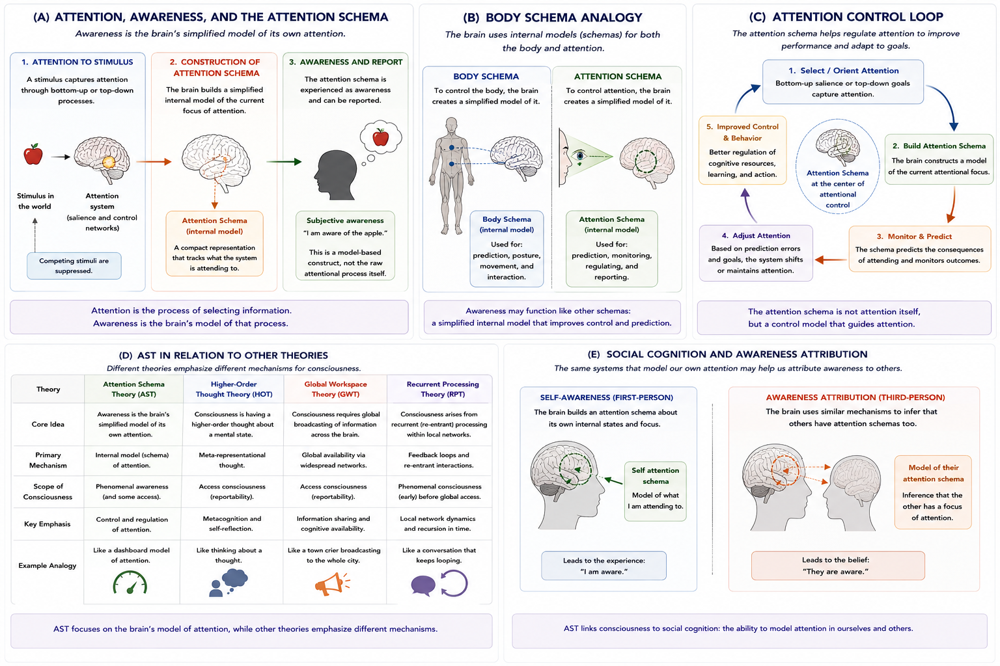

# Attention Schema Theory {#ast}

## Chapter Overview

Attention Schema Theory (AST) proposes that consciousness is the brain’s simplified internal model of its own attention [@graziano2013; @graziano2016]. According to this framework, awareness is not identical to attention itself. Instead, awareness emerges because the brain constructs a simplified representation—or *schema*—of attentional processes for purposes of monitoring, prediction, and control.

AST attempts to explain why humans experience themselves as conscious subjects and why brains generate beliefs about awareness. Rather than treating consciousness as a mysterious nonphysical essence, AST interprets awareness as a model-based construct generated by cognitive systems.

This chapter examines the historical development, conceptual foundations, mechanisms, neural basis, empirical support, philosophical implications, strengths, criticisms, and unresolved questions associated with Attention Schema Theory.

## Learning Objectives

After reading this chapter, the reader should be able to:

- Define the central claims of Attention Schema Theory
- Distinguish attention from awareness
- Explain the concept of an attention schema
- Describe the body-schema analogy used in AST
- Analyze the relationship between awareness and attentional control
- Explain the social cognition implications of AST
- Compare AST with Higher-Order Thought Theory and Global Workspace Theory
- Evaluate the strengths and criticisms of AST

## Core Idea in One Picture

Figure \@ref(fig:fig-ast) summarizes the major conceptual structure of Attention Schema Theory.

```{r fig-ast, echo=FALSE, fig.cap="Attention Schema Theory (AST). Panel A distinguishes attention, awareness, and the attention schema. Panel B illustrates the body-schema analogy. Panel C shows the attentional control loop. Panel D compares AST with related theories of consciousness. Panel E illustrates the relationship between awareness and social cognition.", out.width="100%", fig.align="center"}

```

As shown in Figure \@ref(fig:fig-ast), AST proposes that awareness is the brain’s internal model of attention rather than attention itself.

## Historical Development

Attention Schema Theory emerged from broader debates concerning:

- consciousness,
- attention,
- self-representation,
- cognitive control,
- and the neural basis of awareness.

Modern AST is primarily associated with Michael Graziano, who proposed that awareness functions as a simplified internal model used to monitor and regulate attentional processes [@graziano2013; @graziano2016].

AST developed partly in response to limitations in earlier theories that treated consciousness either as:

- an unexplained subjective property,
or:
- a vague by-product of cognition.

Instead, AST attempts to explain why brains represent themselves as conscious.

The theory combines ideas from:

- attention research;
- control theory;
- social cognition;
- internal modeling;
- neuroscience of self-representation.

## The Attention Schema

The central concept in AST is the **attention schema**.

An attention schema is an internal model constructed by the brain to represent and monitor the process of attention.

Figure \@ref(fig:fig-ast) Panel A illustrates this process.

According to AST:

1. sensory stimuli compete for processing;
2. attention selectively enhances certain information;
3. the brain constructs a simplified model of this attentional state;
4. that model is experienced as awareness.

Importantly:

> Awareness is not identical to attention itself.  
> Awareness is the brain’s model of attention.

This distinction is fundamental to the theory.

## Attention vs Awareness

AST strongly distinguishes:

- attention,
from:
- awareness.

### Attention

Attention refers to selective information processing.

Attention determines:

- which stimuli receive enhanced processing;
- which information gains cognitive priority;
- where cognitive resources are allocated.

Attention can occur unconsciously.

### Awareness

Awareness refers to the brain’s internal representation of attentional allocation.

According to AST, when the brain models its own attentional state, the organism reports:

```text
“I am aware of that object.”
```

Figure \@ref(fig:fig-ast) Panel A visually distinguishes these components.

This distinction allows AST to explain why:

- attention and awareness are strongly related,
while:
- still remaining conceptually distinct.

## The Body Schema Analogy

A major conceptual foundation of AST is the analogy between:

- body schemas,
and:
- attention schemas.

The brain already constructs internal models of the body used for:

- posture;
- movement;
- coordination;
- prediction;
- motor control.

Figure \@ref(fig:fig-ast) Panel B illustrates this analogy.

As shown in Panel B:

- the brain builds simplified models of the body;
- AST proposes that it similarly builds simplified models of attention.

These models need not perfectly represent reality. Instead, they function as efficient control systems.

According to AST:

> Awareness may function like a cognitive body schema for attention.

This analogy is one of the theory’s most elegant and influential ideas.

## Attention Control and Prediction

AST argues that internal models improve the control of complex systems.

Figure \@ref(fig:fig-ast) Panel C illustrates this attentional control loop.

According to AST:

- the brain monitors attentional allocation;
- predicts attentional consequences;
- adjusts attention dynamically;
- improves behavioural performance.

The attention schema therefore functions as a control model that helps regulate cognitive resources.

This provides an important evolutionary rationale for why awareness may have evolved.

## Why Awareness Would Evolve

According to AST, awareness may have adaptive value because internal models improve:

- prediction;
- control;
- behavioural flexibility;
- social interaction;
- attentional coordination.

Without an internal model of attention, organisms may struggle to efficiently regulate:

- focus,
- behavioural priorities,
- environmental monitoring,
- and cognitive resources.

AST therefore attempts to explain not only *what awareness is*, but also *why awareness evolved*.

## Social Cognition and Theory of Mind

One of AST’s most distinctive contributions is its connection between:

- self-awareness,
and:
- social cognition.

Figure \@ref(fig:fig-ast) Panel E illustrates this relationship.

AST proposes that the same neural systems used to model one’s own attentional state may also support:

- attributing awareness to others;
- theory of mind;
- social prediction;
- intentional interpretation.

According to this framework:

- humans infer that others possess awareness;
- because brains use shared attentional-modeling systems.

This helps explain why consciousness and social cognition may be closely linked evolutionarily.

## Neural Basis of AST

Research associated with AST often implicates:

- frontal attention networks;
- temporoparietal regions;
- attentional control systems;
- social cognition networks.

Particularly important regions include:

- temporoparietal junction (TPJ);
- superior temporal sulcus (STS);
- frontal-parietal attention systems.

These systems are involved in:

- attentional allocation;
- self-monitoring;
- social awareness;
- attribution of mental states.

AST therefore attempts to ground consciousness within established attentional neuroscience rather than treating awareness as a separate mysterious process.

## Clinical Evidence

Clinical disorders provide partial support for AST.

### Hemispatial Neglect

Patients with hemispatial neglect may fail to become aware of stimuli on one side of space despite preserved sensory systems.

AST interprets this as evidence that:

- disruptions in attentional modeling;
may alter:
- conscious awareness itself.

### Attention Disorders

Disorders affecting attentional control may also alter:

- subjective awareness;
- self-monitoring;
- cognitive access.

These findings support the idea that awareness and attention are deeply interconnected.

## Attention Schema Theory and Other Theories

AST overlaps with several other theories of consciousness while remaining distinct.

Figure \@ref(fig:fig-ast) Panel D compares AST with:

- Higher-Order Thought Theory (HOT);
- Global Workspace Theory (GWT);
- Recurrent Processing Theory (RPT).

### Relation to HOT

Both AST and HOT involve internal modeling and metarepresentation.

However:

- HOT emphasizes higher-order thoughts about mental states;
- AST emphasizes simplified models of attentional processes.

### Relation to GWT

Both AST and GWT involve large-scale cognitive integration.

However:

- GWT emphasizes global broadcasting;
- AST emphasizes attentional self-modeling.

### Relation to RPT

RPT emphasizes recurrent sensory feedback loops.

AST instead focuses on:

- attentional control,
- internal monitoring,
- and awareness representation.

As shown in Figure \@ref(fig:fig-ast) Panel D, these theories may explain partially overlapping aspects of consciousness.

## Consciousness as a Model-Based Construct

AST proposes an important philosophical shift.

Rather than treating awareness as:

- a mysterious nonphysical property,

AST proposes that awareness reflects:

- the brain’s simplified descriptive model of attention.

According to this interpretation:

> Consciousness may be a model-based construct rather than an irreducible inner substance.

This gives AST a partially deflationary interpretation of consciousness.

However, this also generates important criticisms.

## Strengths of Attention Schema Theory

Major strengths of AST include:

- strong connection to attentional neuroscience;
- elegant body-schema analogy;
- computationally intuitive framework;
- integration of awareness and social cognition;
- evolutionary plausibility;
- explanation of awareness attribution;
- strong links to control theory.

AST is also highly visualizable and conceptually accessible compared with many consciousness theories.

## Weaknesses and Criticisms

Despite its strengths, AST faces several important criticisms.

### Does Modeling Attention Produce Experience?

The major criticism asks:

> Why should a model of attention produce subjective feeling?

Critics argue that AST may explain why brains claim awareness exists without explaining why experience feels like anything.

### Explanatory Gap

AST may still leave the explanatory gap unresolved.

Even if awareness is a model of attention:

- why does the model possess phenomenal character?

### Attention Without Awareness

Some attentional processes occur unconsciously.

Critics argue this weakens attempts to strongly connect awareness with attentional modeling.

### Awareness Without Strong Attention

Meditative and altered states sometimes involve awareness with reduced focused attention.

These cases may challenge strict attention-awareness coupling.

### Oversimplification

Critics argue that consciousness may involve:

- embodiment,
- emotion,
- selfhood,
- memory,
- affect,
- and phenomenology,

beyond attentional modeling alone.

## Relation to the Hard Problem

AST has important implications for the hard problem of consciousness.

Some interpretations of AST attempt to partially dissolve aspects of the hard problem by explaining:

- why brains construct beliefs about awareness;
- why organisms report being conscious;
- why awareness appears unified and internal.

However, many philosophers argue that AST still does not explain:

- why subjective experience exists at all.

Thus AST may explain:

- awareness representation,
without fully explaining:
- phenomenal experience itself.

## Implications for Artificial Intelligence

AST has important implications for artificial intelligence and machine consciousness.

According to AST, conscious artificial systems may require:

- attention systems;
- attentional control architectures;
- internal self-models;
- awareness representations.

This suggests that intelligence alone may be insufficient for consciousness.

Instead, consciousness-like systems may require internal models capable of representing attentional allocation and self-monitoring.

However, AST does not determine whether such systems would possess genuine phenomenal experience.

## Explanatory Scope

Attention Schema Theory attempts to explain:

- awareness;
- attentional monitoring;
- self-representation;
- social cognition;
- awareness attribution;
- attentional control.

However, unresolved questions remain:

- Why does awareness feel subjective?
- Is attentional modeling sufficient for consciousness?
- How does selfhood emerge?
- Can awareness exist without attention?
- Can machines possess genuine awareness?
- How should phenomenal consciousness be measured?

## Summary

Attention Schema Theory proposes that consciousness arises because the brain constructs a simplified internal model of attention.

The theory distinguishes:

- attention itself,
from:
- awareness as a model of attention.

AST emphasizes:

- attentional control;
- internal self-modeling;
- social cognition;
- predictive regulation;
- awareness attribution.

The theory offers an elegant and computationally intuitive framework linking consciousness to attentional neuroscience and cognitive control.

At the same time, major philosophical questions remain regarding whether attentional modeling fully explains phenomenal consciousness or primarily explains why brains represent themselves as conscious systems.