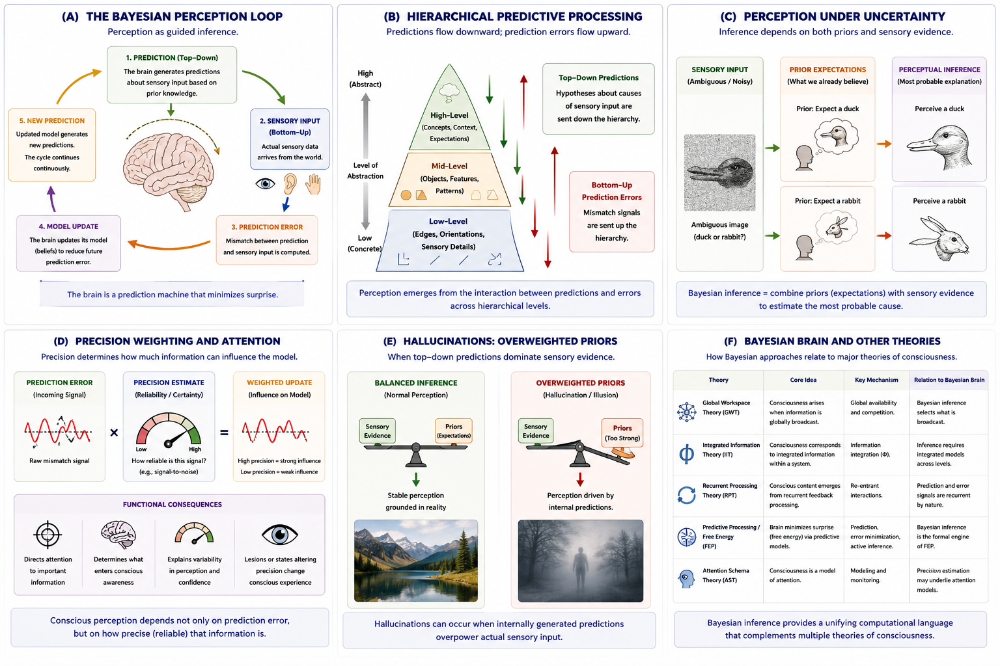

# Bayesian Brain and Predictive Inference {#bayesian-brain}

## Chapter Overview

Bayesian brain theories propose that perception and cognition operate through probabilistic inference under conditions of uncertainty. According to this framework, the brain does not passively record reality. Instead, it actively predicts the causes of sensory input and continuously updates those predictions in response to incoming evidence [@friston2010; @clark2016].

Bayesian approaches have become highly influential in neuroscience, cognitive science, artificial intelligence, and contemporary theories of consciousness because they provide a unified computational framework for understanding:

- perception,
- learning,
- prediction,
- uncertainty,
- attention,
- action,
- and conscious experience.

Some Bayesian theories propose that conscious perception reflects the brain’s best current predictive model of the world, body, and self.

This chapter examines the conceptual foundations, historical development, predictive mechanisms, empirical evidence, philosophical implications, strengths, criticisms, and unresolved questions associated with Bayesian approaches to consciousness.

## Learning Objectives

After reading this chapter, the reader should be able to:

- Define the core claims of Bayesian brain theories
- Explain Bayesian inference intuitively
- Describe prediction error and hierarchical prediction
- Explain the role of uncertainty and precision weighting
- Analyze the relationship between prediction and conscious perception
- Describe hallucinations and altered states within Bayesian frameworks
- Compare Bayesian approaches with competing theories
- Evaluate the strengths and criticisms of Bayesian approaches to consciousness

## Core Idea in One Picture

Figure \@ref(fig:fig-bayesian) summarizes the major conceptual structure of Bayesian approaches to consciousness.

```{r fig-bayesian, echo=FALSE, fig.cap="Bayesian brain and predictive inference. Panel A illustrates the Bayesian perception loop. Panel B shows hierarchical predictive processing. Panel C demonstrates perception under uncertainty. Panel D illustrates precision weighting and attention. Panel E shows hallucinations as overweighted priors. Panel F compares Bayesian approaches with other theories of consciousness.", out.width="100%", fig.align="center"}

```

As shown in Figure \@ref(fig:fig-bayesian), Bayesian approaches propose that perception and cognition emerge through continuous interaction between predictions, sensory input, uncertainty, and prediction-error minimization.

## Historical Development

Bayesian approaches emerged from developments in:

- probability theory;
- statistics;
- cybernetics;
- information theory;
- computational neuroscience;
- and cognitive science.

The broader intellectual background involves longstanding debates concerning:

- perception,
- uncertainty,
- representation,
- cognition,
- and scientific explanation.

Traditional models often treated perception as largely passive:

```text
world → sensory input → perception
```

Bayesian theories instead propose:

```text
prediction + sensory evidence → perceptual inference
```

In modern neuroscience, Bayesian frameworks became especially influential through the work of researchers such as:

- Karl Friston,
- Andy Clark,
- Geoffrey Hinton,
- and others associated with predictive processing and computational neuroscience.

Karl Friston’s Free Energy Principle became particularly influential because it proposed a broad unifying framework linking prediction, perception, action, learning, and biological self-organization [@friston2010].

## Bayesian Inference

At the center of Bayesian approaches is the concept of **Bayesian inference**.

Bayesian inference involves updating beliefs or predictions in response to new evidence.

According to Bayesian theories:

> The brain continuously estimates the most probable causes of sensory input under conditions of uncertainty.

Figure \@ref(fig:fig-bayesian) Panel A illustrates this predictive cycle.

As shown in Panel A:

1. the brain generates predictions;
2. sensory input arrives;
3. prediction errors are computed;
4. internal models are updated;
5. new predictions emerge.

This cycle operates continuously and dynamically.

Importantly:

> Perception is not simply received from the world.  
> Perception is inferred.

## The Brain as a Prediction Machine

A central idea in Bayesian approaches is that the brain functions as a prediction-generating system.

Rather than waiting passively for information, the brain actively anticipates:

- sensory events;
- environmental structure;
- bodily states;
- behavioural consequences;
- and social interactions.

According to this framework:

- perception,
- cognition,
- and even selfhood

may depend heavily on predictive modeling.

This predictive perspective strongly influenced modern theories such as:

- predictive processing;
- active inference;
- and hierarchical Bayesian cognition.

## Hierarchical Predictive Processing

Bayesian theories often propose that the brain is organized hierarchically.

Figure \@ref(fig:fig-bayesian) Panel B illustrates this hierarchical structure.

As shown in Panel B:

- higher cortical levels generate broad predictions;
- lower levels process detailed sensory information;
- prediction errors travel upward;
- predictions travel downward.

### Higher Levels

Higher levels may encode:

- concepts;
- expectations;
- goals;
- contextual interpretations.

### Lower Levels

Lower levels process:

- edges;
- colours;
- sounds;
- textures;
- sensory detail.

Conscious perception may emerge through interaction between these hierarchical layers.

## Prediction Error

Prediction error refers to the mismatch between:

- predicted sensory input,
and:
- actual sensory input.

Prediction errors are critically important because they drive learning and model updating.

When predictions fail:

- internal models adjust;
- expectations change;
- future predictions improve.

Bayesian approaches therefore propose that brains continuously minimize prediction error through ongoing inference.

Figure \@ref(fig:fig-bayesian) Panel A illustrates this updating process.

## Perception Under Uncertainty

One of the most important contributions of Bayesian approaches is the treatment of perception as inference under uncertainty.

Figure \@ref(fig:fig-bayesian) Panel C illustrates this principle using ambiguous perception.

As shown in Panel C:

- sensory input may be incomplete or ambiguous;
- prior expectations influence interpretation;
- different observers may perceive different outcomes.

For example:

- ambiguous images;
- noisy environments;
- visual illusions;
- and uncertain stimuli

may generate multiple possible interpretations.

Bayesian approaches propose that perception reflects:

> the brain’s best probabilistic estimate of reality.

## Precision Weighting and Attention

Modern Bayesian theories emphasize the importance of **precision weighting**.

Figure \@ref(fig:fig-bayesian) Panel D illustrates this mechanism.

Precision refers to the estimated reliability or certainty of information.

According to Bayesian theories:

- highly reliable signals receive stronger weighting;
- uncertain signals receive weaker weighting.

This influences:

- attention;
- salience;
- conscious access;
- perceptual confidence;
- and behavioural prioritization.

Precision weighting therefore helps determine:

- what enters conscious awareness;
- what remains background information;
- and which signals dominate perception.

Some researchers interpret attention itself as a form of precision control.

## Free Energy Principle

Karl Friston’s **Free Energy Principle** extends Bayesian inference into a broader biological framework [@friston2010].

According to this theory:

- biological systems minimize surprise;
- prediction error is continuously reduced;
- organisms maintain adaptive internal models of the environment.

This framework attempts to unify:

- perception,
- action,
- learning,
- attention,
- and self-organization.

Predictive processing models can often be interpreted as computational implementations of Bayesian inference within neural systems.

## Consciousness and Predictive Models

Some Bayesian approaches propose that conscious experience reflects:

- the brain’s best current predictive model of reality.

According to this view:

- perception is controlled hallucination constrained by sensory input;
- consciousness reflects probabilistic inference;
- conscious content depends on prediction, precision, and updating.

This perspective suggests that:

> conscious experience may be fundamentally model-based.

Bayesian frameworks may also extend to predictive models of:

- the body;
- emotion;
- agency;
- and selfhood.

## Hallucinations and Altered States

Bayesian approaches are particularly powerful for explaining hallucinations and altered states.

Figure \@ref(fig:fig-bayesian) Panel E illustrates this process.

According to Bayesian models:

- hallucinations may occur when internally generated predictions overpower sensory evidence.

In normal perception:

```text
prediction + sensory input → balanced inference
```

In hallucination:

```text
overweighted prior expectations → distorted perception
```

This framework has been applied to:

- psychosis;
- dreaming;
- psychedelic states;
- auditory hallucinations;
- and delusional perception.

Bayesian approaches therefore provide a strong computational framework for understanding altered conscious experience.

## Bayesian Brain and Other Theories

Figure \@ref(fig:fig-bayesian) Panel F compares Bayesian approaches with other theories of consciousness.

### Relation to Global Workspace Theory

Bayesian inference may help determine:

- which information gains global access;
- which signals dominate conscious processing.

### Relation to Integrated Information Theory

Both theories emphasize integration, though Bayesian approaches focus more on:

- probabilistic inference;
- prediction;
- and uncertainty minimization.

### Relation to Recurrent Processing Theory

Prediction and prediction-error loops are inherently recurrent and interactive.

### Relation to Predictive Processing

Predictive processing can be interpreted as a neural implementation of Bayesian inference.

### Relation to Attention Schema Theory

Precision weighting may influence attentional allocation and awareness modeling.

As shown in Panel F, Bayesian inference functions less as a single isolated theory and more as a computational framework that intersects with multiple consciousness theories.

## Empirical Support

Evidence supporting Bayesian approaches comes from:

- visual illusions;
- perceptual ambiguity studies;
- sensory expectation experiments;
- predictive coding research;
- electrophysiology;
- hallucination studies;
- neuroimaging;
- and computational modeling.

Important evidence includes findings that:

- expectations influence perception;
- prediction errors alter conscious awareness;
- sensory uncertainty changes perceptual interpretation;
- predictive models shape conscious experience.

Bayesian frameworks have also become increasingly influential in machine learning and AI systems operating under uncertainty.

## Bayesian Approaches and Artificial Intelligence

Bayesian inference is central to many modern AI systems.

Figure \@ref(fig:fig-bayesian) connects Bayesian approaches to broader computational theories of cognition.

Bayesian principles influence:

- robotics;
- machine learning;
- predictive modeling;
- probabilistic reasoning;
- and adaptive decision systems.

This raises important questions concerning artificial consciousness:

- Could predictive AI systems become conscious?
- Is probabilistic inference sufficient for awareness?
- Does consciousness require embodiment?
- Can predictive systems possess genuine subjective experience?

At present, no consensus exists.

## Strengths of Bayesian Approaches

Major strengths include:

- strong mathematical framework;
- powerful explanation of uncertainty;
- integration with neuroscience;
- explanatory value for perception;
- strong computational relevance;
- compatibility with AI systems;
- usefulness for altered-state research;
- strong predictive structure.

Bayesian theories also provide a highly unified language connecting:

- perception;
- cognition;
- action;
- attention;
- learning;
- and conscious experience.

## Weaknesses and Criticisms

Despite their strengths, Bayesian approaches face important criticisms.

### Overgeneralization

Critics argue Bayesian theories sometimes become too broad and flexible.

Almost any result may potentially be interpreted within a Bayesian framework.

### Mathematical Idealization

Brains may not literally perform formal Bayesian calculations.

Some researchers argue Bayesian models function more as useful abstractions than literal neural mechanisms.

### Hard Problem

Prediction and inference may explain:

- cognition,
- behaviour,
- and reportability,

without explaining:

- subjective feeling itself.

### Prediction Without Consciousness

Many unconscious systems also perform predictive computations.

Critics therefore ask:

> Why should prediction generate consciousness?

### Excessive Computationalism

Some critics argue Bayesian approaches underemphasize:

- embodiment;
- affect;
- phenomenology;
- biological constraints;
- and lived experience.

## Relation to the Hard Problem

Bayesian approaches are often highly successful at explaining:

- perceptual organization;
- uncertainty management;
- cognitive integration;
- predictive control;
- and behavioural adaptation.

However, critics argue these explanations may still leave the hard problem unresolved.

Even if conscious experience reflects predictive inference, important questions remain:

- Why does prediction feel like anything?
- Why should probabilistic inference generate subjectivity?
- Why does experience possess qualitative character?

Thus Bayesian approaches may explain:

- how perception is constructed,
without fully explaining:
- why subjective experience exists at all.

## Explanatory Scope

Bayesian approaches attempt to explain:

- perception;
- uncertainty;
- predictive cognition;
- hallucinations;
- expectation;
- attention;
- learning;
- and conscious inference.

However, unresolved questions remain:

- Is prediction sufficient for consciousness?
- Can unconscious systems perform the same computations?
- How does selfhood emerge?
- Can AI systems become conscious?
- What distinguishes prediction from phenomenology?
- How should conscious inference be measured empirically?

## Summary

Bayesian brain theories propose that perception and cognition emerge through probabilistic inference under uncertainty.

The brain continuously:

- generates predictions;
- compares them with sensory input;
- computes prediction errors;
- and updates internal models.

These frameworks emphasize:

- prediction;
- uncertainty;
- precision weighting;
- hierarchical inference;
- and model updating.

Bayesian approaches have become highly influential in neuroscience, predictive processing, artificial intelligence, and computational theories of consciousness.

At the same time, important philosophical questions remain concerning:

- subjective experience;
- phenomenology;
- embodiment;
- and whether predictive inference alone can fully explain consciousness.