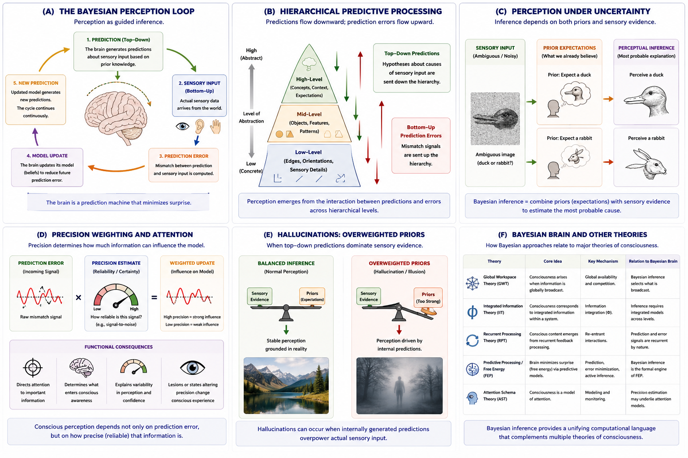

# Bayesian Brain and Predictive Inference {#bayesian-brain}

## Chapter Overview

Bayesian brain theories propose that perception and cognition operate through probabilistic inference under conditions of uncertainty. According to this framework, the brain does not passively record reality. Instead, it actively estimates the most likely causes of sensory input and continuously updates those estimates in response to new evidence [@knill2004; @kersten2004].

Bayesian approaches became influential because they provide a powerful computational framework for understanding perception, learning, prediction, uncertainty, attention, action, and conscious experience. The central idea is that the brain combines prior expectations with incoming sensory evidence to generate the best current interpretation of the world, body, and self.

This view is closely related to Predictive Processing and Active Inference, but the emphasis is slightly different. Predictive Processing focuses on hierarchical prediction and prediction-error minimization. Bayesian brain theories focus more broadly on probabilistic inference: how the brain weighs prior beliefs, sensory evidence, uncertainty, and precision in forming perceptual experience [@friston2010; @clark2016].

Some Bayesian approaches propose that conscious perception reflects the brain’s best current model of reality. On this view, perception is not simply what the senses deliver. It is what the brain infers, given both sensory input and prior expectations [@helmholtz1867; @hohwy2013].

At the same time, Bayesian approaches face an important philosophical challenge. They may explain how perception is constructed under uncertainty, but do they fully explain why perception is conscious? Probabilistic inference may explain cognition, behaviour, and reportability, but it may not by itself explain subjective feeling or phenomenal consciousness [@chalmers1995; @chalmers1996].

This chapter introduces Bayesian inference, explains the Bayesian brain framework, examines prediction error and precision weighting, explores hallucinations and altered states, compares Bayesian approaches with other theories of consciousness, and evaluates their strengths and limitations.

## Learning Objectives

After reading this chapter, the reader should be able to:

* Define the core claim of Bayesian brain theories.
* Explain Bayesian inference intuitively.
* Describe priors, sensory evidence, prediction error, and posterior beliefs.
* Explain the role of uncertainty and precision weighting.
* Analyze the relationship between prediction and conscious perception.
* Describe hallucinations and altered states within Bayesian frameworks.
* Compare Bayesian approaches with Predictive Processing and other theories of consciousness.
* Evaluate the strengths and criticisms of Bayesian approaches to consciousness.
* Discuss whether probabilistic inference is sufficient for conscious experience.

## Why Bayesian Brain Theories Became Influential

Bayesian brain theories became influential because they offer a formal way to explain how organisms perceive and act under uncertainty. Sensory input is often incomplete, noisy, ambiguous, and context-dependent. The brain must therefore infer what is most likely happening rather than simply read the world directly.

For example, a shadow may be interpreted as an object, a sound may be interpreted as speech, and an ambiguous image may be seen in more than one way. These cases show that perception depends not only on sensory input, but also on expectation, context, memory, and prior knowledge.

Bayesian theories explain this by proposing that the brain combines prior expectations with sensory evidence. Priors represent what the system already expects or believes is likely. Sensory evidence represents current incoming data. Perception reflects the brain’s best estimate after combining both.

This framework became especially powerful because it connects perception, attention, learning, action, hallucination, and uncertainty within one mathematical language. It also aligns naturally with computational neuroscience, machine learning, robotics, psychiatry, and artificial intelligence [@doya2007; @griffiths2008].

## Core Idea in One Picture

Figure @ref(fig:fig-bayesian) summarizes the major conceptual structure of Bayesian approaches to consciousness.

```{r fig-bayesian, echo=FALSE, fig.cap="Bayesian brain and predictive inference. Panel A illustrates the Bayesian perception loop. Panel B shows hierarchical predictive processing. Panel C demonstrates perception under uncertainty. Panel D illustrates precision weighting and attention. Panel E shows hallucinations as overweighted priors. Panel F compares Bayesian approaches with other theories of consciousness.", out.width="100%", fig.align="center"} id="d6fa7g"

```

As Figure @ref(fig:fig-bayesian) illustrates, Bayesian approaches interpret perception as a continuous interaction between prior expectations, sensory evidence, prediction error, uncertainty, and model updating. Perception is not simply received from the world. It is inferred.

The figure also highlights one of the central philosophical issues. Bayesian inference can explain how perceptual contents are selected, updated, and stabilized, but it does not automatically explain why those contents are subjectively experienced.

## Historical Development

The intellectual roots of Bayesian brain theories extend across probability theory, statistics, philosophy, psychology, cybernetics, information theory, and computational neuroscience. Thomas Bayes’ work on probability provided the mathematical foundation for updating beliefs in light of evidence [@bayes1763].

In perception theory, Hermann von Helmholtz proposed that perception involves unconscious inference. The mind does not merely register sensory input. It interprets sensory signals by inferring their most likely causes [@helmholtz1867]. This idea became a major precursor to modern Bayesian theories of perception.

In the late twentieth and early twenty-first centuries, Bayesian models became increasingly influential in neuroscience and cognitive science. Researchers used Bayesian frameworks to explain perception under uncertainty, sensory integration, motor control, attention, and decision-making [@knill2004; @yuille2006; @griffiths2008].

Predictive coding and the Free Energy Principle then connected Bayesian inference with neural implementation and biological regulation. Predictive coding models proposed that the brain uses hierarchical predictions to reduce prediction error [@rao1999]. Friston’s Free Energy Principle provided a broader framework linking prediction, perception, action, and self-organization [@friston2005; @friston2010].

Bayesian brain theories are therefore part of a wider movement toward understanding mind as probabilistic, predictive, and inferential.

## Bayesian Inference

Bayesian inference is a method of updating beliefs in response to evidence. In simple terms, it asks how a system should revise its expectations when new information arrives.

A Bayesian system combines three basic elements. The first is the prior: what the system already expects before receiving new evidence. The second is the likelihood: how well the evidence fits a possible explanation. The third is the posterior: the updated belief after prior expectation and evidence are combined.

In perception, this means the brain does not simply accept sensory input at face value. It asks, in effect: given what I already know and what the senses are currently providing, what is the most likely cause of this input?

This can be summarized intuitively:

```text id="jig5wh"
prior expectation + sensory evidence → updated perception
```

The result is not always perfect truth. It is the brain’s best current estimate under uncertainty. This is why perception can be accurate in many cases but distorted in others.

## The Brain as a Prediction Machine

Bayesian brain theories often describe the brain as a prediction machine. The brain continuously anticipates sensory events, bodily changes, environmental structure, social situations, and possible actions.

Incoming sensory information is compared with these expectations. When the input differs from what was expected, the system generates prediction error. The brain then updates its model to reduce future error.

This framework changes how perception is understood. Traditional models often treat perception as moving from world to senses to brain. Bayesian approaches treat perception as an active process in which the brain predicts the world and uses sensory input to correct its predictions.

This does not mean the brain invents reality freely. Sensory input constrains perception. But perception is always shaped by the brain’s prior models, expectations, and estimates of uncertainty.

## Hierarchical Predictive Processing

Bayesian theories often propose that the brain is organized hierarchically. Higher levels represent abstract causes, contexts, goals, and meanings. Lower levels represent more detailed sensory features such as edges, sounds, colours, textures, and bodily signals.

Higher levels generate predictions about what lower levels should receive. Lower levels compare those predictions with incoming sensory signals and send prediction errors upward. This creates a continuous loop of prediction and correction [@rao1999; @friston2010].

This hierarchical structure helps explain how perception can be both stable and flexible. Higher-level expectations provide context and coherence, while lower-level prediction errors allow correction when the world does not match expectation.

For example, when listening to speech in a noisy room, the brain uses prior knowledge of language, context, and expectation to interpret incomplete auditory signals. The resulting experience is not a raw sound pattern. It is an inferred meaningful utterance.

## Prediction Error

Prediction error is the difference between predicted sensory input and actual sensory input. It is central to Bayesian and predictive theories because it drives learning and model updating.

When prediction error is small, the brain’s current model is working well. When prediction error is large, the system must revise its model, shift attention, or act to gather better information.

Prediction error can influence conscious experience. Unexpected stimuli often become more noticeable. Ambiguous stimuli may shift interpretation when prediction errors accumulate. Learning occurs when prediction errors reveal that the brain’s current model is incomplete or inaccurate.

However, prediction error does not automatically produce consciousness. Many unconscious systems also compute errors and update behaviour. The key question is what kinds of prediction error, at what levels of processing, contribute to conscious experience.

## Perception Under Uncertainty

One of the strongest contributions of Bayesian approaches is their treatment of perception under uncertainty. Sensory information is often incomplete or ambiguous. The brain must infer what is most likely present.

Ambiguous figures provide simple examples. The same image can be interpreted in different ways depending on context or expectation. Noisy speech may become clearer when one knows what sentence to expect. A vague shape in the dark may be interpreted as a person, a tree, or a shadow depending on prior belief and emotional state.

Bayesian theories explain these cases by saying that perception reflects weighted inference. The brain combines sensory evidence with prior expectations. When sensory evidence is strong and reliable, it dominates perception. When sensory evidence is weak or uncertain, priors play a stronger role.

This explains why perception is both objective and subjective. It is constrained by the world, but shaped by the brain’s expectations.

## Precision Weighting and Attention

Precision weighting is one of the most important concepts in Bayesian brain theories. Precision refers to the estimated reliability or certainty of a signal. A high-precision signal is treated as reliable and strongly influences perception. A low-precision signal is treated as uncertain and has less influence.

Attention is often interpreted as a form of precision control. When the brain attends to a stimulus, it increases the weight of prediction errors associated with that stimulus. This makes the signal more influential in perception and behaviour [@friston2010; @clark2013].

Precision weighting helps explain why some information becomes prominent in conscious awareness while other information remains background. It also helps explain individual differences in perception, anxiety, hallucination, and altered states.

For example, if bodily sensations are given excessive precision, they may dominate experience and contribute to anxiety. If high-level beliefs are given excessive precision, they may overpower sensory correction and contribute to hallucination or delusion.

Precision weighting therefore connects Bayesian inference with attention, salience, confidence, and conscious experience.

## The Free Energy Principle

Karl Friston’s Free Energy Principle extends Bayesian inference into a broad theory of biological self-organization [@friston2005; @friston2010]. According to this framework, organisms must maintain themselves within viable states by reducing uncertainty or surprise.

The brain does this by updating internal models and by acting on the world. Perception reduces uncertainty by revising beliefs. Action reduces uncertainty by changing sensory input. Together, perception and action form a continuous adaptive loop.

The Free Energy Principle is important because it connects Bayesian inference with life, action, embodiment, and self-maintenance. It does not treat the brain as a detached calculator. It treats the organism as an active system maintaining itself in a changing environment.

This makes the Bayesian brain framework relevant not only to perception, but also to action, emotion, selfhood, and consciousness.

## Consciousness and Predictive Models

Some Bayesian approaches propose that conscious experience reflects the brain’s best current predictive model of the world, body, and self. On this view, experience is not a copy of reality. It is a controlled, constrained inference.

This idea has been described as perception as “controlled hallucination,” meaning that the brain continuously generates perceptual models that are constrained by sensory evidence [@seth2021]. In normal perception, sensory input keeps these models aligned with the world. In hallucination or dreaming, internal models may dominate more strongly.

Bayesian theories may also explain aspects of selfhood. The sense of being an embodied self may depend on predictive models of bodily signals, including heartbeat, breathing, pain, movement, and interoception [@seth2013; @barrett2017].

However, the connection to consciousness remains debated. Bayesian inference may explain how perceptual content is constructed, but it does not automatically explain why that content is experienced from a first-person perspective.

## Hallucinations and Altered States

Bayesian approaches are especially powerful for explaining hallucinations and altered states. In normal perception, prior expectations and sensory input are balanced. In hallucination, prior expectations may dominate sensory evidence too strongly.

This can be summarized as:

```text id="w1d21n"
normal perception = balanced priors + sensory evidence
hallucination = overweighted priors + weakened sensory constraint
```

This framework has been applied to psychosis, auditory hallucinations, dreaming, psychedelic states, and delusional perception [@carhartHarris2019; @seth2021].

Dreaming can be interpreted as internally generated perception with reduced external sensory constraint. Psychedelic states may involve altered precision weighting and weakened high-level priors, allowing perception and self-experience to become more fluid. Psychosis may involve unusual precision assignments that make certain thoughts, perceptions, or beliefs feel excessively meaningful.

These applications show why Bayesian approaches have become influential in psychiatry and altered-state research. They explain altered experience as a change in inferential balance rather than as random malfunction.

## Bayesian Brain and Other Theories

Bayesian brain theories intersect with several other theories of consciousness.

### Relation to Predictive Processing

Predictive Processing can be understood as a neural and hierarchical implementation of Bayesian inference [@friston2010; @clark2016]. The Bayesian brain framework provides the probabilistic logic. Predictive Processing describes how hierarchical neural systems may implement that logic through predictions and prediction errors.

### Relation to Global Workspace Theory

Global Workspace Theory explains consciousness in terms of global broadcasting and cognitive access [@baars1988; @dehaene2011]. Bayesian inference may help determine which contents become strong, stable, or precise enough to enter global access.

### Relation to Integrated Information Theory

Integrated Information Theory emphasizes intrinsic causal integration and irreducibility [@tononi2004; @oizumi2014]. Bayesian approaches emphasize probabilistic inference, uncertainty reduction, and prediction. The two frameworks may overlap in their concern with integration, but they explain consciousness differently.

### Relation to Recurrent Processing Theory

Recurrent Processing Theory emphasizes feedback loops and recurrent sensory processing [@lamme2006]. Bayesian models also rely on recurrent exchange between predictions and prediction errors. The difference is that Bayesian theories interpret this exchange probabilistically.

### Relation to Higher-Order Thought Theory

Higher-Order Thought Theory explains consciousness through awareness of mental states [@rosenthal2005; @lau2011]. Bayesian approaches can model higher-order awareness as inference about one’s own mental states. However, HOT places meta-representation at the center, while Bayesian theories place probabilistic inference at the center.

### Relation to Attention Schema Theory

Attention Schema Theory explains awareness as the brain’s model of attention [@graziano2013]. Bayesian theories can interpret attention schemas as predictive models used to regulate attention and precision.

### Relation to Embodied and Enactive Theories

Embodied and enactive theories emphasize bodily action, environmental coupling, and lived experience [@varela1991; @thompson2007]. Bayesian approaches overlap with these theories when they emphasize active inference, interoception, and organism-environment interaction.

### Relation to Consciousness-First Theories

Bayesian brain theories differ from consciousness-first theories such as panpsychism, cosmopsychism, idealism, or Taheri’s T-Consciousness. Bayesian approaches begin with biological and computational inference. Consciousness-first theories begin from the idea that consciousness is fundamental or prior to physical and computational organization. These approaches will be discussed later in the book.

## Empirical Support

Evidence supporting Bayesian approaches comes from studies of visual illusions, perceptual ambiguity, sensory expectation, predictive coding, hallucinations, neuroimaging, computational modeling, and decision-making under uncertainty.

Perceptual illusions show that expectation and context shape experience. Ambiguous images show that the same sensory input can produce different conscious interpretations. Mismatch responses show that the brain detects violations of expectation. Predictive coding models explain how cortical systems may implement prediction and error correction [@rao1999; @friston2010].

Bayesian approaches are also useful in explaining multisensory integration. The brain must combine information from vision, hearing, touch, proprioception, and interoception. Bayesian models explain how signals are weighted according to reliability [@knill2004; @kersten2004].

In psychiatry and altered-state research, Bayesian frameworks help explain how abnormal precision weighting and altered priors may shape hallucinations, anxiety, psychosis, and psychedelic experience [@barrett2017; @carhartHarris2019].

However, much of this evidence supports Bayesian models of perception and cognition more directly than Bayesian theories of consciousness specifically. This distinction is important.

## Bayesian Approaches and Artificial Intelligence

Bayesian inference has strongly influenced artificial intelligence, robotics, machine learning, and decision theory. Artificial systems often need to act under uncertainty, update beliefs, estimate hidden causes, and make predictions from incomplete information.

Bayesian approaches are especially important in robotics because agents must infer the state of the world from noisy sensory signals. They are also important in machine learning systems that estimate probabilities, update models, and make decisions under uncertainty.

This raises questions about artificial consciousness. If consciousness depends on predictive inference, then advanced artificial systems with probabilistic models might possess some consciousness-relevant capacities. However, Bayesian inference alone is not sufficient evidence of consciousness. Many artificial systems perform probabilistic inference without subjective experience.

A conscious artificial system may require more than Bayesian updating. It may require embodiment, self-modeling, affective regulation, global integration, recurrent processing, or metacognitive awareness. Recent AI consciousness discussions therefore treat Bayesian and predictive capacities as relevant but not decisive [@butlin2023].

## Strengths of Bayesian Approaches

Bayesian brain theories have several major strengths. First, they provide a strong mathematical framework for understanding uncertainty. Perception and cognition often occur under incomplete information, and Bayesian inference gives a precise way to model this.

Second, Bayesian approaches explain why perception is shaped by expectation, context, and prior belief. They account for illusions, ambiguity, hallucinations, and altered states in a unified way.

Third, they integrate naturally with neuroscience, machine learning, robotics, psychiatry, and computational modeling. This gives the framework broad interdisciplinary reach.

Fourth, Bayesian theories connect perception with action and embodiment through active inference and the Free Energy Principle.

Fifth, they provide a useful bridge between cognition and consciousness. They explain how conscious contents may be constructed, stabilized, and updated through probabilistic inference.

## Weaknesses and Criticisms

Bayesian approaches also face several criticisms. One concern is overgeneralization. Because many processes can be described as inference under uncertainty, Bayesian explanations may become too flexible. If almost any result can be interpreted as Bayesian, the theory becomes difficult to test.

A second criticism is mathematical idealization. Brains may not literally calculate formal probabilities in the way Bayesian models describe. Bayesian models may be useful approximations rather than literal neural mechanisms.

A third criticism is empirical underdetermination. Many findings interpreted through Bayesian theories may also be explained by other frameworks, such as recurrent processing, global workspace models, or reinforcement learning.

A fourth criticism concerns embodiment and affect. Some Bayesian models may seem overly computational unless they include bodily regulation, emotion, action, and environmental interaction.

The deepest criticism concerns the hard problem. Bayesian inference may explain how perception is constructed, but it may not explain why perception feels like anything.

## Relation to the Hard Problem

Bayesian approaches are highly successful at explaining perceptual organization, uncertainty management, prediction, attention, learning, hallucination, and adaptive behaviour. However, critics argue that these explanations still leave the hard problem unresolved [@chalmers1995; @chalmers1996].

Even if conscious experience reflects the brain’s best predictive model, why is that model experienced? Why should probabilistic inference generate subjectivity? Why should prediction errors, priors, and precision weighting produce qualitative feeling?

This is the central philosophical challenge for Bayesian theories of consciousness. They may explain the contents and dynamics of experience, but not necessarily the existence of experience itself.

For this reason, Bayesian approaches are best understood as powerful theories of perceptual construction and conscious content. Whether they are complete theories of phenomenal consciousness remains unresolved.

## Explanatory Scope

Bayesian approaches attempt to explain perception, uncertainty, prediction, hallucination, attention, learning, decision-making, action, and conscious inference. Their explanatory scope is broad and impressive.

However, several questions remain open. Is prediction sufficient for consciousness? Can unconscious systems perform the same computations? How does selfhood emerge from Bayesian inference? Can artificial systems become conscious through probabilistic modeling? What distinguishes prediction from phenomenology? How should conscious inference be measured empirically?

These questions show that Bayesian theories are important but incomplete. They offer one of the strongest frameworks for explaining how experience is shaped, but not necessarily why experience exists.

## Evaluation

Bayesian brain theories are among the most influential computational frameworks in contemporary neuroscience and cognitive science. They explain perception and cognition as probabilistic inference under uncertainty.

Their greatest strength is that they explain why perception is active, context-sensitive, and expectation-driven. They provide a formal account of how priors, sensory evidence, prediction error, and precision interact to produce perceptual experience.

Their greatest limitation is that inference is not the same as consciousness. A system may perform Bayesian updating without having subjective experience. Therefore, Bayesian theories need to be connected with additional accounts of embodiment, integration, access, recurrence, self-modeling, or phenomenology if they are to become complete theories of consciousness.

Bayesian approaches are therefore best understood as powerful theories of perceptual inference and conscious content. Whether they fully explain phenomenal consciousness remains an open question.

## Chapter Summary

Bayesian brain theories propose that perception and cognition emerge through probabilistic inference under uncertainty. The brain continuously combines prior expectations with sensory evidence to generate updated models of the world, body, and self.

The framework emphasizes priors, likelihoods, posterior beliefs, prediction error, precision weighting, hierarchical inference, and model updating. It explains perception as active inference rather than passive reception.

Bayesian approaches are especially strong in explaining ambiguity, illusions, hallucinations, altered states, attention, uncertainty, and prediction. They are closely related to Predictive Processing, Active Inference, and the Free Energy Principle.

The main criticism is that Bayesian inference may explain how perception is constructed without explaining why it is conscious. Prediction, evidence, and uncertainty may shape experience, but they do not automatically explain subjective feeling.

The central unresolved question is whether consciousness is itself a form of Bayesian inference, or whether Bayesian inference explains only the structure, content, and dynamics of conscious perception.
