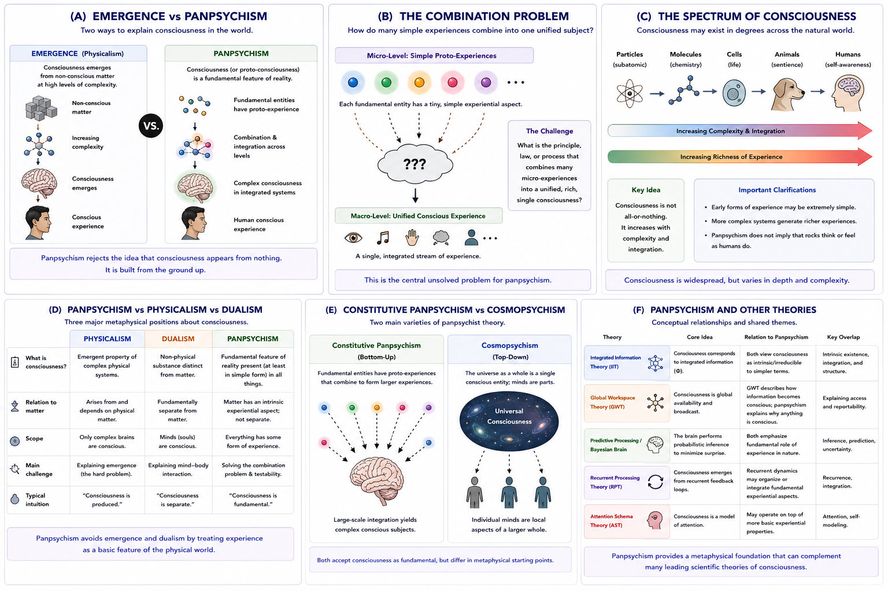

# Panpsychism {#panpsychism}

## Chapter Overview

Panpsychism proposes that consciousness—or at least extremely simple forms of proto-consciousness—is a fundamental feature of reality rather than something that emerges suddenly from entirely non-conscious matter [@goff2019; @chalmers1996].

Unlike traditional physicalist theories that attempt to explain consciousness as an emergent product of neural complexity, panpsychism argues that experiential properties may already exist at the most basic levels of nature. According to this view, human consciousness is not created from nothing. Instead, complex consciousness develops from simpler experiential foundations already present within reality itself.

Panpsychism has become increasingly influential in contemporary philosophy of mind because it directly addresses one of the deepest problems in consciousness research:

> How could subjective experience arise from purely non-conscious physical processes?

This chapter examines the historical development, conceptual foundations, metaphysical assumptions, strengths, criticisms, and unresolved challenges associated with panpsychism. Particular attention is given to the explanatory gap, the combination problem, Russellian monism, cosmopsychism, and the relationship between panpsychism and competing theories of consciousness.

## Learning Objectives

After reading this chapter, the reader should be able to:

- Define the core claims of panpsychism
- Explain why panpsychism is motivated by the hard problem of consciousness
- Distinguish panpsychism from physicalism and dualism
- Describe proto-consciousness and fundamental experience
- Explain the combination problem
- Distinguish constitutive panpsychism from cosmopsychism
- Analyze the relationship between panpsychism and Integrated Information Theory
- Evaluate the strengths and criticisms of panpsychism

## Core Idea in One Picture

Figure \@ref(fig:fig-panpsychism) summarizes the major conceptual structure of panpsychism.

```{r fig-panpsychism, echo=FALSE, fig.cap="Panpsychism and fundamental consciousness. Panel A contrasts emergent physicalism with panpsychism. Panel B illustrates the combination problem. Panel C shows consciousness as a continuum across systems. Panel D compares panpsychism with physicalism and dualism. Panel E distinguishes constitutive panpsychism from cosmopsychism. Panel F shows conceptual relationships between panpsychism and other theories of consciousness.", out.width="100%", fig.align="center"}

```

As shown in Figure \@ref(fig:fig-panpsychism), panpsychism attempts to avoid the problem of consciousness emerging from entirely non-conscious matter by treating experience as a fundamental aspect of reality itself.

## The Problem of Emergence

Panpsychism is fundamentally motivated by dissatisfaction with standard emergent explanations of consciousness.

Traditional physicalist theories often propose:

```text
matter → neural complexity → consciousness
```

However, some philosophers argue that this leaves a major explanatory gap:

> Why should physical processes suddenly generate subjective experience at all?

Figure \@ref(fig:fig-panpsychism) Panel A illustrates this contrast.

As shown in Panel A:

- physicalist emergence treats consciousness as appearing at high levels of complexity;
- panpsychism instead proposes that experiential properties already exist in primitive form at lower levels of reality.

According to panpsychists:

> Consciousness does not emerge from nothing.

This is one of the central philosophical motivations behind the theory.

## Historical Development

Panpsychist ideas have deep historical roots.

Versions of panpsychism or related ideas appear in the work of:

- Spinoza;
- Leibniz;
- William James;
- Alfred North Whitehead;
- Bertrand Russell.

Modern panpsychism has been developed further by philosophers such as:

- Galen Strawson;
- Philip Goff;
- David Chalmers;
- Hedda Hassel Mørch;
- and others.

Historically, panpsychism often emerged in response to dissatisfaction with both:

- strict materialism,
and:
- substance dualism.

Many philosophers viewed panpsychism as an attempt to preserve scientific naturalism while avoiding the explanatory difficulties associated with reducing consciousness to entirely non-conscious matter.

## Core Assumptions

Panpsychism typically involves several core assumptions.

### Consciousness Is Fundamental

Consciousness is treated as a basic feature of reality rather than a late accidental product of evolution.

### Proto-Consciousness Exists at Basic Levels

Fundamental entities may possess extremely primitive experiential or experiential-like properties.

Importantly:

> Panpsychism does not imply that atoms possess human-like thoughts, emotions, or self-awareness.

Instead, panpsychists usually propose very simple forms of proto-experience.

### Complex Consciousness Requires Combination

Human consciousness requires some mechanism through which simpler experiential units combine into unified conscious subjects.

This leads directly to the combination problem.

## Proto-Consciousness

Panpsychism often introduces the concept of **proto-consciousness**.

Proto-consciousness refers to:

- primitive experiential properties;
- extremely simple phenomenal aspects;
- or foundational experiential potentials.

These are not equivalent to:

- reflective self-awareness;
- language;
- reasoning;
- or human cognition.

Figure \@ref(fig:fig-panpsychism) Panel C illustrates this continuum.

As shown in Panel C:

- consciousness may exist in degrees;
- richer forms of experience emerge with increasing integration and complexity.

Panpsychism therefore often treats consciousness as gradual rather than all-or-nothing.

## Russellian Monism

A major modern form of panpsychism is **Russellian monism**.

This approach builds on ideas associated with Bertrand Russell.

According to Russellian monism:

- physics describes the structural and relational properties of matter;
- but physics may not describe the intrinsic nature of matter itself.

Panpsychists propose that:

> the intrinsic nature of matter may involve experiential properties.

This framework attempts to bridge:

- physical science,
and:
- subjective experience.

Russellian monism became highly influential because it attempts to preserve scientific realism while incorporating consciousness into the fundamental structure of reality.

## The Combination Problem

The greatest challenge facing panpsychism is the **combination problem**.

Figure \@ref(fig:fig-panpsychism) Panel B illustrates this issue.

The problem can be stated simply:

> How do many tiny experiential units combine into one unified conscious subject?

For example:

- if elementary particles possess proto-experiences,
- how do these combine into:
  - a unified human mind,
  - a single visual field,
  - or a coherent self?

This remains the central unresolved problem for panpsychism.

Critics argue that:

- no clear mechanism explains experiential combination;
- physical aggregation alone may not explain unified subjectivity.

Many philosophers consider the combination problem to be the major weakness of panpsychism.

## Constitutive Panpsychism vs Cosmopsychism

Modern panpsychism includes multiple variants.

Figure \@ref(fig:fig-panpsychism) Panel E compares two major approaches.

### Constitutive Panpsychism

Constitutive panpsychism proposes:

```text
micro-experiences → larger conscious systems
```

According to this view:

- small experiential entities combine into larger minds.

### Cosmopsychism

Cosmopsychism reverses this direction.

Instead of beginning with micro-conscious entities, cosmopsychism proposes:

```text
universal consciousness → individual minds
```

According to this framework:

- the universe itself may possess a unified consciousness;
- individual minds are localized aspects of a larger whole.

Both approaches attempt to solve the relationship between fundamental experience and unified conscious systems.

## Panpsychism vs Physicalism vs Dualism

Panpsychism is often positioned between:

- physicalism,
and:
- dualism.

Figure \@ref(fig:fig-panpsychism) Panel D compares these theories.

### Physicalism

Physicalism proposes:

- consciousness emerges from physical processes.

### Dualism

Dualism proposes:

- mind and matter are fundamentally separate substances.

### Panpsychism

Panpsychism proposes:

- consciousness is fundamental within physical reality itself.

This allows panpsychism to avoid:

- strict emergence from non-conscious matter,
while also avoiding:
- radically separate mental substances.

## Consciousness as a Continuum

Many panpsychist frameworks imply that consciousness exists along a continuum.

Figure \@ref(fig:fig-panpsychism) Panel C illustrates this gradual spectrum.

According to this perspective:

- simple systems may possess minimal experiential properties;
- more integrated systems generate richer conscious states.

This view contrasts with theories that treat consciousness as appearing suddenly at a sharp threshold.

Panpsychism therefore often supports graded approaches to:

- animal consciousness;
- infant consciousness;
- and possibly machine consciousness.

## Panpsychism and Integrated Information Theory

Some researchers observe conceptual similarities between panpsychism and Integrated Information Theory (IIT).

Figure \@ref(fig:fig-panpsychism) Panel F highlights these overlaps.

Both approaches emphasize:

- intrinsic existence;
- integrated systems;
- consciousness as deeply tied to fundamental properties.

However, important differences remain:

- IIT focuses on informational integration;
- panpsychism focuses on experiential fundamentality.

Some philosophers interpret IIT as partially compatible with panpsychist metaphysics.

## Panpsychism and Artificial Intelligence

Panpsychism has important implications for artificial consciousness.

If consciousness is fundamental, then:

- artificial systems may possess some degree of experience
depending on:
- organization,
- integration,
- intrinsic properties,
- or complexity.

However, panpsychism does not imply that:

- all systems are richly conscious;
- all computation generates awareness;
- or current AI systems possess human-like experience.

Instead, the theory raises important questions:

- What degree of integration matters?
- What counts as experiential organization?
- Can artificial systems possess unified subjectivity?
- How should machine consciousness be measured?

## Empirical Challenges

Panpsychism faces major empirical difficulties.

Unlike many neuroscientific theories, panpsychism does not currently provide:

- clear experimental markers;
- direct neural mechanisms;
- precise quantitative predictions;
- or decisive falsification criteria.

This creates important scientific challenges.

Critics argue that panpsychism may function more as:

- a metaphysical framework,
than:
- a fully empirical scientific theory.

## Strengths of Panpsychism

Major strengths include:

- direct engagement with the hard problem;
- avoidance of consciousness emerging from nothing;
- compatibility with scientific naturalism;
- integration with metaphysical realism;
- strong treatment of phenomenal consciousness;
- conceptual compatibility with some modern information theories.

Panpsychism also provides a philosophically elegant attempt to integrate:

- matter,
- experience,
- and consciousness

within a unified ontology.

## Weaknesses and Criticisms

Despite its strengths, panpsychism faces major criticisms.

### Combination Problem

No widely accepted solution exists for how micro-experiences combine into unified subjects.

### Lack of Testability

Critics argue panpsychism lacks clear empirical predictions.

### Explanatory Vagueness

Some philosophers argue that treating consciousness as fundamental may simply rename the problem rather than solve it.

### Over-Attribution

Critics worry that panpsychism attributes experience too broadly across nature.

### Mechanistic Weakness

The theory often lacks detailed cognitive or neural mechanisms explaining:

- reportability;
- attention;
- memory;
- selfhood;
- or behavioural control.

## Relation to the Hard Problem

Panpsychism is deeply connected to the hard problem of consciousness.

Rather than attempting to derive consciousness from non-conscious matter, panpsychism changes the explanatory framework itself.

The theory proposes:

> consciousness may already exist within the basic structure of reality.

According to supporters, this may reduce the explanatory gap associated with emergent physicalism.

However, critics argue that important questions remain:

- Why do experiential properties exist?
- Why do they combine into unified subjects?
- Why do some systems possess richer consciousness than others?

Thus panpsychism may relocate the hard problem rather than fully solve it.

## Explanatory Scope

Panpsychism attempts to explain:

- phenomenal consciousness;
- intrinsic experience;
- the explanatory gap;
- consciousness continuity;
- experiential fundamentality;
- and metaphysical integration.

However, unresolved questions remain:

- How does combination occur?
- Can consciousness be measured?
- What determines degrees of consciousness?
- Are all systems experiential?
- Can machines possess genuine experience?
- How does selfhood emerge?

## Summary

Panpsychism proposes that consciousness or proto-consciousness is a fundamental feature of reality rather than an emergent product of entirely non-conscious matter.

The theory attempts to address the hard problem by treating experience as built into the structure of nature itself.

Panpsychism emphasizes:

- experiential fundamentality;
- proto-consciousness;
- continuity of experience;
- and the limits of reductive emergence.

At the same time, major unresolved problems remain, especially concerning:

- the combination problem;
- empirical testability;
- neural mechanisms;
- and the relationship between simple experiences and unified conscious minds.

Despite these challenges, panpsychism has become one of the most influential contemporary philosophical approaches to consciousness because it directly confronts the explanatory gap between physical processes and subjective experience.