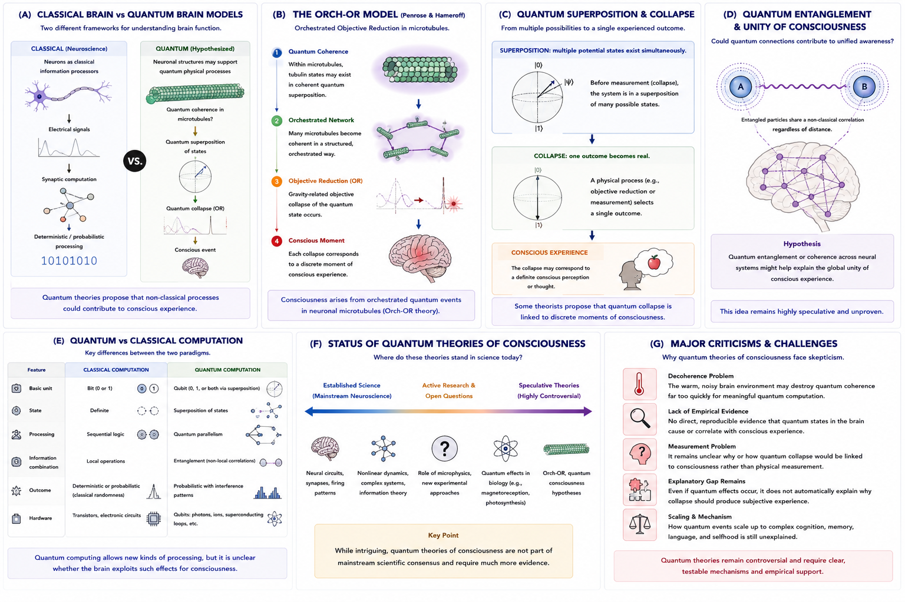

# Quantum Theories of Consciousness {#quantum}

## Chapter Overview

Quantum theories of consciousness propose that classical neural computation alone may be insufficient to explain conscious experience. According to these approaches, non-classical quantum processes may contribute to consciousness, subjective awareness, or the unity of experience [@penrose1989; @penrose1996].

Unlike mainstream neuroscientific theories that primarily explain consciousness through neural signaling, information processing, or large-scale brain dynamics, quantum theories investigate whether phenomena such as:

- quantum coherence,
- superposition,
- entanglement,
- indeterminacy,
- and state collapse

may play a meaningful role in conscious experience.

Quantum consciousness theories remain highly controversial. Most mainstream neuroscientific models do not require quantum explanations. Nevertheless, quantum approaches continue to attract interest because they attempt to address several persistent problems in consciousness research, including:

- the hard problem of consciousness;
- the unity of conscious experience;
- the limits of classical computation;
- and the relationship between mind and fundamental physics.

This chapter examines the historical development, conceptual foundations, proposed mechanisms, strengths, criticisms, empirical challenges, and philosophical implications of quantum theories of consciousness.

## Learning Objectives

After reading this chapter, the reader should be able to:

- Define the central claims of quantum theories of consciousness
- Explain why quantum mechanisms were proposed in consciousness research
- Describe basic quantum concepts relevant to consciousness theories
- Explain the Orch-OR model
- Distinguish classical and quantum computational approaches
- Analyze major criticisms of quantum consciousness theories
- Evaluate the scientific status of quantum approaches
- Explain implications for artificial intelligence and subjective experience

## Core Idea in One Picture

Figure \@ref(fig:fig-quantum) summarizes the major conceptual structure of quantum theories of consciousness.

```{r fig-quantum, echo=FALSE, fig.cap="Quantum theories of consciousness. Panel A compares classical and quantum brain models. Panel B illustrates the Orch-OR model. Panel C explains quantum superposition and collapse. Panel D explores quantum entanglement and unified consciousness. Panel E compares classical and quantum computation. Panel F summarizes the scientific status of quantum theories. Panel G outlines major criticisms and challenges.", out.width="100%", fig.align="center"}

```

As shown in Figure \@ref(fig:fig-quantum), quantum theories propose that non-classical physical processes may contribute to conscious experience beyond standard neural computation.

## Why Quantum Theories Exist

Quantum theories of consciousness emerged partly from dissatisfaction with purely classical explanations of mind.

Some researchers argue that consciousness possesses features that may not be fully explained through standard neural computation alone, including:

- subjective experience;
- unity of awareness;
- apparent indeterminacy;
- non-computability;
- and the hard problem of consciousness.

According to these theorists:

> Consciousness may involve physical processes beyond classical information processing.

Figure \@ref(fig:fig-quantum) Panel A illustrates this distinction.

As shown in Panel A:

- classical neuroscience explains cognition through neural signaling and computation;
- quantum approaches propose that additional quantum-level dynamics may contribute to conscious events.

Importantly, quantum theories do not reject neuroscience. Instead, they attempt to supplement classical neural explanations with additional physical mechanisms.

## Basic Quantum Concepts

Quantum consciousness theories rely on several concepts from quantum mechanics.

### Superposition

Quantum systems may exist in multiple possible states simultaneously.

Figure \@ref(fig:fig-quantum) Panel C illustrates this principle.

Before measurement or collapse:

```text
multiple possible states coexist
```

After collapse:

```text
one outcome becomes actualized
```

Some theorists speculate that conscious experience may relate to this transition from possibility to definite experience.

### Quantum Coherence

Quantum coherence refers to ordered quantum relationships maintained across a system.

Some theories propose that coherent quantum states may occur temporarily within neural structures.

### Entanglement

Quantum entanglement involves non-classical correlations between systems.

Figure \@ref(fig:fig-quantum) Panel D illustrates this idea.

Some researchers speculate that quantum entanglement could potentially contribute to the unified nature of conscious experience.

### Objective Reduction

Some theories propose that quantum state collapse itself may contribute to conscious moments.

This idea is especially important within Orch-OR theory.

## Historical Development

Quantum approaches to consciousness developed through interactions between:

- physics;
- philosophy of mind;
- neuroscience;
- mathematics;
- and computational theory.

Early discussions emerged partly from attempts to understand whether:

- consciousness influences measurement;
- quantum mechanics requires observers;
- or mind and matter possess deeper connections.

Modern quantum consciousness theories became especially associated with:

- Roger Penrose;
- Stuart Hameroff;
- Henry Stapp;
- David Bohm;
- and others exploring relationships between physics and subjective experience.

Roger Penrose argued that human understanding may involve non-computable processes that cannot be fully captured through classical algorithms [@penrose1989].

This became one of the major motivations for later quantum models.

## Penrose and Non-Computability

Penrose proposed that consciousness may involve forms of understanding that exceed classical computation.

According to Penrose:

- formal algorithms may not fully capture human insight;
- consciousness may involve non-computable physical processes.

This argument partly drew on Gödelian ideas concerning mathematical incompleteness.

Penrose therefore questioned whether:

```text
classical computation alone = consciousness
```

This motivated the search for additional physical mechanisms potentially linked to conscious awareness.

## The Orch-OR Theory

The most influential quantum theory of consciousness is the **Orchestrated Objective Reduction (Orch-OR)** model proposed by Roger Penrose and Stuart Hameroff [@penrose1996].

Figure \@ref(fig:fig-quantum) Panel B illustrates this framework.

According to Orch-OR:

1. quantum coherence occurs within neuronal microtubules;
2. coherent quantum states become organized;
3. objective reduction (collapse) occurs;
4. conscious moments emerge.

### Microtubules

Microtubules are structural components within neurons.

Hameroff proposed that they may support quantum coherence under certain conditions.

### Objective Reduction

Penrose proposed that quantum state reduction may occur through objective physical processes linked to spacetime geometry.

According to Orch-OR:

> conscious moments correspond to orchestrated quantum state reductions.

This remains highly controversial but historically influential.

## Quantum Superposition and Conscious Experience

Figure \@ref(fig:fig-quantum) Panel C illustrates quantum superposition and collapse.

Some theorists speculate that:

- conscious awareness may relate to the transition from multiple possibilities to a single experienced outcome.

According to these interpretations:

```text
superposition → collapse → conscious moment
```

However, this relationship remains speculative and lacks strong empirical confirmation.

Importantly:

> Even if quantum collapse occurs in the brain, it does not automatically explain subjective experience.

This remains a major philosophical challenge.

## Quantum Entanglement and the Unity of Consciousness

One persistent question in consciousness research concerns:

> Why does conscious experience appear unified?

Figure \@ref(fig:fig-quantum) Panel D explores this issue.

Some theorists speculate that quantum entanglement could potentially contribute to:

- global integration;
- unified awareness;
- synchronized cognition;
- or coherent conscious states.

However, evidence for large-scale quantum entanglement in neural systems remains limited.

Most neuroscientific theories explain unity through large-scale neural integration rather than quantum entanglement.

## Quantum vs Classical Computation

Figure \@ref(fig:fig-quantum) Panel E compares classical and quantum computation.

### Classical Computation

Classical systems typically involve:

- bits;
- deterministic or probabilistic operations;
- local computation;
- sequential processing.

### Quantum Computation

Quantum systems may involve:

- qubits;
- superposition;
- interference;
- entanglement;
- quantum parallelism.

Some theorists argue that these properties may provide computational capacities unavailable to purely classical systems.

However, it remains unclear whether brains actually exploit such quantum computational mechanisms in meaningful ways.

## Quantum Theories and Artificial Intelligence

Quantum theories have important implications for AI consciousness.

If consciousness depends critically on:

- quantum coherence;
- biological quantum structures;
- or non-classical physical processes,

then current classical AI systems may lack essential ingredients for genuine consciousness.

Figure \@ref(fig:fig-quantum) Panel A highlights this contrast.

According to some quantum theorists:

```text
intelligence ≠ consciousness
```

A system might simulate intelligent behaviour without possessing genuine subjective experience.

Quantum approaches therefore often challenge strong computationalist views of machine consciousness.

## Scientific Status of Quantum Theories

Figure \@ref(fig:fig-quantum) Panel F summarizes the scientific status of quantum theories of consciousness.

At present:

- quantum consciousness theories remain speculative;
- they are not part of mainstream consensus neuroscience;
- and empirical support remains limited.

Some quantum effects are well-established in biology, including:

- photosynthesis;
- avian magnetoreception;
- and molecular quantum effects.

However:

> Evidence directly linking quantum states to conscious experience remains weak.

Most mainstream consciousness theories continue to rely primarily on:

- neural networks;
- large-scale integration;
- recurrent processing;
- predictive inference;
- and information processing.

## Strengths of Quantum Theories

Major strengths include:

- engagement with foundational physics;
- direct confrontation with the hard problem;
- exploration of non-classical mechanisms;
- integration of physics and consciousness research;
- challenge to simplistic computational reductionism;
- novel approaches to unity and subjectivity.

Quantum theories also stimulate interdisciplinary dialogue between:

- neuroscience;
- philosophy;
- physics;
- mathematics;
- and cognitive science.

## Weaknesses and Criticisms

Figure \@ref(fig:fig-quantum) Panel G summarizes major criticisms.

### Decoherence Problem

One of the strongest criticisms concerns **decoherence**.

Critics argue that:

- the warm, noisy environment of the brain
may destroy:
- delicate quantum states too rapidly.

This could prevent meaningful large-scale quantum computation.

### Lack of Empirical Evidence

Currently, no direct evidence demonstrates that:

- quantum coherence in the brain
causes:
- conscious experience.

### Explanatory Gap Remains

Even if quantum effects occur in the brain:

> Why should quantum collapse generate subjective feeling?

Quantum theories may relocate the hard problem without fully solving it.

### Scaling Problem

It remains unclear how microscopic quantum events would scale into:

- cognition;
- language;
- selfhood;
- memory;
- and unified awareness.

### Risk of Quantum Mysticism

Critics caution against using quantum terminology vaguely or metaphorically without rigorous physical grounding.

## Relation to the Hard Problem

Quantum theories are often motivated by the hard problem of consciousness.

Some theorists argue that:

- classical neural mechanisms explain behaviour and cognition;
but fail to explain:
- why subjective experience exists.

Quantum approaches attempt to introduce deeper physical mechanisms potentially connected to consciousness itself.

However, unresolved questions remain:

- Why should quantum processes feel like anything?
- Why should collapse generate experience?
- Why should quantum indeterminacy produce subjectivity?

Thus quantum theories may extend physical explanation without fully resolving phenomenology.

## Explanatory Scope

Quantum theories attempt to explain:

- unity of consciousness;
- subjective awareness;
- non-classical cognition;
- conscious moments;
- indeterminacy;
- and potentially the limits of computation.

However, unresolved questions remain:

- Do meaningful quantum states occur in brains?
- Is consciousness quantum or merely neural?
- Can AI become conscious without quantum processes?
- Are quantum effects necessary or incidental?
- Can quantum theories be experimentally verified?

## Summary

Quantum theories of consciousness propose that non-classical physical processes may contribute to conscious experience beyond standard neural computation.

These approaches explore possible roles for:

- superposition;
- coherence;
- entanglement;
- collapse;
- and quantum computation.

The most influential proposal, Orch-OR, suggests that orchestrated quantum state reductions within neuronal microtubules may contribute to conscious moments.

Quantum theories remain highly speculative and controversial. Most mainstream neuroscientific models of consciousness do not require quantum explanations.

Nevertheless, quantum approaches remain philosophically important because they directly confront:

- the hard problem;
- the limits of classical computation;
- and the relationship between consciousness and fundamental physics.

At the same time, major challenges remain concerning:

- empirical evidence;
- decoherence;
- neural plausibility;
- explanatory power;
- and the relationship between quantum processes and subjective experience.