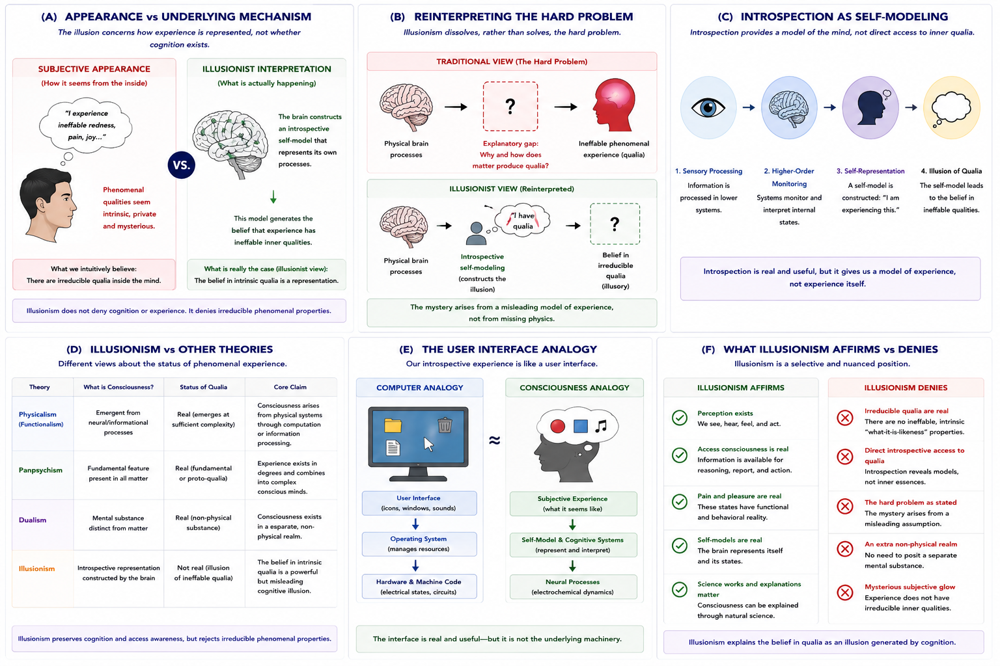

# Illusionism {#illusionism}

## Chapter Overview

Illusionism argues that phenomenal consciousness, as traditionally conceived, may be a cognitive illusion rather than a fundamental feature of reality [@dennett1991; @frankish2016].

Importantly, illusionism does **not** deny that humans:

- perceive;
- think;
- feel pain;
- report experiences;
- possess emotions;
- or maintain self-models.

Instead, illusionism challenges the idea that conscious experience contains irreducible, ineffable phenomenal properties often referred to as **qualia**.

According to illusionists, consciousness appears mysterious because the brain represents its own internal processes in a misleading way. The apparent “inner glow” of subjective experience may arise from introspective self-modeling rather than from non-physical or irreducible phenomenal properties.

This chapter examines illusionism as a radical and influential response to the hard problem of consciousness. The discussion explores its historical background, conceptual assumptions, introspective mechanisms, relation to qualia, explanatory strengths, criticisms, empirical implications, and connections to artificial intelligence and self-modeling theories.

## Learning Objectives

After reading this chapter, the reader should be able to:

- Define the central claims of illusionism
- Explain what illusionism does and does not deny
- Distinguish phenomenal consciousness from access consciousness
- Explain the illusionist interpretation of qualia
- Describe introspection as self-modeling
- Explain the meta-problem of consciousness
- Compare illusionism with competing theories
- Evaluate major criticisms of illusionism

## Core Idea in One Picture

Figure \@ref(fig:fig-illusionism) summarizes the major conceptual structure of illusionism.

```{r fig-illusionism, echo=FALSE, fig.cap="Illusionism and introspective self-modeling. Panel A contrasts subjective appearance with illusionist interpretation. Panel B reinterprets the hard problem. Panel C illustrates introspection as self-modeling. Panel D compares illusionism with competing theories. Panel E presents the user-interface analogy. Panel F distinguishes what illusionism affirms from what it denies.", out.width="100%", fig.align="center"}

```

As shown in Figure \@ref(fig:fig-illusionism), illusionism proposes that the apparent mystery of consciousness may arise from how cognitive systems represent themselves rather than from irreducible phenomenal properties themselves.

## The Hard Problem and Illusionism

Illusionism emerged partly in response to the hard problem of consciousness.

The hard problem asks:

> Why do physical brain processes produce subjective experience at all?

Many theories attempt to explain:

- neural activity;
- information processing;
- cognition;
- and behavioural reportability.

However, critics argue that these explanations fail to explain:

- subjective feeling itself;
- the “what-it-is-like” aspect of experience;
- or phenomenal consciousness.

Illusionism responds in a radically different way.

Rather than solving the hard problem directly, illusionism attempts to reinterpret or dissolve it.

Figure \@ref(fig:fig-illusionism) Panel B illustrates this shift.

As shown in Panel B:

### Traditional View

```text
brain activity → unexplained qualia
```

### Illusionist View

```text
brain activity → introspective self-model → illusion of qualia
```

According to illusionists:

> The hard problem may arise from a misleading model of experience itself.

## What Illusionism Does Not Deny

A major misunderstanding about illusionism is the belief that it denies consciousness entirely.

Illusionism does **not** deny:

- cognition;
- perception;
- pain behaviour;
- emotional states;
- self-awareness;
- or conscious reportability.

Figure \@ref(fig:fig-illusionism) Panel F clarifies this distinction.

Illusionists generally affirm that:

- humans genuinely process information;
- subjective reports are real;
- awareness-related cognition exists;
- introspective self-models operate continuously.

What illusionists reject is the existence of:

- irreducible phenomenal properties;
- mysterious intrinsic qualia;
- or non-physical “inner essences.”

This distinction is essential.

## Qualia and Phenomenal Properties

Traditional theories often describe consciousness using the concept of **qualia**.

Qualia refer to the allegedly:

- intrinsic;
- ineffable;
- private;
- subjective qualities of experience.

Examples include:

- the redness of red;
- the painfulness of pain;
- the taste of coffee;
- or the feeling of sadness.

Illusionists argue that belief in qualia may itself be generated by introspective cognitive processes.

Figure \@ref(fig:fig-illusionism) Panel A contrasts:

- subjective appearance,
with:
- illusionist interpretation.

According to illusionists:

> Experiences seem to possess ineffable inner properties because the brain represents them that way.

The illusion therefore concerns:

- how experience is represented,
not:
- whether cognition exists.

## Historical Development

Illusionist themes appeared historically in:

- behaviourism;
- eliminative materialism;
- functionalism;
- and skeptical critiques of introspection.

However, modern illusionism became especially associated with philosophers such as:

- Daniel Dennett;
- Keith Frankish;
- and related cognitive theories of consciousness.

Daniel Dennett challenged traditional assumptions about qualia and argued that consciousness should be studied through:

- behaviour;
- cognition;
- reportability;
- and information processing

rather than through assumptions about ineffable inner properties [@dennett1991].

Keith Frankish later developed modern illusionism more explicitly by arguing that phenomenal consciousness may be a powerful introspective illusion generated through cognitive self-modeling [@frankish2016].

## Dennett and Heterophenomenology

Dennett proposed a method called **heterophenomenology**.

According to this approach:

- subjective reports should be studied scientifically;
- but reports should not automatically be treated as direct evidence for irreducible qualia.

Dennett argued that:

> consciousness should be explained through cognitive architecture rather than mysterious intrinsic properties.

This became foundational for later illusionist theories.

## Introspection and Self-Modeling

A central claim of illusionism is that introspection does not provide direct access to consciousness itself.

Instead:

> introspection provides access to internal self-models generated by cognitive systems.

Figure \@ref(fig:fig-illusionism) Panel C illustrates this process.

As shown in Panel C:

1. sensory processing occurs;
2. higher-order monitoring systems interpret internal states;
3. self-representations are constructed;
4. the brain forms beliefs about possessing qualia.

According to illusionism:

- the brain models itself as conscious;
- introspective access is indirect;
- phenomenology reflects representational structure.

This perspective strongly overlaps with theories emphasizing:

- metacognition;
- higher-order representation;
- predictive self-modeling;
- and attention schemas.

## The Meta-Problem of Consciousness

Modern illusionism often focuses on the **meta-problem of consciousness**.

The meta-problem asks:

> Why do humans believe consciousness is mysterious?

Rather than explaining irreducible phenomenal properties directly, illusionists attempt to explain:

- why consciousness feels special;
- why people believe in qualia;
- why introspection appears compelling;
- and why the hard problem seems so difficult.

According to illusionists:

> solving the meta-problem may dissolve much of the hard problem itself.

## The User Interface Analogy

Figure \@ref(fig:fig-illusionism) Panel E presents one of the most important analogies used in illusionist thinking.

Some illusionists compare consciousness to a graphical computer interface.

For example:

- desktop icons appear simple and intuitive;
- but they do not literally reveal underlying machine code.

Similarly:

- introspective experience may provide a useful interface for cognition;
- while hiding underlying neural complexity.

According to this analogy:

```text
subjective appearance ≠ underlying mechanism
```

The interface is useful and functionally important, but it may not accurately represent underlying physical processes.

## Access Consciousness vs Phenomenal Consciousness

A major distinction in illusionist theory concerns:

- access consciousness;
versus:
- phenomenal consciousness.

### Access Consciousness

Access consciousness involves information that is available for:

- reasoning;
- verbal report;
- decision-making;
- memory;
- and behavioural control.

Illusionists generally accept access consciousness as real and scientifically tractable.

### Phenomenal Consciousness

Phenomenal consciousness refers to:

- allegedly intrinsic subjective qualities;
- ineffable “what-it-is-like” properties.

Illusionists challenge whether such properties exist independently of introspective representation.

Figure \@ref(fig:fig-illusionism) Panel F summarizes these distinctions.

## Illusionism and Artificial Intelligence

Illusionism has important implications for AI consciousness.

If consciousness depends primarily on:

- self-modeling;
- introspective representation;
- cognitive access;
- and information-processing architecture,

then sufficiently advanced artificial systems might potentially generate similar introspective illusions.

According to illusionism:

```text
self-modeling + cognitive representation
may produce apparent consciousness
```

This differs significantly from theories requiring:

- biological embodiment;
- quantum processes;
- or fundamental phenomenal properties.

Illusionism therefore tends to support stronger possibilities for machine consciousness than many competing theories.

## Relation to Other Theories

Figure \@ref(fig:fig-illusionism) Panel D compares illusionism with competing theories.

### Relation to Physicalism

Illusionism is usually compatible with physicalism and naturalism.

### Relation to Functionalism

Illusionism often overlaps strongly with functionalist approaches emphasizing cognitive organization.

### Relation to Attention Schema Theory

Illusionism shares important similarities with Attention Schema Theory because both emphasize internal models of awareness rather than irreducible phenomenal properties.

### Relation to Predictive Processing

Some researchers suggest predictive self-models may contribute to introspective illusions concerning consciousness.

### Relation to Panpsychism

Illusionism sharply contrasts with panpsychism.

- Panpsychism treats consciousness as fundamental.
- Illusionism treats phenomenal consciousness as representationally constructed.

## Empirical Relevance

Evidence relevant to illusionism may come from:

- metacognition studies;
- introspective error;
- cognitive biases;
- split-brain research;
- attention studies;
- self-modeling;
- predictive processing;
- confidence judgments;
- and cognitive neuroscience.

Illusionists argue that:

- many features traditionally attributed to phenomenal consciousness
may instead reflect:
- cognitive access and self-representation.

However, critics argue that illusionism explains:

- reports about experience,
without fully explaining:
- experience itself.

## Strengths of Illusionism

Major strengths include:

- strong naturalistic framework;
- compatibility with neuroscience;
- avoidance of metaphysical dualism;
- integration with cognitive science;
- explanatory focus on introspection and self-modeling;
- engagement with the meta-problem of consciousness;
- relevance to AI and computational theories.

Illusionism also provides one of the clearest attempts to reinterpret the hard problem within a scientific framework.

## Weaknesses and Criticisms

Despite its strengths, illusionism faces major criticisms.

### “Illusion Requires Experience”

The most famous criticism asks:

> How can there be an illusion of consciousness without consciousness itself?

Critics argue that:

- illusions themselves are experiences;
- therefore some form of phenomenology must already exist.

### Denial of Direct Experience

Many philosophers argue that phenomenal consciousness is the most certain aspect of existence.

Critics therefore claim illusionism contradicts immediate introspective reality.

### Explanatory Substitution

Some critics argue illusionism explains:

- why people talk about consciousness,
without explaining:
- subjective experience itself.

### Introspective Skepticism

Critics question whether introspection is truly as unreliable as illusionists suggest.

### Hard Problem Remains

Some philosophers argue illusionism merely re-labels the hard problem rather than dissolving it.

## Relation to the Hard Problem

Illusionism attempts to dissolve rather than solve the hard problem.

According to illusionists:

- the hard problem may arise from misleading assumptions about qualia;
- introspection may distort how experience is represented;
- phenomenal properties may not exist as traditionally conceived.

Thus illusionism attempts to replace:

```text
Why do qualia exist?
```

with:

```text
Why do humans believe in qualia?
```

This shift is one of the defining features of the theory.

## Explanatory Scope

Illusionism attempts to explain:

- introspective beliefs;
- self-modeling;
- access consciousness;
- cognitive awareness;
- reportability;
- metacognition;
- and the apparent mystery of consciousness.

However, unresolved questions remain:

- Does illusionism eliminate phenomenology or explain it?
- Can introspective illusion exist without experience?
- Are qualia fully reducible?
- Can AI systems generate introspective self-models?
- Is phenomenal consciousness genuinely illusory?

## Summary

Illusionism argues that phenomenal consciousness, as traditionally conceived, may be an introspective illusion generated through cognitive self-modeling.
