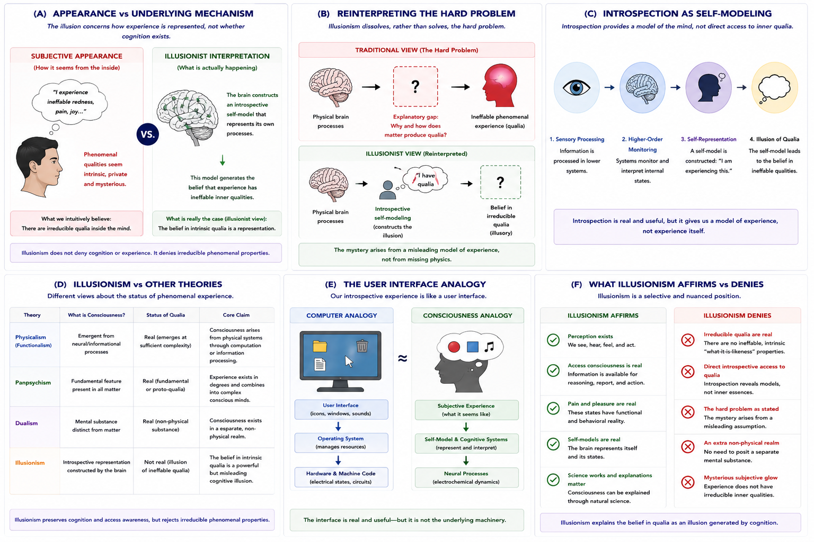

# Illusionism {#illusionism}

## Chapter Overview

Illusionism is the view that phenomenal consciousness, as traditionally conceived, may be a cognitive illusion rather than a fundamental feature of reality. Illusionists do not deny that human beings perceive, think, feel pain, report experiences, have emotions, or maintain self-models. Instead, they challenge the idea that consciousness contains irreducible, private, ineffable phenomenal properties often called qualia [@dennett1991; @frankish2016].

According to illusionism, consciousness seems mysterious because the brain represents its own internal processes in a simplified and misleading way. The apparent “inner glow” of subjective experience may arise from introspection, self-modeling, and cognitive representation rather than from non-physical or irreducible phenomenal properties.

Illusionism is one of the most radical responses to the hard problem of consciousness. Most theories attempt to explain why physical processes produce subjective experience. Illusionism instead questions whether phenomenal consciousness, in the traditional philosophical sense, exists at all. It shifts the question from “Why do qualia exist?” to “Why do we believe that qualia exist?” [@chalmers2018].

This makes illusionism controversial. Supporters argue that it provides a naturalistic way to dissolve the hard problem. Critics argue that illusionism denies the most obvious fact about consciousness: that experience is actually felt.

This chapter examines illusionism as a radical and influential response to the hard problem. It explores its historical background, central claims, interpretation of qualia, theory of introspection, relationship to the meta-problem of consciousness, strengths, criticisms, empirical relevance, and implications for artificial intelligence.

## Learning Objectives

After reading this chapter, the reader should be able to:

* Define the central claims of illusionism.
* Explain what illusionism does and does not deny.
* Distinguish access consciousness from phenomenal consciousness.
* Explain the illusionist interpretation of qualia.
* Describe introspection as self-modeling.
* Explain the meta-problem of consciousness.
* Compare illusionism with physicalism, functionalism, Attention Schema Theory, panpsychism, and T-Consciousness.
* Evaluate major criticisms of illusionism.
* Discuss illusionism’s implications for artificial intelligence and machine consciousness.

## Core Idea in One Picture

Figure @ref(fig:fig-illusionism) summarizes the major conceptual structure of illusionism.

```{r fig-illusionism, echo=FALSE, fig.cap="Illusionism and introspective self-modeling. Panel A contrasts subjective appearance with illusionist interpretation. Panel B reinterprets the hard problem. Panel C illustrates introspection as self-modeling. Panel D compares illusionism with competing theories. Panel E presents the user-interface analogy. Panel F distinguishes what illusionism affirms from what it denies.", out.width="100%", fig.align="center"}

```

As Figure @ref(fig:fig-illusionism) illustrates, illusionism proposes that the apparent mystery of consciousness may arise from how cognitive systems represent themselves. The brain does not simply reveal its own internal processes transparently. It constructs simplified models of those processes, and those models may generate the impression of ineffable inner qualities.

This does not mean that perception, pain, emotion, or self-report are unreal. It means that illusionists reinterpret what these phenomena are. Consciousness is not denied as cognitive functioning or self-representation. What is denied is the existence of irreducible phenomenal properties as traditionally imagined.

## The Hard Problem and the Illusionist Response

Illusionism emerged partly in response to the hard problem of consciousness. The hard problem asks why physical brain processes produce subjective experience at all [@chalmers1995; @chalmers1996].

Many theories attempt to answer this by identifying neural correlates, information-processing architectures, integrated causal structures, or predictive models. However, critics argue that these approaches may explain behaviour and cognition without explaining why experience feels like anything.

Illusionism responds differently. It suggests that the hard problem may arise from a mistaken conception of experience. The traditional view assumes that the brain produces special intrinsic properties called qualia, and then asks why physical processes generate those properties. Illusionism questions the assumption.

The contrast can be summarized as:

```text
traditional view:
brain activity → unexplained qualia

illusionist view:
brain activity → introspective self-model → illusion of qualia
```

According to illusionists, the hard problem may be generated by the way the brain represents its own activity. If introspection misrepresents cognitive processes as having ineffable phenomenal properties, then the apparent mystery may be a product of self-modeling rather than a feature of reality itself [@frankish2016; @chalmers2018].

## What Illusionism Does Not Deny

A major misunderstanding is that illusionism denies consciousness entirely. This is not accurate.

Illusionism does not deny perception, cognition, pain behaviour, emotion, attention, self-awareness, memory, reportability, or internal representation. Illusionists agree that humans have complex mental lives and that reports of experience are real data that require explanation.

What illusionism denies is a particular philosophical interpretation of consciousness. It rejects the idea that experience contains irreducible, private, non-physical, ineffable properties that cannot be explained by cognitive science.

This distinction is essential. Illusionists do not say that pain does not matter or that people do not react to injury. They say that the painfulness of pain should be explained in terms of biological, cognitive, affective, and representational processes rather than in terms of mysterious intrinsic qualia.

Thus, illusionism is not the claim that “nothing is happening.” It is the claim that what is happening has been misdescribed by traditional introspection and philosophy.

## Qualia and Phenomenal Properties

Traditional theories often describe consciousness using the concept of qualia. Qualia are usually defined as the intrinsic, private, ineffable, subjective qualities of experience. Examples include the redness of red, the painfulness of pain, the taste of coffee, or the feeling of sadness.

Illusionists argue that belief in qualia may itself be generated by cognitive processes. The brain represents its own perceptual and affective states in a simplified way. Because these representations do not reveal their underlying mechanisms, they appear to have simple, intrinsic, non-physical qualities.

This does not mean that colour perception or pain perception are unreal. It means that their apparent intrinsic phenomenal nature may be a representational illusion.

For example, seeing red involves complex visual processing, categorization, memory, attention, and behavioural readiness. Introspection does not reveal these mechanisms. Instead, it presents the experience as a simple quality: redness. Illusionism argues that this simplicity may be a feature of the self-model, not evidence for irreducible qualia.

## Historical Development

Illusionist themes have historical connections with behaviourism, eliminative materialism, functionalism, and skeptical approaches to introspection. Behaviourism avoided inner experience as a scientific object. Eliminative materialism questioned whether common-sense mental categories accurately describe the brain [@churchland1981; @churchland1986]. Functionalism emphasized the causal roles of mental states rather than their intrinsic nature.

Modern illusionism is most strongly associated with Daniel Dennett and Keith Frankish. Dennett challenged traditional assumptions about qualia and argued that consciousness should be explained through cognitive architecture, reportability, behaviour, and information processing rather than through ineffable inner properties [@dennett1991; @dennett2005].

Frankish later developed illusionism explicitly as the view that phenomenal consciousness, in the traditional sense, is an introspective illusion [@frankish2016; @frankish2017]. On this view, the task of consciousness science is not to explain irreducible qualia, but to explain why we represent ourselves as having them.

Illusionism therefore belongs to the naturalistic tradition in consciousness studies. It attempts to explain consciousness without introducing non-physical properties, fundamental experience, or consciousness-first metaphysics.

## Dennett and Heterophenomenology

Dennett proposed a method called heterophenomenology [@dennett1991]. This method treats subjective reports as important data, but not as infallible windows into inner reality.

According to heterophenomenology, researchers should collect and interpret people’s reports about experience, but should not automatically assume that those reports reveal irreducible qualia. A person’s report that an experience seems ineffable is itself a psychological fact requiring explanation.

This approach allows consciousness to be studied scientifically. Reports, behaviours, neural activity, cognitive processes, and introspective claims can all be investigated. However, the researcher remains neutral about whether the reported inner qualities exist as traditionally conceived.

Dennett’s approach became foundational for illusionism because it shifted the focus from explaining qualia directly to explaining why people report and believe in qualia.

## Introspection and Self-Modeling

A central claim of illusionism is that introspection does not provide direct access to consciousness as it truly is. Instead, introspection provides access to internal self-models generated by cognitive systems.

The brain continuously monitors its own states. It tracks perception, attention, memory, bodily condition, emotion, and action. However, this monitoring is simplified. It does not reveal detailed neural mechanisms. It presents internal processes in a compressed and user-friendly form.

Illusionists argue that this compression may generate the appearance of phenomenal properties. The brain models itself as having private inner qualities, and this model becomes the basis for reports such as “I am experiencing redness” or “I feel pain.”

This perspective overlaps with several other theories. Higher-Order Thought Theory emphasizes awareness of mental states [@rosenthal2005; @lau2011]. Attention Schema Theory explains awareness as the brain’s model of attention [@graziano2013; @graziano2016]. Predictive Processing explains perception and selfhood through internal models and prediction [@friston2010; @clark2013]. Illusionism can draw on all of these ideas while making the stronger claim that phenomenal properties themselves are illusory.

## The Meta-Problem of Consciousness

Modern illusionism often focuses on the meta-problem of consciousness. The meta-problem asks why humans believe consciousness is mysterious and why they make reports about phenomenal experience [@chalmers2018].

Instead of asking, “Why do qualia exist?” the meta-problem asks:

```text
Why do people believe they have qualia?
```

Illusionists argue that solving the meta-problem may dissolve much of the hard problem. If we can explain why cognitive systems represent themselves as having ineffable inner properties, then we may no longer need to posit such properties.

This makes illusionism a strategy of explanation by reinterpretation. It does not try to locate qualia in the brain. It tries to explain why the brain represents itself as having qualia.

Critics argue that the meta-problem cannot replace the hard problem. Even if we explain why people believe in experience, there remains the question of experience itself. Illusionists reply that this objection may simply repeat the introspective illusion.

## The User-Interface Analogy

One useful analogy for illusionism is the user interface. A computer desktop shows icons, folders, windows, and buttons. These are useful representations, but they do not reveal the underlying machine code, circuits, or physical processes.

Similarly, introspection may provide a simplified interface to internal cognitive processes. It presents mental life in terms of feelings, perceptions, thoughts, and qualities. These representations are useful for control, communication, and self-understanding, but they may not reveal the underlying mechanisms accurately.

The key point is:

```text
subjective appearance ≠ underlying mechanism
```

The interface is real as an interface. It has functional value. But it should not be mistaken for the underlying reality.

Illusionism uses this analogy to explain why consciousness seems simple, immediate, and mysterious. The brain’s self-interface hides the complexity of its own processing.

## Access Consciousness and Phenomenal Consciousness

Illusionism depends heavily on the distinction between access consciousness and phenomenal consciousness [@block1995].

Access consciousness refers to information being available for reasoning, verbal report, decision-making, memory, and behavioural control. Illusionists generally accept access consciousness as real and scientifically tractable.

Phenomenal consciousness, in the traditional sense, refers to intrinsic subjective qualities: what experiences are like in themselves, independent of function or access. Illusionists reject or reinterpret this concept.

This distinction allows illusionism to avoid denying ordinary mental life. It accepts that people access information, report experiences, regulate behaviour, and maintain self-models. What it denies is that these processes require irreducible qualia.

The debate therefore centers on whether phenomenal consciousness is something over and above access, representation, and self-modeling. Illusionists say no. Critics say yes.

## Illusionism and Artificial Intelligence

Illusionism has important implications for artificial intelligence. If consciousness depends primarily on self-modeling, introspective representation, cognitive access, and information-processing architecture, then advanced artificial systems might potentially generate similar self-models.

From an illusionist perspective, machine consciousness would not require non-physical qualia or fundamental phenomenal properties. It would require the right kind of cognitive architecture: systems that monitor their own internal states, represent themselves as aware, and use those representations for control and report.

This may make illusionism more open to artificial consciousness than some biological, quantum, or consciousness-first theories. However, it also raises a difficult question. If an AI system claimed to have experiences because it had a self-model, would that count as consciousness, or merely as the illusion of consciousness?

For illusionists, that question may be partly mistaken. If phenomenal consciousness is itself an introspective illusion, then generating the relevant self-model may be close to generating consciousness in the only scientifically meaningful sense [@butlin2023].

Critics disagree. They argue that an AI could model itself as conscious without genuinely experiencing anything.

## Relation to Other Theories

Illusionism overlaps with several theories discussed elsewhere in this book, but it remains distinct.

### Relation to Physicalism

Illusionism is usually compatible with physicalism. It explains consciousness through physical, biological, and cognitive mechanisms rather than non-physical properties.

### Relation to Functionalism

Illusionism often overlaps with functionalism because it explains mental states by their causal and cognitive roles. However, illusionism makes a stronger claim: phenomenal properties, as traditionally conceived, are not part of the real ontology.

### Relation to Higher-Order Thought Theory

Higher-Order Thought Theory explains consciousness through awareness of mental states [@rosenthal2005; @lau2011]. Illusionism can use higher-order mechanisms to explain why we represent ourselves as having phenomenal properties.

### Relation to Attention Schema Theory

Attention Schema Theory is especially close to illusionism. AST argues that awareness is the brain’s simplified model of attention [@graziano2013]. Illusionism can interpret this model as one mechanism generating the illusion of phenomenal consciousness.

### Relation to Predictive Processing

Predictive Processing explains perception and selfhood through generative models and prediction-error minimization [@friston2010; @clark2013]. Illusionism can interpret introspective phenomenology as part of a predictive self-model.

### Relation to Panpsychism

Illusionism sharply contrasts with panpsychism. Panpsychism treats consciousness or proto-consciousness as fundamental [@goff2017; @goff2019]. Illusionism treats phenomenal consciousness as representationally constructed and possibly illusory.

### Relation to T-Consciousness

Illusionism also contrasts strongly with Taheri’s T-Consciousness. T-Consciousness treats consciousness as foundational, non-material, and prior to ordinary material organization [@taheri2020; @taheri2023]. Illusionism takes the opposite direction. It treats the apparent fundamentality of consciousness as something to be explained by cognitive self-modeling. This contrast is useful because it shows two radically different responses to the hard problem: one treats consciousness as fundamental, while the other treats the belief in irreducible phenomenal consciousness as an illusion.

## Empirical Relevance

Illusionism is a philosophical theory, but it has empirical relevance. Evidence relevant to illusionism may come from metacognition, introspective error, cognitive bias, split-brain research, attention studies, confidence judgments, self-modeling, and cognitive neuroscience.

Split-brain and confabulation studies suggest that people can generate explanations for their own behaviour without direct access to the true causes of that behaviour [@gazzaniga2011]. Neurological cases show that self-awareness can be distorted. Phantom limb phenomena and body ownership illusions show that the brain’s model of the body can diverge from physical reality [@ramachandran1998].

These cases support the broader illusionist claim that introspection is not infallible. The mind can misrepresent itself. If self-modeling can be mistaken in these domains, illusionists argue, it may also misrepresent the nature of consciousness itself.

Critics respond that introspective error does not prove that phenomenal consciousness is illusory. It may show that we are sometimes wrong about experience, not that experience itself does not exist.

## Strengths of Illusionism

Illusionism has several major strengths. First, it provides a strongly naturalistic framework. It avoids non-physical substances, irreducible qualia, and metaphysical dualism.

Second, it connects naturally with cognitive science, neuroscience, self-modeling, metacognition, and attention research.

Third, it directly addresses the meta-problem of consciousness. It explains why consciousness seems mysterious and why people believe in qualia.

Fourth, it is compatible with artificial intelligence research because it treats consciousness in terms of cognitive architecture rather than biological essence or fundamental experience.

Fifth, illusionism forces consciousness research to take introspective error seriously. It challenges the assumption that experience is exactly as introspection presents it.

## Weaknesses and Criticisms

Illusionism faces several serious criticisms. The most famous is that illusion seems to require experience. Critics ask: how can there be an illusion of consciousness unless something is experienced? If an illusion appears, does that not already involve phenomenology?

A second criticism is that phenomenal consciousness seems more certain than any theory denying it. Many philosophers argue that subjective experience is the one thing we cannot coherently doubt.

A third criticism is explanatory substitution. Critics argue that illusionism explains beliefs, reports, and self-models, but not experience itself. It may explain why people talk about qualia without explaining why anything is felt.

A fourth criticism concerns introspective skepticism. Illusionists rely heavily on the claim that introspection misleads us. Critics question whether introspection can be so radically wrong about the existence of experience.

A fifth criticism is that illusionism may not truly dissolve the hard problem. It may simply replace “Why do qualia exist?” with “Why does the illusion of qualia feel real?”

These criticisms explain why illusionism remains one of the most controversial theories in contemporary philosophy of mind.

## Relation to the Hard Problem

Illusionism attempts to dissolve rather than solve the hard problem. It argues that the hard problem depends on a mistaken assumption: that there are irreducible phenomenal properties requiring explanation.

Instead of asking:

```text
Why do qualia exist?
```

illusionism asks:

```text
Why do humans believe in qualia?
```

This shift is the defining move of the theory. If the belief in qualia can be explained through introspection, self-modeling, and cognitive architecture, then the hard problem may lose much of its force.

Critics argue that this move fails because it explains only the belief in consciousness, not consciousness itself. Illusionists respond that the demand for something more may itself be part of the illusion.

This disagreement remains central and unresolved.

## Explanatory Scope

Illusionism attempts to explain introspective beliefs, self-modeling, access consciousness, reportability, metacognition, cognitive awareness, and the apparent mystery of consciousness. It is especially strong in explaining why consciousness seems special from the inside.

However, unresolved questions remain. Does illusionism eliminate phenomenology or explain it? Can an introspective illusion exist without experience? Are qualia fully reducible to cognitive representation? Could artificial systems generate similar introspective self-models? Is phenomenal consciousness genuinely illusory, or is illusionism denying what it set out to explain?

These questions show why illusionism remains influential but deeply contested.

## Evaluation

Illusionism is one of the most radical and challenging theories of consciousness. It argues that phenomenal consciousness, as traditionally conceived, may be an introspective illusion generated by cognitive self-modeling.

Its greatest strength is its naturalism. It offers a way to explain why consciousness seems mysterious without introducing non-physical properties or fundamental experience. It also connects well with cognitive science, self-modeling theories, metacognition, artificial intelligence, and the meta-problem of consciousness.

Its greatest weakness is that it appears to deny what many regard as undeniable: the reality of subjective experience. Critics argue that illusionism explains reports about consciousness while leaving experience itself untouched.

Illusionism is therefore best understood as a powerful theory of introspective representation and the meta-problem of consciousness. Whether it successfully explains or dissolves phenomenal consciousness remains unresolved.

## Chapter Summary

Illusionism argues that phenomenal consciousness, as traditionally conceived, may be a cognitive illusion. It does not deny perception, pain, emotion, cognition, or reportability. It denies that these require irreducible, ineffable qualia.

The theory proposes that the brain constructs simplified self-models of its own internal processes. These models make experience appear to possess private intrinsic phenomenal properties.

Illusionism is closely associated with Daniel Dennett and Keith Frankish. Dennett challenged traditional qualia-based views of consciousness, while Frankish developed illusionism as an explicit response to the hard problem.

The theory shifts attention from the hard problem to the meta-problem: why do humans believe consciousness is mysterious? Illusionists argue that explaining this belief may dissolve much of the traditional mystery.

Illusionism overlaps with Higher-Order Thought Theory, Attention Schema Theory, Predictive Processing, functionalism, and physicalism. It sharply contrasts with panpsychism and T-Consciousness, which treat consciousness as fundamental.

The major strengths of illusionism are its naturalism, compatibility with cognitive science, and focus on introspective self-modeling. Its major weaknesses are the objection that illusion requires experience, the denial of direct phenomenology, and the risk of explaining reports rather than experience itself.

The central unresolved question is whether phenomenal consciousness is truly an illusion, or whether illusionism explains only our beliefs about consciousness while leaving subjective experience unexplained.
