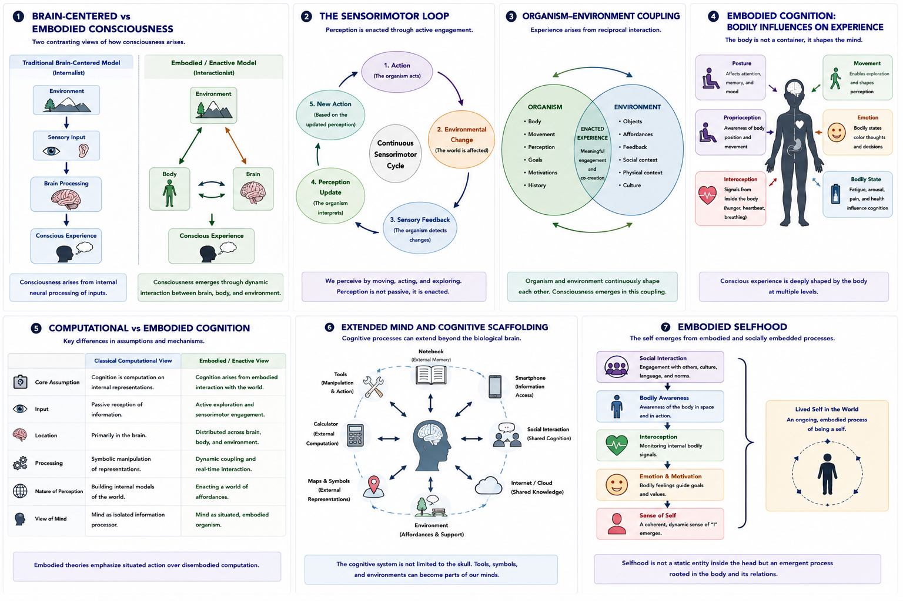

# Embodied and Enactive Consciousness {#embodied-enactive}

## Chapter Overview

Embodied and enactive theories argue that consciousness does not arise from the brain alone but from dynamic interaction between brain, body, and environment [@varela1991; @thompson2007; @clark2016].

Unlike traditional brain-centered models that treat cognition as internal information processing, embodied and enactive approaches emphasize:

- bodily engagement;
- sensorimotor activity;
- environmental interaction;
- lived experience;
- and active participation in the world.

According to these approaches:

> Consciousness is not merely something happening inside the head.  
> Conscious experience emerges through ongoing organism-environment interaction.

Embodied and enactive theories therefore challenge the idea that consciousness can be fully understood by studying neural activity in isolation.

This chapter examines the historical development, conceptual foundations, phenomenological assumptions, sensorimotor mechanisms, empirical relevance, strengths, criticisms, and unresolved questions associated with embodied and enactive approaches to consciousness.

## Learning Objectives

After reading this chapter, the reader should be able to:

- Define the central claims of embodied and enactive consciousness
- Distinguish embodied cognition from enactivism
- Explain the role of sensorimotor engagement in perception
- Describe organism-environment coupling
- Explain the role of bodily awareness and interoception
- Analyze implications for artificial intelligence and selfhood
- Compare embodied approaches with computational theories
- Evaluate the strengths and criticisms of embodied consciousness theories

## Core Idea in One Picture

Figure \@ref(fig:fig-embodied) summarizes the major conceptual structure of embodied and enactive consciousness.

```{r fig-embodied, echo=FALSE, fig.cap="Embodied and enactive consciousness. Panel 1 contrasts brain-centered and embodied models of consciousness. Panel 2 illustrates the sensorimotor loop. Panel 3 shows organism-environment coupling. Panel 4 explores bodily influences on experience. Panel 5 compares computational and embodied cognition. Panel 6 presents extended mind and cognitive scaffolding. Panel 7 illustrates embodied selfhood.", out.width="100%", fig.align="center"}

```

As shown in Figure \@ref(fig:fig-embodied), embodied and enactive theories propose that consciousness emerges through active engagement between organisms and their environments rather than through isolated internal computation alone.

## Historical Development

Embodied and enactive approaches emerged partly in response to dissatisfaction with:

- Cartesian mind-body separation;
- purely computational models of cognition;
- symbolic AI approaches;
- and passive input-processing theories of perception.

Traditional cognitive science often treated the mind as:

```text
input → internal processing → output
```

Embodied theories argued that this framework neglects:

- bodily structure;
- movement;
- environmental interaction;
- emotion;
- and lived experience.

Modern embodied and enactive theories were strongly influenced by:

- phenomenology;
- ecological psychology;
- dynamical systems theory;
- neuroscience;
- and cognitive science.

Important contributors include:

- Maurice Merleau-Ponty;
- Francisco Varela;
- Evan Thompson;
- Eleanor Rosch;
- Alva Noë;
- and others associated with enactivism and embodied cognition.

## Embodied vs Enactive Approaches

Although often grouped together, embodied and enactive theories are not identical.

### Embodied Approaches

Embodied theories emphasize:

- bodily structure;
- physiology;
- movement;
- posture;
- interoception;
- and bodily constraints.

According to embodied cognition:

> The body fundamentally shapes conscious experience.

### Enactive Approaches

Enactive theories go further.

They propose that consciousness emerges through:

- active engagement;
- sensorimotor interaction;
- environmental exploration;
- and reciprocal organism-world coupling.

According to enactivism:

> Perception is not passively received.  
> Perception is enacted through interaction.

Figure \@ref(fig:fig-embodied) Panel 1 illustrates this contrast between traditional brain-centered models and embodied-enactive frameworks.

## Phenomenology and the Lived Body

Embodied theories were strongly influenced by phenomenology.

Phenomenological traditions emphasize:

- first-person experience;
- lived embodiment;
- bodily intentionality;
- and situated perception.

Maurice Merleau-Ponty argued that:

> We do not merely have bodies — we experience the world through them.

According to phenomenology:

- consciousness is always embodied;
- perception is situated;
- and selfhood emerges through lived bodily experience.

This perspective rejects the idea of a detached observing mind separated from bodily existence.

## Sensorimotor Engagement

A foundational claim of enactive consciousness theories is that perception depends on sensorimotor engagement.

Figure \@ref(fig:fig-embodied) Panel 2 illustrates the sensorimotor loop.

As shown in Panel 2:

1. action changes the environment;
2. environmental changes generate sensory feedback;
3. sensory feedback updates perception;
4. new actions follow.

According to this framework:

```text
perception ↔ action
```

rather than:

```text
passive sensory input → internal representation
```

Enactive theorists therefore argue that conscious perception depends fundamentally on:

- movement;
- exploration;
- bodily interaction;
- and active environmental engagement.

## Organism–Environment Coupling

Embodied and enactive theories emphasize reciprocal interaction between organism and environment.

Figure \@ref(fig:fig-embodied) Panel 3 illustrates this coupling.

According to this framework:

- organisms shape environments;
- environments shape organisms;
- experience emerges through continuous interaction.

Consciousness is therefore treated as:

- relational;
- dynamic;
- situated;
- and action-dependent.

This perspective differs sharply from theories treating consciousness as purely internal neural representation.

## Bodily Influences on Conscious Experience

Embodied theories emphasize that bodily states shape conscious experience at multiple levels.

Figure \@ref(fig:fig-embodied) Panel 4 illustrates these bodily influences.

Examples include:

- posture influencing emotion;
- interoception shaping self-awareness;
- bodily tension affecting mood;
- facial expression altering emotional perception;
- movement shaping spatial cognition.

Embodied approaches therefore argue that:

> Conscious experience is deeply constrained and structured by bodily organization.

This includes:

- proprioception;
- interoception;
- autonomic regulation;
- and emotional physiology.

## Interoception and Selfhood

Modern embodied theories increasingly emphasize **interoception**.

Interoception refers to awareness of internal bodily states such as:

- heartbeat;
- breathing;
- hunger;
- pain;
- fatigue;
- and visceral sensation.

Some researchers argue that:

- bodily self-awareness;
- emotional feeling;
- and sense of self

depend heavily on interoceptive processes.

Figure \@ref(fig:fig-embodied) Panel 7 illustrates embodied selfhood.

According to embodied approaches:

> The self may emerge through ongoing bodily regulation and interaction rather than through abstract internal representation alone.

## Anti-Representationism

Many enactive theorists criticize strong representational models of cognition.

Traditional cognitive science often assumes:

- the brain builds internal models of the world;
- cognition operates primarily through symbolic representations.

Some enactive approaches instead argue that:

- cognition is action-oriented;
- understanding emerges through engagement;
- perception depends on practical interaction rather than detached representation.

This perspective is sometimes called:

- anti-representationalism;
or:
- non-representational cognition.

However, not all embodied theorists reject representation entirely.

## Computational vs Embodied Cognition

Figure \@ref(fig:fig-embodied) Panel 5 compares classical computational models with embodied cognition.

Traditional computational theories emphasize:

- symbolic processing;
- internal representations;
- passive information input;
- and isolated neural computation.

Embodied theories instead emphasize:

- situated interaction;
- bodily engagement;
- sensorimotor coupling;
- environmental embedding;
- and dynamic feedback.

This distinction became especially important in debates concerning:

- robotics;
- AI;
- cognitive science;
- and artificial consciousness.

## Extended Mind and Cognitive Scaffolding

Some embodied approaches connect with the **extended mind** hypothesis.

Figure \@ref(fig:fig-embodied) Panel 6 illustrates this idea.

According to extended mind theories:

- cognition may extend beyond the biological brain into:
  - tools;
  - technologies;
  - environments;
  - symbols;
  - and social systems.

Examples include:

- notebooks;
- smartphones;
- maps;
- language;
- collaborative cognition;
- internet-based memory systems.

This perspective proposes that conscious cognition may depend partly on external cognitive scaffolding.

## Emotion and Embodied Consciousness

Embodied approaches strongly emphasize emotion.

According to these theories:

- emotions are not merely internal thoughts;
- emotions involve bodily regulation and action readiness.

Conscious feeling may therefore depend partly on:

- autonomic processes;
- hormonal regulation;
- bodily feedback;
- and interoceptive signaling.

This connects embodied theories to modern affective neuroscience.

## Social Embodiment

Some enactive approaches emphasize social interaction.

According to these theories:

- consciousness develops partly through interaction with others;
- social engagement shapes selfhood;
- communication and culture influence conscious experience.

This perspective is sometimes called:

- participatory sense-making;
or:
- socially enacted cognition.

Consciousness therefore becomes:

- relational;
- interactive;
- and socially embedded.

## Embodied Consciousness and Artificial Intelligence

Embodied theories have important implications for AI consciousness.

If consciousness depends fundamentally on:

- bodily interaction;
- sensorimotor engagement;
- environmental embedding;
- and lived embodiment,

then purely disembodied computational systems may lack essential ingredients for genuine consciousness.

Figure \@ref(fig:fig-embodied) Panel 5 illustrates this distinction.

According to embodied approaches:

```text
intelligence alone ≠ consciousness
```

Some theorists therefore argue that genuine artificial consciousness may require:

- robotic embodiment;
- active environmental engagement;
- sensorimotor learning;
- and adaptive bodily interaction.

## Dreaming and Altered States

Embodied theories face important questions concerning dreams and altered states.

If consciousness depends heavily on environmental interaction:

- how should dream consciousness be explained?
- how does internally generated experience occur during sensory isolation?

Some theorists argue that:

- dreams rely on internalized sensorimotor models;
- bodily organization remains important even during sleep.

However, this remains an ongoing area of debate.

## Relation to Predictive Processing

Some modern predictive-processing theories integrate embodiment through **active inference**.

According to active inference models:

- organisms minimize prediction error through action;
- bodily movement helps shape perception;
- cognition depends on active environmental engagement.

This creates important overlaps between:

- predictive processing;
- Bayesian approaches;
- and embodied cognition.

## Strengths of Embodied and Enactive Theories

Major strengths include:

- integration of body and environment;
- strong phenomenological grounding;
- emphasis on lived experience;
- explanation of situated cognition;
- compatibility with robotics and ecological psychology;
- strong treatment of sensorimotor interaction;
- integration of emotion and interoception.

Embodied approaches also provide powerful critiques of overly abstract computational models.

## Weaknesses and Criticisms

Despite their strengths, embodied and enactive theories face major criticisms.

### Lack of Precise Mechanism

Some embodied theories remain conceptually broad and difficult to operationalize experimentally.

### Representation May Still Matter

Critics argue that internal neural representations may still play essential roles in cognition.

### Hard Problem Remains

Embodied interaction may explain:

- cognition;
- behaviour;
- and environmental engagement,

without fully explaining:

- subjective feeling itself.

### Dreaming Problem

If consciousness requires active environmental interaction:

> How should dreams and internally generated experiences be explained?

### Minimal Consciousness

Critics ask whether:

- isolated brains;
- paralyzed individuals;
- or minimally embodied systems

could still possess consciousness.

## Relation to the Hard Problem

Embodied and enactive theories shift attention away from isolated internal mechanisms toward:

- lived experience;
- bodily engagement;
- and organism-environment interaction.

However, critics argue that important questions remain:

- Why should embodied interaction generate subjective experience?
- Why should sensorimotor engagement feel like anything?
- How does bodily coupling produce phenomenology?

Thus embodied approaches may enrich the study of consciousness without fully resolving the hard problem itself.

## Explanatory Scope

Embodied and enactive theories attempt to explain:

- perception;
- selfhood;
- bodily awareness;
- environmental engagement;
- emotion;
- sensorimotor cognition;
- and situated experience.

However, unresolved questions remain:

- Can embodiment fully explain consciousness?
- Is representation still necessary?
- Can disembodied systems become conscious?
- How should dream consciousness be explained?
- What neural mechanisms are essential?
- Can embodiment be measured quantitatively?

## Summary

Embodied and enactive theories propose that consciousness emerges through dynamic interaction between brain, body, and environment.

These approaches reject purely brain-centered models and emphasize:

- bodily engagement;
- sensorimotor interaction;
- organism-environment coupling;
- interoception;
- emotion;
- and lived experience.

Embodied approaches have become highly influential in:

- phenomenology;
- cognitive science;
- robotics;
- neuroscience;
- and artificial intelligence research.

At the same time, major philosophical and empirical questions remain concerning:

- neural mechanisms;
- dream consciousness;
- representation;
- and the hard problem of consciousness.