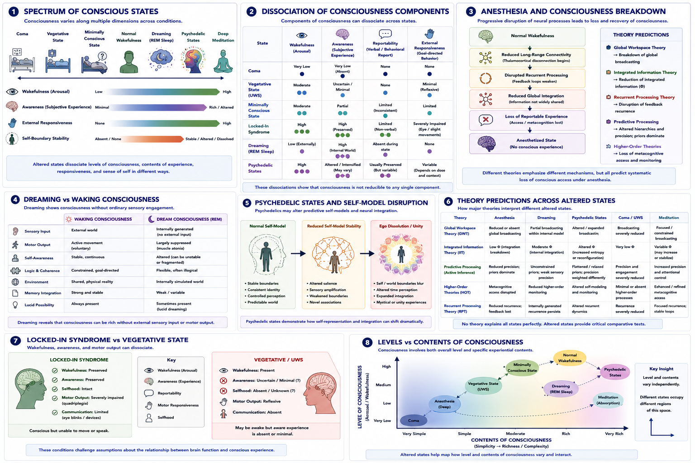

# Anesthesia, Disorders of Consciousness, and Altered States {#altered-states}

## Chapter Overview

Theories of consciousness must account not only for ordinary waking experience but also for transitions, disruptions, and altered forms of consciousness. These include:

- sleep;
- dreaming;
- anesthesia;
- coma;
- vegetative state;
- minimally conscious state;
- locked-in syndrome;
- seizures;
- meditation;
- psychedelic states;
- and pathological dissociation.

Altered states are among the most important empirical tests for consciousness theories because they reveal how different components of consciousness can separate under changing neural and cognitive conditions.

Consciousness is not a single all-or-nothing phenomenon. Different states may preserve some aspects of consciousness while disrupting others. Wakefulness, awareness, reportability, memory, selfhood, responsiveness, and sensory integration can dissociate in complex ways.

This chapter examines altered and impaired states of consciousness as comparative windows into the structure of conscious experience. Particular attention is given to anesthesia, disorders of consciousness, dreaming, psychedelic states, meditation, dissociation, and comparative predictions from major consciousness theories.

## Learning Objectives

After reading this chapter, the reader should be able to:

- Explain why altered states are important for consciousness research
- Distinguish levels of consciousness from contents of consciousness
- Describe major disorders of consciousness
- Explain how anesthesia alters conscious processing
- Compare dreaming and waking consciousness
- Describe psychedelic and meditative alterations of selfhood and perception
- Analyze how different theories interpret altered states
- Evaluate methodological and ethical challenges in altered-state research

## Core Idea in One Picture

Figure \@ref(fig:fig-altered) summarizes the major conceptual structure of altered and impaired states of consciousness.

```{r fig-altered, echo=FALSE, fig.cap="Anesthesia, disorders of consciousness, and altered states. Panel 1 illustrates the spectrum of conscious states. Panel 2 shows dissociation of consciousness components across conditions. Panel 3 explains anesthesia-related breakdown of consciousness. Panel 4 compares dreaming and waking consciousness. Panel 5 illustrates psychedelic disruption of self-modeling. Panel 6 compares theoretical predictions across altered states. Panel 7 contrasts locked-in syndrome with vegetative state. Panel 8 distinguishes levels and contents of consciousness.", out.width="100%", fig.align="center"}

```

As shown in Figure \@ref(fig:fig-altered), altered states reveal that consciousness is multidimensional rather than unitary. Different states affect wakefulness, awareness, selfhood, sensory processing, and reportability in distinct ways.

## Why Altered States Matter

Altered states are theoretically important because they separate processes that normally occur together in ordinary waking consciousness.

Figure \@ref(fig:fig-altered) Panel 2 illustrates this dissociation.

Examples include:

- a patient who is awake but minimally aware;
- a dreamer who is conscious but disconnected from the external world;
- an anesthetized patient with residual sensory processing but absent reportable experience;
- or a locked-in patient who is fully conscious but unable to move.

These dissociations help researchers identify which neural and cognitive processes are most closely associated with conscious experience itself.

Altered states therefore function as:

> natural and clinical experiments on consciousness.

## Levels and Contents of Consciousness

Researchers often distinguish between:

- **levels of consciousness**;
and:
- **contents of consciousness**.

Figure \@ref(fig:fig-altered) Panel 8 illustrates this distinction.

### Levels of Consciousness

Level refers to overall arousal or wakefulness.

Examples:

- coma → very low level;
- anesthesia → reduced level;
- normal wakefulness → high level.

### Contents of Consciousness

Contents refer to the richness and complexity of experience itself.

Examples include:

- perceptions;
- thoughts;
- emotions;
- dreams;
- bodily sensations;
- self-awareness.

A person may therefore show:

- high wakefulness with altered contents;
or:
- reduced wakefulness with preserved internal experience.

This distinction is central in clinical neuroscience.

## Spectrum of Conscious States

Figure \@ref(fig:fig-altered) Panel 1 presents a spectrum of conscious states.

The spectrum includes:

```text
coma → vegetative state → minimally conscious state → wakefulness → dreaming → psychedelic states → deep meditation
```

Different states vary across dimensions such as:

- wakefulness;
- awareness;
- external responsiveness;
- self-boundary stability;
- and sensory integration.

This demonstrates that consciousness is not binary but multidimensional.

## Anesthesia

Anesthesia provides one of the most powerful experimental tools for studying consciousness because it allows controlled suppression and recovery of conscious awareness.

Figure \@ref(fig:fig-altered) Panel 3 illustrates progressive disruption of consciousness under anesthesia.

As anesthetic depth increases:

- long-range connectivity decreases;
- recurrent processing weakens;
- global integration declines;
- reportable awareness disappears.

Importantly:

> unconsciousness under anesthesia is not merely “sleep.”

Anesthesia actively alters neural communication and integration.

### Theory Predictions

Different theories interpret anesthesia differently.

#### Global Workspace Theory

Global Workspace Theory predicts:

- breakdown of large-scale broadcasting;
- reduced global information sharing.

#### Integrated Information Theory

Integrated Information Theory predicts:

- reduction in integrated causal structure;
- lower informational integration.

#### Recurrent Processing Theory

Recurrent Processing Theory predicts:

- disruption of feedback and recurrent signaling.

#### Predictive Processing

Predictive Processing emphasizes:

- altered hierarchical inference;
- disrupted precision weighting;
- reduced predictive integration.

#### Higher-Order Theories

Higher-Order theories emphasize:

- disruption of metacognitive access and self-monitoring.

Figure \@ref(fig:fig-altered) Panel 6 compares these predictions across altered states.

## Disorders of Consciousness

Disorders of consciousness are among the most challenging conditions in neuroscience and medicine.

These disorders reveal that:

- wakefulness;
- awareness;
- communication;
- and responsiveness

can dissociate dramatically.

### Coma

Coma involves:

- absent wakefulness;
- absent responsiveness;
- and no clear evidence of awareness.

### Vegetative State / Unresponsive Wakefulness Syndrome

Patients may show:

- sleep-wake cycles;
- eye opening;
- reflexive behaviour;

while lacking clear evidence of conscious awareness.

### Minimally Conscious State

Patients show:

- inconsistent but reproducible signs of awareness;
- limited purposeful behaviour;
- intermittent responsiveness.

### Locked-In Syndrome

Figure \@ref(fig:fig-altered) Panel 7 contrasts locked-in syndrome with vegetative state.

Locked-in patients may be:

- fully conscious;
- aware;
- cognitively intact;

while being almost completely unable to move or communicate.

This demonstrates that:

> absence of behavioural report does not necessarily imply absence of consciousness.

## Covert Consciousness

Modern neuroimaging has revealed evidence for possible **covert consciousness** in some unresponsive patients.

In certain cases:

- patients unable to communicate behaviourally
may nevertheless:
- respond to commands through brain activity patterns.

Examples include:

- imagined motor tasks during fMRI;
- EEG command-following paradigms.

These findings have profound implications for:

- diagnosis;
- ethics;
- patient care;
- and theories of consciousness.

## Dreaming

Dreaming demonstrates that consciousness can occur without ordinary sensory engagement with the external world.

Figure \@ref(fig:fig-altered) Panel 4 compares dreaming and waking consciousness.

Dreaming typically involves:

- internally generated environments;
- altered self-awareness;
- weakened logical constraints;
- emotional amplification;
- and reduced external responsiveness.

This challenges theories that strongly identify consciousness with:

- behavioural report;
- external interaction;
- or direct sensory input.

### Lucid Dreaming

Lucid dreaming occurs when a dreamer becomes aware that they are dreaming.

Lucid dreams may involve:

- reflective awareness;
- partial metacognition;
- voluntary control within dream states.

This demonstrates that higher-order awareness can emerge even within internally generated consciousness.

## Psychedelic States

Psychedelic states produce major alterations in:

- perception;
- selfhood;
- emotional salience;
- sensory integration;
- and temporal experience.

Figure \@ref(fig:fig-altered) Panel 5 illustrates psychedelic disruption of self-modeling.

Common effects include:

- ego dissolution;
- weakened self-boundaries;
- intensified sensory processing;
- altered meaning attribution;
- expanded associative thinking.

Some predictive-processing theories interpret psychedelics as involving:

- weakened top-down priors;
- altered hierarchical precision weighting;
- and increased neural entropy.

Psychedelic states have become increasingly important in modern consciousness research because they experimentally alter core dimensions of subjective experience.

## Meditation and Contemplative States

Meditative states may alter:

- attention;
- self-awareness;
- emotional regulation;
- bodily awareness;
- and sense of self.

Some contemplative traditions report experiences involving:

- reduced self-boundaries;
- nondual awareness;
- altered temporal perception;
- and enhanced meta-awareness.

Meditation therefore provides another important comparative window into consciousness.

## Seizures and Dissociative States

Certain seizure disorders may produce dramatic alterations in:

- perception;
- emotional salience;
- bodily ownership;
- memory;
- and temporal awareness.

Temporal lobe seizures in particular may involve:

- depersonalization;
- déjà vu;
- intense emotions;
- mystical experiences;
- or distortions of reality.

Dissociative states may similarly disrupt:

- selfhood;
- memory integration;
- bodily ownership;
- and agency.

These conditions further demonstrate the multidimensional structure of conscious experience.

## Comparative Evaluation Across Theories

Figure \@ref(fig:fig-altered) Panel 6 compares predictions from major theories across altered states.

Altered states are especially valuable because they test whether theories can explain:

- both the presence and absence of consciousness;
- partial awareness;
- internally generated experience;
- and altered self-models.

No theory is complete unless it can account for:

- anesthesia;
- dreaming;
- disorders of consciousness;
- psychedelic states;
- meditation;
- and dissociation.

Altered states are therefore not peripheral examples.

They are:

> central empirical tests for theories of consciousness.

## Ethical Implications

Disorders of consciousness raise major ethical questions concerning:

- personhood;
- suffering;
- autonomy;
- informed consent;
- end-of-life decisions;
- and communication with non-responsive patients.

The possibility of covert consciousness makes these questions especially important.

Anesthesia awareness also raises significant ethical concerns in medicine because patients may retain some experience despite apparent unconsciousness.

## Relation to the Hard Problem

Altered states reveal how consciousness changes across different neural and cognitive conditions.

However, critics argue that such findings may still leave unresolved:

> why subjective experience exists at all.

For example:

- anesthesia may explain loss of conscious access;
- dreaming may explain internally generated worlds;
- psychedelics may alter self-models;

without fully explaining:

- why any of these processes feel like anything subjectively.

Thus altered-state research may map the structure and dynamics of consciousness without fully resolving the hard problem itself.

## Strengths of Altered-State Research

Major strengths include:

- strong empirical grounding;
- clinical relevance;
- comparative explanatory power;
- ability to dissociate cognitive components;
- integration with neuroscience;
- relevance for theory testing.

Altered states provide some of the strongest real-world tests available for consciousness theories.

## Limitations and Challenges

Despite their value, altered-state studies face important limitations.

### Reliance on Report

Many states involve impaired communication or memory.

### Measurement Difficulties

Consciousness cannot be directly observed externally.

### Diagnostic Uncertainty

Disorders of consciousness can be difficult to classify accurately.

### Subjective Variability

Experiences may differ greatly across individuals.

### Ethical Constraints

Experimental manipulation of consciousness has practical and ethical limitations.

## Summary

Altered and impaired states of consciousness provide some of the most important empirical tests for consciousness theories.

These states reveal that consciousness is multidimensional and that:

- wakefulness;
- awareness;
- reportability;
- selfhood;
- sensory integration;
- and responsiveness

can dissociate in complex ways.

Research involving:

- anesthesia;
- disorders of consciousness;
- dreaming;
- psychedelics;
- meditation;
- and dissociation

helps illuminate the structure, mechanisms, and limits of conscious experience.

At the same time, altered-state research continues to raise profound scientific, philosophical, and ethical questions concerning:

- the nature of awareness;
- the neural basis of consciousness;
- subjective experience;
- and the boundaries of conscious life.