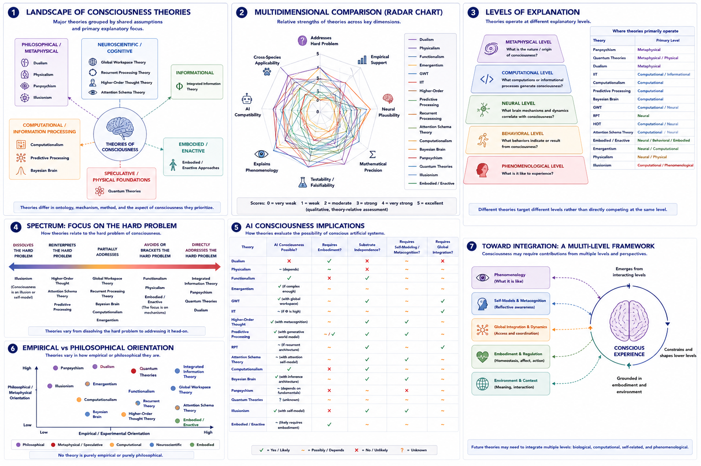

# Comparative Matrix of Theories {#comparative-matrix}

## Chapter Overview

Consciousness research contains a remarkably diverse set of theories attempting to explain:

- subjective experience;
- awareness;
- cognition;
- selfhood;
- neural integration;
- perception;
- embodiment;
- and the relationship between mind and matter.

Importantly, these theories do not always compete directly with one another. Many theories target different aspects or levels of consciousness rather than attempting to explain the exact same phenomenon.

Some theories primarily address:

- the neural mechanisms of conscious access;
while others focus on:
- phenomenology;
- self-modeling;
- embodiment;
- information integration;
- or the metaphysical origin of experience itself.

This chapter compares the major theories of consciousness across shared dimensions and explanatory criteria. The goal is not to rank theories simplistically, but to identify:

- what each theory explains well;
- where each faces unresolved challenges;
- how theories overlap or diverge;
- and where future integration may become possible.

## Learning Objectives

After reading this chapter, the reader should be able to:

- Compare major theories of consciousness across multiple dimensions
- Distinguish empirical from metaphysical approaches
- Explain how theories differ in explanatory targets
- Analyze how theories approach the hard problem
- Compare implications for AI and altered states
- Identify strengths and limitations of major frameworks
- Understand why no current consensus exists
- Evaluate possibilities for theoretical integration

## Core Idea in One Picture

Figure \@ref(fig:fig-comparison) summarizes the multidimensional landscape of major consciousness theories.

```{r fig-comparison, echo=FALSE, fig.cap="Comparative landscape of consciousness theories. Panel 1 groups theories by major explanatory orientation. Panel 2 compares theories across multiple dimensions using radar-style analysis. Panel 3 illustrates levels of explanation targeted by different theories. Panel 4 compares approaches to the hard problem. Panel 5 summarizes implications for AI consciousness. Panel 6 contrasts empirical and philosophical orientations. Panel 7 illustrates possible future integration across levels of explanation.", out.width="100%", fig.align="center"}

```

As shown in Figure \@ref(fig:fig-comparison), consciousness theories differ not only in their conclusions, but also in:

- explanatory targets;
- philosophical assumptions;
- levels of analysis;
- empirical methods;
- and definitions of consciousness itself.

## Why Theories Differ

One of the most important insights in consciousness research is that disagreements between theories often arise because they attempt to explain different aspects of consciousness.

For example:

- Global Workspace Theory focuses primarily on conscious access and reportability;
- Integrated Information Theory focuses on phenomenological integration;
- Higher-Order theories emphasize introspective awareness;
- Predictive Processing emphasizes hierarchical inference;
- Panpsychism addresses the metaphysical origin of experience;
- Illusionism questions whether phenomenal consciousness exists in the traditional sense.

Figure \@ref(fig:fig-comparison) Panel 1 illustrates these broad theoretical groupings.

Thus many theories differ not simply because they disagree, but because they prioritize different explananda.

## Major Families of Theories

### Philosophical and Metaphysical Theories

Figure \@ref(fig:fig-comparison) Panel 1 groups several theories within philosophical and metaphysical approaches.

These include:

- dualism;
- physicalism;
- panpsychism;
- and illusionism.

These theories primarily address:

- the nature of mind;
- the relationship between consciousness and matter;
- and the metaphysical foundations of experience.

They often engage directly with the hard problem of consciousness.

### Computational and Information-Processing Theories

Computational approaches include:

- computationalism;
- predictive processing;
- Bayesian brain theories.

These theories emphasize:

- information processing;
- inference;
- prediction;
- computation;
- and cognitive architecture.

They are often strongly connected to AI research.

### Neuroscientific Theories

Neuroscientific approaches include:

- Global Workspace Theory (GWT);
- Recurrent Processing Theory (RPT);
- Higher-Order Thought (HOT);
- Attention Schema Theory (AST).

These theories attempt to identify:

- neural mechanisms;
- large-scale dynamics;
- attentional coordination;
- and cognitive accessibility.

### Informational Theories

Integrated Information Theory (IIT) occupies a somewhat unique position because it combines:

- formal mathematical structure;
- phenomenological assumptions;
- and informational integration.

### Embodied and Enactive Theories

Embodied and enactive approaches emphasize:

- bodily interaction;
- organism-environment coupling;
- sensorimotor engagement;
- and lived experience.

These theories challenge purely brain-centered accounts of consciousness.

### Speculative Physical Theories

Quantum theories explore possible relationships between consciousness and:

- quantum coherence;
- microphysical processes;
- or fundamental physics.

These approaches remain controversial and empirically uncertain.

## Different Levels of Explanation

Figure \@ref(fig:fig-comparison) Panel 3 illustrates that theories often operate at different explanatory levels.

These levels include:

### Metaphysical Level

Questions such as:

- What is consciousness fundamentally?
- Is consciousness reducible?
- Is consciousness fundamental to reality?

are addressed by:

- dualism;
- panpsychism;
- physicalism;
- and quantum theories.

### Computational Level

Questions concerning:

- computation;
- representation;
- inference;
- and information processing

are emphasized by:

- predictive processing;
- Bayesian brain theories;
- computationalism.

### Neural Level

Questions concerning:

- neural mechanisms;
- connectivity;
- recurrence;
- and broadcasting

are emphasized by:

- GWT;
- RPT;
- HOT;
- AST.

### Phenomenological Level

Questions concerning:

- lived experience;
- subjective feeling;
- and selfhood

are emphasized by:

- IIT;
- embodied approaches;
- phenomenology;
- panpsychism.

This helps explain why theories may sometimes complement rather than directly contradict one another.

## Comparative Matrix

The following table compares major theories across shared criteria.

```{r comparative-table, echo=FALSE, message=FALSE, warning=FALSE}
library(knitr)

comparison <- data.frame(
  Theory = c(
    "Dualism",
    "Physicalism",
    "Functionalism",
    "Emergentism",
    "Global Workspace Theory",
    "Integrated Information Theory",
    "Higher-Order Thought",
    "Predictive Processing",
    "Recurrent Processing",
    "Attention Schema Theory",
    "Computationalism",
    "Bayesian Brain",
    "Panpsychism",
    "Quantum Theories",
    "Illusionism",
    "Embodied/Enactive"
  ),
  Main_Target = c(
    "Mind-body distinction",
    "Physical basis",
    "Functional organization",
    "Complexity-based emergence",
    "Conscious access",
    "Integrated experience",
    "Metacognitive awareness",
    "Perceptual inference",
    "Feedback-based perception",
    "Model of attention",
    "Computational mind",
    "Probabilistic inference",
    "Fundamental consciousness",
    "Physical foundations",
    "Illusion of qualia",
    "Embodied experience"
  ),
  Strength = c(
    "Takes subjectivity seriously",
    "Scientifically parsimonious",
    "Substrate flexibility",
    "Captures complexity",
    "Strong cognitive-neuroscience fit",
    "Formal and phenomenology-oriented",
    "Explains introspective awareness",
    "Broad unifying framework",
    "Neurally plausible for perception",
    "Mechanistic self-model account",
    "Connects mind and AI",
    "Handles uncertainty",
    "Addresses hard problem directly",
    "Explores physical limits",
    "Dissolves hard problem",
    "Connects mind, body, world"
  ),
  Major_Gap = c(
    "Interaction problem",
    "Explanatory gap",
    "Qualia problem",
    "Vague emergence mechanism",
    "Phenomenology may be underexplained",
    "Measurement and implications",
    "Animal and infant consciousness",
    "Experience not fully explained",
    "Limited beyond perception",
    "May explain belief, not experience",
    "Simulation vs experience",
    "Phenomenology not central",
    "Combination problem",
    "Limited evidence",
    "May deny what it explains",
    "Neural specificity"
  ),
  AI_Implication = c(
    "Usually skeptical",
    "Depends on physical substrate",
    "Potentially possible",
    "Possible if complexity sufficient",
    "Possible with workspace architecture",
    "Depends on causal integration",
    "Requires metacognition",
    "Requires generative world model",
    "Requires recurrent architecture",
    "Requires attention schema",
    "Potentially possible",
    "Possible with inference architecture",
    "Depends on fundamental properties",
    "Unknown",
    "May focus on self-representation",
    "Requires embodiment"
  )
)

kable(comparison, caption = "Comparative matrix of major consciousness theories.")
```

## Comparative Criteria

Figure \@ref(fig:fig-comparison) Panel 2 compares theories across multiple dimensions.

The primary comparative criteria used throughout this book include:

- explanatory target;
- empirical support;
- testability;
- neural plausibility;
- mathematical precision;
- account of subjective experience;
- treatment of selfhood;
- ability to address the hard problem;
- applicability to non-human animals;
- applicability to artificial systems;
- treatment of altered states;
- philosophical cost.

Importantly:

> no theory scores maximally across all dimensions simultaneously.

## Theories and the Hard Problem

One of the largest differences between theories concerns how they approach the hard problem of consciousness.

Figure \@ref(fig:fig-comparison) Panel 4 illustrates this spectrum.

### Directly Addressing the Hard Problem

Theories such as:

- panpsychism;
- IIT;
- dualism;

attempt to directly explain why subjective experience exists.

### Reinterpreting the Hard Problem

Theories such as:

- predictive processing;
- HOT;
- AST;

often reinterpret consciousness in terms of:

- cognition;
- self-modeling;
- or information access.

### Dissolving the Hard Problem

Illusionism attempts to dissolve the hard problem by arguing that phenomenal consciousness may itself be an introspective illusion.

### Focusing on Mechanisms

Theories such as:

- GWT;
- RPT;
- computationalism;

primarily focus on functional or neural mechanisms rather than metaphysical explanation.

## Empirical vs Philosophical Orientation

Figure \@ref(fig:fig-comparison) Panel 6 compares theories according to empirical versus philosophical orientation.

Some theories emphasize:

- experimental neuroscience;
- cognitive architecture;
- computational modeling;
- and measurable neural dynamics.

Others focus more strongly on:

- metaphysical interpretation;
- phenomenology;
- and philosophical analysis.

Importantly:

> no theory is purely empirical or purely philosophical.

Most theories contain both:

- scientific assumptions;
and:
- philosophical commitments.

## AI Consciousness Implications

Figure \@ref(fig:fig-comparison) Panel 5 compares implications for AI consciousness.

Some theories are relatively permissive concerning conscious AI.

These include:

- functionalism;
- computationalism;
- predictive processing;
- GWT.

Other theories are more cautious or restrictive.

These include:

- biological naturalism;
- embodied approaches;
- some interpretations of IIT;
- and certain quantum theories.

This reflects deeper disagreements concerning whether consciousness depends primarily on:

- computation;
- embodiment;
- biological substrate;
- causal integration;
- or self-modeling.

## Altered States and Disorders of Consciousness

Theories also differ in how effectively they explain:

- anesthesia;
- dreaming;
- psychedelic states;
- meditation;
- and disorders of consciousness.

For example:

- GWT predicts breakdown of global broadcasting under anesthesia;
- IIT predicts reduced informational integration;
- predictive processing emphasizes altered priors and precision weighting;
- HOT emphasizes disruption of metacognitive access.

Altered states therefore provide important empirical tests for consciousness theories.

## Philosophical Costs and Tradeoffs

Every theory faces tradeoffs.

### Dualism

- preserves subjective experience strongly;
- but faces the interaction problem.

### Physicalism

- aligns closely with science;
- but faces the explanatory gap.

### IIT

- provides formal structure;
- but faces controversial implications and measurement challenges.

### Panpsychism

- addresses the hard problem directly;
- but faces the combination problem.

### Illusionism

- avoids metaphysical complexity;
- but may appear to deny the reality it attempts to explain.

### Embodied Theories

- integrate body and environment effectively;
- but sometimes lack neural specificity.

These tradeoffs illustrate why consensus remains difficult.

## Toward Integration

Figure \@ref(fig:fig-comparison) Panel 7 illustrates a possible multi-level integrative framework.

Future progress may require integrating:

- neuroscience;
- computation;
- embodiment;
- phenomenology;
- self-modeling;
- information integration;
- and philosophical analysis.

Some theories may ultimately prove complementary rather than mutually exclusive.

For example:

- GWT may explain conscious access;
- IIT may address integration;
- predictive processing may explain inference;
- embodied theories may explain situated experience;
- and phenomenology may clarify lived structure.

A mature science of consciousness may therefore require:

> theoretical pluralism and cross-level integration.

## Main Comparative Conclusion

No existing theory currently explains all dimensions of consciousness simultaneously.

Some theories are:

- empirically productive but philosophically incomplete;
while others:
- address metaphysical questions directly but remain difficult to test experimentally.

Consciousness may ultimately require explanation across multiple interacting dimensions including:

- neural dynamics;
- computation;
- embodiment;
- phenomenology;
- selfhood;
- information integration;
- and physical foundations.

The diversity of theories therefore reflects not only disagreement, but also the extraordinary complexity of consciousness itself.