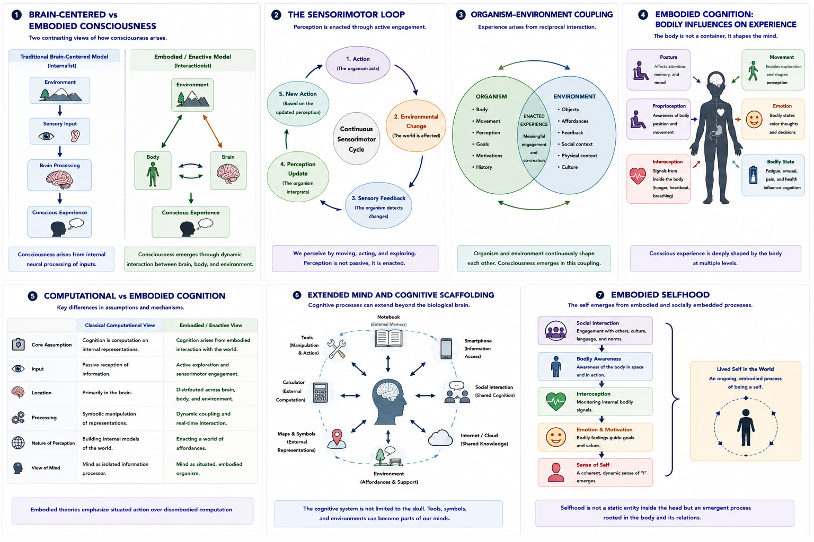

# Which Problems Are Actually Solved? {#problems-solved}

## Chapter Overview

Consciousness research has made substantial progress over the past several decades. Researchers now possess far more sophisticated tools for studying neural activity, conscious report, attention, perception, altered states, anesthesia, self-monitoring, and disorders of consciousness. The field has also developed more precise philosophical distinctions, including the difference between access consciousness and phenomenal consciousness, the distinction between levels and contents of consciousness, and the contrast between easy and hard problems [@block1995; @chalmers1995; @chalmers1996].

At the same time, many foundational questions remain unresolved. Researchers have identified neural correlates of consciousness, but correlation is not the same as explanation. Theories can explain reportability, attention, information access, prediction, recurrent processing, or integration, but it remains debated whether any of them fully explains subjective experience itself.

This chapter asks a modest but important question: which problems of consciousness have actually been solved, which have been partially clarified, and which remain open?

The answer depends on what is meant by “solved.” Some problems have been substantially clarified at the empirical level. For example, researchers know much more about anesthesia, disorders of consciousness, masking, attention, global access, and covert awareness than they did several decades ago [@laureys2005; @owen2006; @monti2010; @dehaene2014]. Other problems have been partially explained, including selfhood, bodily ownership, dreaming, metacognition, and altered states. Still other problems remain deeply unresolved, especially the hard problem, the explanatory gap, the nature of qualia, and the metaphysical status of consciousness [@nagel1974; @levine1983; @chalmers1995].

Importantly, theories should not be judged only by whether they solve every aspect of consciousness at once. Different theories target different explanatory problems. Global Workspace Theory is strongest for conscious access [@baars1988; @dehaene2011]. Integrated Information Theory addresses integration and intrinsic structure [@tononi2004; @oizumi2014]. Recurrent Processing Theory explains perceptual feedback and visual awareness [@lamme2006]. Predictive Processing explains inference and uncertainty [@friston2010; @clark2013]. Higher-Order and Attention Schema theories explain metacognition and self-modeling [@rosenthal2005; @lau2011; @graziano2013]. Panpsychism and T-Consciousness address deeper consciousness-first questions, but remain difficult to integrate with mainstream empirical methods [@goff2017; @goff2019; @taheri2020; @taheri2023].

This chapter therefore evaluates progress across multiple dimensions rather than asking whether consciousness has been fully solved.

## Guiding Questions

This chapter is organized around several guiding questions:

* Which problems of consciousness have been substantially clarified?
* Which problems have been partially explained but remain incomplete?
* Which problems remain fundamentally unresolved?
* Why are some problems easier to study experimentally than others?
* How do the easy problems differ from the hard problem?
* Why do different theories appear to solve different parts of consciousness?
* Why is partial explanation still scientifically valuable?
* What remains open for future research?

## Core Idea in One Picture

Figure @ref(fig:fig-problems-solved) summarizes the current state of progress across major problems of consciousness.

```{r fig-problems-solved, echo=FALSE, fig.cap="Progress across major problems of consciousness. Panel 1 distinguishes substantially clarified, partially explained, and unresolved problems. Panel 2 compares empirical and philosophical progress. Panel 3 illustrates easy versus hard problems. Panel 4 maps theories to their primary explanatory targets. Panel 5 compares neural, computational, phenomenological, and metaphysical levels of explanation. Panel 6 illustrates why partial explanations remain scientifically valuable.", out.width="100%", fig.align="center"}

```

As Figure @ref(fig:fig-problems-solved) illustrates, consciousness research has achieved important progress in several empirical domains. However, progress is uneven. Problems involving behaviour, report, neural activity, and cognitive function are more experimentally tractable. Problems involving subjective feeling, qualitative character, and metaphysical interpretation remain much harder.

The central conclusion is therefore not that consciousness has been solved or that it remains completely mysterious. The more accurate conclusion is that consciousness has been partially mapped across several levels, while its deepest explanatory questions remain open.

## Why Consciousness Problems Differ

Not all problems of consciousness are equally difficult. Some questions involve observable behaviour, measurable neural activity, computational function, or experimentally manipulable processes. These questions can be studied through neuroimaging, electrophysiology, behavioural experiments, clinical assessment, computational modeling, and comparative neuroscience.

Other questions concern subjective feeling, first-person experience, qualitative character, and the metaphysical relation between mind and matter. These are more difficult because subjective experience cannot be directly observed from the outside. Researchers must infer it through reports, behaviour, neural markers, or theoretical interpretation.

This distinction is closely related to Chalmers’ distinction between the easy problems and the hard problem [@chalmers1995]. The easy problems are not easy in an ordinary sense. They are scientifically difficult. But they concern functions that can be studied experimentally: attention, memory, discrimination, report, integration, and behavioural control. The hard problem concerns why any of these processes are accompanied by experience at all.

This difference explains why consciousness research can make genuine empirical progress while still leaving philosophical questions unresolved.

## Problems with Significant Progress

Several areas of consciousness research have seen substantial progress. These problems are not necessarily fully solved, but they are much better understood than they were in earlier stages of the field.

### Neural Correlates of Consciousness

Research on neural correlates of consciousness has identified many brain processes associated with conscious perception. These include thalamocortical dynamics, recurrent processing, large-scale integration, frontoparietal activity, sensory stabilization, and global availability [@koch2016; @dehaene2014].

This work has not solved consciousness, because identifying correlates does not explain why consciousness exists. However, it has clarified which neural processes are reliably associated with conscious access and perceptual awareness.

The key achievement is methodological. Consciousness can now be studied experimentally rather than treated only as a philosophical mystery.

### Wakefulness, Sleep, and Unconsciousness

Researchers now understand much more about differences between wakefulness, sleep, anesthesia, coma, and disorders of consciousness. Consciousness depends not only on local neural activity, but also on large-scale coordination, integration, recurrent communication, and arousal systems [@laureys2005; @alkire2008; @massimini2005].

This progress is especially important clinically. It has improved the ability to distinguish coma, unresponsive wakefulness syndrome, minimally conscious state, locked-in syndrome, and covert consciousness.

The problem is not fully solved, because the neural boundary between consciousness and unconsciousness remains complex. But the scientific understanding of these states has advanced substantially.

### Attention and Reportability

Research has clarified the relationship between attention, working memory, reportability, and conscious access. Global Workspace Theory has been especially influential in explaining how information becomes widely available for reasoning, action, memory, and verbal report [@baars1988; @dehaene2011].

This is one of the strongest areas of empirical progress. Researchers can manipulate attention and reportability experimentally and study how these changes affect conscious access.

However, attention and reportability are not identical to consciousness itself. Some forms of attention can occur unconsciously, and some theories argue that phenomenal experience may exceed reportability. Therefore, this area is substantially clarified but not philosophically complete.

### Perceptual Masking and Visual Awareness

Experiments involving masking, binocular rivalry, and threshold perception have helped identify conditions under which sensory information becomes consciously accessible. These paradigms show that stimuli can be processed unconsciously and still influence behaviour.

Recurrent Processing Theory has contributed important insights here by proposing that feedforward processing may remain unconscious while recurrent feedback supports conscious perception [@lamme2006].

This is a major success for experimental consciousness science. It shows that conscious and unconscious processing can be compared under controlled conditions.

### Anesthesia and Consciousness Suppression

Anesthesia research has significantly improved understanding of how consciousness can be suppressed and restored. General anesthesia disrupts neural communication, recurrent dynamics, integration, and global access [@alkire2008; @sanders2012].

Different theories interpret anesthesia differently. Global Workspace Theory emphasizes breakdown of global broadcasting. Integrated Information Theory emphasizes reduced causal integration. Recurrent Processing Theory emphasizes disrupted feedback. Predictive Processing emphasizes altered hierarchical inference and precision weighting.

Although anesthesia does not solve the hard problem, it provides one of the strongest empirical tools for studying the loss and return of consciousness.

### Disorders of Consciousness and Covert Awareness

Clinical neuroscience has made major progress in diagnosing disorders of consciousness. Neuroimaging and EEG studies have shown that some behaviourally unresponsive patients may retain covert awareness [@owen2006; @monti2010].

This is one of the most important ethical and scientific advances in consciousness research. It shows that lack of behavioural response does not always imply lack of consciousness.

These findings have changed clinical practice, ethical discussion, and theoretical debates. They also reveal that consciousness cannot be defined solely by outward behaviour.

### Metacognition and Confidence

Research on metacognition has clarified how humans monitor their own perception, memory, uncertainty, and decision-making. Higher-Order theories and related empirical work have helped explain confidence estimation, error awareness, and introspective access [@rosenthal2005; @lau2011].

This area has made significant progress because metacognition can be studied experimentally through confidence reports, behavioural tasks, and neural measures.

However, metacognition is not identical to consciousness. Some conscious experiences may occur without explicit reflection, and some metacognitive judgments may be inaccurate.

### Global Information Availability

There is strong evidence that conscious access often involves widespread information availability, flexible use of information, and large-scale neural coordination [@baars1988; @dehaene2011].

This does not prove that global broadcasting is identical to consciousness. But it shows that conscious access depends on more than local sensory activation. Information becomes conscious in many cases when it becomes available for memory, action, report, and reasoning.

This is one of the clearest achievements of cognitive neuroscience.

## Problems Partially Explained

Many problems have received partial but incomplete explanations. These are areas where research has made progress, but major conceptual or empirical questions remain.

### Unity of Consciousness

Researchers have partially explained how information from different senses, brain regions, and cognitive systems becomes integrated into coherent experience. Theories such as IIT, Global Workspace Theory, Recurrent Processing Theory, and Predictive Processing all address integration in different ways [@tononi2004; @oizumi2014; @dehaene2011; @friston2010].

However, the unity of consciousness remains only partially explained. It is still unclear why many distributed neural processes are experienced as one unified field rather than as separate fragments.

### Self-Consciousness

Progress has been made in understanding self-modeling, bodily ownership, autobiographical memory, agency, interoception, and metacognition. Attention Schema Theory, Higher-Order theories, Predictive Processing, and embodied approaches all contribute to this area [@graziano2013; @rosenthal2005; @seth2021; @thompson2007].

Yet the nature of the subjective self remains controversial. Is the self a model, a narrative construction, an embodied process, a social phenomenon, or a more fundamental subject of experience? No consensus exists.

### Bodily Ownership and Embodiment

Research involving body illusions, virtual embodiment, interoception, and multisensory integration has clarified how bodily self-awareness is constructed. Embodied and enactive theories have also shown that consciousness is shaped by bodily action, affect, and organism-environment interaction [@varela1991; @thompson2007; @seth2021].

However, embodiment does not fully explain why bodily experience is subjectively felt. The mechanisms of bodily ownership are better understood than the phenomenology of embodiment itself.

### Dream Consciousness

Dream research has clarified many neural and psychological features of dreaming. Dreaming shows that consciousness can occur without ordinary external sensory engagement. It also reveals how internally generated worlds, altered selfhood, and emotional salience can appear in consciousness [@hobson2000; @revonsuo2000].

Still, dream consciousness remains only partly explained. Researchers continue to debate how dreams are generated, why dream logic differs from waking cognition, and how self-awareness changes during lucid and non-lucid dreaming.

### Emotional Consciousness

Neuroscience has clarified relationships among affect, bodily regulation, interoception, salience, and emotional processing. Predictive and embodied approaches have helped explain how bodily signals shape emotional experience [@seth2013; @barrett2017].

However, the qualitative character of emotion remains difficult to explain. We can study the bodily and neural mechanisms of fear, sadness, or joy, but the felt quality of these emotions remains philosophically challenging.

### Animal Consciousness

Comparative neuroscience increasingly suggests that many animals possess forms of conscious experience. Evidence from behaviour, neural organization, pain responses, learning, attention, and flexible action supports this possibility.

However, animal consciousness remains difficult to measure. Researchers must infer experience without verbal report. It remains unclear how different animal experiences compare with human consciousness.

This problem is partially clarified but not solved.

### Infant Consciousness

Research suggests that infants likely possess forms of conscious awareness earlier than once assumed. Infants respond to faces, sounds, bodily states, pain, and social cues. Developmental neuroscience has clarified many aspects of early awareness.

However, infant consciousness remains difficult to study because infants cannot provide verbal reports. Questions remain about when different forms of self-awareness, memory, and reflective consciousness emerge.

### Altered States

Psychedelic states, meditation, dissociation, and other altered states have revealed important dimensions of consciousness involving self-boundaries, salience, perception, time, emotion, and bodily awareness [@carhartHarris2019; @lutz2008].

These states are scientifically valuable because they modify consciousness while preserving some degree of wakefulness. However, unified explanations remain incomplete. Altered states are often difficult to measure and vary significantly across individuals.

### Artificial Consciousness

AI research has clarified the difference between intelligence, language, self-report, and consciousness. Recent work has also identified theory-based indicators that may be relevant to evaluating AI consciousness [@dehaene2017; @butlin2023].

However, no consensus exists concerning whether artificial systems can genuinely possess subjective experience. The problem remains unresolved because consciousness cannot be inferred from performance alone.

## Problems Not Yet Solved

Several foundational problems remain deeply unresolved.

### The Hard Problem

The hard problem asks why physical, biological, or computational processes should produce subjective experience at all [@chalmers1995; @chalmers1996]. No existing theory commands consensus on this issue.

Some theories attempt to solve the hard problem by treating consciousness as fundamental, as in panpsychism or T-Consciousness [@goff2017; @taheri2020; @taheri2023]. Others attempt to dissolve it, as in illusionism [@frankish2016]. Still others focus on neural or functional mechanisms and leave the hard problem partly open.

The hard problem remains the central unresolved philosophical issue in consciousness studies.

### The Explanatory Gap

The explanatory gap refers to the difficulty of explaining why physical processes should have qualitative subjective character [@levine1983]. Even if we know which brain processes correlate with pain or colour perception, it remains unclear why those processes feel the way they do.

This gap remains unresolved. Neuroscience has narrowed the empirical gap but not eliminated the philosophical one.

### Qualitative Character

The nature of qualia or phenomenal properties remains deeply contested. Some theories treat qualia as real and central. Others reinterpret them functionally. Illusionism questions whether qualia exist as traditionally conceived [@frankish2016].

There is no consensus about whether qualitative character is reducible, fundamental, representational, functional, illusory, or consciousness-first.

### Measurement Without Report

It remains difficult to determine consciousness objectively in systems unable to communicate directly. This includes infants, non-human animals, severely impaired patients, and artificial systems.

Neuroimaging, EEG, behavioural markers, complexity measures, and theory-based indicators have improved this problem, but none provides a perfect consciousness detector.

### Conscious and Unconscious Intelligence

Researchers still struggle to identify the boundary between unconscious processing and conscious awareness. Many sophisticated processes can occur unconsciously, including priming, perception, motor preparation, and some forms of decision-making.

The problem is not whether unconscious processing exists. It clearly does. The problem is determining what additional conditions make processing conscious.

### Machine Consciousness Criteria

No agreed-upon criteria currently exist for determining whether an artificial system is conscious. Current AI systems can generate language, reason in limited ways, and produce self-referential statements, but these abilities do not establish subjective experience [@butlin2023].

The problem remains deeply theory-dependent. Different theories generate different criteria.

### Metaphysical Status of Experience

The metaphysical status of consciousness remains unresolved. Is consciousness reducible, emergent, fundamental, computational, embodied, biological, illusory, or non-material? Different theories answer differently.

T-Consciousness belongs in this unresolved metaphysical category. It treats consciousness as foundational and non-material, but this remains outside mainstream empirical consensus and requires careful philosophical and scientific development [@taheri2020; @taheri2023].

## Easy Problems and Hard Problems

The distinction between easy and hard problems remains one of the most important organizing tools in consciousness studies.

The easier problems include explaining attention, reportability, memory access, discrimination, sensory integration, decision-making, behavioural coordination, and cognitive control. These are called “easy” not because they are simple, but because they can be studied through standard scientific methods.

The hard problem asks why any of these processes are accompanied by subjective experience. Solving the easy problems may explain what consciousness does, but may not explain why consciousness exists.

The distinction can be summarized as:

```text
easy problems:
How does the system discriminate, report, attend, remember, and act?

hard problem:
Why does any of this feel like something?
```

This distinction remains controversial. Some theorists, especially illusionists, argue that solving the easy problems and the meta-problem may dissolve the hard problem [@frankish2016]. Others argue that the hard problem remains even after all functional mechanisms are explained [@chalmers1995].

## Why Partial Explanations Matter

Partial explanations are scientifically valuable. A theory does not need to solve every aspect of consciousness to make progress.

Global Workspace Theory clarifies conscious access and reportability [@baars1988; @dehaene2011]. Recurrent Processing Theory explains important aspects of perceptual awareness [@lamme2006]. Predictive Processing explains inference, expectation, and uncertainty [@friston2010; @clark2013]. Higher-Order theories explain metacognitive awareness [@rosenthal2005; @lau2011]. Attention Schema Theory explains awareness modeling [@graziano2013]. Embodied theories explain situated bodily experience [@varela1991; @thompson2007]. Panpsychism and T-Consciousness address the metaphysical status of consciousness [@goff2017; @taheri2020; @taheri2023]. Illusionism challenges assumptions about phenomenal properties [@frankish2016].

Each theory contributes to a different part of the larger puzzle. The field advances when these partial explanations are evaluated clearly rather than forced to solve everything at once.

## Theories and Explanatory Targets

Different theories target different explanatory problems.

Some theories focus on neural dynamics, cognitive access, and reportability. These include Global Workspace Theory, Recurrent Processing Theory, Higher-Order theories, and Attention Schema Theory.

Other theories focus on computational structure, prediction, and inference. These include Computationalism, Predictive Processing, and Bayesian brain theories.

Other theories focus on embodiment, selfhood, and lived experience. These include embodied and enactive approaches.

Still others focus on metaphysical foundations. These include dualism, panpsychism, cosmopsychism, T-Consciousness, and some quantum theories.

This helps explain why theories sometimes appear to disagree while actually addressing different levels. A theory of access is not the same as a theory of phenomenology. A theory of neural mechanism is not the same as a theory of metaphysical origin.

## Multiple Levels of Explanation

A complete account of consciousness may require multiple levels of explanation.

At the neural level, researchers study brain activity, connectivity, recurrent processing, and large-scale dynamics.

At the computational level, researchers study information processing, inference, prediction, self-modeling, and cognitive architecture.

At the phenomenological level, researchers study subjective feeling, lived experience, selfhood, embodiment, and qualitative character.

At the metaphysical level, philosophers ask what consciousness fundamentally is and how it relates to matter.

No single level is sufficient by itself. Neural explanations need philosophical clarity. Philosophical theories need empirical grounding. Computational models need embodiment and phenomenology. Consciousness-first approaches need clearer relationships with empirical science.

The future of consciousness research may depend on integrating these levels without reducing one entirely to another.

## Why Consensus Remains Difficult

Consensus remains difficult because consciousness is studied by multiple disciplines with different methods and standards of explanation. Neuroscientists often prioritize measurable mechanisms. Philosophers emphasize conceptual coherence and phenomenology. AI researchers emphasize architecture and function. Clinicians focus on diagnosis and patient care. Contemplative and consciousness-first traditions may emphasize direct experience or foundational consciousness.

These perspectives are not always incompatible, but they often use different criteria for success.

For example, a neuroscientific theory may be successful if it predicts reports and brain states. A philosophical theory may ask whether it explains subjective experience. A clinical framework may prioritize reliable diagnosis. A consciousness-first framework may ask whether matter itself is derivative from consciousness.

Because the target is multidimensional, disagreement is expected. The absence of consensus does not mean the field has failed. It means the field is trying to explain a complex phenomenon across multiple levels.

## What Is Substantially Clarified?

Several things are now substantially clearer than before.

Consciousness is not identical to simple wakefulness. It is not identical to verbal report. It is not identical to attention. It is not identical to intelligence. It is not captured by one brain region alone.

Researchers now understand that conscious states involve complex relations among arousal, awareness, access, integration, self-modeling, recurrent processing, embodiment, and reportability.

It is also clear that unconscious processing can be sophisticated. Therefore, intelligence and consciousness must be distinguished carefully.

Finally, it is clear that consciousness has clinical and ethical importance. Disorders of consciousness, anesthesia, artificial intelligence, animal consciousness, and altered states all raise practical questions beyond abstract philosophy.

These are genuine forms of progress.

## What Remains Deeply Open?

Several major questions remain deeply open.

Why does consciousness exist at all? Why does neural activity feel like something? How does subjective quality arise? What makes one system conscious and another not? Can consciousness be measured without report? Can artificial systems be conscious? Is consciousness reducible, fundamental, or illusory? How should consciousness-first frameworks be related to neuroscience? Can there be a unified theory that explains access, phenomenology, selfhood, embodiment, and metaphysics together?

These questions define the next stage of consciousness research.

## Main Comparative Conclusion

The field of consciousness research has made genuine progress. Researchers now have stronger tools, clearer distinctions, richer theories, and better empirical methods than in earlier periods.

However, consciousness is not fully solved. Many empirical questions are clearer, but foundational philosophical questions remain. The hard problem, explanatory gap, qualitative character, measurement without report, machine consciousness, and metaphysical status of experience remain unresolved.

The best conclusion is therefore balanced:

```text
Consciousness research has solved some functional and empirical problems,
partially clarified many structural and clinical problems,
and left the deepest phenomenal and metaphysical problems open.
```

Theories should be evaluated according to their stated explanatory goals rather than by whether they solve every possible aspect of consciousness simultaneously.

Future progress will likely require theoretical pluralism, multi-level integration, and continued collaboration across neuroscience, philosophy, cognitive science, clinical medicine, artificial intelligence, phenomenology, and consciousness-first inquiry.

## Chapter Summary

This chapter examined which problems of consciousness have been substantially clarified, partially explained, or remain unresolved.

Major progress has been made in studying neural correlates, wakefulness, anesthesia, disorders of consciousness, attention, reportability, perceptual masking, recurrent processing, metacognition, and global information availability.

Partial progress has been made in explaining unity, selfhood, bodily ownership, dreaming, emotional consciousness, animal consciousness, infant consciousness, altered states, and artificial consciousness.

Several problems remain unsolved. These include the hard problem, the explanatory gap, qualitative character, measurement without report, the boundary between conscious and unconscious intelligence, machine consciousness criteria, and the metaphysical status of experience.

Theories contribute differently. Some explain access, some explain integration, some explain prediction, some explain embodiment, some explain self-modeling, and some address metaphysical foundations. T-Consciousness belongs in the consciousness-first category and should be treated as part of the unresolved foundational debate rather than as an empirically settled solution.

The central lesson is that consciousness research has not failed simply because the hard problem remains. The field has made real progress, but the progress is uneven. Consciousness has been partially explained across several levels, while its deepest subjective and metaphysical dimensions remain open.
