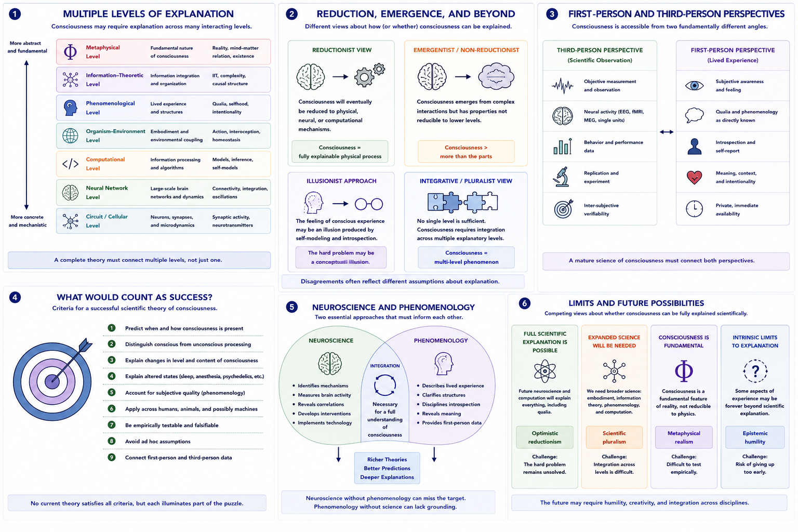

# Can Consciousness Be Scientifically Explained? {#scientific-explanation}

## Chapter Overview

One of the deepest questions in consciousness research is whether consciousness can ultimately be explained scientifically and, if so, what kind of explanation would count as sufficient.

Unlike many scientific phenomena, consciousness involves both:

- observable physical processes;
and:
- subjective first-person experience.

This creates a unique challenge. Science traditionally studies phenomena through:

- third-person observation;
- measurement;
- prediction;
- and experimental manipulation.

However, consciousness also involves:

- subjective feeling;
- lived experience;
- phenomenology;
- and qualitative awareness.

The central question is therefore not simply:

> Can science study the brain?

but rather:

> Can science explain why brain activity is accompanied by subjective experience at all?

This chapter examines competing views concerning scientific explanation, reduction, phenomenology, neuroscience, computation, embodiment, and the possible limits of scientific inquiry into consciousness.

## Learning Objectives

After reading this chapter, the reader should be able to:

- Explain why consciousness presents unique scientific challenges
- Distinguish different levels of scientific explanation
- Compare reductionist and non-reductionist approaches
- Explain the relationship between neuroscience and phenomenology
- Analyze what would count as a successful theory of consciousness
- Evaluate limitations of purely third-person explanations
- Understand why scientific progress and philosophical disagreement coexist

## Core Idea in One Picture

Figure \@ref(fig:fig-scientific-explanation) summarizes major approaches to scientific explanation in consciousness research.

```{r fig-scientific-explanation, echo=FALSE, fig.cap="Scientific explanation and consciousness. Panel 1 illustrates multiple levels of explanation. Panel 2 compares reductionist and non-reductionist approaches. Panel 3 contrasts first-person and third-person perspectives. Panel 4 summarizes criteria for explanatory success. Panel 5 illustrates the relationship between neuroscience and phenomenology. Panel 6 compares competing views concerning the limits of scientific explanation.", out.width="100%", fig.align="center"}

```

As shown in Figure \@ref(fig:fig-scientific-explanation), consciousness research spans multiple explanatory levels and requires integration across neuroscience, computation, phenomenology, embodiment, and philosophy.

## Why Consciousness Is Scientifically Difficult

Consciousness presents unusual scientific difficulties because:

- subjective experience cannot be directly observed externally;
- first-person awareness differs fundamentally from third-person measurement;
- conscious states are partially private;
- and many explanations appear to leave phenomenology unexplained.

Researchers can measure:

- neural activity;
- behavioural responses;
- reaction times;
- brain imaging;
- and computational dynamics.

However:

> measuring neural activity is not the same as explaining subjective experience.

This distinction lies at the center of many debates in consciousness science.

## Multiple Levels of Explanation

Scientific explanation may occur at several interacting levels.

Figure \@ref(fig:fig-scientific-explanation) Panel 1 illustrates these levels.

### Molecular and Cellular Level

This level studies:

- neurons;
- neurotransmitters;
- synaptic activity;
- ion channels;
- and cellular signaling.

### Neural Circuit Level

This level examines:

- recurrent processing;
- thalamocortical dynamics;
- connectivity;
- and large-scale integration.

### Computational Level

Computational explanations involve:

- information processing;
- prediction;
- self-modeling;
- inference;
- and cognitive architecture.

### Organism and Embodiment Level

Embodied approaches emphasize:

- bodily regulation;
- interoception;
- environmental interaction;
- and sensorimotor engagement.

### Phenomenological Level

Phenomenology studies:

- lived experience;
- subjective feeling;
- selfhood;
- intentionality;
- and qualitative awareness.

### Information-Theoretic Level

Some theories emphasize:

- integration;
- informational structure;
- complexity;
- and causal organization.

### Metaphysical Level

Metaphysical approaches ask:

- why consciousness exists at all;
- whether consciousness is reducible;
- and how mind relates to matter.

A complete theory of consciousness may ultimately need to connect several of these levels simultaneously.

## Reduction and Explanation

One of the central debates concerns whether consciousness can be fully reduced to physical mechanisms.

Figure \@ref(fig:fig-scientific-explanation) Panel 2 compares major explanatory approaches.

### Reductionist Views

Reductionist approaches argue that consciousness will eventually be explained through:

- neuroscience;
- computation;
- information processing;
- and physical mechanisms.

According to this perspective:

```text
consciousness = fully explainable physical process
```

Some physicalists believe current explanatory gaps simply reflect incomplete scientific knowledge.

### Non-Reductionist Views

Other researchers argue that reduction alone may leave out:

- qualitative feeling;
- subjectivity;
- and first-person experience.

These approaches suggest that:

- consciousness may involve emergent properties;
- irreducible phenomenology;
- or entirely new explanatory principles.

### Illusionist Views

Illusionism argues that some traditional assumptions about phenomenal consciousness may themselves be conceptually misleading.

According to illusionists:

> the hard problem may arise partly from introspective misunderstanding.

### Pluralist and Integrative Views

Some researchers propose that no single explanatory framework will suffice.

Instead, consciousness may require integration across:

- neuroscience;
- phenomenology;
- computation;
- embodiment;
- and philosophy.

## First-Person vs Third-Person Perspectives

Figure \@ref(fig:fig-scientific-explanation) Panel 3 contrasts first-person and third-person perspectives.

### Third-Person Science

Traditional science relies on:

- objective observation;
- measurement;
- prediction;
- and replication.

This approach is essential for neuroscience and experimental psychology.

### First-Person Experience

Consciousness also involves:

- subjective awareness;
- introspection;
- lived experience;
- and phenomenology.

These dimensions are directly accessible only from the first-person perspective.

This creates a fundamental methodological challenge:

```text
objective measurement
≠
subjective experience itself
```

A mature science of consciousness may therefore require methods that connect:

- first-person reports;
and:
- third-person measurement.

## What Would Count as Scientific Success?

Figure \@ref(fig:fig-scientific-explanation) Panel 4 summarizes major criteria for explanatory success.

A successful scientific theory of consciousness may need to:

- predict when consciousness is present;
- distinguish conscious from unconscious processing;
- explain changes in conscious level and content;
- explain altered states and anesthesia;
- account for subjective quality;
- connect phenomenology with mechanism;
- apply across humans, animals, and potentially machines;
- avoid ad hoc assumptions;
- generate experimentally testable predictions.

Importantly:

> no current theory fully satisfies all criteria simultaneously.

## The Role of Phenomenology

Figure \@ref(fig:fig-scientific-explanation) Panel 5 illustrates the relationship between phenomenology and neuroscience.

Phenomenology emphasizes disciplined study of experience itself.

Phenomenological traditions investigate:

- temporal structure of experience;
- bodily awareness;
- intentionality;
- selfhood;
- and lived meaning.

Many researchers argue that:

> eliminating first-person experience from consciousness science risks eliminating the very phenomenon requiring explanation.

At the same time:

- introspection can be limited;
- subjective reports may be inaccurate;
- and phenomenology alone may not reveal underlying mechanisms.

Thus phenomenology and neuroscience may need to complement rather than replace one another.

## The Role of Neuroscience

Neuroscience is indispensable for consciousness research.

Neuroscience has clarified:

- neural correlates of awareness;
- large-scale integration;
- recurrent processing;
- disorders of consciousness;
- anesthesia;
- attention;
- and metacognition.

However:

> neural correlation does not automatically equal explanation.

Brain data can identify:

- mechanisms;
- dynamics;
- and functional relationships,

but interpreting those mechanisms still requires theoretical frameworks.

Thus neuroscience alone may be necessary but insufficient.

## The Hard Problem and Scientific Limits

Many debates concerning scientific explanation ultimately return to the hard problem of consciousness.

The hard problem asks:

> Why should physical or computational processes produce subjective experience at all?

Some researchers believe this problem will eventually yield to scientific explanation.

Others argue that:

- current scientific methods may be insufficient;
- subjective experience may resist reduction;
- or entirely new conceptual frameworks may be required.

Figure \@ref(fig:fig-scientific-explanation) Panel 6 compares these competing perspectives.

## Can Science Fully Explain Subjective Experience?

Several possibilities remain actively debated.

### Full Scientific Reduction

Consciousness may eventually be explained entirely through neuroscience and computation.

### Expanded Scientific Frameworks

Future science may require:

- integration of phenomenology;
- embodiment;
- information theory;
- and self-modeling.

### Fundamental Consciousness

Some theories suggest consciousness may be:

- irreducible;
- fundamental;
- or built into physical reality itself.

### Permanent Explanatory Limits

Some philosophers argue there may be intrinsic limits to human understanding of consciousness.

This possibility remains controversial.

## Why Scientific Progress Still Matters

Even without complete solutions, consciousness science has achieved substantial progress concerning:

- neural correlates;
- anesthesia;
- altered states;
- disorders of consciousness;
- metacognition;
- attention;
- and conscious access.

Partial explanations remain scientifically valuable because they:

- improve prediction;
- clarify mechanisms;
- guide experiments;
- and refine theoretical distinctions.

Figure \@ref(fig:fig-scientific-explanation) Panel 4 illustrates why explanatory progress can occur even without solving every philosophical problem simultaneously.

## Integration Across Disciplines

Consciousness research increasingly requires collaboration across:

- neuroscience;
- psychology;
- philosophy;
- computer science;
- AI research;
- phenomenology;
- psychiatry;
- and cognitive science.

Different disciplines contribute different explanatory tools.

For example:

- neuroscience studies mechanisms;
- phenomenology studies lived experience;
- AI explores computation and self-modeling;
- philosophy analyzes conceptual coherence.

Future progress may therefore require:

> interdisciplinary integration rather than single-discipline reduction.

## Main Comparative Conclusion

Consciousness may ultimately be scientifically explainable, but the required science may need to extend beyond conventional third-person measurement alone.

A mature theory of consciousness may require integration across:

- neural mechanisms;
- computation;
- embodiment;
- phenomenology;
- selfhood;
- information integration;
- and philosophy.

At present, substantial progress has been achieved in understanding:

- neural correlates;
- conscious access;
- altered states;
- and cognitive mechanisms.

However, foundational questions concerning:

- subjective experience;
- qualitative feeling;
- the hard problem;
- and the explanatory gap

remain deeply unresolved.

The challenge of consciousness therefore continues to occupy a unique position at the intersection of:

> science, philosophy, computation, phenomenology, and metaphysics.