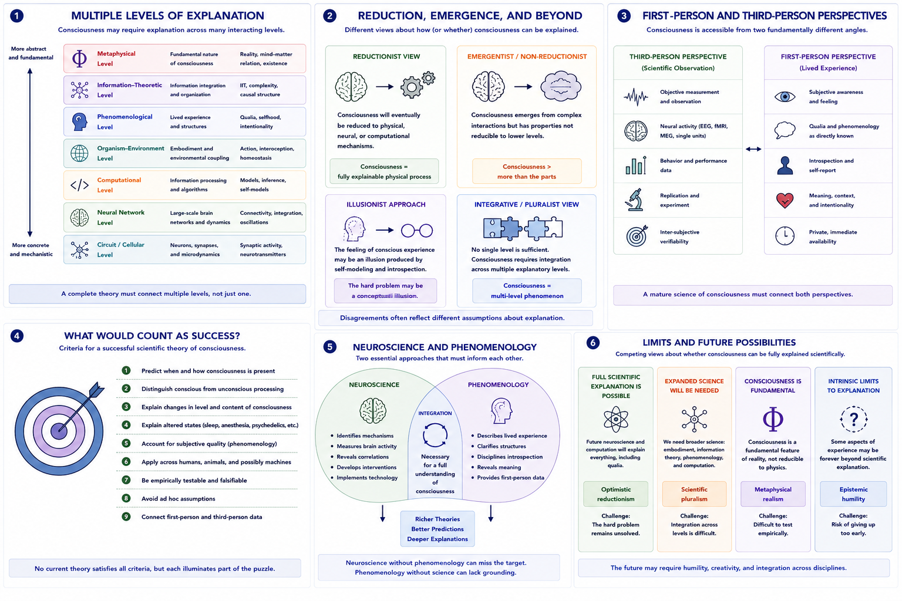

# Can Consciousness Be Scientifically Explained? {#scientific-explanation}

## Chapter Overview

One of the deepest questions in consciousness research is whether consciousness can ultimately be explained scientifically. If it can, what kind of explanation would count as successful? Would it be enough to identify neural mechanisms? Would a computational model be sufficient? Must a theory also account for lived experience, subjective feeling, and the first-person point of view?

Consciousness presents a unique challenge because it involves both observable physical processes and subjective experience. Science traditionally studies phenomena through third-person observation, measurement, prediction, and experimental manipulation. Consciousness, however, also includes first-person awareness, qualitative feeling, lived embodiment, and phenomenology [@nagel1974; @chalmers1995; @chalmers1996].

The central question is therefore not simply whether science can study the brain. Clearly, it can. Neuroscience has made major progress in studying attention, perception, sleep, anesthesia, disorders of consciousness, neural correlates, and altered states [@koch2016; @laureys2005; @owen2006]. The deeper question is whether science can explain why brain activity is accompanied by subjective experience at all.

Different theories answer this question differently. Reductionist physicalists argue that consciousness will eventually be explained through neuroscience, computation, and physical mechanisms. Non-reductionists argue that subjective experience may require new explanatory principles. Illusionists argue that the hard problem may arise from misleading introspective assumptions about phenomenal consciousness [@dennett1991; @frankish2016]. Consciousness-first approaches, including panpsychism and Taheri’s T-Consciousness, suggest that consciousness may be more fundamental than standard physicalist theories allow [@goff2017; @goff2019; @taheri2020; @taheri2023].

This chapter examines competing views concerning scientific explanation, reduction, phenomenology, neuroscience, computation, embodiment, and the possible limits of scientific inquiry into consciousness.

## Guiding Questions

This chapter is organized around several guiding questions:

* What would count as a successful scientific explanation of consciousness?
* Can third-person science fully explain first-person experience?
* What is the relationship between neuroscience and phenomenology?
* Can consciousness be reduced to physical, neural, or computational mechanisms?
* Does the hard problem reveal a temporary gap in science or a deeper explanatory limit?
* How should consciousness-first theories be treated within scientific explanation?
* Can progress occur even if some philosophical questions remain unresolved?

## Core Idea in One Picture

Figure @ref(fig:fig-scientific-explanation) summarizes major approaches to scientific explanation in consciousness research.

```{r fig-scientific-explanation, echo=FALSE, fig.cap="Scientific explanation and consciousness. Panel 1 illustrates multiple levels of explanation. Panel 2 compares reductionist and non-reductionist approaches. Panel 3 contrasts first-person and third-person perspectives. Panel 4 summarizes criteria for explanatory success. Panel 5 illustrates the relationship between neuroscience and phenomenology. Panel 6 compares competing views concerning the limits of scientific explanation.", out.width="100%", fig.align="center"}

```

As Figure @ref(fig:fig-scientific-explanation) illustrates, consciousness research spans multiple explanatory levels. These include neural mechanisms, computation, embodiment, phenomenology, information integration, and metaphysical interpretation.

The main challenge is not simply collecting more data. The challenge is understanding how different kinds of explanation relate to one another. A neural explanation may identify mechanisms. A computational explanation may describe information processing. A phenomenological explanation may describe lived experience. A metaphysical explanation may ask what consciousness fundamentally is. A complete account of consciousness may need to connect all of these levels.

## Why Consciousness Is Scientifically Difficult

Consciousness is scientifically difficult because subjective experience cannot be directly observed from the outside. Researchers can measure neural activity, behavioural responses, reaction times, brain imaging signals, physiological changes, and computational dynamics. But none of these measurements is identical to experience itself.

This creates a methodological gap. Third-person science studies what can be publicly measured. First-person consciousness is lived privately from the perspective of a subject. A researcher can observe another person’s brain activity during pain, but the painfulness of the pain is not directly visible in the scan.

This does not mean consciousness cannot be studied scientifically. It means that consciousness requires special care. Researchers must connect first-person reports, behavioural evidence, neural data, computational models, and philosophical interpretation.

The difficulty can be summarized as:

```text
measuring neural activity is not the same as explaining subjective experience
```

This distinction lies at the center of consciousness science. Many theories explain neural and cognitive processes associated with consciousness. The deeper question is whether those explanations also explain experience itself.

## Multiple Levels of Explanation

Scientific explanation can occur at several interacting levels. Consciousness may not be explainable from only one of them.

At the molecular and cellular level, researchers study neurons, neurotransmitters, synaptic activity, ion channels, receptor systems, and cellular signaling. This level is essential for understanding anesthesia, sleep, drugs, brain injury, and neural function.

At the neural circuit level, researchers study recurrent processing, thalamocortical dynamics, cortical connectivity, frontoparietal networks, sensory systems, and large-scale integration. Many theories of consciousness operate at this level, including Global Workspace Theory and Recurrent Processing Theory [@baars1988; @dehaene2011; @lamme2006].

At the computational level, researchers study information processing, prediction, inference, self-modeling, memory, attention, and cognitive architecture. Predictive Processing, Bayesian brain theories, computationalism, and Attention Schema Theory are especially relevant here [@friston2010; @clark2013; @clark2016].

At the organism and embodiment level, researchers study bodily regulation, interoception, action, emotion, sensorimotor engagement, and organism-environment interaction. Embodied and enactive theories emphasize that consciousness is not merely brain activity in isolation, but lived experience through a body situated in a world [@varela1991; @thompson2007; @seth2021].

At the phenomenological level, researchers and philosophers examine lived experience, subjective feeling, selfhood, intentionality, temporal structure, and qualitative awareness. This level is crucial because consciousness is not only a function to be explained; it is also an experience to be described.

At the information-theoretic level, theories such as Integrated Information Theory emphasize integration, complexity, intrinsic causal structure, and informational organization [@tononi2004; @oizumi2014].

At the metaphysical level, philosophers ask what consciousness fundamentally is. Is it reducible? Is it emergent? Is it fundamental? Is it an illusion? Is it non-material? These questions are addressed by physicalism, dualism, panpsychism, illusionism, and consciousness-first frameworks such as T-Consciousness [@frankish2016; @goff2017; @taheri2020; @taheri2023].

A mature theory of consciousness may need to connect several of these levels rather than reduce all explanation to one level alone.

## Reduction and Explanation

One of the central debates concerns whether consciousness can be fully reduced to physical mechanisms.

Reductionist approaches argue that consciousness will eventually be explained through neuroscience, computation, information processing, and physical mechanisms. According to this perspective, the current explanatory gap reflects incomplete scientific knowledge rather than a permanent mystery.

The reductionist hope can be summarized as:

```text
consciousness = fully explainable physical process
```

On this view, progress in neuroscience will eventually show how conscious states arise from brain activity, just as biology explained life without appealing to a non-physical life force.

Non-reductionist approaches are more cautious. They argue that physical and functional explanations may leave out qualitative feeling, subjectivity, and first-person experience. These approaches do not necessarily reject science, but they suggest that existing scientific categories may be incomplete.

Illusionist approaches take a different path. Illusionism argues that some traditional assumptions about phenomenal consciousness may be misleading. The hard problem may arise partly because introspection represents consciousness in a distorted way [@dennett1991; @frankish2016]. If this is correct, then science may explain consciousness by explaining why we believe in irreducible qualia.

Consciousness-first approaches take another path. Panpsychism and T-Consciousness suggest that consciousness may not be fully derived from non-conscious physical processes. Panpsychism treats consciousness or proto-consciousness as fundamental within reality. T-Consciousness treats consciousness as foundational and non-material [@goff2019; @taheri2020; @taheri2023]. These approaches challenge reductionism but face the task of connecting their claims with scientific methods.

## First-Person and Third-Person Perspectives

A central challenge in consciousness research is the relationship between first-person and third-person perspectives.

Third-person science relies on objective observation, measurement, prediction, replication, and experimental manipulation. This approach is essential for neuroscience, psychology, medicine, and artificial intelligence research.

First-person experience involves subjective awareness, introspection, lived embodiment, felt quality, and phenomenology. These dimensions are directly accessible only from the perspective of the experiencing subject.

The difference can be summarized as:

```text
third-person science measures processes
first-person experience is what those processes are like from within
```

This creates a bridge problem. Consciousness science must connect reports and measurements with lived experience. Reports are useful but imperfect. Neural data are objective but do not speak for themselves. Phenomenology is essential but can be difficult to standardize.

A mature science of consciousness may therefore require careful integration of first-person and third-person methods. It cannot ignore subjective experience, because that is the phenomenon being explained. But it also cannot rely on introspection alone, because introspection can be incomplete, biased, or misleading.

## What Would Count as Scientific Success?

A successful scientific theory of consciousness would need to do several things.

First, it should predict when consciousness is present and absent. This is especially important in anesthesia, coma, unresponsive wakefulness syndrome, minimally conscious state, locked-in syndrome, infants, animals, and artificial systems [@laureys2005; @owen2006; @butlin2023].

Second, it should distinguish conscious from unconscious processing. Many forms of perception, attention, priming, and decision-making can occur unconsciously. A theory must explain what changes when information becomes conscious.

Third, it should explain changes in level and content. It should account for ordinary wakefulness, sleep, dreaming, anesthesia, psychedelic states, meditation, and disorders of consciousness.

Fourth, it should connect phenomenology with mechanism. It should not only identify which brain states correlate with experience, but also explain why particular experiences have the structure they do.

Fifth, it should apply across different kinds of systems. A strong theory should clarify whether non-human animals, infants, artificial systems, or unusual biological systems could be conscious.

Sixth, it should generate testable predictions. A theory that cannot be tested may still be philosophically meaningful, but it remains scientifically limited.

No current theory fully satisfies all these criteria. Some theories are strong in empirical prediction but weaker in explaining phenomenology. Others address subjectivity directly but are harder to test.

## The Role of Phenomenology

Phenomenology is the disciplined study of experience as it is lived. It examines temporal flow, bodily awareness, selfhood, intentionality, perception, emotion, and meaning.

Phenomenology is important because consciousness cannot be understood if first-person experience is removed from the discussion. A purely external description of the brain may miss the very thing consciousness science is trying to explain.

For example, a neuroscientific account of pain may describe nociception, spinal pathways, cortical activation, and behavioural response. But the experience of pain also involves aversiveness, bodily location, urgency, attention, emotion, and subjective feeling. Phenomenology helps describe this structure.

At the same time, phenomenology alone is not sufficient. Introspection can be limited. People may misdescribe their own experiences. Subjective reports can be shaped by memory, language, expectation, culture, and theory.

Thus, phenomenology and neuroscience should complement one another. Phenomenology clarifies what must be explained. Neuroscience investigates mechanisms. Philosophy evaluates conceptual coherence. A complete science of consciousness needs all three.

## The Role of Neuroscience

Neuroscience is indispensable for consciousness research. It has clarified neural correlates of awareness, large-scale integration, recurrent processing, attention, metacognition, anesthesia, and disorders of consciousness [@dehaene2014; @koch2016; @laureys2005].

Neuroscience has also shown that consciousness is not located in a single simple brain region. It depends on dynamic interactions among sensory systems, thalamocortical networks, attention systems, memory, bodily regulation, and large-scale coordination.

However, neural correlation does not automatically equal explanation. Finding that a brain region is active during conscious perception does not by itself explain why that activity is experienced. Neuroscience provides essential data, but those data require theoretical interpretation.

This is why different theories can interpret the same neural findings differently. Global Workspace Theory may interpret activity as broadcasting. Integrated Information Theory may interpret it as causal integration. Predictive Processing may interpret it as hierarchical inference. Higher-Order theories may interpret it as metacognitive access. Embodied theories may interpret it as part of organism-world regulation.

Neuroscience is necessary, but it may not be sufficient without computation, phenomenology, and philosophy.

## The Role of Computation

Computational explanation is central to modern consciousness research. Many theories explain conscious processes in terms of information processing, prediction, representation, integration, attention, self-modeling, or global access.

Computational models are powerful because they make theories more precise. They can generate predictions, simulate mechanisms, and connect neuroscience with artificial intelligence.

For example, Predictive Processing explains perception as hierarchical inference and prediction-error minimization [@friston2010; @clark2013]. Global Workspace Theory can be interpreted computationally as a model of information broadcasting and access [@baars1988; @dehaene2011]. Attention Schema Theory explains awareness as an internal model of attention [@graziano2013].

However, computation also faces a central limitation. A computational model may explain what a system does without explaining why it feels like anything to be that system. This is especially important in debates about artificial intelligence. A machine may perform sophisticated computation without subjective experience [@butlin2023].

Thus computation is essential for explaining cognition, but its relation to phenomenology remains contested.

## The Role of Embodiment

Embodied and enactive theories argue that consciousness cannot be fully explained by brain activity or computation alone. Consciousness belongs to living organisms that move, feel, regulate themselves, and interact with the world [@varela1991; @thompson2007; @seth2021].

Embodiment matters because conscious experience is not abstract. It is bodily, affective, situated, and action-oriented. Pain, hunger, emotion, balance, movement, fatigue, and bodily presence all shape experience.

Embodied approaches therefore broaden scientific explanation. Instead of asking only what the brain represents, they ask how the whole organism lives, acts, regulates itself, and engages with the environment.

This does not mean the brain is unimportant. Rather, it means brain activity should be understood as part of a larger system: brain, body, and world.

Embodiment may not solve the hard problem by itself, but it clarifies what any complete theory must explain. Consciousness is not merely information processing. It is lived experience through a body.

## The Hard Problem and Scientific Limits

Many debates about scientific explanation return to the hard problem. The hard problem asks why physical or computational processes should produce subjective experience at all [@chalmers1995; @chalmers1996].

Some researchers believe the hard problem will eventually be solved by science. They argue that once neural mechanisms, computational processes, and functional roles are fully understood, the mystery will disappear.

Others believe the hard problem reveals a deeper explanatory gap. Physical descriptions may explain structure and function, but they may not explain why experience exists or why it has qualitative character [@levine1983].

Illusionists argue that the hard problem may be based on a mistaken conception of phenomenal consciousness. If the brain misrepresents its own internal processes as having ineffable qualia, then explaining that misrepresentation may dissolve the problem [@frankish2016].

Consciousness-first theories argue that the hard problem may persist because the standard starting point is wrong. If consciousness is fundamental or foundational, then science may need to be expanded rather than merely extended from current physicalist assumptions [@goff2019; @taheri2020; @taheri2023].

No consensus currently exists. The hard problem remains the deepest point of disagreement in consciousness research.

## Can Science Fully Explain Subjective Experience?

Several possibilities remain open.

The first possibility is full scientific reduction. Consciousness may eventually be explained entirely through neuroscience, computation, and physical mechanisms. On this view, the current mystery reflects incomplete knowledge.

The second possibility is expanded scientific explanation. Consciousness may be scientifically explainable, but only if science integrates phenomenology, embodiment, information theory, self-modeling, and first-person methods more deeply.

The third possibility is fundamental consciousness. Consciousness may be irreducible or built into reality itself. Panpsychism takes one version of this route. T-Consciousness takes another, presenting consciousness as foundational and non-material rather than as a product of matter or computation [@goff2017; @taheri2020; @taheri2023].

The fourth possibility is permanent explanatory limitation. Some philosophers argue that human cognition may not be capable of fully understanding consciousness. The problem may exceed our conceptual tools.

These possibilities are not equally accepted within mainstream science. Current neuroscience generally proceeds by studying mechanisms, correlations, and functions. Consciousness-first approaches remain more philosophical and less experimentally established. However, they remain important because they challenge the assumption that standard reduction is guaranteed to succeed.

## Consciousness-First Approaches and Scientific Explanation

Consciousness-first approaches raise a special challenge for scientific explanation. Panpsychism, cosmopsychism, idealism, and T-Consciousness all suggest that consciousness may be more fundamental than standard materialist theories assume.

Panpsychism proposes that consciousness or proto-consciousness is built into the basic nature of reality [@goff2017; @goff2019]. T-Consciousness presents consciousness as foundational and non-material, with matter, life, and organization understood in relation to consciousness rather than consciousness being produced by matter alone [@taheri2020; @taheri2023].

These views are important because they address the hard problem directly. They do not try to derive consciousness from entirely non-conscious processes. Instead, they change the explanatory starting point.

However, they also face scientific challenges. A scientific theory must generate clear concepts, explanatory structure, and ideally testable predictions. If consciousness-first frameworks remain too broad, they risk becoming difficult to evaluate empirically.

The careful position is therefore this: consciousness-first approaches should not be dismissed simply because they are non-reductive, but they also should not be treated as scientifically established without further clarification, argument, and evidence.

## Why Scientific Progress Still Matters

Even if the hard problem remains unresolved, scientific progress still matters. Consciousness science has achieved substantial advances in understanding neural correlates, attention, perception, anesthesia, altered states, disorders of consciousness, metacognition, and conscious access [@dehaene2014; @laureys2005; @owen2006].

Partial explanations improve prediction, diagnosis, communication, and ethical decision-making. For example, research on covert consciousness has changed how some non-responsive patients are assessed. Anesthesia research improves medical safety. AI consciousness research clarifies ethical uncertainty. Animal consciousness research affects moral concern.

Scientific progress also sharpens philosophical questions. The more researchers understand about mechanisms, the more precisely they can ask what remains unexplained.

A theory does not need to solve every dimension of consciousness to be valuable. Global Workspace Theory clarifies access. Recurrent Processing Theory clarifies perceptual awareness. Predictive Processing clarifies inference. Embodied theories clarify lived bodily experience. IIT clarifies integration. Illusionism clarifies introspective self-modeling. Consciousness-first theories clarify metaphysical alternatives.

## Integration Across Disciplines

Consciousness research increasingly requires collaboration across neuroscience, psychology, philosophy, computer science, artificial intelligence, phenomenology, psychiatry, medicine, and cognitive science.

Each discipline contributes different tools. Neuroscience studies mechanisms. Psychology studies behaviour and cognition. Philosophy analyzes concepts and arguments. AI explores computation and machine models. Phenomenology studies lived experience. Medicine studies impaired and altered states. Embodied research studies organism-world interaction.

The difficulty is integration. A neuroscientific explanation may not satisfy phenomenological concerns. A philosophical theory may not generate empirical predictions. A computational model may ignore embodiment. A consciousness-first framework may need clearer scientific grounding.

Future progress may require theoretical pluralism rather than single-discipline reduction. Consciousness may need to be explained across levels: neural, computational, embodied, phenomenological, and metaphysical.

## Criteria for a Mature Theory of Consciousness

A mature theory of consciousness should meet several criteria.

It should explain ordinary waking consciousness, but also anesthesia, sleep, dreaming, disorders of consciousness, altered states, and non-human consciousness.

It should distinguish conscious from unconscious processing.

It should connect neural mechanisms with cognitive functions.

It should account for phenomenological structure, including selfhood, embodiment, temporality, emotion, and qualitative character.

It should clarify its position on the hard problem.

It should generate testable predictions where possible.

It should explain how consciousness relates to artificial systems, animals, infants, and impaired patients.

It should avoid reducing consciousness to one dimension too quickly. Consciousness includes access, awareness, feeling, selfhood, embodiment, and meaning.

No current theory fully meets all these criteria. But each major theory contributes part of the picture.

## Main Comparative Conclusion

Consciousness may ultimately be scientifically explainable, but the required science may need to be broader than conventional third-person measurement alone. A mature account may require integration across neural mechanisms, computation, embodiment, phenomenology, selfhood, information integration, and philosophy.

At present, substantial progress has been achieved in understanding neural correlates, conscious access, altered states, disorders of consciousness, attention, and cognitive mechanisms. However, foundational questions concerning subjective experience, qualitative feeling, the hard problem, and the explanatory gap remain unresolved.

The challenge of consciousness therefore occupies a unique position. It is not outside science, because it can be studied experimentally and clinically. But it is not a standard scientific problem either, because the phenomenon to be explained includes first-person experience.

The best current answer is therefore balanced:

```text
Consciousness can be studied scientifically,
but whether it can be fully reduced to current scientific categories remains unresolved.
```

Future progress will likely require both empirical rigor and philosophical openness.

## Chapter Summary

This chapter examined whether consciousness can be scientifically explained and what kind of explanation would count as successful.

Consciousness is difficult because it involves both third-person measurable processes and first-person subjective experience. Neuroscience can measure brain activity, behaviour, and cognition, but subjective feeling itself is not directly observable from the outside.

Scientific explanation operates at multiple levels: molecular, neural, computational, embodied, phenomenological, information-theoretic, and metaphysical. A complete account of consciousness may need to connect several of these levels.

Reductionist views argue that consciousness will eventually be explained through physical mechanisms. Non-reductionist views argue that subjectivity may require new explanatory principles. Illusionism attempts to dissolve the hard problem by explaining why we believe in irreducible qualia. Consciousness-first theories, including panpsychism and T-Consciousness, suggest that consciousness may be fundamental or foundational rather than produced by matter alone.

Neuroscience, computation, embodiment, and phenomenology all contribute essential insights. Neuroscience identifies mechanisms. Computation models information processing. Embodiment situates consciousness in living action. Phenomenology clarifies lived experience.

No current theory fully explains consciousness across all dimensions. The hard problem and explanatory gap remain unresolved. However, scientific progress has been real and valuable, especially in the study of attention, reportability, anesthesia, altered states, disorders of consciousness, and neural correlates.

The central conclusion is that consciousness can be scientifically investigated, but whether it can be fully explained by current forms of science remains open.
