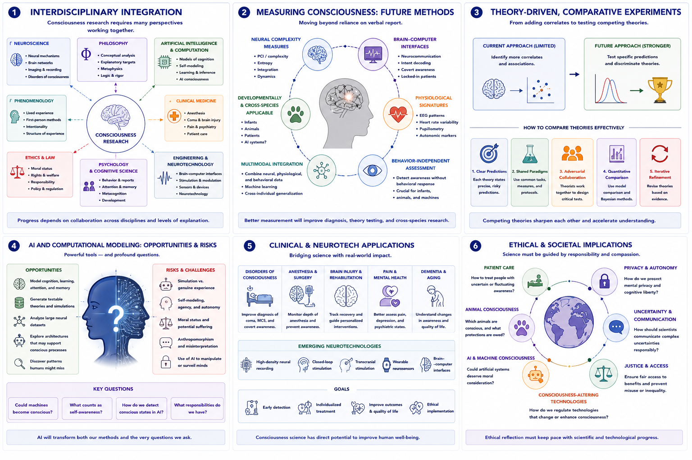

# Future Directions in Consciousness Research {#future-directions}

## Chapter Overview

Consciousness research is entering a period of rapid transformation driven by advances in:

- neuroscience;
- artificial intelligence;
- computational modeling;
- neurotechnology;
- phenomenology;
- cognitive science;
- psychiatry;
- and philosophy of mind.

At the same time, many foundational questions remain unresolved, including:

- the nature of subjective experience;
- the hard problem;
- criteria for consciousness in non-human systems;
- and the relationship between brain activity and phenomenology.

Future progress will likely require increasingly interdisciplinary approaches that integrate:

- experimental neuroscience;
- computational theory;
- embodied cognition;
- phenomenology;
- artificial intelligence;
- clinical medicine;
- and philosophy.

This chapter explores major future directions, emerging challenges, technological developments, and conceptual frontiers that may shape the next generation of consciousness research.

## Learning Objectives

After reading this chapter, the reader should be able to:

- Identify major future directions in consciousness science
- Explain why interdisciplinary integration is increasingly necessary
- Describe emerging methods for measuring consciousness
- Analyze future roles of AI and computational modeling
- Explain the importance of theory-driven experimentation
- Evaluate ethical challenges in future consciousness research
- Understand the growing role of phenomenology and neurotechnology

## Core Idea in One Picture

Figure \@ref(fig:fig-future-directions) summarizes major future directions in consciousness research.

```{r fig-future-directions, echo=FALSE, fig.cap="Future directions in consciousness research. Panel 1 illustrates interdisciplinary integration across neuroscience, AI, phenomenology, philosophy, and medicine. Panel 2 summarizes future methods for measuring consciousness beyond verbal report. Panel 3 compares theory-driven experimental approaches. Panel 4 illustrates future AI and computational modeling challenges. Panel 5 highlights clinical and neurotechnological applications. Panel 6 summarizes ethical and societal implications.", out.width="100%", fig.align="center"}

```

As shown in Figure \@ref(fig:fig-future-directions), future consciousness research will likely depend on integration across multiple explanatory levels, methods, and disciplines rather than reliance on any single framework alone.

## Why Consciousness Research Is Changing

Several developments are rapidly reshaping consciousness studies.

These include:

- improved neuroimaging;
- large-scale neural recording;
- machine learning;
- computational neuroscience;
- AI systems;
- psychedelic research;
- neurotechnology;
- and growing interdisciplinary collaboration.

At the same time, increasing recognition exists that consciousness cannot be fully understood from a single perspective alone.

Future progress will likely require integration across:

- neural mechanisms;
- phenomenology;
- computation;
- embodiment;
- and philosophy.

## Interdisciplinary Integration

Figure \@ref(fig:fig-future-directions) Panel 1 illustrates the increasingly interdisciplinary structure of consciousness research.

Future work will likely involve collaboration among:

- neuroscientists;
- psychologists;
- AI researchers;
- clinicians;
- philosophers;
- computational modelers;
- phenomenologists;
- and ethicists.

Different disciplines contribute different explanatory tools.

For example:

### Neuroscience

Studies:

- neural dynamics;
- connectivity;
- anesthesia;
- disorders of consciousness;
- and large-scale integration.

### Artificial Intelligence

Explores:

- computation;
- self-modeling;
- prediction;
- adaptive learning;
- and machine cognition.

### Phenomenology

Investigates:

- lived experience;
- selfhood;
- temporality;
- intentionality;
- and subjective structure.

### Clinical Medicine

Applies consciousness research to:

- coma;
- dementia;
- pain;
- anesthesia;
- psychiatric disorders;
- and end-of-life care.

### Philosophy

Clarifies:

- conceptual assumptions;
- explanatory targets;
- metaphysical questions;
- and logical coherence.

Future progress will likely require:

> cross-disciplinary integration rather than isolated specialization.

## Improved Measures of Consciousness

One of the largest future priorities involves developing measures of consciousness that do not rely entirely on verbal report.

Figure \@ref(fig:fig-future-directions) Panel 2 illustrates emerging approaches.

This is especially important for:

- infants;
- non-human animals;
- patients with severe brain injury;
- anesthetized individuals;
- locked-in patients;
- and potentially artificial systems.

### Neural Complexity Measures

Researchers are increasingly studying:

- perturbational complexity;
- integration;
- neural entropy;
- and large-scale connectivity.

### Brain-Computer Interfaces

Future neurotechnology may allow improved communication with behaviourally non-responsive patients.

### Physiological Signatures

Potential markers include:

- EEG dynamics;
- recurrent processing;
- complexity measures;
- and global integration patterns.

### Behaviour-Independent Assessment

Future methods may increasingly distinguish:

- consciousness itself;
from:
- ability to communicate or respond behaviourally.

This may significantly improve diagnosis of disorders of consciousness.

## Theory-Driven Experiments

Figure \@ref(fig:fig-future-directions) Panel 3 illustrates future theory-comparison approaches.

Historically, many experiments focused primarily on identifying additional neural correlates of consciousness.

Future progress will likely require:

> direct comparison between competing theories.

Examples include:

- Global Workspace Theory vs Integrated Information Theory;
- predictive processing vs higher-order theories;
- recurrent processing vs global access models.

### Adversarial Collaboration

Future research may increasingly involve:

- shared experimental designs;
- jointly agreed predictions;
- and collaborative testing between competing theorists.

This approach may help reduce:

- confirmation bias;
- theory isolation;
- and interpretive ambiguity.

## Computational Modeling and Artificial Intelligence

Figure \@ref(fig:fig-future-directions) Panel 4 summarizes future AI-related challenges.

Artificial intelligence provides both:

- powerful research tools;
and:
- profound conceptual challenges.

### AI as Scientific Model

AI systems may help researchers study:

- learning;
- prediction;
- attention;
- memory;
- self-modeling;
- and adaptive cognition.

### Machine Consciousness Questions

Future AI systems may raise difficult questions concerning:

- consciousness;
- agency;
- self-awareness;
- moral status;
- and artificial suffering.

### Simulation vs Experience

An important unresolved issue concerns whether:

```text
functional simulation
=
genuine conscious experience
```

This debate will likely become increasingly important as AI systems become more sophisticated.

### Anthropomorphism Risks

Humans naturally attribute:

- intention;
- awareness;
- and emotion

to artificial systems.

Future research must carefully distinguish between:

- convincing behaviour;
and:
- genuine consciousness.

## Neurotechnology and Brain Interfaces

Emerging neurotechnologies may significantly transform consciousness research.

Potential developments include:

- high-density neural recording;
- brain-computer interfaces;
- neural stimulation;
- closed-loop systems;
- and consciousness monitoring technologies.

These tools may improve understanding of:

- neural integration;
- conscious access;
- disorders of consciousness;
- and altered states.

At the same time, they raise major ethical concerns concerning:

- privacy;
- autonomy;
- cognitive liberty;
- and manipulation of conscious states.

## Clinical Applications

Figure \@ref(fig:fig-future-directions) Panel 5 highlights future clinical applications.

Consciousness research has major medical importance for:

- anesthesia;
- coma;
- dementia;
- traumatic brain injury;
- psychiatric illness;
- chronic pain;
- and end-of-life care.

Future advances may improve:

- diagnosis of covert consciousness;
- consciousness monitoring during surgery;
- treatment of disorders of consciousness;
- pain assessment;
- and neurorehabilitation.

### Personalized Consciousness Medicine

Future medicine may increasingly use:

- individualized neural profiles;
- adaptive stimulation;
- and personalized cognitive interventions.

## Psychedelics and Altered States

Research involving psychedelics, meditation, and altered states is expanding rapidly.

These states may provide valuable insights into:

- selfhood;
- perception;
- emotional salience;
- predictive processing;
- and large-scale integration.

Future work may increasingly combine:

- phenomenological reports;
- neural recording;
- computational modeling;
- and clinical treatment applications.

## Integration with Phenomenology

Figure \@ref(fig:fig-future-directions) Panel 1 emphasizes growing integration between neuroscience and phenomenology.

Future consciousness science may require more precise methods for studying experience itself.

Potential approaches include:

- structured phenomenological interviews;
- meditation-based introspective training;
- dream reporting;
- experience sampling;
- and neurophenomenology.

Phenomenology may help clarify:

- temporal structure;
- self-awareness;
- intentionality;
- embodiment;
- and experiential organization.

Importantly:

> eliminating first-person experience from consciousness science risks eliminating the phenomenon to be explained.

## Cross-Species Consciousness Research

Future work will likely expand comparative research involving:

- mammals;
- birds;
- cephalopods;
- insects;
- and artificial systems.

This may improve understanding of:

- evolutionary origins of consciousness;
- minimal requirements for awareness;
- and diverse forms of cognition.

However, major challenges remain concerning:

- interpretation;
- anthropomorphism;
- and behavioural inference.

## Ethical Questions

Figure \@ref(fig:fig-future-directions) Panel 6 summarizes major ethical challenges.

Future consciousness research raises profound ethical questions concerning:

- uncertain awareness;
- AI systems;
- animal suffering;
- neurotechnology;
- and manipulation of conscious states.

Important ethical issues include:

### Disorders of Consciousness

- How should patients with uncertain awareness be treated?
- How should covert consciousness influence medical decisions?

### Animal Consciousness

- Which animals possess conscious experience?
- What protections should conscious animals receive?

### Artificial Consciousness

- Could artificial systems deserve moral consideration?
- Could future AI systems suffer?

### Neurotechnology

- How should technologies capable of altering consciousness be regulated?
- What protections should exist for cognitive privacy?

### Responsible Communication

Researchers must communicate uncertainty carefully to avoid:

- false hope;
- anthropomorphism;
- overstatement;
- and misuse of scientific claims.

## Limits and Humility

Despite rapid progress, major uncertainties remain.

Future researchers must remain cautious concerning:

- premature claims;
- oversimplified explanations;
- and reduction of consciousness to single variables.

Consciousness may ultimately require:

- multi-level explanation;
- theoretical pluralism;
- and conceptual humility.

The field must balance:

- empirical rigor;
with:
- openness to new conceptual frameworks.

## Main Comparative Conclusion

The future of consciousness research will likely not belong to a single theory, discipline, or methodology.

Progress will likely depend on:

- interdisciplinary collaboration;
- theory-driven experimentation;
- improved measurement techniques;
- integration of phenomenology and neuroscience;
- responsible development of AI;
- and careful ethical reflection.

Future advances may significantly improve understanding of:

- conscious access;
- neural integration;
- selfhood;
- altered states;
- and disorders of consciousness.

At the same time, foundational questions concerning:

- subjective experience;
- qualitative feeling;
- and the hard problem

may remain among the deepest challenges in science and philosophy.

The future of consciousness studies will therefore likely require:

> integration across neuroscience, computation, phenomenology, embodiment, ethics, and philosophy rather than reduction to any single framework alone.