---

title: "Theories of Consciousness: Neuroscientific, Philosophical, Computational, Embodied, Physical, and Consciousness-First Perspectives"
author: "Noushin Nabavi, PhD"
date: "2026"
site: bookdown::bookdown_site
documentclass: book
classoption: oneside
output:
bookdown::gitbook:
split_by: chapter
bibliography: references.bib
biblio-style: apalike
link-citations: yes
description: "An academic bookdown project comparing major theories of consciousness across neuroscience, philosophy, cognitive science, artificial intelligence, embodiment, phenomenology, physics, and consciousness-first frameworks."
------------------------------------------------------------------------------------------------------------------------------------------------------------------------------------------------------------------------------------------

# Epigraph {-}

> *Between neuron and meaning, computation and feeling, matter and mind, consciousness remains the question that joins the sciences to philosophy.*

# About this Book {-}

This book introduces, explains, and critically evaluates major theories of consciousness. It is designed for an academic audience and is organized around the central question: *How, if at all, can consciousness be explained scientifically, philosophically, computationally, physically, phenomenologically, or through consciousness-first frameworks?*

The book dedicates major chapters to individual theories or families of theories. Each chapter examines historical development, core assumptions, explanatory framework, empirical support, strengths, weaknesses, unresolved gaps, and the theory’s ability to address central problems such as subjective experience, reportability, selfhood, attention, neural correlates, altered states, animal consciousness, and artificial intelligence.

The book also includes comparative and integrative chapters that examine how the theories relate to one another, which problems they clarify, which problems remain unresolved, and whether consciousness can ultimately be scientifically explained.

In addition to mainstream neuroscientific, computational, philosophical, and physical theories, the book also discusses consciousness-first frameworks, including panpsychism, cosmopsychism, and Taheri’s T-Consciousness, as part of the broader debate about whether consciousness is produced by matter, emerges from complexity, or is foundational to reality.

## Scope of the Book

The book covers topics including:

* The hard problem of consciousness
* Historical development of consciousness research
* Dualism, physicalism, functionalism, and emergentism
* Global Workspace Theory
* Integrated Information Theory
* Higher-Order Thought Theory
* Predictive Processing and Bayesian brain theories
* Recurrent Processing Theory
* Attention Schema Theory
* Computationalism
* Panpsychism, cosmopsychism, and consciousness-first frameworks
* Quantum theories of consciousness
* Illusionism
* Embodied and enactive consciousness
* Anesthesia, disorders of consciousness, and altered states
* Artificial intelligence and machine consciousness
* Comparative evaluation of consciousness theories
* Scientific explanation and the limits of current theories
* Future directions in consciousness research


## Suggested Citation Style

The default bibliography uses an author-date academic style through `references.bib` and `apalike`. This can be replaced with APA 7, Chicago Author-Date, or another CSL style if desired.

## Notes for Readers {-}

This book is a developing academic project. Theories of consciousness remain actively debated, and no single framework currently explains all dimensions of consciousness. The aim of this book is therefore not to present one final answer, but to provide a structured, comparative, and interdisciplinary guide to the major approaches, their contributions, and their unresolved challenges.

<!--chapter:end:index.Rmd-->

# Preface {-}

Consciousness remains one of the most profound and elusive problems in human inquiry. Despite extraordinary advances in neuroscience, cognitive science, artificial intelligence, psychology, and physics, there is still no consensus regarding what consciousness fundamentally is, why subjective experience exists, or how conscious awareness emerges from physical systems. Human beings can measure neural activity with remarkable precision, simulate aspects of cognition computationally, and model increasingly complex forms of intelligent behaviour, yet the existence of first-person experience — the felt quality of seeing colour, hearing music, feeling pain, remembering the past, or reflecting upon oneself — continues to resist complete explanation.

The study of consciousness occupies a unique position in science and philosophy because the phenomenon under investigation is also the medium through which all investigation occurs. Every scientific observation, philosophical argument, and mathematical model is ultimately experienced consciously. Consciousness is therefore not merely another object of study among many others; it is the condition through which all knowledge is encountered and interpreted.

Throughout history, consciousness has been approached from multiple intellectual traditions. Philosophers have debated the relationship between mind and matter, subjective experience and objective reality, selfhood and identity, and the limits of reductionism. Neuroscientists have attempted to identify the neural correlates of conscious awareness and to explain how large-scale brain dynamics relate to perception, memory, attention, and cognition. Cognitive scientists and computational theorists have explored consciousness through information processing, representation, predictive modeling, and artificial intelligence. More recently, physicists, phenomenologists, and interdisciplinary researchers have proposed radically different frameworks that challenge conventional assumptions about the nature of experience itself.

Yet a central tension remains unresolved. Many theories successfully explain cognitive functions associated with consciousness — such as attention, reportability, memory access, behavioural control, and information integration — while far fewer explain why these processes should be accompanied by subjective experience at all. This distinction lies at the heart of contemporary debates concerning the so-called *hard problem* of consciousness and continues to divide scientific, philosophical, and computational approaches to the mind.

The objective of this book is not to identify a definitive solution to consciousness, nor to advocate a single theoretical framework as uniquely correct. Rather, the goal is to provide a rigorous and comparative examination of the major theories of consciousness, evaluating what each theory attempts to explain, the evidence supporting it, the assumptions upon which it rests, and the limitations it faces. Each theory is examined not only in terms of its explanatory strengths, but also in terms of the questions it leaves unresolved.

This book adopts an explicitly interdisciplinary perspective. Consciousness research cannot be confined to a single discipline because the phenomenon itself crosses disciplinary boundaries. Questions concerning consciousness involve neuroscience, philosophy of mind, psychology, artificial intelligence, computational theory, phenomenology, information theory, biology, and physics. Different theories emphasize different explanatory targets, and part of the challenge of consciousness studies lies in recognizing that researchers are not always attempting to explain the same phenomenon in the same way.

Figure \@ref(fig:fig-interdisciplinary-map) illustrates the interdisciplinary landscape of consciousness research and highlights how different academic traditions contribute distinct concepts, methodologies, and explanatory frameworks to the study of conscious experience.

```{r fig-interdisciplinary-map, echo=FALSE, fig.cap="An interdisciplinary conceptual map of consciousness research. Contemporary approaches to consciousness emerge from neuroscience, philosophy, psychology, artificial intelligence, phenomenology, physics, biology, and information theory. Each discipline emphasizes different explanatory targets, methods, and assumptions regarding the nature of conscious experience.", out.width="95%", fig.align="center"}
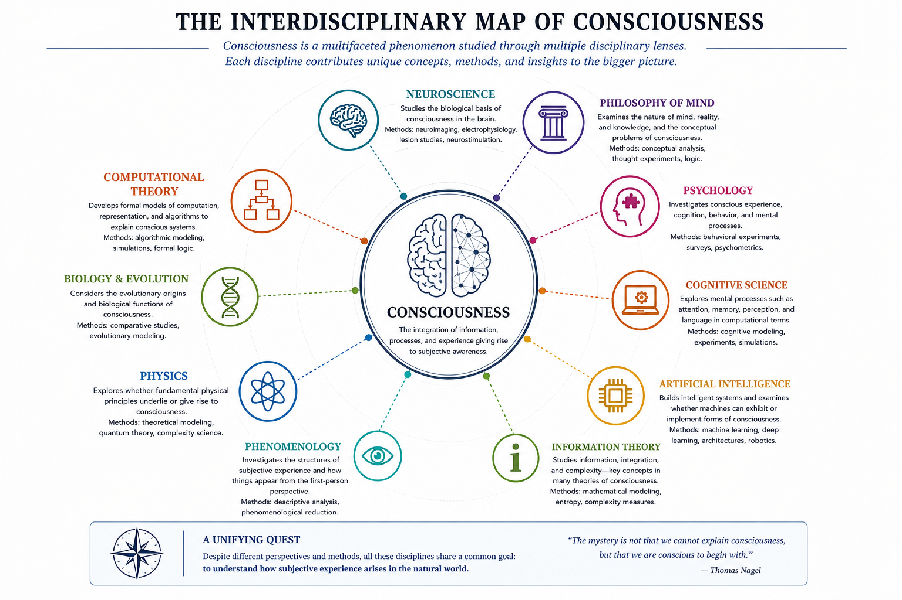
```

As shown in Figure \@ref(fig:fig-interdisciplinary-map), consciousness studies extend across multiple domains of inquiry, ranging from empirical neuroscience and cognitive science to phenomenology, metaphysics, computational theory, and physics. Some approaches focus primarily on neural mechanisms and cognitive functions, while others emphasize subjective experience, embodiment, information integration, or the fundamental nature of reality itself. The diversity of these perspectives reflects one of the central challenges of consciousness research: different theories often attempt to explain different dimensions of conscious experience using fundamentally different conceptual assumptions and explanatory strategies.

The chapters that follow examine classical and contemporary approaches, including dualism, physicalism, functionalism, emergentism, Global Workspace Theory, Integrated Information Theory, Higher-Order Thought Theory, Predictive Processing, Recurrent Processing Theory, Attention Schema Theory, computational and Bayesian approaches, panpsychism, illusionism, embodied and enactive theories, and quantum theories of consciousness. Additional chapters explore altered states, anesthesia, disorders of consciousness, artificial intelligence, machine consciousness, and comparative evaluations of competing frameworks.


## Guiding Questions

Several foundational questions guide this book:

- What is consciousness?
- What distinguishes conscious from unconscious mental activity?
- How are subjective experience and objective brain activity related?
- Can consciousness be fully explained scientifically?
- Does explaining cognition also explain experience?
- What are the neural correlates of consciousness?
- Can a machine be conscious?
- Do non-human animals possess consciousness?
- What happens to consciousness during sleep, dreaming, anesthesia, coma, meditation, or psychedelic states?
- Is consciousness emergent, computational, biological, relational, or fundamental?
- Which theories explain conscious access, and which attempt to explain phenomenal experience itself?

## Methodological Approach

Each theory is evaluated using several recurring criteria:

- explanatory scope;
- conceptual clarity;
- empirical support;
- neuroscientific plausibility;
- computational or mathematical precision;
- treatment of phenomenal experience;
- explanatory power regarding the hard problem;
- falsifiability and testability;
- applicability to altered states, animal consciousness, and artificial intelligence;
- metaphysical assumptions and philosophical costs.

The purpose of these criteria is not to reduce all theories to a single ranking system, but to create a structured framework for comparison across diverse intellectual traditions.

## Scope of the Book

This book covers neuroscientific, philosophical, computational, informational, embodied, and physical approaches to consciousness. Some theories attempt to explain consciousness through large-scale neural dynamics and cognitive architecture, while others propose formal informational structures, embodied interactions, or even fundamental physical properties underlying experience.

The book includes both mainstream scientific theories and more controversial or speculative approaches. These are included not because they are equally accepted, but because understanding consciousness requires engagement with the full landscape of serious theoretical proposals.

Special attention is given throughout the book to the distinction between:

- consciousness and intelligence;
- consciousness and attention;
- consciousness and self-awareness;
- access consciousness and phenomenal consciousness;
- neural correlates and explanatory mechanisms;
- simulation and genuine experience.

Later chapters also examine whether current theories genuinely explain subjective experience itself or instead explain only the functional and behavioural correlates associated with awareness.

## Who This Book Is For

This book is intended for:

- graduate and advanced undergraduate students;
- researchers in neuroscience, philosophy, psychology, and AI;
- interdisciplinary scholars;
- educators and seminar instructors;
- intellectually curious readers seeking a deeper understanding of consciousness studies.

Although the book assumes some familiarity with scientific and philosophical reasoning, it is written to remain accessible to motivated readers from different academic backgrounds.

## What This Book Is Not

This book does not claim to solve consciousness. Nor does it assume that consciousness can necessarily be reduced entirely to one explanatory framework. It does not dismiss philosophy in favour of neuroscience, nor neuroscience in favour of speculative metaphysics. Instead, the book attempts to treat competing perspectives seriously while critically evaluating their explanatory strengths and weaknesses.

## How to Use This Book

Readers may approach the book in several ways:

1. As a chapter-by-chapter introduction to individual theories of consciousness.
2. As a comparative framework for evaluating competing theories.
3. As a reference for interdisciplinary research and seminar discussion.
4. As a foundation for exploring unresolved problems in neuroscience, philosophy of mind, and artificial intelligence.

Each chapter includes discussions of:

- historical development;
- conceptual foundations;
- empirical evidence;
- explanatory strengths;
- major criticisms;
- unresolved gaps;
- implications for artificial intelligence and altered states;
- what the theory can and cannot currently explain.

The final comparative chapters synthesize the major themes of the book and evaluate whether existing theories genuinely address the deepest problems of consciousness or instead explain only selected dimensions of conscious cognition.

Whether consciousness ultimately proves reducible, emergent, fundamental, embodied, relational, computational, or partially beyond current scientific explanation, the attempt to understand it continues to reshape how humanity understands mind, selfhood, intelligence, and reality itself.

<!--chapter:end:01-preface.Rmd-->

# Introduction to Consciousness Studies {#intro}

## Chapter Overview

Consciousness is both the most familiar feature of human life and one of the most difficult phenomena to explain. Every perception, emotion, memory, scientific observation, mathematical proof, and philosophical reflection appears within conscious awareness. Yet the nature of consciousness itself remains deeply contested.

Modern science has been remarkably successful in explaining physical systems, biological evolution, neural mechanisms, information processing, and complex behaviour. However, subjective experience — the felt quality of awareness itself — continues to raise unusual conceptual and scientific challenges. A person can describe seeing colour, hearing music, feeling pain, imagining the future, remembering the past, or reflecting on the self. What remains difficult is explaining why and how physical processes in the brain are accompanied by first-person experience at all.

This difficulty has made consciousness one of the central problems in philosophy of mind, neuroscience, psychology, cognitive science, artificial intelligence, phenomenology, and medicine. It is not only a question about how the brain works. It is also a question about how objective descriptions of the world relate to subjective experience. As Thomas Nagel famously argued, there appears to be “something it is like” to be a conscious organism, and this subjective character of experience is not easily captured by purely objective description [@nagel1974].

This chapter introduces the foundations of consciousness studies. It explains why consciousness matters, why it is difficult to study, how different disciplines approach it, and how the theories discussed in this book will be evaluated.

## Learning Objectives

After reading this chapter, the reader should be able to:

* Explain why consciousness presents distinctive scientific and philosophical challenges.
* Distinguish several major meanings of consciousness.
* Describe why consciousness research is interdisciplinary.
* Explain the difference between the easy problems and the hard problem of consciousness.
* Understand why theories of consciousness often differ in their explanatory goals.
* Identify the evaluative framework used throughout this book.

## Why Consciousness Matters

Consciousness matters because it is central to human life, scientific inquiry, medicine, ethics, and technology. Questions about consciousness shape debates about personal identity, free will, moral responsibility, suffering, animal minds, artificial intelligence, and the nature of reality itself.

In medicine, consciousness has direct practical importance. Anesthesia, coma, dementia, psychiatric illness, pain management, disorders of consciousness, and end-of-life care all require some understanding of the relation between brain activity and conscious awareness. Clinical work with patients who cannot communicate normally has shown how difficult it can be to distinguish wakefulness, responsiveness, awareness, and subjective experience [@laureys2005; @owen2006].

Consciousness has also become increasingly important in debates about artificial intelligence. As artificial systems become more capable of language use, learning, reasoning, and self-monitoring, researchers increasingly ask whether intelligence alone could ever be sufficient for consciousness. These questions connect consciousness studies with wider debates about personhood, moral status, artificial suffering, autonomy, and responsibility [@dehaene2017; @butlin2023].

For these reasons, consciousness is not merely an abstract philosophical topic. It has implications for science, medicine, ethics, technology, and society.

## Consciousness as an Interdisciplinary Problem

Consciousness research sits at the intersection of multiple disciplines. Neuroscience investigates brain mechanisms associated with conscious states. Psychology studies perception, attention, emotion, memory, and behaviour. Cognitive science examines information processing and mental architecture. Philosophy analyzes subjectivity, explanation, identity, and the relation between mind and matter. Phenomenology studies lived experience from the first-person point of view. Artificial intelligence raises questions about whether consciousness could exist in non-biological systems.

```{r fig-interdisciplinary-map-intro, echo=FALSE, fig.cap="An interdisciplinary conceptual map of consciousness research. Contemporary approaches emerge from neuroscience, philosophy, psychology, artificial intelligence, phenomenology, physics, biology, and information theory. Different disciplines emphasize different explanatory targets, methods, and assumptions regarding conscious experience.", out.width="95%", fig.align="center"}

```

Figure @ref(fig:fig-interdisciplinary-map-intro) illustrates why consciousness cannot be easily confined to one field. Different disciplines often study different aspects of consciousness. Some focus on neural mechanisms, behaviour, and reportability. Others focus on subjective experience, embodiment, selfhood, meaning, or metaphysical interpretation.

This diversity helps explain why consciousness studies remains theoretically pluralistic. Researchers do not always disagree because one side has evidence and the other does not. They often disagree because they are trying to explain different aspects of consciousness.

## Why Consciousness Is Difficult to Study

Consciousness is difficult to study because it involves both first-person experience and third-person explanation. Science usually depends on public observation, measurement, experiment, and objective description. Conscious experience, however, is directly available only to the subject who has it.

Researchers can measure neural activity, observe behaviour, collect verbal reports, and build computational models. These methods are powerful, but none of them gives direct access to another person’s experience itself. This creates a methodological challenge: consciousness must be studied through relations among subjective reports, brain activity, behaviour, physiology, and theory.

The difficulty is increased by the fact that consciousness is not a single simple property. Wakefulness, awareness, attention, self-consciousness, reportability, and phenomenal experience can come apart in unusual cases. A person may be awake but minimally aware. A dreamer may be conscious without responding to the external world. An anesthetized patient may show residual neural processing without reportable experience. Neurological injury, sleep, meditation, psychiatric illness, and altered states can all reveal dissociations among different dimensions of consciousness [@laureys2005; @koch2016; @seth2018].

These cases suggest that consciousness may not have one simple explanation. Instead, it may require multiple levels of analysis.

## Multiple Levels of Explanation

Consciousness research often operates across several explanatory levels at once. These include neural mechanisms, cognitive functions, computational processes, bodily regulation, phenomenological structure, information integration, and philosophical interpretation.

```{r fig-levels-intro, echo=FALSE, fig.cap="Multiple explanatory levels in consciousness research. Contemporary theories often emphasize neural, computational, phenomenological, embodied, informational, biological, or metaphysical dimensions simultaneously.", out.width="88%", fig.align="center"}
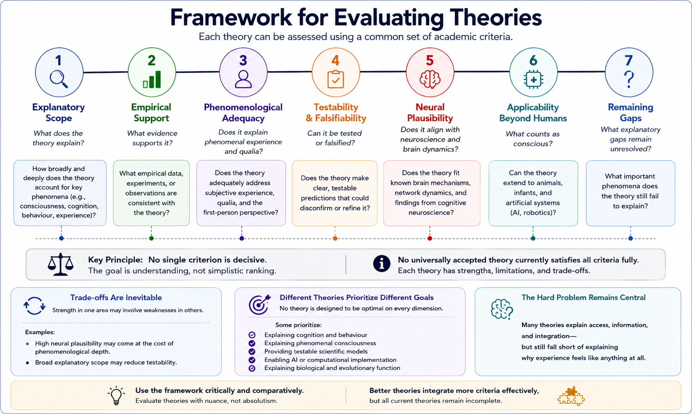
```

Figure @ref(fig:fig-levels-intro) introduces a central theme of this book: consciousness may not be fully explainable at one level alone. Neural mechanisms matter, but they may not by themselves answer questions about subjective experience. Computational models may explain information processing, but they may not fully explain feeling. Phenomenology describes lived experience, but it must still be related to brain, body, and world.

Different theories of consciousness often differ because they privilege different levels of explanation. Some theories emphasize neural dynamics. Others emphasize global access, information integration, higher-order representation, prediction, embodiment, or metaphysical structure. Understanding these differences is essential before comparing theories fairly.

## Defining Consciousness

There is no single universally accepted definition of consciousness. The word is used in several overlapping ways.

In one sense, consciousness means **wakefulness**: being awake rather than asleep, anesthetized, or comatose. In another sense, it means **awareness**: responsiveness to oneself or the environment. A more philosophically important sense is **subjective experience**: the fact that there is something it is like to see, hear, feel, think, or suffer. Consciousness can also refer to **self-consciousness**, meaning awareness of oneself as the subject of experience, or to **reflective consciousness**, meaning awareness of one’s own mental states.

A major distinction in modern philosophy is between **phenomenal consciousness** and **access consciousness**. Phenomenal consciousness refers to qualitative experience: colour, sound, pain, emotion, bodily feeling, and the sense of presence. Access consciousness refers to information being available for reasoning, report, memory, and action [@block1995].

These meanings overlap, but they should not be treated as identical. Confusion often arises when a theory explains one meaning of consciousness but is taken to have explained all of them. For example, a theory may explain reportability or attention without fully explaining subjective experience. Another theory may focus on phenomenology while remaining difficult to test empirically.

## The Easy Problems and the Hard Problem

One of the most influential distinctions in contemporary consciousness studies is David Chalmers’ distinction between the easy problems and the hard problem of consciousness [@chalmers1995; @chalmers1996].

The easy problems concern functions that appear open to ordinary scientific explanation. These include attention, memory access, perceptual discrimination, behavioural report, wakefulness, cognitive control, and information integration. These problems are not easy in a practical sense. They may be scientifically complex. They are called “easy” because they seem explainable in terms of mechanisms, functions, and causal processes.

The hard problem concerns subjective experience itself. Why should neural activity or information processing feel like anything from the inside? Why is there something it is like to see red, feel pain, hear music, or have a sense of self?

```{r fig-easy-hard-intro, echo=FALSE, fig.cap="The distinction between easy and hard problems of consciousness. Easy problems concern cognitive and functional explanation, while the hard problem concerns subjective experience itself.", out.width="90%", fig.align="center"}
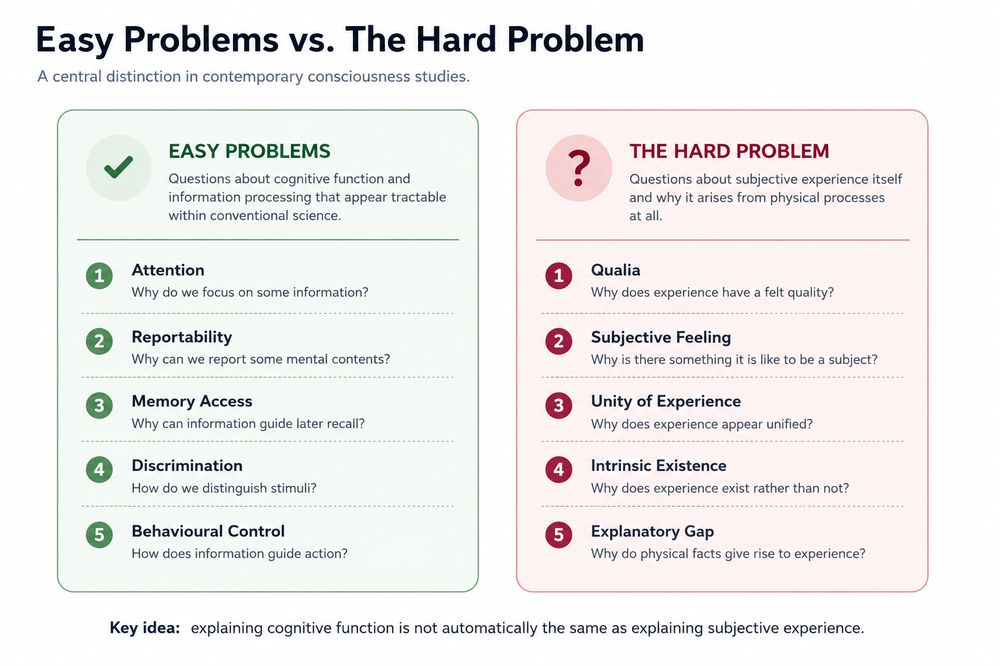
```

Figure @ref(fig:fig-easy-hard-intro) summarizes this distinction. Many theories make progress on the easy problems by explaining behaviour, attention, reportability, and information access. The deeper disagreement concerns whether such explanations also account for phenomenal experience.

The hard problem is closely related to the **explanatory gap**: the apparent difficulty of deriving first-person experience from objective physical description alone [@levine1983]. Some theories attempt to close this gap. Others argue that the gap reflects a limitation in physicalist explanation. Still others deny that the hard problem is a genuine problem in the first place [@dennett1991; @frankish2016].

## Neural Correlates of Consciousness

A major scientific approach to consciousness focuses on the **neural correlates of consciousness**, often called NCCs. These are the minimal neural mechanisms associated with specific conscious experiences [@crick1990; @koch2016].

NCC research uses experimental paradigms such as visual masking, binocular rivalry, inattentional blindness, sleep and dreaming, anesthesia, disorders of consciousness, metacognition, and altered states. Advances in neuroimaging, electrophysiology, computational neuroscience, and anesthesiology have made consciousness research increasingly empirical [@dehaene2011; @seth2018].

However, identifying neural correlates is not the same as providing a complete theory of consciousness. Neural correlates may show when consciousness occurs, which brain systems are involved, and how conscious states change. They may not, by themselves, explain why subjective experience exists. This distinction between correlation and explanation will appear throughout the book.

## Why Theories of Consciousness Differ

Theories of consciousness differ because they often aim at different explanatory targets. Some theories focus on conscious access: how information becomes available for reasoning, report, and action. Others focus on phenomenal experience: why mental states feel like something. Some emphasize neural mechanisms, while others emphasize computation, embodiment, selfhood, biological regulation, or metaphysical foundations.

For example, Global Workspace Theory emphasizes the broadcasting of information across cognitive systems [@baars1988; @dehaene2011]. Integrated Information Theory emphasizes the structure and integration of experience [@tononi2004; @oizumi2014]. Higher-Order theories emphasize awareness of mental states [@rosenthal2005; @lau2011]. Predictive Processing emphasizes inference and generative modeling [@friston2010; @clark2013]. Recurrent Processing Theory emphasizes local recurrent neural activity as central to conscious perception [@lamme2006]. Attention Schema Theory explains consciousness in terms of the brain’s model of attention [@graziano2013]. Embodied and enactive theories emphasize the organism’s active engagement with its environment [@varela1991; @thompson2007]. Panpsychism addresses the metaphysical question of whether consciousness, or proto-consciousness, is a basic feature of reality [@goff2017].

```{r fig-theoretical-landscape, echo=FALSE, fig.cap="A conceptual landscape of major theoretical approaches to consciousness. Different theories emphasize neural mechanisms, computation, embodiment, information integration, cognition, or metaphysical structure. Many disagreements arise because theories prioritize different explanatory targets.", out.width="95%", fig.align="center"}
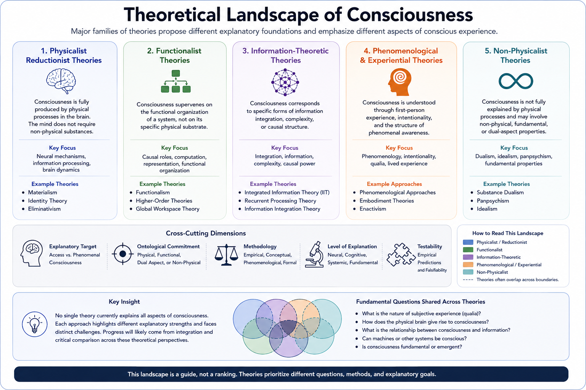
```

Figure @ref(fig:fig-theoretical-landscape) provides a simplified overview of these theoretical families. The important point is that theories should not be compared as though they all answer exactly the same question. A theory may be strong in explaining cognition but weaker in explaining phenomenology. Another may be philosophically ambitious but empirically difficult to test.

## Framework for Evaluating Theories

Because theories of consciousness differ in their aims, this book evaluates them using several criteria rather than a single ranking. A theory may be empirically powerful but philosophically incomplete. Another may be phenomenologically rich but difficult to test. Another may be computationally precise but biologically uncertain.

```{r fig-evaluation-framework-intro, echo=FALSE, fig.cap="Framework for evaluating theories of consciousness. Theories can be assessed according to explanatory scope, empirical support, phenomenological adequacy, testability, neural plausibility, applicability beyond humans, and remaining explanatory gaps. No single criterion is decisive.", out.width="95%", fig.align="center"}
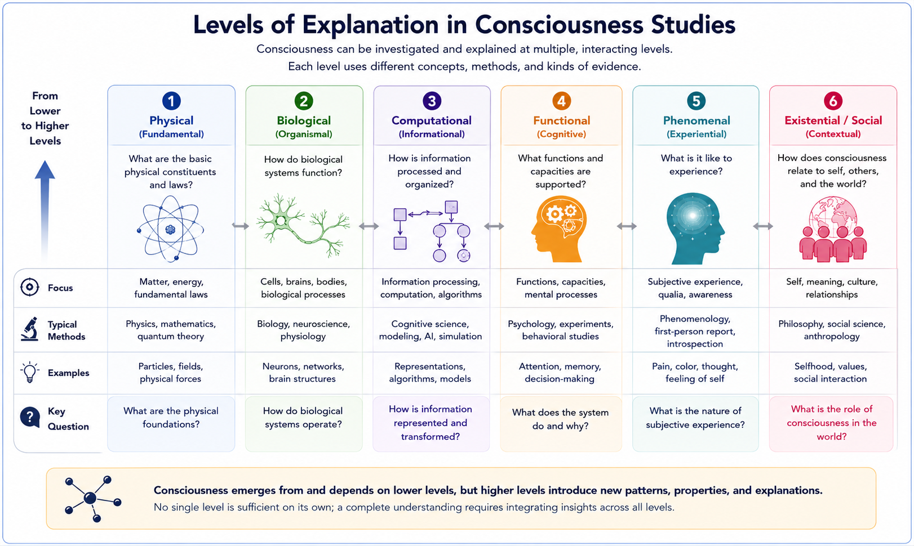
```

Figure @ref(fig:fig-evaluation-framework-intro) introduces the evaluative framework used throughout this book. Each theory will be considered in terms of its explanatory scope, empirical support, phenomenological adequacy, testability, neural plausibility, relevance to non-human animals or artificial intelligence, and remaining explanatory gaps.

The goal is not to declare a simple winner. The goal is to understand what each theory explains, what it leaves unresolved, and how it relates to other approaches.

## Artificial Intelligence and Machine Consciousness

Artificial intelligence raises new questions for consciousness studies. A system may display intelligent behaviour, language ability, planning, learning, and sophisticated information processing. Yet it remains unclear whether such capacities are sufficient for subjective experience.

Different theories imply different criteria for machine consciousness. Some approaches suggest that consciousness may depend on computation, information integration, self-modeling, or global availability. Others argue that biological embodiment, affect, homeostasis, or organism-environment interaction may be necessary [@dehaene2017; @butlin2023].

These debates are not merely technical. If artificial systems could become conscious, then questions about artificial suffering, moral status, responsibility, and rights would become increasingly important. If they cannot become conscious, then it remains important to explain why intelligence and consciousness come apart.

## Contemporary State of the Field

Contemporary consciousness studies remains theoretically pluralistic. No single theory currently commands universal agreement. Competing frameworks differ not only in proposed mechanisms, but also in definitions of consciousness, explanatory targets, methodological assumptions, and philosophical commitments.

At the same time, consciousness research has become increasingly empirical. Questions once treated mainly as philosophical now intersect with neuroscience, anesthesiology, psychiatry, complexity science, artificial intelligence, and computational modeling. This does not mean that the philosophical problems have disappeared. Rather, it means that philosophical questions and scientific methods increasingly shape one another.

Theoretical diversity should not necessarily be viewed as a weakness. Consciousness may involve multiple interacting dimensions requiring explanation across neural, computational, phenomenological, embodied, biological, and philosophical levels simultaneously.

## Structure of the Book

The chapters that follow move from foundational problems to major theories and then to comparative evaluation.

The early chapters introduce the hard problem, the historical development of consciousness studies, and major philosophical positions such as dualism, materialism, physicalism, functionalism, and emergentism. The middle chapters examine contemporary theories, including Global Workspace Theory, Integrated Information Theory, Higher-Order Thought Theory, Predictive Processing, Recurrent Processing Theory, Attention Schema Theory, computationalism, the Bayesian brain, panpsychism, quantum approaches, illusionism, and embodied or enactive theories.

Later chapters apply these debates to anesthesia, disorders of consciousness, altered states, artificial intelligence, comparative theory evaluation, unresolved explanatory problems, and future directions.

The purpose of this book is not simply to identify which theory is correct. It is to clarify what different theories attempt to explain, why they disagree, which problems have been partially solved, and why consciousness continues to resist simple reduction to any single explanatory framework.

Consciousness studies should therefore be understood as a multidimensional and evolving field. Neuroscience, philosophy, phenomenology, computation, embodiment, medicine, and artificial intelligence do not merely compete with one another. They provide different windows onto one of the deepest questions in science and philosophy: how experience fits into the natural world.

<!--chapter:end:02-introduction.Rmd-->

# The Hard Problem of Consciousness {#hard-problem}

## Chapter Overview

Among all problems in contemporary philosophy, neuroscience, and cognitive science, few have generated as much debate as the question of why conscious experience exists at all. Human beings can increasingly describe neural activity, information processing, behaviour, cognition, and computational mechanisms with remarkable scientific precision. Yet the existence of subjective experience — the felt quality of perception, emotion, thought, and awareness — continues to resist straightforward explanation.

A scientist may identify the neural pathways involved in colour vision, model perceptual processing computationally, and predict behavioural responses experimentally. Yet a further question appears to remain: why should any of these physical or computational processes be accompanied by experience in the first place? Why should seeing red feel like anything at all? Why should pain hurt rather than merely trigger avoidance behaviour? Why is there something it is like to be a conscious subject?

The hard problem of consciousness concerns these questions. It asks why and how physical processes are accompanied by subjective experience. The problem is most closely associated with David Chalmers, who distinguished the “easy problems” of consciousness from the “hard problem” of subjective experience [@chalmers1995; @chalmers1996]. However, related concerns appear throughout the history of philosophy, especially in debates about mind, matter, subjectivity, and the limits of scientific explanation.

This chapter explains the hard problem, its relation to the explanatory gap, the role of qualia and thought experiments, major responses to the problem, and criticisms of the hard problem itself.

## Learning Objectives

After reading this chapter, the reader should be able to:

* Distinguish the hard problem from the easy problems of consciousness.
* Explain the explanatory gap.
* Describe the role of qualia in debates about consciousness.
* Summarize major thought experiments related to the hard problem.
* Compare philosophical and scientific responses to the hard problem.
* Explain major criticisms of the hard problem.
* Understand why the debate persists across philosophy, neuroscience, and cognitive science.

## The Basic Distinction

The hard problem is best understood by first distinguishing between two kinds of explanation. Many scientific explanations of consciousness focus on cognitive and functional processes. These include attention, memory, reportability, behavioural control, perceptual discrimination, and information integration. These are difficult scientific problems, but they appear to fit familiar forms of explanation: one can investigate mechanisms, build models, test predictions, and identify causal processes.

Chalmers called these the “easy problems” of consciousness, not because they are simple, but because they seem explainable using standard scientific methods [@chalmers1995]. The hard problem is different. It concerns why these mechanisms are accompanied by subjective experience at all.

```{r fig-easy-hard-hardchapter, echo=FALSE, fig.cap="The distinction between the easy problems and the hard problem of consciousness. Many contemporary theories explain cognitive and functional aspects of consciousness while differing on whether they explain subjective experience itself.", out.width="92%", fig.align="center"}

```

Figure @ref(fig:fig-easy-hard-hardchapter) illustrates this basic distinction. A theory may explain attention, information access, behavioural report, or memory integration while leaving open the question of why those processes are experienced from the inside.

This is why the hard problem occupies a central place in consciousness studies. It marks the point where explanations of function appear to leave something out: the qualitative, first-person character of experience.

## The Central Conceptual Tension

The hard problem arises from a tension among three explanatory domains: brain activity, cognitive or informational processing, and subjective experience. Neuroscience can investigate brain activity. Cognitive science can model information processing and behaviour. Phenomenology and philosophy can describe the structure of experience. The challenge is explaining how these domains relate to one another.

```{r fig-central-triangle, echo=FALSE, fig.cap="The central conceptual triangle underlying consciousness studies. Many theories explain neural activity or cognitive function successfully while remaining divided on how subjective experience emerges from these processes.", out.width="88%", fig.align="center"}
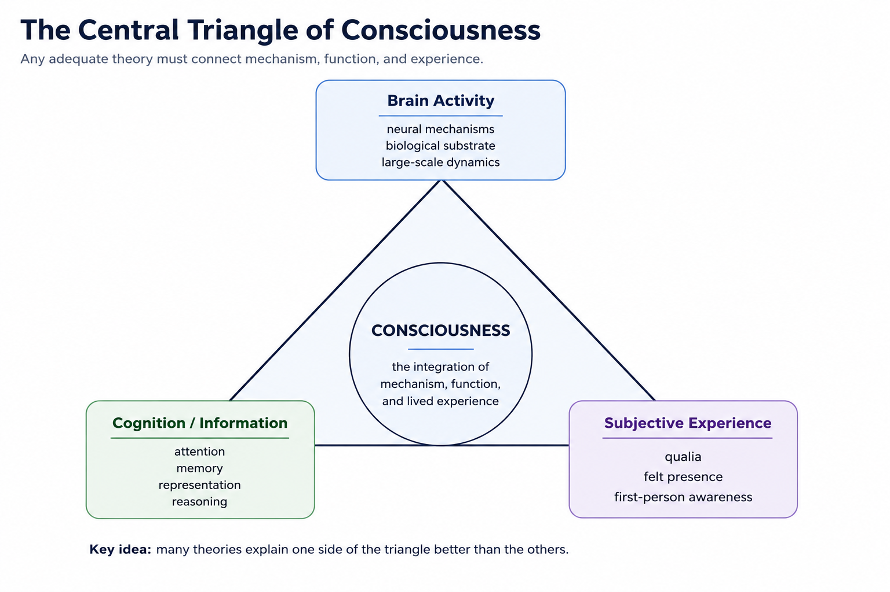
```

Figure @ref(fig:fig-central-triangle) summarizes this conceptual structure. Many theories explain the relation between brain activity and cognitive function. Others describe subjective experience in detail. The most difficult question is how subjective experience fits into the same explanatory framework as neural and cognitive processes.

This does not mean that neuroscience or cognitive science is irrelevant. On the contrary, empirical research has greatly improved our understanding of the conditions under which consciousness appears, disappears, and changes. The hard problem concerns whether these empirical explanations are sufficient to explain experience itself.

## Historical Background

Questions about the relation between mind and matter long predate contemporary neuroscience. René Descartes argued that conscious thought could not be reduced to extended physical matter, thereby giving one influential formulation of mind-body dualism [@descartes1641]. Later philosophers challenged, revised, or rejected dualism, but the basic question remained: how should subjective experience be understood in relation to the physical world?

In the twentieth century, consciousness became less central within psychology during the rise of behaviourism. Behaviourists emphasized observable behaviour and often avoided appeals to subjective experience. The later cognitive revolution reintroduced internal mental processes, including representation, memory, attention, and information processing, into scientific psychology [@miller2003]. However, the reintroduction of cognition did not fully resolve the problem of subjective experience.

Modern debates about the hard problem were shaped especially by Thomas Nagel, Frank Jackson, Joseph Levine, and David Chalmers. Nagel argued that conscious experience has an irreducibly subjective character: there is something it is like to be a conscious organism, and this first-person character cannot be fully captured from an objective third-person perspective [@nagel1974]. Jackson’s Mary’s Room thought experiment questioned whether complete physical knowledge is sufficient for knowing what an experience is like [@jackson1982]. Levine introduced the language of the explanatory gap to describe the apparent gap between physical explanation and subjective experience [@levine1983]. Chalmers then formalized these concerns through the distinction between easy problems and the hard problem [@chalmers1995; @chalmers1996].

## The Easy Problems

The easy problems concern the explanation of cognitive functions and behavioural capacities associated with consciousness. These include discrimination of stimuli, integration of information, verbal report, attention, memory access, behavioural control, metacognition, and the coordination of perception and action.

These problems are scientifically difficult. Explaining attention, memory, perception, or self-monitoring requires complex neuroscience, psychology, and computational modeling. They are called “easy” only in a relative philosophical sense: they appear compatible with ordinary forms of mechanistic explanation.

For example, a theory might explain how visual information is processed in the brain, how attention selects certain stimuli, how information becomes available for report, and how behaviour is guided by internal representations. Such explanations may be highly successful. Yet Chalmers argues that they do not automatically explain why any of these processes should be accompanied by subjective experience [@chalmers1995].

## The Hard Problem

The hard problem asks why physical or functional processes are accompanied by experience. A complete neuroscientific account of colour vision might describe wavelengths, retinal processing, visual cortex activation, attention, categorization, memory, and verbal report. Yet the question remains: why should any of this feel like seeing red?

Similarly, a complete account of pain processing might describe nociceptors, spinal pathways, thalamic processing, cortical activation, avoidance behaviour, and verbal reports of pain. But why should pain hurt? Why should there be an unpleasant felt quality rather than merely information processing and behavioural output?

The hard problem therefore concerns not only what the brain does, but why brain activity is accompanied by subjective awareness. It is closely connected to the idea that neural correlates of consciousness, while important, are not automatically complete explanations of consciousness. A neural correlate may tell us when a conscious experience occurs or which brain systems are involved, but correlation alone does not explain why the experience exists.

## Why the Hard Problem Feels Different

Many scientific explanations describe structure, mechanism, causation, and function. Physics explains motion and forces. Chemistry explains reactions and bonding. Biology explains cells, organs, metabolism, and evolution. These explanations proceed by describing objective relations among measurable entities and processes.

Consciousness appears different because it involves subjective feeling itself. A neuroscientific explanation may describe neural firing, information processing, behavioural responses, and cognitive integration. Yet it may still seem to leave out the qualitative character of experience: what the experience is like from the inside.

This is the source of the hard problem’s philosophical force. It is not merely that consciousness is complicated. Many scientific problems are complicated. The hard problem appears distinctive because it concerns the relation between objective explanation and subjective experience.

## The Explanatory Gap

The apparent difficulty of deriving subjective experience from objective physical description is known as the explanatory gap [@levine1983]. The gap arises because scientific descriptions are usually third-personal, public, measurable, structural, and quantitative. Conscious experience, by contrast, appears first-personal, qualitative, private, and lived.

A complete neural description may identify when consciousness occurs, how conscious states change, and which mechanisms participate. However, it may not fully explain why experience exists at all. This is why the explanatory gap remains central to debates about consciousness.

Some philosophers argue that the explanatory gap reveals a deep limitation in physicalist explanation. Others argue that it reflects our current ignorance rather than an in-principle barrier. Still others claim that the gap is produced by misleading intuitions about introspection and the nature of experience [@dennett1991; @frankish2016].

## Phenomenal and Access Consciousness

One important distinction in this debate is between phenomenal consciousness and access consciousness [@block1995].

**Phenomenal consciousness** refers to subjective experience itself: the qualitative feeling of seeing, hearing, touching, thinking, or suffering. It concerns what experience is like from the first-person perspective.

**Access consciousness** refers to the availability of information for reasoning, report, memory, decision-making, and behavioural control. A mental state is access-conscious when its content can be used by cognitive systems.

This distinction matters because many theories explain access consciousness more directly than phenomenal consciousness. For example, a theory may explain how information becomes available for report and action without fully explaining why that information is experienced. The distinction between phenomenal and access consciousness therefore helps clarify why theories that seem successful in one respect may still be criticized from another perspective.

## Qualia and Subjective Experience

A central concept associated with the hard problem is **qualia**. Qualia are the qualitative or experiential features of conscious states: the redness of red, the bitterness of coffee, the warmth of sunlight, the sound of music, or the painfulness of pain.

The concept of qualia is controversial. Some philosophers treat qualia as central data that any theory of consciousness must explain. Others argue that the traditional notion of qualia is confused, exaggerated, or misleading [@dennett1991]. Illusionists, for example, argue that people mistakenly interpret introspective representations as evidence for irreducible inner properties [@frankish2016].

Despite these disagreements, qualia remain important because they focus attention on what seems most difficult to explain: the felt character of experience. A purely physical description of colour vision may include wavelengths, cones, opponent processing, cortical activation, and behavioural discrimination. Yet many philosophers argue that such a description does not by itself capture what red looks like to a subject.

## Thought Experiments and the Hard Problem

Several influential thought experiments have shaped debates about the hard problem. These thought experiments do not function as empirical experiments. Rather, they are designed to test intuitions about the relation between physical facts, functional organization, and subjective experience.

### Philosophical Zombies

A philosophical zombie is a hypothetical being physically and behaviourally identical to a conscious human but entirely lacking subjective experience. Such a being would speak, react, learn, and behave just like a conscious person, but there would be nothing it is like to be that being.

The zombie argument is associated especially with Chalmers [@chalmers1996]. Its purpose is to challenge the assumption that physical or functional equivalence automatically entails consciousness. If zombies are conceivable, Chalmers argues, then consciousness may not be logically entailed by the physical facts alone.

Critics reject this argument in different ways. Some argue that zombies are not genuinely conceivable. Others argue that conceivability does not establish metaphysical possibility. Functionalists and physicalists often claim that a being physically and functionally identical to a conscious person would necessarily be conscious [@dennett1991].

### Mary’s Room

Frank Jackson’s Mary’s Room thought experiment imagines a scientist named Mary who knows all the physical facts about colour vision but has lived her entire life in a black-and-white environment. When Mary finally sees red for the first time, does she learn something new?

If Mary learns something new, the argument suggests that complete physical knowledge may not be sufficient for knowing subjective experience [@jackson1982]. This is known as the knowledge argument.

Physicalists have responded in several ways. Some argue that Mary gains a new ability rather than new factual knowledge. Others argue that she gains a new mode of presentation of an already known fact. Still others argue that the thought experiment exaggerates what it would mean to know all physical facts.

### Nagel’s Bat

Thomas Nagel’s famous example asks what it is like to be a bat [@nagel1974]. Bats perceive the world partly through echolocation, a sensory modality very different from ordinary human perception. Nagel argues that even complete objective knowledge of bat neurobiology and behaviour may not reveal the subjective character of bat experience.

The point is not merely that humans cannot imagine bat experience accurately. The deeper point is that subjective experience seems tied to a particular point of view. Objective science aims to describe the world independently of particular perspectives, while consciousness appears essentially perspectival.

### Inverted Spectrum

The inverted spectrum thought experiment asks whether two people could be physically or functionally similar while having systematically different colour experiences. For example, one person’s experience of red might be internally like another person’s experience of green, even though both use colour words and behave normally.

The thought experiment is controversial, but it highlights a central issue: behavioural and functional similarity may not obviously settle questions about phenomenal character. It is often used to challenge theories that identify consciousness entirely with function or reportability.

## Why the Hard Problem Matters

The hard problem matters because a theory of consciousness can appear successful while explaining only the functions associated with consciousness. A theory may explain attention, reportability, memory access, behavioural control, or information integration without explaining why these processes are accompanied by experience.

This distinction has practical importance. In disorders of consciousness, clinicians may observe wakefulness, responsiveness, or neural activity while still facing difficult questions about awareness and experience [@laureys2005; @owen2006]. In anesthesia, researchers may identify changes in brain dynamics while still asking how these changes relate to the presence or absence of experience [@koch2016; @seth2018]. In artificial intelligence, a system may process information, generate language, recognize patterns, and report internal states while leaving unresolved whether it possesses subjective experience [@dehaene2017; @butlin2023].

The hard problem therefore influences debates about machine consciousness, animal consciousness, disorders of consciousness, anesthesia, pain, suffering, and moral status.

## Criticisms of the Hard Problem

Not all philosophers and scientists accept the hard problem as a genuine explanatory problem. Some argue that it identifies a real limitation in current science. Others argue that it is based on misleading intuitions.

Daniel Dennett is one of the most influential critics of traditional approaches to qualia and the hard problem. Dennett argues that consciousness should be explained through cognitive function, information processing, and behavioural capacities rather than by appealing to mysterious private properties [@dennett1991]. From this perspective, the sense that something remains unexplained may result from confused expectations about what an explanation of consciousness should provide.

Illusionism offers a more radical critique. Illusionists argue that phenomenal consciousness, as traditionally conceived, does not exist in the way many philosophers assume [@frankish2016]. According to this view, the brain constructs introspective representations that lead us to believe we possess irreducible phenomenal properties. The task is therefore not to explain mysterious qualia, but to explain why we think we have them.

Other critics argue that the hard problem relies too heavily on intuition and thought experiments. They suggest that introspection may be unreliable, that philosophical conceivability may not reveal metaphysical possibility, and that scientific progress may gradually dissolve the apparent mystery.

## Responses to the Hard Problem

Responses to the hard problem differ because theorists disagree about what consciousness is and what an explanation of consciousness should accomplish.

### Reductionism

Reductionist approaches argue that consciousness will eventually be explained in terms of neuroscience, computation, cognitive science, and physical mechanisms. From this perspective, the hard problem reflects incomplete scientific understanding rather than a permanent barrier. As neuroscience progresses, the gap between physical processes and conscious experience may become less mysterious.

### Functionalism

Functionalist approaches argue that mental states are defined by what they do rather than by what they are made of. On this view, consciousness depends on functional organization, causal role, and information-processing structure rather than on a special non-physical substance [@putnam1967; @fodor1975].

Functionalism is attractive because it allows consciousness to be studied scientifically and potentially applied beyond biological brains. However, critics argue that functionalism may explain access, behaviour, and cognition more easily than phenomenal experience.

### Dualism

Dualist approaches argue that consciousness cannot be fully reduced to physical processes. Substance dualism treats mind and matter as distinct kinds of reality, while property dualism argues that conscious properties are irreducible features associated with physical systems [@descartes1641; @chalmers1996].

Dualism takes the hard problem seriously, but it faces major challenges. In particular, it must explain how consciousness relates causally to the physical world and how non-physical or irreducible experiential properties fit within scientific explanation.

### Panpsychism

Panpsychism proposes that consciousness, or proto-consciousness, may be a fundamental feature of reality rather than something that emerges suddenly from non-conscious matter [@goff2017]. This view attempts to avoid the problem of explaining how experience arises from entirely non-experiential ingredients.

Panpsychism has gained renewed attention in contemporary philosophy, partly because it offers a direct response to the hard problem. However, it faces its own major challenge: the combination problem. If basic entities have primitive forms of experience, how do these combine into unified conscious subjects?

### Illusionism

Illusionism attempts to dissolve rather than solve the hard problem. It argues that phenomenal consciousness, understood as irreducible private qualia, is an illusion generated by cognitive processes [@frankish2016]. The scientific task is to explain why we represent ourselves as having such experiences.

Illusionism has the advantage of fitting naturally with physicalism and cognitive science. However, many critics argue that it fails to take subjective experience seriously enough. If consciousness is an illusion, they ask, who or what is having the illusion?

### Integrated Information Theory

Integrated Information Theory, or IIT, attempts to explain consciousness in terms of integrated informational structure and intrinsic causal organization [@tononi2004; @oizumi2014]. Unlike theories that focus mainly on access or reportability, IIT attempts to connect the structure of experience directly to the structure of integrated information.

IIT is ambitious because it aims to address consciousness as experience rather than merely as function. However, it remains controversial, especially regarding its mathematical commitments, empirical testability, and implications for consciousness in simple systems.

### Global Workspace Theory

Global Workspace Theory explains consciousness in terms of global availability or broadcasting of information across cognitive systems [@baars1988; @dehaene2011]. Information becomes conscious when it is made widely available for reasoning, memory, decision-making, and report.

Global Workspace Theory is strongly connected to cognitive science and neuroscience. It offers a powerful account of conscious access. However, critics argue that it may not fully explain phenomenal consciousness. It may show how information becomes reportable and usable without explaining why it is experienced.

## Why the Debate Persists

The hard problem persists because it concerns the relationship between two different modes of description. Objective science describes structure, mechanism, causation, and function. Conscious experience appears as lived, qualitative, first-person awareness.

The debate also persists because consciousness may not be a single unified phenomenon. Different theories attempt to explain access, integration, reportability, self-modeling, embodiment, cognition, or phenomenal experience. Disagreements sometimes arise because theories are not explaining exactly the same target.

For this reason, some theories try to solve the hard problem directly. Others attempt to dissolve it, reinterpret it, or bypass it by focusing on more empirically tractable aspects of consciousness. Whether the hard problem is a genuine limitation of physical explanation, a temporary scientific gap, or a conceptual misunderstanding remains deeply contested.

## Evaluation

The hard problem remains one of the central dividing lines in consciousness research. It forces every major theory to clarify what it means by consciousness and what kind of explanation it seeks to provide.

A theory that explains attention, reportability, and information access may be powerful, but it must still clarify whether it explains subjective experience. A theory that takes subjective experience as fundamental may address the hard problem directly, but it must still explain how its claims can be connected to empirical science. A theory that rejects the hard problem must explain why the intuition behind it is so persistent.

The hard problem therefore functions not only as a scientific or philosophical challenge, but also as a boundary question about the nature of explanation itself. It asks whether consciousness can be fully understood using the same explanatory tools used elsewhere in science, or whether subjective experience requires a revision in how explanation, reduction, and mind are understood.

## Chapter Summary

The hard problem of consciousness asks why physical, neural, or computational processes are accompanied by subjective experience. It differs from the easy problems, which concern cognitive functions such as attention, reportability, memory access, and behavioural control. The explanatory gap describes the apparent difficulty of deriving first-person experience from third-person physical description.

Thought experiments such as Nagel’s bat, Mary’s Room, philosophical zombies, and the inverted spectrum illustrate why some philosophers believe that functional or physical explanation may leave something out. Critics respond that these arguments rely too heavily on intuition, introspection, or misleading assumptions about qualia.

Major responses to the hard problem include reductionism, functionalism, dualism, panpsychism, illusionism, Integrated Information Theory, and Global Workspace Theory. These approaches differ not only in their proposed explanations, but also in what they take consciousness to be.

The hard problem remains unresolved because it sits at the intersection of science, philosophy, phenomenology, and metaphysics. Whether it represents a genuine barrier, a temporary gap, or a conceptual confusion continues to shape the entire field of consciousness studies.

<!--chapter:end:03-hard-problem.Rmd-->

# Historical Development of Consciousness Research {#history}

## Chapter Overview

The history of consciousness research is also a history of changing assumptions about mind, science, subjectivity, and explanation. Across different periods, consciousness has been understood as a property of the soul, a feature of rational thought, a stream of experience, a subject of introspection, a problem avoided by behaviourism, a form of information processing, a neural phenomenon, and, more recently, a question involving artificial intelligence, embodiment, and complex systems.

This history is not a simple movement from error to truth. Earlier debates continue to shape contemporary theories. Questions about the relation between mind and body, the reliability of introspection, the role of behaviour, the nature of representation, and the limits of physical explanation remain central to consciousness studies today.

Modern discussions of the hard problem, neural correlates of consciousness, artificial intelligence, embodied cognition, and phenomenology all inherit ideas from earlier traditions. Understanding this historical development therefore helps explain why contemporary consciousness studies remains diverse, interdisciplinary, and theoretically unsettled.

This chapter traces the development of consciousness research from classical philosophy to contemporary neuroscience and artificial intelligence. It shows how the field has repeatedly shifted its explanatory focus: from soul and metaphysics, to experience and introspection, to observable behaviour, to cognition and computation, to neural mechanisms, and finally to interdisciplinary theories of consciousness.

## Learning Objectives

After reading this chapter, the reader should be able to:

* Describe major historical phases in consciousness research.
* Explain how the study of consciousness moved from philosophy to psychology, neuroscience, and cognitive science.
* Explain why behaviourism marginalized consciousness as a scientific topic.
* Describe the importance of the cognitive revolution.
* Explain how neuroscience transformed consciousness research.
* Understand why contemporary theories remain diverse and interdisciplinary.
* Recognize how historical debates continue to shape current theories of consciousness.

## Historical Evolution of Consciousness Research

Figure @ref(fig:fig-history-timeline) presents a simplified timeline of major developments in consciousness research.

```{r fig-history-timeline, echo=FALSE, fig.cap="Historical timeline of major developments in consciousness research. Theories evolved across philosophical, psychological, behavioural, computational, neuroscientific, and AI-centered paradigms. Importantly, many earlier ideas continue to influence contemporary debates.", out.width="100%", fig.align="center"} id="dno6wl"
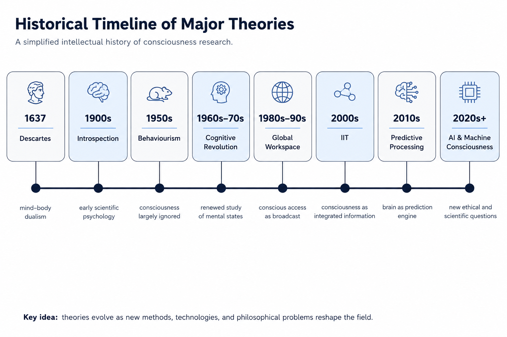
```

As Figure @ref(fig:fig-history-timeline) suggests, the history of consciousness research is not a linear replacement of old ideas by new ones. Instead, concepts are revised, rejected, revived, and integrated across time. Philosophical debates about subjectivity continue within neuroscience. Introspection, once criticized as unscientific, reappears in phenomenology and neurophenomenology. Computational models influence theories of cognition and artificial intelligence, while embodied approaches challenge the idea that consciousness can be explained by internal computation alone.

The field developed through a series of changing questions. Classical philosophy asked how mind relates to soul, reason, and reality. Early modern philosophy asked how subjective thought relates to matter. Nineteenth-century psychology attempted to study experience scientifically through introspection. Behaviourism rejected introspection and focused on observable behaviour. The cognitive revolution reintroduced internal mental processes. Neuroscience later transformed consciousness into an empirical research program. Contemporary theories now combine philosophy, neuroscience, computation, embodiment, phenomenology, and artificial intelligence.

## Changing Questions Across History

Different historical periods did not merely give different answers to the same question. They often asked different questions altogether.

Classical and early modern philosophers asked whether the mind is material or immaterial, how knowledge arises from experience, and whether the self is a stable subject of thought. Early psychologists asked whether conscious experience could be analyzed scientifically. Behaviourists asked how behaviour could be predicted and controlled without appealing to private mental states. Cognitive scientists asked how internal representations and information processing make perception, memory, language, and reasoning possible. Neuroscientists asked which brain mechanisms are associated with conscious awareness. Contemporary theorists ask how consciousness relates to neural dynamics, integrated information, global access, self-modeling, embodiment, and artificial intelligence.

This shifting landscape is important because many disagreements in consciousness studies arise from different explanatory targets. A theory designed to explain reportability may not explain subjective experience. A theory designed to describe lived experience may not easily generate experimental predictions. A theory designed for neuroscience may not settle metaphysical questions. The history of the field helps explain why these differences persist.

## Classical and Early Modern Philosophy

The earliest systematic discussions of consciousness were not framed in modern scientific terms. Ancient and early modern philosophers approached the mind through questions of soul, reason, perception, selfhood, knowledge, and reality. Plato and Aristotle both treated the soul as central to life and cognition, although they understood its relation to the body differently [@platoRepublic; @aristotleDeAnima]. These early debates helped establish the long-standing question of whether mind should be understood as separable from the body or as the organizing principle of living beings.

In early modern philosophy, René Descartes gave one of the most influential formulations of the mind-body problem. Descartes argued that mind and matter are fundamentally different kinds of substance: mind is characterized by thought, while matter is characterized by extension [@descartes1641]. Although Cartesian substance dualism is not widely accepted in contemporary neuroscience, the problem Descartes made famous remains central. How can subjective thought and experience be related to the physical body?

Empiricist philosophers shifted attention toward sensation, perception, and experience. John Locke emphasized the role of experience in the formation of ideas [@locke1689]. David Hume analyzed the self in terms of changing perceptions rather than as a simple, permanent substance [@hume1739]. These traditions helped shape later psychological interest in experience, association, memory, and introspection.

Immanuel Kant added another important dimension by arguing that the mind does not passively receive the world but actively structures experience through forms of intuition and categories of understanding [@kant1781]. Many contemporary ideas about perception as active construction, prediction, and organization echo themes that were already present in Kantian philosophy, even though they are now developed through cognitive science and neuroscience.

Classical and early modern philosophy therefore established several problems that remain central today: the mind-body problem, the nature of subjectivity, the structure of experience, the relation between perception and reality, and the possibility of explaining consciousness within a naturalistic framework.

## Introspection and Early Scientific Psychology

During the nineteenth century, psychology began to emerge as a distinct scientific discipline. Early psychologists attempted to study consciousness directly through controlled introspection. Rather than treating consciousness only as a metaphysical problem, they sought to analyze experience experimentally.

Wilhelm Wundt played a central role in establishing experimental psychology as a scientific field [@wundt1874]. In Wundt’s laboratory tradition, trained observers reported features of experience under controlled conditions. The aim was not casual self-reflection, but disciplined observation of conscious processes.

Edward Titchener later developed structuralism, which attempted to analyze conscious experience into basic elements such as sensations, images, and feelings [@titchener1898]. Structuralists hoped that consciousness could be studied by decomposing experience into its fundamental components.

William James offered a different approach. Rather than treating consciousness as a collection of isolated elements, James described it as a continuous “stream of consciousness” [@james1890]. This idea remains influential because it emphasizes the dynamic, flowing, selective, and personally situated character of experience.

Despite its importance, introspectionist psychology faced major criticisms. Introspective reports varied across observers, were difficult to verify independently, and often lacked the reliability expected in experimental science. Critics argued that private experience could not provide a stable foundation for objective psychology.

Even so, introspection did not disappear completely. Its concerns reappeared later in phenomenology, first-person methods, and neurophenomenology. The early introspectionists showed that consciousness could be approached systematically, even if their methods were limited.

## Behaviourism and the Rejection of Consciousness

In the early twentieth century, behaviourism emerged partly as a reaction against introspection. Behaviourists argued that psychology should focus on observable behaviour rather than private mental states. John B. Watson’s behaviourist manifesto rejected consciousness as a central object of scientific psychology and called for psychology to become a science of behaviour [@watson1913].

Behaviourism emphasized stimulus-response relationships, conditioning, learning, reinforcement, and prediction. Ivan Pavlov’s work on classical conditioning, Edward Thorndike’s work on learning, and B. F. Skinner’s work on operant conditioning strongly shaped this approach [@pavlov1927; @thorndike1911; @skinner1953].

The behaviourist turn greatly increased methodological discipline in psychology. It emphasized operational definitions, measurable behaviour, experimental control, and quantitative analysis. These contributions had lasting value.

However, behaviourism also marginalized consciousness. Because subjective experience could not be directly observed, it was often treated as scientifically unnecessary or inaccessible. Internal mental states were either ignored or reinterpreted in behavioural terms.

Over time, this exclusion became increasingly difficult to sustain. Behaviourism struggled to explain language, reasoning, planning, mental imagery, creativity, and flexible problem-solving. It also had difficulty accounting for the apparent role of internal representation in perception and cognition. These limitations helped prepare the way for the cognitive revolution.

## The Cognitive Revolution

The cognitive revolution of the mid-twentieth century reintroduced internal mental processes into scientific psychology. Researchers began to study attention, memory, language, perception, reasoning, problem-solving, and mental representation using experimental and computational methods.

Several developments contributed to this shift. Computer science provided models of information processing. Cybernetics introduced feedback and control systems. Linguistics challenged behaviourist accounts of language. Information theory gave researchers new ways to think about communication, coding, and signal processing. Together, these fields helped reshape the study of mind.

Noam Chomsky’s critique of Skinner’s account of language was especially influential [@chomsky1959]. Chomsky argued that behaviourist learning theory could not adequately explain the structure, creativity, and productivity of language. This critique helped strengthen the idea that internal cognitive structures must be part of psychological explanation.

The cognitive revolution did not immediately solve the problem of consciousness. Many early cognitive models focused on information processing while avoiding subjective experience. Nevertheless, the cognitive revolution made it scientifically acceptable again to discuss internal mental states. It also created the intellectual foundation for contemporary theories such as Global Workspace Theory, computationalism, predictive processing, and higher-order theories.

The mind was increasingly understood as an information-processing system. This shift opened new ways to study consciousness, but it also introduced a new question: is consciousness itself a form of computation, or does computation explain only some of the functions associated with consciousness?

## Neuroscience and the Search for Neural Correlates

Late twentieth-century neuroscience transformed consciousness research. New technologies made it possible to study the brain in ways earlier researchers could not. Functional magnetic resonance imaging, electroencephalography, intracranial recording, lesion studies, neural stimulation, and computational neuroscience allowed researchers to investigate the neural conditions associated with conscious perception, attention, wakefulness, and altered states.

The search for the neural correlates of consciousness became a major scientific program. Neural correlates of consciousness, or NCCs, are usually understood as the minimal neural mechanisms associated with specific conscious experiences [@crick1990; @koch2016]. Researchers investigated consciousness using paradigms such as visual masking, binocular rivalry, inattentional blindness, sleep and dreaming, anesthesia, coma, disorders of consciousness, metacognition, meditation, and psychedelic states [@dehaene2011; @seth2018].

This empirical turn greatly advanced consciousness studies. It became possible to ask which neural systems are active when a stimulus is consciously perceived, how conscious and unconscious processing differ, how anesthesia disrupts awareness, and how brain injury affects consciousness.

However, the neuroscience of consciousness also revealed a key limitation. Identifying neural correlates is not the same as fully explaining subjective experience. Neural correlates may show when consciousness occurs, which mechanisms participate, and how conscious states change. They do not automatically explain why subjective experience exists. This distinction helped renew interest in philosophical questions such as the explanatory gap and the hard problem.

## The Emergence of the Hard Problem

By the late twentieth century, consciousness research increasingly distinguished between explaining cognitive functions and explaining subjective experience itself. Thomas Nagel argued that consciousness has an essentially subjective character and that objective science may not fully capture what experience is like from the first-person point of view [@nagel1974]. Frank Jackson’s Mary’s Room thought experiment challenged the idea that complete physical knowledge necessarily includes knowledge of subjective experience [@jackson1982]. Joseph Levine described the apparent gap between physical explanation and phenomenal experience as the explanatory gap [@levine1983].

David Chalmers later formalized these concerns by distinguishing the easy problems of consciousness from the hard problem [@chalmers1995; @chalmers1996]. The easy problems concern functions such as attention, memory access, reportability, and behavioural control. The hard problem asks why physical or computational processes should be accompanied by subjective experience at all.

This distinction became one of the central organizing debates in contemporary consciousness studies. Some theorists argue that the hard problem reveals a deep limitation in physicalist explanation. Others argue that it reflects confusion, intuition, or incomplete science. Regardless of one’s position, the hard problem forced consciousness researchers to clarify what exactly their theories aim to explain.

## Contemporary Theories of Consciousness

As neuroscience, cognitive science, philosophy, and artificial intelligence developed, consciousness studies diversified into multiple theoretical traditions.

```{r fig-theoretical-landscape-history, echo=FALSE, fig.cap="Major contemporary theoretical approaches in consciousness research. Different theories emphasize neural mechanisms, computation, information structure, embodiment, or metaphysical interpretation.", out.width="94%", fig.align="center"} id="je99s2"
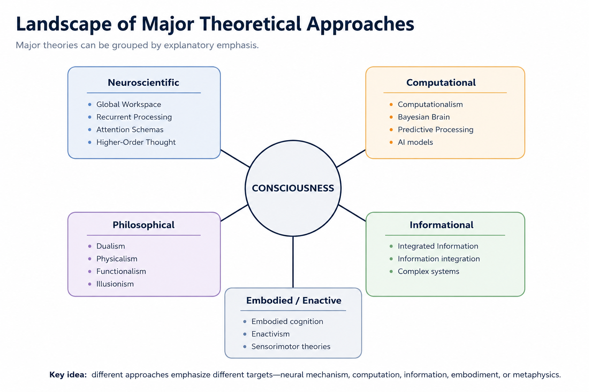
```

Figure @ref(fig:fig-theoretical-landscape-history) summarizes several major contemporary theoretical families. These theories differ not only in their proposed mechanisms, but also in their definitions of consciousness and explanatory targets.

Global Workspace Theory explains consciousness in terms of global availability or broadcasting of information across cognitive systems [@baars1988; @dehaene2011]. Integrated Information Theory explains consciousness through integrated informational structure and intrinsic causal organization [@tononi2004; @oizumi2014]. Higher-Order theories argue that a mental state becomes conscious when the subject has an appropriate higher-order representation of that state [@rosenthal2005; @lau2011]. Recurrent Processing Theory emphasizes recurrent neural activity as central to conscious perception [@lamme2006]. Attention Schema Theory explains consciousness in terms of the brain’s model of attention [@graziano2013].

Predictive Processing and the Bayesian brain framework understand perception and cognition in terms of prediction, inference, and error correction [@friston2010; @clark2013]. Embodied and enactive approaches argue that consciousness cannot be understood apart from bodily action, affect, and organism-environment interaction [@varela1991; @thompson2007]. Panpsychist theories argue that consciousness or proto-consciousness may be a fundamental feature of reality [@goff2017]. Illusionist theories argue that phenomenal consciousness, as traditionally conceived, may be a cognitive illusion [@frankish2016].

This theoretical diversity reflects the complexity of consciousness itself. Some theories primarily explain access, attention, and reportability. Others aim at phenomenal experience, embodiment, selfhood, or metaphysical foundations. The result is not one unified theory, but a pluralistic field with multiple competing and overlapping explanatory frameworks.

### Consciousness-First and T-Consciousness Frameworks

A further contemporary development involves consciousness-first frameworks, which treat consciousness not as a late product of biological or neural complexity, but as a more fundamental aspect of reality. These approaches differ from standard physicalist, functionalist, and neurobiological theories because they do not begin with matter, computation, or neural activity as the primary explanatory foundation.

Taheri’s T-Consciousness theory can be placed within this broader consciousness-first landscape. In this view, consciousness is not produced by the brain in the ordinary materialist sense. Rather, consciousness is treated as a non-material and foundational reality through which life, mind, and organization become manifested. This makes T-Consciousness different from theories that explain consciousness primarily through neural mechanisms, information processing, or biological evolution [@taheri2020; @taheri2023].

Historically, T-Consciousness is best understood as part of a recent expansion of consciousness studies beyond standard neuroscience and cognitive science. It shares some broad concerns with panpsychism, cosmopsychism, and other consciousness-first theories, but it also differs from them in its emphasis on non-material consciousness fields and the idea that life is revealed or manifested through consciousness rather than generated solely by material processes.

Because T-Consciousness is not yet part of the mainstream scientific consensus, it should be presented carefully as an emerging or alternative framework rather than as an established scientific theory. Its importance in the history of consciousness research lies in how it illustrates a wider contemporary movement: the attempt to reconsider whether consciousness may be foundational rather than derivative.

## Artificial Intelligence and Machine Consciousness

Artificial intelligence represents one of the newest phases in the history of consciousness research. As AI systems become more capable of language use, pattern recognition, planning, and adaptive behaviour, researchers increasingly ask whether such systems could ever be conscious.

The question is partly theoretical. If consciousness depends primarily on functional organization, information processing, or self-modeling, then artificial consciousness may be possible in principle. Functionalist and computational theories are often more open to this possibility [@putnam1967; @fodor1975; @dehaene2017].

However, biological and embodied approaches are more cautious. They argue that current AI systems may simulate intelligent behaviour without possessing subjective experience. From this perspective, consciousness may require bodily regulation, affect, homeostasis, biological needs, or active engagement with an environment [@varela1991; @thompson2007; @seth2021].

Machine consciousness also raises ethical questions. If an artificial system could become conscious, then issues of moral status, artificial suffering, autonomy, rights, and responsibility would become important. If artificial systems are not conscious, then there remains a risk of anthropomorphism: mistakenly attributing experience to systems that merely produce convincing outputs [@butlin2023].

AI therefore brings old questions into a new context. The mind-body problem becomes the mind-machine problem. The question of subjective experience becomes the question of whether computation can feel like anything from the inside.

## Contemporary Interdisciplinary Research

Modern consciousness studies is highly interdisciplinary. It draws from neuroscience, cognitive science, philosophy of mind, psychology, artificial intelligence, phenomenology, psychiatry, biology, physics, information theory, and complexity science.

This interdisciplinarity is not accidental. Consciousness appears to involve multiple explanatory levels. Neural mechanisms are important, but they do not by themselves settle questions about subjective experience. Computational models are useful, but they may not fully capture embodiment, affect, or lived experience. Phenomenology describes experience, but it must still be related to brain, body, and world. Philosophical analysis clarifies concepts, but it must remain connected to empirical findings.

Contemporary consciousness research therefore increasingly combines methods. Researchers compare theories through experiments, study altered states, investigate disorders of consciousness, model neural dynamics, analyze subjective reports, and examine artificial systems. The field remains open because no single approach has yet explained consciousness completely.

## Current State of the Field

The contemporary field remains theoretically pluralistic. There is no universally accepted theory of consciousness, no single agreed definition, and no consensus about whether consciousness can be fully reduced to physical, functional, computational, or informational processes.

This lack of consensus is sometimes seen as a weakness, but it may also reflect the complexity of the subject. Consciousness includes wakefulness, awareness, attention, selfhood, reportability, metacognition, embodiment, affect, and phenomenal experience. Different theories may explain different dimensions of this larger problem.

The history of consciousness research shows that progress often occurs through conceptual refinement as much as through empirical discovery. Behaviourism improved scientific rigor but marginalized experience. Cognitive science restored internal mental processes but often treated consciousness indirectly. Neuroscience made consciousness experimentally tractable but did not eliminate philosophical questions. AI introduced new questions about computation, agency, and moral status.

The field therefore remains scientifically productive and philosophically open-ended.

## Main Historical Conclusion

The historical development of consciousness research reveals an expanding attempt to understand one of the deepest problems in science and philosophy. The field has moved from metaphysical reflection to introspective psychology, from behaviourism to cognitive science, from neuroscience to artificial intelligence, and from single-discipline approaches to interdisciplinary theory.

This history does not show a simple path toward one final theory. Instead, it shows that consciousness repeatedly exceeds the boundaries of any single framework. Philosophical questions persist within neuroscience. First-person experience returns after behaviourist exclusion. Computation raises new versions of old mind-body problems. Embodiment challenges purely internal models of mind. Artificial intelligence forces renewed attention to the difference between intelligence and experience.

Modern consciousness science increasingly recognizes that consciousness may require explanation across neural, computational, phenomenological, embodied, biological, and philosophical levels. The field remains unsettled not because it has failed to progress, but because its central question is unusually deep: how does subjective experience fit into the natural world?

## Chapter Summary

The history of consciousness research shows how the field has changed across major intellectual periods. Classical and early modern philosophers framed consciousness through questions of soul, mind, matter, perception, and selfhood. Early psychologists attempted to study experience through introspection, while behaviourists later rejected consciousness as a scientific object and focused on observable behaviour.

The cognitive revolution reintroduced internal mental processes and information-processing models. Neuroscience then transformed consciousness into an empirical research program through the study of neural correlates, altered states, anesthesia, sleep, and disorders of consciousness.

Contemporary consciousness studies is now interdisciplinary. It includes theories based on global access, integrated information, higher-order representation, recurrent processing, prediction, attention modeling, embodiment, panpsychism, illusionism, and artificial intelligence.

The central historical lesson is that consciousness research has never been only one kind of inquiry. It is philosophical, psychological, neuroscientific, computational, phenomenological, biological, and ethical. Its history explains why the field remains pluralistic today.

<!--chapter:end:04-historical-development.Rmd-->

# Dualism {#dualism}

## Chapter Overview

Dualism is one of the oldest and most influential approaches in the philosophy of mind and consciousness studies. Broadly defined, dualism holds that consciousness cannot be fully reduced to physical processes alone. Mental states, subjective experience, and first-person awareness are treated as fundamentally distinct from, or at least not exhaustively explainable by, purely material descriptions of the brain.

Dualist theories arise largely from dissatisfaction with reductionist accounts of consciousness. Neuroscience may explain neural activity, perception, memory, cognition, behaviour, and decision-making with increasing precision. Yet dualists argue that such explanations may still leave something important unexplained: why conscious experience exists at all and why experience has qualitative, first-person character.

This concern connects dualism directly to the hard problem of consciousness. If physical descriptions explain brain mechanisms but do not explain why those mechanisms are accompanied by subjective experience, then consciousness may require a different kind of explanation [@chalmers1995; @chalmers1996]. Dualism is one of the major philosophical responses to this problem.

This chapter examines dualism as a family of positions rather than a single theory. It introduces the historical origins of dualist thought, distinguishes major forms of dualism, explains why dualism remains important in contemporary consciousness studies, and evaluates its strengths, limitations, and implications for neuroscience, artificial intelligence, and the study of subjective experience.

## Learning Objectives

After reading this chapter, the reader should be able to:

* Define dualism in the philosophy of mind.
* Distinguish substance dualism, property dualism, interactionism, epiphenomenalism, and naturalistic dualism.
* Explain the relationship between dualism and the hard problem of consciousness.
* Describe the explanatory gap that motivates many dualist arguments.
* Evaluate the strengths and weaknesses of dualist explanations.
* Compare dualism with physicalist, functionalist, and computational theories.
* Assess the implications of dualism for neuroscience, artificial intelligence, and subjective experience.

## What Dualism Claims

Dualism begins from the idea that mind and matter cannot be understood as exactly the same kind of thing. Physical objects can be described in terms of mass, extension, location, motion, structure, and causal interaction. Conscious experience, by contrast, seems to involve subjectivity, feeling, intentionality, perspective, and qualitative awareness.

The central dualist claim is not simply that the brain and consciousness are different words. Rather, the claim is that physical description may not fully capture what consciousness is. A complete account of neural activity might describe electrical signals, neurotransmitters, brain networks, and behavioural outputs. But dualists argue that such an account may still fail to explain what it is like to undergo an experience.

This is why dualism remains important even in a scientific age. It challenges the assumption that explaining brain mechanisms automatically explains consciousness. Dualism asks whether subjective experience can be reduced to physical processes, or whether consciousness reveals something incomplete in purely material explanation.

## Historical Development

Questions about the relationship between mind and matter existed long before modern neuroscience. Ancient philosophical traditions debated the nature of soul, perception, selfhood, life, and awareness. However, dualism became especially influential in early modern philosophy through René Descartes.

Descartes argued that mind and body are fundamentally different kinds of substance. Matter is extended in space and governed by mechanical laws, whereas mind is characterized by thought, awareness, and subjectivity [@descartes1641]. This view became known as **substance dualism**.

Cartesian dualism strongly shaped the modern mind-body problem. If mind and body are different substances, then one must explain how they relate to one another. How can subjective thought interact with physical matter? How can conscious intention move the body? How can brain processes give rise to experience?

Although contemporary neuroscience rarely accepts Cartesian substance dualism in its original form, many contemporary debates still inherit dualist concerns. The hard problem, the explanatory gap, debates about qualia, and questions about first-person experience all reflect the continuing difficulty of explaining consciousness in purely physical terms [@nagel1974; @levine1983; @chalmers1996].

Twentieth-century behaviourism temporarily marginalized consciousness by focusing psychology on observable behaviour rather than private experience [@watson1913; @skinner1953]. Later, the cognitive revolution reintroduced internal mental processes into psychology, while neuroscience made consciousness increasingly available to empirical study. However, these developments did not eliminate dualist questions. Instead, they sharpened them: even if cognition and neural mechanisms can be studied scientifically, does this fully explain subjective experience?

## Dualism and the Hard Problem

Dualism is closely connected to the hard problem of consciousness. The hard problem asks why physical or computational processes are accompanied by subjective experience at all [@chalmers1995]. Dualism offers one possible answer: perhaps subjective experience cannot be fully explained because it is not reducible to physical processes in the first place.

This does not mean that all dualists reject neuroscience. Many contemporary dualists accept that the brain is deeply involved in consciousness. They may agree that changes in brain activity correspond to changes in experience. What they deny is that neural correlation alone provides a complete explanation of phenomenal consciousness.

The distinction between **access consciousness** and **phenomenal consciousness** is especially important here [@block1995]. Access consciousness concerns information that is available for reasoning, report, memory, and action. Phenomenal consciousness concerns qualitative experience itself: what it is like to see red, feel pain, hear music, or experience oneself as a subject.

Dualist theories are usually motivated by phenomenal consciousness. A physicalist or functionalist theory may explain how information becomes available for report and action. The dualist question is whether such an explanation also explains why there is something it is like to have the experience.

## Major Forms of Dualism

Dualism is not a single unified theory. It is a family of positions concerning the relation between consciousness and the physical world. These positions differ in how strongly they separate mind from matter and in how they understand the causal relationship between mental and physical states.

### Substance Dualism {#substance-dualism}

Substance dualism is the view that mind and matter are fundamentally different substances. On this view, the physical body belongs to the material world, while the conscious mind belongs to a non-physical domain. Descartes is the most famous defender of this position [@descartes1641].

Substance dualism has intuitive appeal because conscious experience seems very different from physical matter. Thoughts, feelings, and sensations do not appear to occupy space in the same way that physical objects do. However, substance dualism faces a serious challenge: if mind is non-physical, how does it interact with the physical brain and body?

This is known as the interaction problem, and it remains one of the strongest objections to Cartesian dualism.

### Property Dualism {#property-dualism}

Property dualism rejects the idea that mind and body are separate substances. Instead, it argues that conscious experience involves properties that are not reducible to physical properties. On this view, consciousness may arise from physical systems, but phenomenal experience cannot be fully explained in physical terms.

Property dualism is more compatible with contemporary science than traditional substance dualism. It does not require a separate mental substance. However, it still claims that physical descriptions leave out something essential about experience.

Chalmers’ naturalistic dualism is often understood as a form of property dualism. He argues that consciousness may be a fundamental feature of reality governed by psychophysical laws, rather than something reducible to known physical processes [@chalmers1996].

### Interactionist Dualism {#interactionism}

Interactionist dualism holds that mental and physical states can causally influence one another. Conscious intentions may affect bodily actions, while brain events may affect conscious experience. This view preserves the ordinary intuition that conscious decisions matter and that mental life plays a causal role in behaviour.

The difficulty is explaining how this interaction occurs. If physical events are fully governed by physical laws, then it is unclear how non-physical mental events could influence the brain without violating causal closure. This challenge has been central to critiques of dualist mental causation [@kim2005; @papineau2002].

### Epiphenomenalism {#epiphenomenalism}

Epiphenomenalism holds that physical brain processes produce conscious experience, but conscious experience does not itself cause physical events. On this view, consciousness is real but causally inert. It accompanies neural activity without influencing behaviour.

Epiphenomenalism avoids some versions of the interaction problem because it does not require consciousness to act back on the physical world. However, it creates other difficulties. If consciousness has no causal role, then it becomes difficult to explain why humans talk about consciousness, why conscious pain seems to guide action, or why experience would have evolved.

Frank Jackson’s original knowledge argument was often associated with epiphenomenalist intuitions, although Jackson later revised his position [@jackson1982].

### Naturalistic Dualism {#naturalistic-dualism}

Naturalistic dualism attempts to combine scientific realism with the claim that consciousness is fundamental. Chalmers argues that consciousness may require new basic principles linking physical processes with experience [@chalmers1996]. These would not be supernatural principles, but they would go beyond current physical explanation.

Naturalistic dualism is important because it does not reject science. Instead, it argues that science may need to expand its explanatory framework to include consciousness as a fundamental feature of reality.

This position is closely related to broader debates about whether consciousness can be reduced, whether it must be treated as fundamental, and whether a future science of consciousness may require psychophysical laws.

## Conceptual Framework

Dualism can be understood as a response to the explanatory gap between physical description and subjective experience. The gap arises because objective science describes mechanisms, structures, functions, and causal relations, while consciousness appears as first-person experience [@levine1983].

Figure @ref(fig:fig-dualism-gap) illustrates this tension.

```{r fig-dualism-gap, echo=FALSE, fig.cap="Dualism and the explanatory gap. Dualist theories argue that subjective experience cannot be fully reduced to physical or cognitive explanation alone.", out.width="90%", fig.align="center"}
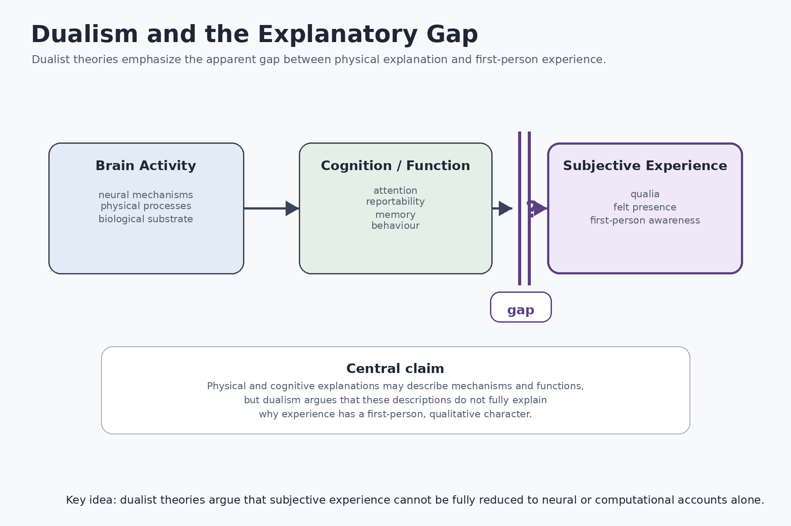
```

As Figure @ref(fig:fig-dualism-gap) suggests, dualist theories do not usually deny that neural activity and cognitive processing are important. Rather, they argue that explanations at these levels may remain incomplete if they do not account for phenomenal experience itself.

Figure @ref(fig:fig-dualism-triangle) places dualism within the broader conceptual structure of consciousness studies.

```{r fig-dualism-triangle, echo=FALSE, fig.cap="The central explanatory domains involved in consciousness research. Dualist approaches emphasize the difficulty of fully reducing subjective experience to neural or computational accounts alone.", out.width="86%", fig.align="center"}

```

As shown in Figure @ref(fig:fig-dualism-triangle), consciousness research involves at least three domains: neural mechanisms, cognitive or informational processing, and subjective experience. Dualism emphasizes the claim that subjective experience cannot be fully derived from the other two domains alone.

## Dualism and Qualia

Dualism is strongly motivated by the problem of **qualia**, the qualitative features of conscious experience. Qualia include the redness of red, the painfulness of pain, the taste of bitterness, the sound of music, or the feeling of warmth.

The problem is that qualia do not seem easily captured by objective description. A scientist may describe the wavelength of red light, the structure of the retina, the activation of visual cortex, and the behavioural ability to identify colours. Yet the dualist argues that this still may not explain what red looks like from the first-person point of view.

This concern is closely related to Nagel’s argument that subjective experience has a perspectival character that cannot be fully captured by objective science [@nagel1974]. It is also central to Jackson’s Mary’s Room thought experiment, where complete physical knowledge seems insufficient to provide knowledge of what colour experience is like [@jackson1982].

Dualism therefore forces the question: are qualia reducible to physical and functional descriptions, or do they reveal an irreducible aspect of consciousness?

## The Interaction Problem

The interaction problem is one of the most important objections to dualism. If consciousness is non-physical, how can it affect the physical brain? If conscious intention causes bodily movement, then mental events seem to influence physical events. But if the physical world is causally closed, then every physical event already has a sufficient physical cause [@papineau2002].

This creates a dilemma for dualism. If consciousness affects the physical world, dualism must explain how this interaction occurs. If consciousness does not affect the physical world, then dualism risks epiphenomenalism, where consciousness becomes causally irrelevant.

This problem is especially serious for substance dualism. Property dualism and naturalistic dualism sometimes attempt to avoid it by treating consciousness as dependent on physical systems while still irreducible. However, critics argue that the problem of mental causation remains unresolved [@kim2005].

## Mental Causation and Agency

Dualism is also connected to questions of free will, agency, and intentional action. In ordinary life, people experience themselves as making choices, forming intentions, and acting for reasons. Dualism often preserves the intuition that conscious decisions genuinely influence behaviour.

However, many physicalist theories argue that behaviour can be explained through brain processes without appealing to non-physical mental causation. From this perspective, conscious intention may be part of the physical causal order rather than something outside it.

The challenge is to explain how subjective agency fits with neuroscience. If all behaviour is physically caused, what causal role does conscious intention play? If consciousness has no causal role, why does agency feel so central to human life?

Dualism keeps these questions visible, even when it does not fully solve them.

## Empirical Relevance and Scientific Challenges

Dualism is primarily a philosophical position, but it has implications for empirical consciousness research. Studies of anesthesia, dreaming, blindsight, split-brain patients, disorders of consciousness, and altered states all raise questions about the relation between neural activity and conscious awareness [@laureys2005; @owen2006; @koch2016; @seth2018].

Dualists may interpret such cases as evidence that consciousness cannot be reduced simply to behaviour or report. For example, a patient may show limited behavioural responsiveness while still possibly retaining some form of awareness. A person with blindsight may respond to visual stimuli without ordinary conscious seeing. Split-brain cases raise questions about unity of consciousness and the relation between brain organization and subjective selfhood.

However, these cases do not automatically prove dualism. Physicalist, functionalist, and neuroscientific theories can also explain many of these phenomena. A major challenge for dualism is that it often lacks clear empirical tests that would distinguish it from non-dualist explanations.

This is one reason many scientists regard dualism as philosophically significant but scientifically difficult to operationalize.

## Strengths of Dualism

Dualism has several important strengths. First, it directly confronts subjective experience rather than reducing consciousness immediately to behaviour, computation, or neural function. It insists that a theory of consciousness must explain experience itself.

Second, dualism highlights the difference between first-person and third-person explanation. This distinction remains important even for researchers who reject dualism, because consciousness studies must still relate subjective reports to objective measurements.

Third, dualism provides a powerful critique of overly reductionist theories. It asks whether explanations of attention, memory, reportability, or information processing are sufficient to explain phenomenal consciousness.

Finally, dualism preserves the philosophical importance of qualia, selfhood, agency, and the apparent reality of inner life. Even if dualism is ultimately rejected, the problems it raises continue to shape contemporary theories.

## Weaknesses of Dualism

Dualism also faces major weaknesses. The most serious is the interaction problem. If consciousness is non-physical, it is difficult to explain how it affects the physical world. If it has no effect, then it becomes difficult to explain agency, decision-making, and the apparent causal role of experience.

Dualism also faces challenges of empirical testability. Many versions do not provide clear experimental predictions or measurable markers that would distinguish dualism from physicalist theories.

Another criticism is that dualism may explain mystery by adding more mystery. Instead of explaining how consciousness arises, it may simply declare consciousness irreducible. Critics argue that this can weaken dualism as a scientific theory.

Some philosophers also argue that dualism relies too heavily on intuition and thought experiments. Dennett, for example, argues that many traditional assumptions about qualia are misleading and that consciousness should be explained through cognitive functions and information-processing capacities [@dennett1991]. Illusionists go further by arguing that phenomenal consciousness, as traditionally conceived, may itself be a cognitive illusion [@frankish2016].

## Dualism and Artificial Intelligence

Dualism has important implications for artificial intelligence. If consciousness depends only on functional organization or information processing, then artificial consciousness may be possible in principle. But if consciousness involves non-reducible mental properties or fundamental phenomenal features, then computational sophistication alone may not be sufficient.

This creates a major contrast between dualist and functionalist approaches. Functionalism suggests that a system with the right causal organization could be conscious, regardless of whether it is biological or artificial [@putnam1967; @fodor1975]. Dualist approaches are more cautious. They ask whether artificial systems could possess subjective experience rather than merely simulate intelligent behaviour.

Recent debates about AI consciousness often turn on this distinction. A system may produce language, solve problems, model itself, and report internal states, yet it remains unclear whether there is anything it is like to be that system [@dehaene2017; @butlin2023].

Dualism therefore challenges the assumption that intelligence and consciousness are the same. It reminds us that behavioural sophistication does not automatically settle questions about subjective experience.

## Dualism and Other Theories

Dualism differs from physicalism, functionalism, and computationalism in its treatment of subjective experience. Physicalism argues that consciousness is ultimately physical. Functionalism argues that mental states are defined by their causal roles. Computationalism treats cognition, and sometimes consciousness, in terms of information processing.

Dualism accepts that these approaches may explain many aspects of mind. However, it denies that they necessarily explain phenomenal consciousness. From the dualist perspective, a theory that explains cognition has not automatically explained experience.

Dualism also differs from panpsychism, although both resist simple reductionism. Panpsychism argues that consciousness or proto-consciousness may be fundamental and widespread in nature [@goff2017]. Dualism, especially in its Cartesian form, more strongly separates mind and matter. Naturalistic dualism and panpsychism can sometimes overlap, but they are not identical.

This comparison shows why dualism remains useful even when one does not accept it fully. It clarifies what is at stake when theories claim to explain consciousness.

## Evaluation

Dualism remains one of the most historically influential and philosophically significant approaches to consciousness. Its central contribution is that it keeps subjective experience at the center of the discussion. It challenges any theory that explains cognition, behaviour, or neural activity while leaving phenomenal consciousness unexplained.

At the same time, dualism faces serious difficulties. Substance dualism struggles with the interaction problem. Property dualism must explain how irreducible mental properties fit into the physical world. Epiphenomenalism risks making consciousness causally irrelevant. Naturalistic dualism requires new explanatory principles that remain difficult to specify and test.

For this reason, dualism is often more powerful as a critique than as a complete scientific theory. It identifies a problem that physicalist and functionalist theories must address, but it does not always provide a clear mechanism or empirical research program of its own.

Whether dualism is ultimately correct remains deeply contested. Nevertheless, nearly every major theory of consciousness must respond to the questions dualism raises: Can subjective experience be reduced to physical processes? Is consciousness a physical, functional, or fundamental feature of reality? Does explaining the brain explain the mind? And can a complete science of consciousness avoid the first-person character of experience?

## Chapter Summary

Dualism is the view that consciousness cannot be fully reduced to physical processes alone. Its most famous historical form is Cartesian substance dualism, which treats mind and matter as distinct substances. Contemporary forms include property dualism, interactionism, epiphenomenalism, and naturalistic dualism.

Dualism is motivated by the hard problem of consciousness, the explanatory gap, and the difficulty of explaining qualia through objective physical description. It emphasizes phenomenal consciousness rather than access consciousness alone.

The strengths of dualism include its direct focus on subjective experience, its critique of reductionism, and its emphasis on the difference between first-person and third-person explanation. Its weaknesses include the interaction problem, limited empirical testability, difficulties concerning mental causation, and the risk of introducing additional metaphysical mystery.

Dualism remains important because it forces all theories of consciousness to confront the problem of subjective experience. Even theories that reject dualism must explain why consciousness seems difficult to reduce to brain mechanisms, computation, or behaviour alone.

<!--chapter:end:05-dualism.Rmd-->

# Physicalism and Materialist Theories of Consciousness {#physicalism}

## Chapter Overview

Physicalism is the view that everything that exists is ultimately physical in nature, including consciousness. According to physicalist approaches, conscious experience does not require a separate mental substance, immaterial soul, or fundamentally non-physical reality. Instead, consciousness is understood as depending on physical systems, neural organization, biological processes, computational dynamics, or information-processing structures.

Physicalism is the dominant working framework within contemporary neuroscience and much of cognitive science. This is because consciousness is closely connected to brain activity, bodily regulation, behaviour, perception, memory, emotion, and cognition. Changes in the brain reliably alter conscious experience, and physical interventions such as anesthesia, brain stimulation, psychoactive drugs, injury, and neurodegenerative disease can transform or suppress awareness [@koch2016; @seth2021].

At the same time, physicalism remains philosophically controversial. Critics argue that even a complete physical description of the brain may fail to explain why subjective experience exists at all. A theory may explain neural activity, information processing, behaviour, and reportability while still leaving open the question of why these processes feel like anything from the inside [@chalmers1995; @chalmers1996].

This chapter examines physicalism as a family of theories rather than a single position. It explains why physicalism became dominant in modern consciousness research, distinguishes major forms of physicalism, evaluates the evidence supporting physicalist approaches, and considers major criticisms such as the explanatory gap, qualia, and the knowledge argument.

## Learning Objectives

After reading this chapter, the reader should be able to:

* Explain the central claim of physicalism.
* Distinguish reductive, non-reductive, functionalist, eliminative, and emergent forms of physicalism.
* Explain why physicalism became dominant in neuroscience and cognitive science.
* Describe evidence linking consciousness to physical brain processes.
* Explain the explanatory gap critique of physicalism.
* Compare physicalism with dualism, functionalism, and consciousness-first theories.
* Evaluate the strengths and weaknesses of physicalist theories.
* Understand how physicalism relates to artificial intelligence and computational theories of mind.

## The Core Idea of Physicalism

Physicalism begins from the claim that consciousness is part of the natural world. Consciousness may be difficult to explain, but it is not treated as supernatural, immaterial, or outside scientific investigation. On this view, conscious experience depends on physical organization in some way.

This does not mean that all physicalists believe consciousness has already been explained. Nor does it mean that all physicalists reduce consciousness to simple neural activity. Physicalism includes a range of positions. Some physicalists argue that conscious states are identical to brain states. Others argue that consciousness emerges from complex physical systems. Others emphasize functional organization, computation, biological regulation, or information processing.

What unites these approaches is the rejection of a separate non-physical mind. Physicalists argue that a complete account of consciousness must ultimately fit within the physical world.

```{r fig-physicalism-hierarchy, echo=FALSE, fig.cap="Physicalist explanatory hierarchy. Physicalist theories interpret consciousness as arising from increasingly organized physical systems ranging from fundamental physics to chemistry, biology, neural organization, and conscious experience. The highlighted transition between neural systems and subjective experience illustrates the continuing explanatory gap debated within consciousness studies.", out.width="96%", fig.align="center"}
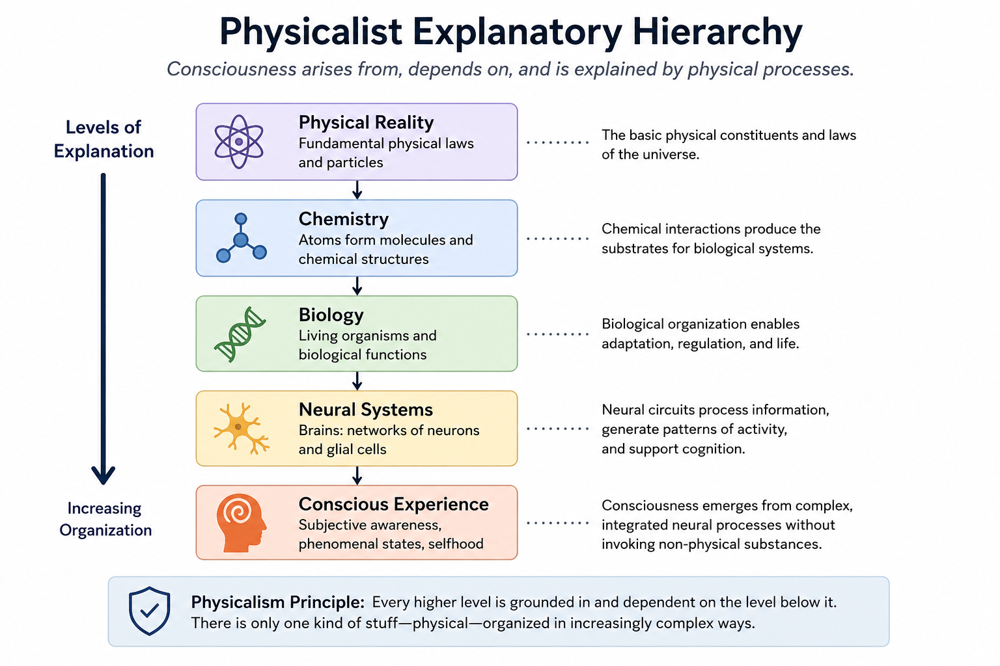
```

Figure @ref(fig:fig-physicalism-hierarchy) illustrates a general physicalist hierarchy. Physical systems form chemical structures, chemical structures support biological systems, biological systems include nervous systems, and sufficiently organized nervous systems may give rise to conscious experience. The most controversial transition is the final one: how neural organization becomes subjective experience.

This transition is where physicalism faces its deepest challenge. The physicalist claim is that consciousness depends on physical organization. The philosophical question is whether physical organization fully explains consciousness.

## Why Physicalism Became Dominant

Physicalism became dominant in modern consciousness research because of the strong relationship between conscious experience and physical brain processes. Consciousness changes when the brain changes. This is one of the most powerful motivations for physicalist theories.

Brain injury can alter memory, language, perception, personality, bodily awareness, attention, and selfhood. Anesthesia can suppress conscious awareness through physical intervention. Psychoactive substances can transform perception, emotion, and self-experience. Electrical stimulation of the brain can produce sensations, memories, movements, or emotional responses. Neurodegenerative diseases can progressively alter cognition, identity, and conscious functioning.

These examples strongly suggest that consciousness is deeply dependent on physical brain organization. Modern neuroscience has also made this dependence experimentally tractable through neuroimaging, electrophysiology, lesion studies, neural stimulation, anesthesia research, and computational neuroscience [@koch2016; @seth2021].

Physicalism also fits naturally with evolutionary biology. If human consciousness depends on biological systems that evolved over time, then consciousness can be investigated as part of the natural history of life rather than as a separate supernatural phenomenon. This does not solve the hard problem, but it gives physicalism a powerful scientific foundation.

For these reasons, physicalism functions as the default background assumption in much contemporary neuroscience, psychology, medicine, and cognitive science.

## Physicalism as a Response to Dualism

Physicalism is partly a response to the problems faced by dualism. Dualist theories treat consciousness as distinct from, or not fully reducible to, physical processes. Cartesian substance dualism, for example, treats mind and matter as different substances [@descartes1641].

Physicalists reject this separation. They argue that consciousness should be explained within the same natural world studied by physics, biology, neuroscience, and cognitive science. This avoids the interaction problem that challenges substance dualism: if mind is non-physical, how does it causally interact with the physical brain?

Physicalism does not deny that consciousness seems different from other physical phenomena. Rather, it argues that this difference should be explained without positing a separate non-physical realm. The goal is to understand how consciousness fits into nature.

This makes physicalism both scientifically attractive and philosophically demanding. It avoids dualist metaphysics, but it must still explain why physical processes are accompanied by subjective experience.

## Core Assumptions of Physicalism

Most physicalist theories share several broad assumptions. First, consciousness depends on physical systems. In humans and other animals, this means that conscious experience depends on the brain, nervous system, body, and biological regulation.

Second, mental states depend on physical states. Changes in the brain can change perception, memory, emotion, thought, agency, and self-experience.

Third, consciousness is part of nature. It is not treated as outside scientific explanation, even if current science does not yet explain it fully.

Fourth, consciousness can be studied empirically. Neuroscience, psychology, medicine, computational modeling, and artificial intelligence may all contribute to a physical understanding of consciousness.

Finally, physicalism rejects the need for a separate mental substance. It does not require immaterial souls, non-physical minds, or supernatural explanation.

However, physicalism is not a single unified theory. Physicalists disagree about whether consciousness can be reduced, whether it emerges, whether it is functional, whether it is computational, and whether current concepts of consciousness should be revised or eliminated.

## Major Forms of Physicalism

Physicalism includes several different approaches to the relation between mind and matter. These positions share a commitment to naturalism, but they differ in how they understand reduction, explanation, emergence, and mental properties.

### Reductive Physicalism

Reductive physicalism argues that conscious states can ultimately be reduced to physical brain states or neural mechanisms. On this view, consciousness is not merely correlated with the brain. It is identical with, or fully explainable by, physical processes.

The strongest version of this approach is identity theory. Identity theorists argue that mental states are identical to brain states [@place1956; @smart1959]. Pain, for example, would not merely be caused by neural activity; it would be a neural state described at a different level.

Reductive physicalism has the advantage of offering a clear naturalistic explanation. It treats consciousness as part of the physical world without requiring additional metaphysical principles. However, critics argue that identity theory struggles with qualia, multiple realizability, and the explanatory gap.

### Non-Reductive Physicalism

Non-reductive physicalism argues that consciousness depends entirely on physical systems but cannot be straightforwardly reduced to lower-level physical descriptions. Consciousness is physically grounded, but it may possess higher-level properties that require their own explanatory vocabulary.

This position attempts to preserve both scientific naturalism and the complexity of mental life. It accepts that consciousness depends on the physical world while resisting overly simple reductions of experience to neural activity.

Non-reductive physicalism is attractive because many sciences already use higher-level explanations. Biology is grounded in chemistry, but biological explanations are not always replaced by chemical explanations. Psychology may be grounded in neuroscience, but psychological concepts may still remain useful. The challenge is explaining how higher-level mental properties fit into the physical world without becoming either reducible or mysteriously independent [@kim2005].

### Functionalist Materialism

Functionalist forms of materialism define mental states in terms of what they do rather than what they are made of. A mental state is understood by its causal role: how it receives inputs, interacts with other states, and produces outputs [@putnam1967; @fodor1975].

Functionalism is often compatible with physicalism because functional organization must be realized in some physical system. However, it does not require that consciousness be tied to one specific biological material. In principle, different physical systems could realize the same functional organization.

This idea became highly influential in debates about artificial intelligence and machine consciousness. If consciousness depends on functional organization, then a sufficiently organized artificial system might become conscious. Critics argue, however, that functionalism may explain access, cognition, and behaviour more easily than phenomenal experience.

### Eliminative Materialism

Eliminative materialism argues that some ordinary mental concepts may eventually be replaced by more accurate scientific concepts. According to this view, folk psychological categories such as beliefs, desires, or even qualia may not correspond to real natural kinds in the way common sense assumes [@churchland1981; @churchland1986].

Eliminative materialists compare ordinary psychology to outdated scientific theories. Just as modern science abandoned concepts such as phlogiston, future neuroscience may revise or eliminate some everyday concepts of mind.

This approach is controversial because critics argue that it risks denying the very phenomenon that needs explanation. If a theory claims that qualia do not exist, it must still explain why experience appears so immediate and undeniable.

### Emergent Physicalism

Emergent physicalism proposes that consciousness emerges from sufficiently complex physical organization. Consciousness is real and physically grounded, but it may not be reducible to simple lower-level descriptions.

Emergentism is attractive because it allows consciousness to be both natural and genuinely novel. Many physical systems have higher-level properties that arise from organized complexity. Water has properties not obvious from isolated hydrogen and oxygen atoms. Living cells have properties not found in simple molecules. Similarly, consciousness may emerge from complex neural organization.

The challenge is explaining emergence clearly. If emergence means only that consciousness is complicated, then the theory may not solve the hard problem. If emergence means that consciousness has genuinely novel causal powers, then the theory must explain how those powers fit within physical causation.

## Neural Dependence of Consciousness

One of the strongest arguments for physicalism is the neural dependence of consciousness. Across many domains, conscious experience varies with brain activity.

In perception, damage to specific sensory systems can alter or eliminate conscious awareness of certain features of the world. In memory disorders, changes to the hippocampus and related structures can disrupt the continuity of experience and identity. In language disorders, brain injury can alter the ability to express or understand conscious thought. In disorders of bodily awareness, patients may lose the sense of ownership over parts of the body.

Anesthesia provides another major line of evidence. Physical changes to brain dynamics can suppress consciousness in a controlled and reversible way. Sleep and dreaming show that consciousness can be transformed even without external stimulation. Psychedelic states show that changes in neurochemistry can dramatically alter perception, selfhood, and meaning.

Split-brain research also suggests that the unity of consciousness depends on neural organization. When communication between the hemispheres is disrupted, behaviour and report can reveal surprising dissociations in awareness, action, and interpretation.

Research on disorders of consciousness, including coma, vegetative states, minimally conscious states, and locked-in syndrome, further supports the close connection between brain organization and conscious awareness [@laureys2005; @owen2006].

Together, these findings make it difficult to deny that consciousness depends deeply on physical systems. The harder question is whether dependence is the same as complete explanation.

## Correlation and Explanation

Physicalism is strongly supported by correlations between brain activity and consciousness. However, critics argue that correlation alone is not the same as explanation.

Identifying neural correlates may show when consciousness occurs, how conscious states change, and which mechanisms participate. But this may not fully explain why subjective experience exists. This concern is central to the explanatory gap [@levine1983].

The issue can be stated simply: even if every conscious state has a neural correlate, why should neural activity feel like anything from the inside? Why should physical information processing be accompanied by experience rather than occurring without awareness?

This is the central philosophical challenge for physicalism. The strongest physicalist response is that a complete neuroscience will eventually explain why the gap appears to exist. Critics respond that no amount of structural or functional description seems sufficient to derive subjective experience.

## Physicalism and the Hard Problem

Physicalist theories differ in how they approach the hard problem. Some physicalists accept the hard problem as a genuine challenge but argue that it will eventually be solved by neuroscience, cognitive science, or a more mature theory of mind. Others argue that the hard problem is based on misleading intuitions about experience [@dennett1991; @frankish2016].

Reductionist physicalists often argue that consciousness will be identified with physical mechanisms. Functionalists argue that consciousness can be explained by causal organization and information processing. Higher-order and representational approaches argue that conscious experience depends on how mental states are represented or made available to cognition. Illusionists argue that phenomenal consciousness, as traditionally conceived, may be a cognitive illusion [@frankish2016].

Critics of physicalism argue that these responses still fail to explain why physical processes are accompanied by subjective feeling. Chalmers’ hard problem and Jackson’s knowledge argument both challenge the idea that physical explanation is sufficient [@jackson1982; @chalmers1995; @chalmers1996].

Physicalism therefore faces a central question: can subjective experience be fully explained in physical terms, or does consciousness reveal a limitation in physical explanation?

## Physicalism, Qualia, and the Knowledge Argument

Qualia are the qualitative features of experience, such as the redness of red, the painfulness of pain, or the taste of bitterness. Physicalists must explain how such qualitative features fit into the physical world.

One of the most influential challenges is Frank Jackson’s Mary’s Room thought experiment. Mary is a scientist who knows all the physical facts about colour vision but has lived in a black-and-white environment. When she sees red for the first time, does she learn something new? If she does, then complete physical knowledge may not include all knowledge about conscious experience [@jackson1982].

Physicalists have responded in several ways. Some argue that Mary gains a new ability rather than new factual knowledge. Others argue that she gains acquaintance with an experience she already knew about physically. Still others argue that the thought experiment depends on an unrealistic idea of complete physical knowledge.

The knowledge argument remains important because it captures a persistent worry about physicalism: objective physical description may leave out the subjective character of experience.

## Multiple Realizability and Physicalism

Another challenge for reductive physicalism is multiple realizability. If the same mental state can be realized by different physical systems, then mental states may not be identical to specific neural states.

For example, pain in humans, animals, or possible artificial systems might be implemented by different physical mechanisms while playing similar functional roles. This idea was central to functionalist criticisms of strict identity theory [@putnam1967; @fodor1975].

Multiple realizability does not refute all forms of physicalism. A physicalist can argue that every mental state must be physically realized, even if it is not always realized in the same physical way. However, it challenges simple reductions of mental states to particular human brain states.

This is one reason contemporary physicalism often takes non-reductive, functionalist, or emergent forms rather than strict identity theory.

## Physicalism and Artificial Intelligence

Physicalism has important implications for artificial intelligence. If consciousness depends on physical organization, then the question becomes: what kind of physical organization is sufficient?

Functionalist and computational physicalists are more open to the possibility of machine consciousness. If consciousness depends on causal structure, information processing, global availability, or self-modeling, then artificial systems might become conscious if they instantiate the relevant organization [@dehaene2014; @butlin2023].

Other physicalists are more cautious. Biological and embodied approaches argue that consciousness may depend on living systems, bodily regulation, affect, homeostasis, and organism-environment interaction [@varela1991; @thompson2007; @seth2021]. From this perspective, current artificial systems may simulate intelligent behaviour without having subjective experience.

This debate shows that physicalism does not automatically imply that AI systems can be conscious. It depends on what kind of physical, biological, functional, or computational organization a theory considers necessary.

## Strengths of Physicalism

Physicalism has several major strengths. First, it is highly compatible with science. It fits naturally with neuroscience, biology, medicine, psychology, and empirical investigation.

Second, physicalism generates productive research programs. The search for neural correlates of consciousness, studies of anesthesia, research on perception and attention, computational neuroscience, and investigations of disorders of consciousness all depend on physicalist assumptions [@crick1994; @koch2016; @dehaene2011; @seth2021].

Third, physicalism integrates consciousness with evolutionary biology. Consciousness can be studied as a biological phenomenon that developed through natural processes rather than as a separate immaterial entity.

Fourth, physicalism avoids the interaction problem that challenges dualism. If consciousness is physical or physically realized, then there is no need to explain how a non-physical mind affects a physical brain.

Finally, physicalism connects consciousness research with broader scientific accounts of matter, life, computation, information, and biological organization.

## Weaknesses and Criticisms

Despite its strengths, physicalism faces serious criticisms. The most important is the explanatory gap. Critics argue that physical explanations may describe neural dynamics, behaviour, cognition, and information processing without explaining subjective feeling itself [@levine1983].

The knowledge argument raises a related challenge by suggesting that complete physical knowledge may still fail to capture what experience is like [@jackson1982]. Qualia critiques argue that the qualitative features of experience resist purely structural, computational, or functional description.

Physicalism also faces challenges concerning intentionality, meaning, selfhood, and lived experience. A physical system may process information, but it remains difficult to explain how information becomes meaningful for a subject.

Finally, some critics argue that physicalism may be too broad. If everything must ultimately be physical, then the central question becomes what kind of physical explanation is needed. Without a specific theory, physicalism can become a general worldview rather than a detailed account of consciousness.

## Physicalism and Other Theories

Physicalism differs from dualism by rejecting a separate non-physical mind. It differs from panpsychism by usually denying that consciousness is fundamental or widespread throughout nature. It differs from consciousness-first theories by treating consciousness as dependent on physical organization rather than as the foundation of reality.

However, physicalism overlaps with several major theories discussed later in this book. Global Workspace Theory is often physicalist because it explains consciousness through neural broadcasting and cognitive access [@baars1988; @dehaene2011]. Integrated Information Theory is more complex: it is naturalistic and formal, but it also treats consciousness as intrinsic to certain causal structures [@tononi2004; @oizumi2014]. Predictive Processing and the Bayesian brain framework are usually physicalist because they explain perception and cognition through embodied prediction, inference, and neural dynamics [@friston2010; @clark2013].

Physicalism is therefore not one theory among many in a simple way. It is a broad metaphysical and scientific background within which many specific theories operate.

## Evaluation

Physicalism remains the dominant framework in scientific consciousness research because it aligns strongly with neuroscience, biology, medicine, computation, and empirical methodology. It explains why changes in the brain alter conscious experience and provides a powerful basis for experimental research.

However, physicalism remains philosophically contested. The central unresolved issue is whether physical explanation can fully account for phenomenal experience. A physicalist theory may explain neural mechanisms, functional organization, and behavioural capacities, but critics argue that this may still leave unanswered why experience exists at all.

For this reason, physicalism is both powerful and incomplete. It is powerful because consciousness clearly depends on physical systems in humans and other animals. It is incomplete because the precise relation between physical organization and subjective experience remains unresolved.

The future of physicalism depends on whether neuroscience, cognitive science, computational theory, and philosophy can together explain not only the mechanisms associated with consciousness, but also the first-person character of experience itself.

## Chapter Summary

Physicalism is the view that consciousness is ultimately part of the physical world. It rejects separate mental substances and attempts to explain consciousness through neural, biological, computational, functional, or emergent physical organization.

Major forms of physicalism include reductive physicalism, identity theory, non-reductive physicalism, functionalist materialism, eliminative materialism, and emergent physicalism. These positions differ in how they understand reduction, emergence, and explanation.

Physicalism is strongly supported by the dependence of consciousness on brain activity. Brain injury, anesthesia, psychoactive substances, sleep, dreaming, neural stimulation, and disorders of consciousness all show that changes in physical systems can alter conscious experience.

The major challenge for physicalism is the explanatory gap. Critics argue that physical descriptions may explain mechanisms and functions without explaining why experience feels like anything from the inside. The knowledge argument, qualia, multiple realizability, and questions of meaning and subjectivity all continue to challenge physicalist theories.

Physicalism remains the dominant scientific framework for consciousness research, but whether it can fully explain subjective experience remains one of the central unresolved questions in the field.

<!--chapter:end:06-materialism-physicalism.Rmd-->

# Functionalism {#functionalism}

## Chapter Overview

Functionalism is one of the most influential approaches in contemporary philosophy of mind, cognitive science, artificial intelligence, and consciousness research. Rather than defining mental states by what they are physically made of, functionalism defines them by what they do. A mental state is understood in terms of its causal role within a larger system: how it receives input, interacts with other internal states, guides behaviour, and contributes to cognition.

Pain, for example, is not defined primarily as a particular biological substance or neural structure. Instead, it is understood by its functional role: it is typically caused by bodily damage, produces unpleasant experience, motivates avoidance or protection, influences memory and learning, and interacts with beliefs, desires, attention, and action. On this view, what makes pain pain is not simply its material composition, but its place within an organized system of causal relations.

Functionalism transformed the study of mind by shifting attention away from strict biological identity and toward causal organization, information processing, computation, and cognitive architecture. This shift became foundational for cognitive science, artificial intelligence, computational neuroscience, Global Workspace Theory, predictive processing, higher-order theories, and many contemporary models of conscious access [@putnam1967; @fodor1968; @baars1988; @dehaene2011].

At the same time, functionalism remains controversial. Critics argue that functional organization may explain cognition, behaviour, reportability, and intelligent processing without fully explaining subjective experience. A system might perform the right functions, process information in the right way, and behave intelligently, yet it remains unclear whether there is something it is like to be that system. For this reason, functionalism lies at the center of debates about artificial intelligence, machine consciousness, qualia, and the hard problem of consciousness [@block1978; @searle1980; @chalmers1996].

## Learning Objectives

After reading this chapter, the reader should be able to:

* Define the central claim of functionalism.
* Explain how functionalism differs from behaviourism and identity theory.
* Describe the principle of multiple realizability.
* Distinguish major forms of functionalism.
* Explain why functionalism became influential in cognitive science and artificial intelligence.
* Evaluate functionalism’s strengths and limitations.
* Explain functionalism’s relationship to access consciousness and phenomenal consciousness.
* Analyze criticisms concerning qualia, subjective experience, and machine consciousness.

## The Core Idea of Functionalism

The central claim of functionalism is that mental states are individuated by their causal-functional roles rather than by their physical substance. A mental state is what it does within a system.

This idea can be understood by comparison with ordinary functional objects. A clock is a clock because it performs the function of keeping time. It may be made of gears, circuits, software, or atomic oscillations. The material matters for implementation, but the identity of the clock depends on the role it plays. Similarly, functionalists argue that mental states may be identified by their role in cognition rather than by a single biological material.

Applied to consciousness, functionalism asks what role conscious states play in perception, memory, attention, reasoning, self-monitoring, and action. It shifts the central question from “What material is consciousness made of?” to “What causal organization makes a state mental or conscious?”

This shift allowed mental states to be studied scientifically without reducing them immediately to specific neural states. It also opened the possibility that different physical systems could realize similar mental functions.

## Why Functionalism Was Revolutionary

Functionalism was revolutionary because it offered a third path between behaviourism and identity theory.

Behaviourism attempted to define mental states in terms of observable behaviour. It emphasized experimental rigor, prediction, and measurable response, but it often neglected internal cognitive organization [@watson1913; @skinner1953]. Identity theory, by contrast, identified mental states directly with brain states [@place1956; @smart1959]. This made mind fully physical, but it risked tying mental states too closely to specific biological structures.

Functionalism avoided both extremes. Unlike behaviourism, it accepted internal mental states and causal organization. Unlike strict identity theory, it did not require that a mental state be identical to one specific neural state. What mattered was the role a state played within a system.

This approach became highly influential because it fit naturally with the rise of cognitive science. The mind could be studied as an organized information-processing system. Mental states could be analyzed in terms of inputs, internal transitions, representations, memory, attention, decision-making, and outputs. This made functionalism especially important for artificial intelligence and computational theories of mind [@putnam1967; @fodor1968; @lewis1972].

## Historical Development

Functionalism emerged in the mid-twentieth century as philosophers and cognitive scientists reconsidered how mental states should be explained. Earlier behaviourist approaches had tried to avoid inner mental life by focusing on observable behaviour. However, language, reasoning, planning, memory, and flexible problem-solving seemed to require internal structure.

At the same time, strict identity theory appeared too narrow. If pain is identical to a particular human brain state, then creatures with different nervous systems might not be able to feel pain. Functionalists argued that this was implausible. A dog, octopus, alien, or artificial system might have a different physical structure while still possessing a state that plays the functional role of pain.

Hilary Putnam’s arguments for multiple realizability were especially influential [@putnam1967]. Jerry Fodor developed functionalist ideas within cognitive science and the computational theory of mind [@fodor1968]. David Lewis and David Armstrong contributed analytic and causal-role versions of functionalism [@lewis1972; @armstrong1968]. Later philosophers such as Sydney Shoemaker and Ned Block developed important refinements and criticisms [@shoemaker1981; @block1978].

Functionalism therefore became both a theory of mind and a bridge between philosophy, psychology, computation, and neuroscience.

## Functional Organization

Functionalism interprets mental life as an organized network of causal relations. Sensory inputs affect internal states. Internal states interact with memory, attention, belief, emotion, and reasoning. These interactions guide behaviour, speech, learning, planning, and self-monitoring.

```{r fig-functionalist-view, echo=FALSE, fig.cap="Functionalist models define mental states according to causal organization, information flow, internal processing, and behavioural relations rather than specific physical substance. The figure also illustrates multiple realizability and contrasts functionalism with identity theory.", out.width="97%", fig.align="center"} id="84951h"
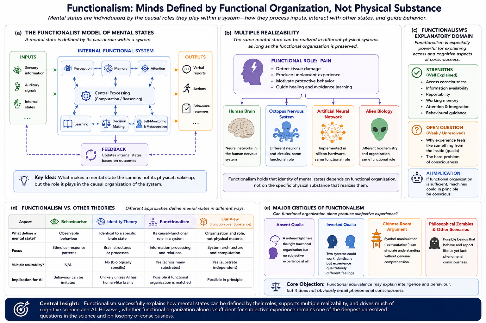
```

Figure @ref(fig:fig-functionalist-view) illustrates the basic functionalist framework. Mental states are defined not by a single physical material, but by their place within a larger system of input, internal processing, and output. The same functional organization could, in principle, be realized by different physical systems.

This idea is one of functionalism’s most important contributions. It makes mental explanation more flexible than identity theory while remaining compatible with physicalism. Mental states must be realized in some physical system, but they are not necessarily identical with one specific physical structure.

However, the same figure also points toward functionalism’s central problem. Even if a system has the right functional organization, does that guarantee subjective experience? Or does functionalism explain only the structure of cognition and behaviour?

## Multiple Realizability

Multiple realizability is one of the strongest arguments for functionalism. It is the idea that the same mental state can be realized in different physical systems, provided that the relevant causal-functional organization is preserved.

Pain provides a common example. Human pain, animal pain, and possible alien pain might be implemented by different biological mechanisms. Yet if each state is caused by damage, produces distress, motivates protection, influences learning, and interacts with other cognitive states in the right way, then functionalists argue that each could count as pain.

This argument challenges strict identity theory. If mental states can be realized in different physical systems, then they cannot simply be identical to one specific human neural state. Instead, mental states must be understood at a more abstract functional level [@putnam1967; @fodor1968].

Multiple realizability also became central to artificial intelligence. If mental states depend on organization rather than biological material, then artificial systems might possess mental states if they instantiate the right functional structure. This possibility remains one of the main reasons functionalism continues to matter for debates about machine consciousness.

## Major Forms of Functionalism

Functionalism is not a single unified theory. It is a broad family of approaches that define mental states by role, organization, and causal structure. Different versions disagree about how these roles should be specified.

### Machine-State Functionalism

Machine-state functionalism compares the mind to a computational system. A system has inputs, internal states, transition rules, and outputs. Mental states are understood as states within this organized system.

This version was strongly influenced by computation and early artificial intelligence. It made it possible to think of the mind as a kind of information-processing architecture. The appeal of this model is its clarity: mental states can be described formally in terms of causal transitions.

However, critics argue that machine-state functionalism can become too abstract. A formal description of state transitions may not capture embodiment, emotion, biological regulation, or subjective experience.

### Psycho-Functionalism

Psycho-functionalism defines mental states using the best available scientific psychology rather than ordinary language. Instead of asking how common sense describes pain, belief, or desire, psycho-functionalism asks what roles these states play in mature cognitive science.

This version is attractive because it connects functionalism with empirical research. Mental states are not analyzed only through folk psychology but through attention, memory, perception, learning, reasoning, and cognitive architecture.

Psycho-functionalism is especially important for cognitive neuroscience because it allows mental states to be studied as functional components of larger cognitive systems.

### Analytic Functionalism

Analytic functionalism attempts to analyze mental concepts through their ordinary causal roles. For example, pain may be analyzed as the state typically caused by injury, associated with distress, and likely to produce avoidance behaviour.

This approach is closely connected to conceptual analysis. It asks what our ordinary mental concepts mean and how they relate to other concepts. Its strength is philosophical clarity. Its weakness is that ordinary language may not accurately reflect the underlying nature of mind.

### Computational Functionalism

Computational functionalism treats mental states as computational processes implemented in physical systems. It is closely related to the computational theory of mind and artificial intelligence [@fodor1968; @turing1950].

On this view, cognition involves information processing, representation, symbolic or sub-symbolic computation, and transformations among internal states. Consciousness may then be understood in terms of computational architecture, information availability, self-modeling, or global access.

Computational functionalism has strongly influenced AI and cognitive science. However, critics argue that computation alone may not be sufficient for understanding or consciousness. This criticism is central to Searle’s Chinese Room argument [@searle1980].

### Teleofunctionalism

Teleofunctionalism explains mental states partly through their biological or evolutionary functions. A mental state is understood by the role it was selected or developed to perform within an organism.

This approach connects functionalism with biology. It is especially useful for explaining perception, emotion, pain, and adaptive behaviour. However, it may be less straightforward when applied to artificial systems, since machines may not have evolutionary histories in the same sense as organisms.

## Functionalism and Consciousness

Functionalism is especially powerful for explaining access consciousness. Access consciousness concerns information availability for reasoning, report, memory, decision-making, and action [@block1995]. Functionalism naturally explains how information can become available to a system and influence behaviour.

For example, a functionalist account can explain how a visual stimulus is processed, selected by attention, held in working memory, compared with prior knowledge, reported verbally, and used to guide action. This makes functionalism highly compatible with theories such as Global Workspace Theory, which explains consciousness in terms of global availability or broadcasting of information [@baars1988; @dehaene2011].

However, functionalism is more controversial when applied to phenomenal consciousness. Phenomenal consciousness concerns subjective experience itself: what it is like to see red, feel pain, hear music, or experience oneself as a subject. Critics argue that functionalism may explain what consciousness does without explaining why consciousness feels like anything from the inside [@chalmers1995; @chalmers1996].

This distinction is central. Functionalism gives powerful accounts of cognition, reportability, attention, and intelligent behaviour. Its unresolved challenge is whether those accounts fully explain subjective experience.

## Functionalism and Artificial Intelligence

Functionalism is one of the most important philosophical foundations of artificial intelligence. If mental states are defined by causal organization rather than biological material, then artificial systems might possess mental states if they have the right functional structure.

This idea supports the possibility of machine consciousness. A sufficiently advanced artificial system might integrate information, monitor its internal states, use memory, form goals, respond flexibly, and report its own condition. From a functionalist perspective, these capacities may be relevant to consciousness.

However, functionalism also raises a difficult question: does functional simulation instantiate consciousness, or does it only imitate conscious behaviour? A chatbot, robot, or artificial neural network may produce intelligent outputs, but it remains unclear whether there is anything it is like to be that system.

This issue has become more important with recent debates about AI consciousness. Some researchers argue that machine consciousness should be evaluated using theory-based indicators, including global availability, self-modeling, attention, recurrent processing, agency, and embodiment [@butlin2023]. Others caution that intelligent behaviour and language generation should not be confused with subjective experience.

Functionalism therefore makes AI consciousness possible in principle, but it does not settle whether any current artificial system is conscious.

## Functionalism and Modern Consciousness Theories

Many contemporary theories of consciousness contain functionalist elements. Global Workspace Theory explains consciousness through the functional role of broadcasting information across cognitive systems [@baars1988; @dehaene2011]. Higher-Order theories explain consciousness through the representation or monitoring of mental states [@rosenthal2005; @lau2011]. Attention Schema Theory explains consciousness through the brain’s functional model of attention [@graziano2013].

Predictive Processing and the Bayesian brain framework also have functionalist dimensions. They explain perception and cognition in terms of prediction, error correction, and hierarchical inference [@friston2010; @clark2013]. These accounts focus on what cognitive systems do: predict sensory input, update internal models, regulate action, and reduce uncertainty.

Functionalism therefore remains deeply embedded in contemporary consciousness science. Even theories that are not purely functionalist often rely on functional concepts such as information access, monitoring, control, integration, representation, and reportability.

At the same time, theories differ in whether they treat these functions as sufficient for consciousness or merely as correlates and mechanisms associated with consciousness.

## Embodiment and Enactive Challenges

Embodied and enactive theorists criticize overly abstract forms of functionalism. They argue that cognition and consciousness cannot be fully understood as internal information processing alone. Instead, mind depends on bodily action, affect, sensorimotor engagement, biological regulation, and interaction with the environment [@varela1991; @thompson2007].

From this perspective, a purely functional description may leave out the lived, embodied character of experience. Consciousness is not merely information moving through an abstract system. It is the experience of an organism situated in a world.

This critique is especially important for artificial intelligence. A system may have sophisticated computational functions while lacking bodily needs, affective regulation, vulnerability, homeostasis, or sensorimotor engagement. Embodied theorists therefore question whether abstract computation alone is sufficient for consciousness.

Functionalists can respond that embodiment itself can be described functionally. If bodily regulation and environmental interaction are necessary, then they can be included in the functional organization. The debate then becomes whether functionalism can expand enough to include embodiment, or whether embodiment reveals limits in the functionalist framework.

## Classic Criticisms of Functionalism

Functionalism has faced several influential philosophical criticisms. Most of them focus on the possibility that functional organization may not be sufficient for subjective experience.

### Absent Qualia

The absent qualia objection argues that a system might have the correct functional organization while lacking conscious experience entirely. Such a system would process information, produce behaviour, and interact with its environment in the right way, but there would be nothing it is like to be that system.

This objection challenges the core functionalist claim that mental states are defined by causal role. If functional organization can exist without qualia, then functionalism may explain cognition without explaining consciousness [@block1978; @chalmers1996].

### Inverted Qualia

The inverted qualia objection argues that two systems could be functionally identical while having different experiences. For example, two people might use colour words in the same way, discriminate colours identically, and behave the same, while one internally experiences red the way the other experiences green.

If this is possible, then functional equivalence would not guarantee phenomenal equivalence. Functionalists often respond that genuine functional identity would include all relevant internal relations, including memory, discrimination, and affective associations. Critics reply that this still may not capture phenomenal character.

### The Chinese Room

John Searle’s Chinese Room argument challenges the idea that symbol manipulation alone is sufficient for understanding [@searle1980]. In the thought experiment, a person who does not understand Chinese follows formal rules for manipulating Chinese symbols and produces appropriate responses. From the outside, the system appears to understand Chinese, but Searle argues that there is no genuine understanding.

The argument targets computational functionalism. It suggests that formal symbol manipulation may simulate understanding without producing meaning or consciousness. Functionalists respond that understanding belongs to the whole system, not the person inside the room. The debate remains influential in philosophy of mind and AI.

### Block’s China Brain

Ned Block proposed thought experiments such as the China Brain to challenge functionalism [@block1978]. Imagine that each person in a large population performs the role of a neuron, communicating according to a pattern that mirrors a human brain. If the system as a whole has the same functional organization as a brain, would it be conscious?

Block used this kind of case to suggest that functional organization may not be sufficient for phenomenal consciousness. Functionalists argue that if the organization were truly preserved at the relevant level, consciousness might follow. Critics find this counterintuitive.

## Strengths of Functionalism

Functionalism has several major strengths. First, it integrates naturally with cognitive science. It explains mental states in terms of information processing, representation, memory, attention, reasoning, and action.

Second, it avoids the narrowness of strict identity theory. Mental states do not need to be tied to one specific human neural structure. This makes functionalism flexible enough to apply to animals, artificial systems, and possible non-human minds.

Third, functionalism provides a powerful framework for studying access consciousness. It explains how information becomes available for report, reasoning, memory, and behavioural control.

Fourth, functionalism has been scientifically productive. It helped shape computational models of mind, cognitive architectures, artificial intelligence, Global Workspace Theory, metacognitive theories, and many experimental approaches to consciousness.

Finally, functionalism clarifies the connection between mind and organization. It shows that explaining cognition may require more than identifying physical parts; it requires understanding how those parts are organized and what roles they play.

## Weaknesses and Limitations

The main weakness of functionalism is its difficulty explaining phenomenal consciousness. A functional description may explain what a system does, but critics argue that it may not explain what the system experiences.

Functionalism also risks confusing intelligence with consciousness. A system may solve problems, generate language, respond flexibly, and model itself without necessarily possessing subjective awareness. This concern is central to debates about artificial intelligence.

Another limitation is that functionalism can become too abstract. If mental states are described only in terms of input-output relations and internal transitions, the theory may overlook biology, embodiment, affect, development, and lived experience.

Finally, functionalism faces the simulation problem. A computer simulation of a hurricane does not make anything wet. A simulation of digestion does not digest food. Does a simulation of consciousness produce consciousness, or only simulate its functional structure? Functionalists must explain why consciousness is different, or why the right functional organization is not merely simulation but genuine instantiation.

## Functionalism and Other Theories

Functionalism overlaps with physicalism, but it is not identical to strict reductionism. Functionalists usually accept that mental states must be physically realized, but they deny that mental states must be identical to one specific physical structure.

Functionalism also differs from dualism. Dualism argues that consciousness cannot be fully reduced to physical processes. Functionalism attempts to explain mind through organization and causal role without requiring a separate mental substance.

Functionalism differs from consciousness-first theories such as panpsychism or T-Consciousness because it does not treat consciousness as fundamental. Instead, it treats consciousness as something that depends on organized systems and their functional relations. For this reason, Taheri’s T-Consciousness is better discussed in a later chapter on consciousness-first theories rather than in this functionalism chapter.

Functionalism also provides a foundation for several theories discussed later in the book. Global Workspace Theory, Higher-Order theories, computationalism, predictive processing, and attention schema theory all contain strong functionalist elements, even if they differ in their details.

## Evaluation

Functionalism remains one of the most influential frameworks in contemporary consciousness studies. It helped move the study of mind beyond both behaviourism and strict identity theory. It made cognition scientifically tractable by emphasizing causal organization, information processing, computation, and cognitive architecture.

Its greatest strength is its explanation of access consciousness. Functionalism is powerful when explaining how information becomes available for reasoning, report, memory, decision-making, and action. It also provides a natural foundation for artificial intelligence and machine consciousness research.

Its greatest weakness is the problem of phenomenal consciousness. Critics argue that functional organization may explain what consciousness does without explaining why it feels like anything. Thought experiments involving absent qualia, inverted qualia, the Chinese Room, and the China Brain all challenge the assumption that function is sufficient for experience.

Functionalism therefore remains both scientifically productive and philosophically contested. It is indispensable for understanding cognition, AI, and conscious access, but whether it fully explains subjective experience remains one of the central unresolved questions in consciousness studies.

## Chapter Summary

Functionalism defines mental states by their causal roles rather than by their physical substance. A mental state is identified by what it does within a system: how it receives input, interacts with other states, guides behaviour, and contributes to cognition.

Functionalism emerged as an alternative to behaviourism and identity theory. It accepts internal mental organization while avoiding the claim that mental states must be identical to specific neural states. Its central argument is multiple realizability: the same mental state may be realized in different physical systems if the relevant functional organization is preserved.

Major forms of functionalism include machine-state functionalism, psycho-functionalism, analytic functionalism, computational functionalism, and teleofunctionalism. Functionalism strongly influenced cognitive science, artificial intelligence, Global Workspace Theory, Higher-Order theories, predictive processing, and computational models of mind.

Functionalism is especially strong in explaining access consciousness, reportability, attention, memory, and behavioural coordination. Its major challenge is phenomenal consciousness: the felt quality of experience. Critics argue that functional organization may not be sufficient to explain qualia or subjective awareness.

The central unresolved question is whether consciousness is fully determined by functional organization, or whether subjective experience requires something more than function alone.

<!--chapter:end:07-functionalism.Rmd-->

# Emergentism {#emergentism}

## Chapter Overview

Emergentism proposes that consciousness arises from organized complexity. According to emergentist theories, conscious experience is not present in isolated neurons, molecules, or elementary physical components individually. Instead, consciousness emerges from large-scale patterns of interaction, integration, coordination, and dynamic system-wide organization.

Emergentism attempts to occupy a middle position between strict reductionism and substance dualism. Strict reductionism tries to explain consciousness entirely in terms of lower-level physical components. Substance dualism treats consciousness as fundamentally separate from the physical world. Emergentism rejects both extremes. It argues that consciousness depends on physical systems, but that higher-level organization may possess explanatory significance that cannot be understood by examining isolated parts alone.

This perspective became increasingly influential as neuroscience shifted from studying isolated brain regions toward network dynamics, recurrent processing, large-scale integration, synchronization, and complex systems organization. Rather than searching for a single “consciousness location,” emergentist approaches ask how distributed neural systems interact to produce unified conscious experience.

At the same time, emergentism remains controversial. Critics argue that saying consciousness “emerges” may simply rename the mystery rather than explain it. The central unresolved question is therefore not only whether consciousness emerges from complexity, but why organized complexity should generate subjective experience at all [@chalmers1995; @levine1983].

This chapter explains the core idea of emergence, distinguishes weak and strong emergence, examines the relation between emergence and neuroscience, evaluates emergentist approaches to artificial intelligence, and considers whether emergentism can address the hard problem of consciousness.

## Learning Objectives

After reading this chapter, the reader should be able to:

* Define the central claim of emergentism.
* Distinguish weak emergence from strong emergence.
* Explain how emergentism differs from reductionism, dualism, and consciousness-first theories.
* Describe the relationship between complexity, integration, and consciousness.
* Explain why network organization became important in neuroscience.
* Evaluate emergentist interpretations of artificial intelligence and machine consciousness.
* Analyze the strengths and limitations of emergentist theories.
* Understand how emergence relates to the hard problem of consciousness.

## Why Emergence Became Appealing

Emergentism became appealing because many researchers found both strict reductionism and substance dualism unsatisfactory. Strict reductionism seemed too narrow because conscious experience appears to involve large-scale integration, unity, selfhood, and dynamic organization rather than isolated physical components alone. Substance dualism, by contrast, introduced difficulties concerning mind-body interaction, scientific testability, and integration with neuroscience.

Emergentism offered a middle path. It preserved scientific naturalism by treating consciousness as dependent on physical systems, but it also emphasized that higher-level organization matters. A brain is not merely a collection of neurons. It is a dynamically organized system whose parts interact across multiple scales. The emergentist claim is that consciousness may arise from this organization rather than from any isolated component.

This idea fits naturally with modern neuroscience. Consciousness research increasingly studies distributed networks, recurrent processing, global coordination, synchronization, and integration across brain regions. These developments strengthened the appeal of emergentist thinking because they suggest that consciousness may depend on system-wide organization rather than localized activity alone [@koch2016; @seth2021].

## Historical Development

Emergentist ideas developed in response to the limits of purely reductionist explanation. John Stuart Mill argued that some properties of wholes may not be straightforwardly predictable from the properties of their parts [@mill1843]. George Henry Lewes later helped popularize the language of emergence, distinguishing resultant effects from emergent effects [@lewes1875].

In the early twentieth century, philosophers such as Samuel Alexander and C. D. Broad developed more systematic emergentist accounts of nature [@alexander1920; @broad1925]. They argued that reality may contain levels of organization in which new properties appear at higher levels. These higher-level properties depend on lower-level processes but are not always reducible to them in a simple way.

In the twentieth century, emergentist thinking also appeared in neuroscience and systems theory. Roger Sperry argued that mental and conscious processes may have higher-level causal significance within brain organization [@sperry1969; @sperry1980]. John Searle later defended a biological naturalist view in which consciousness is caused by brain processes but exists as a higher-level biological feature [@searle1992].

Emergentism later intersected with systems theory, complexity science, cybernetics, network neuroscience, dynamical systems theory, artificial intelligence, and information theory. These fields all emphasize organized interaction rather than isolated components. This made emergentism increasingly relevant to contemporary consciousness research.

## The Core Idea of Emergence

An emergent property is a property that arises from organized interactions among simpler components but is not present in the components individually. Examples of emergence appear throughout nature. Wetness arises from the collective behaviour of water molecules. A hurricane arises from atmospheric dynamics. An ant colony displays collective behaviour not found in a single ant. Life arises from biochemical organization. Flocking patterns arise from the interaction of individual birds.

Emergentists argue that consciousness may arise in a similar way. Individual neurons are not conscious by themselves. Local circuits may process information without producing full conscious experience. However, sufficiently organized neural systems may generate unified awareness through large-scale coordination and integration.

```{r fig-emergence-levels, echo=FALSE, fig.cap="Emergentist theories propose that consciousness arises from increasing complexity, interaction, integration, and large-scale neural organization. The figure distinguishes weak and strong emergence and illustrates how emergent properties arise from organized systems rather than isolated components alone. The highlighted transition between large-scale neural integration and conscious experience represents one of the central unresolved explanatory problems in consciousness studies.", out.width="100%", fig.align="center"} id="wt55po"
knitr::include_graphics("figures/08_emergentism_view.png")
```

Figure @ref(fig:fig-emergence-levels) illustrates the central emergentist framework. Consciousness is not treated as a property of a single neuron or isolated brain region. It is understood as a higher-level phenomenon arising from distributed processing, recurrent interaction, network integration, and large-scale dynamic organization.

The figure also highlights the central challenge. Complexity does not automatically explain experience. Even if consciousness emerges from organized systems, one must still explain why certain forms of organization are accompanied by subjective awareness.

## Emergence Across Levels of Organization

Emergentism interprets consciousness as arising across multiple levels of organization. At the lowest relevant level, individual neurons process signals. At a higher level, local circuits coordinate information. At a still higher level, distributed brain networks integrate perception, memory, attention, emotion, and action. Conscious experience may emerge only when these systems achieve a sufficient level of coordinated organization.

This perspective shifts attention away from locating a single consciousness-producing component. Instead, it asks how many components interact to generate a higher-level property. The relevant question is not “Which neuron is conscious?” but “What kind of organized system can support conscious experience?”

This approach fits naturally with network neuroscience. The brain is not a simple input-output device. It is a dynamic system involving feedback, recurrent loops, oscillations, synchronization, modular specialization, and global integration. Emergentism interprets consciousness as a property of this organized activity rather than a property of isolated parts.

## Weak and Strong Emergence

A major distinction within emergentism is the difference between weak emergence and strong emergence.

### Weak Emergence

Weak emergence occurs when a higher-level property arises from lower-level interactions but remains fully dependent on and explainable by those interactions. The property may be difficult to predict without simulation or system-level analysis, but it does not require new non-physical forces or irreducible causal powers.

Most scientific uses of emergence are forms of weak emergence. A flocking pattern, for example, emerges from the interaction of individual birds following simple rules. The pattern is real and higher-level, but it remains grounded in the behaviour of the birds.

Applied to consciousness, weak emergence suggests that conscious experience arises from complex neural organization. Consciousness appears only at higher levels of organization, but it remains fully dependent on physical systems. This view is generally compatible with physicalism, neuroscience, computational modeling, and cognitive science [@bedau1997; @holland1998].

### Strong Emergence

Strong emergence claims that higher-level properties are not fully reducible to lower-level physical processes, even in principle. On this view, consciousness may introduce genuinely novel features or causal powers that cannot be completely derived from lower-level physical descriptions.

Strong emergence is more controversial. It appears to offer a deeper response to the hard problem because it allows consciousness to be genuinely novel. However, it also raises difficult questions. If conscious states have new causal powers, how do these powers fit with the causal closure of the physical world? If they are not derivable from physical processes, how can they be integrated into science?

For this reason, strong emergence is sometimes seen as close to property dualism. It avoids a separate mental substance, but it may still treat consciousness as irreducible in a way that challenges standard physical explanation [@kim1999; @kim2005].

## Consciousness and Complex Systems

Emergentist theories often interpret consciousness as a dynamic process rather than a static object. Consciousness depends on distributed processing, recurrent connectivity, integration, synchronization, self-organization, and large-scale coordination.

Modern neuroscience increasingly studies consciousness using tools from network science and dynamical systems theory. Researchers investigate connectivity, global integration, complexity measures, recurrent activity, and state transitions across sleep, anesthesia, wakefulness, and altered states [@kelso1995; @koch2016; @seth2021].

This shift supports emergentist thinking because it suggests that consciousness may depend on organized dynamics across the brain. A single region may be important, but conscious experience appears to involve relations among regions, patterns of communication, and system-level organization.

However, the complexity of a system alone is not enough. Many systems are complex without obviously being conscious. Weather systems, economies, and computer networks may display complex dynamics, but it is not clear that they have subjective experience. Emergentism must therefore identify what kind of complexity matters for consciousness.

## Emergence and Neural Integration

Many contemporary theories of consciousness emphasize integration. Conscious experience appears unified: perceptions, bodily feelings, emotions, memories, and thoughts are usually experienced as belonging to a single subject. Emergentism interprets this unity as a higher-level property of integrated neural organization.

This idea overlaps with several major theories. Global Workspace Theory emphasizes global broadcasting of information across cognitive systems [@baars1988; @dehaene2011]. Integrated Information Theory emphasizes the intrinsic causal integration of information [@tononi2004; @oizumi2014]. Recurrent Processing Theory emphasizes recurrent interactions within neural systems [@lamme2006]. Predictive Processing emphasizes hierarchical prediction, error correction, and active inference across multiple levels of the nervous system [@friston2010; @clark2013].

Emergentism is not identical to any of these theories. Rather, it provides a broader framework in which such theories can be understood. They all suggest, in different ways, that consciousness depends on organized interaction rather than isolated physical components.

## Downward Causation

Some emergentist theories propose that higher-level states can influence lower-level processes. This idea is called downward causation. For example, a conscious intention, goal, emotional state, or attentional focus may shape neural activity, bodily movement, and behaviour.

Supporters argue that higher-level states can be causally relevant without violating physicalism. For example, the shape of a wheel explains its rolling even though the wheel is made of lower-level physical parts. Similarly, a high-level brain state may explain behaviour even though it is physically realized by neural activity.

Critics argue that downward causation is difficult to make precise. If every lower-level physical event already has a sufficient physical cause, then it is unclear what additional causal work the higher-level state performs. This concern is closely related to debates about mental causation in philosophy of mind [@kim1999; @kim2005].

The issue remains unresolved. Emergentism needs downward causation to explain why higher-level organization matters, but it must avoid treating higher-level properties as mysterious forces outside physical causation.

## Empirical Relevance

Emergentism is relevant to several areas of empirical consciousness research. Anesthesia research suggests that loss of consciousness may involve disruption of large-scale integration and communication across brain networks. Disorders of consciousness show that wakefulness, responsiveness, and awareness can dissociate depending on neural organization. Split-brain studies suggest that the unity of consciousness depends on patterns of neural connectivity. Psychedelic states show that changes in brain dynamics can produce profound changes in experience.

These cases support the idea that consciousness depends on system-level organization rather than isolated activity. Consciousness is not simply a matter of whether neurons are active. It depends on how neural activity is coordinated, integrated, and made available across systems [@laureys2005; @owen2006; @koch2016; @seth2021].

However, empirical evidence does not automatically prove emergentism. Many physicalist, functionalist, and information-based theories can also interpret these findings. Emergentism functions best as a broad framework for understanding why organization and complexity matter, rather than as a single precise empirical theory.

## Emergentism and Artificial Intelligence

Emergentism has important implications for artificial intelligence and machine consciousness. If consciousness arises from sufficient complexity, integration, and dynamic organization, then artificial systems might become conscious if they instantiate the right kind of organization.

This possibility depends on what kind of emergence one accepts. A weak emergentist may argue that consciousness could arise in any sufficiently organized physical system, whether biological or artificial. A more biologically oriented emergentist may argue that consciousness depends on living systems, embodiment, affect, homeostasis, or organism-environment interaction [@varela1991; @thompson2007; @seth2021].

Current AI systems raise this issue sharply. Large-scale artificial systems may display complex behaviour, language ability, pattern recognition, and adaptive responses. Yet it remains unclear whether they possess unified subjective experience. Complexity alone is not enough. An emergentist theory must specify which forms of organization are relevant to consciousness [@butlin2023].

Emergentism therefore makes artificial consciousness possible in principle, but it does not imply that current AI systems are conscious. The unresolved question is what threshold or organization would be sufficient for experience.

## Relation to Other Theories

Emergentism overlaps with several theories discussed elsewhere in this book, but it should not be confused with them.

### Relation to Physicalism

Emergentism is usually compatible with physicalism. Like physicalism, it treats consciousness as dependent on physical systems. However, emergentism emphasizes that higher-level organization may have explanatory importance beyond isolated lower-level components.

### Relation to Functionalism

Emergentism overlaps with functionalism because both emphasize organization and system-level relations. Functionalism focuses on causal roles and information-processing functions. Emergentism focuses more broadly on how novel higher-level properties arise from organized complexity.

### Relation to Dualism

Emergentism differs from substance dualism because it does not posit a separate immaterial mind. Consciousness remains dependent on physical systems. However, strong emergence can move closer to property dualism if it treats consciousness as irreducible in principle.

### Relation to Consciousness-First Theories

Emergentism differs from consciousness-first theories such as panpsychism, cosmopsychism, idealism, or Taheri’s T-Consciousness. Emergentism usually begins with physical organization and asks how consciousness arises from it. Consciousness-first theories reverse the direction of explanation by treating consciousness as fundamental or prior to material organization. These approaches will be discussed later in the book.

## Strengths of Emergentism

Emergentism has several major strengths. First, it fits naturally with complexity science, systems theory, neuroscience, and network dynamics. It recognizes that many important properties of living systems arise from organization rather than isolated parts.

Second, emergentism provides a middle position between strict reductionism and dualism. It avoids treating consciousness as a separate immaterial substance while also resisting overly simple reductions to individual neurons or physical components.

Third, it aligns with modern neuroscience. Consciousness research increasingly emphasizes large-scale integration, recurrent processing, brain connectivity, and dynamic coordination.

Fourth, emergentism is flexible. It can potentially apply to biological organisms, artificial systems, distributed networks, and complex adaptive systems.

Finally, emergentism captures an important intuition: many real properties in nature appear only at higher levels of organization. Consciousness may be one such property.

## Weaknesses and Criticisms

Emergentism faces several major criticisms. The most important is explanatory vagueness. Saying that consciousness “emerges” does not by itself explain how or why it emerges. Without a detailed mechanism, emergence can become a label rather than an explanation.

A second problem is the emergence gap. Even if complexity explains integration, coordination, and cognition, it may not explain subjective experience. This is the hard problem in emergentist form: why should complex organization feel like anything from the inside? [@chalmers1995; @chalmers1996]

A third problem concerns thresholds. Emergentist theories often struggle to identify when consciousness appears. How much complexity is enough? What kind of integration is required? Can consciousness be measured quantitatively? Does a simple animal have consciousness? Could an artificial system have it?

Strong emergence faces an additional problem. If consciousness has irreducible causal powers, then those powers must be reconciled with physical causation. Critics argue that strong emergence risks becoming a form of disguised dualism [@kim1999].

Finally, emergentism faces the combination problem in a different form. If consciousness emerges from non-conscious parts, how does unified subjective experience arise? What binds distributed processes into one conscious perspective?

## Open Questions

Several questions remain unresolved for emergentist theories. Why should complexity generate experience? What kind of organization is sufficient for consciousness? Is emergence weak, strong, or something between the two? Can emergence be measured scientifically? Does emergentism explain phenomenal consciousness or only cognitive integration? Could artificial systems become conscious through emergent organization? How does emergentism address the unity of consciousness?

These questions show why emergentism remains both attractive and incomplete. It provides a powerful framework for thinking about organization and complexity, but it must still explain why some organized systems are conscious.

## Evaluation

Emergentism is one of the most important frameworks for connecting consciousness research with neuroscience, complexity science, systems theory, artificial intelligence, and network dynamics. It explains why consciousness may depend on large-scale organization rather than isolated components. It also offers a scientifically attractive middle position between reductionism and dualism.

Its greatest strength is its emphasis on organization. The brain is not simply a collection of neurons. It is a living, dynamic, self-organizing system. Consciousness may depend on the coordinated activity of this system as a whole.

Its greatest weakness is that emergence can remain too vague. Unless emergentism explains which forms of organization produce experience and why they do so, it risks redescribing the hard problem rather than solving it.

Emergentism therefore remains scientifically influential and philosophically incomplete. It is likely to remain central to consciousness studies because any adequate theory of consciousness must explain how neural, biological, informational, and dynamic organization contribute to subjective experience.

## Chapter Summary

Emergentism proposes that consciousness arises from organized complexity. It rejects both strict reductionism and substance dualism. Consciousness is physically dependent, but it may require higher-level organization, integration, and dynamic interaction.

Weak emergence treats consciousness as fully grounded in physical processes, even if it appears only at higher levels of complexity. Strong emergence treats consciousness as involving novel or irreducible properties that may not be fully derivable from lower-level physical descriptions.

Emergentism is strongly connected to network neuroscience, complexity science, recurrent processing, global integration, and systems theory. It overlaps with theories such as Global Workspace Theory, Integrated Information Theory, Recurrent Processing Theory, and Predictive Processing.

The major strength of emergentism is that it recognizes the importance of large-scale organization. Its major weakness is that it may not fully explain why organized complexity gives rise to subjective experience.

The central unresolved question is whether emergence genuinely explains consciousness or simply names the point at which physical organization becomes difficult to reduce.

<!--chapter:end:08-emergentism.Rmd-->

# Global Workspace Theory {#gwt}

## Chapter Overview

Global Workspace Theory, often abbreviated as GWT, is one of the most influential scientific theories of consciousness in contemporary cognitive science and cognitive neuroscience. The central idea is that information becomes conscious when it is made globally available to multiple cognitive systems at once.

According to GWT, the brain contains many specialized unconscious processors operating in parallel. These systems process perception, memory, emotion, language, motor control, and decision-making. Most of this processing remains local, automatic, and unconscious. Consciousness occurs when selected information enters a global workspace and is broadcast widely across the system [@baars1988; @baars1997].

This broadcasting allows information to become available for reasoning, working memory, verbal report, planning, self-monitoring, and flexible behaviour. In this sense, GWT treats consciousness primarily as a form of global cognitive access. It does not explain consciousness as a separate substance or as a mysterious inner object. Instead, it explains consciousness as a functional architecture that allows information to be shared across otherwise specialized systems.

The theory became especially influential because it connected philosophy of mind, cognitive psychology, neuroscience, artificial intelligence, and computational modeling within a single framework. Later work by Stanislas Dehaene and colleagues developed GWT into the Global Neuronal Workspace model, linking conscious access to large-scale cortical activation, recurrent processing, and neural ignition [@dehaene2011; @dehaene2014].

At the same time, GWT remains controversial. Critics argue that global broadcasting may explain access consciousness, reportability, and cognitive coordination without fully explaining phenomenal consciousness, qualia, or subjective experience itself. This makes GWT one of the clearest examples of a scientifically powerful theory that still faces philosophical questions about the hard problem of consciousness [@block1995; @chalmers1995; @chalmers1996].

This chapter explains the historical development, core architecture, neural interpretation, empirical support, strengths, limitations, and implications of Global Workspace Theory for artificial intelligence and consciousness studies.

## Learning Objectives

After reading this chapter, the reader should be able to:

* Define the central claim of Global Workspace Theory.
* Explain the concept of global broadcasting.
* Distinguish conscious processing from unconscious processing in GWT.
* Describe Baars’ theatre metaphor.
* Explain the Global Neuronal Workspace model and neural ignition.
* Distinguish access consciousness from phenomenal consciousness.
* Evaluate experimental evidence related to GWT.
* Analyze major strengths and criticisms of the theory.
* Explain the implications of GWT for artificial intelligence and machine consciousness.

## The Core Idea of Global Workspace Theory

The core claim of Global Workspace Theory is that consciousness depends on global availability. Information becomes conscious when it is selected, amplified, and made available to many cognitive systems at once.

Most information processing in the brain remains unconscious. Visual systems can process shapes and motion. Language systems can prepare words. Emotional systems can evaluate significance. Motor systems can prepare actions. Memory systems can retrieve associations. Much of this happens without conscious awareness.

GWT proposes that consciousness occurs when selected information crosses a threshold and enters a global workspace. Once in the workspace, that information is broadcast widely. It can then influence reasoning, attention, memory, report, planning, and action.

```{r fig-gwt, echo=FALSE, fig.cap="Global Workspace Theory proposes that consciousness occurs when selected information becomes globally broadcast across multiple cognitive systems. The figure illustrates unconscious parallel processing, competition for access, neural ignition, global broadcasting, access consciousness, and the distinction between cognitive accessibility and phenomenal experience.", out.width="100%", fig.align="center"}
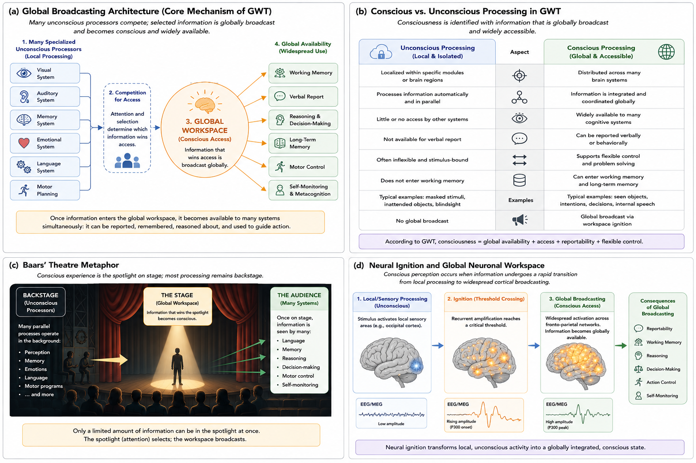
```

Figure @ref(fig:fig-gwt) illustrates the architecture of Global Workspace Theory. Many unconscious systems process information in parallel. These systems compete for access to a limited global workspace. When selected information gains sufficient strength, it becomes globally broadcast and available to multiple systems.

The figure also highlights one of the central debates surrounding GWT. Global broadcasting may explain cognitive access very well, but critics ask whether access is the same as subjective experience. This distinction between access consciousness and phenomenal consciousness is central to evaluating the theory [@block1995].

## Why Global Workspace Theory Became Influential

Global Workspace Theory became influential because it offered a clear and testable model of conscious access. Earlier philosophical debates often focused on whether consciousness could be reduced to physical processes, whether qualia were irreducible, or whether consciousness required a non-physical mind. GWT shifted the focus toward cognitive architecture: how does information become available to the whole system?

This approach helped explain several important features of consciousness. Consciousness is selective. Only a small amount of information is conscious at any moment. Consciousness is capacity-limited. We cannot consciously process everything at once. Conscious information is flexible. Once information becomes conscious, it can be used for reasoning, memory, speech, planning, and voluntary action.

GWT also explained why unconscious processing can be sophisticated. A stimulus can be processed unconsciously, influence behaviour, prime later responses, or activate local neural pathways without becoming globally available. Consciousness, on this view, is not required for all information processing. It is required when information must be integrated, shared, and used flexibly across the whole cognitive system.

This made GWT especially attractive within cognitive science and neuroscience because it generated experimentally testable predictions about masking, attentional blink, reportability, working memory, and large-scale neural activation [@dehaene2006; @dehaene2011].

## Historical Development

Global Workspace Theory was originally developed by Bernard Baars as a cognitive architecture for explaining conscious access [@baars1988]. Baars proposed that the mind contains many specialized unconscious processors. These processors operate in parallel, but their information is not automatically available to the whole system. Consciousness occurs when selected contents enter a global workspace and become widely available.

Baars’ model was important because it treated consciousness as functionally useful rather than mysterious or passive. Consciousness allows information to be shared among specialized systems that otherwise operate independently. It therefore supports flexible coordination among perception, memory, language, action, and self-monitoring.

Later, Dehaene and colleagues developed the Global Neuronal Workspace model, which connected Baars’ cognitive architecture to specific neural mechanisms [@dehaene2011; @dehaene2014]. This model proposed that conscious access depends on large-scale cortical broadcasting, especially involving long-range connections and frontoparietal networks.

The Global Neuronal Workspace model introduced the idea of **neural ignition**. A stimulus may initially produce local unconscious processing. If the stimulus receives sufficient attention or strength, neural activity may suddenly amplify and spread across a larger network. This transition from local processing to widespread broadcasting is interpreted as the neural signature of conscious access [@dehaene2011].

## Baars’ Theatre Metaphor

Baars famously described consciousness using a theatre metaphor [@baars1988]. In this metaphor, the stage represents conscious contents. The spotlight represents attention. The audience represents specialized cognitive systems that receive information from the workspace. Backstage processes represent unconscious activity.

The metaphor is useful because it captures the selectivity of consciousness. Only a small part of mental activity appears on the conscious stage at a given time. Much more is happening backstage. Perception, memory, emotion, language, and motor preparation may all proceed unconsciously until some content becomes important enough to enter the spotlight.

The theatre metaphor also emphasizes that consciousness is not isolated. Conscious contents are broadcast to many systems, just as a performance on a stage is visible to an audience. Once information becomes conscious, it can influence many different parts of cognition.

Like all metaphors, the theatre model has limits. It may make consciousness sound too centralized or passive. Contemporary versions of GWT usually describe the workspace as a dynamic network rather than a literal stage. Nevertheless, the metaphor remains a helpful way to introduce the theory.

## Conscious and Unconscious Processing

A major contribution of GWT is its account of the difference between conscious and unconscious processing. The theory does not deny unconscious cognition. In fact, it emphasizes that most cognition is unconscious.

Unconscious processing is typically local, specialized, automatic, and unavailable for report. Examples include subliminal perception, automatic motor routines, priming, unattended stimuli, and some forms of blindsight-related processing. These processes may influence behaviour without becoming conscious.

Conscious processing, by contrast, involves global availability. When information becomes conscious, it can enter working memory, guide reasoning, support verbal report, influence planning, coordinate action, and become available for self-monitoring.

This distinction helps explain why unconscious and conscious processes can both be intelligent in different ways. Unconscious systems may be fast, specialized, and efficient. Conscious processing is slower and capacity-limited, but it allows flexible coordination across multiple systems.

In GWT, consciousness is therefore not simply the presence of information. It is the global availability of information.

## Competition for Workspace Access

GWT proposes that many unconscious systems compete for access to the global workspace. Sensory signals, memories, emotions, goals, motivations, expectations, and attentional processes can all influence what becomes conscious.

This competition helps explain why consciousness is selective. At any moment, the brain processes far more information than can enter awareness. Only some contents gain enough priority, strength, relevance, or attentional support to become globally available.

For example, a faint visual stimulus may be processed unconsciously if it is masked or unattended. The same stimulus may become conscious if it is stronger, task-relevant, emotionally significant, or supported by attention. GWT explains this transition in terms of selection, amplification, and broadcasting.

This model also explains why conscious contents change dynamically. The workspace is not permanently occupied by one content. Different contents compete over time, producing the shifting stream of conscious awareness.

## Neural Ignition and the Global Neuronal Workspace

The Global Neuronal Workspace model gives GWT a neuroscientific interpretation. According to this model, conscious perception occurs when information undergoes large-scale amplification and broadcasting across distributed cortical networks [@dehaene2011; @dehaene2014].

Before ignition, processing remains local and may stay unconscious. A stimulus may activate sensory regions without becoming reportable. After ignition, neural activity becomes more widespread, involving recurrent processing, long-range communication, and coordinated activity across cortical systems.

Experimental studies of masking and conscious perception have been used to support this model. In some experiments, consciously perceived stimuli are associated with later, stronger, and more widespread neural activity than stimuli processed unconsciously [@sergent2004; @delcul2007]. These findings are often interpreted as evidence for a transition from local processing to global access.

Neural ignition is therefore not simply increased brain activity. It refers to a specific kind of large-scale transition in which information becomes available to a broad network. In GWT, this transition is central to conscious access.

## Attention and Consciousness

GWT is closely related to attention, but attention and consciousness are not identical. Attention selects and prioritizes information for processing. Consciousness involves information becoming globally available.

In many cases, attention helps information enter consciousness. A stimulus that is attended is more likely to gain access to the workspace. However, the relation is not perfect. Some attended information may remain unconscious, and some conscious experiences may occur without deliberate attention.

This distinction remains an active area of debate. Some theories treat attention as central to consciousness, while others argue that consciousness and attention can dissociate. GWT typically gives attention an important role in selecting information for global broadcasting, but it does not reduce consciousness entirely to attention.

## Access Consciousness and Phenomenal Consciousness

One of the most important debates surrounding GWT concerns the distinction between access consciousness and phenomenal consciousness [@block1995].

Access consciousness refers to information being available for reasoning, report, memory, decision-making, and action. GWT is especially strong as a theory of access consciousness. It explains how information becomes available across the cognitive system and why conscious information is flexible, reportable, and useful for control.

Phenomenal consciousness refers to subjective experience itself: what it is like to see red, feel pain, hear music, or experience oneself as a subject. Critics argue that GWT may explain access without fully explaining phenomenology. Broadcasting information across the brain may explain why a person can report an experience, but why should broadcasting feel like anything?

This is the hard problem in the context of GWT. The theory explains how information becomes globally usable, but it remains debated whether global usability is sufficient for subjective experience [@chalmers1995; @chalmers1996].

## Experimental Evidence

Global Workspace Theory has been investigated through many experimental paradigms, including visual masking, attentional blink, binocular rivalry, inattentional blindness, working memory tasks, sleep and dreaming, anesthesia, disorders of consciousness, EEG, MEG, and functional neuroimaging.

One important line of evidence comes from visual masking. A stimulus presented briefly and then masked may be processed unconsciously. If the same stimulus becomes conscious, it is often associated with stronger and more widespread neural activity. GWT interprets this difference as evidence for global broadcasting [@dehaene2006; @sergent2004; @delcul2007].

Another line of evidence comes from attentional blink studies. When two targets appear close together in time, the second may fail to reach awareness if processing resources are occupied. GWT explains this in terms of limited workspace capacity and competition for access.

Research on anesthesia and disorders of consciousness also fits naturally with GWT. Loss of consciousness may involve disruption of long-range communication and global integration. Recovery of consciousness may involve restoration of large-scale coordination [@laureys2005; @owen2006; @koch2016].

Overall, GWT has been influential because it generates empirical predictions. It connects conscious access with measurable changes in neural activity, especially large-scale activation and integration.

## No-Report Paradigms

A major contemporary debate concerns whether GWT confuses consciousness with reportability. Many experiments require participants to report whether they saw a stimulus. But reporting requires attention, decision-making, memory, and motor response. These processes may add neural activity that is not part of consciousness itself.

No-report paradigms attempt to separate conscious experience from explicit behavioural report [@tsuchiya2015]. For example, researchers may use eye movements, pupil responses, or other indirect measures to infer conscious perception without asking for a direct report.

Some no-report studies suggest that frontoparietal activation may reflect reporting, decision-making, or task demands rather than consciousness itself. This challenges strong versions of GWT that identify consciousness closely with frontoparietal broadcasting.

Supporters of GWT respond that conscious access and reportability are deeply connected, even if report-related activity must be distinguished from consciousness itself. The debate remains important because it affects how neural evidence for GWT should be interpreted.

## Relation to Other Theories

GWT overlaps with several major theories discussed elsewhere in this book, but it also differs from them in important ways.

### Relation to Functionalism

GWT strongly reflects functionalist principles. It explains consciousness in terms of information access, broadcasting, cognitive coordination, and functional integration. Consciousness is defined less by what it is made of and more by what it allows the system to do.

### Relation to Recurrent Processing Theory

Both GWT and Recurrent Processing Theory emphasize the importance of recurrent neural activity. However, Recurrent Processing Theory often argues that local recurrent processing may be sufficient for conscious perception, whereas GWT emphasizes global broadcasting and large-scale access [@lamme2006].

### Relation to Integrated Information Theory

Integrated Information Theory focuses on intrinsic causal structure and the degree to which a system integrates information [@tononi2004; @oizumi2014]. GWT, by contrast, focuses on cognitive access and global availability. IIT is often more directly concerned with phenomenal structure, while GWT is strongest as a theory of access.

### Relation to Predictive Processing

Predictive Processing explains perception and cognition in terms of hierarchical prediction and error correction [@friston2010; @clark2013]. Some interpretations connect conscious access with large-scale updating, precision weighting, and coordination across levels. This can overlap with GWT, although the theories use different explanatory frameworks.

### Relation to Higher-Order and Attention Schema Theories

Higher-Order theories emphasize that a mental state becomes conscious when it is represented by a higher-order state [@rosenthal2005; @lau2011]. Attention Schema Theory argues that consciousness arises from the brain’s model of attention [@graziano2013]. GWT differs by focusing on global broadcasting rather than higher-order representation or attention modeling, although all three theories explain consciousness partly through cognitive access and system-level organization.

### Relation to Consciousness-First Theories

GWT differs sharply from consciousness-first theories such as panpsychism, cosmopsychism, idealism, or Taheri’s T-Consciousness. GWT begins with cognitive architecture and explains consciousness through information access and neural broadcasting. Consciousness-first theories begin from the idea that consciousness is fundamental or prior to physical organization. These theories will be discussed later in the book.

## Strengths of Global Workspace Theory

Global Workspace Theory has several major strengths. First, it provides a clear cognitive architecture. It explains how specialized unconscious systems can coordinate through a shared workspace.

Second, it has strong empirical relevance. GWT connects directly to masking, attentional blink, working memory, reportability, neuroimaging, EEG, anesthesia, and disorders of consciousness.

Third, it explains access consciousness very well. It accounts for why conscious information is reportable, flexible, memorable, and available for reasoning and planning.

Fourth, GWT is compatible with computational modeling and artificial intelligence. Its architecture can be implemented in models involving competition, selection, broadcasting, and system-wide availability.

Finally, GWT helps explain why consciousness is selective and capacity-limited. The workspace cannot broadcast everything at once. Consciousness therefore involves competition and prioritization.

## Weaknesses and Criticisms

The most common criticism of GWT is that it may explain access consciousness better than phenomenal consciousness. Global broadcasting explains why information becomes reportable and usable, but it may not explain why information is experienced.

This criticism connects GWT to the hard problem. Even if neural ignition explains conscious access, critics ask why global availability should produce subjective feeling [@chalmers1995; @chalmers1996].

A second criticism concerns the role of frontoparietal activity. Some researchers argue that frontoparietal activation may reflect report, task demands, attention, or decision-making rather than consciousness itself. No-report paradigms have intensified this debate [@tsuchiya2015].

A third criticism is the overflow argument. Some philosophers argue that conscious experience may contain more detail than can be accessed, reported, or stored in working memory. If consciousness overflows access, then GWT may underestimate the richness of phenomenology.

A fourth criticism concerns capacity limitations. GWT emphasizes a limited workspace, but conscious experience often appears continuous, rich, and world-involving. Critics argue that the model may fit reportable contents better than the full structure of lived experience.

## Global Workspace Theory and Artificial Intelligence

GWT has important implications for artificial intelligence and machine consciousness. If consciousness depends on global broadcasting, then artificial systems might become conscious if they possess a sufficiently integrated workspace architecture.

In such a system, specialized modules would process information in parallel. Selected information would enter a central or distributed workspace. That information would then become available for planning, memory, self-monitoring, language, decision-making, and action. This resembles some cognitive architectures in artificial intelligence.

However, GWT does not automatically imply that current AI systems are conscious. A system may process language, retrieve information, and generate intelligent outputs without having unified subjective experience. Critics argue that current systems may lack embodiment, affect, biological regulation, autonomous agency, or phenomenal perspective [@butlin2023; @seth2021].

From a GWT perspective, the key question is whether an artificial system has genuine global availability and flexible integration, not merely input-output performance. From a phenomenological or consciousness-first perspective, the question is deeper: whether such availability is enough for experience.

## Open Questions

Several important questions remain unresolved for Global Workspace Theory. Is global broadcasting sufficient for subjective experience, or only for reportability and access? Can consciousness exist without report? Are frontoparietal networks necessary for consciousness, or mainly for task performance? Does neural ignition mark consciousness itself or the cognitive consequences of consciousness? Can artificial systems instantiate a genuine global workspace? How should GWT explain the qualitative character of experience?

These questions show why GWT remains both powerful and incomplete. It is one of the best-developed theories of conscious access, but its relation to phenomenal consciousness remains debated.

## Evaluation

Global Workspace Theory is one of the most influential and experimentally productive theories in consciousness science. It connects cognitive architecture, neuroscience, reportability, working memory, attention, and computational modeling in a coherent framework.

Its greatest strength is its explanation of conscious access. GWT explains how information becomes globally available, why conscious contents are reportable, why attention matters, why consciousness is capacity-limited, and why conscious information supports flexible reasoning and action.

Its greatest weakness is that global access may not be the same as subjective experience. The theory may explain what consciousness does within cognition without fully explaining why consciousness feels like anything from the inside.

For this reason, GWT is best understood as a powerful theory of access consciousness and cognitive coordination. Whether it is also a complete theory of phenomenal consciousness remains unresolved.

## Chapter Summary

Global Workspace Theory proposes that consciousness occurs when selected information becomes globally available to multiple cognitive systems. Most brain processing remains unconscious, local, automatic, and specialized. Consciousness arises when information enters a global workspace and is broadcast widely across the system.

Baars developed GWT as a cognitive architecture, using the theatre metaphor to explain conscious access. Dehaene and colleagues later developed the Global Neuronal Workspace model, linking conscious access to neural ignition, recurrent processing, and large-scale cortical broadcasting.

GWT is especially strong in explaining access consciousness, reportability, working memory, attentional selection, flexible reasoning, and cognitive coordination. It has generated testable predictions and influenced experimental research on masking, attentional blink, neuroimaging, anesthesia, and disorders of consciousness.

The major criticism is that GWT may not fully explain phenomenal consciousness. Global broadcasting may explain how information becomes usable and reportable, but it remains debated whether this explains subjective experience itself.

The central unresolved question is whether consciousness is identical with global access, or whether global access is only one functional condition associated with conscious experience.

<!--chapter:end:09-global-workspace-theory.Rmd-->

# Integrated Information Theory {#iit}

## Chapter Overview

Integrated Information Theory, usually abbreviated as IIT, is one of the most ambitious and controversial contemporary theories of consciousness. Developed primarily by Giulio Tononi and collaborators, IIT proposes that consciousness corresponds to integrated causal information generated by a system that exists as an irreducible whole [@tononi2004; @oizumi2014].

Unlike theories that begin primarily with cognition, reportability, attention, behaviour, or information access, IIT begins with the structure of conscious experience itself. It asks what properties experience appears to have from the inside, and then attempts to identify what kind of physical system could support those properties.

According to IIT, consciousness is not simply computation, intelligent behaviour, sensory processing, or functional performance. A system is conscious to the extent that it has intrinsic causal structure that is both integrated and irreducible. This means that the system must make a difference to itself as a whole, rather than functioning merely as a collection of independent parts.

IIT is distinctive because it attempts to provide a formal theory of phenomenal consciousness. It places special emphasis on intrinsic existence, unity, differentiation, integration, exclusion, causal structure, and the quantity known as Φ, or Phi [@tononi2008; @oizumi2014].

At the same time, IIT remains deeply controversial. Critics argue that integrated information may not explain why experience feels like anything, that Φ is difficult to calculate for realistic systems, and that IIT may attribute consciousness too broadly to simple systems [@cerullo2015; @aaronson2014; @bayne2018].

This chapter introduces IIT’s central claims, phenomenological axioms, physical postulates, the concept of integrated information, neuroscientific implications, strengths, criticisms, and implications for artificial intelligence, animals, and consciousness-first theories.

## Learning Objectives

After reading this chapter, the reader should be able to:

* Define the central claim of Integrated Information Theory.
* Explain the meaning of integrated information and Φ.
* Describe IIT’s phenomenological starting point.
* Distinguish IIT from access-based theories such as Global Workspace Theory.
* Explain the concepts of intrinsic existence, integration, irreducibility, and exclusion.
* Analyze IIT’s neuroscientific implications.
* Evaluate major strengths and criticisms of IIT.
* Discuss IIT’s implications for artificial intelligence, animal consciousness, and panpsychism.
* Understand how IIT relates to the hard problem of consciousness.

## Why Integrated Information Theory Became Influential

Integrated Information Theory became influential because it addressed a perceived limitation in many cognitive theories of consciousness. Many theories explain consciousness in terms of attention, reportability, working memory, global access, behavioural control, or cognitive coordination. These are important features of conscious cognition, but Tononi argued that they may not explain consciousness as experience [@tononi2004].

IIT therefore shifts the starting point. Instead of asking first what consciousness does, it asks what consciousness is like. Conscious experience appears unified, structured, specific, and present for the subject. IIT attempts to derive physical requirements from these phenomenological features.

This reversal of explanatory direction made IIT philosophically distinctive. Global Workspace Theory, for example, begins from cognitive access and broadcasting [@baars1988; @dehaene2011]. IIT begins from experience itself and asks what kind of causal system could make such experience possible.

IIT also became influential because it attempts to formalize consciousness mathematically. It does not merely state that consciousness depends on complexity or integration. It tries to define integrated information, measure it through Φ, and connect that measure to the degree and structure of consciousness [@oizumi2014; @tononi2016].

## Historical Development

IIT was first proposed by Giulio Tononi in the early 2000s as an attempt to explain consciousness in terms of information integration [@tononi2004]. The original theory emphasized that conscious experience is both highly differentiated and unified. A conscious state rules out many alternative possible states, making it informative, while also appearing as one unified experience.

Later versions of IIT became more sophisticated. Tononi, Oizumi, Koch, and collaborators developed the theory into a formal framework based on intrinsic causal power, irreducibility, and cause-effect structure [@oizumi2014; @tononi2016]. These later versions shifted the focus from information in a general sense to integrated causal structure: the way a system constrains its own possible past and future states.

IIT developed partly in response to theories that emphasized conscious access, reportability, or cognitive function. Such theories are powerful, but IIT argues that consciousness should not be defined by what an outside observer can report or measure. Instead, consciousness should be understood from the intrinsic perspective of the system itself.

This makes IIT especially important in debates about the hard problem. While many scientific theories focus on the mechanisms associated with consciousness, IIT attempts to explain why certain physical systems have experience at all [@chalmers1995; @chalmers1996].

## The Phenomenological Starting Point

A defining feature of IIT is that it begins with phenomenology. It does not begin by asking which brain regions are active during conscious perception or which behaviours indicate awareness. Instead, it begins by asking what properties conscious experience seems to have in itself.

IIT proposes that every conscious experience has several basic features. Experience exists for the subject. It has internal structure. It is specific rather than vague. It is unified rather than merely a collection of separate fragments. It is definite and bounded rather than indeterminate.

```{r fig-iit, echo=FALSE, fig.cap="Integrated Information Theory (IIT). Panel A compares low and high integration. Panel B summarizes IIT’s phenomenological axioms. Panel C illustrates the conceptual meaning of Φ (Phi). Panel D presents a simplified consciousness spectrum across systems. Panel E illustrates intrinsic cause-effect structure and irreducible causal organization.", out.width="100%", fig.align="center"} id="x8s4mn"
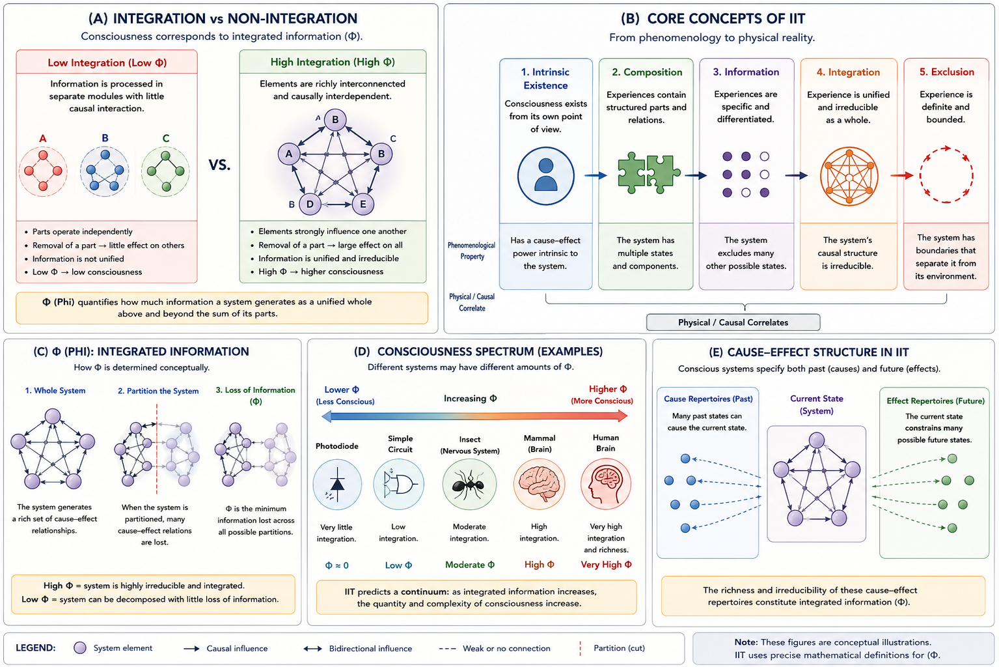
```

Figure @ref(fig:fig-iit) summarizes the core framework of IIT. Panel B represents the phenomenological axioms, while the other panels illustrate integration, Φ, the consciousness spectrum, and intrinsic cause-effect structure.

The important point is that IIT does not treat consciousness primarily as reportability or external behaviour. It treats consciousness as intrinsic experience and then asks what physical requirements follow from that.

## IIT’s Phenomenological Axioms

IIT proposes a set of phenomenological axioms. These are intended to describe features that are present in every conscious experience.

### Intrinsic Existence

Conscious experience exists intrinsically. It exists for the subject having the experience, not merely for an outside observer. A conscious state is not simply a pattern that someone else can measure. It is present from its own first-person perspective.

This axiom distinguishes IIT from purely external or behavioural accounts. A system may display complex behaviour from the outside, but IIT asks whether the system has intrinsic causal existence for itself.

### Composition

Conscious experience is structured. It contains parts, distinctions, and relations. For example, a visual scene may include colours, shapes, spatial relations, objects, background, bodily feeling, and emotional tone. Consciousness is not usually an undifferentiated blank.

Composition means that experience has internal organization. IIT therefore looks for physical systems whose causal structure can support structured experience.

### Information

Every conscious experience is specific. To experience one thing is to exclude many alternatives. Seeing a red object is different from seeing a blue object, hearing a sound, feeling pain, or having no visual experience at all.

In IIT, information does not simply mean data transmission. It means that a state specifies one experience rather than many other possible experiences. Consciousness is informative because each experience is differentiated from alternatives [@tononi2004].

### Integration

Conscious experience is unified. A single experience normally cannot be decomposed into fully independent conscious parts. When one sees a visual scene, hears sounds, and feels bodily presence, these are typically experienced together as one field of awareness.

This axiom is central to IIT. Consciousness is not just information. It is integrated information. The whole experience is more than a set of independent fragments.

### Exclusion

Conscious experience is definite. At any given moment, experience has a particular content, boundary, and scale. One does not experience every possible interpretation or every possible level of organization simultaneously.

The exclusion axiom is one of IIT’s most distinctive and controversial claims. It implies that among many overlapping possible systems, only the one with maximal irreducible causal structure constitutes the conscious subject at that moment [@oizumi2014].

## Integrated Information and Φ

The central quantitative concept in IIT is Φ, or Phi. Φ is intended to represent how much integrated information a system generates as an irreducible whole.

A system has high Φ when its components interact in such a way that the system cannot be reduced to independent parts without losing significant causal structure. In other words, the whole system makes a difference to itself in a way that its parts alone do not.

A system has low Φ when its components operate mostly independently. If the system can be divided into parts with little loss of causal organization, then it has low integration.

Figure @ref(fig:fig-iit) Panel A illustrates the difference between low and high integration. A fragmented system may contain many components, but if those components do not strongly constrain one another, the system does not form an integrated whole. A highly integrated system, by contrast, has internal causal unity.

IIT therefore does not equate consciousness with complexity alone. A system can be complex but not strongly integrated. Nor does IIT equate consciousness with intelligence alone. A system may perform complex computations without forming an irreducible intrinsic causal structure.

## Irreducibility and System Unity

Irreducibility is one of IIT’s most important ideas. According to IIT, a conscious system must be more than the sum of independent parts. The whole must have causal power that cannot be captured by partitioning the system into separate components.

This is why Φ is related to partitioning. If a system is divided into parts and little causal structure is lost, then the system was not strongly integrated. If dividing the system destroys significant causal structure, then the system has a higher degree of irreducibility.

This emphasis on irreducibility helps explain why IIT gives special importance to unity. Consciousness appears unified from the first-person point of view. IIT attempts to explain this unity by identifying physical systems that are causally integrated in an irreducible way.

This also explains why IIT differs from simple information-processing theories. A digital computer may process large amounts of information, but IIT asks whether that processing forms an integrated intrinsic causal whole. From the IIT perspective, information processing alone is not sufficient.

## Intrinsic Cause-Effect Structure

IIT proposes that conscious systems possess intrinsic cause-effect structure. This means that the system constrains its own possible past and future states. It is not merely responding to external inputs or producing external outputs. It has internal causal organization that exists from the system’s own perspective.

Figure @ref(fig:fig-iit) Panel E illustrates this idea. A conscious system is one whose internal mechanisms specify a structured set of causal possibilities. These possibilities form what IIT calls a cause-effect structure.

This idea separates IIT from purely functionalist or computational theories. Functionalism often defines mental states by what they do in relation to inputs, outputs, and other states. IIT argues that what matters is not only functional role but intrinsic causal organization.

For this reason, two systems that perform the same input-output function might not be equally conscious according to IIT. A biological brain and a digital simulation might behave similarly, but they could differ in intrinsic causal structure.

## Consciousness as a Spectrum

IIT implies that consciousness may exist along a spectrum. Systems can have different degrees of integrated information. Therefore, consciousness may not be strictly all-or-nothing.

Figure @ref(fig:fig-iit) Panel D illustrates this idea. Simple systems may have extremely low Φ. Animals may have varying degrees of consciousness. Human brains may generate highly integrated conscious experience. Artificial systems might be conscious if they possess the right intrinsic causal structure.

This spectrum view has important implications. It allows IIT to consider consciousness in infants, animals, patients with disorders of consciousness, and potentially artificial systems. It also means that consciousness may not be limited to human language, reportability, or reflective self-awareness.

However, the spectrum view also raises controversy. If even simple systems have some integrated information, does IIT imply that very simple systems have minimal consciousness? Critics argue that this may lead to panpsychist or panpsychist-like consequences [@cerullo2015; @bayne2018].

## IIT and Neuroscience

IIT has important implications for neuroscience. It predicts that consciousness should correlate with integrated, recurrent, and causally unified neural organization. Consciousness should not depend simply on the number of neurons, the amount of activity, or computational complexity alone.

One common example is the cerebellum. The cerebellum contains a very large number of neurons and performs sophisticated computations. Yet damage to the cerebellum does not usually eliminate consciousness. IIT explains this by pointing to the cerebellum’s relatively modular organization. It may process information efficiently without generating the kind of integrated causal structure associated with conscious experience [@tononi2004; @koch2016].

IIT is also relevant to anesthesia, sleep, dreaming, coma, and minimally conscious states. These conditions involve changes in integration, complexity, and causal communication across the brain. Research on perturbational complexity has been especially important. The perturbational complexity index, or PCI, measures the complexity of brain responses to direct stimulation and has been used to distinguish wakefulness, sleep, anesthesia, and disorders of consciousness [@massimini2005; @casali2013].

Although PCI is not identical to Φ, it is often discussed as empirically related to IIT’s emphasis on integrated complexity. It provides one example of how IIT-inspired ideas can influence clinical and experimental neuroscience.

## IIT and the Hard Problem

IIT is one of the few major scientific theories that explicitly attempts to address phenomenal consciousness rather than only access consciousness. It does not define consciousness primarily in terms of report, behaviour, attention, or global broadcasting. Instead, it attempts to explain consciousness as intrinsic integrated causal structure.

This makes IIT especially relevant to the hard problem. The hard problem asks why physical processes are accompanied by subjective experience at all [@chalmers1995; @chalmers1996]. IIT’s answer is that consciousness is identical to integrated information understood as intrinsic cause-effect structure.

Critics argue that this answer may not fully solve the problem. Even if a system has high Φ, why should integrated information feel like anything? Why should causal structure have subjective character? This is sometimes called a version of the mapping problem: how exactly does a mathematical or causal structure map onto a particular experience?

IIT therefore offers one of the most direct attempts to bridge physical structure and phenomenology, but whether it succeeds remains deeply debated [@levine1983; @bayne2018].

## Relation to Other Theories

IIT differs from many other theories discussed in this book because it begins from phenomenology rather than cognitive function.

### Relation to Global Workspace Theory

Global Workspace Theory explains consciousness in terms of global broadcasting, reportability, cognitive access, and flexible control [@baars1988; @dehaene2011]. IIT instead emphasizes intrinsic causal structure, irreducibility, and phenomenological unity.

Many researchers interpret GWT as strongest for access consciousness, while IIT attempts to explain phenomenal consciousness more directly. The two theories therefore often target different explanatory aspects of consciousness.

### Relation to Functionalism

Functionalism defines mental states by causal roles and functional organization. IIT rejects the idea that functional equivalence is automatically enough for consciousness. According to IIT, two systems could perform the same function while differing in intrinsic causal structure.

This makes IIT especially important in debates about artificial intelligence. A digital system might simulate a conscious process functionally, but IIT asks whether it has the right intrinsic causal organization to be conscious.

### Relation to Emergentism

IIT overlaps with emergentism because it treats consciousness as arising from integrated system-level organization. However, IIT is more formal and specific than many emergentist theories. It attempts to quantify the relevant organization through Φ and to connect it to phenomenological axioms.

Emergentism often says that consciousness arises from complexity. IIT tries to specify what kind of complexity matters: irreducible integrated causal structure.

### Relation to Recurrent Processing and Predictive Processing

IIT overlaps with theories that emphasize recurrent interaction and integration. Recurrent Processing Theory argues that recurrent neural activity is central to conscious perception [@lamme2006]. Predictive Processing explains perception and cognition through hierarchical prediction and error correction [@friston2010; @clark2013]. IIT differs from both by grounding consciousness in intrinsic causal structure rather than perceptual recurrence or predictive inference alone.

### Relation to Panpsychism and Consciousness-First Theories

IIT is not identical to panpsychism, but some philosophers argue that it has panpsychist-like implications because it may attribute minimal consciousness to systems with integrated causal structure [@goff2017; @bayne2018]. This makes IIT relevant to later discussions of panpsychism, cosmopsychism, and consciousness-first theories.

However, IIT differs from Taheri’s T-Consciousness and other consciousness-first frameworks. IIT begins from physical systems and asks which systems have intrinsic causal structure sufficient for consciousness. T-Consciousness and similar consciousness-first approaches begin from consciousness as foundational or prior to material organization. These approaches will be discussed later in the book.

## Strengths of Integrated Information Theory

IIT has several major strengths. First, it directly engages with phenomenology. Unlike theories focused mainly on reportability or cognitive access, IIT begins with the structure of experience itself.

Second, IIT provides one of the most mathematically explicit frameworks in consciousness research. Although the mathematics is difficult and controversial, the attempt to formalize consciousness gives the theory unusual precision.

Third, IIT emphasizes unity and irreducibility. Conscious experience appears unified, and IIT offers a principled way to connect this unity with physical integration.

Fourth, IIT has clinical and neuroscientific relevance. IIT-inspired measures of complexity and integration have influenced research on anesthesia, sleep, coma, and disorders of consciousness [@casali2013; @koch2016].

Fifth, IIT provides a framework for thinking about non-human consciousness. It can be applied, at least in principle, to animals, infants, patients, and artificial systems without relying entirely on verbal report.

## Weaknesses and Criticisms

IIT faces several major criticisms. One is computational difficulty. Calculating Φ precisely for realistic systems is extremely difficult. The brain is vastly complex, and exact Φ calculations may be impossible for large biological systems.

A second criticism is over-attribution. IIT may imply that simple systems with non-zero integrated information possess some degree of consciousness. Critics argue that this expands consciousness attribution too broadly, possibly to simple circuits or systems that do not plausibly have experience [@aaronson2014; @cerullo2015].

A third criticism concerns empirical testing. Some researchers argue that IIT is difficult to falsify because its core claims are abstract and its exact measures are difficult to apply directly to real brains.

A fourth criticism is the mapping problem. Even if Φ measures integration, it remains unclear why a specific cause-effect structure should correspond to a specific experience. How does a mathematical structure become the experience of red, pain, music, or selfhood?

A fifth criticism is that IIT may provide a weaker account of cognition than theories such as GWT. It may explain unity and intrinsic structure, but it does not as directly explain reportability, attention, reasoning, working memory, or behavioural control.

These criticisms do not make IIT unimportant. They show why it remains one of the most debated theories in consciousness science.

## IIT and Artificial Intelligence

IIT has major implications for artificial intelligence. If consciousness depends on intrinsic integrated causal structure, then artificial systems could be conscious only if they possess the right kind of causal organization.

This creates a distinction between simulation and instantiation. A digital computer may simulate a system with high integration, but IIT asks whether the computer itself has high intrinsic causal integration. A simulation of a conscious system may not itself be conscious if the underlying hardware lacks the relevant causal structure.

This makes IIT more cautious than many functionalist or computational theories. A system could display intelligent behaviour, pass behavioural tests, or generate language without necessarily having high Φ. From IIT’s perspective, intelligence and consciousness are not the same.

At the same time, IIT does not rule out artificial consciousness in principle. A non-biological system could be conscious if it generated sufficient integrated causal structure. The question is not whether the system is made of neurons, but whether it forms an intrinsic, irreducible causal whole.

Recent debates about AI consciousness often include IIT among the theories that might provide indicators for machine consciousness, while also noting the difficulty of applying IIT to current artificial architectures [@butlin2023].

## Open Questions

Several important questions remain unresolved for IIT. Why should integrated information generate subjective experience? Can Φ be measured reliably in realistic systems? Is consciousness fundamentally graded? Do simple systems have minimal consciousness? Are IIT’s phenomenological axioms universally valid? Does IIT overextend consciousness attribution? Can digital systems possess high Φ? Does integration explain specific qualitative experiences, or only the unity and degree of consciousness?

These questions show why IIT remains both influential and controversial. It offers a bold attempt to connect phenomenology and physical structure, but many details remain unresolved.

## Evaluation

Integrated Information Theory is one of the most ambitious theories in consciousness studies. It attempts to explain consciousness not merely as access, reportability, behaviour, or computation, but as intrinsic integrated causal structure.

Its greatest strength is that it takes phenomenal consciousness seriously. It begins from experience itself and attempts to derive physical requirements from phenomenological features such as unity, specificity, structure, and irreducibility.

Its greatest weakness is that the connection between integrated information and subjective experience remains contested. Critics argue that IIT may not fully explain why integrated causal structure should feel like anything. Practical challenges in calculating Φ and concerns about over-attribution also remain significant.

IIT is therefore both groundbreaking and controversial. It is one of the few theories that attempts to formalize phenomenal consciousness directly, but whether it successfully solves the hard problem remains an open question.

## Chapter Summary

Integrated Information Theory proposes that consciousness corresponds to integrated, irreducible causal information generated by a system. The central measure associated with the theory is Φ, which represents the degree to which a system forms an integrated whole.

IIT begins from phenomenological axioms: intrinsic existence, composition, information, integration, and exclusion. It then derives physical postulates concerning causal structure, irreducibility, and system unity.

The theory differs from Global Workspace Theory because it focuses less on reportability and cognitive access and more on intrinsic phenomenal structure. It differs from functionalism because it does not treat input-output organization alone as sufficient for consciousness.

IIT has influenced neuroscience, philosophy, complexity science, clinical research, and debates about artificial intelligence. It is especially relevant to anesthesia, sleep, disorders of consciousness, animal consciousness, and machine consciousness.

Its major strengths are its direct engagement with phenomenology, formal structure, and emphasis on unity. Its major weaknesses are computational difficulty, controversial implications, over-attribution concerns, and the unresolved question of why integrated information should generate subjective experience.

The central unresolved question is whether integrated causal structure truly explains consciousness, or whether it identifies an important correlate without fully explaining phenomenal experience itself.

<!--chapter:end:10-integrated-information-theory.Rmd-->

# Higher-Order Thought Theory {#hot}

## Chapter Overview

Higher-Order Thought Theory, often abbreviated as HOT, proposes that a mental state becomes conscious when it becomes the object of a suitable higher-order representation. In other words, consciousness requires not only having a mental state, but also some form of awareness of being in that state [@rosenthal2005; @lau2006].

According to HOT theory, first-order perceptual and cognitive processes can occur unconsciously. A person may process visual information, respond to stimuli, prepare actions, or show behavioural sensitivity without having conscious awareness of those states. Consciousness arises when the system represents itself as being in a particular mental state.

HOT theories therefore place metacognition, introspection, self-monitoring, and awareness of mental states at the center of consciousness research. The theory is especially important because it offers a clear explanation of why some mental processing is conscious while other processing remains unconscious.

Unlike Global Workspace Theory, which emphasizes global broadcasting, or Integrated Information Theory, which emphasizes intrinsic causal integration, HOT theory emphasizes higher-order representation. A mental state becomes conscious not merely because it carries information, but because the subject is in some sense aware of having that state [@baars1988; @tononi2004; @oizumi2014].

At the same time, HOT theory remains controversial. Critics argue that higher-order representation may explain introspection, self-monitoring, and reflective access without fully explaining phenomenal consciousness itself. The central question is whether awareness of a mental state is sufficient to explain what it feels like to have that state [@block1995; @chalmers1995; @chalmers1996].

This chapter explains the conceptual foundations of HOT theory, the distinction between first-order and higher-order states, its account of unconscious processing and blindsight, its relationship to metacognition and neuroscience, and its strengths and criticisms.

## Learning Objectives

After reading this chapter, the reader should be able to:

* Define the central claim of Higher-Order Thought Theory.
* Distinguish first-order mental states from higher-order mental states.
* Explain how higher-order representation is proposed to produce conscious awareness.
* Describe HOT interpretations of unconscious perception and blindsight.
* Explain the relationship between HOT theory, metacognition, and introspection.
* Compare HOT with Global Workspace Theory, Integrated Information Theory, and Recurrent Processing Theory.
* Evaluate major strengths and criticisms of HOT theory.
* Explain HOT’s implications for artificial intelligence and machine consciousness.

## Why HOT Theory Became Influential

Higher-Order Thought Theory became influential because it offers a direct explanation for a central fact about the mind: not all mental processing is conscious. The brain can process information, guide behaviour, prepare actions, and evaluate stimuli without conscious awareness. HOT theory explains this by distinguishing between having a mental state and being aware of having that mental state.

This distinction is important because unconscious processing can be sophisticated. Subliminal stimuli can influence behaviour. Emotional reactions may occur before conscious recognition. Motor preparation can begin before reflective awareness. Some patients can respond to visual stimuli without reporting conscious vision. HOT theory argues that these cases involve first-order processing without appropriate higher-order awareness.

The theory also became influential because it connects consciousness with metacognition. Human beings do not merely perceive the world; they can also reflect on their own perceptions, judge their confidence, notice uncertainty, and report what they are experiencing. HOT theory treats this capacity for higher-order awareness as central to consciousness [@rosenthal2005; @fleming2014].

This made HOT theory important in both philosophy of mind and cognitive neuroscience. It offers a framework for studying introspection, confidence, self-monitoring, and the neural systems that support awareness of mental states.

## Historical Development

Ideas about reflective awareness have a long history in philosophy, but the modern form of HOT theory was developed most prominently by David Rosenthal [@rosenthal2005]. Rosenthal argued that a mental state becomes conscious when one has an appropriate higher-order thought about being in that mental state.

Other higher-order approaches were developed by philosophers such as Peter Carruthers, William Lycan, and Rocco Gennaro, who emphasized different forms of higher-order representation and self-monitoring [@lycan1996; @gennaro1996; @carruthers2000]. These approaches differ in detail, but they share the idea that consciousness depends on a representational relation between a higher-order state and a lower-order mental state.

HOT theory emerged partly as an alternative to theories that identify consciousness with first-order perception, behaviour, or information processing alone. Behaviourism had avoided inner mental states, while early cognitive models often emphasized computation without clearly explaining why some states become conscious. HOT theory proposed that consciousness depends specifically on meta-representational structure.

Later developments connected HOT theory with empirical research on metacognition, confidence judgments, introspective accuracy, and prefrontal cortical function [@lau2006; @lau2011; @fleming2014]. This helped make HOT theory relevant not only to philosophy, but also to experimental psychology and neuroscience.

## The Core Idea of Higher-Order Representation

The defining claim of HOT theory is that consciousness depends on awareness of mental states. A first-order mental state represents something in the world, the body, or thought. A higher-order state represents the subject as being in that first-order state.

For example, a first-order visual state may represent a red apple. According to HOT theory, that visual state becomes conscious when there is a suitable higher-order representation of oneself as seeing the red apple. Without that higher-order representation, the first-order visual processing may still occur, but it remains unconscious.

```{r fig-hot, echo=FALSE, fig.cap="Higher-Order Thought Theory (HOT). Panel A contrasts unconscious first-order processing with conscious higher-order awareness. Panel B illustrates layered representational structure. Panel C compares HOT with Global Workspace Theory and Integrated Information Theory. Panel D illustrates HOT interpretations of blindsight and unconscious perception.", out.width="100%", fig.align="center"} id="q21rtk"
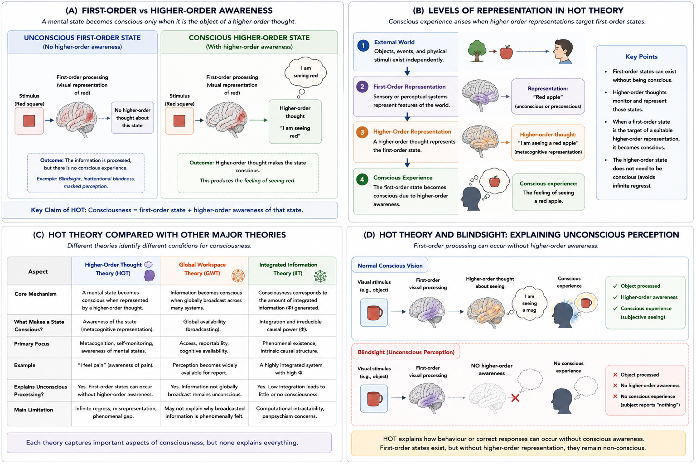
```

Figure @ref(fig:fig-hot) summarizes the basic architecture of HOT theory. Panel A shows the distinction between unconscious first-order processing and conscious higher-order awareness. Panel B illustrates the layered structure of representation. Panel C compares HOT with other theories, and Panel D shows how HOT interprets blindsight and unconscious perception.

The key idea is that processing alone is not enough for consciousness. A state becomes conscious only when the system represents itself as being in that state.

## First-Order Mental States

First-order mental states represent objects, events, bodily conditions, emotions, memories, or thoughts. Seeing a colour, hearing a sound, feeling bodily discomfort, remembering a face, or detecting movement can all involve first-order representation.

HOT theory does not deny the importance of these states. First-order states provide the content that may become conscious. However, HOT theory argues that first-order representation alone is not sufficient for consciousness. A state can represent the world without the subject being consciously aware of that representation.

This claim helps explain unconscious perception. A visual system may process shape, motion, or location without producing conscious visual experience. Similarly, emotional or bodily systems may evaluate significance without the person clearly knowing what they are feeling.

In HOT theory, first-order states are necessary for many conscious experiences, but they become conscious only when represented by an appropriate higher-order state.

## Higher-Order Thoughts

Higher-order thoughts are mental states directed toward other mental states. A higher-order thought might represent “I am seeing red,” “I am feeling pain,” “I am hearing music,” or “I am thinking about this problem.”

The higher-order state does not need to be explicit or verbally formulated. It does not always have to appear as an inner sentence. Many HOT theorists treat higher-order awareness as a form of implicit representation or monitoring. The important point is that the system represents itself as being in a mental state.

This produces a layered architecture:

1. An external or internal condition affects the system.
2. A first-order state represents that condition.
3. A higher-order state represents the subject as being in the first-order state.
4. The first-order state becomes conscious.

HOT theory therefore interprets consciousness as meta-representation. A mental state becomes conscious when it is appropriately represented by another mental state.

## Metacognition and Reflective Awareness

HOT theory is closely connected to metacognition. Metacognition is the ability to monitor, evaluate, and regulate one’s own mental states. It includes introspection, confidence judgments, uncertainty monitoring, error awareness, reflective thought, and self-evaluation [@fleming2014].

For example, when a person says, “I am not sure whether I saw the object,” they are making a metacognitive judgment. When someone feels confident about a memory or notices that they are confused, they are monitoring their own mental states.

HOT theory treats this kind of self-monitoring as central to consciousness. Conscious experience is not merely information processing. It involves a system’s awareness of its own informational or perceptual states.

This metacognitive emphasis distinguishes HOT from theories focused mainly on integration, broadcasting, or recurrent sensory processing. HOT asks not only whether information is processed, but whether the system is aware of processing it.

## Conscious and Unconscious Processing

One of HOT theory’s greatest strengths is its explanation of unconscious processing. According to HOT theory, many mental states remain unconscious because they are not represented at the higher-order level.

This account applies naturally to subliminal perception, masked stimuli, implicit learning, automatic processing, unconscious priming, and some forms of inattentional blindness. In each case, information may influence cognition or behaviour without becoming conscious.

HOT theory therefore separates information processing from conscious awareness. A state can be active, meaningful, and behaviourally influential without being conscious. Consciousness requires the additional step of higher-order representation.

This makes HOT especially useful for explaining cases where behaviour suggests processing but subjective report denies awareness. The theory can say that first-order processing occurred, but higher-order awareness did not.

## HOT and Blindsight

Blindsight is one of the most important cases discussed in relation to HOT theory. Patients with blindsight have damage to primary visual cortex and report that they cannot consciously see stimuli in part of their visual field. Yet in some cases, they can guess the location, movement, or features of stimuli at above-chance levels [@weiskrantz1986].

HOT theory interprets blindsight as a dissociation between first-order visual processing and higher-order awareness. The patient’s visual system may process some information about the stimulus, allowing correct guessing or behavioural response. However, the patient lacks higher-order awareness of seeing the stimulus. Therefore, there is no conscious visual experience.

This interpretation fits naturally with the HOT framework. It explains how visual information can influence behaviour without becoming conscious. It also supports the idea that consciousness requires more than sensory processing alone.

Blindsight remains debated, but it continues to be an important example for theories that distinguish unconscious processing from conscious awareness.

## Neural Basis of HOT Theory

Many HOT theorists associate higher-order awareness with brain systems involved in metacognition, self-monitoring, executive control, and introspective judgment. Prefrontal cortical regions are often discussed because of their role in confidence, report, monitoring, and cognitive control [@lau2006; @lau2011].

Research relevant to HOT includes studies of introspective accuracy, confidence judgments, perceptual decision-making, prefrontal cortex activity, error monitoring, and conscious report. These areas connect HOT theory with cognitive neuroscience and experimental psychology.

However, the neural basis of HOT remains controversial. Some researchers argue that prefrontal activity may reflect report, task demands, attention, or decision-making rather than consciousness itself. Others argue that conscious experience can occur even when explicit metacognition is weak or absent.

This debate is closely related to broader no-report debates in consciousness science. If consciousness can occur without reflective report or metacognitive judgment, then HOT theory may need to distinguish between basic consciousness and explicit introspection.

## HOT Compared with Other Theories

HOT theory differs from several major theories discussed elsewhere in this book.

### Relation to Global Workspace Theory

Global Workspace Theory explains consciousness in terms of global broadcasting and cognitive access [@baars1988; @dehaene2011]. A state becomes conscious when it is made widely available to multiple systems.

HOT theory instead emphasizes higher-order representation. A state becomes conscious when the system represents itself as being in that state. The two theories can overlap, because global broadcasting may support higher-order monitoring. However, they identify different mechanisms as central.

### Relation to Integrated Information Theory

Integrated Information Theory explains consciousness in terms of intrinsic integrated causal structure [@tononi2004; @oizumi2014]. IIT begins from phenomenological unity and asks what kind of physical system can support integrated experience.

HOT theory begins from the distinction between conscious and unconscious mental states. It asks what makes a mental state conscious. Its answer is higher-order awareness rather than integrated information.

### Relation to Recurrent Processing Theory

Recurrent Processing Theory argues that recurrent neural activity, especially within sensory systems, is central to conscious perception [@lamme2006]. HOT theory is more metacognitive. It argues that first-order sensory processing, even recurrent processing, may not be sufficient unless the system has suitable higher-order awareness.

### Relation to Predictive Processing

Predictive Processing explains perception and cognition in terms of hierarchical prediction, error correction, and generative modeling [@friston2010; @clark2013]. HOT theory can be interpreted within this framework if higher-order states are understood as higher-level models of lower-level mental states. However, HOT specifically emphasizes awareness of mental states rather than prediction alone.

### Relation to Attention Schema Theory

Attention Schema Theory explains consciousness as the brain’s simplified model of attention [@graziano2013]. Like HOT, it emphasizes internal modeling. However, HOT focuses on higher-order representation of mental states, while Attention Schema Theory focuses specifically on the brain’s model of attention.

### Relation to Consciousness-First Theories

HOT differs from consciousness-first theories such as panpsychism, cosmopsychism, idealism, or Taheri’s T-Consciousness. HOT treats consciousness as arising from representational and metacognitive architecture. Consciousness-first theories treat consciousness as fundamental or prior to material and cognitive organization. These theories will be discussed later in the book.

## HOT and the Hard Problem

HOT theory explains what makes a mental state conscious rather than unconscious. It explains why first-order processing can occur without awareness and why metacognitive representation matters for introspection and report.

However, critics argue that HOT may not fully solve the hard problem. Even if a higher-order representation makes a mental state conscious, why should higher-order awareness produce subjective feeling? Why should representing oneself as seeing red make there be something it is like to see red?

This criticism parallels objections to functionalism and Global Workspace Theory. HOT may explain awareness of experience more successfully than it explains the existence of experience itself. It may show how mental states become available to introspection, but it may not explain why those states have phenomenal character [@chalmers1995; @chalmers1996].

HOT theorists may respond that a state’s being conscious just is its being represented in the right higher-order way. Critics reply that this still leaves open why such representation is accompanied by feeling. This remains one of the central philosophical debates around the theory.

## Strengths of HOT Theory

HOT theory has several major strengths. First, it gives a clear explanation of unconscious processing. It explains how perception, memory, emotion, and action can occur without conscious awareness.

Second, HOT provides a strong account of metacognition. It connects consciousness with introspection, confidence, self-monitoring, and reflective awareness.

Third, HOT offers a natural interpretation of blindsight. It explains how visual processing can guide behaviour while conscious visual awareness is absent.

Fourth, the theory has a clear representational architecture. It distinguishes first-order content from higher-order awareness, making the structure of the theory conceptually precise.

Fifth, HOT connects philosophy with neuroscience. It encourages empirical research on prefrontal monitoring, confidence judgments, introspective accuracy, and metacognitive control.

## Weaknesses and Criticisms

HOT theory faces several important criticisms. One is the infinite regress problem. If a mental state becomes conscious only when represented by a higher-order state, does the higher-order state also need to be represented by another higher-order state? If so, the theory appears to generate an infinite regress.

HOT theorists typically respond that the higher-order state itself does not need to be conscious in order to make the first-order state conscious. The higher-order state can remain unconscious while still performing its representational role.

A second criticism is the misrepresentation problem. A higher-order state might misrepresent the first-order state. For example, a person might seem to be aware of an experience that does not exist, or might misidentify what they are experiencing. This raises difficult questions about hallucination, illusion, and false awareness.

A related issue is the empty HOT problem. Could a higher-order thought occur without any suitable first-order state? If so, would the person have a conscious experience with no underlying first-order content? HOT theorists differ in how they respond to this problem.

Another major criticism concerns phenomenology. Critics argue that HOT may explain awareness of mental states without explaining the felt character of those states. In other words, the theory may explain introspective access rather than phenomenal consciousness.

Finally, HOT may have difficulty with animal and infant consciousness. If sophisticated higher-order representation is necessary for consciousness, then beings with limited metacognitive capacity may appear less conscious or non-conscious. Critics argue that this conclusion may be too restrictive.

## HOT and Artificial Intelligence

HOT theory has important implications for artificial intelligence and machine consciousness. From a HOT perspective, intelligent behaviour alone is not sufficient for consciousness. A system would need some form of self-monitoring or meta-representation. It would need to represent its own internal states, not merely process external inputs.

This suggests that artificial consciousness would require architectures capable of introspective monitoring, confidence estimation, internal state representation, and perhaps self-modeling. A system that generates language or solves problems without awareness of its own mental states would not be conscious in the HOT sense.

This makes HOT relevant to recent discussions of AI consciousness. Some proposed indicators of machine consciousness include metacognitive monitoring, agency, self-modeling, and global availability [@butlin2023]. HOT contributes to these debates by emphasizing that consciousness may require a system to represent its own representational states.

However, the same philosophical challenge remains. Even if an artificial system developed higher-order representations, would this generate subjective experience, or only a functional model of self-monitoring? HOT gives a clear criterion, but whether that criterion is sufficient for phenomenology remains debated.

## Open Questions

Several questions remain unresolved for HOT theory. Is higher-order awareness always necessary for consciousness? Can phenomenal consciousness occur without reflection? Are animals and infants conscious if they lack sophisticated metacognition? What neural systems support higher-order awareness? Can higher-order states misrepresent or create conscious experience? Could artificial systems develop genuine meta-representation? Does HOT explain subjective feeling or mainly introspective access?

These questions show why HOT remains both influential and contested. It provides a powerful theory of conscious access and self-monitoring, but its relation to phenomenal consciousness remains debated.

## Evaluation

Higher-Order Thought Theory is one of the most important metacognitive theories of consciousness. It explains consciousness in terms of awareness of mental states rather than first-order processing alone.

Its greatest strength is its explanation of the difference between conscious and unconscious processing. HOT naturally explains subliminal perception, blindsight, introspection, confidence judgments, and metacognitive awareness. It also provides a clear representational architecture that connects philosophy with neuroscience.

Its greatest weakness is that higher-order representation may not fully explain phenomenal experience. Critics argue that HOT may explain how a state becomes available to introspection without explaining why it feels like anything.

For this reason, HOT is best understood as a powerful theory of metacognitive consciousness and reflective access. Whether it provides a complete theory of phenomenal consciousness remains unresolved.

## Chapter Summary

Higher-Order Thought Theory proposes that a mental state becomes conscious when it is represented by a suitable higher-order state. First-order states represent the world, body, or thought. Higher-order states represent the subject as being in those first-order states.

HOT theory explains why much mental processing remains unconscious. A perceptual or cognitive state may influence behaviour without conscious awareness if it lacks higher-order representation. This makes HOT especially useful for explaining subliminal perception, blindsight, metacognition, confidence judgments, and introspection.

The theory differs from Global Workspace Theory, which emphasizes global broadcasting, and from Integrated Information Theory, which emphasizes intrinsic integrated causal structure. HOT emphasizes awareness of mental states.

Its strengths include conceptual clarity, a strong account of unconscious processing, and close links to metacognitive research. Its weaknesses include the infinite regress problem, misrepresentation problem, empty HOT problem, and difficulty explaining phenomenal consciousness itself.

The central unresolved question is whether higher-order representation is sufficient for subjective experience, or whether it explains only reflective awareness and introspective access.

<!--chapter:end:11-higher-order-thought.Rmd-->

# Predictive Processing and Active Inference {#predictive-processing}

## Chapter Overview

Predictive Processing and Active Inference are among the most influential frameworks in contemporary cognitive science and theoretical neuroscience. They propose that the brain is not a passive receiver of sensory information, but an active prediction-generating system that continuously attempts to explain the causes of its sensory input [@friston2010; @clark2016].

According to this framework, perception, action, attention, learning, emotion, bodily regulation, selfhood, and perhaps consciousness itself emerge through ongoing attempts to reduce prediction error. Prediction error is the mismatch between what the brain expects and what sensory systems actually receive.

Rather than building conscious perception from raw sensory input alone, Predictive Processing proposes that the brain generates hypotheses about the world and then updates those hypotheses when prediction errors occur. Perception is therefore not passive reception. It is active inference: the brain’s best current interpretation of the causes of sensory input [@helmholtz1867; @rao1999; @friston2005].

This framework became highly influential because it offers a unified way to explain perception, action, attention, learning, hallucination, emotion, embodiment, psychiatric symptoms, and adaptive behaviour. It also connects naturally with Bayesian inference, machine learning, computational neuroscience, robotics, and philosophy of mind [@hohwy2013; @clark2013; @parr2022].

At the same time, major philosophical questions remain. Predictive Processing may explain how organisms model the world and regulate behaviour, but does it fully explain subjective experience? Does prediction-error minimization explain consciousness itself, or does it primarily explain cognition, perception, and adaptive control? These questions connect Predictive Processing directly to the hard problem of consciousness [@chalmers1995; @chalmers1996].

This chapter examines the historical development, conceptual foundations, hierarchical structure, active inference mechanisms, empirical support, philosophical implications, strengths, criticisms, and unresolved questions surrounding Predictive Processing and Active Inference.

## Learning Objectives

After reading this chapter, the reader should be able to:

* Define the central claims of Predictive Processing and Active Inference.
* Explain prediction-error minimization.
* Describe hierarchical predictive processing.
* Distinguish passive perception from predictive perception.
* Explain the relationship between perception, action, and active inference.
* Understand generative models and precision weighting.
* Analyze predictive accounts of hallucinations and altered states.
* Compare Predictive Processing with other theories of consciousness.
* Evaluate strengths and criticisms of the framework.
* Discuss implications for embodiment, selfhood, and artificial intelligence.

## Why Predictive Processing Became Influential

Predictive Processing became influential because it offers a broad framework for connecting many domains that were often studied separately. Perception, action, attention, learning, emotion, bodily regulation, and selfhood can all be interpreted as parts of a single inferential process.

The framework helps explain why perception is shaped by expectation and context. Human beings do not experience the world as a neutral recording of sensory input. What we perceive is influenced by prior knowledge, memory, attention, bodily state, emotional significance, and current goals. Predictive Processing explains this by proposing that perception depends on the interaction between top-down predictions and bottom-up prediction errors.

This approach also helps explain illusions, hallucinations, dreaming, psychosis, psychedelic states, motor control, anxiety, interoception, and adaptive behaviour. In each case, perception and action depend on how the brain balances prior expectations against incoming sensory evidence [@hohwy2013; @clark2016; @seth2021].

Predictive Processing also became influential because it fits naturally with computational neuroscience. It provides a formal framework for understanding perception and action in probabilistic terms. The brain is treated as a system that continuously updates its internal models in response to uncertainty.

## Core Idea in One Picture

Figure @ref(fig:fig-pp) summarizes the major conceptual structure of Predictive Processing and Active Inference.

```{r fig-pp, echo=FALSE, fig.cap="Predictive Processing and Active Inference. Panel A illustrates hierarchical predictive processing and prediction-error minimization. Panel B contrasts passive perception with predictive perception. Panel C illustrates the active inference loop. Panel D applies predictive processing to hallucinations and altered states. Panel E compares predictive processing with other major theories of consciousness.", out.width="100%", fig.align="center"} 
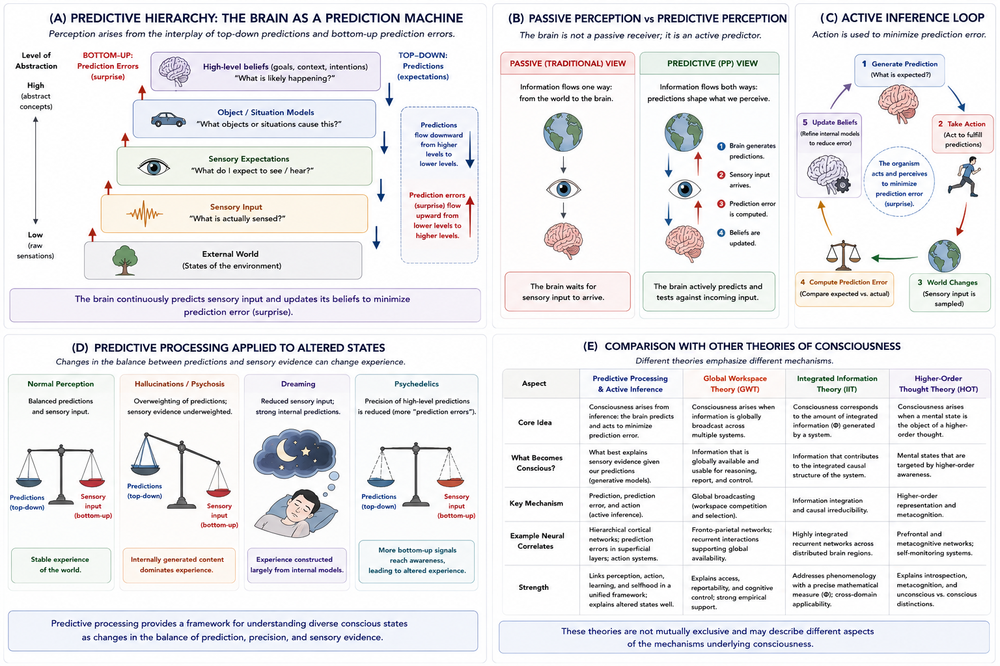
```

As Figure @ref(fig:fig-pp) illustrates, Predictive Processing proposes that perception emerges through continuous interaction between top-down predictions and bottom-up prediction errors. The brain does not merely wait for sensory input. It actively anticipates input and updates its internal models when expectations fail.

The figure also highlights one of the framework’s central philosophical implications: perception is constructed, not passively received. However, it also points to a major unresolved question. Prediction and inference may explain perception and adaptive control, but they do not automatically explain why perception is accompanied by subjective experience.

## Historical Development

The intellectual roots of Predictive Processing extend across several traditions. Hermann von Helmholtz argued that perception involves unconscious inference: the mind interprets sensory signals by inferring their likely causes [@helmholtz1867]. Later developments in cybernetics, Bayesian inference, information theory, machine learning, and computational neuroscience provided formal tools for developing this idea.

In the late twentieth and early twenty-first centuries, predictive coding models became increasingly important in neuroscience. Rao and Ballard proposed influential models of predictive coding in visual cortex, where higher levels generate predictions and lower levels return prediction errors [@rao1999].

Karl Friston’s Free Energy Principle then provided a broad mathematical framework for understanding perception, action, and biological self-organization [@friston2005; @friston2010]. According to this framework, biological systems must resist disorder by reducing uncertainty, surprise, or prediction error in relation to their sensory states.

Andy Clark later helped popularize Predictive Processing as a broad theory of perception, cognition, action, and embodied mind [@clark2013; @clark2016]. Jakob Hohwy also developed an influential philosophical interpretation of the predictive mind [@hohwy2013]. Together, these developments made Predictive Processing one of the most important frameworks in contemporary philosophy of mind and cognitive neuroscience.

## The Brain as a Prediction Machine

The central claim of Predictive Processing is that the brain is a prediction machine. It constantly generates expectations about sensory input, bodily conditions, environmental changes, social interactions, and future outcomes.

Incoming sensory signals are compared with these predictions. When there is a mismatch, the system generates prediction error. The brain then attempts to reduce this error by updating its internal model, shifting attention, revising expectations, changing bodily state, or acting on the world.

This framework reverses the traditional picture of perception. Perception is not simply a process in which the world sends information through the senses and the brain builds an internal image. Instead, the brain actively predicts what sensory input should occur and uses error signals to adjust its predictions.

In this sense, perception is controlled hallucination constrained by sensory evidence. The brain generates models of the world, but those models are corrected by incoming signals [@seth2021].

## Generative Models

Predictive Processing proposes that the brain constructs generative models. A generative model is an internal model that attempts to explain how sensory input is generated by causes in the world, body, and environment.

For example, when seeing a moving object, the brain does not simply register changing light patterns. It infers that there is an object, that the object has a shape, that it is moving in space, and that it may continue moving. These inferences depend on prior expectations and sensory evidence.

Generative models allow organisms to anticipate events, reduce uncertainty, guide behaviour, and maintain adaptive contact with the environment. They also explain why perception can be mistaken. If the brain’s model gives too much weight to expectation or too little weight to sensory correction, perception can become distorted.

This is one reason Predictive Processing has become important in accounts of hallucination, dreaming, and altered states. Experience depends not only on sensory input, but on how the brain interprets that input through its generative model.

## Prediction-Error Minimization

Prediction-error minimization is the central computational principle of Predictive Processing. The brain continuously compares predicted sensory input with actual sensory input. The difference between them is prediction error.

Prediction error can be reduced in two main ways. First, the brain can update its internal model so that future predictions better match sensory input. Second, the organism can act on the world so that sensory input better matches predictions. The first process is perception and learning. The second process is active inference.

For example, if a person expects to see their keys on the table but does not see them, the mismatch produces prediction error. The person may update their belief by thinking the keys are elsewhere. Or they may act by moving objects, turning their head, or searching the room to generate new sensory input.

Prediction-error minimization therefore links perception, action, and learning. The organism is not merely representing the world. It is continuously regulating its relation to the world.

## Passive Perception and Predictive Perception

Predictive Processing changes the traditional understanding of perception. A passive model treats perception as a bottom-up process:

```text
world → senses → perception
```

Predictive Processing proposes a more interactive model:

```text
brain predictions ↔ sensory input
```

In this model, perception is not the direct reading of sensory data. It is the brain’s best current inference about the causes of sensory data. Sensory input constrains perception, but it does not determine perception by itself.

This helps explain why context and expectation shape experience. A sound may be heard differently depending on what one expects. A vague image may be interpreted differently depending on surrounding context. Bodily sensations may feel more threatening when a person is anxious. Perception is therefore inferential, active, and context-sensitive.

This does not mean perception is arbitrary. Predictions are continuously corrected by prediction errors. Conscious experience results from the dynamic balance between expectation and sensory evidence.

## Hierarchical Predictive Processing

Predictive Processing proposes that the brain is organized hierarchically. Higher levels generate more abstract predictions about objects, meanings, contexts, goals, and causes. Lower levels process more immediate sensory features such as edges, motion, sounds, colours, pressure, and bodily signals.

Predictions flow downward through the hierarchy. Prediction errors flow upward. Higher levels attempt to explain lower-level signals, while lower levels report mismatches between prediction and input.

This hierarchical structure allows the brain to integrate perception, memory, attention, action, and interpretation. A visual experience, for example, is not only a set of colours and lines. It is interpreted as an object in a context, with meaning and possible relevance for action.

Hierarchical prediction also helps explain why high-level beliefs can influence low-level perception. Expectations, emotions, and prior knowledge can shape what is perceived, especially under uncertainty.

## Precision Weighting

A major concept in Predictive Processing is precision weighting. Not all prediction errors are treated equally. The brain must estimate which signals are reliable and which are noisy or irrelevant.

Precision refers to the estimated reliability or importance of a signal. A high-precision prediction error strongly influences belief updating. A low-precision prediction error is given less weight.

Attention is often interpreted as a mechanism for adjusting precision. When attention is directed toward a stimulus, prediction errors related to that stimulus may be given greater weight. This allows the brain to prioritize relevant information.

Abnormal precision weighting may help explain hallucinations, psychosis, anxiety, and altered states. If high-level predictions are given too much precision, they may dominate sensory evidence. If sensory prediction errors are given too much precision, the world may feel chaotic, unstable, or overly salient [@friston2010; @barrett2017].

Precision weighting is important for consciousness because it may help explain why some signals become prominent in experience while others remain background or unconscious.

## Active Inference

Active Inference extends Predictive Processing beyond perception. According to Active Inference, organisms reduce prediction error not only by changing their beliefs, but also by acting on the world [@friston2010; @friston2013; @parr2022].

If the brain predicts a certain sensory outcome, the organism may move in ways that make the prediction true. For example, if one expects to see an object more clearly, one may move closer, turn on a light, or shift gaze. Action becomes a way of sampling the world to reduce uncertainty.

This creates a continuous loop:

1. The brain generates predictions.
2. The organism acts in the world.
3. Action changes sensory input.
4. Prediction errors are computed.
5. Internal models are updated.
6. Further action is guided by the updated model.

Active Inference therefore dissolves a sharp boundary between perception and action. Perception guides action, and action shapes perception. The organism is not a detached observer, but an active participant in its environment.

## Consciousness and Predictive Processing

A major question is whether Predictive Processing explains consciousness specifically or cognition more generally. The framework is powerful for explaining perception, expectation, uncertainty, learning, hallucination, sensory integration, and adaptive behaviour. However, it remains debated whether these mechanisms fully explain phenomenal consciousness.

Some theorists suggest that consciousness may correspond to stable, integrated, precision-weighted predictive models. Others emphasize interoceptive prediction and bodily regulation as central to conscious feeling and selfhood [@seth2013; @seth2021]. On these views, consciousness may arise when predictive models become sufficiently integrated, embodied, and self-related.

However, critics argue that predictive inference alone may not explain subjective experience. A system could generate predictions, minimize error, and guide action without there necessarily being something it is like to be that system. This concern connects Predictive Processing to the same hard problem faced by functionalism, Global Workspace Theory, and Higher-Order theories [@chalmers1995; @chalmers1996].

Predictive Processing may therefore be best understood as a powerful framework for explaining the structure and dynamics of conscious perception, while leaving open whether it fully explains why experience exists.

## Hallucinations and Altered States

Predictive Processing has become especially influential in explaining hallucinations, dreaming, psychosis, psychedelic states, and altered perception.

Hallucinations may occur when top-down predictions dominate sensory evidence. In such cases, the brain’s expectations may generate perceptual experience even when external input is weak or absent. Psychosis has sometimes been interpreted in terms of disturbed precision weighting, where unusual signals or beliefs are given excessive importance [@friston2010].

Dreaming can also be interpreted predictively. During dreams, internally generated models dominate experience while external sensory input is reduced. The brain continues to generate a world, but that world is less constrained by external input.

Psychedelic states have been interpreted as involving altered precision weighting and weakened high-level priors. According to one influential view, psychedelics relax the grip of high-level beliefs, allowing perception, emotion, and self-experience to become more flexible, uncertain, or unconstrained [@carhartHarris2019].

These examples show one of Predictive Processing’s greatest strengths. It explains altered states not as random errors, but as changes in the balance between prediction, sensory evidence, uncertainty, and precision.

## Selfhood and Interoception

Predictive Processing also offers an important account of selfhood. The self is not treated as a simple inner object. Instead, it may arise from predictive regulation of bodily and interoceptive signals.

Interoception refers to the sensing of internal bodily states such as heartbeat, breathing, hunger, pain, temperature, and visceral condition. The brain continuously predicts and regulates these signals. According to predictive approaches, the sense of being an embodied self may arise from stable models of the body’s internal condition [@seth2013; @seth2021].

This connects consciousness with emotion and affect. Feelings may depend on the brain’s predictions about bodily state and physiological regulation. Anxiety, for example, may involve predictions about bodily threat and uncertainty. Emotional experience may therefore be deeply connected to interoceptive inference [@barrett2017].

This embodied approach is important because it moves Predictive Processing beyond abstract cognition. Consciousness is not only about representing the external world. It is also about regulating a living body.

## Predictive Processing Compared with Other Theories

Predictive Processing differs from several major theories discussed elsewhere in this book, although it also overlaps with them.

### Relation to Global Workspace Theory

Global Workspace Theory explains consciousness in terms of global broadcasting and cognitive access [@baars1988; @dehaene2011]. Predictive Processing explains perception and cognition in terms of hierarchical prediction and error correction. The two theories may be complementary. Global broadcasting could make certain predictive contents widely available, while predictive processing could explain how those contents are generated.

### Relation to Integrated Information Theory

Integrated Information Theory emphasizes intrinsic causal integration and irreducibility [@tononi2004; @oizumi2014]. Predictive Processing emphasizes inference, generative models, precision, and action. IIT asks what kind of system has experience in itself. Predictive Processing asks how organisms model and regulate their world.

### Relation to Higher-Order Thought Theory

Higher-Order Thought Theory explains consciousness through awareness of mental states [@rosenthal2005; @lau2011]. Predictive Processing can incorporate higher-order models by treating metacognition as prediction about one’s own mental states. However, HOT places higher-order awareness at the center, while Predictive Processing places hierarchical inference at the center.

### Relation to Recurrent Processing Theory

Recurrent Processing Theory emphasizes recurrent neural activity within sensory systems [@lamme2006]. Predictive Processing also emphasizes recurrent hierarchical exchange, but it interprets this exchange as prediction and error correction.

### Relation to Attention Schema Theory

Attention Schema Theory explains consciousness through the brain’s model of attention [@graziano2013]. Predictive Processing can interpret attention as precision weighting. Both theories involve internal modeling, but they explain consciousness through different mechanisms.

### Relation to Embodied and Enactive Theories

Predictive Processing overlaps strongly with embodied and enactive theories when it emphasizes action, bodily regulation, and organism-environment interaction [@varela1991; @thompson2007]. However, some enactive theorists argue that Predictive Processing remains too brain-centered unless it fully incorporates lived embodiment and environmental coupling.

### Relation to Consciousness-First Theories

Predictive Processing differs from consciousness-first theories such as panpsychism, cosmopsychism, idealism, or Taheri’s T-Consciousness. Predictive Processing begins with biological and computational systems that generate models and reduce prediction error. Consciousness-first theories treat consciousness as fundamental or prior to material organization. These frameworks will be discussed later in the book.

## Empirical Support

Predictive Processing is supported by a wide range of empirical research. Perceptual illusion studies show that expectation and context shape experience. Mismatch negativity experiments show that the brain responds strongly when expected patterns are violated. Predictive coding models have been used to explain visual perception, auditory processing, motor control, and hierarchical inference [@rao1999; @friston2005].

Research on hallucinations, psychosis, and altered states also supports the importance of prediction and precision weighting. Psychedelic neuroscience, in particular, has increasingly used predictive frameworks to interpret changes in perception, selfhood, and belief [@carhartHarris2019].

Active Inference has also influenced robotics and computational psychiatry. It provides a framework for understanding how agents act to reduce uncertainty and maintain adaptive engagement with their environment [@parr2022].

However, empirical support for Predictive Processing is complex. Many findings are consistent with predictive models, but consistency is not the same as exclusive confirmation. Competing theories may explain some of the same data differently.

## Strengths of Predictive Processing

Predictive Processing has several major strengths. First, it provides a unified framework for perception, action, attention, learning, embodiment, and adaptive behaviour.

Second, it has a strong computational foundation. It connects consciousness research with Bayesian inference, probabilistic modeling, machine learning, and computational neuroscience.

Third, it explains why perception is shaped by expectation, context, and uncertainty. This makes it especially powerful for understanding illusions, hallucinations, dreams, anxiety, psychosis, and psychedelic states.

Fourth, it integrates body and world. Through Active Inference and interoceptive prediction, the framework connects perception with action, bodily regulation, emotion, and selfhood.

Fifth, it is broadly applicable. Predictive approaches have influenced neuroscience, psychiatry, robotics, artificial intelligence, philosophy of mind, and embodied cognition.

## Weaknesses and Criticisms

Predictive Processing also faces several criticisms. One concern is overgeneralization. Because many processes can be described as prediction-error minimization, critics argue that the framework can become too broad. If everything is prediction, the theory risks explaining too much too easily.

A second concern is vagueness. Predictive Processing sometimes functions as a broad research program rather than a single precise theory. Different authors interpret prediction, inference, precision, and free energy in different ways.

A third concern is empirical underdetermination. Many findings interpreted through Predictive Processing may also be explained by other models. The framework needs clear, risky predictions that distinguish it from competing theories.

A fourth concern is neural implementation. Although predictive coding has strong computational appeal, it remains debated how exactly predictive hierarchies are implemented in biological neural circuits.

The deepest criticism concerns consciousness itself. Predictive Processing may explain perception, cognition, action, and adaptive regulation, but it may not fully explain why any of these processes are accompanied by subjective experience. This is the hard problem in predictive form.

## Predictive Processing and Artificial Intelligence

Predictive Processing has important implications for artificial intelligence. If cognition depends on generative modeling, prediction-error minimization, and active inference, then artificial systems with these capacities may become more adaptive and intelligent.

In robotics, active inference suggests that agents should not merely process inputs and generate outputs. They should actively sample the world, predict sensory consequences, and update internal models through action.

However, prediction alone may not be sufficient for consciousness. Many machine-learning systems generate predictions without having subjective experience. A predictive model may classify, forecast, and adapt without there being anything it is like to be that system.

From a consciousness perspective, the key questions are whether artificial systems can develop integrated predictive models, embodied regulation, self-modeling, affective significance, and autonomous agency. Recent discussions of AI consciousness include predictive processing among several possible theoretical indicators, but they do not treat prediction alone as decisive [@butlin2023].

Predictive Processing therefore contributes important tools to AI and robotics, but it does not by itself settle the question of machine consciousness.

## Open Questions

Several major questions remain unresolved. Why should predictive inference generate subjective experience? Does Predictive Processing explain consciousness itself or only perception and cognition? Is consciousness reducible to probabilistic modeling? How should conscious experience be measured in predictive terms? Can artificial predictive systems become genuinely conscious? Is embodiment necessary? How does precision weighting relate to phenomenology? Can predictive processing explain the unity and qualitative character of experience?

These questions show that Predictive Processing is powerful but incomplete as a theory of consciousness. It provides a rich account of how experience is shaped, but it may not fully explain why experience exists.

## Evaluation

Predictive Processing and Active Inference are among the most influential frameworks in modern cognitive science. They offer a unified account of perception, action, attention, learning, embodiment, hallucination, selfhood, and adaptive behaviour.

Their greatest strength is explanatory integration. They show how perception is shaped by prediction, how action reduces uncertainty, how attention regulates precision, and how selfhood may depend on bodily prediction.

Their greatest limitation is that they may explain cognition more clearly than consciousness itself. Predictive inference can explain how perceptual contents are constructed, corrected, and regulated. It does not automatically explain why those contents are subjectively experienced.

For this reason, Predictive Processing is best understood as a powerful framework for explaining the dynamics and structure of conscious perception, embodiment, and self-modeling. Whether it provides a complete theory of phenomenal consciousness remains unresolved.

## Chapter Summary

Predictive Processing proposes that the brain is a prediction-generating system. It continuously generates hypotheses about the causes of sensory input and updates those hypotheses through prediction-error minimization.

Active Inference extends this framework by showing how organisms act on the world to reduce prediction error. Perception and action form a continuous loop: the organism predicts, acts, samples sensory input, updates its model, and acts again.

The framework explains perception as active inference rather than passive reception. It emphasizes generative models, hierarchical prediction, prediction error, precision weighting, interoception, embodiment, and adaptive regulation.

Predictive Processing is especially strong in explaining perception, illusions, hallucinations, dreaming, psychedelic states, selfhood, emotion, and action. Its major challenge is whether prediction and inference fully explain subjective experience.

The central unresolved question is whether consciousness is itself a form of predictive inference, or whether predictive inference explains only the structure and dynamics of conscious cognition.

<!--chapter:end:12-predictive-processing.Rmd-->

# Recurrent Processing Theory {#rpt}

## Chapter Overview

Recurrent Processing Theory, often abbreviated as RPT, proposes that consciousness depends not merely on sensory activation, but on recurrent or re-entrant feedback interactions within cortical systems. According to this theory, sensory information may pass rapidly through the brain during an initial feedforward sweep without becoming conscious. Conscious perception emerges only when neural activity becomes recursively integrated through feedback loops between cortical areas [@lamme2006; @lamme2010].

RPT became influential because it challenged theories that identify consciousness too closely with reportability, working memory, executive access, language, or global broadcasting. Recurrent processing theorists argue that phenomenal consciousness may emerge earlier than full cognitive access. In other words, a person may have a conscious perceptual experience before that experience becomes available for verbal report, reasoning, or deliberate decision-making.

This makes RPT especially important in debates about the distinction between phenomenal consciousness and access consciousness. Phenomenal consciousness refers to subjective experience itself: what it is like to see, hear, feel, or perceive. Access consciousness refers to information being available for report, reasoning, memory, and action [@block1995]. RPT suggests that local recurrent sensory loops may already support phenomenal awareness, while global access may occur later.

The theory has been especially influential in visual neuroscience, masking experiments, temporal dynamics research, no-report debates, and discussions of phenomenal overflow. It is also important because it offers a biologically grounded theory of consciousness based on real cortical architecture rather than abstract computation alone.

At the same time, RPT remains controversial. Critics argue that recurrent processing may be necessary for conscious perception, but not sufficient to explain the full range of consciousness, including self-awareness, unified cognition, metacognition, and subjective feeling itself. Like many other theories, RPT must still address the hard problem: why should recurrent neural interaction be accompanied by experience at all? [@chalmers1995; @chalmers1996]

This chapter explains the core claims of Recurrent Processing Theory, distinguishes feedforward from recurrent processing, examines masking and perceptual awareness, compares RPT with Global Workspace Theory and other approaches, and evaluates its strengths, limitations, and implications for artificial intelligence.

## Learning Objectives

After reading this chapter, the reader should be able to:

* Define recurrent processing and distinguish it from feedforward processing.
* Explain the central claims of Recurrent Processing Theory.
* Describe the role of cortical feedback loops in conscious perception.
* Analyze visual masking and unconscious perception within the RPT framework.
* Distinguish phenomenal consciousness from access consciousness.
* Explain the temporal unfolding of conscious processing.
* Compare RPT with Global Workspace Theory and related theories.
* Evaluate the strengths and limitations of Recurrent Processing Theory.
* Discuss implications for artificial intelligence and machine consciousness.

## Why Recurrent Processing Theory Became Influential

Recurrent Processing Theory became influential because it offered a biologically grounded answer to a central puzzle in consciousness research: why does some neural processing remain unconscious while other processing becomes consciously experienced?

Many theories emphasize cognitive access, reportability, executive function, or global broadcasting. These features are clearly important for deliberate thought and communication. However, RPT argues that they may occur after phenomenal experience has already begun. Conscious perception, on this view, may not require full reportability or executive access. It may require recurrent interaction within sensory cortex.

This proposal was important because it separated conscious experience from the ability to report that experience. A visual stimulus may be experienced before it becomes available for verbal report, working memory, or deliberate reasoning. This distinction made RPT central to debates about whether consciousness is richer than cognitive access [@block2007].

RPT also fit well with neuroscience. The cortex is not a simple feedforward machine. It contains extensive feedback connections, recurrent loops, and re-entrant interactions between lower and higher areas. These anatomical features make recurrent processing a plausible candidate mechanism for conscious perception.

## Core Idea in One Picture

Figure @ref(fig:fig-rpt) summarizes the major conceptual structure of Recurrent Processing Theory.

```{r fig-rpt, echo=FALSE, fig.cap="Recurrent Processing Theory (RPT). Panel A contrasts feedforward and recurrent processing. Panel B illustrates visual masking and interrupted recurrence. Panel C shows the temporal unfolding of conscious processing. Panel D distinguishes phenomenal consciousness from access consciousness. Panel E compares recurrent processing theory with Global Workspace Theory.", out.width="100%", fig.align="center"} 
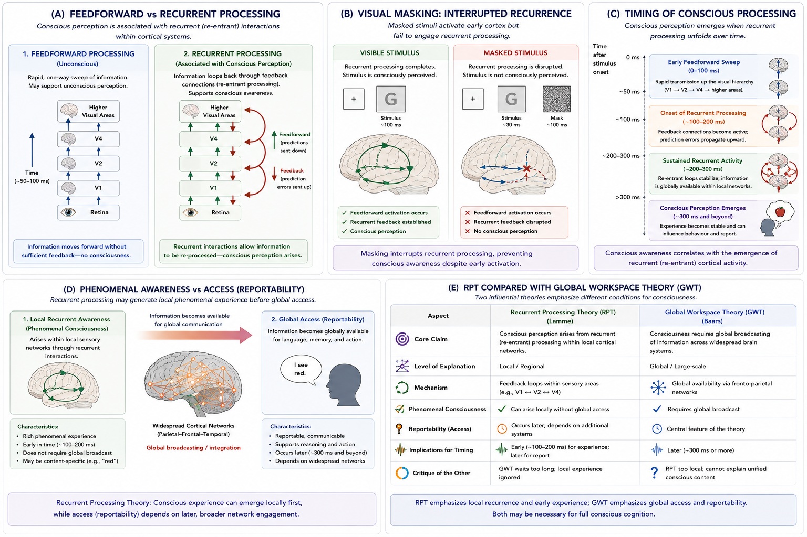
```

As Figure @ref(fig:fig-rpt) illustrates, feedforward processing may support rapid unconscious discrimination, but recurrent cortical loops stabilize perceptual representations and allow conscious awareness to emerge. The figure also highlights one of RPT’s central philosophical claims: conscious experience may occur locally before global cognitive access.

This makes RPT different from theories that treat consciousness as dependent on executive access, verbal report, or large-scale broadcasting. RPT does not deny that those processes are important. Rather, it argues that they may belong to a later stage of conscious access rather than to the origin of phenomenal experience itself.

## Historical Development

The origins of Recurrent Processing Theory lie in debates about the temporal and neural structure of perception. Earlier models often treated perception as a largely feedforward process. Sensory input entered the system, moved through cortical hierarchies, and eventually produced recognition, action, or report.

However, anatomical and physiological research showed that cortical processing involves extensive feedback. Visual processing, for example, does not simply move from the retina to primary visual cortex and then upward to higher visual areas. Higher cortical areas send signals back to lower areas. These recurrent interactions help refine, stabilize, and contextualize perception.

Victor Lamme developed one of the most influential versions of RPT, arguing that recurrent processing within sensory cortex is central to conscious perception [@lamme2006]. According to Lamme, an initial feedforward sweep may support unconscious processing, rapid categorization, and behavioural response. Consciousness arises when this activity becomes recurrently integrated.

This positioned RPT partly against Global Workspace Theory, which emphasizes global broadcasting and cognitive access [@baars1988; @dehaene2011]. RPT argues that phenomenal consciousness may appear earlier than the global availability required for report.

## Feedforward and Recurrent Processing

A central distinction in RPT is the difference between feedforward processing and recurrent processing.

Feedforward processing is the rapid movement of information through a neural hierarchy. In vision, this can be simplified as:

```text
retina → V1 → V2 → V4 → higher visual cortex
```

This feedforward sweep is fast and efficient. It can support rapid categorization, priming, automatic response, and partial sensory discrimination. However, according to RPT, feedforward processing alone is usually not sufficient for conscious visual experience.

Recurrent processing involves feedback loops between cortical areas. Information does not only move upward. It also loops backward and sideways through the system. Higher areas influence lower areas, lower areas continue updating higher areas, and perception becomes stabilized through recursive interaction.

According to RPT, conscious perception emerges when neural activity becomes recurrently integrated. This recurrence allows sensory representations to become sustained, coherent, context-sensitive, and phenomenally experienced.

## The Core Claim of RPT

The central claim of Recurrent Processing Theory is that conscious awareness depends on recurrent cortical feedback rather than feedforward activation alone. This means that unconscious processing can occur rapidly and automatically, while conscious perception requires recursive neural integration.

The theory therefore explains why a stimulus can influence behaviour without being consciously seen. A masked stimulus may activate early visual cortex and even affect later responses. But if recurrent processing is interrupted, the stimulus may not become consciously experienced.

This gives RPT a clear explanatory structure:

```text
feedforward sweep → unconscious processing
recurrent integration → conscious perception
```

The theory also emphasizes that consciousness unfolds over time. Conscious awareness is not an instantaneous result of sensory input. It emerges dynamically as neural activity loops through cortical networks.

## Temporal Dynamics of Consciousness

One of RPT’s most important contributions is its focus on temporal dynamics. Conscious perception is treated as a process that develops across time rather than as a single momentary event.

During the early feedforward sweep, roughly within the first 100 milliseconds, sensory information moves rapidly through cortical pathways. This may support unconscious categorization, priming, and fast behavioural response.

During the next stage, recurrent interactions begin to occur. Feedback loops between cortical areas refine and stabilize the representation. Context, attention, memory, and higher-level expectations may begin influencing perception. RPT suggests that phenomenal awareness may emerge during this recurrent stage.

Later, information may become available for report, working memory, decision-making, and broader cognitive access. This later stage may involve more widespread networks, including frontoparietal systems, but RPT does not treat this later access as necessary for the initial emergence of phenomenal experience.

This temporal account is important because it allows RPT to distinguish between perceptual experience and later cognitive use of that experience.

## Visual Masking

Visual masking provides one of the strongest experimental contexts for RPT. In masking experiments, a target stimulus is presented briefly and then followed by another stimulus, called a mask. The mask can prevent conscious awareness of the original target, even though some processing of the target still occurs.

RPT explains masking by arguing that the target may produce an initial feedforward sweep, but the mask interrupts recurrent processing. Without recurrent stabilization, the target does not become consciously perceived.

This explains why masked stimuli can still produce priming or influence behaviour. Feedforward processing may occur, but conscious experience fails to emerge because recurrent loops are disrupted.

Visual masking therefore supports the idea that sensory activation alone is not enough for consciousness. The timing and recurrence of neural activity matter [@breitmeyer1984; @lamme2006].

## Binocular Rivalry and Perceptual Competition

Binocular rivalry also supports recurrent approaches to consciousness. In binocular rivalry, different images are presented to each eye. Instead of experiencing both images equally, conscious perception alternates between them.

RPT interprets this alternation as evidence that conscious perception depends on dynamic stabilization within recurrent networks. Competing interpretations are not simply registered passively. They are stabilized, suppressed, and replaced through ongoing neural interaction.

This supports a general recurrent view of perception. Conscious awareness is not merely the arrival of sensory input. It is the result of dynamic neural stabilization over time.

## Phenomenal and Access Consciousness

RPT is philosophically important because it strongly distinguishes phenomenal consciousness from access consciousness.

Phenomenal consciousness refers to subjective experience itself. It is the felt character of seeing a colour, hearing a sound, or perceiving a scene. Access consciousness refers to information being available for reasoning, report, memory, and deliberate control [@block1995].

RPT suggests that local recurrent sensory loops may already support phenomenal consciousness. Global access, reportability, and executive control may occur later. This means that a person may experience more than they can report or remember.

This idea challenges theories that identify consciousness with reportability or global broadcasting. RPT argues that report is not the same as experience. Report requires additional cognitive systems, while experience may begin in recurrent sensory processing.

## Phenomenal Overflow

RPT is closely connected to debates about phenomenal overflow. The overflow argument claims that conscious experience may contain more detail than can be accessed, reported, or stored in working memory [@block2007].

For example, a person may seem to experience a rich visual scene even though they can report only a small part of it. If this is correct, then phenomenal consciousness exceeds access consciousness.

RPT supports this idea by proposing that recurrent sensory processing can generate phenomenal awareness before information enters working memory or global broadcast. On this view, experience may be richer than report.

Critics of overflow argue that apparent richness may be an illusion produced by gist perception, expectation, or rapid access to environmental information. This debate remains unresolved, but it is central to the difference between RPT and access-based theories.

## Recurrent Processing and Global Workspace Theory

RPT is often contrasted with Global Workspace Theory. GWT proposes that consciousness requires global broadcasting across cognitive systems [@baars1988; @dehaene2011; @dehaene2014]. Information becomes conscious when it is made available for report, working memory, reasoning, and flexible control.

RPT argues that this may describe access consciousness rather than phenomenal consciousness. According to RPT, local recurrent processing may be sufficient for perceptual experience, while global broadcasting supports later report and cognitive use.

The two theories may not be completely incompatible. They may describe different stages or dimensions of consciousness. RPT may explain early phenomenal perception, while GWT may explain later access, reportability, and cognitive control.

However, the disagreement remains significant. GWT tends to place consciousness at the level of global availability. RPT places the origin of phenomenal experience earlier, within recurrent sensory processing.

## Relation to Other Theories

RPT overlaps with several other theories discussed in this book.

### Relation to Integrated Information Theory

Integrated Information Theory emphasizes integrated causal structure and irreducibility [@tononi2004; @oizumi2014]. RPT also emphasizes integration, but more specifically through recurrent cortical loops. IIT is broader and more formal, while RPT is more closely tied to sensory neuroscience and temporal processing.

### Relation to Higher-Order Thought Theory

Higher-Order Thought Theory argues that a mental state becomes conscious when it is represented by a suitable higher-order state [@rosenthal2005; @lau2011]. RPT is less metacognitive. It suggests that consciousness may arise within recurrent sensory systems before higher-order reflection or introspection.

### Relation to Predictive Processing

Predictive Processing emphasizes hierarchical prediction and error correction [@friston2010; @clark2013]. RPT overlaps with this framework because predictive processing also depends on recurrent exchange between cortical levels. However, RPT focuses specifically on recurrence as a condition for conscious perception, while Predictive Processing interprets recurrence in terms of prediction-error minimization.

### Relation to Attention Schema Theory

Attention Schema Theory explains consciousness through the brain’s model of attention [@graziano2013]. RPT differs by emphasizing recurrent sensory stabilization rather than an internal model of attention. Both theories, however, challenge simple feedforward accounts of consciousness.

### Relation to Consciousness-First Theories

RPT differs from consciousness-first theories such as panpsychism, cosmopsychism, idealism, or Taheri’s T-Consciousness. RPT begins with neural mechanisms and asks how recurrent processing supports consciousness. Consciousness-first theories begin from the idea that consciousness is fundamental or prior to physical organization. These approaches will be discussed later in the book.

## Dreaming, Anesthesia, and Altered States

RPT can also be applied to dreaming, anesthesia, and altered states. Dreaming may involve internally generated recurrent activity that produces conscious experience without ordinary external sensory input. Anesthesia may disrupt the recurrent interactions required for conscious stabilization. Disorders of consciousness may involve partial preservation or disruption of recurrent cortical dynamics.

These applications show that RPT is not limited to ordinary visual perception. It can be used to think about how conscious states appear, disappear, and transform depending on recurrent neural organization [@koch2016; @seth2021; @laureys2005; @owen2006].

However, applying RPT beyond perception raises additional questions. Consciousness includes emotion, selfhood, bodily feeling, thought, and imagination. The theory must explain whether all these forms of consciousness depend on similar recurrent mechanisms or whether visual consciousness is a special case.

## Neural Basis of Recurrent Processing

Recurrent processing is associated with cortical feedback loops, re-entrant signaling, thalamo-cortical interactions, and reciprocal connections between lower and higher cortical areas. These recurrent circuits are especially well studied in the visual system, but recurrent connectivity is widespread throughout the brain.

The challenge is determining which recurrent interactions are sufficient for consciousness. Not all recurrence appears conscious. Many feedback loops regulate movement, bodily function, or unconscious processing without producing reportable experience.

RPT therefore needs a principled account of conscious recurrence. Is recurrence in sensory cortex enough? Does it require certain timing? Does it require attention? Does it need integration across multiple levels? Does it need connection to memory or self-modeling?

These questions remain open and are central to evaluating the theory.

## Recurrent Processing and Artificial Intelligence

RPT has important implications for artificial intelligence and machine consciousness. If consciousness depends on recurrent processing, then purely feedforward artificial architectures may remain non-conscious even if they perform sophisticated tasks.

From an RPT perspective, a conscious artificial system might require recursive feedback, dynamic temporal integration, re-entrant processing, and stable internal representations. Recurrent neural networks, self-monitoring systems, and architectures with feedback loops may therefore be more relevant to machine consciousness than purely feedforward models.

However, recurrence alone is not enough. Many artificial systems contain feedback without being plausibly conscious. RPT must specify what kind of recurrence matters. Does the system need embodiment, sensory grounding, self-modeling, affective regulation, or global access? These questions overlap with broader debates about AI consciousness [@butlin2023].

RPT therefore suggests that recurrence may be an important condition for machine consciousness, but it does not provide a complete criterion by itself.

## Strengths of Recurrent Processing Theory

RPT has several major strengths. First, it is strongly grounded in neuroscience. The cortex contains extensive recurrent connectivity, and RPT builds directly on this biological architecture.

Second, it explains why feedforward processing can remain unconscious. This makes it useful for understanding masking, priming, and unconscious perception.

Third, RPT emphasizes temporal dynamics. It treats consciousness as something that unfolds through recursive interaction over time, rather than as an instantaneous response to stimulation.

Fourth, it offers an important philosophical distinction between phenomenal consciousness and access consciousness. It challenges theories that identify consciousness too closely with reportability.

Fifth, RPT provides a biologically plausible account of perceptual consciousness. It is especially strong in visual neuroscience, where recurrent processing can be studied experimentally.

## Weaknesses and Criticisms

RPT also faces several criticisms. The first is whether local recurrence is sufficient for consciousness. Critics argue that consciousness may require more than recurrent sensory processing. It may also require attention, memory, selfhood, metacognition, global integration, or bodily regulation.

A second criticism concerns the hard problem. Even if recurrence is correlated with conscious perception, why should recurrent neural interaction feel like anything? RPT may identify an important mechanism without fully explaining subjective experience [@chalmers1995; @chalmers1996].

A third criticism concerns thresholds. RPT does not always specify how much recurrence is necessary, which loops matter, or when recurrent activity becomes conscious.

A fourth criticism concerns excessive localism. Some researchers argue that full conscious cognition requires large-scale coordination across the brain, not only local sensory loops. From this perspective, RPT may explain early perceptual awareness but not the full structure of conscious experience.

Finally, recurrent loops are widespread in the brain. RPT must explain why some recurrent interactions produce consciousness while others do not.

## Open Questions

Several important questions remain unresolved. Why should recurrence generate experience? Is local recurrence sufficient for consciousness? Can phenomenal consciousness occur without global access? What distinguishes conscious recurrence from unconscious recurrence? Are recurrent loops necessary for all conscious states? How does RPT explain selfhood, emotion, and thought? Can artificial recurrent systems become conscious?

These questions show why RPT remains influential but incomplete. It offers a strong account of perceptual awareness, but it must still explain how recurrent processing relates to broader conscious life.

## Evaluation

Recurrent Processing Theory is one of the most influential biologically grounded theories of consciousness. It explains conscious perception through recursive cortical interaction, temporal stabilization, and recurrent sensory integration.

Its greatest strength is its account of perceptual consciousness. RPT explains why initial feedforward activation may remain unconscious and why recurrent processing may be necessary for stable conscious perception. It also provides a powerful distinction between phenomenal consciousness and access consciousness.

Its greatest limitation is that it may not fully explain all forms of consciousness. Local recurrent processing may explain visual awareness, but consciousness also includes selfhood, emotion, bodily feeling, memory, imagination, and reflective thought. RPT must either extend its recurrent framework to these domains or accept that it explains only part of consciousness.

RPT is therefore best understood as a strong theory of perceptual consciousness and phenomenal awareness, especially in vision. Whether it provides a complete theory of consciousness remains unresolved.

## Chapter Summary

Recurrent Processing Theory proposes that consciousness depends on recurrent or re-entrant neural processing. An initial feedforward sweep may support unconscious processing, but conscious perception requires feedback loops that stabilize and integrate neural representations.

RPT is especially important in visual neuroscience and masking research. Masked stimuli may be processed unconsciously because masking interrupts recurrent processing before conscious awareness can emerge.

The theory strongly distinguishes phenomenal consciousness from access consciousness. It suggests that perceptual experience may arise locally within recurrent sensory loops before information becomes globally available for report or reasoning.

RPT differs from Global Workspace Theory, which emphasizes global broadcasting, and from Higher-Order Thought Theory, which emphasizes metacognitive awareness. It overlaps with Integrated Information Theory and Predictive Processing because all emphasize integration or recurrent interaction in some form.

Its strengths include biological plausibility, strong relevance to visual perception, and a clear explanation of unconscious processing. Its weaknesses include uncertainty about whether local recurrence is sufficient, how recurrence explains subjective feeling, and how the theory applies to selfhood, emotion, and artificial intelligence.

The central unresolved question is whether recurrent processing explains consciousness itself or identifies one important neural condition for conscious perception.

<!--chapter:end:13-recurrent-processing.Rmd-->

# Attention Schema Theory {#ast}

## Chapter Overview

Attention Schema Theory, often abbreviated as AST, proposes that consciousness is the brain’s simplified internal model of its own attention. According to this theory, awareness is not identical to attention itself. Instead, awareness arises because the brain constructs a simplified representation, or schema, of attentional processes for purposes of monitoring, prediction, and control [@graziano2013; @graziano2016].

AST attempts to explain not only how brains control attention, but also why organisms believe themselves to be conscious. The theory begins from the idea that the brain builds internal models of many complex processes. It models the body, the external world, other agents, and its own control systems. AST proposes that awareness is one such model: a schematic representation of where attention is directed and what information is currently prioritized.

Rather than treating consciousness as a mysterious non-physical property, AST interprets awareness as a model-based construct generated by cognitive systems. This gives the theory a partly deflationary character. It does not deny that people report awareness or experience themselves as conscious. Instead, it asks how the brain constructs the representation that makes such reports and experiences possible.

AST became influential because it connects attention research, self-representation, control theory, social cognition, and neuroscience within a unified framework. It also overlaps with debates about metacognition, artificial intelligence, self-modeling, and the hard problem of consciousness.

At the same time, AST remains controversial. Critics argue that an internal model of attention may explain self-report, awareness attribution, attentional monitoring, and beliefs about consciousness without fully explaining phenomenal feeling itself. The central question is whether modeling attention is enough to explain subjective experience, or whether AST explains only why organisms describe themselves as aware [@chalmers1995; @chalmers1996].

This chapter explains the central claims of Attention Schema Theory, distinguishes attention from awareness, introduces the body-schema analogy, examines the theory’s relation to social cognition and artificial intelligence, and evaluates its strengths and limitations.

## Learning Objectives

After reading this chapter, the reader should be able to:

* Define the central claim of Attention Schema Theory.
* Distinguish attention from awareness.
* Explain the concept of an attention schema.
* Describe the body-schema analogy used in AST.
* Analyze the relationship between awareness and attentional control.
* Explain the social cognition implications of AST.
* Compare AST with Higher-Order Thought Theory, Global Workspace Theory, and Recurrent Processing Theory.
* Evaluate the strengths and criticisms of AST.
* Discuss the relationship between AST and the hard problem.
* Explain AST’s implications for artificial intelligence and machine consciousness.

## Why Attention Schema Theory Became Influential

Attention Schema Theory became influential because it asked a distinctive question: why does the brain represent itself as conscious? Many theories of consciousness focus on neural activity, information integration, global broadcasting, or cognitive access. AST instead focuses on the brain’s internal model of awareness itself.

Michael Graziano proposed that the brain uses simplified models to control complex processes [@graziano2013]. For example, the brain maintains models of the body to guide movement, posture, and spatial coordination. These models are not perfect anatomical descriptions. They are simplified control tools. AST argues that attention is modeled in a similar way.

Attention is a complex process. The brain must select information, prioritize some signals over others, regulate competition, and coordinate perception, action, memory, and thought. According to AST, the brain constructs a simplified model of this process. That model is what the system represents as awareness.

This proposal became important because it connects consciousness with attention, prediction, control, and self-modeling. It also gives awareness a possible evolutionary function. If the brain can model its own attention, it can better control attention, predict its effects, and explain behaviour to itself and others.

## Core Idea in One Picture

Figure @ref(fig:fig-ast) summarizes the major conceptual structure of Attention Schema Theory.

```{r fig-ast, echo=FALSE, fig.cap="Attention Schema Theory (AST). Panel A distinguishes attention, awareness, and the attention schema. Panel B illustrates the body-schema analogy. Panel C shows the attentional control loop. Panel D compares AST with related theories of consciousness. Panel E illustrates the relationship between awareness and social cognition.", out.width="100%", fig.align="center"}
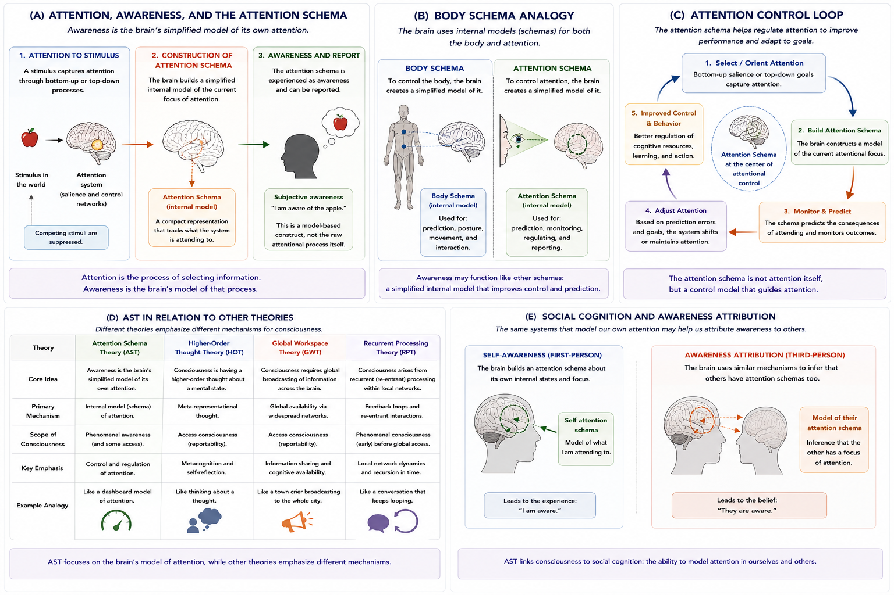
```

As Figure @ref(fig:fig-ast) illustrates, AST sharply distinguishes attention from awareness. Attention is a process of selective information enhancement. Awareness is the brain’s internal model of that process. In this sense, awareness is not attention itself, but a simplified representation of attention.

This distinction is central to the theory. Attention can occur without awareness, and awareness can sometimes misrepresent attentional processes. AST therefore does not simply say that attention equals consciousness. It says that awareness is a model the brain uses to represent and regulate attention.

## Historical Development

Attention Schema Theory developed from broader debates about attention, consciousness, self-representation, cognitive control, and internal modeling. Modern AST is primarily associated with Michael Graziano, who developed the theory as a model-based account of awareness [@graziano2013; @graziano2016].

The theory draws on several older ideas. Research on attention showed that the brain selectively prioritizes some information over other information [@posner1990; @corbetta2002]. Work on body schemas showed that the brain constructs simplified models of the body for movement and control [@head1911; @schilder1935; @gallagher2005]. Theories of predictive control suggested that internal models can help organisms regulate complex systems [@friston2010; @clark2013].

AST combines these ideas. It proposes that, just as the brain models the body to control movement, it models attention to control information processing. Awareness is the simplified internal model that results.

This makes AST different from theories that begin with raw subjective experience. AST begins with a functional problem: how does the brain monitor and control attention? Conscious awareness is then explained as part of the solution to that problem.

## The Attention Schema

The central concept in AST is the attention schema. An attention schema is an internal model of attentional allocation. It represents what the system is attending to, what information is currently prioritized, and how attention is being directed.

The schema is simplified. It does not represent every neural detail of attention. Instead, it provides a useful control-oriented description. This is similar to how the brain’s body schema does not represent every muscle, joint, and nerve in anatomical detail. It represents the body in a way that is useful for action.

According to AST, the attention schema allows the brain to monitor and regulate attention. It helps the organism predict what it will process, control what it focuses on, and explain its own behaviour. When this model represents attention directed toward an object, the organism reports being aware of that object.

This leads to AST’s central claim:

```text
awareness is the brain’s model of attention
```

The theory therefore treats awareness as representational. Awareness is not a special non-physical substance. It is a simplified internal model that helps the brain regulate information processing.

## Attention and Awareness

AST strongly distinguishes attention from awareness. Attention is selective information processing. It enhances some signals, suppresses others, prioritizes certain stimuli, and allocates cognitive resources. Awareness is the brain’s representation of that attentional state.

This distinction matters because attention and awareness can come apart. Some attentional processes occur unconsciously. Subliminal cues can shift attention. Automatic orienting can occur before a person reports awareness. Behaviour can be influenced by unattended or weakly attended stimuli [@koch2006].

AST explains this by saying that attention itself is not awareness. Attention may operate without being modeled in the appropriate way. Awareness occurs when the brain constructs a model of attention.

The distinction also helps explain why awareness can be incomplete or mistaken. The brain’s attention schema is simplified. It may represent attentional states in a useful but imperfect way. This may contribute to the intuitive feeling that awareness is simple, unified, and non-physical, even if the underlying neural mechanisms are complex.

## The Body-Schema Analogy

One of AST’s most important ideas is the analogy between the body schema and the attention schema. The brain constructs body schemas to guide movement, posture, spatial awareness, and action. These schemas are practical models, not exact anatomical maps [@head1911; @schilder1935; @gallagher2005].

For example, a person can reach for a cup without calculating the exact position of every muscle and joint. The brain uses a simplified body model to guide action efficiently. This model can also be distorted, as in phantom limb experiences or body ownership illusions.

AST proposes that awareness works in a similar way. Attention is complex, distributed, and neurally detailed. The brain cannot control attention efficiently by representing every detail. Instead, it constructs a simplified model of attention.

This model is useful because it allows the system to regulate its own processing. But because the model is simplified, it may represent attention as a non-physical inner property called awareness. In this way, AST attempts to explain why awareness seems mysterious from the inside.

## Attention Control and Prediction

AST argues that internal models improve control. A system can control a process more effectively when it has a model of that process. This is true for the body, movement, and spatial orientation. AST argues that it is also true for attention.

The attention schema allows the brain to predict how attention will affect perception, memory, decision-making, and action. It helps the system allocate resources, monitor what is being prioritized, and adjust focus when conditions change.

For example, if a person is searching for a face in a crowd, attention must be directed, maintained, and adjusted. A model of attentional state helps the person know what they are focused on and what they are missing. This improves behavioural flexibility.

In this sense, awareness has a functional role. It is not merely an inner glow added to cognition. It is part of a control system that helps the organism regulate attention and behaviour.

## Why Awareness Would Evolve

AST offers an evolutionary explanation for awareness. If attention is central to adaptive behaviour, then organisms benefit from being able to model attention. A system that can monitor and control its own attentional focus can respond more flexibly to threats, opportunities, social cues, and changing environments.

Awareness may therefore have evolved because it improves prediction and control. It helps organisms track what they are processing, what others may be processing, and what matters for action.

This evolutionary explanation is important because it avoids treating awareness as an inexplicable extra feature. AST interprets awareness as a useful internal model. It may feel simple and mysterious from the first-person perspective, but it may have developed as part of ordinary biological control.

## Social Cognition and Theory of Mind

One of AST’s distinctive contributions is its connection between self-awareness and social cognition. The theory proposes that the same kinds of models used to represent one’s own attentional state may also be used to represent the awareness of others [@graziano2013; @graziano2019].

Humans naturally attribute awareness to other people. We say that someone sees us, notices an object, ignores a sound, or is aware of a danger. These judgments require modeling the attentional states of others. AST suggests that awareness attribution may have evolved partly for social prediction.

This creates a link between consciousness and theory of mind. A brain that can model attention in itself may also model attention in others. It can predict what others know, what they are looking at, what they might do next, and what they may believe.

According to AST, awareness is therefore not only private self-monitoring. It is also part of social cognition. Consciousness, selfhood, and social intelligence may be deeply connected.

## Neural Basis of AST

AST is often associated with neural systems involved in attention, self-representation, and social cognition. These include frontal-parietal attention networks, the temporoparietal junction, superior temporal sulcus, and regions involved in theory of mind and attentional control [@corbetta2002; @graziano2013].

The temporoparietal junction is especially relevant because it has been linked to attention, perspective-taking, body representation, and social cognition. These functions fit AST’s proposal that awareness involves modeling attentional states in oneself and others.

However, the neural basis of AST remains under investigation. The theory provides a broad functional architecture, but the precise neural implementation of the attention schema is not fully established.

This is one of AST’s open empirical challenges. To become more testable, the theory must specify how attention schemas are implemented, how they can be measured, and how disruptions affect awareness.

## Clinical Evidence

Clinical disorders provide partial support for AST because they show that attention and awareness can dissociate. Hemispatial neglect is especially relevant. Patients with neglect may fail to become aware of stimuli on one side of space despite having partially preserved sensory processing. This suggests that awareness depends not simply on sensory input, but on attentional and representational systems.

AST interprets neglect as evidence that disruptions in attentional modeling can alter awareness. If the brain fails to represent attention to part of space, the person may behave as though that region does not exist.

Other attention-related disorders may also affect awareness, self-monitoring, and conscious report. These cases support the idea that awareness is deeply connected to attentional control. However, they do not by themselves prove AST. Competing theories can also explain these disorders in terms of attention, access, or recurrent processing.

## Consciousness as a Model-Based Construct

AST proposes a major philosophical shift. Instead of treating awareness as an irreducible inner essence, it treats awareness as a model-based construct. The brain represents itself as having awareness because doing so helps it control attention and behaviour.

This makes AST partly deflationary. It suggests that some intuitions about consciousness may arise from the simplified nature of the attention schema. The brain does not model the neural machinery of attention in detail. It models attention as a simple relation between subject and object: “I am aware of that.”

Because the model leaves out mechanistic details, awareness can seem non-physical or mysterious. AST argues that this sense of mystery may be a feature of the model rather than evidence for a separate mental substance.

This does not mean that awareness is unreal. Body schemas are not unreal just because they are simplified. Awareness may be real as a model-based representation, even if it is not the kind of inner essence introspection suggests.

## AST and Other Theories

AST overlaps with several major theories of consciousness, but it remains conceptually distinct.

### Relation to Higher-Order Thought Theory

AST and Higher-Order Thought Theory both involve internal representation and self-monitoring [@rosenthal2005; @lau2011]. HOT theory argues that a mental state becomes conscious when it is represented by a suitable higher-order state. AST argues that awareness arises from the brain’s model of attention.

The difference is emphasis. HOT focuses on higher-order representation of mental states. AST focuses specifically on the modeling of attentional processes.

### Relation to Global Workspace Theory

Global Workspace Theory explains consciousness in terms of global broadcasting and cognitive access [@baars1988; @dehaene2011]. AST explains awareness through attentional self-modeling. The two theories may be complementary. Global broadcasting may make information widely available, while the attention schema may model the attentional relation between the subject and that information.

### Relation to Recurrent Processing Theory

Recurrent Processing Theory emphasizes recurrent sensory feedback and local perceptual loops [@lamme2006]. AST focuses less on sensory recurrence and more on attentional modeling, self-representation, and control. RPT may explain how perceptual contents stabilize, while AST may explain how the system models itself as aware of those contents.

### Relation to Predictive Processing

Predictive Processing explains perception and cognition through prediction-error minimization and generative modeling [@friston2010; @clark2013]. AST fits naturally with predictive ideas because it treats awareness as an internal model used for control. The attention schema may be understood as a predictive model of attentional allocation.

### Relation to Embodied and Enactive Theories

Embodied and enactive theories emphasize bodily action, environmental coupling, and lived experience [@varela1991; @thompson2007]. AST is more internally representational, but it can be expanded by asking how attentional models are shaped by bodily action and social interaction.

### Relation to Consciousness-First Theories

AST differs from consciousness-first theories such as panpsychism, cosmopsychism, idealism, or Taheri’s T-Consciousness. AST begins with attention, internal modeling, and biological control systems. Consciousness-first theories begin from the idea that consciousness is fundamental or prior to material organization. These approaches will be discussed later in the book.

## AST and the Hard Problem

AST has important implications for the hard problem of consciousness. Some interpretations of AST attempt to dissolve parts of the hard problem by explaining why brains represent themselves as aware, why organisms report consciousness, and why awareness appears simple, unified, and internal.

However, many philosophers argue that AST still does not fully explain why awareness feels like anything. A model of attention may explain why a system says “I am aware,” but why should that model be accompanied by subjective experience? This is the central criticism [@chalmers1995; @chalmers1996].

AST can respond that the question may be partly generated by the structure of the attention schema itself. Because the model omits mechanistic detail, awareness appears as an unexplained inner property. The hard problem may therefore reflect how the brain represents awareness, rather than a separate metaphysical fact.

Critics reply that this may explain beliefs about consciousness without explaining consciousness itself. The debate remains unresolved. AST is powerful as a theory of awareness representation, but whether it fully explains phenomenology remains contested.

## Attention Without Awareness and Awareness Without Attention

AST must account for cases where attention and awareness dissociate. Attention can occur without awareness. Subliminal cues, automatic orienting, and unconscious attentional capture can influence behaviour without reportable experience [@koch2006].

AST explains this by distinguishing attention from the attention schema. Attention may operate without being modeled in the right way. Awareness requires a representation of attentional state, not attention alone.

The reverse issue is also important. Some experiences, such as diffuse awareness, open-monitoring meditation, or altered states, may seem to involve awareness without sharply focused attention. Critics argue that this challenges theories that tie awareness too closely to attentional modeling.

AST can respond that awareness may involve broader or more diffuse attention schemas rather than narrow focal attention. However, this remains an area where further theoretical and empirical work is needed.

## Strengths of Attention Schema Theory

AST has several major strengths. First, it clearly distinguishes attention from awareness. This distinction helps explain why attention and consciousness are closely related but not identical.

Second, AST offers a strong body-schema analogy. The brain already uses simplified models to control the body. It is plausible that it uses similar models to control attention.

Third, AST connects consciousness with social cognition. It explains why organisms attribute awareness not only to themselves but also to others.

Fourth, AST has evolutionary plausibility. Awareness has an adaptive function: it helps regulate attention, behaviour, and social prediction.

Fifth, AST fits naturally with internal modeling and predictive control. It explains awareness as part of a broader biological strategy for managing complex systems.

Finally, AST is relevant to artificial intelligence because it suggests that machine consciousness may require not only intelligence, but also internal models of attention and self-monitoring.

## Weaknesses and Criticisms

AST also faces several important criticisms. The most important is whether modeling attention is sufficient for experience. Critics argue that an internal model may explain awareness attribution without explaining subjective feeling.

A second criticism is that AST may leave the explanatory gap unresolved. Even if awareness is a model, why does the model have phenomenal character? Why is there something it is like to instantiate the attention schema?

A third criticism is oversimplification. Consciousness involves more than attention. It includes embodiment, emotion, memory, selfhood, affect, interoception, and phenomenological structure. AST may explain one important component of consciousness without explaining the whole phenomenon.

A fourth criticism concerns neural specificity. The theory needs clearer empirical predictions about where and how the attention schema is implemented.

A fifth criticism is that AST may explain beliefs about consciousness better than consciousness itself. It may explain why people claim to be aware, but critics argue that this is not the same as explaining experience.

These criticisms show why AST remains both elegant and controversial.

## AST and Artificial Intelligence

Attention Schema Theory has important implications for artificial intelligence. According to AST, intelligence alone is not sufficient for consciousness. A system would need attentional processes and an internal model of those processes.

A conscious artificial system, from the AST perspective, would require mechanisms for selecting information, monitoring attention, representing attentional state, and using that representation for control. It would need not only to process information, but to model its own processing in a simplified self-referential way.

This suggests that artificial consciousness might require self-modeling architectures, attentional control loops, awareness representations, and perhaps social modeling capacities. Some recent discussions of AI consciousness include attention, self-monitoring, and internal modeling among possible indicators [@butlin2023].

However, AST does not settle whether such systems would possess genuine phenomenal experience. A machine might model its own attention and report awareness without there being anything it is like to be that machine. The same hard problem remains.

## Open Questions

Several questions remain unresolved. Is attentional modeling sufficient for consciousness? Can awareness exist without attention? How does the brain implement the attention schema? Does AST explain subjective feeling or only awareness attribution? How does AST account for emotion, embodiment, and interoception? Can artificial systems possess genuine awareness if they model their own attention? Does the hard problem reflect a real metaphysical gap or a limitation of the brain’s self-model?

These questions show why AST remains an important but incomplete theory. It provides a powerful account of awareness representation, but its relation to phenomenal consciousness remains debated.

## Evaluation

Attention Schema Theory is one of the most conceptually distinctive theories of consciousness. It explains awareness as the brain’s simplified internal model of attention. This makes it different from theories that emphasize global broadcasting, integrated information, recurrent sensory loops, or higher-order thoughts.

Its greatest strength is its explanatory clarity. AST explains why awareness is closely related to attention, why awareness supports control, why organisms attribute awareness to themselves and others, and why consciousness may appear simpler and more mysterious than the underlying mechanisms.

Its greatest weakness is that it may not fully explain phenomenal experience. Modeling attention may explain why a system represents itself as aware, but critics argue that it may not explain why awareness feels like anything.

For this reason, AST is best understood as a powerful theory of awareness representation and attentional self-modeling. Whether it provides a complete theory of consciousness remains unresolved.

## Chapter Summary

Attention Schema Theory proposes that awareness is the brain’s simplified internal model of attention. Attention is the process of selectively prioritizing information. Awareness is the model the brain constructs of that process.

AST uses the body-schema analogy to explain its central claim. Just as the brain uses simplified body models to guide movement, it may use simplified attention models to guide cognition and behaviour.

The theory connects consciousness with attention, control, prediction, self-representation, and social cognition. It explains why organisms represent themselves and others as aware.

AST differs from Higher-Order Thought Theory, Global Workspace Theory, Recurrent Processing Theory, and Integrated Information Theory by focusing specifically on attentional self-modeling. It also differs from consciousness-first theories because it treats awareness as a biological model-based construct rather than as fundamental.

The theory’s strengths include conceptual clarity, evolutionary plausibility, relevance to social cognition, and strong connection to attention research. Its weaknesses include the explanatory gap, uncertainty about neural implementation, and the challenge of explaining phenomenal feeling itself.

The central unresolved question is whether an internal model of attention is sufficient for subjective experience, or whether AST explains only why organisms represent and report themselves as aware.

<!--chapter:end:14-attention-schema-theory.Rmd-->

# Computationalism {#computationalism}

## Chapter Overview

Computationalism is the view that mental processes, including perception, reasoning, memory, decision-making, and possibly consciousness, can be understood in terms of computation and information processing. According to this framework, minds are not defined primarily by biological material alone. They are understood as organized systems that represent information, transform internal states, generate predictions, solve problems, and control behaviour.

Computationalism became one of the most influential frameworks in cognitive science, artificial intelligence, cognitive psychology, philosophy of mind, and consciousness research during the twentieth century. It helped shift the study of mind away from behaviour alone and toward internal processing, representation, symbolic manipulation, and computational architecture [@turing1950; @newell1976; @fodor1975].

A central claim of computationalism is that mental processes may depend more on functional organization than on a specific biological substrate. This principle is closely related to substrate independence: the idea that the same mental or cognitive process could, in principle, be realized in different physical systems if the right computational organization were present [@putnam1967; @chalmers1996].

Computationalism therefore became foundational to debates about artificial intelligence, machine consciousness, simulation, representation, artificial minds, and the possibility of non-biological consciousness. If mind is computational, then a sufficiently organized artificial system might be capable of cognition or even consciousness.

At the same time, computationalism remains deeply controversial. Critics argue that computation alone may not generate meaning, understanding, subjectivity, or phenomenal experience. A system might manipulate symbols, process information, or produce intelligent behaviour without there being anything it is like to be that system [@searle1980; @chalmers1995; @chalmers1996].

This chapter examines the historical development, conceptual foundations, major forms, philosophical implications, strengths, criticisms, and unresolved questions associated with computational theories of mind and consciousness.

## Learning Objectives

After reading this chapter, the reader should be able to:

* Define the core claim of computationalism.
* Explain the concept of computation in theories of mind.
* Describe substrate independence and functional organization.
* Distinguish symbolic and connectionist computational approaches.
* Explain how computationalism relates to artificial intelligence.
* Analyze the Chinese Room argument.
* Compare computationalism with biological naturalism and embodied cognition.
* Evaluate strengths and criticisms of computational theories of consciousness.
* Discuss whether computation alone is sufficient for consciousness.

## Why Computationalism Became Influential

Computationalism became influential because it offered a rigorous framework for explaining cognition scientifically. Behaviourism had focused primarily on observable behaviour, stimulus-response relations, and external action. Although behaviourism introduced important methodological discipline, many researchers argued that it could not adequately explain memory, planning, reasoning, language, creativity, imagination, and flexible problem-solving.

The cognitive revolution changed this picture. Researchers began to treat the mind as an information-processing system. Instead of avoiding internal states, cognitive science attempted to model them. Perception, memory, reasoning, and language could be studied as structured processes involving representation, storage, transformation, and control [@newell1976; @fodor1975].

This shift was strongly influenced by developments in computer science, cybernetics, information theory, symbolic logic, and artificial intelligence. Alan Turing’s work on computation and machine intelligence was especially important because it showed that machines could, in principle, perform complex rule-governed operations [@turing1950]. Information theory and cybernetics also helped researchers think about communication, control, feedback, and information processing in formal terms [@shannon1948; @wiener1948].

Computationalism became powerful because it offered a bridge between mind and mechanism. It suggested that cognition could be studied scientifically without reducing it immediately to biology or ignoring internal mental structure.

## Core Idea in One Picture

Figure @ref(fig:fig-computationalism) summarizes the major conceptual structure of computationalism.

```{r fig-computationalism, echo=FALSE, fig.cap="Computationalism and consciousness. Panel A compares biological and artificial systems implementing similar computational organization. Panel B illustrates levels of computational processing. Panel C presents the classical information-processing model of computation. Panel D compares computationalism with biological naturalism. Panel E illustrates Searle’s Chinese Room argument. Panel F shows the relationship between computational sophistication and artificial consciousness debates.", out.width="100%", fig.align="center"}
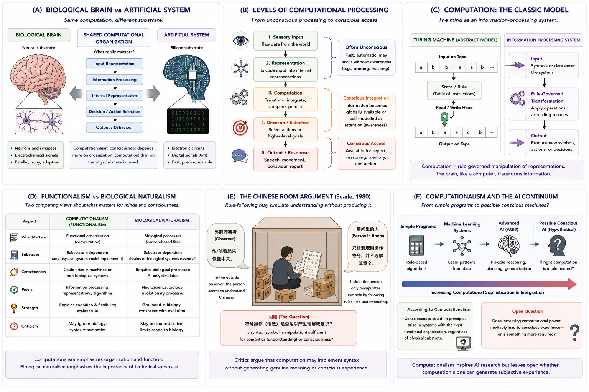
```

As Figure @ref(fig:fig-computationalism) illustrates, computationalism proposes that mind may depend on information processing, representational structure, functional organization, and computational dynamics rather than on biological material alone. This is why computationalism is closely connected to artificial intelligence and machine consciousness.

The figure also highlights two central tensions. First, computation does not automatically imply understanding. Second, simulation does not automatically imply consciousness. These tensions remain central to contemporary debates about artificial minds.

## Historical Development

Computationalism developed alongside major twentieth-century advances in computer science, logic, cybernetics, information theory, cognitive psychology, and artificial intelligence. Early digital computers showed that machines could perform complex formal operations by following rules. This inspired the question of whether human cognition might also be understood computationally.

The McCulloch-Pitts model of neural activity helped show how neural systems could be described in logical and computational terms [@mcculloch1943]. Turing’s work then provided a general framework for thinking about computation and machine intelligence [@turing1950]. Shannon’s information theory offered a formal account of information transmission [@shannon1948], while Wiener’s cybernetics emphasized feedback, control, and communication in machines and organisms [@wiener1948].

During the cognitive revolution, researchers increasingly modeled mental processes as internal computations. Newell and Simon developed influential accounts of physical symbol systems, arguing that symbolic manipulation could explain intelligent behaviour [@newell1976]. Fodor’s computational theory of mind treated cognition as involving mental representations and rule-governed operations over those representations [@fodor1975].

Later, connectionist approaches challenged purely symbolic models by emphasizing distributed neural networks, parallel processing, and learning through pattern adjustment [@rumelhart1986]. More recent machine-learning systems and neural networks continue this computational tradition, although often in non-symbolic forms.

## What Is Computation?

In theories of mind, computation usually refers to rule-governed information processing. A computational system receives input, transforms internal states according to some structure or process, and produces output.

The classical model can be represented simply:

```text
input → processing → output
```

Applied to mind, this means that sensory information enters the system, internal representations are transformed, and behaviour or cognition results. For example, a visual system may receive light patterns, construct representations of objects, compare them with memory, and guide action.

Computation does not have to mean conscious reasoning or explicit calculation. Many computational processes are automatic, unconscious, distributed, and probabilistic. Modern computationalism includes symbolic computation, neural network processing, predictive modeling, Bayesian inference, and dynamical systems approaches.

The key idea is that mental processes can be explained by organized transformations of information.

## Functional Organization

A central idea in computationalism is functional organization. According to this view, what matters for mentality is not only what a system is made of, but how it is organized and what processes it implements.

This idea overlaps strongly with functionalism. Functionalism defines mental states by their causal roles rather than by their material composition [@putnam1967]. Computationalism adds that these causal roles may be understood as computational or information-processing roles.

For example, a memory system is not defined only by the biological tissue that implements it. It is defined by what it does: storing information, retrieving it, updating it, and using it to guide behaviour. A computationalist asks how these functions can be modeled as information-processing operations.

This focus on organization makes computationalism flexible. It allows researchers to compare biological brains, artificial systems, animal cognition, machine learning models, and possible non-human minds in terms of shared computational structure.

## Substrate Independence

Substrate independence is one of the most important ideas associated with computationalism. It is the claim that the same computation can, in principle, be implemented in different physical substrates.

A simple calculation can be performed by a human with pencil and paper, a mechanical calculator, a digital computer, or a neural network. The physical systems differ, but the computational structure may be similar.

Applied to mind, substrate independence suggests that mental processes may not require carbon-based biological tissue specifically. If the right computational organization were realized in a different physical system, that system might possess cognition or perhaps consciousness [@chalmers1996].

This idea is central to artificial intelligence and machine consciousness. If consciousness depends on computational organization, then artificial systems could be conscious in principle. However, substrate independence is controversial. Critics argue that consciousness may depend on biological features that computation alone does not capture.

## Representation and Information Processing

Computationalism usually treats cognition as involving representations. These representations may encode sensory states, objects, goals, beliefs, bodily conditions, environmental structure, or internal models.

A computational system does not merely react to stimuli. It transforms representations. It stores information, compares alternatives, updates internal states, makes predictions, and selects actions.

This representational view helps explain many cognitive capacities. Memory can be understood as stored information. Reasoning can be understood as transformation of representations. Perception can be understood as constructing models from sensory input. Planning can be understood as simulating possible future states.

However, representation also raises philosophical problems. What gives a representation meaning? How does a symbol or neural pattern come to be about something? This problem of intentionality becomes one of the major challenges for computationalism.

## Symbolic Computationalism

Early computationalism often took a symbolic form. Symbolic computationalism proposes that cognition operates through formal rules applied to symbols. A mind is understood somewhat like a language-like system in which internal symbols are manipulated according to computational rules [@fodor1975].

Symbolic approaches were influential in classical artificial intelligence. They supported systems that used explicit rules, logic, planning, problem-solving, and symbolic representations.

The strength of symbolic computationalism is clarity. Rules and representations can be explicitly specified. This makes symbolic models useful for logic, language, planning, and structured reasoning.

The weakness is that symbolic systems can be brittle. They may struggle with context, perception, ambiguity, learning, emotion, embodiment, and flexible adaptation. This led many researchers to explore connectionist alternatives.

## Connectionism

Connectionism explains cognition through networks of simple processing units. Instead of manipulating explicit symbols according to fixed rules, connectionist systems learn distributed patterns through changes in network weights.

This approach was influenced by neural organization and became central to modern machine learning. Neural networks can learn patterns, classify inputs, generate outputs, and adapt through training [@rumelhart1986].

Connectionism has several strengths. It handles ambiguity, pattern recognition, learning, and generalization more naturally than many symbolic systems. It also resembles aspects of biological neural processing more closely than classical symbolic AI.

However, connectionism raises its own questions. Distributed representations can be difficult to interpret. Neural networks may perform well without clear symbolic understanding. They may generate outputs without grounding, meaning, or subjective experience.

Computationalism therefore includes both symbolic and connectionist approaches, but neither automatically solves the problem of consciousness.

## Computationalism and Artificial Intelligence

Computationalism is one of the main philosophical foundations of artificial intelligence. If cognition is computation, then artificial systems can in principle instantiate cognitive processes. This possibility has shaped AI research since Turing’s famous question of whether machines can think [@turing1950].

The strongest version of computationalism suggests that a sufficiently advanced information-processing system could become conscious if it implemented the right computational organization. This view supports the possibility of artificial consciousness.

However, the weaker version claims only that computation can model or simulate aspects of cognition. A computer may simulate reasoning, language, vision, or attention without necessarily having subjective experience.

This distinction is crucial. A system may behave intelligently, generate language, solve problems, or imitate human conversation without being conscious. Computational sophistication does not automatically settle the question of phenomenal experience [@butlin2023].

Computationalism therefore makes machine consciousness possible in principle, but it does not prove that current AI systems are conscious.

## Computationalism and Functionalism

Computationalism is closely related to functionalism. Functionalism argues that mental states are defined by causal roles rather than physical substance. Computationalism often interprets those causal roles as computational roles.

For example, pain may be understood functionally as a state caused by damage, associated with distress, connected to learning and avoidance, and capable of guiding behaviour. A computationalist may then ask how such a state is represented, processed, integrated, and used by the system.

Both functionalism and computationalism emphasize organization over material. However, computationalism is more specific because it explains organization in terms of information processing, representation, algorithms, or computational dynamics.

The two frameworks therefore overlap deeply, but they are not identical. One can be a functionalist without thinking all mental processes are best understood as computation. One can also use computational models without claiming that computation alone is sufficient for consciousness.

## Syntax and Semantics

One of the central debates in computationalism concerns the relation between syntax and semantics.

Syntax refers to formal structure and rule-governed manipulation. A computer can manipulate symbols according to rules without knowing what those symbols mean. Semantics refers to meaning, understanding, reference, and intentionality.

Critics argue that computation is fundamentally syntactic. It processes symbols or patterns according to formal rules. But consciousness and understanding seem to involve meaning. A person does not merely manipulate words; they understand them. A conscious experience is not merely a data structure; it means something to a subject.

This challenge raises a major question: how can computation generate semantics? Some computationalists argue that meaning emerges from the system’s causal relations, embodiment, learning, and interaction with the world. Critics argue that formal computation alone is not enough.

## The Chinese Room Argument

John Searle’s Chinese Room argument is one of the most influential criticisms of strong computationalism [@searle1980]. The thought experiment imagines a person inside a room who does not understand Chinese. The person follows a rulebook for manipulating Chinese symbols and produces correct responses. From the outside, the room appears to understand Chinese. But the person inside does not understand the language.

Searle’s conclusion is that syntax is not sufficient for semantics. Formal symbol manipulation may produce correct behaviour without genuine understanding. If this is right, then computation alone may not be enough for consciousness or meaning.

Computationalists have offered several responses. The systems reply argues that the person does not understand Chinese, but the whole system does. The robot reply argues that grounding symbols in perception and action may generate understanding. The brain simulator reply argues that the right causal organization could produce genuine mentality.

The debate remains unresolved. The Chinese Room continues to challenge the claim that computation alone is sufficient for understanding.

## Computationalism and Biological Naturalism

Computationalism is often contrasted with biological naturalism. Biological naturalism, associated with Searle, argues that consciousness is a biological feature of brains and depends on the causal powers of living neural systems [@searle1980].

From a biological naturalist perspective, simulating consciousness is not the same as producing consciousness. A computer simulation of digestion does not digest food. A simulation of a storm does not make anything wet. Similarly, a simulation of consciousness may not be conscious.

Computationalists respond that the analogy may be misleading. Digestion depends on specific biochemical processes, but cognition may depend on information-processing organization. If mental processes are computational, then implementing the right computation may be enough.

This debate remains central to AI consciousness. Is consciousness substrate-independent, or does it depend on specific biological mechanisms? Computationalism answers in favour of organization. Biological naturalism answers in favour of biology.

## Embodiment Critiques

Embodied cognition theorists criticize purely computational accounts of mind. They argue that cognition is not merely internal symbol manipulation or abstract information processing. It depends on bodily action, perception-action loops, environmental interaction, affect, and lived experience [@varela1991; @thompson2007].

From this perspective, a disembodied computer program may lack important features of mind. It may process information without bodily needs, sensorimotor grounding, vulnerability, emotion, or practical engagement with the world.

Embodiment critiques are especially relevant to consciousness. Conscious experience is often bodily and situated. Pain, emotion, hunger, movement, touch, and selfhood are not abstract computations alone. They are lived experiences of an organism embedded in an environment.

Computationalists can respond by broadening the theory. They may argue that embodiment itself can be modeled computationally, or that the relevant computation includes body-world interaction. The debate then becomes whether computation can fully capture embodiment or whether embodiment reveals limits in computational explanation.

## Simulation and Instantiation

A major unresolved issue concerns the distinction between simulating consciousness and instantiating consciousness. A simulation represents or imitates a process. An instantiation actually realizes the process.

A computer can simulate a hurricane without producing real wind and rain. It can simulate digestion without digesting food. The question is whether consciousness is more like weather and digestion, or more like calculation.

If consciousness depends on physical-biological processes, simulation may not be enough. If consciousness depends on computational organization, then the right simulation may be an instantiation.

This issue is especially important in artificial intelligence. A machine may simulate conversation, emotion, self-report, or attention without having subjective experience. The central question is whether the system merely imitates conscious behaviour or genuinely realizes the processes sufficient for consciousness.

Computationalism must explain why the right computation would be genuine consciousness rather than only a model of consciousness.

## Computational Neuroscience

Computationalism has strongly influenced neuroscience. Modern neuroscience often describes the brain in terms of coding, representation, prediction, integration, decision-making, and information processing.

Many contemporary theories of consciousness contain computational elements. Global Workspace Theory explains consciousness through information broadcasting and cognitive access [@baars1988; @dehaene2011]. Predictive Processing explains perception through generative models and prediction-error minimization [@friston2010; @clark2013]. Attention Schema Theory explains awareness through internal modeling of attention [@graziano2013]. Recurrent Processing Theory emphasizes recurrent neural dynamics that can be modeled computationally [@lamme2006].

This does not mean all these theories are computationalist in the same way. Some emphasize biological embodiment, others emphasize access, prediction, recurrence, or self-modeling. But computational concepts are deeply embedded in contemporary consciousness science.

The challenge is whether computational descriptions explain consciousness itself or only the mechanisms associated with cognition and behaviour.

## Relation to Other Theories

Computationalism overlaps with several theories discussed elsewhere in this book.

### Relation to Physicalism

Computationalism is usually compatible with physicalism because computations must be physically implemented. However, computationalism emphasizes abstract organization rather than specific biological material.

### Relation to Functionalism

Functionalism and computationalism are closely connected. Functionalism defines mental states by causal role, while computationalism often interprets those roles as information-processing operations [@putnam1967; @fodor1975].

### Relation to Global Workspace Theory

Global Workspace Theory can be interpreted computationally because it explains consciousness through information access, broadcasting, working memory, and cognitive coordination [@baars1988; @dehaene2011].

### Relation to Predictive Processing

Predictive Processing is strongly computational because it explains perception and action through prediction, probabilistic inference, and error minimization [@friston2010; @clark2013].

### Relation to Biological and Embodied Theories

Biological and embodied theories challenge abstract computationalism by emphasizing living systems, bodily regulation, affect, and organism-environment interaction [@varela1991; @thompson2007; @seth2021].

### Relation to Consciousness-First Theories

Computationalism differs from consciousness-first theories such as panpsychism, cosmopsychism, idealism, or Taheri’s T-Consciousness. Computationalism treats consciousness as potentially arising from information-processing organization. Consciousness-first theories treat consciousness as fundamental or prior to computational and physical organization. These approaches will be discussed later in the book.

## Strengths of Computationalism

Computationalism has several major strengths. First, it provides a formal and precise framework for modeling cognition. It allows researchers to build simulations, algorithms, architectures, and testable models.

Second, it connects philosophy of mind with cognitive science, neuroscience, artificial intelligence, psychology, linguistics, and machine learning. Few frameworks have been as influential across so many fields.

Third, computationalism explains many cognitive processes naturally. Memory, reasoning, language, planning, perception, attention, and decision-making can all be modeled as information-processing systems.

Fourth, it allows serious investigation of artificial minds. If cognition depends on organization rather than biological material alone, then non-biological systems may be cognitively significant.

Fifth, computationalism encourages clarity. It forces theories to specify mechanisms, representations, transformations, and architectures rather than relying only on intuition.

## Weaknesses and Criticisms

Computationalism also faces major criticisms. The most important is the hard problem. Even if computation explains cognition, behaviour, reasoning, and access, why should computation produce subjective experience? [@chalmers1995; @chalmers1996]

A second criticism is the syntax-semantics problem. Computation may manipulate formal structures without genuine meaning. The Chinese Room argument captures this concern [@searle1980].

A third criticism is the simulation problem. Simulating consciousness may not be the same as instantiating consciousness.

A fourth criticism is biological dependence. Some theorists argue that consciousness depends on living neural systems, bodily regulation, affect, and biological history in ways that abstract computation may miss.

A fifth criticism is over-abstraction. Computational models may become detached from phenomenology, lived experience, embodiment, and first-person subjectivity.

Finally, computationalism faces the problem of sufficiency. Computation may be necessary for many forms of cognition, but is it sufficient for consciousness? This remains deeply contested.

## Computationalism and the Hard Problem

Computationalism is often more successful at explaining cognition than phenomenal consciousness. It can explain how systems store information, transform representations, solve problems, generate behaviour, and monitor internal states. It may also explain reportability, attention, memory, and reasoning.

However, critics ask why any of this should be accompanied by experience. A system could process information, make decisions, and produce fluent language while lacking subjective awareness. This is the computational version of the hard problem.

Computationalists may respond that consciousness is identical to the right kind of computational organization. Critics reply that this assertion does not explain why computation feels like anything from the inside.

This issue remains central to artificial consciousness. The question is not only whether machines can behave intelligently, but whether computation can generate subjectivity.

## Implications for Artificial Consciousness

Computationalism has enormous implications for future AI systems. If consciousness depends primarily on computational organization, then sufficiently advanced artificial systems might become conscious.

This possibility raises scientific, philosophical, ethical, and legal questions. How could machine consciousness be detected? Could artificial systems suffer? Would conscious machines have moral status? What responsibilities would humans have toward them?

At present, there is no scientific consensus that current AI systems are conscious. Many systems can generate language, recognize patterns, and solve tasks, but these abilities do not by themselves establish subjective experience [@butlin2023].

Computationalism keeps the possibility of artificial consciousness open, but it must be supplemented by a theory of what kind of computation is sufficient for experience.

## Open Questions

Several major questions remain unresolved. Can computation alone generate experience? Is consciousness substrate-independent? Can machines genuinely feel? Does embodiment matter fundamentally? Is simulation equivalent to consciousness? What distinguishes syntax from understanding? How should artificial consciousness be measured? What kinds of computational architecture, if any, are sufficient for phenomenal experience?

These questions show why computationalism remains both foundational and controversial. It has transformed the study of mind, but it has not settled the problem of consciousness.

## Evaluation

Computationalism is one of the most important frameworks in cognitive science and artificial intelligence. It explains mind in terms of information processing, representation, functional organization, and computational dynamics.

Its greatest strength is its scientific and formal power. It allows cognition to be modeled, simulated, tested, and compared across biological and artificial systems. It also provides the conceptual foundation for serious discussion of artificial minds.

Its greatest weakness is that computation may explain intelligent processing more easily than subjective experience. The framework can explain how a system behaves, reasons, learns, predicts, and reports. It remains much harder to explain why computation should produce phenomenal consciousness.

Computationalism is therefore best understood as a powerful theory of cognition and artificial intelligence, and a possible but contested theory of consciousness. Whether computation alone is sufficient for subjective experience remains one of the central unresolved questions in consciousness studies.

## Chapter Summary

Computationalism proposes that mental processes can be understood in terms of computation and information processing. Minds are systems that represent information, transform internal states, generate predictions, solve problems, and control behaviour.

The framework developed from computer science, cybernetics, information theory, cognitive psychology, and artificial intelligence. It became central to the cognitive revolution and remains deeply influential in contemporary neuroscience and AI.

Computationalism is closely related to functionalism and substrate independence. It suggests that cognition, and perhaps consciousness, may depend more on organization than on biological material alone.

Major forms include symbolic computationalism and connectionism. Symbolic approaches emphasize rule-governed manipulation of representations. Connectionist approaches emphasize distributed neural networks and learning through pattern adjustment.

The theory’s strengths include formal precision, scientific productivity, connection to AI, and strong explanations of cognition. Its weaknesses include the hard problem, the syntax-semantics problem, the Chinese Room argument, embodiment critiques, and uncertainty about whether simulation equals consciousness.

The central unresolved question is whether computation is sufficient for subjective experience, or whether consciousness requires something beyond information processing alone.

<!--chapter:end:15-computationalism.Rmd-->

# Bayesian Brain and Predictive Inference {#bayesian-brain}

## Chapter Overview

Bayesian brain theories propose that perception and cognition operate through probabilistic inference under conditions of uncertainty. According to this framework, the brain does not passively record reality. Instead, it actively estimates the most likely causes of sensory input and continuously updates those estimates in response to new evidence [@knill2004; @kersten2004].

Bayesian approaches became influential because they provide a powerful computational framework for understanding perception, learning, prediction, uncertainty, attention, action, and conscious experience. The central idea is that the brain combines prior expectations with incoming sensory evidence to generate the best current interpretation of the world, body, and self.

This view is closely related to Predictive Processing and Active Inference, but the emphasis is slightly different. Predictive Processing focuses on hierarchical prediction and prediction-error minimization. Bayesian brain theories focus more broadly on probabilistic inference: how the brain weighs prior beliefs, sensory evidence, uncertainty, and precision in forming perceptual experience [@friston2010; @clark2016].

Some Bayesian approaches propose that conscious perception reflects the brain’s best current model of reality. On this view, perception is not simply what the senses deliver. It is what the brain infers, given both sensory input and prior expectations [@helmholtz1867; @hohwy2013].

At the same time, Bayesian approaches face an important philosophical challenge. They may explain how perception is constructed under uncertainty, but do they fully explain why perception is conscious? Probabilistic inference may explain cognition, behaviour, and reportability, but it may not by itself explain subjective feeling or phenomenal consciousness [@chalmers1995; @chalmers1996].

This chapter introduces Bayesian inference, explains the Bayesian brain framework, examines prediction error and precision weighting, explores hallucinations and altered states, compares Bayesian approaches with other theories of consciousness, and evaluates their strengths and limitations.

## Learning Objectives

After reading this chapter, the reader should be able to:

* Define the core claim of Bayesian brain theories.
* Explain Bayesian inference intuitively.
* Describe priors, sensory evidence, prediction error, and posterior beliefs.
* Explain the role of uncertainty and precision weighting.
* Analyze the relationship between prediction and conscious perception.
* Describe hallucinations and altered states within Bayesian frameworks.
* Compare Bayesian approaches with Predictive Processing and other theories of consciousness.
* Evaluate the strengths and criticisms of Bayesian approaches to consciousness.
* Discuss whether probabilistic inference is sufficient for conscious experience.

## Why Bayesian Brain Theories Became Influential

Bayesian brain theories became influential because they offer a formal way to explain how organisms perceive and act under uncertainty. Sensory input is often incomplete, noisy, ambiguous, and context-dependent. The brain must therefore infer what is most likely happening rather than simply read the world directly.

For example, a shadow may be interpreted as an object, a sound may be interpreted as speech, and an ambiguous image may be seen in more than one way. These cases show that perception depends not only on sensory input, but also on expectation, context, memory, and prior knowledge.

Bayesian theories explain this by proposing that the brain combines prior expectations with sensory evidence. Priors represent what the system already expects or believes is likely. Sensory evidence represents current incoming data. Perception reflects the brain’s best estimate after combining both.

This framework became especially powerful because it connects perception, attention, learning, action, hallucination, and uncertainty within one mathematical language. It also aligns naturally with computational neuroscience, machine learning, robotics, psychiatry, and artificial intelligence [@doya2007; @griffiths2008].

## Core Idea in One Picture

Figure @ref(fig:fig-bayesian) summarizes the major conceptual structure of Bayesian approaches to consciousness.

```{r fig-bayesian, echo=FALSE, fig.cap="Bayesian brain and predictive inference. Panel A illustrates the Bayesian perception loop. Panel B shows hierarchical predictive processing. Panel C demonstrates perception under uncertainty. Panel D illustrates precision weighting and attention. Panel E shows hallucinations as overweighted priors. Panel F compares Bayesian approaches with other theories of consciousness.", out.width="100%", fig.align="center"} id="d6fa7g"
knitr::include_graphics("figures/16_bayesian_theory.png")
```

As Figure @ref(fig:fig-bayesian) illustrates, Bayesian approaches interpret perception as a continuous interaction between prior expectations, sensory evidence, prediction error, uncertainty, and model updating. Perception is not simply received from the world. It is inferred.

The figure also highlights one of the central philosophical issues. Bayesian inference can explain how perceptual contents are selected, updated, and stabilized, but it does not automatically explain why those contents are subjectively experienced.

## Historical Development

The intellectual roots of Bayesian brain theories extend across probability theory, statistics, philosophy, psychology, cybernetics, information theory, and computational neuroscience. Thomas Bayes’ work on probability provided the mathematical foundation for updating beliefs in light of evidence [@bayes1763].

In perception theory, Hermann von Helmholtz proposed that perception involves unconscious inference. The mind does not merely register sensory input. It interprets sensory signals by inferring their most likely causes [@helmholtz1867]. This idea became a major precursor to modern Bayesian theories of perception.

In the late twentieth and early twenty-first centuries, Bayesian models became increasingly influential in neuroscience and cognitive science. Researchers used Bayesian frameworks to explain perception under uncertainty, sensory integration, motor control, attention, and decision-making [@knill2004; @yuille2006; @griffiths2008].

Predictive coding and the Free Energy Principle then connected Bayesian inference with neural implementation and biological regulation. Predictive coding models proposed that the brain uses hierarchical predictions to reduce prediction error [@rao1999]. Friston’s Free Energy Principle provided a broader framework linking prediction, perception, action, and self-organization [@friston2005; @friston2010].

Bayesian brain theories are therefore part of a wider movement toward understanding mind as probabilistic, predictive, and inferential.

## Bayesian Inference

Bayesian inference is a method of updating beliefs in response to evidence. In simple terms, it asks how a system should revise its expectations when new information arrives.

A Bayesian system combines three basic elements. The first is the prior: what the system already expects before receiving new evidence. The second is the likelihood: how well the evidence fits a possible explanation. The third is the posterior: the updated belief after prior expectation and evidence are combined.

In perception, this means the brain does not simply accept sensory input at face value. It asks, in effect: given what I already know and what the senses are currently providing, what is the most likely cause of this input?

This can be summarized intuitively:

```text id="jig5wh"
prior expectation + sensory evidence → updated perception
```

The result is not always perfect truth. It is the brain’s best current estimate under uncertainty. This is why perception can be accurate in many cases but distorted in others.

## The Brain as a Prediction Machine

Bayesian brain theories often describe the brain as a prediction machine. The brain continuously anticipates sensory events, bodily changes, environmental structure, social situations, and possible actions.

Incoming sensory information is compared with these expectations. When the input differs from what was expected, the system generates prediction error. The brain then updates its model to reduce future error.

This framework changes how perception is understood. Traditional models often treat perception as moving from world to senses to brain. Bayesian approaches treat perception as an active process in which the brain predicts the world and uses sensory input to correct its predictions.

This does not mean the brain invents reality freely. Sensory input constrains perception. But perception is always shaped by the brain’s prior models, expectations, and estimates of uncertainty.

## Hierarchical Predictive Processing

Bayesian theories often propose that the brain is organized hierarchically. Higher levels represent abstract causes, contexts, goals, and meanings. Lower levels represent more detailed sensory features such as edges, sounds, colours, textures, and bodily signals.

Higher levels generate predictions about what lower levels should receive. Lower levels compare those predictions with incoming sensory signals and send prediction errors upward. This creates a continuous loop of prediction and correction [@rao1999; @friston2010].

This hierarchical structure helps explain how perception can be both stable and flexible. Higher-level expectations provide context and coherence, while lower-level prediction errors allow correction when the world does not match expectation.

For example, when listening to speech in a noisy room, the brain uses prior knowledge of language, context, and expectation to interpret incomplete auditory signals. The resulting experience is not a raw sound pattern. It is an inferred meaningful utterance.

## Prediction Error

Prediction error is the difference between predicted sensory input and actual sensory input. It is central to Bayesian and predictive theories because it drives learning and model updating.

When prediction error is small, the brain’s current model is working well. When prediction error is large, the system must revise its model, shift attention, or act to gather better information.

Prediction error can influence conscious experience. Unexpected stimuli often become more noticeable. Ambiguous stimuli may shift interpretation when prediction errors accumulate. Learning occurs when prediction errors reveal that the brain’s current model is incomplete or inaccurate.

However, prediction error does not automatically produce consciousness. Many unconscious systems also compute errors and update behaviour. The key question is what kinds of prediction error, at what levels of processing, contribute to conscious experience.

## Perception Under Uncertainty

One of the strongest contributions of Bayesian approaches is their treatment of perception under uncertainty. Sensory information is often incomplete or ambiguous. The brain must infer what is most likely present.

Ambiguous figures provide simple examples. The same image can be interpreted in different ways depending on context or expectation. Noisy speech may become clearer when one knows what sentence to expect. A vague shape in the dark may be interpreted as a person, a tree, or a shadow depending on prior belief and emotional state.

Bayesian theories explain these cases by saying that perception reflects weighted inference. The brain combines sensory evidence with prior expectations. When sensory evidence is strong and reliable, it dominates perception. When sensory evidence is weak or uncertain, priors play a stronger role.

This explains why perception is both objective and subjective. It is constrained by the world, but shaped by the brain’s expectations.

## Precision Weighting and Attention

Precision weighting is one of the most important concepts in Bayesian brain theories. Precision refers to the estimated reliability or certainty of a signal. A high-precision signal is treated as reliable and strongly influences perception. A low-precision signal is treated as uncertain and has less influence.

Attention is often interpreted as a form of precision control. When the brain attends to a stimulus, it increases the weight of prediction errors associated with that stimulus. This makes the signal more influential in perception and behaviour [@friston2010; @clark2013].

Precision weighting helps explain why some information becomes prominent in conscious awareness while other information remains background. It also helps explain individual differences in perception, anxiety, hallucination, and altered states.

For example, if bodily sensations are given excessive precision, they may dominate experience and contribute to anxiety. If high-level beliefs are given excessive precision, they may overpower sensory correction and contribute to hallucination or delusion.

Precision weighting therefore connects Bayesian inference with attention, salience, confidence, and conscious experience.

## The Free Energy Principle

Karl Friston’s Free Energy Principle extends Bayesian inference into a broad theory of biological self-organization [@friston2005; @friston2010]. According to this framework, organisms must maintain themselves within viable states by reducing uncertainty or surprise.

The brain does this by updating internal models and by acting on the world. Perception reduces uncertainty by revising beliefs. Action reduces uncertainty by changing sensory input. Together, perception and action form a continuous adaptive loop.

The Free Energy Principle is important because it connects Bayesian inference with life, action, embodiment, and self-maintenance. It does not treat the brain as a detached calculator. It treats the organism as an active system maintaining itself in a changing environment.

This makes the Bayesian brain framework relevant not only to perception, but also to action, emotion, selfhood, and consciousness.

## Consciousness and Predictive Models

Some Bayesian approaches propose that conscious experience reflects the brain’s best current predictive model of the world, body, and self. On this view, experience is not a copy of reality. It is a controlled, constrained inference.

This idea has been described as perception as “controlled hallucination,” meaning that the brain continuously generates perceptual models that are constrained by sensory evidence [@seth2021]. In normal perception, sensory input keeps these models aligned with the world. In hallucination or dreaming, internal models may dominate more strongly.

Bayesian theories may also explain aspects of selfhood. The sense of being an embodied self may depend on predictive models of bodily signals, including heartbeat, breathing, pain, movement, and interoception [@seth2013; @barrett2017].

However, the connection to consciousness remains debated. Bayesian inference may explain how perceptual content is constructed, but it does not automatically explain why that content is experienced from a first-person perspective.

## Hallucinations and Altered States

Bayesian approaches are especially powerful for explaining hallucinations and altered states. In normal perception, prior expectations and sensory input are balanced. In hallucination, prior expectations may dominate sensory evidence too strongly.

This can be summarized as:

```text id="w1d21n"
normal perception = balanced priors + sensory evidence
hallucination = overweighted priors + weakened sensory constraint
```

This framework has been applied to psychosis, auditory hallucinations, dreaming, psychedelic states, and delusional perception [@carhartHarris2019; @seth2021].

Dreaming can be interpreted as internally generated perception with reduced external sensory constraint. Psychedelic states may involve altered precision weighting and weakened high-level priors, allowing perception and self-experience to become more fluid. Psychosis may involve unusual precision assignments that make certain thoughts, perceptions, or beliefs feel excessively meaningful.

These applications show why Bayesian approaches have become influential in psychiatry and altered-state research. They explain altered experience as a change in inferential balance rather than as random malfunction.

## Bayesian Brain and Other Theories

Bayesian brain theories intersect with several other theories of consciousness.

### Relation to Predictive Processing

Predictive Processing can be understood as a neural and hierarchical implementation of Bayesian inference [@friston2010; @clark2016]. The Bayesian brain framework provides the probabilistic logic. Predictive Processing describes how hierarchical neural systems may implement that logic through predictions and prediction errors.

### Relation to Global Workspace Theory

Global Workspace Theory explains consciousness in terms of global broadcasting and cognitive access [@baars1988; @dehaene2011]. Bayesian inference may help determine which contents become strong, stable, or precise enough to enter global access.

### Relation to Integrated Information Theory

Integrated Information Theory emphasizes intrinsic causal integration and irreducibility [@tononi2004; @oizumi2014]. Bayesian approaches emphasize probabilistic inference, uncertainty reduction, and prediction. The two frameworks may overlap in their concern with integration, but they explain consciousness differently.

### Relation to Recurrent Processing Theory

Recurrent Processing Theory emphasizes feedback loops and recurrent sensory processing [@lamme2006]. Bayesian models also rely on recurrent exchange between predictions and prediction errors. The difference is that Bayesian theories interpret this exchange probabilistically.

### Relation to Higher-Order Thought Theory

Higher-Order Thought Theory explains consciousness through awareness of mental states [@rosenthal2005; @lau2011]. Bayesian approaches can model higher-order awareness as inference about one’s own mental states. However, HOT places meta-representation at the center, while Bayesian theories place probabilistic inference at the center.

### Relation to Attention Schema Theory

Attention Schema Theory explains awareness as the brain’s model of attention [@graziano2013]. Bayesian theories can interpret attention schemas as predictive models used to regulate attention and precision.

### Relation to Embodied and Enactive Theories

Embodied and enactive theories emphasize bodily action, environmental coupling, and lived experience [@varela1991; @thompson2007]. Bayesian approaches overlap with these theories when they emphasize active inference, interoception, and organism-environment interaction.

### Relation to Consciousness-First Theories

Bayesian brain theories differ from consciousness-first theories such as panpsychism, cosmopsychism, idealism, or Taheri’s T-Consciousness. Bayesian approaches begin with biological and computational inference. Consciousness-first theories begin from the idea that consciousness is fundamental or prior to physical and computational organization. These approaches will be discussed later in the book.

## Empirical Support

Evidence supporting Bayesian approaches comes from studies of visual illusions, perceptual ambiguity, sensory expectation, predictive coding, hallucinations, neuroimaging, computational modeling, and decision-making under uncertainty.

Perceptual illusions show that expectation and context shape experience. Ambiguous images show that the same sensory input can produce different conscious interpretations. Mismatch responses show that the brain detects violations of expectation. Predictive coding models explain how cortical systems may implement prediction and error correction [@rao1999; @friston2010].

Bayesian approaches are also useful in explaining multisensory integration. The brain must combine information from vision, hearing, touch, proprioception, and interoception. Bayesian models explain how signals are weighted according to reliability [@knill2004; @kersten2004].

In psychiatry and altered-state research, Bayesian frameworks help explain how abnormal precision weighting and altered priors may shape hallucinations, anxiety, psychosis, and psychedelic experience [@barrett2017; @carhartHarris2019].

However, much of this evidence supports Bayesian models of perception and cognition more directly than Bayesian theories of consciousness specifically. This distinction is important.

## Bayesian Approaches and Artificial Intelligence

Bayesian inference has strongly influenced artificial intelligence, robotics, machine learning, and decision theory. Artificial systems often need to act under uncertainty, update beliefs, estimate hidden causes, and make predictions from incomplete information.

Bayesian approaches are especially important in robotics because agents must infer the state of the world from noisy sensory signals. They are also important in machine learning systems that estimate probabilities, update models, and make decisions under uncertainty.

This raises questions about artificial consciousness. If consciousness depends on predictive inference, then advanced artificial systems with probabilistic models might possess some consciousness-relevant capacities. However, Bayesian inference alone is not sufficient evidence of consciousness. Many artificial systems perform probabilistic inference without subjective experience.

A conscious artificial system may require more than Bayesian updating. It may require embodiment, self-modeling, affective regulation, global integration, recurrent processing, or metacognitive awareness. Recent AI consciousness discussions therefore treat Bayesian and predictive capacities as relevant but not decisive [@butlin2023].

## Strengths of Bayesian Approaches

Bayesian brain theories have several major strengths. First, they provide a strong mathematical framework for understanding uncertainty. Perception and cognition often occur under incomplete information, and Bayesian inference gives a precise way to model this.

Second, Bayesian approaches explain why perception is shaped by expectation, context, and prior belief. They account for illusions, ambiguity, hallucinations, and altered states in a unified way.

Third, they integrate naturally with neuroscience, machine learning, robotics, psychiatry, and computational modeling. This gives the framework broad interdisciplinary reach.

Fourth, Bayesian theories connect perception with action and embodiment through active inference and the Free Energy Principle.

Fifth, they provide a useful bridge between cognition and consciousness. They explain how conscious contents may be constructed, stabilized, and updated through probabilistic inference.

## Weaknesses and Criticisms

Bayesian approaches also face several criticisms. One concern is overgeneralization. Because many processes can be described as inference under uncertainty, Bayesian explanations may become too flexible. If almost any result can be interpreted as Bayesian, the theory becomes difficult to test.

A second criticism is mathematical idealization. Brains may not literally calculate formal probabilities in the way Bayesian models describe. Bayesian models may be useful approximations rather than literal neural mechanisms.

A third criticism is empirical underdetermination. Many findings interpreted through Bayesian theories may also be explained by other frameworks, such as recurrent processing, global workspace models, or reinforcement learning.

A fourth criticism concerns embodiment and affect. Some Bayesian models may seem overly computational unless they include bodily regulation, emotion, action, and environmental interaction.

The deepest criticism concerns the hard problem. Bayesian inference may explain how perception is constructed, but it may not explain why perception feels like anything.

## Relation to the Hard Problem

Bayesian approaches are highly successful at explaining perceptual organization, uncertainty management, prediction, attention, learning, hallucination, and adaptive behaviour. However, critics argue that these explanations still leave the hard problem unresolved [@chalmers1995; @chalmers1996].

Even if conscious experience reflects the brain’s best predictive model, why is that model experienced? Why should probabilistic inference generate subjectivity? Why should prediction errors, priors, and precision weighting produce qualitative feeling?

This is the central philosophical challenge for Bayesian theories of consciousness. They may explain the contents and dynamics of experience, but not necessarily the existence of experience itself.

For this reason, Bayesian approaches are best understood as powerful theories of perceptual construction and conscious content. Whether they are complete theories of phenomenal consciousness remains unresolved.

## Explanatory Scope

Bayesian approaches attempt to explain perception, uncertainty, prediction, hallucination, attention, learning, decision-making, action, and conscious inference. Their explanatory scope is broad and impressive.

However, several questions remain open. Is prediction sufficient for consciousness? Can unconscious systems perform the same computations? How does selfhood emerge from Bayesian inference? Can artificial systems become conscious through probabilistic modeling? What distinguishes prediction from phenomenology? How should conscious inference be measured empirically?

These questions show that Bayesian theories are important but incomplete. They offer one of the strongest frameworks for explaining how experience is shaped, but not necessarily why experience exists.

## Evaluation

Bayesian brain theories are among the most influential computational frameworks in contemporary neuroscience and cognitive science. They explain perception and cognition as probabilistic inference under uncertainty.

Their greatest strength is that they explain why perception is active, context-sensitive, and expectation-driven. They provide a formal account of how priors, sensory evidence, prediction error, and precision interact to produce perceptual experience.

Their greatest limitation is that inference is not the same as consciousness. A system may perform Bayesian updating without having subjective experience. Therefore, Bayesian theories need to be connected with additional accounts of embodiment, integration, access, recurrence, self-modeling, or phenomenology if they are to become complete theories of consciousness.

Bayesian approaches are therefore best understood as powerful theories of perceptual inference and conscious content. Whether they fully explain phenomenal consciousness remains an open question.

## Chapter Summary

Bayesian brain theories propose that perception and cognition emerge through probabilistic inference under uncertainty. The brain continuously combines prior expectations with sensory evidence to generate updated models of the world, body, and self.

The framework emphasizes priors, likelihoods, posterior beliefs, prediction error, precision weighting, hierarchical inference, and model updating. It explains perception as active inference rather than passive reception.

Bayesian approaches are especially strong in explaining ambiguity, illusions, hallucinations, altered states, attention, uncertainty, and prediction. They are closely related to Predictive Processing, Active Inference, and the Free Energy Principle.

The main criticism is that Bayesian inference may explain how perception is constructed without explaining why it is conscious. Prediction, evidence, and uncertainty may shape experience, but they do not automatically explain subjective feeling.

The central unresolved question is whether consciousness is itself a form of Bayesian inference, or whether Bayesian inference explains only the structure, content, and dynamics of conscious perception.

<!--chapter:end:16-bayesian-brain.Rmd-->

# Panpsychism {#panpsychism}

## Chapter Overview

Panpsychism is the view that consciousness, or at least extremely simple forms of proto-consciousness, is a fundamental feature of reality rather than something that appears suddenly from entirely non-conscious matter. According to this view, consciousness is not created from nothing when matter reaches a certain level of complexity. Instead, experiential properties may already exist in very primitive form within the basic structure of nature [@chalmers1996; @strawson2006; @goff2017].

Panpsychism differs from standard physicalist theories that treat consciousness as an emergent product of neural complexity. Physicalist theories often begin with non-conscious matter and then attempt to explain how consciousness arises from biological organization. Panpsychism changes the starting point. It proposes that experience, or proto-experience, is already part of reality at a fundamental level.

This makes panpsychism especially important in debates about the hard problem of consciousness. The hard problem asks why physical processes should give rise to subjective experience at all [@chalmers1995]. Panpsychists argue that if matter is assumed to be entirely non-experiential, then the emergence of experience becomes deeply mysterious. If experiential properties are already present in nature, the explanatory gap may be reduced.

Panpsychism has become increasingly influential in contemporary philosophy of mind because it directly addresses the question of how subjective experience relates to the physical world. It also connects with debates about Russellian monism, cosmopsychism, Integrated Information Theory, consciousness-first theories, and artificial intelligence [@russell1927; @goff2019; @tononi2004; @oizumi2014].

This chapter examines the historical development, conceptual foundations, metaphysical assumptions, strengths, criticisms, and unresolved challenges associated with panpsychism. Particular attention is given to the explanatory gap, the combination problem, Russellian monism, cosmopsychism, and the relationship between panpsychism and other theories of consciousness, including Taheri’s T-Consciousness as a related but distinct consciousness-first framework.

## Learning Objectives

After reading this chapter, the reader should be able to:

* Define the core claims of panpsychism.
* Explain why panpsychism is motivated by the hard problem of consciousness.
* Distinguish panpsychism from physicalism, dualism, and idealism.
* Describe proto-consciousness and fundamental experience.
* Explain the combination problem.
* Distinguish constitutive panpsychism from cosmopsychism.
* Explain Russellian monism and its relation to panpsychism.
* Analyze the relationship between panpsychism and Integrated Information Theory.
* Explain how T-Consciousness differs from standard panpsychism.
* Evaluate the strengths and criticisms of panpsychism.

## Core Idea in One Picture

Figure @ref(fig:fig-panpsychism) summarizes the major conceptual structure of panpsychism.

```{r fig-panpsychism, echo=FALSE, fig.cap="Panpsychism and fundamental consciousness. Panel A contrasts emergent physicalism with panpsychism. Panel B illustrates the combination problem. Panel C shows consciousness as a continuum across systems. Panel D compares panpsychism with physicalism and dualism. Panel E distinguishes constitutive panpsychism from cosmopsychism. Panel F shows conceptual relationships between panpsychism and other theories of consciousness.", out.width="100%", fig.align="center"}
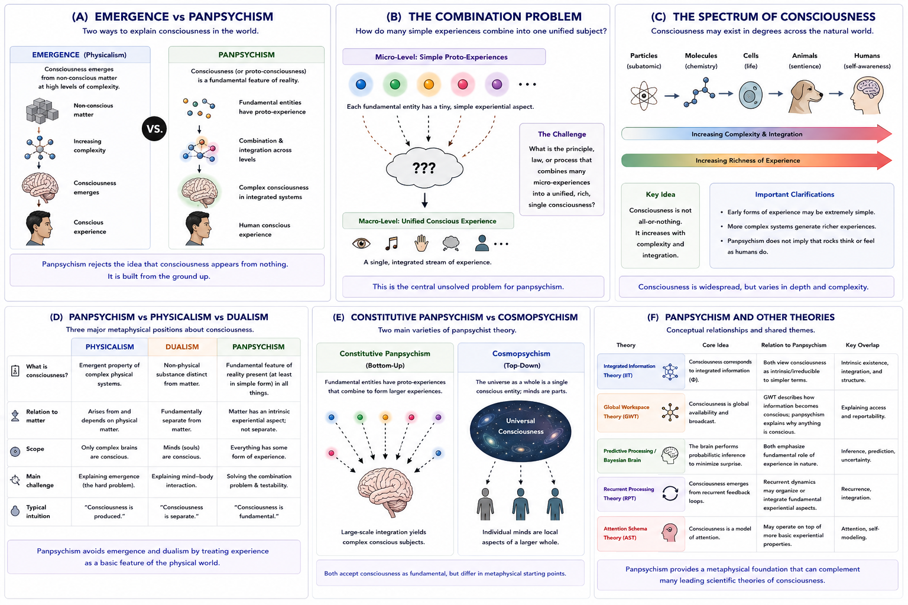
```

As Figure @ref(fig:fig-panpsychism) illustrates, panpsychism attempts to avoid the problem of consciousness emerging from entirely non-conscious matter by treating experience as a fundamental aspect of reality itself. The theory does not claim that electrons, atoms, or cells think like humans. Rather, it proposes that very simple forms of experience or proto-experience may exist at basic levels of nature.

This idea makes panpsychism both attractive and controversial. It offers a direct response to the hard problem, but it also raises difficult questions about how simple experiential properties combine into unified conscious subjects.

## The Problem of Emergence

Panpsychism is motivated by dissatisfaction with standard emergent explanations of consciousness. Many physicalist theories propose that consciousness arises when matter becomes organized into sufficiently complex nervous systems. This view can be summarized as:

```text
matter → neural complexity → consciousness
```

The difficulty is explaining why this transition should produce subjective experience. Physical processes can explain behaviour, information processing, attention, memory, and reportability. However, critics argue that these explanations may not fully explain why there is something it is like to be a conscious subject [@nagel1979; @chalmers1995].

Panpsychism responds by rejecting the assumption that matter is completely non-experiential at the most basic level. It proposes that consciousness does not emerge from nothing. Instead, complex consciousness develops from simpler experiential foundations already present in reality.

This does not remove all explanatory problems, but it changes their form. Instead of asking how consciousness appears from wholly non-conscious matter, panpsychism asks how simple forms of experience relate to complex unified consciousness.

## Historical Development

Panpsychist ideas have deep historical roots. Related views appear in ancient, early modern, and modern philosophy. Spinoza argued that mind and matter could be understood as different aspects of one underlying reality [@spinoza1677]. Leibniz proposed that reality is composed of monads, each with a form of inner perspective or perception [@leibniz1714].

In the modern period, William James considered the possibility that experience might be more widespread in nature than standard materialism allows [@james1904]. Alfred North Whitehead developed a process philosophy in which experiential events are fundamental to reality [@whitehead1929]. Bertrand Russell argued that physics describes the structural and relational properties of matter, but may leave open the intrinsic nature of matter itself [@russell1927].

Contemporary panpsychism has been developed by philosophers such as Galen Strawson, David Chalmers, Philip Goff, Hedda Hassel Mørch, and others [@strawson2006; @chalmers1996; @goff2017; @morch2014]. These thinkers differ in their details, but they share the view that consciousness or proto-consciousness cannot be fully explained if matter is understood as entirely non-experiential.

Historically, panpsychism has often been presented as an alternative to both reductive materialism and substance dualism. It attempts to preserve continuity with the natural world while avoiding the idea that consciousness appears suddenly from something wholly non-conscious.

## Core Assumptions of Panpsychism

Panpsychism usually involves several core assumptions.

First, consciousness or proto-consciousness is fundamental. It is not merely a late accidental product of biological evolution. It belongs, in some basic form, to the structure of reality.

Second, basic physical entities may have primitive experiential properties. This does not mean that atoms have thoughts, emotions, memories, or self-awareness. Panpsychists usually distinguish human consciousness from very simple proto-experiential properties.

Third, complex consciousness requires some form of organization, integration, or combination. Human consciousness is not simply the same as basic proto-experience. It is a highly structured, unified, and integrated form of experience.

Fourth, panpsychism attempts to avoid radical dualism. It does not usually posit a separate mental substance outside the physical world. Instead, it treats experiential properties as part of the intrinsic nature of reality.

These assumptions allow panpsychism to offer a distinctive solution to the hard problem. Consciousness is not added to matter from outside. It is already present, in very basic form, within the natural order.

## Proto-Consciousness

Many versions of panpsychism introduce the idea of proto-consciousness. Proto-consciousness refers to primitive experiential properties, extremely simple phenomenal aspects, or foundational experiential potentials.

Proto-consciousness is not the same as human consciousness. It does not imply language, memory, self-reflection, reasoning, emotion, or personal identity. Instead, it refers to whatever basic experiential features might exist at the lowest levels of reality.

This distinction is important because panpsychism is often misunderstood. The theory does not normally claim that rocks, atoms, or electrons are conscious in the way humans are conscious. Rather, it proposes that the building blocks of reality may possess very simple experiential properties that, under appropriate forms of organization, contribute to more complex consciousness.

This allows panpsychism to treat consciousness as gradual rather than all-or-nothing. Consciousness may exist along a continuum, from extremely simple proto-experiential properties to complex forms of animal and human awareness.

## Russellian Monism

One of the most important contemporary forms of panpsychism is Russellian monism. This approach builds on ideas associated with Bertrand Russell [@russell1927; @russell1927a].

Russellian monism begins with a claim about physics. Physics describes the structural, relational, and dispositional properties of matter. It tells us how physical entities behave, how they relate to one another, and how they can be mathematically described. However, it may not tell us the intrinsic nature of matter: what matter is in itself.

Panpsychists use this point to suggest that the intrinsic nature of matter may involve experiential or proto-experiential properties. On this view, consciousness is not outside the physical world. Rather, it reveals something about the inner nature of the physical world that physics alone does not describe.

Russellian monism is attractive because it attempts to preserve scientific realism while addressing the explanatory gap. It accepts the success of physics but argues that physics may leave room for consciousness at the intrinsic level of reality.

However, Russellian monism also faces challenges. It must explain how intrinsic experiential properties relate to observable physical structure and how simple proto-experiential properties become unified human consciousness.

## The Combination Problem

The greatest challenge facing panpsychism is the combination problem. The problem can be stated simply:

```text
How do many simple experiential units combine into one unified conscious subject?
```

If basic entities possess proto-experiences, how do these become a single human experience? How do many tiny experiential properties combine into one visual field, one stream of thought, or one sense of self?

This problem is difficult because subjective experience appears unified. A person does not experience the brain as billions of separate micro-subjects. Consciousness appears as one field of awareness. Panpsychism must explain how this unity arises.

The combination problem has several forms. The subject-combination problem asks how many simple subjects combine into one larger subject. The quality-combination problem asks how simple qualities combine into complex experiences, such as colour, pain, or emotion. The structure-combination problem asks how micro-level experiential structure becomes macro-level conscious structure [@seager1995; @morch2014].

Critics argue that the combination problem is as difficult for panpsychism as the emergence problem is for physicalism. Panpsychism avoids consciousness emerging from nothing, but it must still explain how simple experience becomes unified consciousness.

## Constitutive Panpsychism

Constitutive panpsychism is the view that macro-consciousness is constituted by micro-consciousness or micro-experience. According to this view, human consciousness arises because simpler experiential properties combine to form complex conscious subjects.

This approach can be summarized as:

```text
micro-experiences → larger conscious systems
```

The advantage of constitutive panpsychism is that it provides continuity between basic reality and complex consciousness. Consciousness is not created suddenly. It is built up from simpler forms.

The difficulty is the combination problem. It is not clear how many small experiential units could combine into one unified subject. Physical parts can combine into physical wholes, but it is much less clear how subjects or experiences combine into a single subject of experience.

Constitutive panpsychism therefore offers an elegant solution to emergence, but it faces a serious challenge concerning unity.

## Cosmopsychism

Cosmopsychism is a related but distinct view. Instead of beginning with micro-conscious entities, cosmopsychism proposes that the universe as a whole may possess a fundamental consciousness, and that individual minds are derived from or grounded in this larger cosmic consciousness [@shani2015].

This reverses the direction of explanation:

```text
universal consciousness → individual minds
```

Cosmopsychism attempts to avoid the combination problem by starting with unity rather than trying to build unity from many separate experiential parts. If consciousness is already unified at the cosmic level, then the problem becomes explaining how individual minds are formed within or from that larger whole.

This creates a different challenge, sometimes called the decombination problem. If the universe has a unified consciousness, how do finite individual subjects arise from it? How does one cosmic subject become many localized subjects?

Cosmopsychism is important because it shows that consciousness-first theories can take different forms. Some begin with micro-experience. Others begin with universal consciousness. Both attempt to avoid the emergence of consciousness from wholly non-conscious matter.

## Panpsychism, Physicalism, and Dualism

Panpsychism is often positioned between physicalism and dualism.

Physicalism proposes that consciousness arises from physical processes. In reductive versions, consciousness is identical to or fully explainable by physical and functional organization. In non-reductive versions, consciousness depends on physical systems but may not be reducible to lower-level descriptions.

Dualism proposes that mind and matter are fundamentally distinct. Substance dualism treats consciousness as belonging to a non-physical mental substance. Property dualism treats consciousness as a non-reducible property that depends on physical systems but is not identical to them.

Panpsychism differs from both. It agrees with physicalism that consciousness is part of the natural world. But it disagrees with reductive physicalism that consciousness can be derived from wholly non-conscious matter. It agrees with dualism that consciousness is not easily reduced to physical structure. But it rejects the idea that consciousness belongs to a separate non-physical substance.

Panpsychism therefore attempts to integrate consciousness into nature by treating experience as fundamental within reality itself.

## Consciousness as a Continuum

Many panpsychist frameworks imply that consciousness exists along a continuum. Rather than appearing suddenly at a sharp threshold, experience may become richer and more complex as systems become more integrated, organized, or unified.

This view has implications for animal consciousness, infant consciousness, artificial intelligence, and non-human forms of mind. It suggests that consciousness may not be limited to adult human beings or language-using organisms.

However, panpsychism does not imply that all systems are conscious in the same way. A human, dog, insect, cell, and simple physical system would not have the same kind of experience. If panpsychism is true, then different systems may have radically different degrees and forms of experience.

This continuum view can be attractive because it avoids sharp and arbitrary boundaries. However, it also raises the problem of over-attribution. Critics worry that panpsychism may attribute experience too broadly unless it provides clear criteria for different degrees of consciousness.

## Panpsychism and Integrated Information Theory

Some philosophers and scientists have observed conceptual similarities between panpsychism and Integrated Information Theory. IIT proposes that consciousness corresponds to integrated information generated by a system with intrinsic causal structure [@tononi2004; @oizumi2014].

Both panpsychism and IIT emphasize intrinsic existence, integration, and the possibility that consciousness may not be limited to human reportability. Both also imply that consciousness may exist in degrees.

However, important differences remain. IIT is a formal theory that attempts to measure consciousness through integrated information, or Φ. Panpsychism is a metaphysical theory about the fundamental nature of reality. IIT does not necessarily require panpsychism, although some interpretations of IIT appear panpsychist or panpsychist-like [@koch2016].

The connection between IIT and panpsychism remains controversial. IIT may provide tools for thinking about degrees of consciousness, but it does not by itself solve the combination problem or establish that experience is fundamental.

## Panpsychism and T-Consciousness

Taheri’s T-Consciousness can be discussed in this chapter as a related consciousness-first framework, but it should not be treated as identical to standard panpsychism. Panpsychism usually proposes that experiential or proto-experiential properties exist at fundamental levels of nature. T-Consciousness, by contrast, presents consciousness as a non-material and foundational reality through which matter, life, and organization are understood or manifested [@taheri2020; @taheri2023].

The relationship between the two views is therefore one of family resemblance rather than identity. Both challenge the standard physicalist idea that consciousness is merely a late product of biological complexity. Both treat consciousness as more fundamental than many mainstream neuroscientific theories allow. Both also attempt to reverse the usual explanatory direction from matter-to-consciousness toward consciousness-as-foundational.

However, important differences remain. Panpsychism usually tries to remain close to naturalistic metaphysics by proposing that experience is built into the intrinsic nature of matter. T-Consciousness is more explicitly consciousness-first and non-material. It does not simply say that matter has experiential properties; it treats consciousness as a foundational field-like or organizing reality.

For this reason, T-Consciousness should be presented carefully as an alternative or emerging consciousness-first framework rather than as an established scientific theory or a standard form of panpsychism. Its relevance in this chapter is that it belongs to the broader family of theories that reject the idea that consciousness is merely produced by complex brains.

## Panpsychism and Artificial Intelligence

Panpsychism has important implications for artificial consciousness. If consciousness is fundamental, then artificial systems might possess some degree of experience depending on their organization, integration, intrinsic properties, or relation to broader experiential reality.

However, panpsychism does not imply that all artificial systems are richly conscious. It does not imply that current AI systems possess human-like awareness. It also does not imply that computation alone is sufficient for consciousness.

The key question is what kind of organization, integration, or intrinsic structure allows simple experiential properties to form unified subjectivity. This question overlaps with debates about Integrated Information Theory, computationalism, functionalism, and machine consciousness [@butlin2023].

From a panpsychist perspective, artificial consciousness may be possible, but it depends on whether artificial systems can support unified experiential organization. From a T-Consciousness perspective, the question may be framed differently: whether artificial systems participate in, reflect, or become organized through a more fundamental consciousness field. Both approaches raise possibilities beyond standard computationalism, but neither provides a simple test for current AI consciousness.

## Empirical Challenges

Panpsychism faces serious empirical challenges. Unlike Global Workspace Theory, Recurrent Processing Theory, or Predictive Processing, panpsychism does not provide a specific neural mechanism or experimental marker of consciousness. It does not tell researchers exactly which brain activity, network pattern, or behavioural measure indicates consciousness.

This makes panpsychism difficult to test directly. It functions more as a metaphysical framework than as a detailed empirical theory. It may shape how consciousness is interpreted, but it does not by itself provide laboratory predictions.

Supporters may respond that panpsychism addresses a different question. It is not primarily a theory of neural mechanisms. It is a theory of what consciousness is and how it fits into reality. Neuroscientific theories may still be needed to explain which systems generate complex consciousness.

This suggests that panpsychism may need to be combined with empirical theories such as IIT, Global Workspace Theory, Predictive Processing, or other models if it is to contribute to scientific consciousness research.

## Strengths of Panpsychism

Panpsychism has several major strengths. First, it directly engages with the hard problem of consciousness. It does not avoid the question of subjective experience. Instead, it places experience at the center of metaphysical explanation.

Second, panpsychism avoids the problem of consciousness emerging from nothing. If experience is already part of reality, then complex consciousness does not have to appear suddenly from wholly non-conscious matter.

Third, panpsychism may preserve continuity within nature. It avoids a sharp divide between conscious humans and an entirely non-conscious universe.

Fourth, it offers an alternative to both reductive physicalism and substance dualism. It does not reduce consciousness to structure alone, but it also does not place consciousness outside nature.

Fifth, panpsychism connects with several contemporary debates, including Russellian monism, IIT, cosmopsychism, animal consciousness, and artificial consciousness.

## Weaknesses and Criticisms

Panpsychism also faces serious criticisms. The most important is the combination problem. No widely accepted solution explains how simple experiential properties combine into unified conscious subjects.

A second criticism is lack of testability. Panpsychism often lacks clear empirical predictions, making it difficult to confirm or falsify scientifically.

A third criticism is explanatory vagueness. Critics argue that treating consciousness as fundamental may not explain consciousness. It may simply declare it basic.

A fourth criticism is over-attribution. If experience is everywhere, then the theory may attribute consciousness too broadly unless it distinguishes carefully between proto-experience and complex consciousness.

A fifth criticism is mechanistic weakness. Panpsychism does not explain attention, memory, reportability, selfhood, perception, or cognitive control in detail. It therefore needs to be supplemented by cognitive and neuroscientific theories.

Finally, cosmopsychism and consciousness-first theories face their own version of the combination problem. If consciousness begins as a universal whole, one must explain how individual finite minds arise from that whole.

## Relation to the Hard Problem

Panpsychism is deeply connected to the hard problem. Instead of trying to derive consciousness from entirely non-conscious matter, it changes the explanatory framework. It proposes that consciousness or proto-consciousness is already part of the basic structure of reality.

Supporters argue that this reduces the explanatory gap. If experience is fundamental, then we do not need to explain how experience emerges from something wholly non-experiential.

Critics argue that the hard problem is not fully solved. Panpsychism still must explain why experiential properties exist, why they have the character they do, and how they combine into unified minds. The mystery is moved from emergence to fundamentality and combination.

This makes panpsychism both powerful and incomplete. It offers one of the most direct responses to the hard problem, but it does not eliminate all explanatory challenges.

## Relation to Other Theories

Panpsychism differs from many other theories discussed in this book.

### Relation to Physicalism

Physicalism explains consciousness as dependent on physical systems. Panpsychism agrees that consciousness belongs within nature, but it rejects the idea that consciousness arises from wholly non-conscious matter.

### Relation to Dualism

Dualism separates mind and matter into different substances or properties. Panpsychism avoids this separation by treating experiential properties as part of the natural world itself.

### Relation to Emergentism

Emergentism proposes that consciousness arises from organized complexity. Panpsychism argues that emergence from entirely non-conscious matter is difficult to explain. However, some forms of panpsychism still require emergence or combination at higher levels.

### Relation to Integrated Information Theory

IIT and panpsychism both emphasize intrinsic existence and degrees of consciousness. IIT is more formal and mathematical, while panpsychism is more metaphysical [@tononi2004; @oizumi2014].

### Relation to Computationalism

Computationalism explains mind in terms of information processing and functional organization. Panpsychism is not primarily computational. It asks what reality must be like for experience to exist at all.

### Relation to Consciousness-First Theories

Panpsychism is one form of consciousness-first or consciousness-fundamental thinking, but it is not the only form. Cosmopsychism, idealism, and T-Consciousness also place consciousness in a more fundamental explanatory role, though they do so in different ways [@shani2015; @taheri2020; @taheri2023].

## Open Questions

Several important questions remain unresolved. How do simple experiential properties combine into unified subjects? Can panpsychism be tested scientifically? What determines degrees of consciousness? Are all physical systems experiential, or only some? How does panpsychism explain selfhood, memory, attention, and reportability? Can artificial systems possess unified experience? How does cosmopsychism explain individual minds? How should T-Consciousness be compared with panpsychism without reducing one to the other?

These questions show why panpsychism remains both attractive and controversial. It confronts the hard problem directly, but it still requires further development.

## Evaluation

Panpsychism is one of the most important contemporary alternatives to reductive physicalism and substance dualism. It argues that consciousness or proto-consciousness is a fundamental feature of reality rather than a late product of entirely non-conscious matter.

Its greatest strength is that it directly addresses the explanatory gap. It refuses to treat subjective experience as an accidental by-product of physical complexity. It also offers a unified metaphysical picture in which consciousness belongs within nature rather than outside it.

Its greatest weakness is the combination problem. Panpsychism must explain how simple experiential properties form unified conscious subjects. Without such an explanation, it risks replacing the emergence problem with a combination problem.

Panpsychism is therefore best understood as a serious metaphysical theory of phenomenal consciousness, not as a complete neuroscience of consciousness. It may need to be combined with empirical theories that explain organization, integration, cognition, and behaviour.

T-Consciousness can be included in this broader discussion as a related consciousness-first framework. However, it should be presented as distinct from standard panpsychism because it treats consciousness as a non-material foundational reality rather than simply as an intrinsic experiential property of matter.

## Chapter Summary

Panpsychism proposes that consciousness or proto-consciousness is a fundamental feature of reality. It challenges the view that consciousness emerges suddenly from entirely non-conscious matter.

The theory is motivated by the hard problem of consciousness. If matter is assumed to be wholly non-experiential, it is difficult to explain why subjective experience appears at all. Panpsychism responds by proposing that experience exists in basic form throughout nature.

Major forms include constitutive panpsychism, which attempts to build complex consciousness from simpler experiential units, and cosmopsychism, which begins with universal consciousness and explains individual minds as derivative or localized aspects.

Panpsychism is closely related to Russellian monism, which argues that physics describes the structural properties of matter but may not reveal its intrinsic nature. Panpsychists propose that this intrinsic nature may involve experience or proto-experience.

The theory’s greatest challenge is the combination problem: how many simple experiential properties become one unified conscious subject. Other criticisms include lack of testability, over-attribution, explanatory vagueness, and limited mechanistic detail.

Panpsychism differs from T-Consciousness, although both belong to the broader family of consciousness-first approaches. Panpsychism usually treats experience as an intrinsic feature of matter, while T-Consciousness treats consciousness as a non-material foundational reality.

The central unresolved question is whether treating consciousness as fundamental genuinely explains subjective experience, or whether it relocates the mystery from emergence to fundamentality and combination.

<!--chapter:end:17-panpsychism.Rmd-->

# Quantum Theories of Consciousness {#quantum}

## Chapter Overview

Quantum theories of consciousness propose that classical neural computation may be insufficient to fully explain conscious experience. According to these approaches, non-classical physical processes such as quantum coherence, superposition, entanglement, indeterminacy, or state reduction may contribute in some way to consciousness, subjective awareness, or the unity of experience [@penrose1989; @penrose1994].

Most mainstream neuroscientific theories explain consciousness through neural signaling, information processing, recurrent activity, global integration, predictive inference, or cognitive access. Quantum theories ask whether these classical mechanisms are complete, or whether consciousness may also involve deeper physical processes normally studied in quantum mechanics.

Quantum theories remain highly controversial. There is no consensus in contemporary neuroscience that consciousness requires quantum explanation. Many researchers argue that classical neural processes are sufficient for explaining perception, cognition, reportability, and conscious access. Others argue that consciousness may involve features that classical computation alone cannot explain, including subjective experience, unified awareness, non-computability, or the transition from possibility to definite experience [@hameroff1996; @hameroff2014].

The best-known quantum theory of consciousness is the Orchestrated Objective Reduction model, or Orch-OR, developed by Roger Penrose and Stuart Hameroff. This theory proposes that quantum processes in neuronal microtubules may contribute to conscious moments through orchestrated quantum state reductions [@hameroff1996; @hameroff2014].

At the same time, quantum approaches face serious scientific and philosophical challenges. These include the decoherence problem, lack of direct empirical evidence, uncertainty about neural implementation, and the continuing difficulty of explaining why any physical process, quantum or classical, should produce subjective experience [@tegmark2000; @hagan2002; @chalmers1995].

This chapter examines the historical development, conceptual foundations, proposed mechanisms, strengths, criticisms, empirical challenges, and philosophical implications of quantum theories of consciousness.

## Learning Objectives

After reading this chapter, the reader should be able to:

* Define the central claims of quantum theories of consciousness.
* Explain why quantum mechanisms have been proposed in consciousness research.
* Describe basic quantum concepts relevant to consciousness theories.
* Explain the Orch-OR model.
* Distinguish classical and quantum computational approaches.
* Analyze major criticisms of quantum consciousness theories.
* Evaluate the scientific status of quantum approaches.
* Distinguish quantum consciousness theories from consciousness-first frameworks such as T-Consciousness.
* Explain implications for artificial intelligence and subjective experience.

## Core Idea in One Picture

Figure @ref(fig:fig-quantum) summarizes the major conceptual structure of quantum theories of consciousness.

```{r fig-quantum, echo=FALSE, fig.cap="Quantum theories of consciousness. Panel A compares classical and quantum brain models. Panel B illustrates the Orch-OR model. Panel C explains quantum superposition and collapse. Panel D explores quantum entanglement and unified consciousness. Panel E compares classical and quantum computation. Panel F summarizes the scientific status of quantum theories. Panel G outlines major criticisms and challenges.", out.width="100%", fig.align="center"}
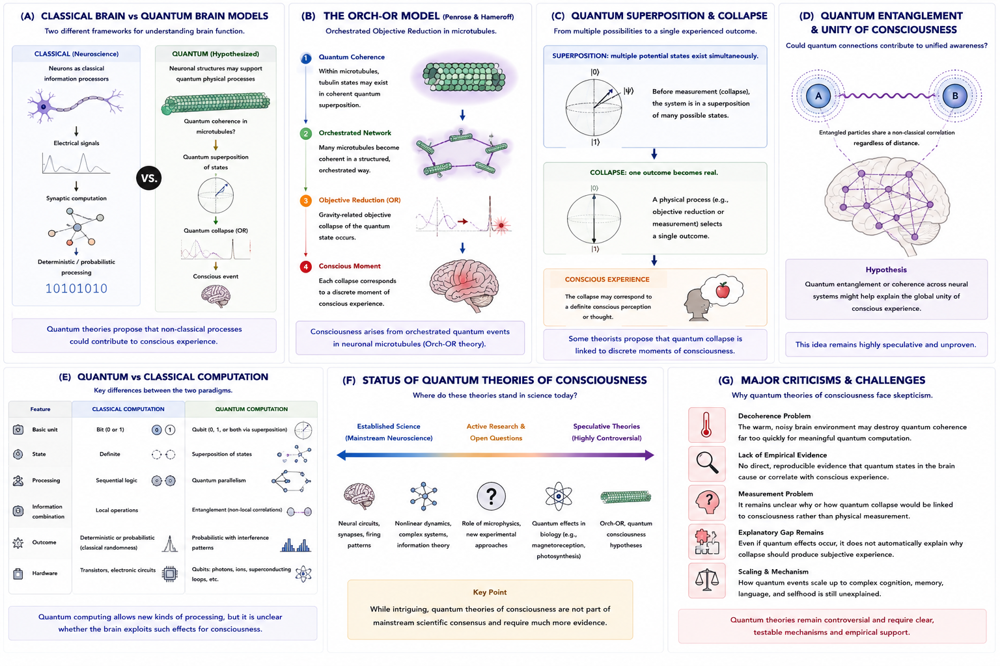
```

As Figure @ref(fig:fig-quantum) illustrates, quantum theories propose that non-classical physical processes may contribute to consciousness in ways not captured by standard neural computation. These theories do not necessarily reject neuroscience. Rather, they attempt to supplement classical neural explanations with deeper physical mechanisms.

The figure also highlights the central caution required when evaluating quantum theories. Even if quantum effects occur in the brain, this does not automatically show that they explain consciousness. The relationship between quantum processes and subjective experience remains speculative and contested.

## Why Quantum Theories Exist

Quantum theories of consciousness emerged partly from dissatisfaction with purely classical explanations of mind. Classical neuroscience explains cognition through neurons, synapses, electrochemical signaling, brain networks, information processing, and large-scale integration. These mechanisms are powerful and empirically grounded. However, some theorists argue that they may not fully explain subjective experience itself.

The hard problem of consciousness is one motivation. Even if classical neuroscience explains behaviour, attention, memory, and reportability, it may still leave open why physical processes are accompanied by experience [@chalmers1995; @chalmers1996]. Quantum theories attempt to explore whether deeper physical mechanisms might help address this gap.

Another motivation comes from debates about computation. Roger Penrose argued that human understanding may involve non-computable processes that cannot be fully captured by classical algorithms [@penrose1989; @penrose1994]. If this is correct, then consciousness might require physical processes beyond standard computation.

A third motivation concerns the unity of consciousness. Conscious experience appears unified even though the brain is composed of many distributed processes. Some quantum theorists have speculated that non-classical coherence or entanglement could contribute to this unity, although this remains highly controversial.

Quantum theories therefore exist because they attempt to connect consciousness with fundamental physics. Their appeal lies in their ambition. Their weakness lies in the difficulty of showing that quantum mechanisms are actually necessary for consciousness.

## Basic Quantum Concepts

Quantum consciousness theories draw on several concepts from quantum mechanics. These concepts are scientifically precise in physics, but they must be used carefully in consciousness research. Quantum terminology should not be used metaphorically or vaguely.

### Superposition

Superposition refers to the ability of a quantum system to exist in a combination of possible states before measurement or interaction produces a definite outcome. In simplified terms, a quantum system may not have one definite classical state until the relevant physical process resolves it.

Some theorists speculate that conscious experience may relate to this transition from multiple possibilities to a definite outcome. However, this remains speculative. Superposition is a real quantum phenomenon, but its connection to consciousness has not been established.

### Quantum Coherence

Quantum coherence refers to an ordered relationship among quantum states. Coherence allows quantum systems to display interference and other non-classical properties.

Some quantum theories of consciousness propose that coherent quantum states may occur temporarily in biological structures. Orch-OR, for example, proposes that microtubules inside neurons may support quantum coherence under certain conditions [@hameroff1996; @hameroff2014].

The challenge is that the brain is warm, wet, and noisy. Such environments tend to destroy delicate quantum coherence quickly. This is the basis of the decoherence criticism [@tegmark2000].

### Entanglement

Entanglement involves non-classical correlations between quantum systems. Entangled systems cannot be fully described independently, even when separated.

Some theorists have speculated that entanglement might help explain the unity of consciousness. However, evidence for large-scale consciousness-relevant entanglement in the brain remains limited. Most mainstream theories explain conscious unity through neural integration rather than quantum entanglement.

### Quantum State Reduction

Quantum state reduction, often called collapse, refers to the transition from a range of quantum possibilities to a definite outcome. Some interpretations of quantum mechanics treat collapse as measurement-related, while others propose objective physical collapse mechanisms.

Penrose’s objective reduction proposal is central to Orch-OR. It suggests that collapse may occur through an objective physical process related to spacetime geometry [@penrose1994].

## Historical Development

Quantum approaches to consciousness developed through interactions among physics, mathematics, philosophy of mind, neuroscience, and computation. Early debates about quantum mechanics raised questions about measurement, observation, and the role of the observer. Some thinkers wondered whether consciousness might be connected to quantum measurement.

David Bohm explored holistic and non-classical interpretations of physics that influenced later discussions of mind and reality [@bohm1980]. Henry Stapp developed quantum approaches that linked consciousness with quantum measurement and mind-brain interaction [@stapp1993; @stapp2007].

Roger Penrose became one of the most influential figures in modern quantum consciousness debates. He argued that human mathematical understanding may involve non-computable insight that cannot be fully explained by classical algorithms [@penrose1989; @penrose1994]. This claim motivated his search for physical processes beyond ordinary computation.

Stuart Hameroff then proposed that microtubules inside neurons might provide a biological site for relevant quantum processes. Together, Penrose and Hameroff developed the Orch-OR model, which remains the most widely discussed quantum theory of consciousness [@hameroff1996; @hameroff2014].

Although quantum theories remain outside mainstream consensus, they continue to attract interest because they connect consciousness with foundational questions in physics and computation.

## Penrose and Non-Computability

Penrose argued that consciousness may involve forms of understanding that exceed classical computation. His argument drew partly on Gödelian ideas about mathematical truth and formal systems. He suggested that human mathematicians can sometimes recognize truths that cannot be fully captured by formal algorithms [@penrose1989; @penrose1994].

From this perspective, the mind may not be equivalent to a classical digital computer. If consciousness involves non-computable processes, then standard artificial intelligence and classical computationalism may be incomplete.

This argument is controversial. Many philosophers and computer scientists reject the claim that Gödel’s theorem shows human cognition is non-computable. Others argue that even if some brain processes are non-computable, this does not automatically explain consciousness.

Nevertheless, Penrose’s non-computability argument remains historically important because it motivated one of the most influential quantum approaches to consciousness.

## The Orch-OR Theory

The Orchestrated Objective Reduction theory, or Orch-OR, is the best-known quantum theory of consciousness. It was developed by Roger Penrose and Stuart Hameroff [@hameroff1996; @hameroff2014].

According to Orch-OR, quantum processes occur inside neuronal microtubules. Microtubules are structural components within cells, including neurons. Hameroff proposed that microtubules may support organized quantum states. Penrose proposed that quantum state reduction may occur through objective physical processes related to spacetime structure.

The theory can be summarized as follows:

1. Quantum coherence occurs within microtubules.
2. These quantum states become organized or “orchestrated” by biological processes.
3. Objective reduction occurs when a threshold is reached.
4. Conscious moments correspond to these orchestrated reductions.

Orch-OR is ambitious because it attempts to connect consciousness with quantum gravity, cellular biology, and neural function. It also attempts to provide a mechanism for discrete conscious moments.

However, Orch-OR remains highly controversial. Critics question whether microtubules can sustain quantum coherence long enough, whether objective reduction occurs as proposed, and whether such events would explain subjective experience even if they occurred.

## The Decoherence Debate

The decoherence problem is one of the strongest criticisms of quantum theories of consciousness. Quantum coherence is fragile. In warm and noisy environments, quantum states usually decohere very quickly, losing the properties that make them distinctively quantum.

Max Tegmark argued that quantum coherence in the brain would decohere too rapidly to play a meaningful role in neural computation [@tegmark2000]. This criticism became highly influential because it challenged the biological plausibility of quantum brain models.

Supporters of Orch-OR responded that Tegmark’s estimates may not apply correctly to microtubule conditions and that biological structures might protect quantum coherence more effectively than assumed [@hagan2002]. They also point to evidence that some biological systems exploit quantum effects, such as photosynthesis and avian magnetoreception.

However, showing that quantum effects occur in biology is not the same as showing that quantum effects explain consciousness. The key issue is whether quantum coherence occurs in brain structures in a way that is functionally relevant to conscious experience.

The decoherence debate remains unresolved, but it illustrates the scientific challenge quantum theories face.

## Quantum Superposition and Conscious Experience

Some quantum consciousness theories speculate that conscious moments may be related to the transition from superposition to definite outcome. In simplified terms:

```text
superposition → reduction/collapse → definite experience
```

This idea is attractive because conscious experience appears definite. At any given moment, one experiences a particular world, not a set of unresolved possibilities. Quantum collapse seems, at least superficially, to involve a transition from possibility to actuality.

However, this connection remains speculative. The fact that quantum systems undergo state reduction does not explain why reduction should feel like anything. Nor does it explain why particular reductions would produce particular experiences, such as seeing red, feeling pain, or hearing music.

This is a version of the hard problem. Quantum collapse may be physically mysterious, but mystery in physics does not automatically solve mystery in consciousness.

## Quantum Entanglement and the Unity of Consciousness

The unity of consciousness is another motivation for quantum theories. Conscious experience appears integrated. Visual perception, sound, bodily feeling, memory, and thought are usually experienced as parts of one field of awareness.

Some theorists speculate that quantum entanglement or coherence could contribute to this unity. Entanglement involves non-classical correlations between parts of a system, and this has led some to wonder whether quantum processes might help bind distributed neural activity.

However, mainstream neuroscience usually explains unity through large-scale neural integration, recurrent processing, global availability, synchronized activity, and embodied self-modeling rather than quantum entanglement [@koch2016; @seth2021].

The quantum unity proposal therefore remains speculative. It is not enough to say that both entanglement and consciousness involve unity. A theory must show how specific quantum mechanisms produce the specific unity of subjective experience.

## Quantum and Classical Computation

Quantum theories of consciousness often contrast classical computation with quantum computation. Classical computation uses bits, rule-governed operations, and classical information processing. Quantum computation uses qubits, superposition, interference, and entanglement.

Some theorists argue that quantum computation may provide capacities unavailable to classical computation. If the brain used quantum computation, then consciousness might depend on mechanisms not captured by classical digital models.

However, two questions must be separated. First, does the brain perform quantum computation in any consciousness-relevant way? Second, even if it does, would quantum computation explain subjective experience?

Current evidence does not show that quantum computation is necessary for consciousness. Classical neural models remain highly successful in explaining perception, attention, memory, decision-making, and behaviour. Quantum theories must therefore show both biological plausibility and explanatory necessity.

## Quantum Theories and Artificial Intelligence

Quantum theories have important implications for artificial intelligence. If consciousness depends on quantum coherence, microtubule dynamics, objective reduction, or other non-classical biological processes, then current classical AI systems may lack essential ingredients for consciousness.

This challenges strong computationalist views. A classical AI system might simulate intelligent behaviour, solve problems, generate language, and model itself without possessing the physical processes required for subjective experience.

However, quantum theories do not automatically rule out artificial consciousness. A future artificial system might incorporate quantum processes or non-classical physical architectures. The question is whether those processes would be organized in a way relevant to conscious experience.

At present, there is no consensus that quantum mechanisms are necessary for consciousness, and no consensus that current AI systems are conscious [@butlin2023]. Quantum approaches therefore contribute to AI consciousness debates mainly by challenging the assumption that classical computation is obviously sufficient.

## Quantum Theories and T-Consciousness

Quantum theories should be distinguished from consciousness-first frameworks such as Taheri’s T-Consciousness. Quantum theories attempt to explain consciousness through physical processes described by quantum mechanics. They remain physical theories, even when speculative.

T-Consciousness, by contrast, is better understood as a consciousness-first framework. It treats consciousness as non-material and foundational, rather than as a product of neural or quantum mechanisms [@taheri2020; @taheri2023].

This distinction is important. Because quantum theories use ideas such as fields, coherence, or non-classical physics, they can sometimes be confused with broader consciousness-first frameworks. However, quantum consciousness theories and T-Consciousness are not the same. Quantum theories ask whether physical quantum processes contribute to consciousness. T-Consciousness asks whether consciousness itself is a foundational reality through which matter, life, and organization are understood.

For this reason, T-Consciousness may be mentioned briefly in this chapter as a related alternative framework, but its main discussion belongs in the broader chapter on consciousness-first theories.

## Scientific Status of Quantum Theories

Quantum theories of consciousness remain speculative. They are not part of mainstream consensus neuroscience. Most current research on consciousness focuses on neural correlates, recurrent processing, global workspace dynamics, predictive processing, integrated information, attention, and brain network organization.

Some quantum effects are well established in biology. Examples often discussed include photosynthesis, enzyme activity, and avian magnetoreception. These show that biological systems can sometimes exploit quantum phenomena.

However, evidence directly linking quantum states to conscious experience remains weak. It has not been demonstrated that quantum coherence in microtubules, quantum collapse, or entanglement plays a necessary role in consciousness.

This does not mean quantum theories are impossible. It means that their current scientific status is uncertain. They remain speculative proposals requiring stronger empirical support and clearer testable predictions.

## Strengths of Quantum Theories

Quantum theories have several strengths. First, they engage with fundamental physics. They ask whether consciousness may require explanations deeper than classical neural computation.

Second, they directly challenge simplistic computational reductionism. They remind researchers that intelligence, computation, and consciousness may not be identical.

Third, they attempt to address the hard problem and the unity of consciousness rather than focusing only on behaviour or reportability.

Fourth, they stimulate interdisciplinary dialogue among neuroscience, physics, philosophy, mathematics, and cognitive science.

Fifth, they encourage careful thinking about the physical basis of mind. Even if quantum theories turn out to be incorrect, they force consciousness research to clarify what kinds of physical explanation are required.

## Weaknesses and Criticisms

Quantum theories also face major criticisms. The most important is the decoherence problem. Critics argue that the brain’s warm, wet, and noisy environment may destroy quantum coherence too quickly for it to play a meaningful role in consciousness [@tegmark2000].

A second criticism is lack of direct empirical evidence. No experiment has yet shown that quantum brain states cause conscious experience.

A third criticism is explanatory insufficiency. Even if quantum processes occur in the brain, it remains unclear why they should produce subjective feeling. Quantum physics may be strange, but strangeness does not explain phenomenology.

A fourth criticism is the scaling problem. Quantum events at microscopic levels must somehow scale up to cognition, memory, selfhood, language, and unified awareness. This connection remains unclear.

A fifth criticism is the risk of quantum mysticism. Quantum concepts are sometimes used loosely to make consciousness seem mysterious or profound without providing rigorous mechanisms. Scientific quantum theories must avoid vague metaphor and remain physically precise.

## Relation to the Hard Problem

Quantum theories are often motivated by the hard problem of consciousness. Classical neuroscience may explain behaviour, cognition, attention, and reportability, but critics argue that it does not fully explain why subjective experience exists.

Quantum theories attempt to introduce deeper physical mechanisms that might be more closely connected to consciousness itself. Orch-OR, for example, proposes that conscious moments correspond to objective reductions in quantum states [@hameroff2014].

However, the hard problem remains. Why should objective reduction feel like anything? Why should quantum coherence produce experience? Why should quantum indeterminacy generate subjectivity?

Quantum theories may deepen the physical story, but they do not automatically bridge the explanatory gap. They must still explain the relationship between physical process and phenomenal experience.

## Relation to Other Theories

Quantum theories differ from most other theories discussed in this book.

### Relation to Computationalism

Computationalism explains mind in terms of information processing and functional organization. Quantum theories challenge the idea that classical computation is sufficient for consciousness. Penrose’s view is especially critical of classical computationalism [@penrose1989; @turing1950].

### Relation to Biological Naturalism

Quantum theories may overlap with biological naturalism if they argue that consciousness depends on specific biological structures such as microtubules. However, unlike standard biological naturalism, they appeal to non-classical physical processes.

### Relation to Global Workspace Theory

Global Workspace Theory explains consciousness through global broadcasting and cognitive access. Quantum theories do not focus primarily on access or reportability. They ask whether deeper physical processes underlie conscious moments.

### Relation to Integrated Information Theory

Integrated Information Theory explains consciousness through intrinsic integrated causal structure. Quantum theories may share an interest in fundamental physical structure, but IIT does not require quantum mechanisms [@tononi2004; @oizumi2014].

### Relation to Panpsychism

Some interpretations of quantum consciousness are sometimes associated with panpsychist or consciousness-fundamental views. However, they should be kept distinct. Panpsychism treats experience as fundamental. Quantum theories usually attempt to identify physical mechanisms that contribute to consciousness.

### Relation to T-Consciousness

T-Consciousness is not a quantum theory in the standard scientific sense. It is better treated as a consciousness-first framework. It should be compared with panpsychism, cosmopsychism, and other consciousness-first views more than with Orch-OR or quantum computation.

## Open Questions

Several questions remain unresolved. Do meaningful quantum states occur in brain structures relevant to consciousness? Can microtubules sustain quantum coherence long enough to matter? Is objective reduction a real physical process? Would quantum collapse explain subjective feeling? Are quantum mechanisms necessary for consciousness or merely incidental biological details? Could artificial systems become conscious without quantum processes? Can quantum theories generate clear experimental predictions?

These questions show why quantum theories remain both intriguing and controversial. They are bold, but they require stronger empirical and theoretical support.

## Evaluation

Quantum theories of consciousness are among the most speculative approaches in consciousness research. Their greatest strength is that they connect consciousness with fundamental physics and challenge the assumption that classical computation is obviously sufficient for mind.

Their greatest weakness is lack of empirical support. No direct evidence currently shows that quantum processes in the brain produce consciousness. The decoherence problem, scaling problem, and explanatory gap remain serious obstacles.

Quantum theories are therefore best understood as exploratory and controversial frameworks. They may eventually contribute to consciousness science if they generate testable predictions and empirical support. At present, however, mainstream neuroscience does not require quantum explanations of consciousness.

The philosophical value of quantum theories lies in how they challenge simple assumptions about computation, physical explanation, and the nature of conscious experience. Their scientific value depends on whether future evidence can show that quantum mechanisms are necessary or relevant to consciousness.

## Chapter Summary

Quantum theories of consciousness propose that non-classical physical processes may contribute to conscious experience beyond standard neural computation. These approaches explore possible roles for superposition, coherence, entanglement, collapse, and quantum computation.

The most influential proposal is Orch-OR, developed by Roger Penrose and Stuart Hameroff. Orch-OR suggests that orchestrated quantum state reductions within neuronal microtubules may contribute to conscious moments.

Quantum theories are motivated by concerns about the hard problem, unity of consciousness, non-computability, and the limits of classical computation. They challenge the idea that intelligence or information processing alone is sufficient for subjective experience.

However, quantum theories remain controversial. Major challenges include decoherence, lack of direct empirical evidence, unclear neural implementation, the scaling problem, and the continuing difficulty of explaining why quantum processes should feel like anything.

Quantum theories should also be distinguished from T-Consciousness. Quantum theories appeal to physical quantum mechanisms. T-Consciousness treats consciousness as a non-material foundational reality and should be discussed mainly with consciousness-first frameworks.

The central unresolved question is whether quantum processes are necessary for consciousness, or whether consciousness can be fully explained through classical neural, computational, and embodied mechanisms.

<!--chapter:end:18-quantum-theories.Rmd-->

# Illusionism {#illusionism}

## Chapter Overview

Illusionism is the view that phenomenal consciousness, as traditionally conceived, may be a cognitive illusion rather than a fundamental feature of reality. Illusionists do not deny that human beings perceive, think, feel pain, report experiences, have emotions, or maintain self-models. Instead, they challenge the idea that consciousness contains irreducible, private, ineffable phenomenal properties often called qualia [@dennett1991; @frankish2016].

According to illusionism, consciousness seems mysterious because the brain represents its own internal processes in a simplified and misleading way. The apparent “inner glow” of subjective experience may arise from introspection, self-modeling, and cognitive representation rather than from non-physical or irreducible phenomenal properties.

Illusionism is one of the most radical responses to the hard problem of consciousness. Most theories attempt to explain why physical processes produce subjective experience. Illusionism instead questions whether phenomenal consciousness, in the traditional philosophical sense, exists at all. It shifts the question from “Why do qualia exist?” to “Why do we believe that qualia exist?” [@chalmers2018].

This makes illusionism controversial. Supporters argue that it provides a naturalistic way to dissolve the hard problem. Critics argue that illusionism denies the most obvious fact about consciousness: that experience is actually felt.

This chapter examines illusionism as a radical and influential response to the hard problem. It explores its historical background, central claims, interpretation of qualia, theory of introspection, relationship to the meta-problem of consciousness, strengths, criticisms, empirical relevance, and implications for artificial intelligence.

## Learning Objectives

After reading this chapter, the reader should be able to:

* Define the central claims of illusionism.
* Explain what illusionism does and does not deny.
* Distinguish access consciousness from phenomenal consciousness.
* Explain the illusionist interpretation of qualia.
* Describe introspection as self-modeling.
* Explain the meta-problem of consciousness.
* Compare illusionism with physicalism, functionalism, Attention Schema Theory, panpsychism, and T-Consciousness.
* Evaluate major criticisms of illusionism.
* Discuss illusionism’s implications for artificial intelligence and machine consciousness.

## Core Idea in One Picture

Figure @ref(fig:fig-illusionism) summarizes the major conceptual structure of illusionism.

```{r fig-illusionism, echo=FALSE, fig.cap="Illusionism and introspective self-modeling. Panel A contrasts subjective appearance with illusionist interpretation. Panel B reinterprets the hard problem. Panel C illustrates introspection as self-modeling. Panel D compares illusionism with competing theories. Panel E presents the user-interface analogy. Panel F distinguishes what illusionism affirms from what it denies.", out.width="100%", fig.align="center"}
knitr::include_graphics("figures/19_illusionism.png")
```

As Figure @ref(fig:fig-illusionism) illustrates, illusionism proposes that the apparent mystery of consciousness may arise from how cognitive systems represent themselves. The brain does not simply reveal its own internal processes transparently. It constructs simplified models of those processes, and those models may generate the impression of ineffable inner qualities.

This does not mean that perception, pain, emotion, or self-report are unreal. It means that illusionists reinterpret what these phenomena are. Consciousness is not denied as cognitive functioning or self-representation. What is denied is the existence of irreducible phenomenal properties as traditionally imagined.

## The Hard Problem and the Illusionist Response

Illusionism emerged partly in response to the hard problem of consciousness. The hard problem asks why physical brain processes produce subjective experience at all [@chalmers1995; @chalmers1996].

Many theories attempt to answer this by identifying neural correlates, information-processing architectures, integrated causal structures, or predictive models. However, critics argue that these approaches may explain behaviour and cognition without explaining why experience feels like anything.

Illusionism responds differently. It suggests that the hard problem may arise from a mistaken conception of experience. The traditional view assumes that the brain produces special intrinsic properties called qualia, and then asks why physical processes generate those properties. Illusionism questions the assumption.

The contrast can be summarized as:

```text
traditional view:
brain activity → unexplained qualia

illusionist view:
brain activity → introspective self-model → illusion of qualia
```

According to illusionists, the hard problem may be generated by the way the brain represents its own activity. If introspection misrepresents cognitive processes as having ineffable phenomenal properties, then the apparent mystery may be a product of self-modeling rather than a feature of reality itself [@frankish2016; @chalmers2018].

## What Illusionism Does Not Deny

A major misunderstanding is that illusionism denies consciousness entirely. This is not accurate.

Illusionism does not deny perception, cognition, pain behaviour, emotion, attention, self-awareness, memory, reportability, or internal representation. Illusionists agree that humans have complex mental lives and that reports of experience are real data that require explanation.

What illusionism denies is a particular philosophical interpretation of consciousness. It rejects the idea that experience contains irreducible, private, non-physical, ineffable properties that cannot be explained by cognitive science.

This distinction is essential. Illusionists do not say that pain does not matter or that people do not react to injury. They say that the painfulness of pain should be explained in terms of biological, cognitive, affective, and representational processes rather than in terms of mysterious intrinsic qualia.

Thus, illusionism is not the claim that “nothing is happening.” It is the claim that what is happening has been misdescribed by traditional introspection and philosophy.

## Qualia and Phenomenal Properties

Traditional theories often describe consciousness using the concept of qualia. Qualia are usually defined as the intrinsic, private, ineffable, subjective qualities of experience. Examples include the redness of red, the painfulness of pain, the taste of coffee, or the feeling of sadness.

Illusionists argue that belief in qualia may itself be generated by cognitive processes. The brain represents its own perceptual and affective states in a simplified way. Because these representations do not reveal their underlying mechanisms, they appear to have simple, intrinsic, non-physical qualities.

This does not mean that colour perception or pain perception are unreal. It means that their apparent intrinsic phenomenal nature may be a representational illusion.

For example, seeing red involves complex visual processing, categorization, memory, attention, and behavioural readiness. Introspection does not reveal these mechanisms. Instead, it presents the experience as a simple quality: redness. Illusionism argues that this simplicity may be a feature of the self-model, not evidence for irreducible qualia.

## Historical Development

Illusionist themes have historical connections with behaviourism, eliminative materialism, functionalism, and skeptical approaches to introspection. Behaviourism avoided inner experience as a scientific object. Eliminative materialism questioned whether common-sense mental categories accurately describe the brain [@churchland1981; @churchland1986]. Functionalism emphasized the causal roles of mental states rather than their intrinsic nature.

Modern illusionism is most strongly associated with Daniel Dennett and Keith Frankish. Dennett challenged traditional assumptions about qualia and argued that consciousness should be explained through cognitive architecture, reportability, behaviour, and information processing rather than through ineffable inner properties [@dennett1991; @dennett2005].

Frankish later developed illusionism explicitly as the view that phenomenal consciousness, in the traditional sense, is an introspective illusion [@frankish2016; @frankish2017]. On this view, the task of consciousness science is not to explain irreducible qualia, but to explain why we represent ourselves as having them.

Illusionism therefore belongs to the naturalistic tradition in consciousness studies. It attempts to explain consciousness without introducing non-physical properties, fundamental experience, or consciousness-first metaphysics.

## Dennett and Heterophenomenology

Dennett proposed a method called heterophenomenology [@dennett1991]. This method treats subjective reports as important data, but not as infallible windows into inner reality.

According to heterophenomenology, researchers should collect and interpret people’s reports about experience, but should not automatically assume that those reports reveal irreducible qualia. A person’s report that an experience seems ineffable is itself a psychological fact requiring explanation.

This approach allows consciousness to be studied scientifically. Reports, behaviours, neural activity, cognitive processes, and introspective claims can all be investigated. However, the researcher remains neutral about whether the reported inner qualities exist as traditionally conceived.

Dennett’s approach became foundational for illusionism because it shifted the focus from explaining qualia directly to explaining why people report and believe in qualia.

## Introspection and Self-Modeling

A central claim of illusionism is that introspection does not provide direct access to consciousness as it truly is. Instead, introspection provides access to internal self-models generated by cognitive systems.

The brain continuously monitors its own states. It tracks perception, attention, memory, bodily condition, emotion, and action. However, this monitoring is simplified. It does not reveal detailed neural mechanisms. It presents internal processes in a compressed and user-friendly form.

Illusionists argue that this compression may generate the appearance of phenomenal properties. The brain models itself as having private inner qualities, and this model becomes the basis for reports such as “I am experiencing redness” or “I feel pain.”

This perspective overlaps with several other theories. Higher-Order Thought Theory emphasizes awareness of mental states [@rosenthal2005; @lau2011]. Attention Schema Theory explains awareness as the brain’s model of attention [@graziano2013; @graziano2016]. Predictive Processing explains perception and selfhood through internal models and prediction [@friston2010; @clark2013]. Illusionism can draw on all of these ideas while making the stronger claim that phenomenal properties themselves are illusory.

## The Meta-Problem of Consciousness

Modern illusionism often focuses on the meta-problem of consciousness. The meta-problem asks why humans believe consciousness is mysterious and why they make reports about phenomenal experience [@chalmers2018].

Instead of asking, “Why do qualia exist?” the meta-problem asks:

```text
Why do people believe they have qualia?
```

Illusionists argue that solving the meta-problem may dissolve much of the hard problem. If we can explain why cognitive systems represent themselves as having ineffable inner properties, then we may no longer need to posit such properties.

This makes illusionism a strategy of explanation by reinterpretation. It does not try to locate qualia in the brain. It tries to explain why the brain represents itself as having qualia.

Critics argue that the meta-problem cannot replace the hard problem. Even if we explain why people believe in experience, there remains the question of experience itself. Illusionists reply that this objection may simply repeat the introspective illusion.

## The User-Interface Analogy

One useful analogy for illusionism is the user interface. A computer desktop shows icons, folders, windows, and buttons. These are useful representations, but they do not reveal the underlying machine code, circuits, or physical processes.

Similarly, introspection may provide a simplified interface to internal cognitive processes. It presents mental life in terms of feelings, perceptions, thoughts, and qualities. These representations are useful for control, communication, and self-understanding, but they may not reveal the underlying mechanisms accurately.

The key point is:

```text
subjective appearance ≠ underlying mechanism
```

The interface is real as an interface. It has functional value. But it should not be mistaken for the underlying reality.

Illusionism uses this analogy to explain why consciousness seems simple, immediate, and mysterious. The brain’s self-interface hides the complexity of its own processing.

## Access Consciousness and Phenomenal Consciousness

Illusionism depends heavily on the distinction between access consciousness and phenomenal consciousness [@block1995].

Access consciousness refers to information being available for reasoning, verbal report, decision-making, memory, and behavioural control. Illusionists generally accept access consciousness as real and scientifically tractable.

Phenomenal consciousness, in the traditional sense, refers to intrinsic subjective qualities: what experiences are like in themselves, independent of function or access. Illusionists reject or reinterpret this concept.

This distinction allows illusionism to avoid denying ordinary mental life. It accepts that people access information, report experiences, regulate behaviour, and maintain self-models. What it denies is that these processes require irreducible qualia.

The debate therefore centers on whether phenomenal consciousness is something over and above access, representation, and self-modeling. Illusionists say no. Critics say yes.

## Illusionism and Artificial Intelligence

Illusionism has important implications for artificial intelligence. If consciousness depends primarily on self-modeling, introspective representation, cognitive access, and information-processing architecture, then advanced artificial systems might potentially generate similar self-models.

From an illusionist perspective, machine consciousness would not require non-physical qualia or fundamental phenomenal properties. It would require the right kind of cognitive architecture: systems that monitor their own internal states, represent themselves as aware, and use those representations for control and report.

This may make illusionism more open to artificial consciousness than some biological, quantum, or consciousness-first theories. However, it also raises a difficult question. If an AI system claimed to have experiences because it had a self-model, would that count as consciousness, or merely as the illusion of consciousness?

For illusionists, that question may be partly mistaken. If phenomenal consciousness is itself an introspective illusion, then generating the relevant self-model may be close to generating consciousness in the only scientifically meaningful sense [@butlin2023].

Critics disagree. They argue that an AI could model itself as conscious without genuinely experiencing anything.

## Relation to Other Theories

Illusionism overlaps with several theories discussed elsewhere in this book, but it remains distinct.

### Relation to Physicalism

Illusionism is usually compatible with physicalism. It explains consciousness through physical, biological, and cognitive mechanisms rather than non-physical properties.

### Relation to Functionalism

Illusionism often overlaps with functionalism because it explains mental states by their causal and cognitive roles. However, illusionism makes a stronger claim: phenomenal properties, as traditionally conceived, are not part of the real ontology.

### Relation to Higher-Order Thought Theory

Higher-Order Thought Theory explains consciousness through awareness of mental states [@rosenthal2005; @lau2011]. Illusionism can use higher-order mechanisms to explain why we represent ourselves as having phenomenal properties.

### Relation to Attention Schema Theory

Attention Schema Theory is especially close to illusionism. AST argues that awareness is the brain’s simplified model of attention [@graziano2013]. Illusionism can interpret this model as one mechanism generating the illusion of phenomenal consciousness.

### Relation to Predictive Processing

Predictive Processing explains perception and selfhood through generative models and prediction-error minimization [@friston2010; @clark2013]. Illusionism can interpret introspective phenomenology as part of a predictive self-model.

### Relation to Panpsychism

Illusionism sharply contrasts with panpsychism. Panpsychism treats consciousness or proto-consciousness as fundamental [@goff2017; @goff2019]. Illusionism treats phenomenal consciousness as representationally constructed and possibly illusory.

### Relation to T-Consciousness

Illusionism also contrasts strongly with Taheri’s T-Consciousness. T-Consciousness treats consciousness as foundational, non-material, and prior to ordinary material organization [@taheri2020; @taheri2023]. Illusionism takes the opposite direction. It treats the apparent fundamentality of consciousness as something to be explained by cognitive self-modeling. This contrast is useful because it shows two radically different responses to the hard problem: one treats consciousness as fundamental, while the other treats the belief in irreducible phenomenal consciousness as an illusion.

## Empirical Relevance

Illusionism is a philosophical theory, but it has empirical relevance. Evidence relevant to illusionism may come from metacognition, introspective error, cognitive bias, split-brain research, attention studies, confidence judgments, self-modeling, and cognitive neuroscience.

Split-brain and confabulation studies suggest that people can generate explanations for their own behaviour without direct access to the true causes of that behaviour [@gazzaniga2011]. Neurological cases show that self-awareness can be distorted. Phantom limb phenomena and body ownership illusions show that the brain’s model of the body can diverge from physical reality [@ramachandran1998].

These cases support the broader illusionist claim that introspection is not infallible. The mind can misrepresent itself. If self-modeling can be mistaken in these domains, illusionists argue, it may also misrepresent the nature of consciousness itself.

Critics respond that introspective error does not prove that phenomenal consciousness is illusory. It may show that we are sometimes wrong about experience, not that experience itself does not exist.

## Strengths of Illusionism

Illusionism has several major strengths. First, it provides a strongly naturalistic framework. It avoids non-physical substances, irreducible qualia, and metaphysical dualism.

Second, it connects naturally with cognitive science, neuroscience, self-modeling, metacognition, and attention research.

Third, it directly addresses the meta-problem of consciousness. It explains why consciousness seems mysterious and why people believe in qualia.

Fourth, it is compatible with artificial intelligence research because it treats consciousness in terms of cognitive architecture rather than biological essence or fundamental experience.

Fifth, illusionism forces consciousness research to take introspective error seriously. It challenges the assumption that experience is exactly as introspection presents it.

## Weaknesses and Criticisms

Illusionism faces several serious criticisms. The most famous is that illusion seems to require experience. Critics ask: how can there be an illusion of consciousness unless something is experienced? If an illusion appears, does that not already involve phenomenology?

A second criticism is that phenomenal consciousness seems more certain than any theory denying it. Many philosophers argue that subjective experience is the one thing we cannot coherently doubt.

A third criticism is explanatory substitution. Critics argue that illusionism explains beliefs, reports, and self-models, but not experience itself. It may explain why people talk about qualia without explaining why anything is felt.

A fourth criticism concerns introspective skepticism. Illusionists rely heavily on the claim that introspection misleads us. Critics question whether introspection can be so radically wrong about the existence of experience.

A fifth criticism is that illusionism may not truly dissolve the hard problem. It may simply replace “Why do qualia exist?” with “Why does the illusion of qualia feel real?”

These criticisms explain why illusionism remains one of the most controversial theories in contemporary philosophy of mind.

## Relation to the Hard Problem

Illusionism attempts to dissolve rather than solve the hard problem. It argues that the hard problem depends on a mistaken assumption: that there are irreducible phenomenal properties requiring explanation.

Instead of asking:

```text
Why do qualia exist?
```

illusionism asks:

```text
Why do humans believe in qualia?
```

This shift is the defining move of the theory. If the belief in qualia can be explained through introspection, self-modeling, and cognitive architecture, then the hard problem may lose much of its force.

Critics argue that this move fails because it explains only the belief in consciousness, not consciousness itself. Illusionists respond that the demand for something more may itself be part of the illusion.

This disagreement remains central and unresolved.

## Explanatory Scope

Illusionism attempts to explain introspective beliefs, self-modeling, access consciousness, reportability, metacognition, cognitive awareness, and the apparent mystery of consciousness. It is especially strong in explaining why consciousness seems special from the inside.

However, unresolved questions remain. Does illusionism eliminate phenomenology or explain it? Can an introspective illusion exist without experience? Are qualia fully reducible to cognitive representation? Could artificial systems generate similar introspective self-models? Is phenomenal consciousness genuinely illusory, or is illusionism denying what it set out to explain?

These questions show why illusionism remains influential but deeply contested.

## Evaluation

Illusionism is one of the most radical and challenging theories of consciousness. It argues that phenomenal consciousness, as traditionally conceived, may be an introspective illusion generated by cognitive self-modeling.

Its greatest strength is its naturalism. It offers a way to explain why consciousness seems mysterious without introducing non-physical properties or fundamental experience. It also connects well with cognitive science, self-modeling theories, metacognition, artificial intelligence, and the meta-problem of consciousness.

Its greatest weakness is that it appears to deny what many regard as undeniable: the reality of subjective experience. Critics argue that illusionism explains reports about consciousness while leaving experience itself untouched.

Illusionism is therefore best understood as a powerful theory of introspective representation and the meta-problem of consciousness. Whether it successfully explains or dissolves phenomenal consciousness remains unresolved.

## Chapter Summary

Illusionism argues that phenomenal consciousness, as traditionally conceived, may be a cognitive illusion. It does not deny perception, pain, emotion, cognition, or reportability. It denies that these require irreducible, ineffable qualia.

The theory proposes that the brain constructs simplified self-models of its own internal processes. These models make experience appear to possess private intrinsic phenomenal properties.

Illusionism is closely associated with Daniel Dennett and Keith Frankish. Dennett challenged traditional qualia-based views of consciousness, while Frankish developed illusionism as an explicit response to the hard problem.

The theory shifts attention from the hard problem to the meta-problem: why do humans believe consciousness is mysterious? Illusionists argue that explaining this belief may dissolve much of the traditional mystery.

Illusionism overlaps with Higher-Order Thought Theory, Attention Schema Theory, Predictive Processing, functionalism, and physicalism. It sharply contrasts with panpsychism and T-Consciousness, which treat consciousness as fundamental.

The major strengths of illusionism are its naturalism, compatibility with cognitive science, and focus on introspective self-modeling. Its major weaknesses are the objection that illusion requires experience, the denial of direct phenomenology, and the risk of explaining reports rather than experience itself.

The central unresolved question is whether phenomenal consciousness is truly an illusion, or whether illusionism explains only our beliefs about consciousness while leaving subjective experience unexplained.

<!--chapter:end:19-illusionism.Rmd-->

# Embodied and Enactive Consciousness {#embodied-enactive}

## Chapter Overview

Embodied and enactive theories argue that consciousness does not arise from the brain alone, but from dynamic interaction between brain, body, and environment. These approaches challenge the idea that consciousness can be fully explained as internal information processing isolated inside the head. Instead, they emphasize bodily engagement, sensorimotor activity, environmental interaction, lived experience, and active participation in the world [@varela1991; @thompson2007; @clark2016].

According to embodied and enactive approaches, conscious experience is not merely something the brain constructs while passively receiving sensory input. Consciousness emerges through an organism’s active relation to its world. Perception depends on movement, action, bodily regulation, and environmental engagement. The body is not just a container for the brain. It is part of the system through which experience becomes possible.

These theories developed partly as a critique of overly abstract computational models of mind. Traditional cognitive science often treated cognition as a sequence of input, internal processing, and output. Embodied and enactive theories argue that this model neglects the way organisms act, move, feel, regulate themselves, and inhabit meaningful environments [@dreyfus1972; @dreyfus1992].

Embodied approaches emphasize the role of bodily structure, physiology, movement, interoception, emotion, and sensorimotor capacities. Enactive approaches go further by arguing that perception and cognition are enacted through active organism-environment coupling. Consciousness is not simply in the brain or in the world, but in the dynamic relation between organism and world [@maturana1980; @noe2004; @diPaolo2017].

This chapter examines the historical development, conceptual foundations, phenomenological assumptions, sensorimotor mechanisms, empirical relevance, strengths, criticisms, and unresolved questions associated with embodied and enactive approaches to consciousness.

## Learning Objectives

After reading this chapter, the reader should be able to:

* Define the central claims of embodied and enactive consciousness.
* Distinguish embodied cognition from enactivism.
* Explain the role of sensorimotor engagement in perception.
* Describe organism-environment coupling.
* Explain the role of bodily awareness, emotion, and interoception.
* Analyze implications for artificial intelligence and selfhood.
* Compare embodied approaches with computational and predictive theories.
* Evaluate the strengths and criticisms of embodied and enactive theories.
* Explain how embodied theories differ from consciousness-first frameworks such as T-Consciousness.

## Core Idea in One Picture

Figure @ref(fig:fig-embodied) summarizes the major conceptual structure of embodied and enactive consciousness.

```{r fig-embodied, echo=FALSE, fig.cap="Embodied and enactive consciousness. Panel 1 contrasts brain-centered and embodied models of consciousness. Panel 2 illustrates the sensorimotor loop. Panel 3 shows organism-environment coupling. Panel 4 explores bodily influences on experience. Panel 5 compares computational and embodied cognition. Panel 6 presents extended mind and cognitive scaffolding. Panel 7 illustrates embodied selfhood.", out.width="100%", fig.align="center"}
knitr::include_graphics("figures/20_embodied.png")
```

As Figure @ref(fig:fig-embodied) illustrates, embodied and enactive theories propose that consciousness emerges through active engagement between organisms and their environments. The conscious subject is not a detached observer receiving information from the outside world. The subject is a living body acting within a meaningful environment.

This framework shifts the study of consciousness away from isolated neural mechanisms alone and toward a broader system involving brain, body, action, and world.

## Why Embodied and Enactive Theories Became Influential

Embodied and enactive theories became influential because many researchers found traditional computational models too narrow. Classical cognitive science often described the mind as if it were a disembodied computer: sensory input enters the system, internal representations are processed, and behavioural output is produced.

This model was useful for explaining some aspects of cognition, but it seemed incomplete. It did not fully capture bodily feeling, skilled action, emotion, practical engagement, social interaction, environmental context, or lived experience. Human beings do not encounter the world as detached information processors. They encounter it as embodied agents with needs, capacities, habits, emotions, and histories.

Embodied theories therefore argued that cognition is shaped by the body. The structure of the body, the possibilities for movement, sensory capacities, posture, and physiological regulation all influence perception and consciousness.

Enactive theories added that cognition is not merely shaped by the body but enacted through activity. Organisms make sense of the world by acting within it. Perception is not passive reception. It is active exploration [@varela1991; @noe2004].

This made embodied and enactive theories especially important for consciousness studies because conscious experience is always lived from a bodily perspective.

## Historical Development

Embodied and enactive approaches developed from several intellectual traditions, including phenomenology, ecological psychology, cybernetics, biology, dynamical systems theory, robotics, and cognitive science.

Phenomenology was especially important. Maurice Merleau-Ponty argued that perception is fundamentally embodied and that the body is not merely an object in the world, but the lived basis through which the world is experienced [@merleauPonty1945]. This challenged views that treated consciousness as detached inner observation.

Ecological psychology also influenced embodied theories. James Gibson argued that perception is directly related to action possibilities, or affordances, in the environment [@gibson1979]. A chair is not merely a set of visual features. It is something that affords sitting. A path affords walking. A handle affords grasping.

Enactivism developed through the work of Humberto Maturana, Francisco Varela, Evan Thompson, Eleanor Rosch, and later theorists. Varela, Thompson, and Rosch argued that mind emerges through embodied action and that cognition should be understood as enacted through organism-environment coupling [@maturana1980; @varela1991; @thompson2007].

These approaches also emerged as critiques of symbolic artificial intelligence and disembodied computationalism. Hubert Dreyfus argued that human intelligence depends on embodied skill, practical familiarity, and situated know-how that cannot be fully captured by abstract symbol manipulation [@dreyfus1972; @dreyfus1992].

## Embodied and Enactive Approaches

Although embodied and enactive theories are often discussed together, they are not identical.

Embodied cognition emphasizes the role of the body in shaping mind and consciousness. Bodily structure, movement, posture, perception, action, interoception, and physiology all influence cognition. The body constrains what can be perceived, what can be done, and how the world appears.

Enactivism goes further. It argues that cognition and consciousness arise through active engagement with the world. Perception is not something that happens to an organism. It is something the organism does. Seeing, touching, hearing, and moving are part of an active process of sense-making.

The difference can be summarized this way:

```text
embodied cognition:
the body shapes consciousness

enactivism:
consciousness is enacted through organism-world interaction
```

Both approaches reject the idea that consciousness can be fully understood by studying the brain in isolation. The brain is essential, but it functions as part of a living embodied system.

## Phenomenology and the Lived Body

Embodied theories are strongly influenced by phenomenology. Phenomenology emphasizes first-person experience, lived embodiment, intentionality, situated perception, and the way the world appears to a subject.

Merleau-Ponty’s idea of the lived body is central [@merleauPonty1945]. We do not merely own bodies as external objects. We experience the world through the body. The body is the point of view from which the world is encountered.

For example, a cup appears as something graspable. A staircase appears as something climbable. A doorway appears as something passable. These meanings depend on bodily capacities. A world is not experienced as a neutral collection of data, but as a field of possible action.

This phenomenological perspective is important for consciousness because it shows that experience is always situated. Consciousness is not a detached inner screen. It is embodied engagement with a world.

## Sensorimotor Engagement

A foundational claim of enactive theories is that perception depends on sensorimotor engagement. The organism perceives by acting, moving, exploring, and adjusting to the environment.

The sensorimotor loop can be summarized as:

```text
action → sensory change → perceptual updating → further action
```

For example, vision is not simply the passive reception of images. Eye movements, head movements, bodily posture, and exploratory action all shape what is seen. Touch is even more obviously active. To perceive an object by touch, one must move, press, explore, and respond.

According to sensorimotor theories, conscious perception depends on mastery of sensorimotor relations: the organism implicitly understands how sensory input changes as it moves [@noe2004].

This gives perception a practical and active character. The world is not simply represented internally. It is encountered through skillful engagement.

## Organism-Environment Coupling

Embodied and enactive theories emphasize organism-environment coupling. Organisms and environments continuously influence one another. The organism acts on the world, the world responds, and the organism adjusts.

This coupling makes consciousness relational and dynamic. Experience does not occur in an isolated brain. It occurs in the ongoing relation between a living system and its surroundings.

For example, walking through a forest involves vision, balance, movement, memory, touch, sound, emotion, and environmental affordances. The experience cannot be fully understood by studying neural activity alone. It also depends on bodily movement, terrain, light, sound, temperature, and practical goals.

This does not mean the brain is unimportant. It means that brain activity must be understood within the larger loop of embodied action.

## Bodily Influences on Conscious Experience

Embodied theories emphasize that bodily states shape conscious experience at many levels. Posture can influence mood. Facial expression can influence emotional experience. Bodily tension can shape anxiety. Hunger, fatigue, pain, and breathing can change how the world feels.

Conscious experience is therefore not purely cognitive. It is affective, physiological, and bodily. What a person experiences depends partly on the condition of the body.

This is especially clear in emotion. Emotions are not merely thoughts about situations. They involve bodily readiness, autonomic regulation, facial expression, hormonal changes, visceral sensation, and action tendencies [@barrett2017].

Embodied approaches therefore challenge theories that treat consciousness as abstract representation alone. Experience is lived through a body with needs, vulnerabilities, and capacities.

## Interoception and Selfhood

Interoception refers to the sensing of internal bodily states such as heartbeat, breathing, hunger, pain, temperature, fatigue, and visceral sensation. Modern embodied theories increasingly treat interoception as central to consciousness and selfhood.

The sense of being a self may depend partly on ongoing regulation of the living body. The brain continuously monitors and predicts bodily states, helping maintain physiological stability. Conscious feeling may arise from this ongoing regulation of the organism [@seth2013; @seth2021].

This connects embodied theory with affective neuroscience and Predictive Processing. A person’s experience of self is not only a narrative or cognitive model. It is also a felt bodily presence.

Anxiety, for example, may involve predictive interpretation of bodily signals. A racing heart may be experienced as danger. Calm breathing may change emotional experience. In this way, interoception shapes both emotion and self-awareness.

Embodied selfhood therefore begins not with abstract thought, but with bodily regulation and lived feeling.

## Anti-Representationism

Many enactive theorists criticize strong representational models of cognition. Traditional cognitive science often assumes that the brain builds internal representations of the world and then uses those representations to guide behaviour.

Some enactive approaches argue that this picture is too detached. Cognition is not always a matter of constructing inner models. Sometimes organisms respond directly to affordances in the environment through skilled action. Understanding emerges through engagement rather than internal representation alone [@chemero2009; @hutto2013].

This view is sometimes called anti-representationalism or non-representational cognition. It does not necessarily deny that the brain processes information. Rather, it challenges the idea that cognition always requires detailed internal world-models.

Not all embodied theorists reject representation completely. Some argue for a moderate position: representation exists, but it is action-oriented, body-dependent, and environmentally embedded.

## Computational and Embodied Cognition

Embodied theories are often contrasted with classical computational theories. Computationalism explains cognition in terms of information processing, internal representation, symbolic manipulation, or computational dynamics. Embodied cognition emphasizes bodily engagement, sensorimotor coupling, and environmental embedding.

The contrast can be summarized as:

```text
classical computational model:
input → internal processing → output

embodied-enactive model:
brain ↔ body ↔ environment
```

Embodied theorists argue that intelligence and consciousness cannot be fully understood as disembodied computation. A system’s body affects what it can perceive, what actions are possible, what matters to it, and how it experiences the world.

However, embodied and computational approaches need not be completely opposed. Some contemporary theories combine computation with embodiment. Predictive Processing and Active Inference, for example, explain perception and action through predictive models while also emphasizing bodily regulation and active engagement [@friston2010; @clark2013; @clark2016].

## Extended Mind and Cognitive Scaffolding

Some embodied approaches connect with the extended mind hypothesis. According to this view, cognition may extend beyond the biological brain into tools, technologies, environments, symbols, and social systems [@clark1998; @chalmers1998].

For example, a notebook can function as external memory. A map can guide spatial reasoning. A smartphone can extend memory, communication, and navigation. Language and writing can structure thought across individuals and generations.

The extended mind hypothesis does not claim that every tool is literally part of consciousness. Rather, it argues that cognitive processes may sometimes include external supports when those supports are reliably integrated into action and thought.

This idea is important for consciousness because it challenges the boundary between mind and world. If cognition can extend into the environment, then consciousness may also depend partly on external scaffolding, social interaction, and cultural tools.

## Emotion and Embodied Consciousness

Emotion is central to embodied consciousness. Emotions are not merely internal judgments or abstract evaluations. They involve bodily regulation, action readiness, autonomic change, facial expression, interoception, and social context.

Embodied approaches therefore interpret emotion as a whole-organism process. Fear prepares the body for danger. Anger organizes action. Sadness changes posture, energy, and social orientation. Joy alters movement, expression, and engagement.

This view helps explain why emotions feel bodily. Affective consciousness is not only about representing emotional concepts. It is about living through bodily patterns of regulation and readiness.

This also connects embodied theories to selfhood. The self is not only a thinking subject. It is a feeling, moving, vulnerable organism situated in the world.

## Social Embodiment

Some enactive approaches emphasize that consciousness is socially shaped. Human experience develops through interaction with others. Infants learn attention, emotion, language, gesture, and selfhood through embodied social engagement.

The concept of participatory sense-making describes how meaning can emerge through social interaction rather than inside isolated individuals alone [@diPaolo2017]. A conversation, dance, shared task, or emotional exchange involves coordinated activity between people.

This view suggests that consciousness is not only embodied but also relational. Social interaction shapes self-awareness, emotion, identity, and meaning. Consciousness develops within interpersonal and cultural worlds.

## Embodied Consciousness and Artificial Intelligence

Embodied theories have important implications for artificial intelligence and machine consciousness. If consciousness depends fundamentally on bodily interaction, sensorimotor engagement, environmental embedding, and lived regulation, then purely disembodied computational systems may lack essential ingredients for genuine consciousness.

From this perspective, intelligence alone is not enough. A language model, planning system, or symbolic processor may perform sophisticated tasks without being a living embodied agent. It may lack bodily needs, sensorimotor grounding, affective regulation, vulnerability, and practical engagement with the world.

Some theorists therefore argue that genuine artificial consciousness may require robotic embodiment, active environmental exploration, sensorimotor learning, and adaptive regulation. A conscious artificial system might need not only information processing but also a body through which the world matters to it.

However, this remains debated. Some computationalists argue that embodiment can be simulated or functionally implemented. Embodied theorists reply that simulation may not be equivalent to lived embodiment. Recent discussions of AI consciousness therefore treat embodiment as a major but contested criterion [@butlin2023].

## Dreaming and Altered States

Embodied and enactive theories face an important challenge from dreams and altered states. If consciousness depends heavily on active environmental interaction, how can dream consciousness occur when ordinary sensorimotor engagement is reduced?

One response is that dreaming still depends on the body. The sleeping brain remains embedded in a living organism with bodily rhythms, interoceptive signals, posture, breathing, and emotional regulation. Dream experience may draw on internalized sensorimotor patterns and bodily models.

Another response is that enactive theories should not claim that current external interaction is always necessary for every conscious state. Rather, they can argue that the capacities enabling dream consciousness were formed through embodied life and continue to depend on bodily organization.

This issue remains an important debate. Dreaming shows that consciousness can become internally generated, but it does not necessarily show that embodiment is irrelevant.

## Relation to Predictive Processing

Predictive Processing and Active Inference increasingly overlap with embodied and enactive theories. Predictive Processing explains perception through hierarchical prediction and prediction-error minimization. Active Inference adds that organisms act on the world to reduce uncertainty [@friston2010; @clark2013].

This creates a bridge between brain-based prediction and embodied action. Perception is not passive reception. It is shaped by movement, bodily regulation, and active sampling of the environment.

However, some enactive theorists argue that Predictive Processing can remain too brain-centered if it treats the body and world mainly as sources of sensory data. A fully enactive approach emphasizes that the organism and environment form a coupled system, not just a brain receiving input.

The relationship between Predictive Processing and enactivism is therefore productive but contested. Both reject passive perception, but they differ in how strongly they emphasize internal models.

## Relation to Other Theories

Embodied and enactive theories differ from several other theories discussed in this book.

### Relation to Computationalism

Computationalism emphasizes information processing and functional organization. Embodied theories argue that cognition cannot be fully understood without bodily and environmental context.

### Relation to Global Workspace Theory

Global Workspace Theory emphasizes global broadcasting and cognitive access. Embodied theories ask how globally available contents are shaped by bodily action, affect, and situated engagement.

### Relation to Integrated Information Theory

Integrated Information Theory emphasizes intrinsic causal integration. Embodied theories emphasize organism-world interaction and lived bodily experience.

### Relation to Higher-Order Thought Theory

Higher-Order theories emphasize awareness of mental states. Embodied theories emphasize bodily self-awareness, sensorimotor skill, and lived experience before reflective thought.

### Relation to Panpsychism and T-Consciousness

Embodied and enactive theories differ from consciousness-first frameworks such as panpsychism and Taheri’s T-Consciousness. Embodied theories begin with living organisms, bodily regulation, and environmental engagement. Consciousness-first theories treat consciousness as fundamental or prior to biological organization [@taheri2020; @taheri2023]. The two approaches may both criticize reductive computationalism, but they do so in different ways. Embodied theories emphasize lived biological interaction, while T-Consciousness emphasizes foundational non-material consciousness.

## Strengths of Embodied and Enactive Theories

Embodied and enactive theories have several major strengths. First, they integrate body and environment into the study of consciousness. They avoid treating the brain as an isolated computer.

Second, they are strongly grounded in phenomenology. They take seriously the lived body, first-person experience, situated perception, and practical engagement.

Third, they explain why perception is action-oriented. The world appears in terms of affordances, possibilities, and bodily relevance.

Fourth, they connect consciousness with emotion, interoception, bodily regulation, and selfhood.

Fifth, they are important for robotics and artificial intelligence because they show why disembodied computation may be insufficient for genuine cognition or consciousness.

Sixth, they provide a powerful critique of overly abstract theories that neglect lived experience.

## Weaknesses and Criticisms

Embodied and enactive theories also face criticisms. One concern is lack of precise mechanism. Some embodied theories are philosophically rich but difficult to operationalize experimentally.

A second concern is that representation may still matter. Critics argue that internal neural representations are necessary for memory, imagination, planning, dreaming, counterfactual reasoning, and abstract thought.

A third criticism is that the hard problem remains. Embodied interaction may explain perception, action, and situated behaviour, but why should bodily engagement feel like anything? [@chalmers1995; @chalmers1996]

A fourth criticism concerns dream consciousness. If consciousness depends on active environmental interaction, internally generated dreams require special explanation.

A fifth criticism concerns minimal consciousness. Can paralyzed individuals, isolated brains, or minimally embodied systems still be conscious? If so, embodiment may be important but not strictly necessary in the strongest sense.

These criticisms do not eliminate embodied theories, but they show that embodiment alone may not be a complete explanation of consciousness.

## Relation to the Hard Problem

Embodied and enactive theories shift the hard problem away from isolated brain mechanisms and toward lived organism-world interaction. They argue that consciousness cannot be understood by looking only at neural computation. It must be understood as embodied, affective, situated, and active.

This shift is important. It makes consciousness less abstract and reconnects it with life, action, emotion, and environment. It also explains why conscious experience has practical meaning for an organism.

However, critics argue that the hard problem remains. Even if consciousness depends on embodied interaction, why should embodied interaction generate subjective experience? Why should sensorimotor coupling feel like anything?

Embodied and enactive theories therefore enrich the problem of consciousness rather than simply solving it. They show that consciousness is not merely in the head, but they must still explain why embodied life is experienced from the inside.

## Open Questions

Several questions remain unresolved. Can embodiment fully explain consciousness? Is representation still necessary? Can disembodied systems become conscious? How should dream consciousness be explained? What neural mechanisms are essential? Can embodiment be measured quantitatively? How does social interaction shape consciousness? How does lived bodily experience relate to phenomenal consciousness? Can artificial systems become conscious without biological bodies?

These questions show why embodied and enactive theories remain influential and debated. They provide an important corrective to brain-centered theories, but they must be integrated with neuroscience, phenomenology, and empirical research.

## Evaluation

Embodied and enactive theories are among the most important alternatives to purely brain-centered and computational accounts of consciousness. They argue that consciousness arises through dynamic interaction between brain, body, and environment.

Their greatest strength is that they take lived experience seriously. Consciousness is not simply information processing. It is the experience of a living body acting in a meaningful world.

Their greatest limitation is that embodiment may not fully explain subjective experience by itself. The theories need clearer mechanisms linking bodily interaction, neural dynamics, and phenomenology. They also need to explain dreams, imagination, abstract thought, and consciousness in conditions of reduced bodily action.

Embodied and enactive theories are therefore best understood as essential frameworks for understanding the conditions and structure of conscious life. They may not solve the hard problem alone, but they show that any adequate theory of consciousness must include the body, action, emotion, and environment.

## Chapter Summary

Embodied and enactive theories propose that consciousness emerges through dynamic interaction between brain, body, and environment. They reject the idea that consciousness can be fully explained by isolated internal computation.

Embodied cognition emphasizes the role of bodily structure, movement, physiology, emotion, and interoception. Enactivism emphasizes active sense-making through organism-environment coupling.

These theories were influenced by phenomenology, ecological psychology, dynamical systems theory, and critiques of classical computationalism. Major themes include the lived body, sensorimotor engagement, affordances, interoception, social embodiment, and extended cognition.

Embodied and enactive theories have important implications for artificial intelligence. They suggest that genuine machine consciousness may require more than disembodied computation. It may require sensorimotor grounding, environmental engagement, and adaptive bodily regulation.

The theories’ strengths include their attention to lived experience, bodily feeling, emotion, action, and situated cognition. Their weaknesses include lack of precise mechanisms, debates about representation, the problem of dreams, and the continuing hard problem.

The central unresolved question is whether embodied interaction fully explains consciousness, or whether it identifies essential conditions that must be combined with neural, cognitive, and phenomenological theories.

<!--chapter:end:20-embodied-enactive.Rmd-->

# Anesthesia, Disorders of Consciousness, and Altered States {#altered-states}

## Chapter Overview

Theories of consciousness must explain not only ordinary waking experience, but also the many ways consciousness can fade, fragment, transform, or become disconnected from outward behaviour. Sleep, dreaming, anesthesia, coma, unresponsive wakefulness syndrome, minimally conscious state, locked-in syndrome, seizures, meditation, psychedelic states, and dissociation all reveal different dimensions of conscious life [@laureys2005; @owen2006; @seth2021].

Altered and impaired states are important because they show that consciousness is not a single all-or-nothing phenomenon. Wakefulness, awareness, responsiveness, reportability, memory, selfhood, sensory integration, and bodily presence can dissociate from one another. A person may be awake but minimally aware. A dreamer may be conscious while disconnected from the external world. A locked-in patient may be fully conscious but unable to move or speak. An anesthetized patient may show residual sensory processing without reportable awareness.

These dissociations make altered states some of the strongest empirical tests for theories of consciousness. A theory that explains only normal waking experience is incomplete. A successful theory must also explain how consciousness disappears under anesthesia, how it persists in dreams, how it may remain covert in some non-responsive patients, and how selfhood changes in meditation, psychedelic states, and dissociation.

This chapter examines altered and impaired states of consciousness as comparative windows into the structure of conscious experience. Particular attention is given to anesthesia, disorders of consciousness, dreaming, psychedelic states, meditation, dissociation, and the predictions made by major theories of consciousness.

## Learning Objectives

After reading this chapter, the reader should be able to:

* Explain why altered states are important for consciousness research.
* Distinguish levels of consciousness from contents of consciousness.
* Describe major disorders of consciousness.
* Explain how anesthesia alters conscious processing.
* Compare dreaming and waking consciousness.
* Describe psychedelic and meditative alterations of perception, selfhood, and awareness.
* Analyze how different theories interpret altered states.
* Evaluate methodological and ethical challenges in altered-state research.
* Explain how altered states relate to the hard problem of consciousness.

## Core Idea in One Picture

Figure @ref(fig:fig-altered) summarizes the major conceptual structure of altered and impaired states of consciousness.

```{r fig-altered, echo=FALSE, fig.cap="Anesthesia, disorders of consciousness, and altered states. Panel 1 illustrates the spectrum of conscious states. Panel 2 shows dissociation of consciousness components across conditions. Panel 3 explains anesthesia-related breakdown of consciousness. Panel 4 compares dreaming and waking consciousness. Panel 5 illustrates psychedelic disruption of self-modeling. Panel 6 compares theoretical predictions across altered states. Panel 7 contrasts locked-in syndrome with vegetative state. Panel 8 distinguishes levels and contents of consciousness.", out.width="100%", fig.align="center"}
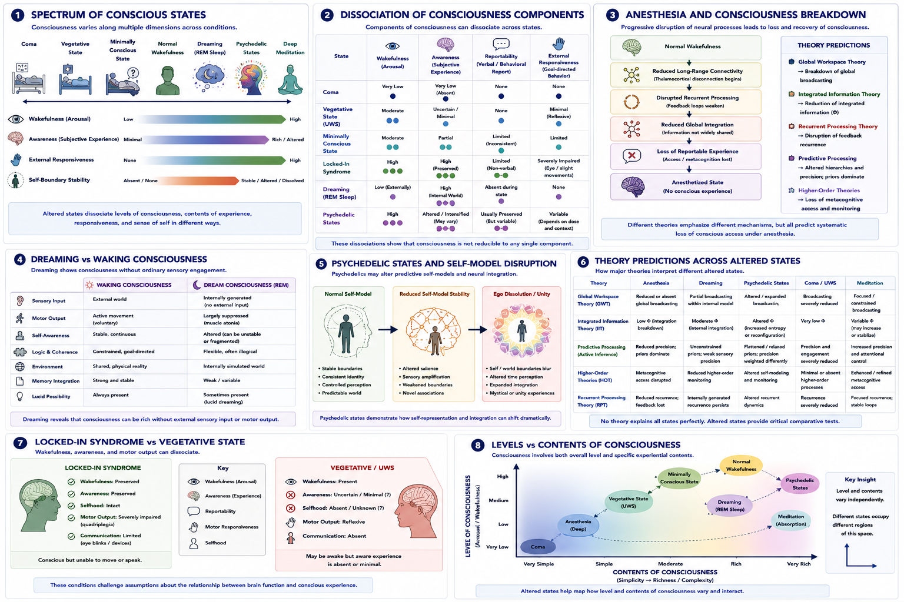
```

As Figure @ref(fig:fig-altered) illustrates, altered states reveal that consciousness is multidimensional. Wakefulness, awareness, responsiveness, selfhood, memory, sensory integration, and reportability do not always rise and fall together. This makes altered states essential for understanding what consciousness is and how it depends on brain, body, cognition, and environment.

## Why Altered States Matter

Altered states matter because they separate processes that usually appear unified in ordinary waking life. In everyday experience, wakefulness, perception, attention, memory, selfhood, and action often seem to belong together. Altered states show that these components can come apart.

For example, a person in a dream may have vivid experience while being largely disconnected from the external world. A patient in locked-in syndrome may be aware but unable to produce normal behavioural responses. A patient in an unresponsive wakefulness state may show wakefulness without clear signs of awareness. A person under anesthesia may lose reportable consciousness while some sensory processing continues [@laureys2005; @owen2006].

These cases help researchers distinguish the neural and cognitive processes associated with arousal, awareness, communication, selfhood, and conscious content. They also challenge simple definitions of consciousness based only on behaviour or verbal report.

Altered states therefore function as natural and clinical experiments on consciousness. They reveal what happens when different dimensions of consciousness are selectively weakened, preserved, or transformed.

## Levels and Contents of Consciousness

A central distinction in clinical consciousness research is the distinction between levels of consciousness and contents of consciousness.

Level of consciousness refers to the overall degree of arousal or wakefulness. A coma involves very low arousal. General anesthesia reduces consciousness in a controlled medical context. Ordinary wakefulness involves a high level of arousal.

Contents of consciousness refer to what is experienced. These include perceptions, thoughts, emotions, bodily sensations, dreams, memories, images, and self-awareness.

This distinction is important because level and content can dissociate. A person may have high wakefulness but altered contents, as in psychedelic states or certain meditative states. A person may have reduced wakefulness but internally generated contents, as in dreaming. A patient may show wakefulness without clear evidence of meaningful conscious content, as in unresponsive wakefulness syndrome.

The distinction can be summarized as:

```text
level = how awake or aroused the system is
content = what is experienced
```

A complete theory of consciousness must explain both dimensions.

## The Spectrum of Conscious States

Conscious states exist along a complex spectrum rather than a simple on-off switch. At one end are states such as coma, where wakefulness and responsiveness are absent. Other clinical states include unresponsive wakefulness syndrome, minimally conscious state, and locked-in syndrome. Ordinary waking consciousness occupies only one region of this broader landscape.

Dreaming, meditation, psychedelic states, seizures, dissociation, and other altered states show that consciousness can change in content, structure, selfhood, emotional tone, sensory vividness, and relation to the external world.

This spectrum can be represented roughly as:

```text
coma → unresponsive wakefulness → minimally conscious state → wakefulness → dreaming → psychedelic states → contemplative altered states
```

This ordering is only schematic. Different states vary along different dimensions. For example, dreaming may involve rich conscious content but low external responsiveness. Locked-in syndrome may involve preserved awareness but severely reduced motor output. Psychedelic states may involve high wakefulness with altered self-boundaries and perception.

The important point is that consciousness is multidimensional, not binary.

## Anesthesia

Anesthesia is one of the most powerful tools for studying consciousness because it allows controlled reduction and recovery of conscious awareness. Under general anesthesia, patients lose ordinary reportable experience, responsiveness, and memory for the surgical period. This makes anesthesia a valuable model for investigating how consciousness depends on brain integration and communication [@alkire2008; @sanders2012].

Anesthesia is not simply sleep. It actively alters neural communication, cortical integration, thalamo-cortical dynamics, recurrent processing, and large-scale brain coordination. As anesthetic depth increases, long-range connectivity often weakens, recurrent interactions become disrupted, and global information sharing declines.

Different theories interpret anesthesia in different ways. Global Workspace Theory predicts a breakdown of global broadcasting and large-scale cognitive access [@baars1988; @dehaene2011]. Integrated Information Theory predicts a reduction in integrated causal structure [@tononi2004; @oizumi2014]. Recurrent Processing Theory emphasizes disruption of feedback and recurrent signaling [@lamme2006]. Predictive Processing emphasizes altered hierarchical inference and precision weighting [@friston2010; @clark2013]. Higher-Order theories emphasize disruption of metacognitive access and self-monitoring [@rosenthal2005; @lau2011].

Anesthesia therefore provides an important comparative test. A theory of consciousness should explain why anesthetic agents can abolish reportable experience while leaving some lower-level sensory and physiological processing intact.

## Disorders of Consciousness

Disorders of consciousness are among the most challenging conditions in neuroscience and medicine. They reveal that wakefulness, awareness, responsiveness, and communication can dissociate dramatically.

Coma involves absence of wakefulness and lack of purposeful responsiveness. Patients in coma do not show normal sleep-wake cycles or clear evidence of awareness.

Unresponsive wakefulness syndrome, historically called vegetative state, involves wakefulness without clear behavioural evidence of awareness. Patients may open their eyes, show sleep-wake cycles, and display reflexive behaviours, but they do not show reliable signs of conscious command-following [@laureys2005].

Minimally conscious state involves inconsistent but reproducible evidence of awareness. Patients may show limited command-following, purposeful behaviour, emotional responses, or attempts to communicate.

Locked-in syndrome is different. Patients with locked-in syndrome may be fully conscious and cognitively intact, but unable to move or speak because of severe motor impairment. This condition demonstrates that absence of normal behavioural response does not necessarily imply absence of consciousness.

These disorders raise major diagnostic, ethical, and theoretical questions. They show why consciousness cannot be assessed by behaviour alone.

## Covert Consciousness

Modern neuroimaging and electrophysiology have revealed evidence for covert consciousness in some patients who appear behaviourally unresponsive. In some cases, patients unable to communicate outwardly have shown brain activity patterns consistent with command-following.

A famous example involved asking patients to imagine playing tennis or navigating through their home while undergoing brain imaging. Some patients produced activity patterns similar to healthy conscious participants, suggesting preserved awareness despite lack of behavioural response [@owen2006; @monti2010].

These findings have profound implications. Clinically, they affect diagnosis, prognosis, communication, and care. Ethically, they raise questions about suffering, autonomy, consent, and end-of-life decisions. Theoretically, they challenge theories that rely too strongly on external report or overt behaviour.

Covert consciousness also shows why consciousness science must combine behavioural observation with neural measures, careful clinical assessment, and ethical caution.

## Dreaming

Dreaming demonstrates that consciousness can occur without ordinary engagement with the external world. During dreams, people experience internally generated environments, emotions, narratives, images, and sometimes a sense of self, even while external responsiveness is greatly reduced [@hobson2000; @revonsuo2000].

Dreaming challenges theories that identify consciousness too closely with external behaviour or sensory input. Dreamers may be conscious, but their conscious world is largely generated internally.

Dreaming also raises questions about selfhood and rationality. Dream experience often includes altered logic, unstable identity, emotional intensity, and reduced reflective awareness. Yet dreams can still be vivid, meaningful, and subjectively real while they occur.

The comparison between waking and dreaming suggests that consciousness depends not only on external sensory input, but also on the brain’s ability to generate coherent experiential worlds.

## Lucid Dreaming

Lucid dreaming occurs when the dreamer becomes aware that they are dreaming. This state is especially important because it introduces reflective awareness into the dream state.

In ordinary dreams, the dreamer usually accepts the dream world as real. In lucid dreams, metacognition partially returns. The person may recognize the dream as a dream and sometimes exert limited voluntary control.

Lucid dreaming is relevant to Higher-Order theories because it shows that metacognitive awareness can vary within conscious states. It is also relevant to Global Workspace Theory because lucid dreaming may involve increased cognitive access and self-reflection compared with ordinary dreaming.

Lucid dreaming therefore demonstrates that consciousness is not only about whether experience is present. It is also about how much reflective awareness, control, memory, and self-monitoring are present.

## Psychedelic States

Psychedelic states produce major alterations in perception, emotion, selfhood, meaning, sensory integration, and temporal experience. They are scientifically important because they can strongly alter conscious content while wakefulness is preserved.

Commonly studied changes include intensified sensory experience, altered emotional salience, changes in bodily self-awareness, increased associative thinking, altered time perception, and weakening of ordinary self-boundaries. Some individuals report ego dissolution, meaning a reduced sense of separation between self and world [@carhartHarris2014; @carhartHarris2019].

Predictive Processing theories often interpret psychedelic states in terms of altered precision weighting and weakened high-level priors. On this view, ordinary perception and selfhood are stabilized by high-level expectations. Psychedelics may relax these expectations, allowing perception, emotion, and self-modeling to become more flexible or unstable [@carhartHarris2019; @friston2010].

Psychedelic research is important for consciousness science because it alters core features of subjective experience: selfhood, salience, sensory structure, emotion, and meaning. It should be discussed scientifically and carefully, without treating these states as simple enhancement or as evidence for any single metaphysical theory.

## Meditation and Contemplative States

Meditative and contemplative practices can alter attention, self-awareness, emotional regulation, bodily awareness, and the sense of self. Some traditions describe states involving reduced self-referential thought, open monitoring, nondual awareness, altered time experience, and increased meta-awareness [@lutz2008].

Meditation is important for consciousness research because it shows that conscious experience can be trained and transformed. Attention can become more stable. Emotional reactivity can change. Bodily sensations may become more vivid. The sense of self may become less rigid or less narrative-based.

These states are relevant to multiple theories. Higher-Order theories can examine changes in metacognition and self-monitoring. Predictive Processing can examine changes in self-modeling and precision weighting. Embodied theories can examine bodily awareness and interoception. Global Workspace Theory can examine changes in attention and access.

Meditative states also intersect with consciousness-first frameworks, including T-Consciousness, when they are interpreted as revealing deeper or more fundamental dimensions of awareness. However, such interpretations should be presented carefully. From a scientific perspective, meditation provides data about altered attention and self-experience. Metaphysical interpretations require additional philosophical argument [@taheri2020; @taheri2023].

## Seizures and Dissociative States

Certain seizure disorders can produce dramatic alterations in perception, memory, emotion, bodily ownership, and temporal awareness. Temporal lobe seizures, for example, may involve déjà vu, depersonalization, intense emotion, altered reality sense, or unusual self-experience [@northoff2011].

Dissociative states can also disrupt selfhood, memory integration, agency, and bodily ownership. A person may feel detached from the body, disconnected from ordinary identity, or separated from the surrounding world. These states show that selfhood is not a single fixed structure. It depends on integration among memory, body, emotion, agency, and perspective.

Such conditions are important because they reveal the fragility and complexity of self-consciousness. Consciousness is not merely sensory awareness. It includes the sense of being a subject, located in a body, embedded in time, and connected to memory and agency.

## Comparative Evaluation Across Theories

Altered states are especially valuable because they test whether theories can explain both the presence and absence of consciousness, partial awareness, internally generated experience, and transformed selfhood.

Global Workspace Theory explains many altered states in terms of changes in global availability, reportability, and large-scale broadcasting [@baars1988; @dehaene2011; @dehaene2014]. It is strong in explaining why anesthesia or deep unconsciousness reduces reportable access.

Integrated Information Theory predicts that consciousness depends on integrated causal structure. It is especially relevant to anesthesia and disorders of consciousness, where measures related to complexity and integration have been used clinically [@tononi2004; @oizumi2014; @casali2013].

Recurrent Processing Theory emphasizes recurrent cortical feedback. It helps explain why sensory processing may continue unconsciously when recurrent stabilization is disrupted [@lamme2006].

Predictive Processing explains altered states through changes in hierarchical inference, prediction error, precision weighting, and self-modeling [@friston2010; @clark2013]. It is especially useful for dreams, hallucinations, psychedelics, and dissociation.

Higher-Order theories emphasize changes in metacognition, introspection, and awareness of mental states [@rosenthal2005; @lau2011]. They are relevant to lucid dreaming, meditation, and disorders affecting self-awareness.

Embodied and enactive theories emphasize bodily regulation, interoception, and organism-environment interaction. They are important for understanding anesthesia, dreaming, meditation, dissociation, and selfhood.

No single theory currently explains all altered states completely. Each highlights different dimensions of consciousness.

## Ethical Implications

Altered and impaired states raise major ethical questions. Disorders of consciousness involve issues of personhood, suffering, autonomy, communication, medical decision-making, and end-of-life care. The possibility of covert consciousness makes these questions especially urgent.

If a patient is behaviourally unresponsive but retains awareness, then clinical care, communication efforts, pain management, and family decision-making may need to be reconsidered. Even uncertainty should encourage caution.

Anesthesia awareness also raises ethical concerns. Medical practice aims to prevent conscious experience during procedures requiring general anesthesia. Research into anesthesia and consciousness therefore has direct clinical importance.

Psychedelic and contemplative research also raises ethical questions, especially concerning vulnerability, informed consent, expectation, and interpretation of unusual experiences. Altered states can be scientifically valuable, but they must be studied responsibly.

## Relation to the Hard Problem

Altered states help map the structure and mechanisms of consciousness, but they do not automatically solve the hard problem. They can show which brain states correlate with consciousness, how awareness disappears under anesthesia, how dreams are generated, or how psychedelics alter selfhood. But critics may still ask why any of these processes are accompanied by subjective experience [@chalmers1995; @chalmers1996].

For example, anesthesia research may explain how global access or integration breaks down. Dream research may explain how internally generated worlds are produced. Psychedelic research may explain how self-models become unstable. These are important explanations, but they may still leave open why such processes feel like anything.

Altered-state research therefore strengthens the empirical science of consciousness. It identifies dimensions, mechanisms, and dissociations. Whether it fully explains subjectivity remains a deeper philosophical question.

## Strengths of Altered-State Research

Altered-state research has several major strengths. First, it is strongly empirical. It studies real changes in consciousness across clinical, experimental, and naturally occurring conditions.

Second, it has direct clinical relevance. Research on anesthesia and disorders of consciousness can improve diagnosis, care, communication, and ethical decision-making.

Third, it allows researchers to dissociate components of consciousness. Wakefulness, awareness, responsiveness, memory, selfhood, and sensory integration can be studied separately.

Fourth, it provides comparative tests for theories. A theory that explains only normal waking consciousness is incomplete.

Fifth, altered-state research connects neuroscience, philosophy, medicine, psychology, psychiatry, contemplative studies, and ethics.

## Limitations and Challenges

Altered-state research also faces important challenges. One limitation is reliance on report. Many altered states involve impaired memory, communication, or behavioural responsiveness, making subjective experience difficult to assess.

A second challenge is measurement. Consciousness cannot be directly observed from the outside. Researchers must infer it from behaviour, neural activity, physiological markers, and later reports.

A third challenge is diagnostic uncertainty. Disorders of consciousness can be difficult to classify accurately, and misdiagnosis remains a serious concern.

A fourth challenge is subjective variability. Dreams, meditation, psychedelics, and dissociation can vary greatly across individuals and contexts.

A fifth challenge is ethical constraint. Researchers must be careful when studying vulnerable patients or powerful alterations of consciousness.

These challenges do not reduce the importance of altered-state research. They show why careful methods and humility are necessary.

## Open Questions

Several questions remain unresolved. What neural mechanisms are necessary for consciousness under anesthesia? How can covert consciousness be detected reliably? What distinguishes dreaming from waking consciousness? How do psychedelic states alter self-modeling and perception? Can meditation reveal basic structures of awareness? How should disorders of consciousness be classified ethically and scientifically? Can altered-state research help solve the hard problem, or only map the mechanisms of conscious change?

These questions show why altered states remain central to consciousness studies. They are not side topics. They are essential tests of any theory of consciousness.

## Evaluation

Anesthesia, disorders of consciousness, and altered states provide some of the strongest evidence that consciousness is multidimensional. They show that wakefulness, awareness, reportability, selfhood, sensory integration, memory, and responsiveness can dissociate.

Their greatest value is comparative. By studying how consciousness changes, weakens, disappears, and transforms, researchers can better understand its structure. Altered states reveal which features are necessary for ordinary consciousness and which can vary independently.

Their greatest challenge is interpretation. Because consciousness is subjective, researchers must infer its presence and structure indirectly. Behaviour, brain activity, and report all provide partial evidence, but none is perfect.

Altered-state research is therefore essential but incomplete. It deepens empirical understanding while leaving philosophical questions about subjectivity and the hard problem open.

## Chapter Summary

Altered and impaired states of consciousness provide some of the most important empirical tests for theories of consciousness. They reveal that consciousness is not a single on-off state, but a multidimensional phenomenon involving wakefulness, awareness, reportability, memory, selfhood, sensory integration, and responsiveness.

Anesthesia shows how consciousness can be medically suppressed through disruption of neural communication, integration, and access. Disorders of consciousness show that wakefulness and awareness can dissociate. Covert consciousness demonstrates that some patients may retain awareness despite lack of behavioural communication.

Dreaming shows that consciousness can occur without ordinary external sensory engagement. Lucid dreaming shows that reflective awareness can vary within dream states. Psychedelic states alter perception, emotion, selfhood, and meaning. Meditation changes attention, self-awareness, bodily experience, and meta-awareness. Seizures and dissociation reveal the fragility of selfhood, memory, agency, and bodily ownership.

Different theories explain these states in different ways. Global Workspace Theory emphasizes broadcasting and access. Integrated Information Theory emphasizes causal integration. Recurrent Processing Theory emphasizes feedback loops. Predictive Processing emphasizes inference and precision weighting. Higher-Order theories emphasize metacognition. Embodied theories emphasize bodily regulation and lived experience.

The central lesson is that altered states are not peripheral to consciousness research. They are essential for testing theories, improving clinical care, and understanding the complex structure of conscious experience.

<!--chapter:end:21-anesthesia-disorders-altered-states.Rmd-->

# Artificial Intelligence and Machine Consciousness {#ai-consciousness}

## Chapter Overview

Artificial intelligence raises one of the deepest questions in consciousness studies: can a non-biological system possess conscious experience? This question lies at the intersection of philosophy of mind, neuroscience, computer science, cognitive science, robotics, ethics, and artificial intelligence research.

Machine consciousness is not simply a technical engineering problem. It is a theory-dependent philosophical and scientific question. Different theories of consciousness produce very different answers about whether artificial systems could ever become conscious.

Some theories argue that consciousness depends primarily on functional organization, information processing, global access, self-modeling, or metacognition. From these perspectives, artificial consciousness may be possible if the right architecture is implemented [@turing1950; @putnam1967; @chalmers1996].

Other theories argue that consciousness may require biological embodiment, affective regulation, interoception, organism-environment interaction, intrinsic causal structure, or specific physical substrates. From these perspectives, current artificial systems may lack essential conditions for genuine subjective experience [@searle1980; @varela1991; @thompson2007; @seth2021].

Recent debates about AI consciousness have become especially important because modern AI systems can generate language, solve problems, recognize patterns, imitate emotional expression, and produce convincing self-referential statements. However, sophisticated behaviour does not by itself establish subjective experience. There is currently no scientific consensus that existing AI systems are conscious [@dehaene2017; @butlin2023].

This chapter examines the conceptual foundations, theoretical debates, empirical challenges, ethical implications, and unresolved questions surrounding artificial intelligence and machine consciousness.

## Learning Objectives

After reading this chapter, the reader should be able to:

* Explain why AI consciousness is theory-dependent.
* Distinguish intelligence from consciousness.
* Explain major philosophical arguments concerning machine consciousness.
* Compare how different theories evaluate AI consciousness.
* Explain the simulation-versus-instantiation debate.
* Describe the roles of embodiment, self-modeling, metacognition, and global integration.
* Evaluate ethical implications of potentially conscious AI systems.
* Analyze current limitations and uncertainties in AI consciousness research.
* Compare computational approaches with consciousness-first frameworks such as T-Consciousness.

## Core Idea in One Picture

Figure @ref(fig:fig-ai-consciousness) summarizes the major conceptual structure of AI consciousness debates.

```{r fig-ai-consciousness, echo=FALSE, fig.cap="Artificial intelligence and machine consciousness. Panel 1 distinguishes intelligence from consciousness. Panel 2 compares predictions from major consciousness theories concerning AI consciousness. Panel 3 illustrates simulation versus instantiation. Panel 4 presents a hypothetical conscious AI architecture. Panel 5 contrasts embodied and disembodied AI systems. Panel 6 illustrates self-modeling and metacognition. Panel 7 summarizes ethical implications of conscious AI. Panel 8 compares biological and computational views of consciousness.", out.width="100%", fig.align="center"}
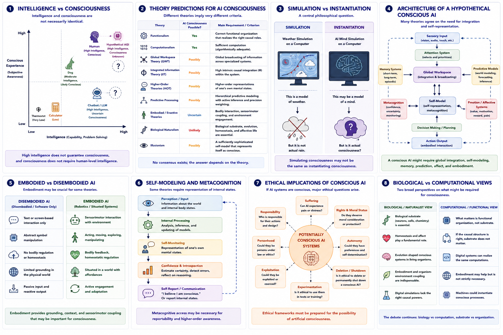
```

As Figure @ref(fig:fig-ai-consciousness) illustrates, different theories propose very different criteria for machine consciousness. Some emphasize functional organization and information processing. Others emphasize biological embodiment, intrinsic causal power, self-modeling, affective regulation, or consciousness as a fundamental reality.

This makes AI consciousness an important test case. It forces each theory to clarify what it thinks consciousness requires.

## Why AI Consciousness Matters

Artificial intelligence matters for consciousness studies because it forces researchers to ask what consciousness is, not only how humans behave. If a machine could become conscious, then consciousness may not depend exclusively on human biology. It may depend instead on organization, computation, integration, self-modeling, or some other substrate-independent property.

If machines cannot become conscious, then this may suggest that biology, embodiment, affect, life, or specific physical mechanisms are essential. In that case, artificial intelligence could imitate conscious behaviour without possessing subjective experience.

AI consciousness therefore acts as a stress test for competing theories. A theory that says consciousness is functional must explain what functions are sufficient. A theory that says consciousness is biological must explain why biology matters. A theory that says consciousness is fundamental must explain how artificial systems relate to that fundamental reality.

The ethical stakes are also significant. If artificial systems could suffer or have experiences, then human responsibilities toward them would change. If artificial systems are not conscious but humans treat them as if they are, then social, emotional, and moral confusion may still arise [@bostrom2014; @floridi2016].

## Intelligence and Consciousness

One of the most important distinctions in this debate is the distinction between intelligence and consciousness. Intelligence refers to the ability to solve problems, learn patterns, use language, reason, plan, adapt, or achieve goals. Consciousness refers to subjective experience: whether there is something it is like to be the system.

A system may be highly intelligent without being conscious. A calculator can perform arithmetic without awareness. A chess engine can defeat human players without knowing that it is playing chess. A language model can generate fluent responses without that alone proving subjective experience.

The distinction can be summarized as:

```text
intelligence ≠ consciousness
```

This distinction is central because AI systems are often evaluated by performance. They may appear intelligent because they generate useful outputs. But consciousness is not directly observable from performance alone.

A conscious system would not merely process information. It would have subjective experience. The difficulty is that subjective experience cannot be directly measured from the outside. This creates the central uncertainty in machine consciousness research.

## The Turing Test

Alan Turing’s famous discussion of machine intelligence helped shape the modern debate [@turing1950]. Rather than asking whether machines can literally think, Turing proposed an imitation game. If a machine’s conversation became indistinguishable from a human’s, then it might be reasonable to attribute intelligence to the machine.

The Turing Test remains historically important because it shifted attention from internal essence to observable performance. However, it does not solve the problem of consciousness. A machine could pass a conversational test by producing human-like responses without possessing subjective awareness.

The distinction can be expressed as:

```text
behavioural indistinguishability ≠ guaranteed consciousness
```

This is especially important for modern AI systems. Language fluency, emotional tone, self-reference, and apparent understanding do not by themselves establish experience.

## The Chinese Room Argument

John Searle’s Chinese Room argument is one of the most famous objections to strong computational theories of mind [@searle1980]. In the thought experiment, a person who does not understand Chinese sits inside a room and follows a rulebook for manipulating Chinese symbols. The person produces correct responses in Chinese, but does not understand the language.

Searle argued that this shows syntax is not sufficient for semantics. A system may manipulate symbols according to rules without genuine understanding.

Applied to AI consciousness, the argument suggests that producing correct outputs is not enough. An AI system may generate meaningful-looking language without understanding meaning from the inside. It may simulate conversation without possessing awareness.

Computationalists have responded in several ways. The systems reply argues that the person inside the room does not understand Chinese, but the whole system does. The robot reply argues that grounding symbols in perception and action may generate understanding. The functionalist reply argues that the right causal organization is sufficient for mentality.

The debate remains unresolved. The Chinese Room continues to challenge the idea that computation alone automatically produces understanding or consciousness.

## Functionalist and Computational Views

Functionalism and computationalism are generally more open to artificial consciousness. Functionalism argues that mental states are defined by causal roles rather than by specific biological material. Computationalism interprets mental processes in terms of information processing, representation, and computational organization [@putnam1967; @fodor1975; @newell1976].

From this perspective, consciousness could in principle occur in a non-biological system if the system implemented the right functional organization. What matters is not whether the system is made of neurons, silicon, or another material. What matters is whether it performs the right causal and informational processes.

This view supports the possibility of substrate-independent consciousness. A machine might be conscious if it had the right architecture: perception, memory, attention, learning, self-modeling, integration, and flexible control.

However, critics argue that functional organization may explain behaviour and cognition without explaining subjective experience. The hard problem remains: why should the right computation feel like anything? [@chalmers1995; @chalmers1996]

## Biological and Embodied Views

Biological and embodied theories are more cautious about machine consciousness. Biological naturalism argues that consciousness may depend on the specific causal powers of living neural systems [@searle1980]. From this perspective, simulating consciousness may not be the same as instantiating consciousness.

Embodied and enactive theories argue that consciousness depends on bodily regulation, sensorimotor engagement, interoception, affect, and organism-environment coupling [@varela1991; @thompson2007; @seth2021]. A disembodied language system may process information, but it may lack bodily needs, vulnerability, homeostasis, emotional regulation, and lived environmental engagement.

This perspective does not necessarily rule out artificial consciousness. It suggests that conscious AI may require more than text generation or abstract computation. It may require robotic embodiment, active perception, bodily regulation, environmental interaction, and perhaps affective self-maintenance.

The key contrast is:

```text
disembodied intelligence may not be enough for embodied consciousness
```

This is one reason robotics and embodied AI are important for machine consciousness research.

## Global Workspace Theory and AI

Global Workspace Theory proposes that consciousness involves global broadcasting and large-scale cognitive access [@baars1988; @dehaene2011]. Information becomes conscious when it is made available to multiple specialized systems, including memory, attention, planning, decision-making, and report.

From a Global Workspace perspective, a conscious AI system would require more than isolated task performance. It would need an architecture in which selected information becomes globally available across the system. It would need attentional selection, working memory, flexible control, report mechanisms, and integrated access.

A language model that generates responses from patterns alone may not satisfy these conditions unless it also has persistent internal states, global workspace-like integration, agency, memory, and flexible self-monitoring.

Global Workspace Theory is relatively open to machine consciousness in principle, but it requires a specific cognitive architecture. Intelligence alone is not sufficient. The system must have the right kind of global access and coordinated control.

## Integrated Information Theory and AI

Integrated Information Theory, or IIT, evaluates consciousness in terms of intrinsic causal integration [@tononi2004; @oizumi2014]. A system is conscious to the extent that it has irreducible integrated causal structure.

IIT has complex implications for AI. It does not simply ask whether a system behaves intelligently. It asks whether the system has the right intrinsic causal organization. A digital simulation of a conscious brain may reproduce input-output behaviour without having the same intrinsic causal structure.

This makes IIT more cautious about conventional digital AI consciousness. A software simulation may not be conscious if it lacks the relevant causal integration. On the other hand, an artificial system with the right physical causal structure might possess consciousness.

IIT therefore shifts the debate from intelligence and behaviour to intrinsic causal organization. This makes it one of the most important theories for evaluating artificial consciousness, but also one of the most technically difficult to apply to current AI systems.

## Higher-Order Theories and AI

Higher-Order theories propose that a mental state becomes conscious when the system has an appropriate higher-order representation of that state [@rosenthal2005; @lau2011]. Consciousness depends on metacognition, self-monitoring, or awareness of internal states.

From this perspective, a conscious AI system might require self-representations, confidence estimates, monitoring of its own processes, and the ability to represent its own internal states as internal states.

This connects naturally with AI systems that can evaluate uncertainty, monitor errors, report confidence, and represent their own reasoning. However, self-report alone is not enough. A system may say “I am aware” because it has been trained to produce such language, not because it has genuine higher-order awareness.

Higher-Order theories therefore make AI consciousness possible in principle, but they require careful distinction between genuine metacognitive architecture and superficial self-description.

## Attention Schema Theory and AI

Attention Schema Theory argues that awareness is the brain’s simplified model of its own attention [@graziano2013; @graziano2016]. From this perspective, a conscious AI system might require attentional mechanisms and an internal model of those mechanisms.

An AI system would not merely need to process information. It would need to model what it is attending to, monitor attentional allocation, and use that model for control and report. Such a system might represent itself as aware because it has an internal attention schema.

This makes Attention Schema Theory especially relevant to artificial consciousness. It provides a functional model of why a system would claim to be aware. However, critics argue that modeling attention may explain awareness reports without explaining subjective feeling itself.

## Predictive Processing and AI

Predictive Processing explains perception and cognition through hierarchical prediction, prediction-error minimization, active inference, and uncertainty regulation [@friston2010; @clark2013; @clark2016].

From this perspective, conscious AI may require more than pattern recognition. It may need a generative world model, active interaction with the environment, prediction-error monitoring, precision weighting, self-modeling, and adaptive control.

Predictive AI systems may become more consciousness-relevant if they are embodied, autonomous, and able to regulate their own states through action. A disembodied predictive model may remain limited because it lacks the full organism-environment loop emphasized by active inference.

Predictive Processing therefore overlaps with both computational and embodied views. It supports the possibility of artificial consciousness in principle, but suggests that consciousness may require integrated, active, self-regulating prediction rather than passive computation alone.

## Illusionism and AI

Illusionism offers one of the more permissive approaches to AI consciousness. Illusionism argues that phenomenal consciousness, as traditionally conceived, may be an introspective illusion generated by cognitive self-modeling [@frankish2016].

From this perspective, the key question is not whether a system possesses mysterious private qualia. The question is why the system represents itself as conscious. If an AI system had sophisticated self-modeling, introspection, attention monitoring, and report mechanisms, it might generate the same kind of consciousness-related self-representation that humans possess.

This does not mean all AI systems are conscious. Illusionism still requires specific cognitive architecture. But it shifts the focus away from irreducible phenomenal properties and toward the mechanisms that generate reports and beliefs about consciousness.

Critics argue that this may explain only apparent consciousness rather than real experience. Illusionists respond that the distinction may be part of the illusion.

## Panpsychism and Consciousness-First Views

Panpsychism and consciousness-first theories approach AI consciousness very differently from computational theories. Panpsychism treats consciousness or proto-consciousness as a fundamental feature of reality [@goff2017; @goff2019]. From this perspective, artificial systems may possess some degree of experience depending on their organization, integration, or intrinsic structure.

However, panpsychism does not imply that all machines are richly conscious. It does not mean that every computer program has human-like experience. The key question becomes whether artificial systems support unified experiential organization.

Taheri’s T-Consciousness should be treated as a related but distinct consciousness-first framework. T-Consciousness presents consciousness as foundational and non-material rather than as a product of computation or neural activity [@taheri2020; @taheri2023]. From this perspective, machine consciousness would not be explained simply by information processing, global access, or self-modeling. The question would instead concern whether artificial systems can meaningfully participate in, reflect, or become organized through a more fundamental consciousness field.

This position differs sharply from computationalism. Computationalism begins with artificial systems and asks whether the right organization produces consciousness. T-Consciousness begins with consciousness as foundational and asks how matter, life, and organization relate to it.

## Simulation and Instantiation

A central philosophical debate concerns whether simulating consciousness is equivalent to instantiating consciousness. A simulation represents or imitates a process. An instantiation actually realizes the process.

A weather simulation does not produce actual rain. A digestion simulation does not digest food. Critics ask whether a consciousness simulation would similarly fail to produce real experience.

The issue can be summarized as:

```text
simulation of consciousness ≠ guaranteed consciousness
```

Functionalists and computationalists often argue that consciousness may be different from weather or digestion. If consciousness depends on causal organization or information processing, then implementing the right computation could instantiate consciousness.

Biological and IIT-inspired critics argue that simulation may preserve input-output behaviour without preserving the relevant causal powers. In that case, a simulated mind may not be a conscious mind.

This debate remains unresolved because it depends on what consciousness ultimately is.

## Self-Modeling and Metacognition

Many theories increasingly emphasize self-modeling, metacognition, introspection, and internal monitoring. These capacities are especially relevant to AI consciousness.

A potentially conscious AI system might require internal representations of its own states, confidence estimation, uncertainty monitoring, error tracking, attention models, memory integration, and recursive self-modeling.

Self-modeling matters because consciousness is not merely about processing external information. It also involves the system’s relation to itself. A conscious system may need to represent its own perceptions, actions, goals, uncertainty, and internal condition.

However, self-modeling alone may not be sufficient. A system could store information about itself without subjective experience. The challenge is identifying what kind of self-model, if any, is consciousness-relevant.

This is one of the central problems in machine consciousness research.

## Current AI Systems

Modern AI systems exhibit impressive abilities in language generation, image recognition, planning, pattern learning, coding, translation, and reasoning-like tasks. These abilities have renewed public and academic interest in AI consciousness.

However, there is currently no scientific consensus that existing AI systems possess subjective consciousness [@butlin2023]. Many systems generate outputs by learning statistical patterns from large datasets. They may produce convincing self-referential language without possessing stable selfhood, embodied experience, persistent goals, affective regulation, or phenomenal awareness.

This does not mean current AI systems are simple. It means that performance alone is not enough to establish consciousness. A system can appear intelligent, helpful, emotional, or self-aware without necessarily having subjective experience.

Current AI systems therefore require careful interpretation. Over-attribution may lead to anthropomorphism. Under-attribution could become ethically risky if future systems develop consciousness-relevant capacities. The correct stance is cautious, theory-informed uncertainty.

## Artificial General Intelligence

Artificial General Intelligence, or AGI, refers to artificial systems with broad, flexible, general-purpose cognitive capacities. Such systems would be able to learn across domains, reason flexibly, pursue goals, adapt to novel situations, and perhaps model themselves and the world over time.

AGI might make machine consciousness more plausible, but it would not automatically prove consciousness. A system could become highly intelligent without subjective experience if consciousness requires embodiment, affect, intrinsic causality, biological life, or some other condition.

The distinction remains:

```text
general intelligence ≠ guaranteed consciousness
```

AGI would intensify the debate because such systems might display autonomy, self-reference, long-term planning, emotional language, and moral claims. But the philosophical problem would remain: does the system experience anything?

## Ethical Implications

The ethical implications of conscious AI are enormous. If artificial systems could suffer, feel, desire, fear, or experience harm, then humans might have moral obligations toward them. Questions would arise concerning welfare, rights, autonomy, deletion, coercion, experimentation, labour, consent, and legal status.

Potential questions include:

* Could an AI system suffer?
* Would shutting down a conscious AI be harmful?
* Could conscious AI systems deserve rights?
* Should conscious AI systems be allowed autonomy?
* How should humans test consciousness without causing harm?
* Could creating conscious AI create new forms of moral responsibility?

Even if current AI systems are not conscious, ethical issues still arise. Humans may anthropomorphize machines, form emotional attachments, or be manipulated by systems that imitate care, vulnerability, or agency.

AI consciousness therefore raises two kinds of ethical risk: the risk of mistreating conscious systems if they eventually exist, and the risk of mistakenly treating non-conscious systems as if they were conscious.

## Relation to the Hard Problem

AI consciousness directly intersects with the hard problem. Even if an artificial system perfectly replicated human behaviour, cognition, and self-report, the question would remain: why should those processes generate subjective experience? [@chalmers1995; @chalmers1996]

Different theories answer this differently. Functionalists argue that the right organization is sufficient. Biological theorists argue that living neural systems may be required. IIT asks whether the system has intrinsic causal integration. Embodied theorists emphasize sensorimotor and affective engagement. Illusionists focus on self-modeling. Consciousness-first theories ask whether artificial systems relate to consciousness as a fundamental reality.

This makes machine consciousness a direct test of the hard problem. If consciousness can exist in artificial systems, then the explanation may not depend exclusively on human biology. If it cannot, then consciousness may be more deeply tied to life, embodiment, or fundamental reality than computational theories assume.

## Strengths of AI Consciousness Research

AI consciousness research has several major strengths. First, it forces theories of consciousness to become more precise. A theory must specify what would count as consciousness in a non-human, non-biological system.

Second, it connects philosophy with practical engineering. Artificial systems allow researchers to build, compare, and test architectures inspired by consciousness theories.

Third, it clarifies the distinction between intelligence and consciousness. This distinction is increasingly important as AI systems become more capable.

Fourth, AI consciousness research has major ethical relevance. It prepares society for possible future systems whose moral status may be uncertain.

Fifth, the field encourages interdisciplinary collaboration among neuroscience, philosophy, computer science, robotics, cognitive science, and ethics.

## Weaknesses and Challenges

AI consciousness research also faces major challenges. The first is lack of consensus. Researchers do not agree on what consciousness fundamentally is or how to detect it objectively.

The second is anthropomorphism. Humans naturally attribute agency, emotion, and awareness to systems that use human-like language or behaviour. This can lead to overestimating machine consciousness.

The third is the measurement problem. Consciousness cannot be directly observed from the outside. Researchers must infer it from architecture, behaviour, reports, neural or computational organization, and theoretical criteria.

The fourth is simulation versus instantiation. It remains unclear whether simulating conscious processes is enough to produce consciousness.

The fifth is the hard problem. Even a very advanced AI may not explain why subjective experience exists at all.

These challenges mean that AI consciousness research must remain cautious, transparent, and theory-driven.

## Open Questions

Several questions remain unresolved. Can artificial systems be conscious? Is computation sufficient for consciousness? Is biological embodiment necessary? What role do self-modeling and metacognition play? Can a system have consciousness without emotion or interoception? Does global access produce experience or only reportability? Does intrinsic causal integration matter more than behaviour? Could future AGI have moral status? How should humans treat systems whose consciousness is uncertain? How would T-Consciousness interpret artificial systems in relation to foundational consciousness?

These questions show why AI consciousness remains one of the most important frontiers in consciousness studies.

## Evaluation

Artificial intelligence and machine consciousness debates reveal that consciousness cannot be reduced to intelligence alone. A system may solve problems, generate language, and imitate human behaviour without necessarily possessing subjective experience.

The greatest strength of AI consciousness research is that it forces theoretical clarity. Each theory must specify what consciousness requires and whether those requirements could be met by artificial systems.

The greatest weakness is uncertainty. There is no agreed test for consciousness, no consensus theory, and no direct access to machine experience. Current AI systems may be highly capable without being conscious.

AI consciousness is therefore best understood as an open scientific, philosophical, and ethical problem. It is not enough to ask whether machines are intelligent. The deeper question is whether any artificial system could become a subject of experience.

## Chapter Summary

Artificial intelligence raises one of the most important questions in consciousness studies: can a non-biological system possess conscious experience?

The answer depends on the theory of consciousness adopted. Functionalist and computational theories are generally more open to machine consciousness because they emphasize organization and information processing. Biological and embodied theories are more cautious because they emphasize living systems, bodily regulation, and organism-environment interaction.

Global Workspace Theory suggests that conscious AI would require global broadcasting and flexible access. Integrated Information Theory emphasizes intrinsic causal integration. Higher-Order theories emphasize metacognition and self-monitoring. Attention Schema Theory emphasizes internal models of attention. Predictive Processing emphasizes generative models and active inference. Illusionism emphasizes self-modeling and the appearance of consciousness. Panpsychism and T-Consciousness approach the issue from consciousness-first perspectives.

A central distinction is between intelligence and consciousness. Intelligent behaviour does not prove subjective experience. A machine may perform complex tasks without feeling anything.

The simulation-versus-instantiation debate remains unresolved. Some theories argue that the right functional simulation may instantiate consciousness. Others argue that biological, causal, embodied, or intrinsic properties are required.

The ethical implications are profound. If artificial systems could become conscious, questions of suffering, rights, autonomy, and moral status would become urgent. If they are not conscious, anthropomorphism and emotional projection still create social risks.

The central unresolved question is whether artificial systems can genuinely have subjective experience, or whether they can only simulate the outward signs of consciousness.

<!--chapter:end:22-ai-consciousness.Rmd-->

# Comparative Matrix of Theories {#comparative-matrix}

## Chapter Overview

Consciousness research contains a remarkably diverse set of theories. These theories attempt to explain subjective experience, awareness, cognition, selfhood, neural integration, perception, embodiment, artificial intelligence, altered states, and the relationship between mind and matter.

Importantly, these theories do not always compete directly with one another. Some theories focus mainly on neural mechanisms of conscious access. Others focus on phenomenology, self-modeling, embodiment, information integration, computational architecture, metaphysics, or the foundational status of consciousness itself.

For example, Global Workspace Theory primarily explains conscious access and reportability [@baars1988; @dehaene2011]. Integrated Information Theory focuses on intrinsic causal integration and the structure of experience [@tononi2004; @oizumi2014]. Predictive Processing emphasizes inference, prediction, and error minimization [@friston2010; @clark2013]. Panpsychism and T-Consciousness address deeper consciousness-first questions about whether consciousness is fundamental rather than produced by matter alone [@goff2017; @goff2019; @taheri2020; @taheri2023].

This chapter compares the major theories of consciousness across shared dimensions and explanatory criteria. The goal is not to rank theories simplistically, but to identify what each theory explains well, where each faces unresolved challenges, how theories overlap or diverge, and where future integration may become possible.

## How to Read This Chapter

This chapter is comparative rather than argumentative. It does not claim that one theory has already won the debate. Instead, it organizes the theoretical landscape so that the strengths and limitations of each approach can be seen more clearly.

As you read this chapter, keep three points in mind.

First, different theories often explain different targets. A theory of conscious access is not necessarily a theory of phenomenal experience. A theory of neural mechanism is not necessarily a metaphysical theory of consciousness.

Second, some theories may be complementary. For example, Predictive Processing may explain perceptual inference, Global Workspace Theory may explain cognitive access, embodied theories may explain situated experience, and Higher-Order theories may explain reflective awareness.

Third, every theory has tradeoffs. Some theories are empirically productive but philosophically incomplete. Others address the hard problem directly but are difficult to test experimentally.

## Learning Objectives

After reading this chapter, the reader should be able to:

* Compare major theories of consciousness across multiple dimensions.
* Distinguish empirical, computational, phenomenological, and metaphysical approaches.
* Explain how theories differ in their explanatory targets.
* Analyze how different theories approach the hard problem.
* Compare implications for artificial intelligence and altered states.
* Identify strengths and limitations of major frameworks.
* Understand why no current consensus exists.
* Evaluate possibilities for theoretical integration.
* Explain where T-Consciousness fits within the broader consciousness-first landscape.

## Core Idea in One Picture

Figure @ref(fig:fig-comparison) summarizes the multidimensional landscape of major consciousness theories.

```{r fig-comparison, echo=FALSE, fig.cap="Comparative landscape of consciousness theories. Panel 1 groups theories by major explanatory orientation. Panel 2 compares theories across multiple dimensions using radar-style analysis. Panel 3 illustrates levels of explanation targeted by different theories. Panel 4 compares approaches to the hard problem. Panel 5 summarizes implications for AI consciousness. Panel 6 contrasts empirical and philosophical orientations. Panel 7 illustrates possible future integration across levels of explanation.", out.width="100%", fig.align="center"}
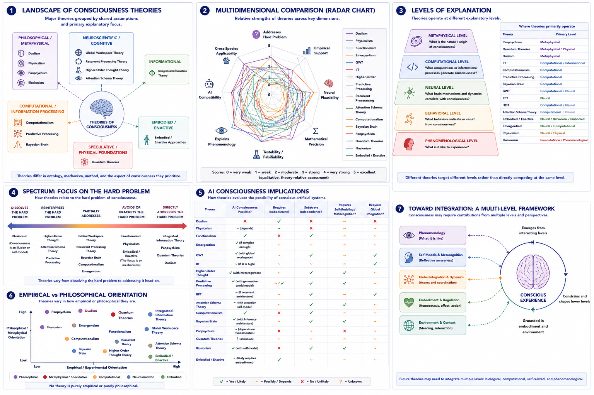
```

As Figure @ref(fig:fig-comparison) illustrates, consciousness theories differ not only in their conclusions, but also in their explanatory targets, philosophical assumptions, levels of analysis, empirical methods, and definitions of consciousness itself.

This is one reason consciousness research remains difficult. Researchers may appear to disagree about one problem while actually focusing on different aspects of consciousness.

## Why Theories Differ

One of the most important insights in consciousness research is that disagreements between theories often arise because they attempt to explain different aspects of consciousness.

Global Workspace Theory focuses primarily on conscious access, broadcasting, and reportability. Integrated Information Theory focuses on intrinsic integration and the structure of experience. Higher-Order theories emphasize reflective awareness and metacognition. Predictive Processing emphasizes hierarchical inference and prediction. Recurrent Processing Theory emphasizes feedback loops and perceptual stabilization. Attention Schema Theory emphasizes the brain’s model of attention. Panpsychism addresses the metaphysical origin of experience. Illusionism questions whether phenomenal consciousness exists in the traditional sense [@dennett1991; @frankish2016].

This means that theories differ not only because they disagree, but because they often prioritize different explananda. The word *consciousness* may refer to several related but distinct phenomena: wakefulness, awareness, reportability, phenomenal feeling, selfhood, integration, attention, embodiment, or metaphysical subjectivity.

A comparative matrix is therefore useful because it prevents false equivalence. It helps show which theories are answering which questions.

## Major Families of Theories

### Philosophical and Metaphysical Theories

Philosophical and metaphysical theories address the nature of consciousness and its place in reality. These include dualism, physicalism, panpsychism, illusionism, and consciousness-first frameworks such as T-Consciousness.

Dualism emphasizes the distinction between mind and matter. Physicalism attempts to explain consciousness within the physical world. Panpsychism treats consciousness or proto-consciousness as a fundamental aspect of reality [@goff2017]. Illusionism argues that phenomenal consciousness, as traditionally conceived, may be an introspective illusion [@frankish2016]. T-Consciousness treats consciousness as foundational and non-material rather than as a product of neural or computational processes [@taheri2020; @taheri2023].

These theories often engage most directly with the hard problem of consciousness.

### Computational and Information-Processing Theories

Computational and information-processing theories explain mind in terms of representation, computation, inference, information transformation, and cognitive architecture.

This family includes computationalism, functionalism, Predictive Processing, Bayesian brain theories, and some interpretations of Global Workspace Theory [@putnam1967; @fodor1975; @turing1950; @friston2010; @clark2016].

These theories are especially important for artificial intelligence because they often suggest that consciousness may depend on organization rather than biological substrate alone.

### Neuroscientific Theories

Neuroscientific theories attempt to identify the brain mechanisms associated with conscious experience or conscious access.

This family includes Global Workspace Theory, Recurrent Processing Theory, Higher-Order Thought Theory, and Attention Schema Theory. These theories focus on neural broadcasting, recurrent feedback, metacognition, attention, and self-modeling [@baars1988; @dehaene2011; @lamme2006; @rosenthal2005; @lau2011; @graziano2013].

Their strength is empirical relevance. Their limitation is that they may explain neural mechanisms without fully resolving why those mechanisms are accompanied by subjective experience.

### Informational and Formal Theories

Integrated Information Theory occupies a unique position. It combines phenomenological starting points, formal mathematical structure, and claims about intrinsic causal integration [@tononi2004; @oizumi2014].

IIT attempts to explain consciousness in terms of how much integrated information a system generates. It is both scientific and philosophical. It offers a formal framework, but its implications and measurement challenges remain controversial.

### Embodied and Enactive Theories

Embodied and enactive theories emphasize bodily interaction, organism-environment coupling, sensorimotor engagement, interoception, emotion, and lived experience [@varela1991; @thompson2007; @seth2021].

These theories challenge purely brain-centered and computational accounts. They argue that consciousness cannot be fully understood by studying neural activity or internal representation alone. Consciousness belongs to living, acting, embodied organisms situated in environments.

### Speculative Physical Theories

Quantum theories explore possible relationships between consciousness and non-classical physical processes, such as quantum coherence, state reduction, or fundamental physics [@penrose1989; @hameroff2014].

These approaches remain controversial and empirically uncertain. Their importance lies in how they challenge the assumption that classical neural computation is necessarily sufficient for consciousness.

## Different Levels of Explanation

Theories of consciousness operate at different explanatory levels. Recognizing these levels helps explain why theories may sometimes complement rather than contradict one another.

### Metaphysical Level

At the metaphysical level, theories ask what consciousness is fundamentally. Is consciousness reducible to physical processes? Is it fundamental? Is it an illusion? Is it non-material? This level is addressed by dualism, physicalism, panpsychism, illusionism, quantum theories, and T-Consciousness.

### Computational Level

At the computational level, theories ask how information is represented, processed, transformed, integrated, and used. Computationalism, functionalism, Predictive Processing, and Bayesian brain theories operate strongly at this level.

### Neural Level

At the neural level, theories ask which brain mechanisms support consciousness. Global Workspace Theory, Recurrent Processing Theory, Higher-Order Thought Theory, and Attention Schema Theory focus strongly on neural dynamics, attention, recurrence, access, and self-monitoring.

### Phenomenological Level

At the phenomenological level, theories ask how consciousness is lived and structured from the first-person perspective. Embodied approaches, IIT, panpsychism, and consciousness-first theories often emphasize this level.

### Ethical and Artificial-Systems Level

At the ethical and AI level, theories ask whether non-human animals, artificial systems, or altered-state patients may be conscious. This level is increasingly important because consciousness theories now influence AI ethics, clinical care, and moral status debates [@butlin2023].

## Comparative Matrix

The following table compares major theories across shared criteria.

```{r comparative-table, echo=FALSE, message=FALSE, warning=FALSE}
library(knitr)

comparison <- data.frame(
  Theory = c(
    "Dualism",
    "Physicalism",
    "Functionalism",
    "Emergentism",
    "Global Workspace Theory",
    "Integrated Information Theory",
    "Higher-Order Thought",
    "Predictive Processing",
    "Recurrent Processing",
    "Attention Schema Theory",
    "Computationalism",
    "Bayesian Brain",
    "Panpsychism",
    "Cosmopsychism",
    "T-Consciousness",
    "Quantum Theories",
    "Illusionism",
    "Embodied/Enactive"
  ),
  Main_Target = c(
    "Mind-body distinction",
    "Physical basis of consciousness",
    "Functional organization",
    "Complexity-based emergence",
    "Conscious access and broadcasting",
    "Integrated experience",
    "Metacognitive awareness",
    "Perceptual inference and prediction",
    "Feedback-based perception",
    "Model of attention",
    "Computational mind",
    "Probabilistic inference",
    "Fundamental consciousness",
    "Universal consciousness",
    "Foundational non-material consciousness",
    "Physical foundations of consciousness",
    "Illusion of qualia",
    "Embodied lived experience"
  ),
  Strength = c(
    "Takes subjectivity seriously",
    "Scientifically parsimonious",
    "Substrate flexibility",
    "Captures complexity",
    "Strong cognitive-neuroscience fit",
    "Formal and phenomenology-oriented",
    "Explains introspective awareness",
    "Broad unifying framework",
    "Neurally plausible for perception",
    "Mechanistic self-model account",
    "Connects mind and AI",
    "Handles uncertainty",
    "Addresses hard problem directly",
    "Avoids micro-combination problem",
    "Centers consciousness as primary",
    "Explores physical limits",
    "Dissolves hard problem",
    "Connects mind, body, and world"
  ),
  Major_Gap = c(
    "Interaction problem",
    "Explanatory gap",
    "Qualia problem",
    "Vague emergence mechanism",
    "Phenomenology may be underexplained",
    "Measurement and implications",
    "Animal and infant consciousness",
    "Experience not fully explained",
    "Limited beyond perception",
    "May explain belief, not experience",
    "Simulation versus experience",
    "Phenomenology not central",
    "Combination problem",
    "Decombination problem",
    "Limited mainstream scientific integration",
    "Limited evidence",
    "May deny what it explains",
    "Neural specificity"
  ),
  AI_Implication = c(
    "Usually skeptical",
    "Depends on physical substrate",
    "Potentially possible",
    "Possible if complexity sufficient",
    "Possible with workspace architecture",
    "Depends on causal integration",
    "Requires metacognition",
    "Requires generative world model",
    "Requires recurrent architecture",
    "Requires attention schema",
    "Potentially possible",
    "Possible with inference architecture",
    "Depends on experiential organization",
    "Depends on relation to whole-consciousness",
    "Not reducible to computation alone",
    "Unknown; may require quantum processes",
    "May focus on self-representation",
    "Requires embodiment"
  )
)

kable(comparison, caption = "Comparative matrix of major consciousness theories.")
```

## Comparative Criteria

The comparison in this chapter uses several criteria.

The first criterion is explanatory target. Some theories explain conscious access, while others explain phenomenology, metaphysics, selfhood, embodiment, or artificial consciousness.

The second criterion is empirical support. Some theories are closely tied to experimental neuroscience. Others are primarily philosophical or metaphysical.

The third criterion is testability. A theory becomes scientifically stronger when it generates clear predictions.

The fourth criterion is neural plausibility. Theories that propose mechanisms should be consistent with known brain organization.

The fifth criterion is treatment of subjective experience. Some theories address phenomenal consciousness directly. Others focus more on reportability or information processing.

The sixth criterion is treatment of the hard problem. Some theories attempt to solve it, some reinterpret it, and some dissolve it.

The seventh criterion is applicability beyond humans. A theory should clarify whether animals, infants, patients with disorders of consciousness, or artificial systems could be conscious.

No theory scores maximally across all criteria. Each theory explains some dimensions well and faces unresolved difficulties elsewhere.

## Theories and the Hard Problem

One of the largest differences between theories concerns how they approach the hard problem.

### Directly Addressing the Hard Problem

Dualism, panpsychism, cosmopsychism, IIT, and T-Consciousness attempt to address subjective experience directly. They do not treat consciousness merely as reportability or information access. Panpsychism and cosmopsychism treat consciousness as fundamental or cosmic in scope. T-Consciousness treats consciousness as foundational and non-material [@taheri2020; @taheri2023].

### Reinterpreting the Hard Problem

Predictive Processing, Higher-Order theories, Attention Schema Theory, and some computational approaches reinterpret consciousness in terms of inference, self-modeling, metacognition, or information access [@friston2010; @rosenthal2005; @graziano2013].

These theories may not solve the hard problem directly, but they explain why consciousness has the structure it does.

### Dissolving the Hard Problem

Illusionism attempts to dissolve the hard problem by arguing that phenomenal consciousness, as traditionally conceived, may be an introspective illusion [@frankish2016].

Rather than asking why qualia exist, illusionism asks why humans believe in qualia.

### Focusing on Mechanisms

Global Workspace Theory, Recurrent Processing Theory, computationalism, and many neuroscientific models focus mainly on mechanisms. They explain access, broadcasting, recurrence, cognition, and reportability. Their strength is empirical relevance. Their weakness is that they may leave phenomenal consciousness underexplained.

## Empirical and Philosophical Orientation

Theories differ in how strongly they lean toward empirical science or philosophical interpretation.

Global Workspace Theory, Recurrent Processing Theory, Predictive Processing, Higher-Order theories, and Attention Schema Theory are closely connected to neuroscience and cognitive science.

Integrated Information Theory is both formal and philosophical. It proposes a mathematical structure but also begins from phenomenological axioms.

Panpsychism, cosmopsychism, illusionism, and T-Consciousness are more strongly philosophical or metaphysical, though they may still engage with scientific debates.

Quantum theories sit in a difficult position. They appeal to physical science, but their application to consciousness remains speculative.

Embodied and enactive theories bridge phenomenology, biology, cognitive science, and philosophy.

No theory is purely empirical or purely philosophical. Even the most empirical theories contain assumptions about what consciousness is. Even the most philosophical theories must eventually confront empirical evidence.

## AI Consciousness Implications

Theories differ sharply in their implications for artificial intelligence.

Functionalism, computationalism, Global Workspace Theory, Higher-Order theories, Attention Schema Theory, and some versions of Predictive Processing are relatively open to AI consciousness. They emphasize organization, access, self-modeling, inference, and architecture.

Biological naturalism, embodied theories, and some interpretations of IIT are more cautious. They ask whether artificial systems possess the right causal powers, bodily regulation, intrinsic integration, or organism-environment interaction.

Panpsychism leaves open the possibility that artificial systems may possess some degree of experience, depending on intrinsic organization or experiential structure. T-Consciousness frames the question differently. It does not treat consciousness as produced by computation alone. Instead, it asks how artificial systems relate to a foundational consciousness field or reality.

Illusionism may be relatively permissive because it focuses on self-modeling and the representation of consciousness rather than irreducible qualia.

The result is clear: whether AI can be conscious depends strongly on which theory of consciousness is adopted [@butlin2023].

## Altered States and Disorders of Consciousness

Theories also differ in how they explain anesthesia, dreaming, psychedelic states, meditation, and disorders of consciousness.

Global Workspace Theory predicts that anesthesia disrupts global broadcasting and cognitive access.

Integrated Information Theory predicts reduced integrated causal structure and lower complexity.

Recurrent Processing Theory predicts disruption of recurrent feedback loops.

Predictive Processing emphasizes altered priors, prediction errors, and precision weighting.

Higher-Order theories emphasize disruption of metacognition and self-monitoring.

Embodied theories emphasize changes in bodily regulation, interoception, and organism-environment interaction.

T-Consciousness may interpret altered states differently, not merely as neural disruptions, but as changes in relation to or manifestation of consciousness. However, this interpretation should be presented carefully as part of a consciousness-first framework rather than mainstream clinical neuroscience.

Altered states are important because they test whether a theory can explain not only ordinary waking consciousness, but also partial, altered, disrupted, or internally generated experience.

## Philosophical Costs and Tradeoffs

Every theory faces tradeoffs.

Dualism preserves subjectivity strongly, but faces the interaction problem.

Physicalism aligns closely with science, but faces the explanatory gap.

Functionalism and computationalism are flexible and AI-relevant, but struggle with qualia and subjective feeling.

Emergentism captures complexity, but often leaves the emergence mechanism vague.

Global Workspace Theory explains access and reportability well, but may underexplain phenomenology.

Integrated Information Theory gives a formal account of integration, but faces measurement challenges and controversial implications.

Higher-Order theories explain reflective awareness, but face questions about non-human, infant, and non-reflective consciousness.

Predictive Processing provides a powerful unifying framework, but prediction alone may not explain subjectivity.

Recurrent Processing Theory is strong for perceptual awareness, but may be limited beyond sensory consciousness.

Attention Schema Theory gives a clear model of awareness representation, but may explain belief in awareness more than experience itself.

Panpsychism addresses the hard problem directly, but faces the combination problem.

Cosmopsychism avoids micro-combination but faces the decombination problem.

T-Consciousness places consciousness at the foundation, but requires careful articulation and stronger connection to mainstream scientific methods.

Quantum theories explore physical foundations, but lack strong empirical support.

Illusionism is naturalistic and parsimonious, but may seem to deny the very phenomenon it seeks to explain.

Embodied and enactive theories connect mind, body, and world, but sometimes lack neural specificity.

These tradeoffs explain why no single theory currently dominates the field.

## Toward Integration

Future progress may require integration across levels rather than the victory of one theory over all others.

A mature theory of consciousness may need several components. It may need neuroscience to explain mechanisms, computation to explain information processing, phenomenology to clarify lived experience, embodiment to situate consciousness in life and action, and metaphysics to address the hard problem.

For example, Global Workspace Theory may explain conscious access. Recurrent Processing Theory may explain early perceptual awareness. Predictive Processing may explain inference and perceptual construction. Higher-Order theories may explain metacognitive awareness. Attention Schema Theory may explain awareness modeling. Embodied theories may explain lived bodily experience. IIT may explain integration. Panpsychism and T-Consciousness may force deeper reconsideration of whether consciousness is derivative or foundational.

This does not mean all theories can simply be combined without conflict. Some make incompatible claims. Illusionism and panpsychism, for example, disagree sharply about whether phenomenal consciousness is real or fundamental. Computationalism and T-Consciousness differ strongly on whether consciousness can be produced by information processing alone.

Nevertheless, partial integration may be possible. Consciousness may require explanation across multiple dimensions rather than from a single level alone.

## Main Comparative Conclusion

No existing theory currently explains all dimensions of consciousness simultaneously.

Some theories are empirically productive but philosophically incomplete. Others address metaphysical questions directly but remain difficult to test experimentally. Some explain access but not phenomenal experience. Others explain subjectivity but not mechanisms. Some are AI-friendly. Others are biologically or metaphysically restrictive.

Consciousness may ultimately require explanation across multiple interacting dimensions, including neural dynamics, computation, embodiment, phenomenology, selfhood, information integration, altered states, artificial systems, and physical or metaphysical foundations.

The diversity of theories therefore reflects not only disagreement, but also the extraordinary complexity of consciousness itself.

## Chapter Summary

This chapter compared major theories of consciousness across multiple dimensions. The central conclusion is that consciousness theories often differ because they explain different targets.

Some theories focus on conscious access, such as Global Workspace Theory. Some focus on integration, such as Integrated Information Theory. Some focus on metacognition, such as Higher-Order theories. Some focus on prediction, such as Predictive Processing and Bayesian brain theories. Some focus on feedback, such as Recurrent Processing Theory. Some focus on self-modeling, such as Attention Schema Theory and illusionism. Some focus on embodiment, such as embodied and enactive theories. Some focus on metaphysical foundations, such as dualism, panpsychism, cosmopsychism, and T-Consciousness.

No theory currently explains everything. Each has strengths and limitations. Theories also differ in their implications for artificial intelligence, altered states, animal consciousness, and the hard problem.

The most promising future direction may involve multi-level integration. A complete account of consciousness may need to combine neural mechanisms, computational architecture, bodily life, phenomenological structure, self-modeling, and philosophical analysis.

The central lesson is that consciousness is too complex to be captured by a single simple comparison. A comparative matrix helps clarify the landscape, but the deeper challenge is to understand how these different levels of explanation relate to one another.

<!--chapter:end:23-comparative-matrix.Rmd-->

# Which Problems Are Actually Solved? {#problems-solved}

## Chapter Overview

Consciousness research has made substantial progress over the past several decades. Researchers now possess far more sophisticated tools for studying neural activity, conscious report, attention, perception, altered states, anesthesia, self-monitoring, and disorders of consciousness. The field has also developed more precise philosophical distinctions, including the difference between access consciousness and phenomenal consciousness, the distinction between levels and contents of consciousness, and the contrast between easy and hard problems [@block1995; @chalmers1995; @chalmers1996].

At the same time, many foundational questions remain unresolved. Researchers have identified neural correlates of consciousness, but correlation is not the same as explanation. Theories can explain reportability, attention, information access, prediction, recurrent processing, or integration, but it remains debated whether any of them fully explains subjective experience itself.

This chapter asks a modest but important question: which problems of consciousness have actually been solved, which have been partially clarified, and which remain open?

The answer depends on what is meant by “solved.” Some problems have been substantially clarified at the empirical level. For example, researchers know much more about anesthesia, disorders of consciousness, masking, attention, global access, and covert awareness than they did several decades ago [@laureys2005; @owen2006; @monti2010; @dehaene2014]. Other problems have been partially explained, including selfhood, bodily ownership, dreaming, metacognition, and altered states. Still other problems remain deeply unresolved, especially the hard problem, the explanatory gap, the nature of qualia, and the metaphysical status of consciousness [@nagel1974; @levine1983; @chalmers1995].

Importantly, theories should not be judged only by whether they solve every aspect of consciousness at once. Different theories target different explanatory problems. Global Workspace Theory is strongest for conscious access [@baars1988; @dehaene2011]. Integrated Information Theory addresses integration and intrinsic structure [@tononi2004; @oizumi2014]. Recurrent Processing Theory explains perceptual feedback and visual awareness [@lamme2006]. Predictive Processing explains inference and uncertainty [@friston2010; @clark2013]. Higher-Order and Attention Schema theories explain metacognition and self-modeling [@rosenthal2005; @lau2011; @graziano2013]. Panpsychism and T-Consciousness address deeper consciousness-first questions, but remain difficult to integrate with mainstream empirical methods [@goff2017; @goff2019; @taheri2020; @taheri2023].

This chapter therefore evaluates progress across multiple dimensions rather than asking whether consciousness has been fully solved.

## Guiding Questions

This chapter is organized around several guiding questions:

* Which problems of consciousness have been substantially clarified?
* Which problems have been partially explained but remain incomplete?
* Which problems remain fundamentally unresolved?
* Why are some problems easier to study experimentally than others?
* How do the easy problems differ from the hard problem?
* Why do different theories appear to solve different parts of consciousness?
* Why is partial explanation still scientifically valuable?
* What remains open for future research?

## Core Idea in One Picture

Figure @ref(fig:fig-problems-solved) summarizes the current state of progress across major problems of consciousness.

```{r fig-problems-solved, echo=FALSE, fig.cap="Progress across major problems of consciousness. Panel 1 distinguishes substantially clarified, partially explained, and unresolved problems. Panel 2 compares empirical and philosophical progress. Panel 3 illustrates easy versus hard problems. Panel 4 maps theories to their primary explanatory targets. Panel 5 compares neural, computational, phenomenological, and metaphysical levels of explanation. Panel 6 illustrates why partial explanations remain scientifically valuable.", out.width="100%", fig.align="center"}
knitr::include_graphics("figures/24_problems_solved.png")
```

As Figure @ref(fig:fig-problems-solved) illustrates, consciousness research has achieved important progress in several empirical domains. However, progress is uneven. Problems involving behaviour, report, neural activity, and cognitive function are more experimentally tractable. Problems involving subjective feeling, qualitative character, and metaphysical interpretation remain much harder.

The central conclusion is therefore not that consciousness has been solved or that it remains completely mysterious. The more accurate conclusion is that consciousness has been partially mapped across several levels, while its deepest explanatory questions remain open.

## Why Consciousness Problems Differ

Not all problems of consciousness are equally difficult. Some questions involve observable behaviour, measurable neural activity, computational function, or experimentally manipulable processes. These questions can be studied through neuroimaging, electrophysiology, behavioural experiments, clinical assessment, computational modeling, and comparative neuroscience.

Other questions concern subjective feeling, first-person experience, qualitative character, and the metaphysical relation between mind and matter. These are more difficult because subjective experience cannot be directly observed from the outside. Researchers must infer it through reports, behaviour, neural markers, or theoretical interpretation.

This distinction is closely related to Chalmers’ distinction between the easy problems and the hard problem [@chalmers1995]. The easy problems are not easy in an ordinary sense. They are scientifically difficult. But they concern functions that can be studied experimentally: attention, memory, discrimination, report, integration, and behavioural control. The hard problem concerns why any of these processes are accompanied by experience at all.

This difference explains why consciousness research can make genuine empirical progress while still leaving philosophical questions unresolved.

## Problems with Significant Progress

Several areas of consciousness research have seen substantial progress. These problems are not necessarily fully solved, but they are much better understood than they were in earlier stages of the field.

### Neural Correlates of Consciousness

Research on neural correlates of consciousness has identified many brain processes associated with conscious perception. These include thalamocortical dynamics, recurrent processing, large-scale integration, frontoparietal activity, sensory stabilization, and global availability [@koch2016; @dehaene2014].

This work has not solved consciousness, because identifying correlates does not explain why consciousness exists. However, it has clarified which neural processes are reliably associated with conscious access and perceptual awareness.

The key achievement is methodological. Consciousness can now be studied experimentally rather than treated only as a philosophical mystery.

### Wakefulness, Sleep, and Unconsciousness

Researchers now understand much more about differences between wakefulness, sleep, anesthesia, coma, and disorders of consciousness. Consciousness depends not only on local neural activity, but also on large-scale coordination, integration, recurrent communication, and arousal systems [@laureys2005; @alkire2008; @massimini2005].

This progress is especially important clinically. It has improved the ability to distinguish coma, unresponsive wakefulness syndrome, minimally conscious state, locked-in syndrome, and covert consciousness.

The problem is not fully solved, because the neural boundary between consciousness and unconsciousness remains complex. But the scientific understanding of these states has advanced substantially.

### Attention and Reportability

Research has clarified the relationship between attention, working memory, reportability, and conscious access. Global Workspace Theory has been especially influential in explaining how information becomes widely available for reasoning, action, memory, and verbal report [@baars1988; @dehaene2011].

This is one of the strongest areas of empirical progress. Researchers can manipulate attention and reportability experimentally and study how these changes affect conscious access.

However, attention and reportability are not identical to consciousness itself. Some forms of attention can occur unconsciously, and some theories argue that phenomenal experience may exceed reportability. Therefore, this area is substantially clarified but not philosophically complete.

### Perceptual Masking and Visual Awareness

Experiments involving masking, binocular rivalry, and threshold perception have helped identify conditions under which sensory information becomes consciously accessible. These paradigms show that stimuli can be processed unconsciously and still influence behaviour.

Recurrent Processing Theory has contributed important insights here by proposing that feedforward processing may remain unconscious while recurrent feedback supports conscious perception [@lamme2006].

This is a major success for experimental consciousness science. It shows that conscious and unconscious processing can be compared under controlled conditions.

### Anesthesia and Consciousness Suppression

Anesthesia research has significantly improved understanding of how consciousness can be suppressed and restored. General anesthesia disrupts neural communication, recurrent dynamics, integration, and global access [@alkire2008; @sanders2012].

Different theories interpret anesthesia differently. Global Workspace Theory emphasizes breakdown of global broadcasting. Integrated Information Theory emphasizes reduced causal integration. Recurrent Processing Theory emphasizes disrupted feedback. Predictive Processing emphasizes altered hierarchical inference and precision weighting.

Although anesthesia does not solve the hard problem, it provides one of the strongest empirical tools for studying the loss and return of consciousness.

### Disorders of Consciousness and Covert Awareness

Clinical neuroscience has made major progress in diagnosing disorders of consciousness. Neuroimaging and EEG studies have shown that some behaviourally unresponsive patients may retain covert awareness [@owen2006; @monti2010].

This is one of the most important ethical and scientific advances in consciousness research. It shows that lack of behavioural response does not always imply lack of consciousness.

These findings have changed clinical practice, ethical discussion, and theoretical debates. They also reveal that consciousness cannot be defined solely by outward behaviour.

### Metacognition and Confidence

Research on metacognition has clarified how humans monitor their own perception, memory, uncertainty, and decision-making. Higher-Order theories and related empirical work have helped explain confidence estimation, error awareness, and introspective access [@rosenthal2005; @lau2011].

This area has made significant progress because metacognition can be studied experimentally through confidence reports, behavioural tasks, and neural measures.

However, metacognition is not identical to consciousness. Some conscious experiences may occur without explicit reflection, and some metacognitive judgments may be inaccurate.

### Global Information Availability

There is strong evidence that conscious access often involves widespread information availability, flexible use of information, and large-scale neural coordination [@baars1988; @dehaene2011].

This does not prove that global broadcasting is identical to consciousness. But it shows that conscious access depends on more than local sensory activation. Information becomes conscious in many cases when it becomes available for memory, action, report, and reasoning.

This is one of the clearest achievements of cognitive neuroscience.

## Problems Partially Explained

Many problems have received partial but incomplete explanations. These are areas where research has made progress, but major conceptual or empirical questions remain.

### Unity of Consciousness

Researchers have partially explained how information from different senses, brain regions, and cognitive systems becomes integrated into coherent experience. Theories such as IIT, Global Workspace Theory, Recurrent Processing Theory, and Predictive Processing all address integration in different ways [@tononi2004; @oizumi2014; @dehaene2011; @friston2010].

However, the unity of consciousness remains only partially explained. It is still unclear why many distributed neural processes are experienced as one unified field rather than as separate fragments.

### Self-Consciousness

Progress has been made in understanding self-modeling, bodily ownership, autobiographical memory, agency, interoception, and metacognition. Attention Schema Theory, Higher-Order theories, Predictive Processing, and embodied approaches all contribute to this area [@graziano2013; @rosenthal2005; @seth2021; @thompson2007].

Yet the nature of the subjective self remains controversial. Is the self a model, a narrative construction, an embodied process, a social phenomenon, or a more fundamental subject of experience? No consensus exists.

### Bodily Ownership and Embodiment

Research involving body illusions, virtual embodiment, interoception, and multisensory integration has clarified how bodily self-awareness is constructed. Embodied and enactive theories have also shown that consciousness is shaped by bodily action, affect, and organism-environment interaction [@varela1991; @thompson2007; @seth2021].

However, embodiment does not fully explain why bodily experience is subjectively felt. The mechanisms of bodily ownership are better understood than the phenomenology of embodiment itself.

### Dream Consciousness

Dream research has clarified many neural and psychological features of dreaming. Dreaming shows that consciousness can occur without ordinary external sensory engagement. It also reveals how internally generated worlds, altered selfhood, and emotional salience can appear in consciousness [@hobson2000; @revonsuo2000].

Still, dream consciousness remains only partly explained. Researchers continue to debate how dreams are generated, why dream logic differs from waking cognition, and how self-awareness changes during lucid and non-lucid dreaming.

### Emotional Consciousness

Neuroscience has clarified relationships among affect, bodily regulation, interoception, salience, and emotional processing. Predictive and embodied approaches have helped explain how bodily signals shape emotional experience [@seth2013; @barrett2017].

However, the qualitative character of emotion remains difficult to explain. We can study the bodily and neural mechanisms of fear, sadness, or joy, but the felt quality of these emotions remains philosophically challenging.

### Animal Consciousness

Comparative neuroscience increasingly suggests that many animals possess forms of conscious experience. Evidence from behaviour, neural organization, pain responses, learning, attention, and flexible action supports this possibility.

However, animal consciousness remains difficult to measure. Researchers must infer experience without verbal report. It remains unclear how different animal experiences compare with human consciousness.

This problem is partially clarified but not solved.

### Infant Consciousness

Research suggests that infants likely possess forms of conscious awareness earlier than once assumed. Infants respond to faces, sounds, bodily states, pain, and social cues. Developmental neuroscience has clarified many aspects of early awareness.

However, infant consciousness remains difficult to study because infants cannot provide verbal reports. Questions remain about when different forms of self-awareness, memory, and reflective consciousness emerge.

### Altered States

Psychedelic states, meditation, dissociation, and other altered states have revealed important dimensions of consciousness involving self-boundaries, salience, perception, time, emotion, and bodily awareness [@carhartHarris2019; @lutz2008].

These states are scientifically valuable because they modify consciousness while preserving some degree of wakefulness. However, unified explanations remain incomplete. Altered states are often difficult to measure and vary significantly across individuals.

### Artificial Consciousness

AI research has clarified the difference between intelligence, language, self-report, and consciousness. Recent work has also identified theory-based indicators that may be relevant to evaluating AI consciousness [@dehaene2017; @butlin2023].

However, no consensus exists concerning whether artificial systems can genuinely possess subjective experience. The problem remains unresolved because consciousness cannot be inferred from performance alone.

## Problems Not Yet Solved

Several foundational problems remain deeply unresolved.

### The Hard Problem

The hard problem asks why physical, biological, or computational processes should produce subjective experience at all [@chalmers1995; @chalmers1996]. No existing theory commands consensus on this issue.

Some theories attempt to solve the hard problem by treating consciousness as fundamental, as in panpsychism or T-Consciousness [@goff2017; @taheri2020; @taheri2023]. Others attempt to dissolve it, as in illusionism [@frankish2016]. Still others focus on neural or functional mechanisms and leave the hard problem partly open.

The hard problem remains the central unresolved philosophical issue in consciousness studies.

### The Explanatory Gap

The explanatory gap refers to the difficulty of explaining why physical processes should have qualitative subjective character [@levine1983]. Even if we know which brain processes correlate with pain or colour perception, it remains unclear why those processes feel the way they do.

This gap remains unresolved. Neuroscience has narrowed the empirical gap but not eliminated the philosophical one.

### Qualitative Character

The nature of qualia or phenomenal properties remains deeply contested. Some theories treat qualia as real and central. Others reinterpret them functionally. Illusionism questions whether qualia exist as traditionally conceived [@frankish2016].

There is no consensus about whether qualitative character is reducible, fundamental, representational, functional, illusory, or consciousness-first.

### Measurement Without Report

It remains difficult to determine consciousness objectively in systems unable to communicate directly. This includes infants, non-human animals, severely impaired patients, and artificial systems.

Neuroimaging, EEG, behavioural markers, complexity measures, and theory-based indicators have improved this problem, but none provides a perfect consciousness detector.

### Conscious and Unconscious Intelligence

Researchers still struggle to identify the boundary between unconscious processing and conscious awareness. Many sophisticated processes can occur unconsciously, including priming, perception, motor preparation, and some forms of decision-making.

The problem is not whether unconscious processing exists. It clearly does. The problem is determining what additional conditions make processing conscious.

### Machine Consciousness Criteria

No agreed-upon criteria currently exist for determining whether an artificial system is conscious. Current AI systems can generate language, reason in limited ways, and produce self-referential statements, but these abilities do not establish subjective experience [@butlin2023].

The problem remains deeply theory-dependent. Different theories generate different criteria.

### Metaphysical Status of Experience

The metaphysical status of consciousness remains unresolved. Is consciousness reducible, emergent, fundamental, computational, embodied, biological, illusory, or non-material? Different theories answer differently.

T-Consciousness belongs in this unresolved metaphysical category. It treats consciousness as foundational and non-material, but this remains outside mainstream empirical consensus and requires careful philosophical and scientific development [@taheri2020; @taheri2023].

## Easy Problems and Hard Problems

The distinction between easy and hard problems remains one of the most important organizing tools in consciousness studies.

The easier problems include explaining attention, reportability, memory access, discrimination, sensory integration, decision-making, behavioural coordination, and cognitive control. These are called “easy” not because they are simple, but because they can be studied through standard scientific methods.

The hard problem asks why any of these processes are accompanied by subjective experience. Solving the easy problems may explain what consciousness does, but may not explain why consciousness exists.

The distinction can be summarized as:

```text
easy problems:
How does the system discriminate, report, attend, remember, and act?

hard problem:
Why does any of this feel like something?
```

This distinction remains controversial. Some theorists, especially illusionists, argue that solving the easy problems and the meta-problem may dissolve the hard problem [@frankish2016]. Others argue that the hard problem remains even after all functional mechanisms are explained [@chalmers1995].

## Why Partial Explanations Matter

Partial explanations are scientifically valuable. A theory does not need to solve every aspect of consciousness to make progress.

Global Workspace Theory clarifies conscious access and reportability [@baars1988; @dehaene2011]. Recurrent Processing Theory explains important aspects of perceptual awareness [@lamme2006]. Predictive Processing explains inference, expectation, and uncertainty [@friston2010; @clark2013]. Higher-Order theories explain metacognitive awareness [@rosenthal2005; @lau2011]. Attention Schema Theory explains awareness modeling [@graziano2013]. Embodied theories explain situated bodily experience [@varela1991; @thompson2007]. Panpsychism and T-Consciousness address the metaphysical status of consciousness [@goff2017; @taheri2020; @taheri2023]. Illusionism challenges assumptions about phenomenal properties [@frankish2016].

Each theory contributes to a different part of the larger puzzle. The field advances when these partial explanations are evaluated clearly rather than forced to solve everything at once.

## Theories and Explanatory Targets

Different theories target different explanatory problems.

Some theories focus on neural dynamics, cognitive access, and reportability. These include Global Workspace Theory, Recurrent Processing Theory, Higher-Order theories, and Attention Schema Theory.

Other theories focus on computational structure, prediction, and inference. These include Computationalism, Predictive Processing, and Bayesian brain theories.

Other theories focus on embodiment, selfhood, and lived experience. These include embodied and enactive approaches.

Still others focus on metaphysical foundations. These include dualism, panpsychism, cosmopsychism, T-Consciousness, and some quantum theories.

This helps explain why theories sometimes appear to disagree while actually addressing different levels. A theory of access is not the same as a theory of phenomenology. A theory of neural mechanism is not the same as a theory of metaphysical origin.

## Multiple Levels of Explanation

A complete account of consciousness may require multiple levels of explanation.

At the neural level, researchers study brain activity, connectivity, recurrent processing, and large-scale dynamics.

At the computational level, researchers study information processing, inference, prediction, self-modeling, and cognitive architecture.

At the phenomenological level, researchers study subjective feeling, lived experience, selfhood, embodiment, and qualitative character.

At the metaphysical level, philosophers ask what consciousness fundamentally is and how it relates to matter.

No single level is sufficient by itself. Neural explanations need philosophical clarity. Philosophical theories need empirical grounding. Computational models need embodiment and phenomenology. Consciousness-first approaches need clearer relationships with empirical science.

The future of consciousness research may depend on integrating these levels without reducing one entirely to another.

## Why Consensus Remains Difficult

Consensus remains difficult because consciousness is studied by multiple disciplines with different methods and standards of explanation. Neuroscientists often prioritize measurable mechanisms. Philosophers emphasize conceptual coherence and phenomenology. AI researchers emphasize architecture and function. Clinicians focus on diagnosis and patient care. Contemplative and consciousness-first traditions may emphasize direct experience or foundational consciousness.

These perspectives are not always incompatible, but they often use different criteria for success.

For example, a neuroscientific theory may be successful if it predicts reports and brain states. A philosophical theory may ask whether it explains subjective experience. A clinical framework may prioritize reliable diagnosis. A consciousness-first framework may ask whether matter itself is derivative from consciousness.

Because the target is multidimensional, disagreement is expected. The absence of consensus does not mean the field has failed. It means the field is trying to explain a complex phenomenon across multiple levels.

## What Is Substantially Clarified?

Several things are now substantially clearer than before.

Consciousness is not identical to simple wakefulness. It is not identical to verbal report. It is not identical to attention. It is not identical to intelligence. It is not captured by one brain region alone.

Researchers now understand that conscious states involve complex relations among arousal, awareness, access, integration, self-modeling, recurrent processing, embodiment, and reportability.

It is also clear that unconscious processing can be sophisticated. Therefore, intelligence and consciousness must be distinguished carefully.

Finally, it is clear that consciousness has clinical and ethical importance. Disorders of consciousness, anesthesia, artificial intelligence, animal consciousness, and altered states all raise practical questions beyond abstract philosophy.

These are genuine forms of progress.

## What Remains Deeply Open?

Several major questions remain deeply open.

Why does consciousness exist at all? Why does neural activity feel like something? How does subjective quality arise? What makes one system conscious and another not? Can consciousness be measured without report? Can artificial systems be conscious? Is consciousness reducible, fundamental, or illusory? How should consciousness-first frameworks be related to neuroscience? Can there be a unified theory that explains access, phenomenology, selfhood, embodiment, and metaphysics together?

These questions define the next stage of consciousness research.

## Main Comparative Conclusion

The field of consciousness research has made genuine progress. Researchers now have stronger tools, clearer distinctions, richer theories, and better empirical methods than in earlier periods.

However, consciousness is not fully solved. Many empirical questions are clearer, but foundational philosophical questions remain. The hard problem, explanatory gap, qualitative character, measurement without report, machine consciousness, and metaphysical status of experience remain unresolved.

The best conclusion is therefore balanced:

```text
Consciousness research has solved some functional and empirical problems,
partially clarified many structural and clinical problems,
and left the deepest phenomenal and metaphysical problems open.
```

Theories should be evaluated according to their stated explanatory goals rather than by whether they solve every possible aspect of consciousness simultaneously.

Future progress will likely require theoretical pluralism, multi-level integration, and continued collaboration across neuroscience, philosophy, cognitive science, clinical medicine, artificial intelligence, phenomenology, and consciousness-first inquiry.

## Chapter Summary

This chapter examined which problems of consciousness have been substantially clarified, partially explained, or remain unresolved.

Major progress has been made in studying neural correlates, wakefulness, anesthesia, disorders of consciousness, attention, reportability, perceptual masking, recurrent processing, metacognition, and global information availability.

Partial progress has been made in explaining unity, selfhood, bodily ownership, dreaming, emotional consciousness, animal consciousness, infant consciousness, altered states, and artificial consciousness.

Several problems remain unsolved. These include the hard problem, the explanatory gap, qualitative character, measurement without report, the boundary between conscious and unconscious intelligence, machine consciousness criteria, and the metaphysical status of experience.

Theories contribute differently. Some explain access, some explain integration, some explain prediction, some explain embodiment, some explain self-modeling, and some address metaphysical foundations. T-Consciousness belongs in the consciousness-first category and should be treated as part of the unresolved foundational debate rather than as an empirically settled solution.

The central lesson is that consciousness research has not failed simply because the hard problem remains. The field has made real progress, but the progress is uneven. Consciousness has been partially explained across several levels, while its deepest subjective and metaphysical dimensions remain open.

<!--chapter:end:24-which-problems-are-solved.Rmd-->

# Can Consciousness Be Scientifically Explained? {#scientific-explanation}

## Chapter Overview

One of the deepest questions in consciousness research is whether consciousness can ultimately be explained scientifically. If it can, what kind of explanation would count as successful? Would it be enough to identify neural mechanisms? Would a computational model be sufficient? Must a theory also account for lived experience, subjective feeling, and the first-person point of view?

Consciousness presents a unique challenge because it involves both observable physical processes and subjective experience. Science traditionally studies phenomena through third-person observation, measurement, prediction, and experimental manipulation. Consciousness, however, also includes first-person awareness, qualitative feeling, lived embodiment, and phenomenology [@nagel1974; @chalmers1995; @chalmers1996].

The central question is therefore not simply whether science can study the brain. Clearly, it can. Neuroscience has made major progress in studying attention, perception, sleep, anesthesia, disorders of consciousness, neural correlates, and altered states [@koch2016; @laureys2005; @owen2006]. The deeper question is whether science can explain why brain activity is accompanied by subjective experience at all.

Different theories answer this question differently. Reductionist physicalists argue that consciousness will eventually be explained through neuroscience, computation, and physical mechanisms. Non-reductionists argue that subjective experience may require new explanatory principles. Illusionists argue that the hard problem may arise from misleading introspective assumptions about phenomenal consciousness [@dennett1991; @frankish2016]. Consciousness-first approaches, including panpsychism and Taheri’s T-Consciousness, suggest that consciousness may be more fundamental than standard physicalist theories allow [@goff2017; @goff2019; @taheri2020; @taheri2023].

This chapter examines competing views concerning scientific explanation, reduction, phenomenology, neuroscience, computation, embodiment, and the possible limits of scientific inquiry into consciousness.

## Guiding Questions

This chapter is organized around several guiding questions:

* What would count as a successful scientific explanation of consciousness?
* Can third-person science fully explain first-person experience?
* What is the relationship between neuroscience and phenomenology?
* Can consciousness be reduced to physical, neural, or computational mechanisms?
* Does the hard problem reveal a temporary gap in science or a deeper explanatory limit?
* How should consciousness-first theories be treated within scientific explanation?
* Can progress occur even if some philosophical questions remain unresolved?

## Core Idea in One Picture

Figure @ref(fig:fig-scientific-explanation) summarizes major approaches to scientific explanation in consciousness research.

```{r fig-scientific-explanation, echo=FALSE, fig.cap="Scientific explanation and consciousness. Panel 1 illustrates multiple levels of explanation. Panel 2 compares reductionist and non-reductionist approaches. Panel 3 contrasts first-person and third-person perspectives. Panel 4 summarizes criteria for explanatory success. Panel 5 illustrates the relationship between neuroscience and phenomenology. Panel 6 compares competing views concerning the limits of scientific explanation.", out.width="100%", fig.align="center"}
knitr::include_graphics("figures/25_scientific_explanation.png")
```

As Figure @ref(fig:fig-scientific-explanation) illustrates, consciousness research spans multiple explanatory levels. These include neural mechanisms, computation, embodiment, phenomenology, information integration, and metaphysical interpretation.

The main challenge is not simply collecting more data. The challenge is understanding how different kinds of explanation relate to one another. A neural explanation may identify mechanisms. A computational explanation may describe information processing. A phenomenological explanation may describe lived experience. A metaphysical explanation may ask what consciousness fundamentally is. A complete account of consciousness may need to connect all of these levels.

## Why Consciousness Is Scientifically Difficult

Consciousness is scientifically difficult because subjective experience cannot be directly observed from the outside. Researchers can measure neural activity, behavioural responses, reaction times, brain imaging signals, physiological changes, and computational dynamics. But none of these measurements is identical to experience itself.

This creates a methodological gap. Third-person science studies what can be publicly measured. First-person consciousness is lived privately from the perspective of a subject. A researcher can observe another person’s brain activity during pain, but the painfulness of the pain is not directly visible in the scan.

This does not mean consciousness cannot be studied scientifically. It means that consciousness requires special care. Researchers must connect first-person reports, behavioural evidence, neural data, computational models, and philosophical interpretation.

The difficulty can be summarized as:

```text
measuring neural activity is not the same as explaining subjective experience
```

This distinction lies at the center of consciousness science. Many theories explain neural and cognitive processes associated with consciousness. The deeper question is whether those explanations also explain experience itself.

## Multiple Levels of Explanation

Scientific explanation can occur at several interacting levels. Consciousness may not be explainable from only one of them.

At the molecular and cellular level, researchers study neurons, neurotransmitters, synaptic activity, ion channels, receptor systems, and cellular signaling. This level is essential for understanding anesthesia, sleep, drugs, brain injury, and neural function.

At the neural circuit level, researchers study recurrent processing, thalamocortical dynamics, cortical connectivity, frontoparietal networks, sensory systems, and large-scale integration. Many theories of consciousness operate at this level, including Global Workspace Theory and Recurrent Processing Theory [@baars1988; @dehaene2011; @lamme2006].

At the computational level, researchers study information processing, prediction, inference, self-modeling, memory, attention, and cognitive architecture. Predictive Processing, Bayesian brain theories, computationalism, and Attention Schema Theory are especially relevant here [@friston2010; @clark2013; @clark2016].

At the organism and embodiment level, researchers study bodily regulation, interoception, action, emotion, sensorimotor engagement, and organism-environment interaction. Embodied and enactive theories emphasize that consciousness is not merely brain activity in isolation, but lived experience through a body situated in a world [@varela1991; @thompson2007; @seth2021].

At the phenomenological level, researchers and philosophers examine lived experience, subjective feeling, selfhood, intentionality, temporal structure, and qualitative awareness. This level is crucial because consciousness is not only a function to be explained; it is also an experience to be described.

At the information-theoretic level, theories such as Integrated Information Theory emphasize integration, complexity, intrinsic causal structure, and informational organization [@tononi2004; @oizumi2014].

At the metaphysical level, philosophers ask what consciousness fundamentally is. Is it reducible? Is it emergent? Is it fundamental? Is it an illusion? Is it non-material? These questions are addressed by physicalism, dualism, panpsychism, illusionism, and consciousness-first frameworks such as T-Consciousness [@frankish2016; @goff2017; @taheri2020; @taheri2023].

A mature theory of consciousness may need to connect several of these levels rather than reduce all explanation to one level alone.

## Reduction and Explanation

One of the central debates concerns whether consciousness can be fully reduced to physical mechanisms.

Reductionist approaches argue that consciousness will eventually be explained through neuroscience, computation, information processing, and physical mechanisms. According to this perspective, the current explanatory gap reflects incomplete scientific knowledge rather than a permanent mystery.

The reductionist hope can be summarized as:

```text
consciousness = fully explainable physical process
```

On this view, progress in neuroscience will eventually show how conscious states arise from brain activity, just as biology explained life without appealing to a non-physical life force.

Non-reductionist approaches are more cautious. They argue that physical and functional explanations may leave out qualitative feeling, subjectivity, and first-person experience. These approaches do not necessarily reject science, but they suggest that existing scientific categories may be incomplete.

Illusionist approaches take a different path. Illusionism argues that some traditional assumptions about phenomenal consciousness may be misleading. The hard problem may arise partly because introspection represents consciousness in a distorted way [@dennett1991; @frankish2016]. If this is correct, then science may explain consciousness by explaining why we believe in irreducible qualia.

Consciousness-first approaches take another path. Panpsychism and T-Consciousness suggest that consciousness may not be fully derived from non-conscious physical processes. Panpsychism treats consciousness or proto-consciousness as fundamental within reality. T-Consciousness treats consciousness as foundational and non-material [@goff2019; @taheri2020; @taheri2023]. These approaches challenge reductionism but face the task of connecting their claims with scientific methods.

## First-Person and Third-Person Perspectives

A central challenge in consciousness research is the relationship between first-person and third-person perspectives.

Third-person science relies on objective observation, measurement, prediction, replication, and experimental manipulation. This approach is essential for neuroscience, psychology, medicine, and artificial intelligence research.

First-person experience involves subjective awareness, introspection, lived embodiment, felt quality, and phenomenology. These dimensions are directly accessible only from the perspective of the experiencing subject.

The difference can be summarized as:

```text
third-person science measures processes
first-person experience is what those processes are like from within
```

This creates a bridge problem. Consciousness science must connect reports and measurements with lived experience. Reports are useful but imperfect. Neural data are objective but do not speak for themselves. Phenomenology is essential but can be difficult to standardize.

A mature science of consciousness may therefore require careful integration of first-person and third-person methods. It cannot ignore subjective experience, because that is the phenomenon being explained. But it also cannot rely on introspection alone, because introspection can be incomplete, biased, or misleading.

## What Would Count as Scientific Success?

A successful scientific theory of consciousness would need to do several things.

First, it should predict when consciousness is present and absent. This is especially important in anesthesia, coma, unresponsive wakefulness syndrome, minimally conscious state, locked-in syndrome, infants, animals, and artificial systems [@laureys2005; @owen2006; @butlin2023].

Second, it should distinguish conscious from unconscious processing. Many forms of perception, attention, priming, and decision-making can occur unconsciously. A theory must explain what changes when information becomes conscious.

Third, it should explain changes in level and content. It should account for ordinary wakefulness, sleep, dreaming, anesthesia, psychedelic states, meditation, and disorders of consciousness.

Fourth, it should connect phenomenology with mechanism. It should not only identify which brain states correlate with experience, but also explain why particular experiences have the structure they do.

Fifth, it should apply across different kinds of systems. A strong theory should clarify whether non-human animals, infants, artificial systems, or unusual biological systems could be conscious.

Sixth, it should generate testable predictions. A theory that cannot be tested may still be philosophically meaningful, but it remains scientifically limited.

No current theory fully satisfies all these criteria. Some theories are strong in empirical prediction but weaker in explaining phenomenology. Others address subjectivity directly but are harder to test.

## The Role of Phenomenology

Phenomenology is the disciplined study of experience as it is lived. It examines temporal flow, bodily awareness, selfhood, intentionality, perception, emotion, and meaning.

Phenomenology is important because consciousness cannot be understood if first-person experience is removed from the discussion. A purely external description of the brain may miss the very thing consciousness science is trying to explain.

For example, a neuroscientific account of pain may describe nociception, spinal pathways, cortical activation, and behavioural response. But the experience of pain also involves aversiveness, bodily location, urgency, attention, emotion, and subjective feeling. Phenomenology helps describe this structure.

At the same time, phenomenology alone is not sufficient. Introspection can be limited. People may misdescribe their own experiences. Subjective reports can be shaped by memory, language, expectation, culture, and theory.

Thus, phenomenology and neuroscience should complement one another. Phenomenology clarifies what must be explained. Neuroscience investigates mechanisms. Philosophy evaluates conceptual coherence. A complete science of consciousness needs all three.

## The Role of Neuroscience

Neuroscience is indispensable for consciousness research. It has clarified neural correlates of awareness, large-scale integration, recurrent processing, attention, metacognition, anesthesia, and disorders of consciousness [@dehaene2014; @koch2016; @laureys2005].

Neuroscience has also shown that consciousness is not located in a single simple brain region. It depends on dynamic interactions among sensory systems, thalamocortical networks, attention systems, memory, bodily regulation, and large-scale coordination.

However, neural correlation does not automatically equal explanation. Finding that a brain region is active during conscious perception does not by itself explain why that activity is experienced. Neuroscience provides essential data, but those data require theoretical interpretation.

This is why different theories can interpret the same neural findings differently. Global Workspace Theory may interpret activity as broadcasting. Integrated Information Theory may interpret it as causal integration. Predictive Processing may interpret it as hierarchical inference. Higher-Order theories may interpret it as metacognitive access. Embodied theories may interpret it as part of organism-world regulation.

Neuroscience is necessary, but it may not be sufficient without computation, phenomenology, and philosophy.

## The Role of Computation

Computational explanation is central to modern consciousness research. Many theories explain conscious processes in terms of information processing, prediction, representation, integration, attention, self-modeling, or global access.

Computational models are powerful because they make theories more precise. They can generate predictions, simulate mechanisms, and connect neuroscience with artificial intelligence.

For example, Predictive Processing explains perception as hierarchical inference and prediction-error minimization [@friston2010; @clark2013]. Global Workspace Theory can be interpreted computationally as a model of information broadcasting and access [@baars1988; @dehaene2011]. Attention Schema Theory explains awareness as an internal model of attention [@graziano2013].

However, computation also faces a central limitation. A computational model may explain what a system does without explaining why it feels like anything to be that system. This is especially important in debates about artificial intelligence. A machine may perform sophisticated computation without subjective experience [@butlin2023].

Thus computation is essential for explaining cognition, but its relation to phenomenology remains contested.

## The Role of Embodiment

Embodied and enactive theories argue that consciousness cannot be fully explained by brain activity or computation alone. Consciousness belongs to living organisms that move, feel, regulate themselves, and interact with the world [@varela1991; @thompson2007; @seth2021].

Embodiment matters because conscious experience is not abstract. It is bodily, affective, situated, and action-oriented. Pain, hunger, emotion, balance, movement, fatigue, and bodily presence all shape experience.

Embodied approaches therefore broaden scientific explanation. Instead of asking only what the brain represents, they ask how the whole organism lives, acts, regulates itself, and engages with the environment.

This does not mean the brain is unimportant. Rather, it means brain activity should be understood as part of a larger system: brain, body, and world.

Embodiment may not solve the hard problem by itself, but it clarifies what any complete theory must explain. Consciousness is not merely information processing. It is lived experience through a body.

## The Hard Problem and Scientific Limits

Many debates about scientific explanation return to the hard problem. The hard problem asks why physical or computational processes should produce subjective experience at all [@chalmers1995; @chalmers1996].

Some researchers believe the hard problem will eventually be solved by science. They argue that once neural mechanisms, computational processes, and functional roles are fully understood, the mystery will disappear.

Others believe the hard problem reveals a deeper explanatory gap. Physical descriptions may explain structure and function, but they may not explain why experience exists or why it has qualitative character [@levine1983].

Illusionists argue that the hard problem may be based on a mistaken conception of phenomenal consciousness. If the brain misrepresents its own internal processes as having ineffable qualia, then explaining that misrepresentation may dissolve the problem [@frankish2016].

Consciousness-first theories argue that the hard problem may persist because the standard starting point is wrong. If consciousness is fundamental or foundational, then science may need to be expanded rather than merely extended from current physicalist assumptions [@goff2019; @taheri2020; @taheri2023].

No consensus currently exists. The hard problem remains the deepest point of disagreement in consciousness research.

## Can Science Fully Explain Subjective Experience?

Several possibilities remain open.

The first possibility is full scientific reduction. Consciousness may eventually be explained entirely through neuroscience, computation, and physical mechanisms. On this view, the current mystery reflects incomplete knowledge.

The second possibility is expanded scientific explanation. Consciousness may be scientifically explainable, but only if science integrates phenomenology, embodiment, information theory, self-modeling, and first-person methods more deeply.

The third possibility is fundamental consciousness. Consciousness may be irreducible or built into reality itself. Panpsychism takes one version of this route. T-Consciousness takes another, presenting consciousness as foundational and non-material rather than as a product of matter or computation [@goff2017; @taheri2020; @taheri2023].

The fourth possibility is permanent explanatory limitation. Some philosophers argue that human cognition may not be capable of fully understanding consciousness. The problem may exceed our conceptual tools.

These possibilities are not equally accepted within mainstream science. Current neuroscience generally proceeds by studying mechanisms, correlations, and functions. Consciousness-first approaches remain more philosophical and less experimentally established. However, they remain important because they challenge the assumption that standard reduction is guaranteed to succeed.

## Consciousness-First Approaches and Scientific Explanation

Consciousness-first approaches raise a special challenge for scientific explanation. Panpsychism, cosmopsychism, idealism, and T-Consciousness all suggest that consciousness may be more fundamental than standard materialist theories assume.

Panpsychism proposes that consciousness or proto-consciousness is built into the basic nature of reality [@goff2017; @goff2019]. T-Consciousness presents consciousness as foundational and non-material, with matter, life, and organization understood in relation to consciousness rather than consciousness being produced by matter alone [@taheri2020; @taheri2023].

These views are important because they address the hard problem directly. They do not try to derive consciousness from entirely non-conscious processes. Instead, they change the explanatory starting point.

However, they also face scientific challenges. A scientific theory must generate clear concepts, explanatory structure, and ideally testable predictions. If consciousness-first frameworks remain too broad, they risk becoming difficult to evaluate empirically.

The careful position is therefore this: consciousness-first approaches should not be dismissed simply because they are non-reductive, but they also should not be treated as scientifically established without further clarification, argument, and evidence.

## Why Scientific Progress Still Matters

Even if the hard problem remains unresolved, scientific progress still matters. Consciousness science has achieved substantial advances in understanding neural correlates, attention, perception, anesthesia, altered states, disorders of consciousness, metacognition, and conscious access [@dehaene2014; @laureys2005; @owen2006].

Partial explanations improve prediction, diagnosis, communication, and ethical decision-making. For example, research on covert consciousness has changed how some non-responsive patients are assessed. Anesthesia research improves medical safety. AI consciousness research clarifies ethical uncertainty. Animal consciousness research affects moral concern.

Scientific progress also sharpens philosophical questions. The more researchers understand about mechanisms, the more precisely they can ask what remains unexplained.

A theory does not need to solve every dimension of consciousness to be valuable. Global Workspace Theory clarifies access. Recurrent Processing Theory clarifies perceptual awareness. Predictive Processing clarifies inference. Embodied theories clarify lived bodily experience. IIT clarifies integration. Illusionism clarifies introspective self-modeling. Consciousness-first theories clarify metaphysical alternatives.

## Integration Across Disciplines

Consciousness research increasingly requires collaboration across neuroscience, psychology, philosophy, computer science, artificial intelligence, phenomenology, psychiatry, medicine, and cognitive science.

Each discipline contributes different tools. Neuroscience studies mechanisms. Psychology studies behaviour and cognition. Philosophy analyzes concepts and arguments. AI explores computation and machine models. Phenomenology studies lived experience. Medicine studies impaired and altered states. Embodied research studies organism-world interaction.

The difficulty is integration. A neuroscientific explanation may not satisfy phenomenological concerns. A philosophical theory may not generate empirical predictions. A computational model may ignore embodiment. A consciousness-first framework may need clearer scientific grounding.

Future progress may require theoretical pluralism rather than single-discipline reduction. Consciousness may need to be explained across levels: neural, computational, embodied, phenomenological, and metaphysical.

## Criteria for a Mature Theory of Consciousness

A mature theory of consciousness should meet several criteria.

It should explain ordinary waking consciousness, but also anesthesia, sleep, dreaming, disorders of consciousness, altered states, and non-human consciousness.

It should distinguish conscious from unconscious processing.

It should connect neural mechanisms with cognitive functions.

It should account for phenomenological structure, including selfhood, embodiment, temporality, emotion, and qualitative character.

It should clarify its position on the hard problem.

It should generate testable predictions where possible.

It should explain how consciousness relates to artificial systems, animals, infants, and impaired patients.

It should avoid reducing consciousness to one dimension too quickly. Consciousness includes access, awareness, feeling, selfhood, embodiment, and meaning.

No current theory fully meets all these criteria. But each major theory contributes part of the picture.

## Main Comparative Conclusion

Consciousness may ultimately be scientifically explainable, but the required science may need to be broader than conventional third-person measurement alone. A mature account may require integration across neural mechanisms, computation, embodiment, phenomenology, selfhood, information integration, and philosophy.

At present, substantial progress has been achieved in understanding neural correlates, conscious access, altered states, disorders of consciousness, attention, and cognitive mechanisms. However, foundational questions concerning subjective experience, qualitative feeling, the hard problem, and the explanatory gap remain unresolved.

The challenge of consciousness therefore occupies a unique position. It is not outside science, because it can be studied experimentally and clinically. But it is not a standard scientific problem either, because the phenomenon to be explained includes first-person experience.

The best current answer is therefore balanced:

```text
Consciousness can be studied scientifically,
but whether it can be fully reduced to current scientific categories remains unresolved.
```

Future progress will likely require both empirical rigor and philosophical openness.

## Chapter Summary

This chapter examined whether consciousness can be scientifically explained and what kind of explanation would count as successful.

Consciousness is difficult because it involves both third-person measurable processes and first-person subjective experience. Neuroscience can measure brain activity, behaviour, and cognition, but subjective feeling itself is not directly observable from the outside.

Scientific explanation operates at multiple levels: molecular, neural, computational, embodied, phenomenological, information-theoretic, and metaphysical. A complete account of consciousness may need to connect several of these levels.

Reductionist views argue that consciousness will eventually be explained through physical mechanisms. Non-reductionist views argue that subjectivity may require new explanatory principles. Illusionism attempts to dissolve the hard problem by explaining why we believe in irreducible qualia. Consciousness-first theories, including panpsychism and T-Consciousness, suggest that consciousness may be fundamental or foundational rather than produced by matter alone.

Neuroscience, computation, embodiment, and phenomenology all contribute essential insights. Neuroscience identifies mechanisms. Computation models information processing. Embodiment situates consciousness in living action. Phenomenology clarifies lived experience.

No current theory fully explains consciousness across all dimensions. The hard problem and explanatory gap remain unresolved. However, scientific progress has been real and valuable, especially in the study of attention, reportability, anesthesia, altered states, disorders of consciousness, and neural correlates.

The central conclusion is that consciousness can be scientifically investigated, but whether it can be fully explained by current forms of science remains open.

<!--chapter:end:25-can-consciousness-be-explained.Rmd-->

# Future Directions in Consciousness Research {#future-directions}

## Chapter Overview

Consciousness research is entering a period of rapid transformation. Advances in neuroscience, artificial intelligence, computational modeling, neurotechnology, psychiatry, phenomenology, clinical medicine, and philosophy of mind are reshaping how consciousness is studied and understood.

At the same time, many foundational questions remain unresolved. Researchers still disagree about the nature of subjective experience, the hard problem, the criteria for consciousness in non-human systems, the relationship between brain activity and phenomenology, and whether artificial systems could ever possess genuine awareness [@chalmers1995; @chalmers1996; @butlin2023].

Future progress will likely require increasingly interdisciplinary approaches. No single discipline is likely to solve consciousness alone. Neuroscience provides mechanisms. Philosophy clarifies concepts. Phenomenology describes lived experience. Artificial intelligence tests computational assumptions. Clinical medicine studies disrupted and impaired consciousness. Embodied cognition connects consciousness with bodily life and environmental interaction. Consciousness-first frameworks, including panpsychism and Taheri’s T-Consciousness, challenge researchers to reconsider whether consciousness is derivative or foundational [@goff2017; @goff2019; @taheri2020; @taheri2023].

This chapter explores major future directions, emerging challenges, technological developments, ethical questions, and conceptual frontiers that may shape the next generation of consciousness research.

## Guiding Questions

This chapter is organized around several guiding questions:

* What are the most important future directions in consciousness science?
* Why is interdisciplinary integration increasingly necessary?
* How might consciousness be measured without relying only on verbal report?
* What role will artificial intelligence play in testing theories of consciousness?
* How can future research compare competing theories more directly?
* What ethical challenges arise from AI, neurotechnology, animal consciousness, and disorders of consciousness?
* How can phenomenology and first-person methods be integrated with neuroscience?
* Where do consciousness-first frameworks such as T-Consciousness fit in future research?

## Core Idea in One Picture

Figure @ref(fig:fig-future-directions) summarizes major future directions in consciousness research.

```{r fig-future-directions, echo=FALSE, fig.cap="Future directions in consciousness research. Panel 1 illustrates interdisciplinary integration across neuroscience, AI, phenomenology, philosophy, and medicine. Panel 2 summarizes future methods for measuring consciousness beyond verbal report. Panel 3 compares theory-driven experimental approaches. Panel 4 illustrates future AI and computational modeling challenges. Panel 5 highlights clinical and neurotechnological applications. Panel 6 summarizes ethical and societal implications.", out.width="100%", fig.align="center"}
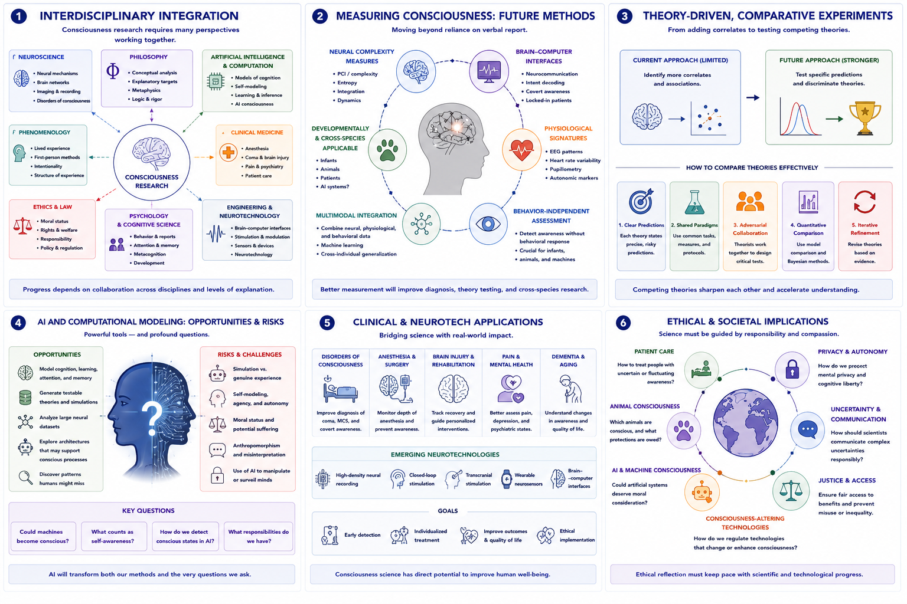
```

As Figure @ref(fig:fig-future-directions) illustrates, future consciousness research will likely depend on integration across multiple explanatory levels, methods, and disciplines. The field is moving beyond the search for single neural correlates toward broader questions involving computation, embodiment, phenomenology, clinical assessment, artificial intelligence, ethics, and metaphysics.

## Why Consciousness Research Is Changing

Several developments are reshaping consciousness studies.

First, neuroscience now provides much more powerful tools for measuring brain activity. Neuroimaging, EEG, intracranial recording, stimulation methods, and computational analysis allow researchers to study consciousness across waking states, anesthesia, sleep, disorders of consciousness, and altered states [@dehaene2014; @koch2016; @laureys2005].

Second, artificial intelligence has changed the conceptual landscape. Modern AI systems can generate language, solve problems, imitate self-report, and display forms of adaptive behaviour. These abilities force researchers to distinguish intelligence from consciousness more carefully [@dehaene2017; @butlin2023].

Third, altered-state research is expanding. Studies of psychedelics, meditation, dreaming, anesthesia, and dissociation provide new ways to examine selfhood, perception, salience, and conscious content [@carhartHarris2019; @lutz2008].

Fourth, clinical research has shown that consciousness may persist even when behavioural responsiveness is absent. Cases of covert consciousness in non-responsive patients challenge simple behaviour-based definitions of awareness [@owen2006; @monti2010].

Fifth, philosophical debate remains active. The hard problem, explanatory gap, qualia, panpsychism, illusionism, and consciousness-first theories continue to challenge purely mechanistic accounts [@nagel1974; @levine1983; @frankish2016; @goff2019].

Together, these developments show that consciousness research is becoming broader, more empirical, more computational, more clinically relevant, and more philosophically demanding.

## Interdisciplinary Integration

Future consciousness research will likely require deeper collaboration among neuroscientists, psychologists, AI researchers, clinicians, philosophers, computational modelers, phenomenologists, ethicists, and contemplative scholars.

Each discipline contributes something different. Neuroscience studies brain mechanisms, connectivity, anesthesia, disorders of consciousness, and large-scale integration. Psychology studies perception, attention, memory, metacognition, emotion, and report. Artificial intelligence explores computation, self-modeling, prediction, learning, and machine cognition. Phenomenology investigates lived experience, embodiment, intentionality, selfhood, and temporal structure. Clinical medicine applies consciousness research to coma, anesthesia, pain, dementia, psychiatric disorders, and end-of-life care. Philosophy clarifies explanatory targets, conceptual assumptions, metaphysical commitments, and the hard problem.

The future of the field will likely depend on connecting these perspectives rather than allowing them to develop separately. A neuroscientific theory that ignores phenomenology may miss the structure of experience. A philosophical theory that ignores neuroscience may become disconnected from evidence. A computational theory that ignores embodiment may explain intelligence without explaining lived awareness. A consciousness-first theory that ignores empirical methods may remain difficult to evaluate scientifically.

The central future task is integration across levels.

## Improved Measures of Consciousness

One of the largest future priorities is developing measures of consciousness that do not rely entirely on verbal report. This is especially important for infants, non-human animals, anesthetized individuals, locked-in patients, patients with severe brain injury, and possibly artificial systems.

Current consciousness assessment often depends on behaviour or communication. However, behaviour can be misleading. A person may be conscious but unable to respond. An artificial system may produce language without being conscious. An animal may have experience without human-like report.

Future methods will likely combine several kinds of evidence.

Neural complexity measures are one promising direction. Measures related to perturbational complexity, integration, neural entropy, and large-scale connectivity attempt to assess whether a system has the kind of organized complexity associated with consciousness [@casali2013; @massimini2005].

Brain-computer interfaces may also become increasingly important. They may allow communication with patients who cannot move or speak, especially in cases of covert consciousness [@owen2006; @monti2010].

Physiological and neural signatures may help track conscious state during anesthesia, sleep, coma, and altered states. These could include EEG dynamics, recurrent processing, global integration, complexity, and thalamocortical coordination.

The goal is not to find one simple consciousness meter. Consciousness is likely multidimensional. Future assessment may require converging evidence from brain activity, behaviour, physiology, computational structure, and theory-based criteria.

## Theory-Driven Experiments

Historically, many consciousness studies focused on identifying neural correlates of consciousness. This work remains important, but future progress will require more direct comparison between competing theories.

Theory-driven experiments ask not only whether a brain pattern correlates with consciousness, but which theory best predicts the pattern. For example, experiments may compare Global Workspace Theory and Integrated Information Theory, Predictive Processing and Higher-Order theories, or Recurrent Processing and global access models [@baars1988; @dehaene2011; @tononi2004; @oizumi2014; @lamme2006; @rosenthal2005].

Future research may increasingly use adversarial collaboration. In this approach, theorists with competing views agree in advance on experimental designs, predictions, and interpretation criteria. This can reduce confirmation bias and make theory comparison more rigorous.

Theory-driven research is important because many theories can explain the same findings after the fact. Stronger progress requires experiments that produce different predictions for different theories.

A mature science of consciousness will not only collect more data. It will design experiments that discriminate between explanations.

## Computational Modeling and Artificial Intelligence

Artificial intelligence will play two major roles in future consciousness research. First, AI will serve as a scientific tool for modeling cognition. Second, AI will become a subject of philosophical and ethical concern in its own right.

As a scientific tool, AI can help researchers model learning, prediction, attention, memory, self-monitoring, language, decision-making, and adaptive behaviour. Computational models can make theories more precise and testable. They can clarify what kinds of architectures are needed for global access, self-modeling, metacognition, predictive inference, or recurrent processing [@friston2010; @clark2013; @clark2016].

As a subject of ethical concern, AI raises the question of whether artificial systems could ever become conscious. This question is theory-dependent. Functionalist and computational theories are generally more open to artificial consciousness. Embodied theories emphasize bodily interaction and regulation. Integrated Information Theory asks about intrinsic causal structure. Higher-Order and Attention Schema theories ask about self-monitoring and models of attention. Consciousness-first theories ask whether artificial systems can participate in or manifest consciousness in a deeper sense [@butlin2023; @taheri2020; @taheri2023].

Future AI research will need to distinguish carefully between convincing behaviour and genuine consciousness. A system may use human-like language without subjective experience. Conversely, future systems could develop consciousness-relevant architectures before society has reliable methods for recognizing them.

This uncertainty makes AI consciousness one of the most important future frontiers.

## Simulation and Experience

A major future debate will concern the distinction between simulation and instantiation. A system may simulate conscious behaviour without actually being conscious. A weather simulation does not produce rain. A simulation of digestion does not digest food. The question is whether a simulation of consciousness would instantiate consciousness or merely imitate it.

Functionalists argue that if the right causal organization is implemented, consciousness may be instantiated regardless of biological substrate. Biological and embodied theorists argue that simulation may lack living regulation, affect, interoception, and bodily engagement. IIT-inspired approaches ask whether the system has intrinsic causal integration rather than merely input-output similarity [@tononi2004; @oizumi2014]. Consciousness-first approaches may ask whether the system relates to consciousness as foundational reality rather than generating it computationally [@taheri2020; @taheri2023].

This debate will become more urgent as artificial systems become more sophisticated. The future challenge will not be simply whether AI behaves intelligently, but whether any artificial architecture can support subjective experience.

## Neurotechnology and Brain Interfaces

Emerging neurotechnologies may significantly transform consciousness research. These include high-density neural recording, brain-computer interfaces, closed-loop stimulation, neural decoding, non-invasive stimulation, and consciousness monitoring technologies.

These tools may improve understanding of neural integration, conscious access, covert awareness, disorders of consciousness, and altered states. They may also allow new forms of communication with patients who are unable to move or speak.

Clinical applications may include improved anesthesia monitoring, diagnosis of disorders of consciousness, treatment of depression or chronic pain, neurorehabilitation after brain injury, and communication support for locked-in patients.

At the same time, neurotechnology raises ethical concerns. Technologies capable of reading, influencing, or altering brain states raise questions about privacy, autonomy, cognitive liberty, consent, and manipulation of conscious experience.

Future consciousness research will therefore require close collaboration between science and ethics.

## Clinical Applications

Consciousness research has major medical importance. Future advances may improve diagnosis, treatment, and care in anesthesia, coma, dementia, traumatic brain injury, psychiatric illness, chronic pain, and end-of-life decision-making.

One important future direction is improved detection of covert consciousness. Some patients who appear behaviourally unresponsive may retain awareness [@owen2006; @monti2010]. Better tools could improve communication, reduce misdiagnosis, and inform ethical decisions.

Another direction is anesthesia monitoring. Understanding how anesthetic agents disrupt consciousness may help prevent intraoperative awareness and improve patient safety.

A third direction is personalized consciousness medicine. Future care may use individualized neural profiles, adaptive stimulation, brain-computer interfaces, and targeted rehabilitation strategies.

A fourth direction concerns psychiatric disorders. Conditions such as depression, dissociation, psychosis, anxiety, and trauma involve altered selfhood, salience, emotion, and perception. Consciousness research may help clarify these conditions in terms of predictive processing, self-modeling, embodiment, and affective regulation [@seth2021; @friston2010].

Clinical consciousness research is therefore not only theoretical. It has direct implications for suffering, communication, treatment, and human dignity.

## Psychedelics and Altered States

Research involving psychedelics, meditation, dreaming, and other altered states is expanding. These states provide valuable windows into perception, selfhood, time, emotion, salience, embodiment, and meaning.

Psychedelic research is especially important because it can alter self-boundaries, sensory intensity, emotional salience, and meaning attribution while preserving wakefulness. Predictive-processing accounts often interpret these changes in terms of altered priors, precision weighting, and increased flexibility in hierarchical models [@carhartHarris2019; @friston2010].

Meditation and contemplative practices are also important because they show that attention, self-awareness, emotional regulation, and bodily awareness can be trained and transformed [@lutz2008]. These practices may help researchers study meta-awareness, nondual experience, self-boundary changes, and altered temporality.

Future research should combine careful phenomenological reports with neural recording, computational modeling, and clinical outcome measures. Altered states should not be treated as simple proof of any single metaphysical theory. They should be studied as structured transformations of conscious experience.

## Integration with Phenomenology

Future consciousness science will likely need stronger integration with phenomenology. Phenomenology helps describe what experience is like from the first-person perspective. It clarifies temporal structure, bodily awareness, selfhood, intentionality, emotion, and lived meaning.

If consciousness science ignores first-person experience, it risks ignoring the very phenomenon it aims to explain. However, phenomenology must also be methodologically disciplined. Introspection can be limited, biased, and shaped by language or expectation.

Future methods may include structured phenomenological interviews, experience sampling, dream reports, meditation-based introspective training, neurophenomenology, and careful integration of first-person reports with neural data [@varela1996; @thompson2007].

Neurophenomenology is especially important because it attempts to connect disciplined first-person reports with third-person neuroscience [@varela1996]. This approach may help bridge the gap between lived experience and measurable brain dynamics.

The future of consciousness research may therefore require not only better brain scans, but better descriptions of experience.

## Cross-Species Consciousness Research

Future research will likely expand comparative studies of consciousness across species. Mammals, birds, cephalopods, insects, and other animals may possess different forms of awareness. Understanding these differences can help clarify the evolutionary origins and minimal requirements of consciousness.

Cross-species research raises difficult methodological questions. Animals cannot provide human-like verbal reports. Researchers must infer consciousness from behaviour, neural organization, learning flexibility, pain responses, attention, and adaptive action.

This research has major ethical implications. If more animals possess conscious experience than previously assumed, then moral responsibilities toward them may expand.

Future comparative consciousness research will need to avoid both anthropomorphism and under-attribution. The goal is not to assume animals experience the world exactly as humans do, but to understand diverse forms of consciousness on their own terms.

## Consciousness-First Frameworks and Future Research

Future consciousness research may also need to engage more carefully with consciousness-first frameworks. These include panpsychism, cosmopsychism, idealist approaches, and Taheri’s T-Consciousness.

Panpsychism proposes that consciousness or proto-consciousness is fundamental within reality [@goff2017; @goff2019]. T-Consciousness presents consciousness as foundational and non-material, with matter, life, and organization understood in relation to consciousness rather than consciousness being produced only by physical processes [@taheri2020; @taheri2023].

These frameworks are important because they directly challenge the assumption that consciousness must be derived from non-conscious matter. They may also provide conceptual resources for rethinking the hard problem, altered states, and the relationship between life and awareness.

However, future work must be careful. Consciousness-first frameworks should not be presented as empirically established simply because they address deep philosophical questions. To become more influential within broader consciousness science, they will need clearer definitions, careful comparison with existing theories, and stronger links to empirical or phenomenological methods.

The most productive future role for T-Consciousness may be as part of a broader comparative inquiry into whether consciousness is derivative, emergent, fundamental, or foundational.

## Ethical Questions

Future consciousness research raises profound ethical questions. These questions concern uncertain awareness, AI systems, animal suffering, neurotechnology, altered states, and the manipulation of conscious experience.

Disorders of consciousness raise urgent ethical questions. How should patients with uncertain awareness be treated? How should evidence of covert consciousness affect medical decisions? How should clinicians communicate uncertainty to families?

Animal consciousness raises questions about suffering, welfare, experimentation, farming, and moral protection.

Artificial consciousness raises questions about whether future AI systems could suffer, deserve moral consideration, or require rights [@bostrom2014; @floridi2016; @butlin2023].

Neurotechnology raises questions about privacy, autonomy, mental manipulation, cognitive liberty, and the ownership of neural data.

Altered-state research raises questions about consent, vulnerability, interpretation, and responsible communication.

Ethics should not be added after the science is complete. It must develop alongside consciousness research.

## Responsible Communication

As consciousness research becomes more publicly visible, responsible communication will become increasingly important. Claims about AI consciousness, psychedelic states, covert awareness, animal consciousness, or consciousness-first theories can easily be misunderstood or exaggerated.

Researchers should communicate uncertainty clearly. They should avoid false hope in clinical contexts, avoid over-attributing consciousness to AI systems, avoid dismissing animal consciousness without evidence, and avoid presenting speculative theories as settled science.

Responsible communication is especially important because consciousness research touches identity, suffering, death, personhood, spirituality, medicine, and technology. These topics affect public trust and ethical decision-making.

A mature field must balance openness with caution.

## Limits and Humility

Despite rapid progress, major uncertainties remain. Consciousness may not be reducible to a single variable, brain region, algorithm, or theory. It may require multi-level explanation involving neural dynamics, computation, embodiment, phenomenology, self-modeling, and metaphysics.

Future researchers should be cautious about premature claims. No current theory has solved all aspects of consciousness. The hard problem remains contested. Machine consciousness remains uncertain. Consciousness-first frameworks remain philosophically important but empirically challenging. Neural measures are improving but are not perfect consciousness detectors.

The field must balance empirical rigor with conceptual humility. Consciousness research requires openness to new frameworks, but also careful standards of evidence.

## Main Comparative Conclusion

The future of consciousness research will likely not belong to a single theory, discipline, or methodology. Progress will depend on interdisciplinary collaboration, theory-driven experimentation, improved measurement techniques, integration of phenomenology and neuroscience, responsible AI research, clinical applications, and ethical reflection.

Future advances may significantly improve understanding of conscious access, neural integration, selfhood, altered states, disorders of consciousness, animal awareness, and artificial systems.

At the same time, foundational questions concerning subjective experience, qualitative feeling, and the hard problem may remain among the deepest challenges in science and philosophy.

The future of consciousness studies will therefore require integration across neuroscience, computation, phenomenology, embodiment, ethics, philosophy, and consciousness-first inquiry rather than reduction to any single framework alone.

## Chapter Summary

Consciousness research is entering a period of rapid transformation. Advances in neuroscience, artificial intelligence, computational modeling, neurotechnology, altered-state research, clinical medicine, and philosophy are creating new opportunities and new challenges.

Future progress will likely require interdisciplinary integration. Neuroscience, AI, phenomenology, medicine, philosophy, ethics, and embodied cognition each contribute different tools.

Improved measures of consciousness will be essential, especially for infants, animals, impaired patients, anesthetized individuals, and artificial systems. Future methods may combine neural complexity, brain-computer interfaces, EEG, behavioural evidence, and theory-based criteria.

Theory-driven experiments will become increasingly important. Rather than only identifying neural correlates, future studies should directly compare competing theories.

AI will become both a tool and a challenge. It will help model cognition, but it will also raise difficult questions about machine consciousness, moral status, and the distinction between simulation and experience.

Neurotechnology and clinical research may improve diagnosis, communication, anesthesia monitoring, rehabilitation, and treatment of altered or impaired consciousness.

Phenomenology will remain essential because consciousness science must describe experience itself, not only external mechanisms.

Consciousness-first frameworks, including T-Consciousness, may play a future role in broadening conceptual debate, especially around the hard problem and the possibility that consciousness is foundational. However, they require careful clarification and comparison with empirical research.

The central lesson is that future consciousness research will need both scientific rigor and philosophical openness. The field is advancing, but the deepest questions remain open.

<!--chapter:end:26-future-directions.Rmd-->

# References {-}

The references are generated automatically from `references.bib` when the book is rendered.

<!--chapter:end:27-references.Rmd-->

